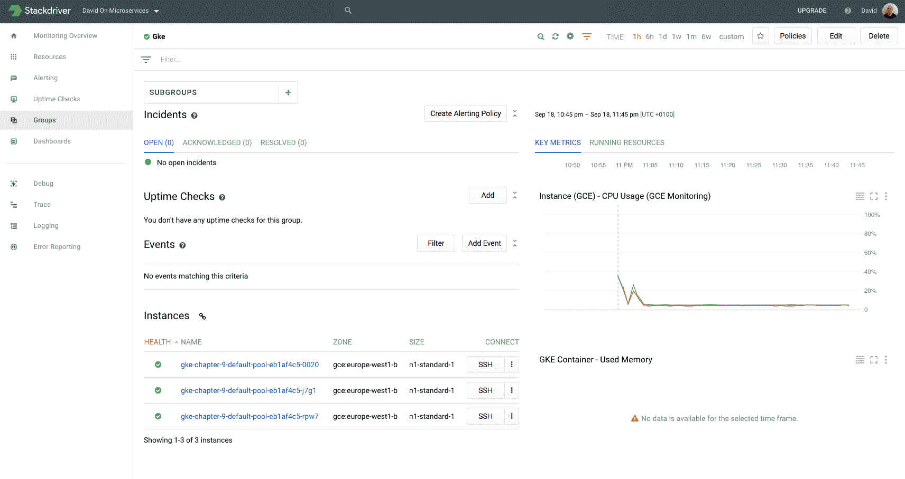

# 第九章：监控

# 介绍

到目前为止，我们已经看到了一大批可以作为 DevOps 工程师在公司中使用的工具，来增强我们的能力。现在我们能够使用 Ansible 配置服务器，在谷歌云平台上创建 Kubernetes 集群，并为我们的微服务设置交付流水线。我们也深入探讨了 Docker 的工作原理，以及我们应该如何组织公司，才能成功交付软件。

在这一章中，我们将讨论 **缺失的拼图**：监控。通常被忽视，但在我看来，监控是成功的 DevOps 公司中一个关键的组成部分。监控是应对问题的第一道防线。在 第八章，*发布管理 – 持续交付* 中，我们谈到了如何将焦点转向解决出现的问题，而不是花费大量资源去预防它们：

你 20% 的时间将创造出 80% 的功能。剩下的 20% 将花费你 80% 的时间。

这条非书面规则主宰着世界。通过监控，我们可以利用这一规则，生活得更加舒适，因为我们能够快速识别问题，从而应对 20% 的未知结果。

我们将回顾一些用于监控软件的工具，但我们的重点将放在 Stackdriver 上，因为它是谷歌云平台的监控解决方案，开箱即用，提供了一个相当全面的工具集，帮助我们应对系统中的缺陷。

# 监控类型

在谷歌的 SRE 书中，定义了两种类型的监控：

+   黑盒监控

+   白盒监控

这是大家普遍接受的观点，导致出现了大量明显区分的工具，围绕白盒和黑盒监控。

我听过的最好的白盒与黑盒监控的对比之一是骨折诊断。当你第一次去看医生时，他/她只能接触到你的黑盒指标：

+   这个区域有任何凸起吗？

+   移动时是否疼痛？

然后，一旦初步诊断已经做出，下一步就是获取该区域的 X 光片。现在我们可以确认骨头是否断了，如果断了，系统的影响是什么。X 光片就是医生使用的白盒监控。

# 黑盒监控

白盒监控是从外部观察系统的一种监控方式，而不需要了解系统是如何构建的。这些指标是首先影响用户的，亦是应用或服务器出现问题时的第一外部症状。

在可用于黑盒监控的指标中，我们可以找到以下几种：

+   延迟

+   吞吐量

这两种指标是黑盒监控的圣杯。

延迟的定义是系统响应所需的时间。如果我们看一个 HTTP 服务器，从我们第一次发送请求到对方服务器回复的时间，就是我们所理解的延迟。这个指标非常有趣，因为它直接反映了用户如何感知我们的系统：延迟越大，用户体验就越差。

吞吐量与延迟密切相关。基本上，它是我们软件每单位时间可以处理的请求数量，通常以秒为单位。这个指标对容量规划至关重要，而且不建议在运行中的系统中实时测量它，因为它会给系统带来很大的负载，肯定会影响实时用户的响应时间。一般来说，吞吐量是在我们应用程序的性能测试阶段进行衡量的，但这可能会有些棘手：

+   测试硬件必须与生产环境匹配

+   数据库的数据集必须与生产环境类似

性能测试步骤通常被许多公司忽视，因为它非常昂贵。因此，通常使用预生产环境进行容量测试，以估算生产环境中所需的硬件数量。现在，随着云基础设施中自动扩展组的出现，这个问题变得不那么严重，因为基础设施在需要时会自动扩展。

如你所见，这些指标非常容易理解，尽管它们在错误响应时间中起着关键作用，但它们可能不是问题的首要指标。

# 白盒监控

白盒监控，顾名思义，是一种需要了解系统构建方式的监控，以便在应用程序或基础设施内部发生某些事件时发出警报。这些指标非常细粒度（与黑盒监控不同），一旦我们收到警报，它们就是事后分析的主要答案：

+   问题出在哪里？

+   问题的原因是什么？

+   哪些流受到了影响？

+   我们可以做些什么来避免未来出现这种情况？

这些是非常有趣的一组示例，除了其他指标：

+   函数执行时间

+   每单位时间的错误数

+   每单位时间的请求数

+   内存使用情况

+   CPU 使用率

+   硬盘使用情况

+   每单位时间的 I/O 操作

如你所见，为确保系统的稳定性，有无尽的白盒监控指标可供选择。数量几乎太多，所以我们通常需要选择合适的指标，以避免噪音。

这里一个重要的细节是，当黑盒监控指标给出异常读数时，总会有一个白盒监控指标可以用来诊断，但反过来就不一定成立。服务器可能由于内部问题导致内存使用激增，但这不会影响用户。

白盒监控中最重要的一个工件就是日志文件。这些文件是我们软件中发生事件的有序链条，通常，它们是诊断与软件相关问题的第一道防线。日志文件的主要问题在于，它们存储在生产服务器上，我们不应定期访问这些日志文件，因为这本身就是一种安全威胁。只需要一个被遗忘的终端连接到服务器，就可能给不该访问的人提供权限。

# 监控第三方工具

监控通常是涉及第三方公司的一个不错选择。它需要系统中有相当多的冗余，以保持监控的持续运行，这对确保我们不会对系统发生的情况视而不见至关重要。

使用第三方应用进行监控的另一个积极方面是，它们不在同一数据中心运行，如果它们确实在同一个数据中心（通常是 AWS），它们的冗余性足以确保稳定性。

在本节中，我们将特别关注三种工具：

+   Pingdom

+   Logentries

+   AppDynamics

这并不意味着它们是市场上最好的或唯一的工具。还有其他一些有趣的替代品（例如，使用 New Relic 代替 AppDynamics），值得探索，但在本节中，我们将重点讨论 Stackdriver，这是 Google Cloud Platform 的监控解决方案，原因有以下几点：

+   它与 Google Cloud Platform 的集成非常好

+   它提供一个非常有趣的免费套餐

+   警报系统是市场上最先进的系统之一

# Pingdom

Pingdom 是一个用来衡量我们服务器从世界不同地方的延迟的工具。如你所见，如果你曾在一个 24/7 的公司工作过，你会发现全球各地的延迟差异很大，这取决于我们的客户与数据中心之间的距离。有趣的是，如果我们的服务器在欧洲，来自澳大利亚的用户将会多出 2-3 秒的延迟。

Pingdom 在全球多个地方都有服务器，用来监控用户如何看到系统并采取适当的措施解决问题（例如，建立一个离他们更近的数据中心）。

你可以免费注册 Pingdom，享受 14 天的试用期，但需要提供信用卡信息（不用担心；他们会在试用期结束时提醒你，这样你可以在不继续使用的情况下取消计划）。

请看以下截图：


如你所见，在指定主机之后，Pingdom 将开始向指定的 URL 发出请求，并测量从世界不同地方的响应时间。

最近，Pingdom 加入了一些相当有趣的功能：现在它可以通过端点读取自定义指标，从而监控大量数据：

+   磁盘上的空闲空间

+   已使用的 RAM 量

+   库存水平（是的，您可以将仓库中剩余的任何商品数量发送到 Pingdom）

总体来说，我过去使用 Pingdom 成功地测量了服务器的延迟，并通过在全球范围内战略性地分布数据中心来改善用户体验，缓解了这个问题。Pingdom（以及类似工具）能给您的一些最有趣的见解是，您的网站可能由于互联网网络分裂或某些 DNS 服务器的故障而无法访问（在后一种情况下，网站并未真正宕机，但 Pingdom 和用户将无法访问它）。

# Logentries

Logentries 是一家让您在处理大量日志时轻松许多的公司。它基本上解决了一个困扰了几年的问题：它将来自系统的所有日志聚合到一个公共位置，提供访问控制，并且拥有一个非常不错的界面，允许您在大型数据集中快速搜索。

创建账户是免费的，并且提供 30 天的使用期限，带有一些足够进行测试和评估的限制。

访问 [`logentries.com/`](https://logentries.com/) 并创建一个账户。登录后，首个屏幕应与以下截图相似：


如您所见，关于如何配置日志聚合的平台有无尽的解释：您可以从系统到库，经过多个平台（如 AWS、Docker 等）进行监控。

代理通常是一个不错的选择，原因有二：

+   它们不会在您的应用程序中创建耦合（代理读取日志文件并将其发送到 Logentries 服务器）

+   它们将复杂性推给了第三方软件

但也有其他有趣的选择，例如手动日志聚合。在本例中，我们将演示如何使用自定义日志记录器将日志从一个非常简单的 Node.js 应用程序发送到 Logentries。创建一个名为 `logentries` 的文件夹并执行以下命令：

```
npm init
```

这假设您的系统已经安装了 Node.js，因此如果没有安装，请从[`nodejs.org/en/`](https://nodejs.org/en/)下载任何版本的 Node.js 并安装。

现在我们需要为 Node.js 安装 Logentries 库。Logentries 支持多种平台，但特别支持 Node.js。执行以下命令：

```
npm install --save le_node
```

完成后，我们应该已安装所需的库。现在是创建一个简单的 `Node.js` 程序以演示其工作原理的时候了，但首先，我们需要创建一个服务令牌。在接下来的屏幕上，点击“手动”并填写表单，如下所示：


Logentries 能理解多种不同类型的日志，但它在 JSON 日志方面表现尤为出色。我们不需要为它捕捉日志指定任何日志类型，所以将此选项留空，并为日志和集合命名。点击创建日志令牌后，令牌应该会显示在按钮下方。保存起来，稍后会用到。

现在，如果我们进入主仪表盘，我们应该能看到名为 Testing Set 的日志集：


现在是时候发送一些数据了：

```
const Logger = require('le_node')
const logger = new Logger({token: '5bffdd28-fb7d-46b6-857a-c3a7dfed5410'})

logger.info('this is a test message')
logger.err('this is an error message')
logger.log('debug', {message: 'This is a json debug message', json: true})
```

这个脚本足以将数据发送到 Logentries。请注意，指定的 token 必须替换为在前一步中获取的 token。将其保存为`index.js`并执行几次：

```
node index.js
```

执行几次后，返回 Logentries，打开 Testing Set 中的 Test log：


现在你可以看到我们在 Logentries 中的日志被聚合了。Logentries 中有一些随着时间不断改进的有趣功能：

+   界面非常简洁

+   搜索机制非常强大

+   Logentries 能够实时流式传输日志（或多或少）

关于搜索机制，Logentries 开发了一种名为**LEQL**的工具，这基本上是 Logentries 为了通过 JSON 字段或纯文本搜索某些事件而设计的一种语言。你可以在[`docs.logentries.com/v1.0/docs/search/`](https://docs.logentries.com/v1.0/docs/search/)找到更多信息。

另一个有趣的功能是实时跟踪日志。让我们来测试一下这个功能。创建一个名为`livetail.js`的新文件，并添加以下代码：

```
const Logger = require('le_node')

const logger = new Logger({token: '5bffdd28-fb7d-46b6-857a-b3a7dfed5410'})

setInterval(() => {
 logger.info(`This is my timed log on ${Date.now()}`)
}, 500)
```

这个不需要解释：一个每 500 毫秒执行一次的函数，并将一行日志发送到 Logentries。

执行脚本：

```
node livetail.js
```

看起来似乎什么都没发生，但实际上事情正在发生。返回 Logentries 并点击“开始实时跟踪”按钮：


几秒钟后（或更少），日志开始流动。这可以在 Logentries 中存储的任何日志文件上完成，而且这是一个非常有趣的机制，用于调试我们服务器中的问题。

Logentries 还能够向某个邮箱发送警报。你可以配置它向你的团队发送以下警报：

+   异常

+   模式

+   缺少日志

+   增加的活动

这个警报通常是系统出现问题的第一个指示器，因此，如果你希望对错误做出早期响应，最佳实践是尽量减少噪声，直到警报不会被遗漏，并将假阳性减少到最低限度。

# AppDynamics

AppDynamics 曾一度是监控领域的王者（因为它是唯一真正可用的选项）。它是一款非常精心设计的软件，允许你探索软件和服务器的运行情况：异常、单位时间内的请求数、CPU 使用率等是 AppDynamics 能为我们捕捉的众多指标之一。

它还捕捉与第三方端点的交互：如果我们的软件正在使用第三方 API，AppDynamics 将会知道并在类似于下方截图的仪表板中显示这些调用：


AppDynamics 在主动措施方面相当先进。其中一项措施是自动化操作，例如在某些事件发生时重启 Tomcat 服务器或重新加载服务器上运行的服务。例如，如果我们部署了一个新的 Java 应用版本，并且它在 PermGen 空间方面出现问题（在 Java 8+ 中不再是这个问题），这个问题通常非常难以修复，因为它源自 JVM 加载的许多类，并且只有在部署后几个小时才会显现出来。在某些情况下，我们可以指示 AppDynamics 在使用量达到分配总量的 80% 及以上时重新启动应用程序，这样我们就不会完全崩溃并无法为任何客户提供服务，而是每隔几个小时就会有少数掉线，借助气球动作来修复问题。

AppDynamics 采用所谓的代理模型。一个应用程序需要安装在你的服务器上（例如，Tomcat），以便收集指标并将其发送到集中式服务器进行处理，生成相关的仪表板并触发工作流。AppDynamics 的有趣之处在于，如果你不愿意将数据发送给第三方（这通常是处理高敏感数据的公司所要求的安全性），它们提供了一个本地部署版本的仪表板。

# Stackdriver

到目前为止，我们已经查看了来自不同第三方的一组工具，但现在我们将来看看 Stackdriver。Stackdriver 是一个云监控解决方案，已被 Google 收购并（未完全）集成到 Google Cloud Platform 中。这对于 GCP 来说是一个重要的步骤，因为提供集成的监控解决方案在如今几乎是必须的。

使用 Stackdriver，我们不仅能够监控应用程序，还能监控 Kubernetes 集群甚至独立的虚拟机。正如我们将看到的那样，集成还不像我们希望的那样无缝（可能在你阅读这篇文章时已经完成），但它足够好，可以被认为是市场中的重要玩家。

# 监控应用程序

Stackdriver 可以通过捕获指标和日志来监控独立应用程序。它支持主要平台和库，因此我们的技术选择不必担心。在这种情况下，我们将创建一个 Node.js 应用程序，原因有几个：

+   它易于理解

+   官方示例在 Node.js 版本上有很好的文档记录。

+   Node.js 正在逐渐成为企业和初创公司中的重要平台。

我们需要做的第一件事是编写一个小的 Node.js 应用程序。创建一个新的文件夹并执行以下命令：

```
npm init
```

按照屏幕上的指示操作，你现在应该已经在刚创建的文件夹中得到了 `package.json`。现在是时候安装依赖项了：

```
npm install --save @google-cloud/logging-bunyan @google-cloud/trace-agent express bunyan
```

我们将使用四个库：

+   **express**：用于处理 HTTP 请求

+   **bunyan**：用于记录我们应用程序的活动

来自 Google 的两个库用于与 Stackdriver 交互：

+   **logging-bunyan**：这个库将把 bunyan 的日志发送到 Stackdriver

+   **trace-agent**：这个库将追踪请求通过我们的应用程序

现在让我们创建一个简单的应用程序：

```
require('@google-cloud/trace-agent').start()
const express = require('express')
const bunyan = require('bunyan')
const LoggingBunyan = require('@google-cloud/logging-bunyan')
const loggingBunyan = LoggingBunyan()

const log = bunyan.createLogger({
 name: "stackdriver",
 streams: [
 {stream: process.stdout},
 loggingBunyan.stream()
 ],
 level: 'info'
})

const app = express()

app.get('/', (req, res) => {
 log.info(`request from ${req.connection.remoteAddress}`)
 res.send('Hello World!')
})

app.listen(3000, () => {
 console.log('Listening in port 3000')
})
```

现在是时候解释代码中有趣的部分了：

+   第一行启用了 Stackdriver 的追踪功能。非常重要的是，这一行必须在其他任何操作之前执行，否则追踪将无法工作。我们将看到追踪功能的强大之处。

+   为了让 Stackdriver 收集日志，我们需要向 bunyan 日志记录器添加一个流，代码中已展示。

其他一切都很正常：一个 `Express.js` Node.js 应用程序，处理 URL 请求并返回经典的 Hello World。

还有一个缺失的东西：没有用于访问远程 API 的凭证。这样做是故意的，因为 Google Cloud Platform 有一个非常复杂的凭证管理系统：基本上，它会为你处理这些。

现在，是时候部署我们的应用程序了。首先，在 Google Cloud Platform 创建一个虚拟机，就像我们在前面的章节中看到的几次一样。选择一个小型虚拟机即可，但要确保允许 HTTP 流量。Debian Stretch 是一个不错的操作系统选择。

一旦机器启动，安装 Node.js，如[`nodejs.org`](http://nodejs.org)所示。

现在我们需要将代码复制到新创建的机器中。最好的解决方案是创建一个 GitHub 仓库，或者使用我的：[`github.com/dgonzalez/stackdriver`](https://github.com/dgonzalez/stackdriver)。

通过在我们的虚拟机中克隆它（别忘了先通过 `apt` 安装 Git），我们只需要使用以下命令来安装依赖项：

```
npm install
```

我们已经准备好开始了。只需运行以下命令启动应用程序：

```
node index.js
```

现在转到机器的外部 IP（在 Google Compute Engine 中显示）并访问 `3000` 端口。在我的案例中，这是 [`35.195.151.10:3000/`](http://35.195.151.10:3000/)。

一旦我们完成，我们应该能在浏览器中看到 Hello World，并在我们的应用日志中看到类似以下内容：

```
Listening in port 3000
{"name":"stackdriver","hostname":"instance-3","pid":4722,"level":30,"msg":"request from ::ffff:46.7.23.229","time":"2017-09-18T01:50:41.483Z","v":0}
```

如果没有错误，那么一切正常。为了验证这一点，访问 [`console.cloud.google.com`](http://console.cloud.google.com) 并打开 Stackdriver 的日志部分。

Stackdriver 是一个与 Google Cloud Platform 不同的系统；它可能会要求你使用 Google 账户登录。

一旦你到达那里，你应该看到类似于以下截图的内容：


请注意，你必须选择日志部分，在我的情况下是 GCE VM 实例，Instance-3。

这正是从你的应用程序上传到 Google Cloud Platform 的日志，包含了一些非常有趣的信息。你可以尝试使用不同的处理程序来处理其他 URL 和不同的日志事件，但结果是一样的：所有日志都会聚合到这里。

现在，我们也可以使用 Trace 来实现这一点。打开 Google Cloud Platform 中 Stackdriver 下的 trace 部分。

屏幕应类似于以下截图所示（选择 trace 列表选项）：


如你所见，提供了很多有用的信息：

+   调用栈

+   持续时间

+   启始和结束时间

你也可以自己玩一玩，发出多个调用，熟悉它是如何工作的。现在，我们将修改我们的程序，调用第三方 API，看看 Stackdriver 如何追踪它：

```
require('@google-cloud/trace-agent').start()

const express = require('express')
const bunyan = require('bunyan')
const LoggingBunyan = require('@google-cloud/logging-bunyan')
const request = require('request')

const loggingBunyan = LoggingBunyan()

const URL = "https://www.googleapis.com/discovery/v1/apis"

const log = bunyan.createLogger({
 name: "stackdriver",
 streams: [
 {stream: process.stdout},
 loggingBunyan.stream()
 ],
 level: 'info'
})

const app = express()

app.get('/', (req, res) => {
 log.info(`request from ${req.connection.remoteAddress}`)
 res.send('Hello World!')
})
app.get('/discovery', (req, res) => {
 request(URL, (error, response, body) => {
   return res.send(body)
 })
})
app.listen(3000, () => {
 console.log('Listening in port 3000')
})
```

现在，我们通过执行 HTTP GET 请求访问[`www.googleapis.com/discovery/v1/apis`](https://www.googleapis.com/discovery/v1/apis) URL，列出了所有可用的 Google API。将其重新部署到 Google Cloud Platform 上的虚拟机中，然后访问虚拟机的 endpoint/discovery。一个大的 JSON 负载将会显示在你的屏幕上，但真正有趣的部分发生在后台。返回 Stackdriver 的 Trace 列表部分，你会看到一个新的 trace 正在被捕捉：


在这里，你可以看到我们的程序如何联系远程 API，并且它花费了 68 秒才得到回复。

实时获取这种信息非常强大——如果客户响应时间非常长，我们可以几乎实时地看到应用程序内部发生了什么。

# 监控 Kubernetes 集群

Kubernetes 覆盖了任何软件公司 99%的需求，但它在嵌入式监控方面并不十分出色，因此留给了第三方来填补这一空白。Kubernetes 的主要问题源于 Docker：容器是临时性的，因此常见的做法是将日志转储到标准输出/错误中，并使用*syslogd*将它们收集到一个集中位置。

使用 Kubernetes，我们遇到了一个额外的问题：Docker 上的调度器需要知道如何获取日志，以便通过 API 或仪表板将其提供，使用户在需要时能够访问它们。但是，随之而来的是另一个问题。通常，日志会根据时间进行轮换并归档，以避免日志溢出，这可能会消耗我们服务器上的所有可用空间，导致应用程序（以及操作系统）无法正常运行。

最佳解决方案是使用外部系统在集群内聚合日志和事件，从而将复杂性转移到一旁，让 Kubernetes 专注于它最擅长的事情：调度容器。

在这种情况下，为了将我们的集群与 Google Cloud Platform 中的 Stackdriver 集成，我们需要做的唯一事情就是在集群创建屏幕上勾选两个复选框：


这将启用跨我们集群中不同节点的监控，并改善我们处理应用程序中出现问题的方式。点击“创建”，允许集群被配置（可能需要几秒钟或几分钟的时间）。集群不需要很大；只需使用小型机器，两个虚拟机就足够了。公平地说，我们可能需要在负载测试期间减少规模，以加速警报部分的处理。

正如我们在前一部分看到的那样，启用 GKE 监控后，Kubernetes 还将日志发送到 Stackdriver 的日志功能，因此您无需连接到节点来获取日志。

一旦创建完成，我们将从 Stackdriver 添加监控。我们需要做的第一件事是打开 Google Cloud Platform 中 Stackdriver 部分的监控功能。这将打开一个新页面，原始的 Stackdriver 页面，外观与以下截图所示的非常相似：


尽管一开始用户界面可能有些令人困惑，但经过一段时间的使用后，我们会发现，Stackdriver 提供的大量功能很难在更好的 UI 中打包展示。默认情况下，我们可以看到一些关于集群的指标（图像右下角部分），但它们并不是非常有用：我们不希望有人整天盯着这些指标来触发警报。让我们来自动化它。我们需要做的第一件事是创建一个组。组基本上是一起工作的资源集合，在这种情况下，就是我们的集群。点击“组”并创建一个新组：


默认情况下，Stackdriver 会为您提供分组建议。在此情况下，在建议的组部分，我们可以看到 Stackdriver 已经建议了我们的集群。虽然可以添加更复杂的标准，但在这种情况下，匹配我们机器名称的开头就足够了，因为 GKE 会根据某些标准命名机器，集群名称会出现在名称的开头。

创建一个组（命名为 GKE，这是默认建议的名称）。创建组后，您可以导航到该组并查看不同的指标，如 CPU，或者甚至配置它们，添加其他如磁盘 I/O 等指标。熟悉一下仪表板：



在我的情况下，我添加了一个用于捕获集群中已用内存的指标。尽管这些可用数据非常有趣，但还有一个更强大的工具：警报策略。

警报策略是我们应该得到警报的标准：高内存使用率、低磁盘空间或高 CPU 利用率等事件，是我们希望了解的，以便尽快采取行动。警报策略的优点是，如果我们正确配置它们，我们就进入我所称的*自动驾驶*模式：除非收到警报，否则我们无需担心系统的性能，这大大减少了操作系统所需的人员数量。

点击“创建警报策略”按钮，来创建一个警报策略：


如前屏幕所示，我们需要选择一个度量标准。我们将使用“度量阈值”类型，因为它包含在 Stackdriver 的基础包中，所以我们不需要升级到 Premium 订阅。如果我们集群中的任何成员的 CPU 使用率超过 30％，且持续超过一分钟，就会触发警报。

下一步是配置通知。在基础包中，仅包含电子邮件功能，但它足以用来测试系统的运行情况。Stackdriver 还允许你在通知中包含文本。只需在电子邮件旁边输入类似`Test alert`的内容，并保存你选择名称的警报策略。

正如你所看到的，在 Stackdriver 中创建警报非常简单。这是一个非常简化的示例，但一旦你设置好了集群，下一步是设置一组正常操作的度量标准，并在其中任何一个被违反时接收警报。

现在是时候触发警报，看看会发生什么。为此，我们需要通过多个相同镜像的副本来过载集群，我们将使用 Apache Benchmark 工具给系统施加负载：

```
kubectl run my-nginx --image=nginx --replicas=7 --port=80
```

现在暴露名为`my-nginx`的部署：

```
kubectl expose my-nginx --type=LoadBalancer
```

请注意，你首先需要配置`kubectl`指向你的集群，正如我们在之前的章节中看到的那样。

nginx 部署完成后，接下来就该对其进行压力测试了：

```
ab -k -c 350 -n 4000000 http://130.211.65.42/
```

`ab`工具是一个非常强大的基准测试工具，叫做 Apache Benchmark。我们将创建 350 个并发消费者，它们将发出 400 万个请求。可能需要减少集群的规模来施加压力：如果在基准测试运行时减少规模，Kubernetes 将需要重新调度容器以重新组织资源，这将增加系统的负载。

我建议你进一步探索 Apache Benchmark 工具，因为它对于负载测试非常有用。

一旦任何节点的 CPU 使用超过阈值超过一分钟，我们应该通过电子邮件收到警报，并且它会显示在 Stackdriver 界面中：


在这个案例中，我收到了两个警报，因为两个节点超出了限制。这些警报遵循一个工作流。如果规则仍然被违反，你可以确认它们，一旦确认并且条件消失，它们就会变为已解决状态。在这种情况下，如果你停止 Apache Benchmark 并确认已触发的警报，它们会直接进入已解决状态。

在高级版本中，有更多高级策略，如 Slack 消息或短信，这使得你的团队能够设置一个轮班表来确认事件并管理相关操作。

# 总结

这是本书的最后一章。在整本书中，我们探讨了 DevOps 工程师使用的最重要的工具，重点介绍了 Google 云平台。在本章中，我们实验了我认为对任何系统都非常重要的一个方面：监控。我认为监控是应对已经影响到生产系统的问题的最佳方法，无论你投入多少努力，这些问题最终都会发生。

# 接下来是什么？

本书并没有对任何主题进行特别深入的探讨。这样做是有意为之。本书旨在播下大树的种子：DevOps 文化，目的是希望你能获得足够的信息来继续拓展对 DevOps 工具和流程的了解。

保持与最新工具同步是一项全职工作，但如果你想站在技术潮流的前沿，这非常必要。我认为我们很幸运能够参与 DevOps 文化的崛起与辉煌，未来一片光明。自动化和更好的编程语言（如 Golang、Kotlin、Node.js 等）将使我们减少人工干预，提升系统的整体弹性。

如果你回顾五年前并与今天市场上的情况进行对比，你能想象我们在 15 年后的工作会是怎样的吗？

如果你想跟进任何问题或查看我现在正在做的事情，你可以随时通过 LinkedIn 与我联系：

+   [`www.linkedin.com/in/david-gonzalez-microservices/`](https://www.linkedin.com/in/david-gonzalez-microservices/)
