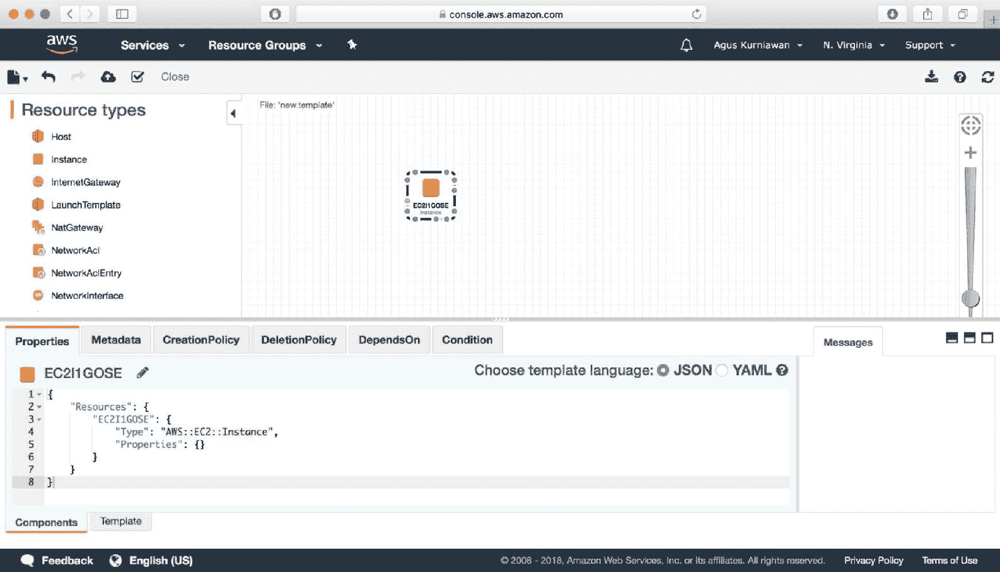

# 第一章：介绍 AWS CloudFormation

云技术使 IT 人员能够轻松构建虚拟数据中心，从而能够根据特定配置设置虚拟机。现在，**基础设施即代码**（**IaC**）通过脚本化方式构建虚拟数据中心。在本章中，我们将简要介绍 IaC 和 AWS CloudFormation 中的一些术语。

本章将覆盖以下主题：

+   介绍 IaC

+   AWS CloudFormation

+   CloudFormation 模板

+   CloudFormation 堆栈

+   CloudFormation StackSets

+   探索 AWS CloudFormation 控制台

# 介绍 IaC

云技术使你能够虚拟化管理服务器。我们可以在虚拟模型中设置内存、CPU 和存储。为了基于云平台构建数据中心，你设置你的资源，如虚拟机、虚拟网络和应用程序。有时，你需要重新配置数据中心设计或在其他位置重建它。你可能会执行相同的操作来构建你的数据中心。这些任务可能会让你感到不满。

IaC 可以被描述为一种可编程的基础设施，使你能够使用脚本管理资源配置，并自动化基础设施的提供以及部署。

IaC（基础设施即代码）的设计旨在减少手动配置中导致效率低下的复杂性。你可以将基础设施代码部署到开发、测试、预生产和生产环境。下图展示了 IaC 中的流程：


图 1.1：IaC 中的流程

假设你在几台机器上部署了一些资源，然后由于停电等灾难，一些机器发生故障。从技术上讲，你应该手动部署所有资源。IaC 的设计旨在帮助你自动部署基础设施。IaC 可以在部署现代基础设施时最小化你的风险。

我们可以使用单个 IaC 脚本模板在多个环境中部署基础设施。这种方法使我们能够最小化部署中的问题。我们不需要担心重新部署基础设施，因为我们已经拥有基础设施脚本。

# AWS CloudFormation

亚马逊 AWS 是一个基于云的服务平台，提供各种云服务。由于有大量云服务，我们可以部署任何服务器和任何程序用于通用或特定目的。AWS CloudFormation 旨在实现 IaC。你可以编写脚本来构建自定义基础设施。一旦完成，你可以部署一个表示基础设施即代码的模板，用于开发、测试、预生产和生产环境。

AWS CloudFormation 是一个动态基础设施的解决方案。你可以编写自己的基础设施，而无需担心重新配置和重新部署。AWS CloudFormation 允许你在文本文件中建模整个基础设施。这种方法可以标准化你组织中的基础设施资源，并加速故障排除过程。

AWS CloudFormation 帮助构建和重建基础设施和应用程序，无需执行手动操作或编写自定义脚本。

若要了解更多关于 AWS CloudFormation 的信息，可以访问其官方网站 [`aws.amazon.com/cloudformation/`](https://aws.amazon.com/cloudformation/)。

您将找到大量信息，例如特性、定价和文档，如以下截图所示：


图 1.2：官方 AWS CloudFormation 网站

目前，AWS CloudFormation 是免费的，但通常在 IaC 脚本中使用的资源不是。您可以在 [`aws.amazon.com/cloudformation/pricing/`](https://aws.amazon.com/cloudformation/pricing/) 上查看定价详情。

# 它是如何工作的？

AWS CloudFormation 提供了从脚本构建基础设施的解决方案。您可以为基础设施设计设置多个资源。一般情况下，请参阅以下流程图了解如何构建 IaC：


图 1.3：构建 AWS CloudFormation 的流程

首先，编写脚本以使用 AWS CloudFormation 构建基础设施；您应该使用 JSON、YAML 或文本编写 IaC 脚本。完成脚本后，您可以将该脚本文件上传到 AWS CloudFormation。您也可以首先将其放在 AWS S3 上，以便 AWS CloudFormation 直接下载。

AWS CloudFormation 为堆栈提供配置，并根据您的脚本创建 AWS 资源。您还可以为您的 CloudFormation 堆栈设置目标区域。

您可以使用单个 CloudFormation 模板在多个区域部署和复制 AWS 资源。如果想要在单个 CloudFormation 模板中处理不同区域的 AWS 资源，我们可以构建 AWS StackSets。

# 控制 IaC 源脚本

由于我们使用 JSON、YAML 和文本格式编写 IaC，所以可以保存这些脚本文件，并将其存储到源代码控制服务器上。您可以根据需要管理编辑的脚本版本。

您可以使用 Git 管理 IaC 脚本。一旦脚本发布，您可以将它们推送到 AWS CloudFormation 以配置您的 AWS 资源。以下图表显示了使用源代码控制进行 IaC 脚本编写：


图 1.4：使用源代码控制的 IaC 脚本

上述图表描述了如何将源代码控制与 AWS CloudFormation 结合使用。我们在本地计算机上编写 IaC 脚本。完成后，将脚本检入源代码控制服务器。如果您有一个测试团队，团队可以使用 AWS CloudFormation 测试脚本。

# CloudFormation 模板

我们可以在 AWS CloudFormation 中轻松开发 IaC。AWS 已经提供了一系列模板供我们设计 IaC。您可以使用 JSON、YAML 和文本编写 AWS CloudFormation 脚本。

例如，我们在 AWS CloudFormation 上使用 AWS S3。我们可以如下使用 JSON 编写 AWS CloudFormation 脚本：

```
{
 "Resources" : {
   "HelloBucket" : {
    "Type" : "AWS::S3::Bucket",
    "Properties" : {
        "AccessControl" : "PublicRead" 
    }
   }
 }
}
```

我们还可以使用 YAML 编写这些 IaC 脚本：

```
Resources:
 HelloBucket:
    Type: AWS::S3::Bucket
    Properties:
      AccessControl: PublicRead
```

你可以使用 JSON 或 YAML 来编写 IaC 脚本，并且当我们使用这些资源时，你需要学习 AWS CloudFormation API 中包含的参数。

有时候，当我们对 JSON 或 YAML 了解不多时，我们更倾向于以可视化方式构建 AWS CloudFormation。幸运的是，AWS 提供了 AWS CloudFormation 模板设计器。我们可以通过点击和拖动任何资源到编辑器中。你可以在以下截图中看到这一点：



图 1.5：AWS CloudFormation 模板设计器

如果你想在终端模式下工作，AWS 提供了 AWS CLI，它使你能够使用终端构建 AWS CloudFormation 模板。

AWS 还提供了 AWS CloudFormation 模板，因此你无需额外花费精力开发 CloudFormation 模板。你可以在[`docs.aws.amazon.com/AWSCloudFormation/latest/UserGuide/cfn-sample-templates.html`](https://docs.aws.amazon.com/AWSCloudFormation/latest/UserGuide/cfn-sample-templates.html)下载这些模板示例。

我们将在第三章《开发 AWS CloudFormation 模板》中了解更多有关 AWS CloudFormation 模板中 IaC 脚本的内容。我们将使用 JSON 和 YAML 脚本来开发 IaC。我们还将学习如何使用 AWS CloudFormation 模板设计器。

# CloudFormation 堆栈

所有你希望在 AWS 环境中构建的资源都应该在 CloudFormation 模板中定义。然后，我们将这个模板放入 CloudFormation 堆栈中。堆栈是一组 AWS 资源，你可以将其作为一个整体进行管理。你可以通过创建、更新或删除堆栈来创建、更新或删除一组资源。

在开发 AWS CloudFormation 堆栈时，确保所有带有 CloudFormation 模板的资源符合 AWS 区域要求。并不是所有区域的资源都相同。如果不符合，你在配置资源时会遇到问题。

有时候，我们在基础设施设计中使用多种资源，比如数据库集群。在这种情况下，我们可以开发 CloudFormation 嵌套堆栈。这意味着我们的 CloudFormation 堆栈由多个堆栈组成。例如，我们绘制了如下图所示的设计。CloudFormation 堆栈由两个堆栈组成：**B1** 和 **B2**。在 **B1 堆栈** 内，我们使用了三个 CloudFormation 堆栈：**C1**、**C2** 和 **C3**。然后，我们在 **C3 堆栈** 内构建了两个堆栈，如下所示的 AWS CloudFormation 嵌套堆栈模型：


图 1.6：AWS CloudFormation 嵌套堆栈示例模型

为了理解 AWS CloudFormation 堆栈，我们将在第二章《构建你的第一个 AWS CloudFormation 项目》和第三章《开发 AWS CloudFormation 模板》中深入探讨这个话题。我们将回顾一些场景，向你展示如何使用 AWS CloudFormation 堆栈。

# CloudFormation StackSets

如果您计划在多个区域部署 AWS 资源，可以使用 CloudFormation StackSet。从技术上讲，CloudFormation StackSet 旨在通过使用单个 AWS CloudFormation 模板，帮助您在多个区域的 AWS 账户中创建 CloudFormation 堆栈。

以下图示展示了 CloudFormation StackSet 的处理模型。在此场景中，如果要执行 StackSet，将生成一个 StackSet 实例。当 StackSet 被创建时，它会根据您的 CloudFormation 模板生成堆栈。由于这是一个 StackSet，AWS 将在其预定义区域内构建堆栈。下图展示了 StackSet 的处理模型：


图 1.7：StackSet 的处理模型

当我们编辑 StackSet 时，AWS CloudFormation 会更新所有堆栈。当我们执行删除 StackSet 的操作时，AWS CloudFormation 会删除与该 StackSet 相关的所有堆栈。

我们将在第四章中深入了解 *AWS CloudFormation StackSets*。本章将提供一些场景，向您展示 AWS CloudFormation StackSets 的工作原理。

# 探索 AWS CloudFormation 管理控制台

在本节中，我们将熟悉 AWS CloudFormation 管理控制台。要使用 AWS CloudFormation，您需要一个有效的 AWS 账户。您可以通过打开浏览器并访问 [`console.aws.amazon.com/cloudformation/`](https://console.aws.amazon.com/cloudformation/) 来访问 AWS CloudFormation 管理控制台。

现在，您应该能看到 AWS CloudFormation 管理控制台，如下截图所示。您可以点击“创建新堆栈”按钮来创建堆栈。如果您想创建一个 StackSet，可以点击“创建新 StackSet”按钮：


图 1.8：AWS CloudFormation 管理控制台

如果您想构建 CloudFormation 脚本模板，可以点击“设计模板”按钮。AWS CloudFormation 将提供 CloudFormation 设计器编辑器，帮助您构建自己的基础设施。您可以在 *图 1.5* 中看到此界面。

您应该为 AWS CloudFormation 设置您的工作区域。在 CloudFormation StackSet 中，我们可以为不同的堆栈使用不同的区域。

在 AWS CloudFormation 管理控制台中，我们可以管理所有的堆栈和 StackSets，包括编辑和删除它们的资源。

# 使用 AWS CLI 管理 CloudFormation

如果您通常喜欢在终端模式下工作，AWS 提供了 AWS CLI 来管理 AWS CloudFormation。您可以从终端创建堆栈和 StackSet，还可以更新和删除您的 CloudFormation 项目。

一些命令已被定义，用于通过 AWS CLI 管理 CloudFormation。如果你想使用 CloudFormation，应该使用这些命令。有关 AWS CLI 命令的更多信息，请查看[`docs.aws.amazon.com/cli/latest/reference/cloudformation/index.html`](https://docs.aws.amazon.com/cli/latest/reference/cloudformation/index.html)。

以下截图展示了如何通过 AWS CLI 创建 CloudFormation 堆栈。我们将在第二章《构建你的第一个 AWS CloudFormation 项目》中学习如何做到这一点：


图 1.9：使用 AWS CLI 管理 CloudFormation

本章结束了。我们回顾了一些 AWS CloudFormation 的术语。下一章我们将学习如何使用这个控制台。

# 总结

我们学习了一些 AWS CloudFormation 的术语，以更好地理解 AWS CloudFormation 是什么。接下来，我们将了解如何实现一个简单的 IaC 程序，并使用 AWS 进行部署。

# 问题

1.  什么是 IaC？

1.  IaC 的好处有哪些？

1.  AWS CloudFormation 的主要目标是什么？

1.  AWS CloudFormation 是如何工作的？

1.  如何构建 AWS CloudFormation 模板？

1.  什么是基础设施嵌套堆栈？

1.  为什么要实现 AWS CloudFormation StackSets？
