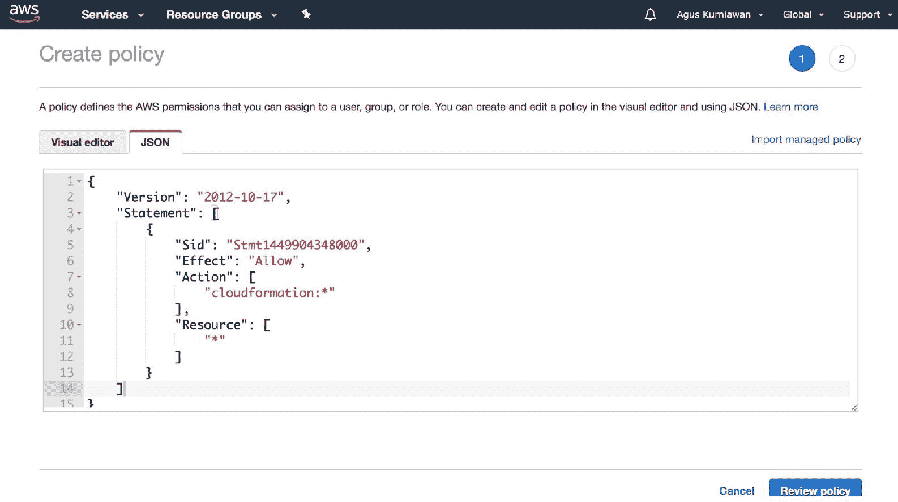
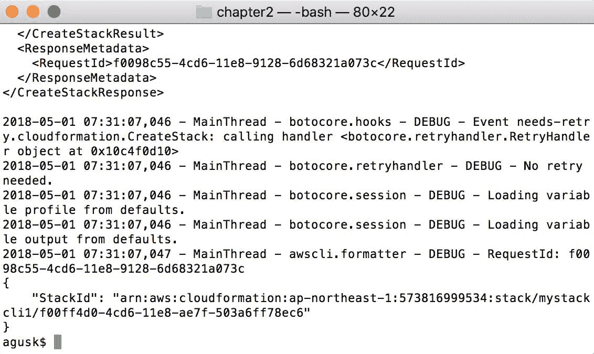

# 构建您的第一个 AWS CloudFormation 项目

我们可以使用 AWS CloudFormation 构建各种基础设施模型。我们可以在我们的基础设施设计中作为 IaC 添加、更新和删除 AWS 资源，然后将我们的 IaC 脚本部署到 AWS CloudFormation。在本节中，我们将构建一个简单的项目，展示如何使用 AWS CloudFormation 开发 IaC。

本章将涵盖以下主题：

+   准备项目

+   使用管理控制台实现 CloudFormation

+   使用 AWS CLI 实现 CloudFormation

+   管理 AWS CloudFormation 项目

# CloudFormation 项目场景

在上一章中，我们了解了什么是 AWS CloudFormation。在本章中，我们将继续探索 AWS CloudFormation。我们将专注于如何使用 CloudFormation 构建一个简单的 IaC。

为了简化问题的复杂性，我们将使用一个简单的 AWS 资源，如 Amazon S3，并通过 CloudFormation 在 Amazon S3 中创建一个存储桶。为了构建 CloudFormation 项目，我们将按照以下图示的步骤进行：


图 2.1：部署 AWS CloudFormation 的项目步骤

上图展示了如何构建和部署 CloudFormation 项目。在此场景中，我们将使用 CloudFormation 堆栈来构建 IaC 设计。步骤如下：

1.  在 CloudFormation 模板中构建 IaC 脚本，以定义用于构建基础设施的 AWS 资源

1.  将模板文件上传到 CloudFormation 服务器

1.  创建 CloudFormation 堆栈

1.  配置 CloudFormation 堆栈的所有选项

1.  在部署到 CloudFormation 服务器之前，检查所有设置

1.  部署 CloudFormation 堆栈

我们将把这些步骤应用到我们的 CloudFormation 项目中。每个步骤将在下一节中执行。

# 准备工作

从技术上讲，我们不需要任何特殊的准备。你应该拥有一个有效的 AWS 账户才能构建 CloudFormation 项目，此外你还需要一个互联网连接，因为我们通过互联网网络构建和管理 AWS。

最后，你应该注意定价。目前，CloudFormation 是免费的，但在 CloudFormation 项目中使用的 AWS 资源可能会产生费用。某些 AWS 资源是免费的，但有一些限制。

# 使用管理控制台实现 CloudFormation 项目

在本节中，我们将通过 CloudFormation 管理控制台图形化构建我们的第一个 CloudFormation 项目。请按照以下步骤操作：

1.  打开浏览器并访问[`console.aws.amazon.com/cloudformation`](https://console.aws.amazon.com/cloudformation)。

1.  使用你的有效 AWS 账户登录。登录成功后，你应该能够看到 AWS CloudFormation 管理控制台，如下图所示：


图 2.2：AWS CloudFormation 管理控制台

1.  要开始创建一个简单的 CloudFormation 项目，首先创建一个堆栈。

1.  点击*图 2.2*中显示的“创建新堆栈”按钮。

1.  现在你应该能看到以下截图所示的页面：


图 2.3：选择 CloudFormation 的模板

1.  在上面的截图所示界面中，上传一个 CloudFormation 模板文件。你可以上传模板文件，或者使用“设计模板”选项创建模板。如果你已经有一个上传到 Amazon S3 的 CloudFormation 模板文件，可以指定该文件的路径。

1.  在此演示中，我们将一个 CloudFormation 模板文件从本地上传到 Amazon S3。模板文件有 JSON 和 YAML 两种格式。

1.  现在，我们可以创建 JSON 和 YAML 格式的模板文件。你可以选择 JSON 格式的模板文件（`hello-cloudformation.json`）或 YAML 格式的模板文件（`hello-cloudformation.yaml`）。

以下是 `hello-cloudformation.json` 文件的内容：

```
{
 "Resources" : {
    "MySimpleBucket" : {
       "Type" : "AWS::S3::Bucket"
    }
 }
}
```

以下是 `hello-cloudformation.yaml` 文件的内容：

```
Resources:
 MySimpleBucket:
   Type: AWS::S3::Bucket
     Properties:
       AccessControl: PublicRead
```

1.  在创建 JSON 或 YAML 格式的 CloudFormation 模板文件后，你可以将其上传到 CloudFormation 管理控制台。

1.  选择*图 2.3*中显示的“上传模板到 Amazon S3”选项。

1.  然后，点击“选择文件”选项，从本地计算机选择你的模板文件。

1.  等待模板文件上传到 Amazon S3。

1.  上传完成后，点击“下一步”按钮继续项目的步骤。

1.  现在你应该能看到以下截图所示的界面：


图 2.4：添加堆栈名称

1.  填写堆栈名称，这用于 CloudFormation 中堆栈的标识。

1.  填写堆栈名称后，点击“下一步”按钮继续。

1.  你将看到以下截图，用于配置堆栈选项，如标签和权限：


图 2.5：配置堆栈选项

1.  在此演示中，我们不会配置 CloudFormation 堆栈中的任何选项，因此可以跳过这一步。点击“下一步”按钮继续。

1.  现在你可以看到审查界面，如下图所示：


图 2.6：执行前的确认，并将资源部署到 Amazon AWS

1.  审查你所设置的所有信息。

1.  完成后，点击“创建”按钮执行你的模板，然后将所有资源从预定义模板部署到 Amazon AWS。你的浏览器应该会自动跳转到 CloudFormation 仪表盘。你现在应该能看到正在创建堆栈的状态，如下图所示：


图 2.7：在 CloudFormation 中创建堆栈

1.  如果你想查看创建进度，可以点击右上角的圆形箭头。

1.  处理完成后，你应该能在“状态”列中看到它，以下截图显示了这个状态：


图 2.8：堆栈已完全创建

1.  如果你想查看已创建堆栈的详细信息，可以点击堆栈名称，如上图所示。

1.  然后，你将看到选定 CloudFormation 堆栈的详细信息。以下截图显示了堆栈详细信息的示例：


图 2.9：从堆栈获取详细信息

1.  AWS CloudFormation 会创建你在模板文件中定义的所有资源。

1.  在我们的演示中，我们创建了 Amazon S3。你可以通过打开 Amazon S3 管理控制台在 [`console.aws-amazon.com/s3`](https://console.aws-amazon.com/s3) 来验证它。

1.  在 Amazon S3 管理控制台中，你应该能看到一个名为你在 CloudFormation 堆栈中定义的名称的桶，如以下截图所示：


图 2.10：在 AWS CloudFormation 中创建了 S3 桶

这是通过 CloudFormation 管理控制台图形化构建 AWS CloudFormation 的部分内容结束。

接下来，我们将通过 AWS CLI 完成一个类似的操作场景。

# 使用 AWS CLI 实现 CloudFormation 项目

在本节中，我们将探讨如何在 CloudFormation 中使用 AWS CLI。在上一节中，我们通过 CloudFormation 管理控制台图形化地构建并部署了 CloudFormation。我们将进行类似的操作，通过 AWS CLI 构建并部署 CloudFormation。

让我们开始探索吧！

# 设置 AWS 命令行界面（CLI）

AWS CLI 是 Amazon 提供的一个工具，用于在终端模式下管理 Amazon AWS。我们通过这个终端管理所有的 AWS 资源。该工具支持 Windows、Linux 和 macOS。如果你使用 Windows 平台，可以从以下网站下载此工具，并选择你的 Windows 版本：

+   Windows 64 位: [`s3.amazonaws.com/aws-cli/AWSCLI64.msi`](https://s3.amazonaws.com/aws-cli/AWSCLI64.msi)

+   Windows 32 位: [`s3.amazonaws.com/aws-cli/AWSCLI32.msi`](https://s3.amazonaws.com/aws-cli/AWSCLI32.msi)

对于 Linux 和 Mac，你可以通过 Python 运行时使用 `pip` 安装 AWS CLI。请输入以下命令：

```
$ pip install awscli
```

如果你想通过 `pip` 升级 AWS CLI，请输入以下命令：

```
$ pip install awscli --upgrade --user
```

如果你已经安装或升级了 CLI，可以通过检查其版本来验证 AWS CLI。请输入以下命令：

```
$ aws --version
```

你应该能看到 AWS CLI 的版本。例如，你可以在以下截图中看到我的 AWS CLI 版本：


图 2.11：检查 AWS CLI 版本

要使用当前的 AWS 账户配置 AWS CLI，请输入以下命令：

```
$ aws configure
```

你应该准备好所有必要的访问密钥和秘密密钥。我建议阅读关于此内容的指南，网址是 [`docs.aws.amazon.com/cli/latest/userguide/cli-chap-getting-started.html`](https://docs.aws.amazon.com/cli/latest/userguide/cli-chap-getting-started.html)。

下一步是配置 AWS CLI 的安全访问，以便与 CloudFormation 一起使用。

# 配置 CloudFormation 的安全访问

要通过 AWS CLI 使用 CloudFormation，我们需要配置安全访问和权限。在本演示中，我们将使用 Amazon S3 来构建和部署 CloudFormation，因此我们需要在 AWS CLI 中配置 CloudFormation 和 Amazon S3 的安全设置。

以下是为 CloudFormation 和 Amazon S3 添加安全访问的步骤：

1.  打开浏览器并访问 AWS IAM 管理控制台 [`console.aws.amazon.com/iam`](https://console.aws.amazon.com/iam)。

1.  一旦进入 IAM 管理控制台，在左侧菜单中点击“Policies”选项。你应该看到如下截图：


图 2.12：为 CloudFormation 添加新策略

1.  现在，创建一个用于 CloudFormation 的自定义策略。

1.  点击“Create policy”，如*图 2.12*中的箭头所示。然后，你应该看到一个策略表单，如*图 2.13*所示。

1.  我们将以 JSON 格式添加策略脚本，所以在创建表单中点击 JSON 标签页，如下截图所示：



图 2.13：添加访问 CloudFormation 资源的策略

1.  在这种情况下，我们给予 CloudFormation 完全访问权限。你可以编写这些脚本并将其粘贴到 *图 2.13*中显示的 JSON 标签页：

```
{
  "Version": "2012-10-17",
  "Statement": [
                {
                  "Sid": "Stmt1449904348000",
                  "Effect": "Allow",
                  "Action": [
                      "cloudformation:*"
                  ],
                  "Resource": [
                      "*"
                  ]
               }
 ]
}
```

1.  一旦粘贴了脚本，你可以点击“Review policy”按钮，应该看到如*图 2.14*所示的表单。

1.  填写你的策略名称和描述。例如，以下截图中的审查策略名称为 `AWSCloudFormationLRW`：


图 2.14：填写策略名称和描述

1.  完成后，点击“Create policy”开始创建策略。接下来，我们继续将该策略添加到我们的账户中。

1.  在左侧菜单中点击“Users”部分，选择在 AWS CLI 中使用的用户账户。

1.  在你的 IAM 用户摘要部分，你应该看到以下截图：


图 2.15：将策略添加到用户

1.  要将你自己的策略添加到 IAM 账户中，点击权限标签页中的“Add permissions”；请参见*图 2.15*。然后，你应该看到如*图 2.16*所示的屏幕。

1.  在授予权限部分选择“直接附加现有策略”选项，并输入你的策略名称，例如`AWSCloudFormationLRW`。

1.  你应该能看到你自己的策略。点击它，如以下截图所示：


图 2.16：从你自己的策略中添加权限

1.  选择完策略后，点击底部的 Next:Review。现在你应该看到如*图 2.17*所示的表单。

1.  完成后，点击“Add permissions”将该策略添加到你的 IAM 账户：


图 2.17：确认添加权限

1.  现在，你的 IAM 用户拥有完整访问权限的 CloudFormation 策略。

1.  使用相同的方法，我们还需要将 AmazonS3FullAccess 策略添加到你的 IAM 账户中。

1.  添加现有的 AmazonS3FullAccess 策略，如以下截图所示：


图 2.18：将 AmazonS3FullAccess 策略添加到用户

1.  选择 AmazonS3FullAccess 策略，然后将其添加到你的 IAM 用户。

1.  完成后，你的 IAM 应该拥有 CloudFormation 和 AmazonS3FullAccess 策略，如下截图所示：


图 2.19：CloudFormation 和 Amazon S3 策略已被添加

现在，你的 IAM 用户拥有 CloudFormation 和 AmazonS3FullAccess 权限。现在，你可以通过 AWS CLI 管理 CloudFormation。

下一步是构建 CloudFormation 并将其部署到 AWS CloudFormation。

# 构建和部署 CloudFormation

在这一部分，我们将使用 AWS CLI 部署 AWS CloudFormation。要在 AWS CLI 中使用 CloudFormation，我们需要了解一些 CloudFormation 命令。你可以在[`docs.aws.amazon.com/cli/latest/reference/cloudformation/index.html`](https://docs.aws.amazon.com/cli/latest/reference/cloudformation/index.html)找到所有 CloudFormation 命令。

我们将使用与第一个示例相同的模板，`hello-cloudformation.json`。我们将把这个模板上传到 CloudFormation 并进行部署。

现在打开终端并导航到`hello-cloudformation.json`文件所在的目录。要创建堆栈，我们可以使用`cloudformation create-stack`命令。输入以下命令上传模板并创建堆栈：

```
$ aws cloudformation create-stack --stack-name mystackcli1 --template-body file://./hello-cloudformation.json --debug
```

上述命令的解释如下：

+   `--stack-name mystackcli1`：这定义了堆栈名称。在此情况下，堆栈名称为`mystackcli1`。

+   `--template-body file://./hello-cloudformation.json`：这是一个模板文件。你应当使用`file://`并指定完整的模板文件路径。在本示例中，终端已导航至包含`./hello-cloudformation.json`文件的目录。

+   `--debug`：这是一个启用详细信息的参数，帮助我们查看 CLI 的所有详细消息。

关于 CloudFormation `create-stack`命令的信息，我建议你阅读以下文档：[`docs.aws.amazon.com/cli/latest/reference/cloudformation/create-stack.html`](https://docs.aws.amazon.com/cli/latest/reference/cloudformation/create-stack.html)。

如果此操作成功执行，你应该在终端中看到 StackId。你可以看到我程序输出的以下截图：



图 2.20：使用 AWS CLI 创建 CloudFormation 解决方案

为了验证操作是否完成，你可以使用 CloudFormation CLI 中的`list-stacks`命令。有关`list-stacks`命令的更多信息，请访问[`docs.aws.amazon.com/cli/latest/reference/cloudformation/list-stacks.html`](https://docs.aws.amazon.com/cli/latest/reference/cloudformation/list-stacks.html)。现在，输入以下命令：

```
$ aws cloudformation list-stacks
```

你应该能看到堆栈操作的状态，如下图所示。例如，堆栈状态可以在`StackStatus`选项中找到，该选项由矩形框标出：


图 2.21：从 CLI 显示所有 CloudFormation 堆栈

我们还可以通过传入堆栈名称，使用`describe-stacks`命令来查看堆栈的详细信息。有关`describe-stacks`命令的信息可以在[`docs.aws.amazon.com/cli/latest/reference/cloudformation/describe-stacks.html`](https://docs.aws.amazon.com/cli/latest/reference/cloudformation/describe-stacks.html)找到。对于演示，我想查看名为`mystackcli1`的堆栈的详细信息：

```
$ aws cloudformation describe-stacks --stack-name mystackcli1
```

执行后，你应该可以在堆栈状态选项中看到堆栈状态，如下图所示：


图 2.22：通过 CLI 检查堆栈状态

如果堆栈的状态是 CREATE_COMPLETE，则表示堆栈创建成功。你可以在 CloudFormation 管理控制台中验证这一点。选择你在 AWS CLI 中使用的区域。以下截图显示了我的堆栈是通过 AWS CLI 创建的：


图 2.23：一个通过 AWS CLI 创建的 CloudFormation 堆栈

本节介绍了如何使用 AWS CLI 创建 CloudFormation 堆栈。接下来，我们将修改一个现有的 CloudFormation 堆栈。

# 编辑一个 CloudFormation 项目

在本节中，我们将更新我们的 CloudFormation 项目。对于一个简单的更新场景，我们将修改 Amazon S3 中的存储桶名称。我们将修改 CloudFormation 模板，然后将此模板应用于 CloudFormation 服务器。

我们将使用 CloudFormation 管理控制台和 AWS CLI 来执行项目更新。每种方法将在下一节中进行说明。

# 使用管理控制台编辑 CloudFormation

我们将修改一个现有的 CloudFormation 堆栈。对于一个简单的场景，我们将更改 Amazon S3 中的存储桶标题。我们将使用之前演示中修改过的模板文件`hello-cloudformation-v2.json`。

以下是使用 CloudFormation 管理控制台修改现有堆栈的步骤：

1.  打开浏览器并导航到 AWS CloudFormation，网址是[`console.aws.amazon.com/cloudformation/`](https://console.aws.amazon.com/cloudformation/)。

1.  在 AWS CloudFormation 仪表板中，选择要修改的堆栈。

1.  然后，点击“操作”并从子菜单中选择“更新堆栈”选项。你可以在下图中看到这一点：


图 2.24：在 CloudFormation 管理控制台中编辑选定的堆栈

1.  选择要编辑的堆栈后，选择“上传模板到 Amazon S3”选项。

1.  点击“下一步”按钮以读取 CloudFormation 模板。你现在应该看到以下屏幕：


图 2.25：上传更新后的模板

1.  上传更新后的模板，例如`hello-cloudformation-v2.json`。完成后，点击“下一步”按钮。

1.  CloudFormation 会检查你的模板。如果模板文件的内容相似，CloudFormation 将不会执行下一步操作。

1.  如果有更改，CloudFormation 将继续该过程。你应该能看到如*图 2.26*所示的屏幕。我们不能更改堆栈名称。现在，点击“Next”按钮：


图 2.26：显示待更新的堆栈

1.  你现在应该能看到如*图 2.27*所示的屏幕。修改你的堆栈选项，然后点击“Next”按钮：


图 2.27：设置堆栈的选项

1.  你现在应该能看到如*图 2.28*所示的审查屏幕。检查所有更改并点击“Update”以将更改部署到 CloudFormation：


图 2.28：在部署前审查所有更改

1.  CloudFormation 将应用所有更改到你的堆栈。你可以在堆栈仪表板的状态列中查看进度。

1.  完成后，你应该在状态列中看到 UPDATE_COMPLETE，如下图所示：


图 2.29：堆栈更新完成

这是关于使用管理控制台编辑 CloudFormation 堆栈的部分的结尾。接下来，我们将使用 AWS CLI 执行相同的过程。

# 使用 AWS CLI 编辑 CloudFormation

在本节中，我们将重点介绍如何使用 AWS CLI 编辑现有的 CloudFormation 堆栈。我们有修改过的模板文件`hello-cloudformation-v2.json`。我们将通过将其替换为`hello-cloudformation-v2.json`文件来更新现有的 CloudFormation 堆栈。

现在打开终端并导航到`hello-cloudformation-v2.json`文件所在的目录。要更新堆栈，我们可以使用`cloudformation update-stack`命令。输入以下命令以上传模板并创建堆栈：

```
$ aws cloudformation update-stack --stack-name mystackcli1 --template-body file://./hello-cloudformation-v2.json --debug
```

上述命令解释如下：

+   `--stack-name mystackcli1`：这是将要更新的堆栈。在本例中，堆栈名称为`mystackcli1`。

+   `--template-body file://./hello-cloudformation-v2.json`：这是已更改的模板文件。你应该使用`file://`与完整的模板文件路径。在本演示中，终端已经导航到包含`./hello-cloudformation-v2.json`文件的目录。

+   `--debug`：这是一个启用详细信息的参数，因此我们可以看到 CLI 的所有详细消息。

关于 CloudFormation `update-stack`命令的更多信息，建议阅读[`docs.aws.amazon.com/cli/latest/reference/cloudformation/update-stack.html`](https://docs.aws.amazon.com/cli/latest/reference/cloudformation/update-stack.html)文档。

如果此操作成功执行，你可以使用`describe-stacks`命令检查当前操作状态。输入以下命令：

```
$ aws cloudformation describe-stacks --stack-name mystackcli1
```

你应该能看到如以下截图所示的堆栈状态选项：


图 2.30：从 CLI 编辑 CloudFormation 堆栈

如果成功，你应该能够看到 CloudFormation 和你已修改的 AWS 资源上的更改。

在下一部分，我们将学习如何删除现有的 CloudFormation 项目。

# 删除 CloudFormation 项目

如果您不再使用 CloudFormation 堆栈，可以在 CloudFormation 中删除它。由于您可能会因使用的所有 AWS 资源而收费，建议删除与 CloudFormation 堆栈相关的所有资源。我们还可以因为基础架构代码设计错误而删除 CloudFormation 堆栈。删除 CloudFormation 堆栈将删除与该堆栈相关的所有资源。

在本节中，我们将学习如何使用管理控制台和 AWS CLI 删除 CloudFormation 堆栈。

# 使用管理控制台删除 CloudFormation

如果您想要删除 CloudFormation 堆栈，可以访问 CloudFormation 管理控制台，在那里您应该看到您的 CloudFormation 堆栈。

要删除 CloudFormation 堆栈，请选择要删除的堆栈。然后，点击 Actions，您应该看到如下截图所示的菜单。选择 Delete Stack 选项以删除所选的堆栈：


图 2.31：删除堆栈

从菜单中选择删除堆栈选项后，您应该看到一个确认对话框，如下截图所示。点击 Yes, Delete 继续删除堆栈：


图 2.32：删除堆栈的确认

完成后，您的 CloudFormation 堆栈将被删除，包括堆栈中使用的所有 AWS 资源。

接下来，我们将通过 AWS CLI 执行此操作。

# 使用 AWS CLI 删除 CloudFormation 堆栈

如果您希望通过 AWS CLI 删除 CloudFormation 堆栈，可以使用 CloudFormation 中的`delete-stack`。您可以在[`docs.aws.amazon.com/cli/latest/reference/cloudformation/delete-stack.html`](https://docs.aws.amazon.com/cli/latest/reference/cloudformation/delete-stack.html)找到此命令。

要删除 CloudFormation 堆栈，可以使用`delete-stack`命令，并传入您的堆栈名称。例如，要删除名为`mystackcli1`的 CloudFormation 堆栈，请输入以下命令：

```
$ aws cloudformation delete-stack --stack-name mystackcli1
```

如果您想获取详细消息，可以在命令中添加`--debug`参数。我的程序输出可见下面的截图：


图 2.33：从 CLI 中删除堆栈

要验证已删除的堆栈，您可以使用`describe-stacks`命令，并传入您的堆栈名称。例如，对于堆栈名称`mystackcli1`，请输入以下命令：

```
$ aws cloudformation describe-stacks --stack-name mystackcli1
```

程序输出的示例可见下面的截图：


图 2.34：从 CLI 检查堆栈和删除过程状态

我们已经学习完本章内容，学会了如何在 Amazon AWS 上构建和部署一个 CloudFormation 项目。

# 总结

我们学习了如何利用 Amazon S3 构建一个简单的 CloudFormation 项目。我们使用 CloudFormation 管理控制台和 AWS CLI 构建了一个 CloudFormation 项目。演示操作包括创建、编辑和删除。

在下一章中，我们将学习如何构建 AWS CloudFormation 模板。

# 问题

1.  什么是 CloudFormation 堆栈？

1.  使用管理控制台构建 CloudFormation 有什么好处？

1.  使用 AWS CLI 构建 CloudFormation 有什么优势？
