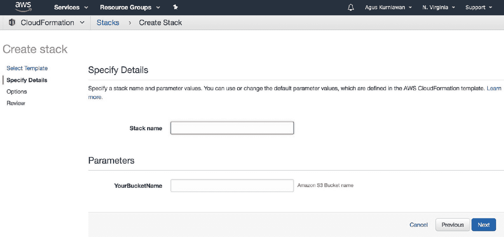
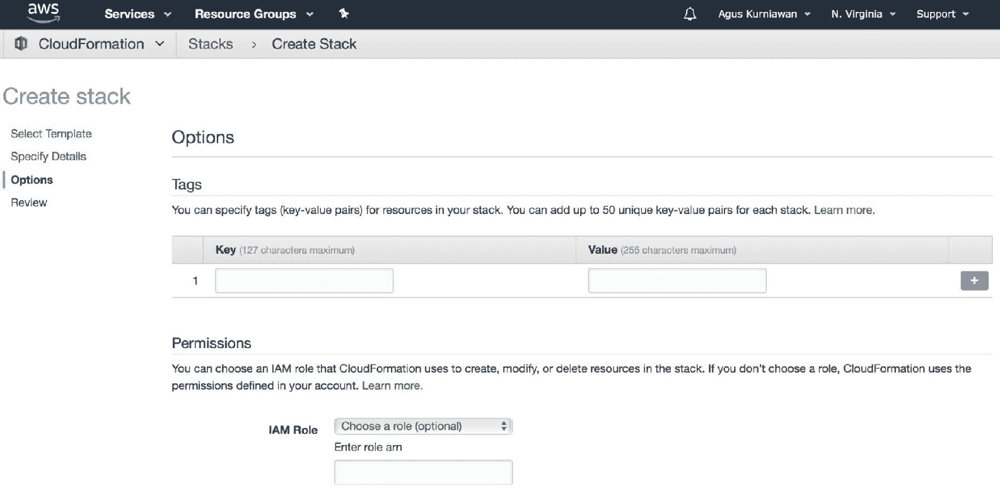

# 开发 AWS CloudFormation 模板

构建 AWS CloudFormation 需要了解如何为 AWS 编写 IaC（基础设施即代码）。在本章中，我们将探索如何使用 JSON 和 YAML 开发 IaC 脚本。我们还将回顾如何通过 IaC 脚本访问 AWS 资源。

本章将涵盖以下主题：

+   审查 AWS CloudFormation 模板格式

+   审查 AWS CloudFormation 的 JSON 和 YAML

+   AWS CloudFormation 模板的编程模型

+   编写 JSON 和 YAML 来创建 AWS CloudFormation 模板

+   从 CloudFormation 模板中获取输入

+   AWS CloudFormation Designer 简介

+   给模板描述

+   从选项中选择输入

+   映射参数

+   使用内建函数

# 审查 AWS CloudFormation 模板格式

IaC 技术旨在使开发人员通过编写脚本来构建基础架构。AWS CloudFormation 使用 IaC 方法构建基于 AWS 的基础设施技术堆栈。每个 AWS 资源都可以以脚本形式声明。开发人员可以通过在 AWS CloudFormation 模板中声明 AWS 资源来构建自己的基础架构。

要开发 AWS CloudFormation，我们需要了解 AWS CloudFormation 模板是什么，以及如何构建该模板。AWS 资源是在 AWS 服务中定义的。例如，Amazon S3 可以在 AWS CloudFormation 模板中以 JSON 格式定义，如下所示：

```
{
 "Type" : "AWS::S3::Bucket",
 "Properties" : {
 "AccessControl" : String,
 "AccelerateConfiguration" : AccelerateConfiguration,
 "AnalyticsConfigurations" : [ AnalyticsConfiguration, ... ],
 "BucketEncryption" : BucketEncryption,
 "BucketName" : String,
 "CorsConfiguration" : CorsConfiguration,
 "InventoryConfigurations" : [ InventoryConfiguration, ... ],
 "LifecycleConfiguration" : LifecycleConfiguration,
 "LoggingConfiguration" : LoggingConfiguration,
 "MetricsConfigurations" : [ MetricsConfiguration, ... ]
 "NotificationConfiguration" : NotificationConfiguration,
 "ReplicationConfiguration" : ReplicationConfiguration,
 "Tags" : [ Resource Tag, ... ],
 "VersioningConfiguration" : VersioningConfiguration,
 "WebsiteConfiguration" : WebsiteConfiguration
 }
}
```

该模板也可以以 YAML 格式声明：

```
Type: "AWS::S3::Bucket"
Properties: 
 AccessControl: String
 AccelerateConfiguration:
 AccelerateConfiguration
 AnalyticsConfigurations:
 - AnalyticsConfiguration
 BucketEncryption: 
 BucketEncryption
 BucketName: String
 CorsConfiguration:
 CorsConfiguration
 InventoryConfigurations:
 - InventoryConfiguration 
 LifecycleConfiguration:
 LifecycleConfiguration
 LoggingConfiguration:
 LoggingConfiguration
 MetricsConfigurations: 
 - MetricsConfiguration
 NotificationConfiguration:
 NotificationConfiguration
 ReplicationConfiguration:
 ReplicationConfiguration
 Tags:
 - Resource Tag
 VersioningConfiguration:
 VersioningConfiguration
 WebsiteConfiguration:
 WebsiteConfiguration
```

我们可以看到，每个 AWS 资源都可以声明为资源类型。通常，AWS 资源类型可以定义如下：

```
AWS::aws-product-name::data-type-name
```

如果我们想要使用这些资源，就需要了解 AWS 资源类型。AWS 资源类型列表的示例如下表所示：

| **AWS 资源名称** | **AWS 资源类型** |
| --- | --- |
| AWS EC2 实例 | `AWS::EC2::Instance` |
| AWS EC2 VPC | `AWS::EC2::VPC` |
| AWS IAM 用户 | `AWS::IAM::User` |
| AWS IoT 设备事物 | `AWS::IoT::Thing` |
| AWS Lambda 函数 | `AWS::Lambda::Function` |
| AWS RDS 数据库实例 | `AWS::RDS::DBInstance` |
| AWS S3 桶 | `AWS::S3::Bucket` |

表 3.1：AWS 资源类型示例列表

有关各种 AWS 资源类型的更多信息，可以在[`docs.aws.amazon.com/AWSCloudFormation/latest/UserGuide/aws-template-resource-type-ref.html`](https://docs.aws.amazon.com/AWSCloudFormation/latest/UserGuide/aws-template-resource-type-ref.html)中找到。

AWS CloudFormation 模板由各种 AWS 资源类型组成，具体取决于您在基础架构中的需求。通常，AWS CloudFormation 模板格式可以通过以下图示描述。模板由各种属性组成，如**AWSTemplateFormatVersion**、**Description**、**Metadata** 和 **Parameters**：


图 3.1：AWS CloudFormation 模板格式

每个 AWS CloudFormation 模板都有以下一个或多个属性：

+   `AWSTemplateFormatVersion`: 这是 AWS CloudFormation 模板版本，不同于 API 或 WSDL 版本。这个属性是可选的。

+   `描述`: 这是定义描述模板的文本字符串。这个属性是可选的。

+   `元数据`: 这是定义提供关于模板附加信息的对象。这个属性是可选的。

+   `参数`: 这是定义在运行时传递给模板的值。你可以引用模板中`资源`和`输出`部分的参数。这个属性是可选的。

+   `映射`: 这是一个键和值的映射，你可以用它来指定条件参数的值。这个属性是可选的。

+   `条件`: 这是定义在堆栈创建或更新过程中，是否创建某些资源或是否为某些资源属性分配值的条件。这个属性是可选的。

+   `变换`: 这有助于简化模板编写，通过将 AWS 基础设施作为代码的表达方式进行压缩，并实现模板组件的重用。

+   `资源`: 这是指定堆栈资源及其属性的部分，例如 EC2 和 Amazon S3。这个属性是必需的。

+   `输出`: 这是描述每当查看堆栈属性时返回的值。这个属性是可选的。

由于 AWS CloudFormation 模板是用 JSON 和 YAML 编写的，我们将学习如何同时开发 JSON 和 YAML。在接下来的部分，我们将探讨这些编程方法。

# 回顾 JSON 和 YAML 编程

在这一部分，我们将学习一些关于 JSON 和 YAML 编程的内容。为了构建 AWS CloudFormation 模板，我们需要了解 JSON 和 YAML。从技术角度来看，JSON 和 YAML 是脚本语言的一部分。我们将在下一部分深入探讨每个主题。

# JSON 编程

JSON 是一种数据交换格式。该格式基于 ECMA-404。更多信息，请参考 [`www.ecma-international.org/publications/files/ECMA-ST/ECMA-404.pdf`](http://www.ecma-international.org/publications/files/ECMA-ST/ECMA-404.pdf)。JSON 可以定义为键值模型。我们可以编写如下脚本：

```
{
 key: value
}
```

例如，我们可以为 `Employee` 数据定义一个 JSON 对象。我们可以编写如下脚本：

```
{
 "id": 1,
 "name": "michael",
 "country": "us"
}
```

你可以看到 `Employee` 对象有三个属性——`id`、`name` 和 `country`。从技术角度讲，我们可以声明数字类型和字符串类型的属性。我们还可以使用 `[]` 来定义 `Employee` 对象的集合。每个对象都在 `{}` 内定义。我们可以编写如下脚本：

```
[
 {
  "id": 1,
  "name": "michael",
  "country": "us"
 },
 {
  "id": 2,
  "name": "jason",
  "country": "uk"
 },
 {
  "id": 3,
  "name": "ryu",
  "country": "jp"
 }
]
```

JSON 支持无限制的父子属性。例如，每个 `Employee` 对象可能有两个或更多的地址。我们可以如下声明：

```
{
 "id": 1,
 "name": "michael",
 "address":[
      {
        "street": "abc street",
        "city": "new york"
      },
      {
        "street": "vue street",
        "city": "hoston"
      }
 ],
 "country": "us"
}
```

这是 JSON 编程部分的结束。接下来，我们将学习如何开发 YAML。

# YAML 编程

YAML 是一种数据序列化语言，旨在让人类直接编写和读取。一个简单的 YAML 对象可以如下定义：

```
key:
 value
```

在 JSON 格式中，我们使用 `{}` 和 `:` 来表示键值对数据。在 YAML 中，我们只使用 `:`。

在上一节中，我们在 JSON 中声明了 `Employee` 对象。我们可以使用以下脚本将其转换为 YAML：

```
id:
 1
name:
 "michael"
country:
 "us"
```

如果我们想要定义一个 YAML 对象集合，可以使用`-`语法表示集合中的一个项。让我们将 `Employee` 集合从 JSON 转换为 YAML。我们可以编写如下脚本：

```
- id: 1
  name: "michael"
  country: "us"
- id: 2
  name: "jason"
  country: "uk"
- id: 3
  name: "ryu"
  country: "jp"
```

要声明 YAML 对象的父子关系，我们可以使用 `:` 来传递 YAML 对象。例如，我们可以从 `Employee` 对象中添加一个 `address` 对象。我们可以编写以下脚本来实现它：

```
id:
 1
name:
 "michael"
address:
    - street: "abc street"
      city: "new york"
    - street: "vue street"
      city: "hoston"
country: 
 "us"
```

这是编写 YAML 对象的一个简单实现。接下来，我们将使用 JSON 和 YAML 构建 AWS CloudFormation 模板。

# AWS CloudFormation 模板的编程模型

开发 AWS CloudFormation 模板意味着我们为基于基础设施的 AWS 技术编写脚本。在此模型中，我们可以应用**软件开发生命周期**（**SDLC**）。通常，我们将 AWS CloudFormation 模板的开发模型表示为下图所示：


图 3.2：CloudFormation 模板开发周期

从前面的图示中，我们可以执行以下任务：

+   **分析问题**：我们识别问题并决定修复哪些问题。

+   **构建基础设施设计**：根据你的问题和解决方案，我们定义一个基础设施设计，包括一些 AWS 资源来实施。

+   **开发 CloudFormation 模板**：在你构建好基础设施设计后，你就可以编写 CloudFormation 模板。你需要在脚本中定义所有 AWS 资源。你可以使用 JSON 和 YAML 文件，或使用 CloudFormation Designer 来编写模板。

+   **部署 AWS CloudFormation**：在你完成 CloudFormation 模板后，你可以上传并配置这些脚本。

+   **测试**：你可以测试你的基础设施。如果在测试中发现问题，你可以修改脚本，然后重新进行测试。

从 SDLC 的角度来看，在开发 CloudFormation 模板时你可以使用敏捷方法。有很多敏捷方法模型，如 Scrum 和**极限编程**（**XP**）。你还可以使用源代码控制来管理 CloudFormation 模板文件。接下来，我们将为 CloudFormation 编写脚本。

# 编写 JSON 和 YAML 以创建 AWS CloudFormation 模板

我们已经学习了在*图 3.1*中描述的 CloudFormation 模板格式。CloudFormation 模板可以使用 JSON 和 YAML 实现。从*图 3.1*中，我们可以按照如下方式用 JSON 格式实现 CloudFormation 模板：

```
{
 "AWSTemplateFormatVersion" : "version date",
 "Description" : "JSON string",
 "Metadata" : {
   template metadata
 },
 "Parameters" : {
   set of parameters
 },
 "Mappings" : {
   set of mappings
 },
 "Conditions" : {
   set of conditions
 },
 "Transform" : {
   set of transforms
 },
 "Resources" : {
   set of resources
 },
 "Outputs" : {
   set of outputs
 }
}
```

CloudFormation 中的所有属性都不是必需的。只有`Resources`属性需要在你的 CloudFormation 模板中定义。你也可以使用 YAML 定义 CloudFormation 模板。我们可以按照如下方式用 YAML 声明来自*图 3.1*的 CloudFormation 模板：

```
AWSTemplateFormatVersion: "version date"
Description:
 String
Metadata:
 template metadata
Parameters:
 set of parameters
Mappings:
 set of mappings
Conditions:
 set of conditions
Transform:
 set of transforms
Resources:
 set of resources
Outputs:
 set of outputs
```

本书将通过各种用例和场景探讨一些来自 CloudFormation 模板的属性。在下一节中，我们将构建一个 CloudFormation 模板，以获取用户输入。

# 从 CloudFormation 模板获取输入。

在第二章中，*构建你的第一个 AWS CloudFormation 项目*，我们在应用 Amazon S3 资源的同时构建了 CloudFormation。由于我们没有指定 S3 存储桶名称，Amazon S3 会为我们的存储桶生成一个随机名称。在这一节中，我们将构建 CloudFormation，并通过用户输入来设置 Amazon S3 存储桶名称。

我们可以使用 CloudFormation 模板中的 `Parameters` 属性。`Parameters` 属性的值将传递给我们的 Amazon AWS 资源。要从资源中获取 `Parameters`，你可以使用 `Ref` 并传递参数名称。例如，我有一个参数 `YourBucketName`。该参数传递给我的资源 `MySimpleBucket`，用于 `BucketName` 属性，如下所示：

```
{ 
  "Parameters": { 
    "YourBucketName":{
      "Description": "Amazon S3 Bucket name",
      "Type": "String"
    }
 },
 "Resources" : {
    "MySimpleBucket" : {
      "Type" : "AWS::S3::Bucket",
      "Properties" : {
        "AccessControl" : "PublicRead",
        "BucketName" : {
           "Ref": "YourBucketName"
        }
      } 
    }
  }
}
```

为了演示，我们将创建一个自定义的 Amazon S3 存储桶名称，由用户填写。你可以执行以下步骤来实现该演示：

1.  在本地计算机上准备 CloudFormation 模板。

1.  创建一个 JSON 或 YAML 文件来构建 CloudFormation 模板。

1.  提供一个 JSON 格式的模板文件 `simple-s3.json` 和一个 YAML 格式的 `simple-s3.yaml` 文件。你可以编写以下脚本。

`simple-s3.json` 文件的脚本如下：

```
{
    "AWSTemplateFormatVersion": "2010-09-09",
    "Description": "Amazon S3 with custom Bucket name",
    "Parameters": {      
      "YourBucketName":{
          "Description": "Amazon S3 Bucket name",
          "Type": "String"
      }
    },
    "Resources" : {
        "MySimpleBucket" : {
            "Type" : "AWS::S3::Bucket",
            "Properties" : {
                "AccessControl" : "PublicRead",
                "BucketName" : {
                    "Ref": "YourBucketName"
                  }
            }                
        }

    }
}
```

`simple-s3.yaml` 文件的脚本如下：

```
AWSTemplateFormatVersion:
 "2010-09-09"
Description:
 "Amazon S3 with custom Bucket name"
Parameters:
 YourBucketName:
   Description:
     "Amazon S3 Bucket name"
   Type:
     "String"
Resources:
 MySimpleBucket:
   Type:
     "AWS::S3::Bucket"
   Properties:
     AccessControl:
        "PublicRead"
   BucketName:
     Ref:
        "YourBucketName"
```

1.  完成后，将这些脚本保存到一个文件中。

1.  将模板文件上传到 AWS CloudFormation。

1.  转到 [`console.aws.amazon.com/cloudformation`](https://console.aws.amazon.com/cloudformation) 并点击“创建新堆栈”按钮。你应该看到一个屏幕，如下图所示。

1.  选择“上传模板到 Amazon S3”选项。

1.  点击“选择文件”按钮上传 CloudFormation 模板文件，然后点击“下一步”按钮：


图 3.3：选择 CloudFormation 模板。

1.  你应该看到一个屏幕，如*图 3.4*所示。你应该使用我们定义的参数 `YourBucketName`。这是我们的 S3 存储桶名称。

1.  填写堆栈名称和 `YourBucketName` 字段来设置存储桶名称：



图 3.4：显示 CloudFormation 模板的参数。

1.  例如，我将堆栈名称填写为 `my-simple-stack`，将存储桶名称填写为 `my-simple-s3`。你可以在以下截图中看到我的输入。

1.  完成后，你可以点击下一步按钮，如下图所示：


图 3.5：填写 CloudFormation 参数。

1.  在你点击下一步按钮后，应该会要求你填写选项。在这种情况下，我们不填任何项目，只需点击下一步按钮：



图 3.6：设置 CloudFormation 选项。

1.  在配置您的 CloudFormation 模板之前，您应该看到如下截图的确认信息。

1.  如果完成，您可以点击“创建”按钮来部署 CloudFormation：


图 3.7：CloudFormation 确认

1.  AWS CloudFormation 将创建模板中定义的所有资源。

1.  您应该能够在仪表盘上看到资源配置状态，如下图所示：


图 3.8：部署 CloudFormation

1.  您可以验证 Amazon S3 控制台，以确保您的资源已由 CloudFormation 创建。

1.  请查看以下截图，这是我的 Amazon S3 存储桶，桶名为 `my-simple-s3`。这个桶名是从 *图 3.5* 中的输入填充的：


图 3.9：Amazon S3 由 CloudFormation 模板创建

如果您更喜欢使用 AWS CLI 运行 CloudFormation 模板，您可以轻松做到。例如，模板文件位于 `home/user/templates/simple-s3.json`。我们还设置了堆栈名称为 `my-simple-stack`，并传递了 `YourBucketName` 参数，其值为 `my-simple-s3`。您可以输入以下命令：

```
$ aws cloudformation create-stack --stack-name my-simple-stack 
 --template-body file://home/user/templates/simple-s3.json 
 --parameters YourBucketName=my-simple-s3
```

AWS CLI 将根据其模板文件部署您的 CloudFormation。

这是我们的演示的结束部分。我们已经创建了一个资源，Amazon S3，并传递了一个参数来定义存储桶名称。您可以通过不同的参数在 Amazon AWS 资源中进行更多实践。

接下来，我们将构建 CloudFormation 设计器。

# 介绍 AWS CloudFormation 设计器

我们已经学习了如何通过编写脚本手动创建 CloudFormation 模板，使用 JSON 或 YAML 格式，并通过文本编辑器进行编辑。在本节中，我们将使用 CloudFormation Designer 以图形化方式构建 CloudFormation 模板。您可以点击并拖动 AWS 资源到模板中。这个工具会生成 JSON 或 YAML 文件。然后，您可以将模板上传到 AWS CloudFormation。

在这个演示中，我们将使用 CloudFormation 设计器构建一个 CloudFormation 模板。我们将使用 Amazon S3 来展示 CloudFormation 设计器的工作方式。您可以按照以下步骤进行演示：

1.  打开您的浏览器并导航到 AWS CloudFormation 控制台：[`console.aws.amazon.com/cloudformation`](https://console.aws.amazon.com/cloudformation)。您应该能看到 AWS CloudFormation 控制台仪表盘。

1.  要使用 CloudFormation 设计器，请点击仪表盘顶部的“设计模板”按钮。您应该看到以下 CloudFormation 设计器表单：


图 3.10：CloudFormation 设计器的表单

1.  您应该能在左侧看到 AWS 资源类型列表（参见 *图 3.10*）。在列表中找到 S3 存储桶并将其拖到右侧面板，如下图所示：


图 3.11：将 Amazon S3 添加到设计器中

1.  将 AWS 资源类型拖到右侧面板后，底部将显示框架脚本。

1.  点击“属性”选项卡，您应该能看到从 CloudFormation 设计器生成的 JSON 或 YAML 脚本。

1.  通过点击带有向上箭头图标的云来将模板上传到 Amazon S3。您应该会得到一个对话框，如*图 3.12*所示。

1.  点击 Amazon S3 存储桶选项卡，填写模板名称，如`mysimples3.template`，然后点击“保存”按钮：


图 3.12：将模板保存到 Amazon S3 存储桶

1.  您应该获得一个用于创建堆栈的仪表板。由于我们已将模板上传到 Amazon S3，仪表板已选择了 Amazon S3 上的 URL，如下屏幕截图所示。点击“下一步”按钮：


图 3.13：上传设计者以创建一个堆栈

1.  按照说明进行操作，直到您审查配置，如下面的屏幕截图所示：


图 3.14：确认创建 CloudFormation

1.  AWS CloudFormation 基于您的模板生成 Amazon S3。您可以通过在 Amazon S3 控制台上检查来验证它：


图 3.15：Amazon S3 由 CloudFormation 设计者创建

我们已经完成了创建 CloudFormation 模板并将其部署到 AWS CloudFormation。现在您可以使用各种资源类型进行其他实验。

接下来，我们将处理模板描述。

# 给出模板描述

CloudFormation 模板提供了`Description`属性，用于显示有关您的模板的信息。您必须设置一个长度为 0 到 1,024 字节的文字字符串作为描述。您可以看到我们对`Description`属性的示例实现。JSON 的示例程序如下所示：

```
"AWSTemplateFormatVersion": "2010-09-09",
    "Description": "Amazon S3 with custom Bucket name",
    "Parameters": { 
      "YourBucketName":{
          "Description": "Amazon S3 Bucket name",
          "Type": "String"
      }
    }
```

对于 YAML，您可以使用以下脚本实现它：

```
AWSTemplateFormatVersion:
  "2010-09-09"
Description:
  "Amazon S3 with custom Bucket name"
Parameters:
  YourBucketName:
    Description:
      "Amazon S3 Bucket name"
    Type:
```

这个属性是可选的。当你在模板的`Description`属性上应用词语时，你可以在审查模板时看到它。更多信息请参见*图 3.7*。

接下来，我们将学习如何在 CloudFormation 中从各种选项中选择值。

# 从选项中选择输入

有时，在 CloudFormation 中构建基础架构时，您需要从用户那里获取输入。在前一节中，我们学习了如何通过填写 Amazon S3 存储桶名称从用户那里获取输入。现在，我们想学习如何从各种选项中选择输入。

可以说明场景以获取 EC2 实例类型大小。用户可以选择我们在`Parameters`部分定义的实例类型。您可以在 JSON 中的实现脚本中看到以下脚本：

```
{
 "AWSTemplateFormatVersion": "2010-09-09",
 "Description": "Amazon EC2 instance with Amazon Linux AMI.",
 "Parameters": { 
    "InstanceType": {
      "Description": "EC2 instance type",
      "Type": "String",
      "Default": "t1.micro",
      "AllowedValues": [
        "t1.micro",
        "t2.nano",
        "t2.micro",
        "t2.small"
      ],
      "ConstraintDescription": "must be a valid EC2 instance type."
    } 
 }
```

对于 YAML，你可以使用以下脚本：

```
AWSTemplateFormatVersion: '2010-09-09'
Description: Amazon EC2 instance with Amazon Linux AMI.
Parameters:
  InstanceType:
  Description: EC2 instance type
  Type: String
  Default: t1.micro
  AllowedValues:
    - t1.micro
    - t2.nano
    - t2.micro
    - t2.small
  ConstraintDescription: must be a valid EC2 instance type.
```

你可以看到我们定义了四种实例类型，这些类型在`AllowedValues`属性中有定义。用户可以选择其中一种实例类型。以下是选项列表：

+   `t1.micro`

+   `t2.nano`

+   `t2.micro`

+   `t2.small`

EC2 有许多实例类型。在此演示中，我只设置了四种类型。您可以在[`docs.aws.amazon.com/AWSEC2/latest/UserGuide/instance-types.html`](https://docs.aws.amazon.com/AWSEC2/latest/UserGuide/instance-types.html)找到支持 EC2 实例的类型列表。如果需要，您可以列出所有实例类型。

我们还可以为我们的选项设置默认值。我们可以使用`Default`属性并将其值设置为默认值。例如，我将`t1.micro`设置为默认值。

现在，我们可以在`EC2Instance`的`InstanceType`属性中设置用户的选择。以下是 JSON 格式的示例程序：

```
"Resources": {
   "EC2Instance": {
     "Type": "AWS::EC2::Instance",
     "Properties": {
        "InstanceType": {
           "Ref": "InstanceType"
        },
```

在 YAML 格式中，执行以下操作：

```
Resources:
 EC2Instance:
   Type: AWS::EC2::Instance
   Properties:
     InstanceType:
       Ref: InstanceType
```

现在，如果您将此模板文件（`simple-ec2.json`或`simple-ec2.yaml`）部署到 CloudFormation，您应该会看到`Parameters`部分的选择项，如下图所示：


图 3.16：为 EC2 选择实例类型

这是一个简单的示例，用于获取一些选项的输入。您可以通过探索一些 AWS 资源来进行更多练习。

接下来，我们将学习如何在 CloudFormation 中使用`Mappings`属性。

# 映射参数

一些 AWS 资源需要特定的属性类型，这些属性类型可能无法通过用户输入获得。在这种情况下，我们可以在 CloudFormation 中利用`Mappings`属性。例如，我们可以根据区域映射 EC2 实例类型。我们可以在`Mapping`属性中声明如下：

```
"Mappings" : {
   "RegionMap" : {
     "us-east-1" : { "32" : "ami-6411e20d"},
     "us-west-1" : { "32" : "ami-c9c7978c"},
     "eu-west-1" : { "32" : "ami-37c2f643"},
     "ap-southeast-1" : { "32" : "ami-66f28c34"},
     "ap-northeast-1" : { "32" : "ami-9c03a89d"}
   }
}
```

这是前面的代码的 YAML 格式：

```
Mappings
 RegionMap
  us-east-1
    32: ami-6411e20d
  us-west-1
    32 : ami-c9c7978c
  eu-west-1
    32 : ami-37c2f643
  ap-southeast-1
    32 : ami-66f28c34
  ap-northeast-1
    32 : ami-9c03a89d
```

如您所见，`RegionMap`将根据区域输入映射各种值，例如`us-east-1`、`us-west-1`和`eu-west-1`。如果我们选择`eu-west-1`，则会获得`ami-37c2f643`用于`32`架构。

在实际程序中，我们通常使用`Mappings`属性与`Fn::FindInMap`内建函数，该函数可在[`docs.aws.amazon.com/AWSCloudFormation/latest/UserGuide/intrinsic-function-reference-findinmap.html`](https://docs.aws.amazon.com/AWSCloudFormation/latest/UserGuide/intrinsic-function-reference-findinmap.html)找到。此函数返回在`Mappings`部分声明的两级映射中与键对应的值。`Fn::FindInMap`可以按如下方式定义：

以下是 JSON 格式：

```
{ "Fn::FindInMap" : [ "MapName", "TopLevelKey", "SecondLevelKey"] }
```

这里是 YAML 格式的代码：

```
Fn::FindInMap: [ MapName, TopLevelKey, SecondLevelKey ]
```

例如，我们想要从`EC2Instance`中设置`ImageId`属性。我们可以从`Mappings`属性中查找`AWSRegionArch2AMI`和`AWSInstanceType2Arch`。您可以在以下 JSON 脚本中看到`Fn::FindInMap`的示例实现：

```
     "Mappings": {
      "AWSInstanceType2Arch": {
        "t1.micro": {
          "Arch": "PV64"
        },
        "t2.nano": {
          "Arch": "HVM64"
        },
        "t2.micro": {
          "Arch": "HVM64"
        },
        "t2.small": {
          "Arch": "HVM64"
        }
      },
       "AWSRegionArch2AMI": {
        "us-east-1": {
          "PV64": "ami-2a69aa47",
          "HVM64": "ami-6869aa05",
          "HVMG2": "ami-61e27177"
        },
        "us-west-2": {
          "PV64": "ami-7f77b31f",
          "HVM64": "ami-7172b611",
          "HVMG2": "ami-60aa3700"
        },
        "us-west-1": {
          "PV64": "ami-a2490dc2",
          "HVM64": "ami-31490d51",
          "HVMG2": "ami-4b694d2b"
        }
      }
    },
    "Resources": {
      "EC2Instance": {
        "Type": "AWS::EC2::Instance",
        "Properties": {
          "InstanceType": {
            "Ref": "InstanceType"
          }, 
          "ImageId": {
            "Fn::FindInMap": [
              "AWSRegionArch2AMI",
              {
                "Ref": "AWS::Region"
              },
              {
                "Fn::FindInMap": [
                  "AWSInstanceType2Arch",
                  {
                    "Ref": "InstanceType"
                  },
                  "Arch"
                ]
              }
            ]
          }
        }
      }
    } 
```

以下脚本适用于 YAML：

```
Mappings:
  AWSInstanceType2Arch:
    t1.micro:
      Arch: PV64
    t2.nano:
      Arch: HVM64
    t2.micro:
      Arch: HVM64
    t2.small:
      Arch: HVM64
  AWSInstanceType2NATArch:
    t1.micro:
      Arch: NATPV64
    t2.nano:
      Arch: NATHVM64
    t2.micro:
      Arch: NATHVM64
    t2.small:
      Arch: NATHVM64
  AWSRegionArch2AMI:
    us-east-1:
      PV64: ami-2a69aa47
      HVM64: ami-6869aa05
      HVMG2: ami-61e27177
    us-west-2:
      PV64: ami-7f77b31f
      HVM64: ami-7172b611
      HVMG2: ami-60aa3700
    us-west-1:
      PV64: ami-a2490dc2
      HVM64: ami-31490d51
      HVMG2: ami-4b694d2b
Resources:
  EC2Instance:
    Type: AWS::EC2::Instance
    Properties:
      InstanceType:
        Ref: InstanceType
      ImageId:
        Fn::FindInMap:
        - AWSRegionArch2AMI
        - Ref: AWS::Region
        - Fn::FindInMap:
          - AWSInstanceType2Arch
          - Ref: InstanceType
          - Arch
```

继续使用 CloudFormation 中的`Mappings`属性进行练习。接下来，我们将学习如何在 CloudFormation 模板中使用内建函数。

# 使用内建函数

内建函数使我们能够在 CloudFormation 模板中插入逻辑函数。从技术上讲，我们在之前的 CloudFormation 模板中已经使用了内建函数，例如`Ref`和`Fn::FindInMap`。

通常，Amazon AWS 提供一些内建函数，我们可以在 CloudFormation 模板中应用。以下是内建函数的列表：

+   `Fn::Base64`

+   `Fn::Cidr`

+   `Condition Functions`

+   `Fn::FindInMap`

+   `` `Fn::GetAtt` ``

+   `Fn::GetAZs`

+   `Fn::ImportValue`

+   `Fn::Join`

+   `Fn::Select`

+   `Fn::Split`

+   `Fn::Sub`

+   `Ref`

各种内建函数的解释如下：

+   `Fn::Base64` 内置函数返回输入字符串的 Base64 表示。`Fn::Base64` 可以这样定义。

这里是 JSON 格式：

```
{ "Fn::Base64" : valueToEncode }
```

这里是 YAML 格式：

```
Fn::Base64: valueToEncode
```

+   `Fn::Cidr` 内置函数返回指定的 CIDR 地址块。你可以按如下方式声明此函数。

这里是 JSON 格式：

```
{ "Fn::Cidr" : [ipBlock, count, sizeMask]}
```

这里是 YAML 格式：

```
Fn::Cidr: [ ipBlock, count, sizeMask ]
```

+   条件函数在 CloudFormation 模板中应用逻辑条件。我们可以使用以下条件函数：

    +   `Fn::And`

    +   `Fn::Equals`

    +   `Fn::If`

    +   `Fn::Not`

    +   `` `Fn::Or` ``

例如，我们想要决定 EC2 的磁盘大小。如果 `CreateLargeSize` 为真，我们设置磁盘大小为`100`，否则我们设置为 `10`。以下是一个 JSON 的示例程序：

```
"NewVolume" : {
  "Type" : "AWS::EC2::Volume",
  "Properties" : {
    "Size" : {
      "Fn::If" : [
        "CreateLargeSize",
        "100",
        "10"
      ]}, 
  }
}
```

这里是 YAML 格式：

```
NewVolume:
  Type: "AWS::EC2::Volume"
  Properties: 
    Size: 
      !If [CreateLargeSize, 100, 10]
```

+   `Fn::FindInMap` 返回在 `Mappings` 部分声明的两级映射中与键对应的值。我们也学会了如何使用这个函数。

+   `Fn::GetAtt` 内置函数返回模板中某个资源的属性值。我们可以通过以下 JSON 方式定义 `Fn::GetAtt`：

```
{ "Fn::GetAtt" : [ "logicalNameOfResource", "attributeName" ] }
```

这里是 YAML 格式：

```
Fn::GetAtt: [ logicalNameOfResource, attributeName ]
```

+   `Fn::GetAZs` 返回一个数组，列出指定区域的 **可用区** (**AZs**)。当你在多个区域工作时，这个函数非常有用。

+   `Fn::Join` 内置函数将一组值连接成一个值，值之间由指定的分隔符分隔。

+   `Fn::Select` 函数通过索引从对象列表中返回单个对象。`Fn::Select` 函数用于将一个字符串分割成多个字符串值。

+   `Fn::Sub` 用指定的值替换输入字符串中的变量。

要了解更多内置函数的信息，请查看 [`docs.aws.amazon.com/AWSCloudFormation/latest/UserGuide/intrinsic-function-reference.html`](https://docs.aws.amazon.com/AWSCloudFormation/latest/UserGuide/intrinsic-function-reference.html)。

# 在 CloudFormation 模板中使用元数据

CloudFormation 模板提供了一个可选的属性 `Metadata`，用于提供关于模板的详细信息。例如，你可以在其中包含特定资源的模板实现细节，如 `AWS::ElasticLoadBalancing::LoadBalancer` 资源。你可以按如下方式编写脚本：

```
  "Resources" : {
    "ElasticLoadBalancer" : {
      "Type" : "AWS::ElasticLoadBalancing::LoadBalancer",
      "Metadata" : {
        "Comment1" : "Configure the Load Balancer with a simple health check and cookie-based stickiness",
        "Comment2" : "Use install path for healthcheck to avoid redirects - ELB healthcheck does not handle 302 return codes"
      },
```

更新 CloudFormation 模板后，你无法更改 `Metadata` 属性。

# CloudFormation 资源

`Resources` 属性是 CloudFormation 模板中的必需属性之一。你可以在模板中声明一个或多个 AWS 资源。例如，你可以在一个模板中使用 Amazon EC2 实例和 Amazon S3 桶。一般来说，CloudFormation 中的 `Resources` 属性可以这样定义：

```
"Resources" : {
    "Logical ID" : {
        "Type" : "Resource type",
        "Properties" : {
            Set of properties
        }
    }
}
```

这里是 YAML 格式：

```
Resources:
  Logical ID:
    Type: Resource type
    Properties:
      Set of properties
```

`Logical ID`是 AWS 资源的唯一 ID。您可以以字母数字形式（A-Z a-z 0-9）声明它。`Type`属性定义了 AWS 资源类型。您可以查看可以在模板中使用的资源类型列表。请访问[`docs.aws.amazon.com/AWSCloudFormation/latest/UserGuide/aws-template-resource-type-ref.html`](https://docs.aws.amazon.com/AWSCloudFormation/latest/UserGuide/aws-template-resource-type-ref.html)。

每种资源类型都有其属性。您可能想要在`Properties`属性上设置资源属性。您应该确保资源类型和资源属性之间相匹配。

# CloudFormation 输出

如果我们希望在 AWS 资源部署后获取响应，我们可以将这些响应导入到 CloudFormation 中。我们可以使用`Outputs`属性，它将作为响应返回（用于描述堆栈调用），或者在 AWS CloudFormation 控制台中查看。

`Outputs`部分由关键字`Outputs`、一个空格和一个冒号组成。您可以在模板中声明最多 60 个输出。

我们可以在 JSON 中声明`Outputs`属性，如下所示：

```
"Outputs" : {
  "Logical ID" : {
    "Description" : "Information about the value",
    "Value" : "Value to return",
    "Export" : {
      "Name" : "Value to export"
    }
  }
}
```

这里是 YAML 格式：

```
Outputs:
  Logical ID:
    Description: Information about the value
    Value: Value to return
    Export:
      Name: Value to export
```

在演示中，我们希望在创建 Amazon S3 存储桶时获取存储桶名称。我们将存储桶资源传递到`Outputs`部分。我们可以通过以下 JSON 脚本实现这一点：

```
{
    "AWSTemplateFormatVersion": "2010-09-09",
    "Description": "Amazon S3 with output", 
    "Resources" : {
        "MySimpleBucket" : {
            "Type" : "AWS::S3::Bucket" 
        }

    },
    "Outputs" : {
        "BucketName" : {
            "Value" : { "Ref" : "MySimpleBucket" }
        }
    }
}
```

这里是 YAML 格式：

```
AWSTemplateFormatVersion: '2010-09-09'
Description: Amazon S3 with custom Bucket name
Resources:
  MySimpleBucket:
    Type: AWS::S3::Bucket 
Outputs:
  BucketName:
    Value:
      Ref: MySimpleBucket
```

将此文件保存为`simple-s3-outputs.json`或`simple-s3-outputs.yaml`。

然后，您可以将此模板上传到 CloudFormation。如果上传成功，您应该在堆栈的“输出”标签页中看到 Amazon S3 存储桶的名称：


图 3.17：来自 CloudFormation 的输出消息

您已经了解了 CloudFormation 输出。通过从各种 AWS 资源中应用一些输出，继续练习。

接下来，我们将尝试使用 CloudFormation 构建 EC2 实例。

# 演示 - 使用 AWS CloudFormation 构建 Amazon EC2

在本节中，我们将使用 CloudFormation 构建 Amazon EC2。在前面的章节中，我们已经探讨了关于 EC2 的一些 CloudFormation 属性。需要提醒的是，Amazon EC2 可能不是免费的，因此您可能会被收费。

接下来，我们将在构建 EC2 实例之前进行准备。

# 准备中

为了操作 EC2 实例，我们需要一个密钥对来访问 EC2。如果您还没有密钥对，您可以通过 EC2 管理控制台创建它。

打开您的浏览器并导航到[`console.aws.amazon.com/ec2`](https://console.aws.amazon.com/ec2)。您应该看到 EC2 管理控制台的仪表板。您可以点击左侧菜单中的“密钥对”选项，您将看到如下界面：


图 3.18：AWS EC2 控制台管理

您可以点击“创建密钥对”按钮来创建一个新的密钥对。您应该会看到一个对话框，如下图所示。填写密钥对名称字段，然后点击对话框中的“创建”按钮：


图 3.19：在 AWS EC2 管理控制台创建密钥对

现在，你已经有了一个可以在 EC2 实例中使用的密钥对。接下来，我们将为 EC2 开发一个 CloudFormation 模板。

# 开发 CloudFormation 模板

在本节中，我们将开发一个用于 EC2 的 CloudFormation 模板。某些属性已经在本章的前面部分解释过。由于我们需要在 EC2 上使用密钥对，因此我们将其设置在 `Parameters` 属性中，以便用户可以选择他们的密钥对。以下是一个 JSON 格式的示例程序：

```
"KeyName": {
        "Description": "Name of an existing EC2 KeyPair to enable SSH 
        access to the instance",
        "Type": "AWS::EC2::KeyPair::KeyName",
        "ConstraintDescription": "must be the name of an existing EC2 
        KeyPair."
},
```

这是 YAML 格式的：

```
  KeyName:
    Description: Name of an existing EC2 KeyPair to enable SSH access  
    to the instance
    Type: AWS::EC2::KeyPair::KeyName
    ConstraintDescription: must be the name of an existing EC2 KeyPair.
```

`KeyName` 参数中的密钥对将用于 EC2 实例。我们将其放在资源中，如下所示：

```
   "Resources": {
      "EC2Instance": {
        "Type": "AWS::EC2::Instance",
        "Properties": {
          ...
          "KeyName": {
            "Ref": "KeyName"
          },
```

这是 YAML 格式的：

```
   Resources:
      EC2Instance: 
        Type: AWS::EC2::Instance
        Properties: 
          ...
          KeyName: 
            Ref: KeyName
```

我们还需要一个 EC2 实例的公共 IP 地址，以便通过 SSH 访问。我们在 `Parameters` 属性中的 `SSHLocation` 部分定义它。JSON 格式如下：

```
      "SSHLocation": {
        "Description": "The IP address range that can be used to SSH to the EC2 instances",
        "Type": "String",
        "MinLength": "9",
        "MaxLength": "18",
        "Default": "0.0.0.0/0",
        "AllowedPattern": "(\\d{1,3})\\.(\\d{1,3})\\.(\\d{1,3})\\.(\\d{1,3})/(\\d{1,2})",
        "ConstraintDescription": "must be a valid IP CIDR range of the form x.x.x.x/x."
      }
```

这是 YAML 格式的：

```
SSHLocation:
    Description: The IP address range that can be used to SSH to the EC2 instances
    Type: String
    MinLength: '9'
    MaxLength: '18'
    Default: 0.0.0.0/0
    AllowedPattern: "(\\d{1,3})\\.(\\d{1,3})\\.(\\d{1,3})\\.(\\d{1,3})/(\\d{1,2})"
    ConstraintDescription: must be a valid IP CIDR range of the form x.x.x.x/x.
```

有关 EC2 实例模板的详细信息，请查看 `ec2demo.json` 和 `ec2demo.yaml`。你可以开始将这个模板部署到 AWS CloudFormation。我们将在下一节执行此任务。

# 部署模板

完成 EC2 的 CloudFormation 模板后，你可以将其上传到 AWS CloudFormation。你需要在模板中选择 KeyName 和其他选项：


图 3.20：通过 AWS CloudFormation 部署 EC2

你可能已经在 `SSHLocation` 参数中设置了用于 SSH 访问的 IP 地址。然后，按照说明部署模板。

创建完成后，你可以在 CloudFormation 仪表板上查看 CloudFormation 部署的进度：


图 3.21：AWS EC2 实例已创建

创建 EC2 实例后，你可以在 EC2 管理控制台上验证这一点。你应该能看到如下截图所示的 EC2 实例：


图 3.22：在 EC2 管理控制台上验证 EC2 实例

现在，你可以在管理控制台上管理你的 EC2 实例。如果你想修改 EC2 实例，你可以更新 CloudFormation 模板。然后，你可以部署该模板。

# 总结

我们已经学习了如何使用 JSON 和 YAML 构建 AWS CloudFormation 模板。我们回顾了 CloudFormation 模板格式。然后，我们查看了一些 CloudFormation 模板中的属性。最后，我们使用 CloudFormation 模板部署了 Amazon EC2。

在下一章中，我们将学习 CloudFormation StackSets。

# 问题

1.  什么是 CloudFormation 模板？

1.  我们如何开发 CloudFormation 模板？

1.  如何在 CloudFormation 模板中实现 AWS 资源？
