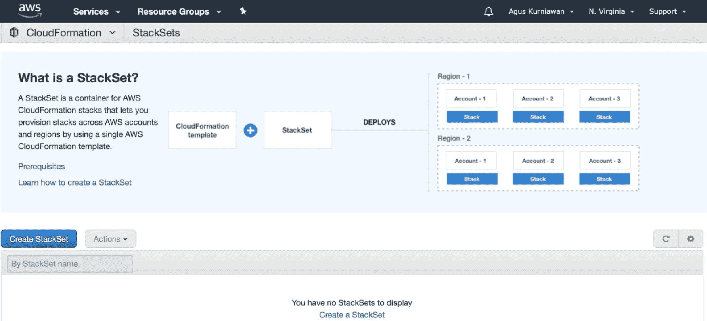
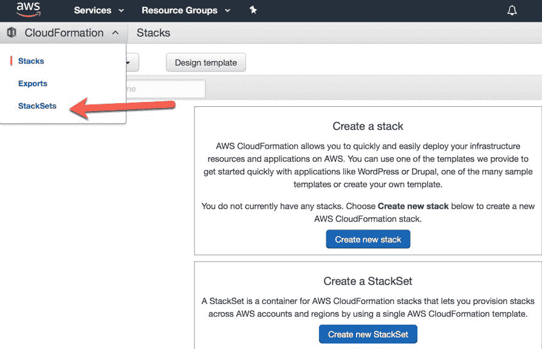
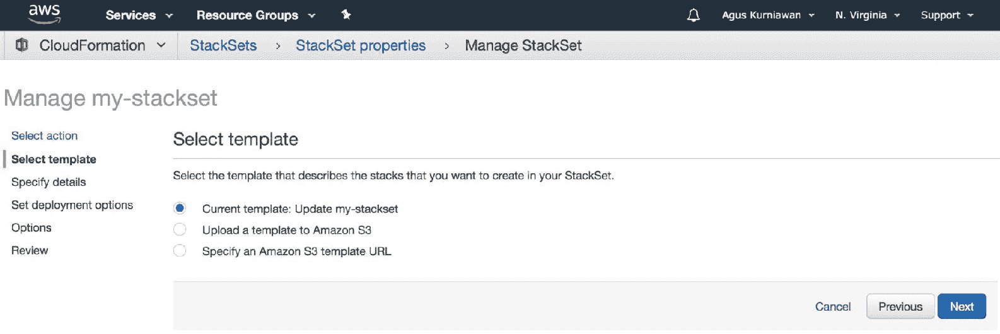
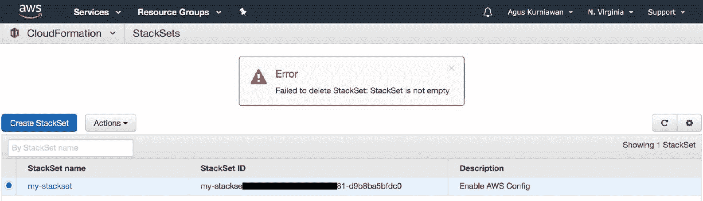

# 第四章：AWS CloudFormation StackSets

为全球客户提供来自多个区域的服务需要更多关注在设计应用程序和基础设施时。有时，将基础设施部署到某些区域并不容易。此外，我们还应该在多个区域执行基础设施变更。本章将探讨如何通过应用 CloudFormation StackSets 来设计和构建多区域基础设施。

本章将涵盖以下主题：

+   AWS CloudFormation StackSets 简介

+   准备 CloudFormation StackSets

+   使用管理控制台实现 StackSets

+   使用 AWS CLI 创建 StackSets

+   编辑 CloudFormation StackSets

+   删除 CloudFormation StackSets

# AWS CloudFormation StackSets 简介

一家面向全球客户的公司在为客户提供服务时可能会遇到问题。我们应该能够提供接近客户位置的服务。在 IT 问题的背景下，我们应当将应用程序和服务部署到多个区域，以解决网络延迟问题。

我们可以像*图 4.1*所示那样描述我们的全球客户服务问题。我们有来自美国、亚洲和欧洲的客户。我们有一些应用程序和服务需要部署到这些区域。有时，每个区域的应用程序和服务可能具有独特的特性。如果我们更改我们的应用程序和服务，并将其部署到不同的服务器上，问题将变得更加复杂：


图 4.1：具有区域特性的基础设施设计

为了解决这个问题，我们可以应用 AWS CloudFormation 模板来构建动态基础设施。我们还可以将 AWS CloudFormation 模板部署到多个区域。有些 CloudFormation 模板只能在特定区域进行部署。

在本章中，我们将探讨如何使用 AWS CloudFormation StackSets 将 CloudFormation 堆栈部署到特定区域。

# 准备 CloudFormation StackSets

为了使用 CloudFormation StackSets，我们需要执行一些任务。这些任务是 AWS CloudFormation 的安全规则的一部分。让我们首先执行以下任务，开始使用 CloudFormation StackSets：

1.  作为 AWS CloudFormation 管理员从 IAM 用户获取用户 ID

1.  创建 IAM 角色，`AWSCloudFormationStackSetAdministrationRole`

1.  创建服务角色，`AWSCloudFormationStackSetExecutionRole`

我们将在接下来的章节中讨论这些任务。

# 从 IAM 用户获取用户 ID

首先，您应该在 AWS IAM 上拥有管理员账户。复制您的 IAM 账户中的 ARN 用户，您可以在 AWS IAM 管理控制台的[`console.aws.amazon.com/iam/`](https://console.aws.amazon.com/iam/)查看。例如，您可以拥有如下 ARN 用户账户：

```
arn:aws:iam::123456789012:user/myusername
```

从 ARN 用户的账户号中获取用户 ID。从前面的 ARN 用户中，我们可以获得`123456789012`作为用户 ID。我们将使用此用户 ID 来附加 CloudFormation 策略。

接下来，我们将在 IAM 管理控制台创建名为`AWSCloudFormationStackSetAdministrationRole`的 IAM 角色。

# 创建 AWSCloudFormationStackSetAdministrationRole IAM 角色

要构建 CloudFormation StackSets，我们应创建一个名为`AWSCloudFormationStackSetAdministrationRole`的 IAM 角色。这是 AWS 要求的。如果我们不创建，创建 CloudFormation StackSet 时将会遇到错误。

我们可以使用 CloudFormation Stack 创建一个名为`AWSCloudFormationStackSetAdministrationRole`的 IAM 角色。首先，我们需要创建 CloudFormation 模板。在本例中，我们使用以下 YAML 格式：

```
AWSTemplateFormatVersion: 2010-09-09
Description: Configure the AWSCloudFormationStackSetAdministrationRole to enable use of AWS CloudFormation StackSets.

Resources:
  AdministrationRole:
    Type: AWS::IAM::Role
    Properties:
      RoleName: AWSCloudFormationStackSetAdministrationRole
      AssumeRolePolicyDocument:
        Version: 2012-10-17
        Statement:
          - Effect: Allow
            Principal:
              Service: cloudformation.amazonaws.com
            Action:
              - sts:AssumeRole
      Path: /
      Policies:
        - PolicyName: AssumeRole-AWSCloudFormationStackSetExecutionRole
          PolicyDocument:
            Version: 2012-10-17
            Statement:
              - Effect: Allow
                Action:
                  - sts:AssumeRole
                Resource:
                  - "arn:aws:iam::*:role/AWSCloudFormationStackSetExecutionRole"
```

您可以将这些脚本保存到名为`AWSCloudFormationStackSetAdministrationRole.yaml`的文件中。

现在，您可以导航到 AWS CloudFormation 仪表板，[`console.aws.amazon.com/cloudformation/`](https://console.aws.amazon.com/cloudformation/)，并创建一个新的 CloudFormation 堆栈。上传`AWSCloudFormationStackSetAdministrationRole.yaml`文件。为其指定堆栈名称，例如`AWSCloudFormationStackSetAdministrationRole`，如下图所示：


图 4.2：添加 CloudFormation 堆栈以创建 IAM 角色，`AWSCloudFormationStackSetAdministrationRole`

完成后，点击“下一步”按钮，直到完成此任务。阅读第二章《构建您的第一个 AWS CloudFormation 项目》和第三章《开发 AWS CloudFormation 模板》，了解如何使用 CloudFormation 堆栈。创建 CloudFormation 堆栈后，您应能在 CloudFormation 堆栈仪表板上看到您的 CloudFormation 堆栈，如下图所示：


图 4.3：创建`AWSCloudFormationStackSetAdministrationRole`角色已完成

如果您看到堆栈状态为 CREATE_COMPLETE，则表示您的 CloudFormation 堆栈已成功创建。现在，您可以通过打开 IAM AWS 管理控制台来验证它。打开浏览器并访问[`console.aws.amazon.com/iam/`](https://console.aws.amazon.com/iam/)。

在管理控制台中，点击左侧菜单中的“角色”。您应该能在角色列表中看到`AWSCloudFormationStackSetAdministrationRole`：


图 4.4：检查 AWSCloudFormationStackSetAdministrationRole IAM 角色仪表板

您已在 AWS IAM 中创建了`AWSCloudFormationStackSetAdministrationRole`角色。接下来，我们应创建一个名为`AWSCloudFormationStackSetExecutionRole`的服务角色。

# 创建服务角色 – AWSCloudFormationStackSetExecutionRole

现在我们已经在 IAM 角色中创建了`AWSCloudFormationStackSetAdministrationRole`角色，接下来我们将创建一个名为`AWSCloudFormationStackSetExecutionRole`的服务角色。

我们可以使用 CloudFormation 创建服务角色。您可以编写以下脚本来创建 CloudFormation 模板：

```
AWSTemplateFormatVersion: 2010-09-09
Description: Configure the AWSCloudFormationStackSetExecutionRole to enable use of your account as a target account in AWS CloudFormation StackSets.

Parameters:
  AdministratorAccountId:
    Type: String
    Description: AWS Account Id of the administrator account (the account in which StackSets will be created).
    MaxLength: 12
    MinLength: 12

Resources:
  ExecutionRole:
    Type: AWS::IAM::Role
    Properties:
      RoleName: AWSCloudFormationStackSetExecutionRole
      AssumeRolePolicyDocument:
        Version: 2012-10-17
        Statement:
          - Effect: Allow
            Principal:
              AWS:
                - !Ref AdministratorAccountId
            Action:
              - sts:AssumeRole
      Path: /
      ManagedPolicyArns:
        - arn:aws:iam::aws:policy/AdministratorAccess
```

将这些脚本保存到名为`AWSCloudFormationStackSetExecutionRole.yaml`的文件中。

此服务需要一个管理员帐户，以便它可以在 CloudFormation 上运行服务。我们已经准备了 IAM 用户并复制了该用户的 ARN。现在，您可以打开浏览器并导航至 CloudFormation 仪表盘。将`AWSCloudFormationStackSetExecutionRole.yaml`文件上传到 AWS CloudFormation 堆栈。填写您的堆栈名称和 IAM 用户的 ARN，例如`123456789012`。

您可以在以下截图中看到堆栈屏幕：


图 4.5：创建服务角色，AWSCloudFormationStackSetExecutionRole

您可以按照已创建的堆栈说明进行操作。完成后，您可以检查堆栈的创建状态。确保堆栈完成：


图 4.6：AWSCloudFormationStackSetExecutionRole 服务角色已完成

我们已经创建了服务角色`AWSCloudFormationStackSetExecutionRole`。现在，我们准备创建一个 StackSet。接下来，我们将使用管理控制台和 AWS CLI 创建一个 StackSet。

# 使用管理控制台实现 StackSets

在本节中，我们将使用**Web 管理控制台**（**WMC**）创建一个 StackSet。您应该已经创建了 IAM 角色`AWSCloudFormationStackSetAdministrationRole`和服务角色`AWSCloudFormationStackSetExecutionRole`。

现在，您可以打开浏览器并导航至 CloudFormation StackSet 仪表盘：[`console.aws.amazon.com/cloudformation/stacksets/home`](https://console.aws.amazon.com/cloudformation/stacksets/home)。您应该看到如*图 4.7*所示的仪表盘：



图 4.7：CloudFormation StackSets 仪表盘

默认情况下，CloudFormation 管理控制台显示堆栈仪表盘。您可以通过点击主菜单中的 StackSets 菜单来选择 StackSets 仪表盘，如*图 4.8*所示：



图 4.8：从主菜单打开 CloudFormation StackSets 仪表盘

在本节中，我们将执行以下任务：

1.  创建新的 StackSet

1.  将一个 CloudFormation 堆栈添加到 StackSet

1.  从 StackSet 中删除 CloudFormation 堆栈

我们将在接下来的部分中执行这些任务。

# 创建新的 StackSet

在本节中，我们将使用管理控制台创建一个 StackSet。一个 StackSet 由在一个或多个区域部署的堆栈组成。

创建 StackSet 时需要遵循一些步骤。执行以下步骤：

1.  打开浏览器并导航至 CloudFormation StackSets 仪表盘：[`console.aws.amazon.com/cloudformation/stacksets/home`](https://console.aws.amazon.com/cloudformation/stacksets/home)。

1.  您应该看到如*图 4.7*所示的 CloudFormation StackSets 仪表盘。

1.  要创建一个新的 StackSet，点击创建 StackSet 按钮。

1.  点击后，您应该看到如*图 4.9*所示的屏幕：


图 4.9：通过选择模板创建 StackSet

1.  选择以下模板中的一个样本模板选项。

1.  点击启用 AWS Config 模板。完成后，点击下一步按钮。

1.  你应该看到如*图 4.10*所示的屏幕：


图 4.10：填写 StackSet 名称和属性

1.  填写你的 StackSet 名称，例如 `my-stackset`。完成后，点击下一步按钮。

1.  你应该看到如*图 4.11*所示的屏幕。选择“在账户中部署堆栈”选项。

1.  在文本框中输入你的 ARN 用户。你可以为该 StackSet 填写一些账户：


图 4.11：为 StackSet 设置账户

1.  向下滚动，直到看到如*图 4.12*所示的屏幕。为你的账户选择一个或多个区域。

1.  在我们的演示中，我选择了美国东部（弗吉尼亚州北部）和亚太地区（新加坡）区域。

1.  完成后，点击下一步按钮：


图 4.12：设置目标区域

1.  你应该会看到如*图 4.13*所示的屏幕。在此表单中，我们不进行任何操作。点击下一步按钮继续：


图 4.13：为 StackSet 设置选项

1.  你将看到审核屏幕，如*图 4.14*所示。审核你的输入。点击创建按钮以开始创建 StackSet：


图 4.14：创建 StackSet 的确认

1.  你应该会看到如*图 4.15*所示的屏幕。你应该看到带有启用 AWS Config 模板的 StackSet：


图 4-15：StackSet 已创建

1.  若要查看你的 StackSet 是否创建成功，请向下滚动查看操作和堆栈的状态。你应该看到如*图 4.16*所示的屏幕。你可以看到你的操作和区域堆栈状态。如果 StackSet 操作状态是 SUCCEEDED，说明你的 StackSet 创建成功。你还应该看到所有堆栈的状态为 CURRENT，如以下截图所示：


图 4.16：检查操作和堆栈的状态

有关操作和堆栈部分的一些状态信息可以在*表 4.1*和*表 4.2*中找到：

| **StackSets 操作状态** | **操作** |
| --- | --- |
| RUNNING | 操作当前正在进行 |
| SUCCEEDED | 操作已完成，且未超出操作的失败容忍度 |
| FAILED | 无法完成操作的堆栈数量超过了用户定义的失败容忍度 |
| STOPPING | 操作正在停止中，应用户请求 |
| STOPPED | 操作已停止，应用户请求 |

表 4.1：StackSets 操作状态信息列表

| **堆栈实例状态** | **操作** |
| --- | --- |
| CURRENT | 堆栈当前与堆栈集保持最新状态 |
| OUTDATED | 堆栈当前不是最新的 |
| INOPERABLE | 删除 Stack 实例操作失败，导致堆栈处于不稳定状态 |

表 4.2：Stack 实例的状态信息列表

现在，你已经通过管理控制台在 CloudFormation 上创建了 StackSet。接下来，我们将为 StackSet 创建一个或多个堆栈。

# 添加新的 CloudFormation 堆栈

您可以在现有 StackSet 上添加额外的堆栈。在这种情况下，您不能使用新的 CloudFormation 堆栈模板。您应当使用已经部署的 StackSet 中的现有堆栈模板。我们可以使用跨账户和跨区域的配置。

在本演示中，我将为现有的 StackSet 添加一个新区域。执行以下任务以将 CloudFormation 堆栈添加到 StackSet 中：

1.  打开浏览器，导航到 CloudFormation StackSets 仪表盘：[`console.aws.amazon.com/cloudformation/stacksets/home`](https://console.aws.amazon.com/cloudformation/stacksets/home)。

1.  您应该会看到如*图 4.17*所示的屏幕：


图 4.17：CloudFormation StackSets 列表

1.  选择一个将要添加堆栈的 StackSet。点击 Actions 按钮，您将看到如下截图中的菜单：


图 4.18：StackSets 仪表盘上的操作菜单

1.  点击 Manage stacks in StackSet 菜单。您应该会看到如*图 4.19*所示的屏幕。选择 Create stacks 选项：


图 4.19：选择一个选项以添加堆栈

1.  完成后，点击 Next 按钮。您应该会看到如*图 4.20*所示的屏幕。选择 Create stacks in accounts 选项。填写您的 AWS IAM 账户信息。您还应当指定用于目标部署的区域：


图 4.20：设置账户及其区域

1.  填写完数据后，点击 Next 按钮。您应该会看到如*图 4.21*所示的屏幕。设置堆栈参数。完成后，点击 Next 按钮：


图 4.21：设置 StackSet 参数

1.  您将看到一个确认屏幕，如*图 4.22*所示。检查您的输入数据。完成后，点击 Create 按钮来配置您的堆栈：


图 4.22：添加堆栈的确认界面

1.  点击后，CloudFormation 将执行此任务。您应该会看到您的堆栈出现在 StackSet 属性中：


图 4.23：在现有 StackSet 上创建新堆栈

添加堆栈的操作已经结束。如果需要，您可以继续添加更多堆栈。接下来，您将学习如何从 StackSets 中删除堆栈。

# 删除 CloudFormation 堆栈

如果您认为某些堆栈将不再使用，您可以从 StackSets 中删除它们。在本节中，我们将学习如何从 StackSets 中删除堆栈。

按照以下步骤删除堆栈：

1.  打开浏览器，导航到 CloudFormation StackSets（参见*图 4.17*）。选择并打开您的 StackSet。

1.  点击 Manage StackSet 按钮，您将看到如下截图所示的屏幕：


图 4.24：选择删除现有堆栈的选项

1.  选择 Delete stacks 选项。点击 Next 按钮。点击后，您应该会看到如下截图中的屏幕：


图 4.25：填写将要删除的账户和区域

1.  填写您的账户及其区域信息。点击 Next 按钮继续。

1.  您应该会看到如*图 4.26*所示的确认屏幕。点击删除堆栈按钮以确认删除：


图 4.26：确认删除栈账户和区域

您可以继续删除其他栈。这是删除栈的结束。接下来，您可以使用 AWS CLI 执行 StackSets 操作。

# 使用 AWS CLI 创建 StackSets

在上一节中，我们使用 CloudFormation 管理控制台构建了 StackSets。在本节中，我们将使用 AWS CLI 来管理 CloudFormation StackSets。AWS CLI 的 CloudFormation 命令列表可以在[`docs.aws.amazon.com/cli/latest/reference/cloudformation/index.html#cli-aws-cloudformation`](https://docs.aws.amazon.com/cli/latest/reference/cloudformation/index.html#cli-aws-cloudformation)找到。

我们将使用 AWS CLI 创建一个 StackSet。请按照以下步骤操作：

1.  配置您的工作区域。AWS 区域的列表可以在[`docs.aws.amazon.com/general/latest/gr/rande.html`](https://docs.aws.amazon.com/general/latest/gr/rande.html)找到。

1.  例如，我将我的区域更改为`us-east-1`区域。您可以在终端中输入以下命令：

```
$ aws configure get region
$ aws configure set region us-east-1
```

1.  执行后，您可以使用`aws configure get region`命令来验证。您可以在下方的截图中看到我的程序输出：


图 4.27：在 AWS CLI 上配置工作区域

1.  使用 Enable AWS Config 模板创建 StackSet。该模板可在[`s3.amazonaws.com/cloudformation-stackset-sample-templates-us-east-1/EnableAWSConfig.yml`](https://s3.amazonaws.com/cloudformation-stackset-sample-templates-us-east-1/EnableAWSConfig.yml)获取。

1.  创建一个名为`my-stackset`的 StackSet。您可以使用`create-stack-set`命令。输入以下命令：

```
$ aws cloudformation create-stack-set --stack-set-name my-stackset --template-url https://s3.amazonaws.com/cloudformation-stackset-sample-templates-us-east-1/EnableAWSConfig.yml --capabilities CAPABILITY_IAM
```

1.  执行后，您应该获得 StackSetId，可以用来检索您的 StackSet 信息。您可以在下方的截图中看到我创建 StackSet 时的 StackSetId：


图 4.28：通过 AWS CLI 创建 StackSet

1.  要从您的 StackSet 获取创建状态，请使用`list-stack-sets`命令。

1.  如果您的 StackSet 创建成功，您应该看到 StackSet 状态为 ACTIVE：


图 4.29：通过 AWS CLI 获取 StackSets 列表

1.  我们可以继续创建栈实例。我们定义账户及其区域。

1.  当传入 StackSet 名称、账户和区域时，使用`create-stack-instances`命令。

1.  我在名为`my-stackset`的 StackSet 上创建了一个栈实例。我设置了一个账户，`123456789012`，目标区域为`us-east-1`和`us-east-2`。您可以输入以下命令：

```
$ aws cloudformation create-stack-instances --stack-set-name my-stackset --accounts '["123456789012"]' --regions '["us-east-1","us-east-2"]' --operation-preferences FailureToleranceCount=0,MaxConcurrentCount=1
```

1.  执行后，您应该获得 OperationId 字段。它将用于检查您的执行情况。您可以在下方的截图中看到我的程序输出：


图 4.30：创建栈实例

1.  要检查并验证您的操作状态，使用`describe-stack-set-operation`命令，传入 StackSet 名称和`operation-id`。

1.  例如，我想检查名为 `my-stackset` 的 StackSet，操作 ID 为 `7c5d3b1e-844c-4e02-9cb2-ad42e3e4d53d`。我输入以下命令：

```
$ aws cloudformation describe-stack-set-operation --stack-set-name my-stackset --operation-id 7c5d3b1e-844c-4e02-9cb2-ad42e3e4d53d
```

1.  您可以在 *图 4.31* 中看到我的程序输出示例。如果您看到您的操作 ID 状态为 SUCCEEDED，说明您的堆栈实例已经创建：


图 4.31：检查操作状态

这就是使用 AWS CLI 创建 CloudFormation StackSet 的结束。您可以进一步练习 CloudFormation StackSet 的开发。

接下来，我们将学习如何编辑 CloudFormation StackSets。

# 编辑 CloudFormation StackSets

有时，您可能需要编辑 StackSet 参数。您可以执行此任务。在本节中，我们将探讨如何使用 CloudFormation 管理控制台修改 StackSets。

您可以执行以下步骤来编辑 StackSet：

1.  打开浏览器并导航到 StackSets 仪表板，如 *图 4.17* 所示。选择您想要编辑的 StackSet。

1.  点击 Actions 按钮并选择 Manage stacks in StackSet 菜单（见 *图 4.18*）。

1.  您应该会看到 *图 4.32* 所示的屏幕：


图 4.32：选择编辑 StackSet

1.  选择 Edit StackSet 选项。完成后，点击 Next 按钮。

1.  您应该会看到以下截图所示的屏幕：



图 4.33：选择要编辑的 StackSet 模板

1.  在这种情况下，我们将修改当前模板，因此选择 Current template: Update my-stackset 选项。完成后，点击 Next 按钮。

1.  您应该能看到显示模板的屏幕。例如，以下截图显示的是启用 AWS Config 模板：


图 4.34：配置 StackSet 参数

1.  点击 Next 按钮。按照下一步确认并执行您的 StackSet 更改。完成后，您的 StackSet 已被修改。

您已经学会了如何修改 StackSet 模板。接下来，我们将学习如何删除 StackSets。

# 删除 CloudFormation StackSets

在本节中，我们将学习如何删除 StackSets。要删除 StackSet，您应该先删除 StackSet 中的所有堆栈。如果没有删除，您在删除 StackSet 时将会遇到错误。

您可以执行以下步骤来删除 StackSet：

1.  打开浏览器并导航到 CloudFormation StackSets 仪表板，网址为 [`console.aws.amazon.com/cloudformation/stacksets/home`](https://console.aws.amazon.com/cloudformation/stacksets/home)。选择您想要删除的 StackSet。

1.  点击 Actions 按钮，您应该会看到以下截图所示的菜单：


图 4.35：删除 StackSet 的菜单

1.  您应该会看到如 *图 4.36* 所示的确认对话框。点击“是，删除”按钮：


图 4.36：删除 StackSet 的确认界面

1.  如果您的 StackSet 中有堆栈，您应该先删除这些堆栈再删除 StackSet。如果不这样做，将会出现错误，如下图所示：



图 4.37：删除 StackSet 时出现错误

1.  你可以设置需要移除的账户和目标区域。你可以在*图 4.38*中查看正在删除的账户和区域。完成后，你可以返回执行第 2 步中的操作：


图 4.38：从 StackSet 中移除所有堆栈

你已经从 CloudFormation 中删除了一个 StackSet。我建议你删除不再使用的 StackSets。我还建议你学习与 CloudFormation StackSets 相关的最佳实践，你可以在 [`docs.aws.amazon.com/AWSCloudFormation/latest/UserGuide/stacksets-bestpractices.html`](https://docs.aws.amazon.com/AWSCloudFormation/latest/UserGuide/stacksets-bestpractices.html) 中找到这些最佳实践。

# 总结

你已经学习了如何使用 WMC 和 AWS CLI 创建 CloudFormation StackSets。你还学习了如何通过附加账户和目标区域将堆栈添加到 StackSet 中。然后，你学习了如何从 StackSet 中管理堆栈，例如编辑和删除它们。最后，你学习了如何修改和删除当前的 StackSet。

在下一章，我们将学习如何使用 AWS CloudFormation 构建 AWS Lambda 函数。

# 问题

请回答以下问题以评估你的学习成果：

1.  什么是 CloudFormation StackSet？

1.  StackSet 中最多可以有多少个堆栈？
