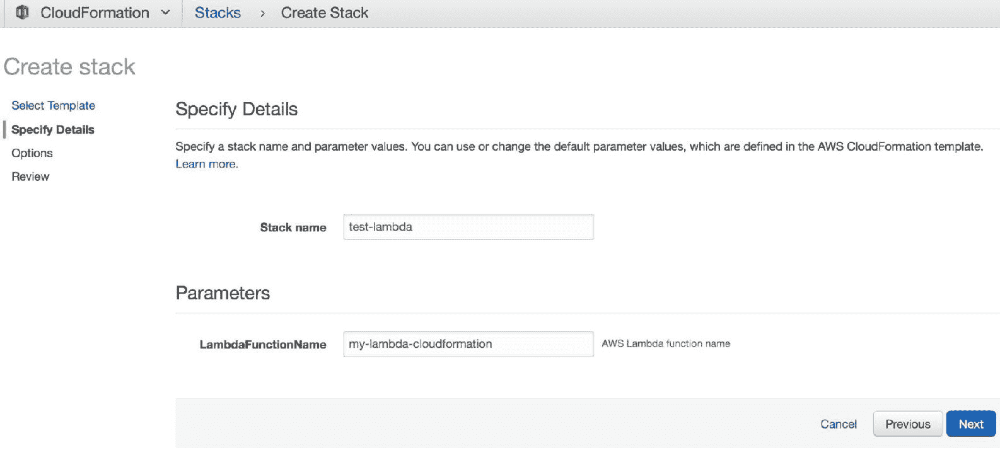
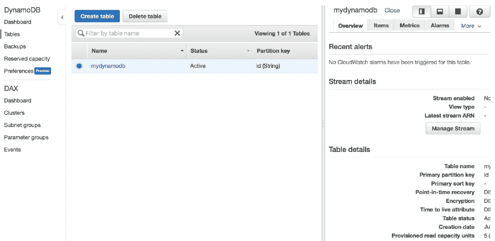

# 第五章：使用 AWS CloudFormation 构建 Lambda 函数

无服务器解决方案是一种解决动态基础设施问题的技术手段。在本章中，我们将探讨如何使用 AWS Lambda 实现无服务器解决方案。我们将通过 AWS CloudFormation 构建 AWS Lambda。

本章将涵盖以下主题：

+   介绍 AWS Lambda

+   构建 AWS Lambda

+   为 AWS Lambda 函数创建 CloudFormation 模板

+   通过 CloudFormation 部署 AWS Lambda

+   通过 CloudFormation 部署 AWS Lambda 和 DynamoDB

+   通过 CloudFormation 将 AWS Lambda 部署到特定区域

# 介绍 AWS Lambda

AWS Lambda 是一种 AWS 服务，提供无服务器计算服务。我们可以使用多种编程语言构建函数，然后 AWS Lambda 将负责我们的基础设施及其扩展。

我们可以通过 Lambda 函数访问其他 AWS 资源。在下图中，您可以看到 Lambda 函数如何访问 AWS 资源。客户端应用，如浏览器、移动设备或 CLI，可以调用我们的 Lambda 函数：


图 5.1：互联网环境中的 Lambda 函数

在本章中，我们将使用 CloudFormation 探讨 Lambda 函数。我们还将结合其他 AWS 资源，嵌入 Lambda 函数中。

接下来，我们将构建一个简单的 Lambda 函数，以便理解 Lambda 函数如何工作。

# 构建 AWS Lambda

在我们通过 CloudFormation 构建 AWS Lambda 之前，我们将首先开发 AWS Lambda 应用。目标是让没有 AWS Lambda 经验的读者了解 AWS Lambda 开发。

AWS Lambda 可在多个 AWS 区域中运行。访问 AWS Lambda 管理控制台：[`console.aws.amazon.com/lambda/`](https://console.aws.amazon.com/lambda/)。可以在*图 5.2*中看到 AWS Lambda 管理控制台窗口的示例。然后，选择您用于 AWS Lambda 开发的区域。

在测试阶段，我们构建一个简单的 AWS Lambda 应用。我们使用 Node.js 来实现 Lambda 函数。为了实现 AWS Lambda 函数，我们将完成以下三个任务：

1.  创建 IAM 角色

1.  开发 AWS Lambda 函数

1.  测试 AWS Lambda

接下来的章节将遵循这些步骤。AWS Lambda 管理控制台如下所示：


图 5.2：AWS Lambda 管理控制台

# 创建 IAM 角色

亚马逊 AWS 对 AWS 资源应用安全策略。为了访问 AWS Lambda 资源，我们需要应用一个策略，以便创建和执行 AWS Lambda。在这一节中，我们将在 IAM 角色部分创建角色。

要创建 IAM 角色，可以按照以下步骤操作：

1.  打开浏览器并访问 [`console.aws.amazon.com/iam/`](https://console.aws.amazon.com/iam/)。

1.  点击“角色”菜单打开 IAM 角色列表；你应该会看到以下截图：


图 5.3：AWS IAM 管理控制台

1.  要创建角色，点击“创建角色”按钮，进入*图 5.4*所示的界面。

1.  选择 AWS 服务中的 Lambda 选项，然后点击“下一步: 权限”按钮：


图 5.4: 选择受信实体

1.  点击按钮后，您应该会看到 *图 5.5* 中显示的截图。系统会提示您选择权限策略。

1.  选择 `AWSLambdaFullAccess` 策略以便完全访问 AWS Lambda 资源，然后点击“下一步: 审查”按钮：


图 5.5: 为 IAM 角色附加权限策略

1.  您会看到一个审查屏幕，如 *图 5.6* 所示。请检查您的输入。

1.  填写您的新角色名称，例如`my-simple-lambda-role`。完成后，点击“创建角色”按钮以创建 IAM 角色：


图 5.6: 审查已创建的角色

1.  完成后，您可以在 IAM 角色中查看您的新角色。例如，以下是我的 IAM 角色，`my-simple-lambda-role`：


图 5.7: IAM 管理控制台中的 IAM 角色列表

您已成功创建一个 IAM 角色。在下一部分中，您将开发 AWS Lambda。

# 使用 Web 管理控制台 (WMC) 开发 AWS Lambda

我们已创建一个将应用于 AWS Lambda 的 IAM 角色。在本节中，我们将开发一个简单的 AWS Lambda 函数。我们使用 Node.js 应用程序。我们接收一个消息输入 `msg`，然后将其发送给调用者。

执行以下步骤来开发 AWS Lambda 函数：

1.  打开浏览器，导航至 AWS Lambda 管理控制台：[`console.aws.amazon.com/lambda/`](https://console.aws.amazon.com/lambda/)。

1.  点击“创建函数”按钮来创建一个新的 Lambda 函数。完成后，您将看到以下屏幕：


图 5.8: 创建 AWS Lambda

1.  填写 Lambda 函数的名称，例如`my-simple-lambda`。

1.  从运行时下拉菜单中选择 Node.js。在此演示中，我使用的是 Node.js 6.10。您可以使用最新版本的 Node.js。

1.  在角色下拉菜单中，选择“选择现有角色”选项，然后选择您创建的 IAM 角色。

1.  完成后，点击“创建函数”按钮以创建您的 Lambda 函数。

1.  您应该会得到一个带有 Web 编辑器的 Lambda 函数，如下图所示：


图 5.9: 编写 Lambda 函数代码

1.  我们在 Web 编辑器中编写我们的 Node.js 程序。请编写以下脚本：

```
exports.handler = (event, context, callback) => {
    var data = event['msg'];
    callback(null, 'Received: ' + data);
};
```

1.  点击“保存”按钮保存您的函数，然后发布您的 Lambda 函数。

1.  在操作下拉菜单中点击“发布新版本”。系统会提示您填写版本描述，如下图所示：


图 5.10: 发布 AWS Lambda 时提供版本说明

现在，您的 AWS Lambda 已发布。接下来，我们将测试我们的 AWS Lambda。

# 测试 AWS Lambda

在前面的部分中，我们使用 WMC 创建并发布了 AWS Lambda。在本节中，我们将对我们的 AWS Lambda 函数进行测试。我们将使用两种方法进行测试：

+   来自 AWS Lambda 管理控制台的测试事件工具

+   AWS CLI

第一种方法是使用 AWS Lambda 管理控制台。按照以下步骤操作：

1.  打开你的浏览器并访问 AWS Lambda 管理控制台。

1.  打开你的 Lambda 函数，然后点击 Test 按钮（见 *图 5.9*）。你应该会看到以下界面：


图 5.11：创建测试事件

1.  选择创建新的测试事件选项并填写事件名称。

1.  在代码表单中，你可以编写以下脚本：

```
{
  "msg": "testing value"
}
```

1.  完成后，点击 Create 按钮。

1.  通过点击 Test 按钮测试你的 Lambda 函数。如果成功，你应该会收到来自 Lambda 的响应，如下所示：


图 5.12：显示测试结果

你已经通过管理控制台完成了 Lambda 函数的测试。

接下来，我们可以使用 AWS CLI 进行测试。要安装 AWS CLI，请阅读 [`aws.amazon.com/cli/`](https://aws.amazon.com/cli/) 上的说明。对于 Windows，你可以从 [`s3.amazonaws.com/aws-cli/AWSCLI64.msi`](https://s3.amazonaws.com/aws-cli/AWSCLI64.msi) 下载 64 位版本，或从 [`s3.amazonaws.com/aws-cli/AWSCLI32.msi`](https://s3.amazonaws.com/aws-cli/AWSCLI32.msi) 下载 32 位版本：

1.  如果你使用的是 Linux 或 macOS，可以通过 `pip` 安装 AWS CLI。你可以输入以下命令：

```
$ pip install awscli
```

1.  现在，我们可以进行 AWS Lambda 测试；Lambda 函数名称是 `my-simple-lambda`。输入以下命令：

```
$ aws lambda invoke --invocation-type RequestResponse --function-name my-simple-lambda --payload '{"msg": "this is AWS CLI"}' output.txt 
```

1.  一旦成功，你应该看到以下响应输出：


图 5.13：通过 AWS CLI 测试 AWS Lambda

1.  打开输出文件 `output.txt`，使用你的文本编辑器。例如，我使用 `nano` 并输入以下命令：

```
$ nano output.txt
```

1.  你应该能看到输出文件的内容，这是来自 AWS Lambda 的响应。例如，这是我的输出文件：


图 5.14：通过调用 Lambda 打开输出文件

你已经完成了 AWS Lambda 函数的测试。接下来，我们将通过 AWS CloudFormation 构建 AWS Lambda。

# AWS Lambda 函数的 CloudFormation 模板

AWS CloudFormation 提供了一个 **基础设施即代码**（**IaC**）解决方案，用于构建动态基础设施。在前一部分中，我们学习了如何构建 AWS Lambda。现在，我们将继续通过 CloudFormation 来构建 AWS Lambda。

AWS Lambda 的 CloudFormation 模板可以在 [`docs.aws.amazon.com/AWSCloudFormation/latest/UserGuide/aws-resource-lambda-function.html`](https://docs.aws.amazon.com/AWSCloudFormation/latest/UserGuide/aws-resource-lambda-function.html) 找到。该模板可以用 JSON 描述如下：

```
{
  "Type" : "AWS::Lambda::Function",
  "Properties" : {
    "Code" : Code,
    "DeadLetterConfig" : DeadLetterConfig,
    "Description" : String,
    "Environment" : Environment,
    "FunctionName" : String,
    "Handler" : String,
    "KmsKeyArn" : String,
    "MemorySize" : Integer,
    "ReservedConcurrentExecutions" : Integer,
    "Role" : String,
    "Runtime" : String,
    "Timeout" : Integer,
    "TracingConfig" : TracingConfig,
    "VpcConfig" : VPCConfig,
    "Tags" : [ Resource Tag, ... ]
  }
}
```

对于 YAML，我们可以如下定义 AWS Lambda 的 CloudFormation 模板：

```
Type: "AWS::Lambda::Function"
Properties: 
  Code:
    Code
  DeadLetterConfig:
    DeadLetterConfig
  Description: String
  Environment:
    Environment
  FunctionName: String
  Handler: String
  KmsKeyArn: String
  MemorySize: Integer
  ReservedConcurrentExecutions: Integer
  Role: String
  Runtime: String
  Timeout: Integer
  TracingConfig:
    TracingConfig
  VpcConfig:
    VPCConfig
  Tags: 
    Resource Tag
```

并非所有来自 Lambda 的 CloudFormation 模板属性都是必需的。以下是必需的属性：

+   `Code`：来自 Lambda 函数的源代码内容。你可以将源代码作为内联文本插入，也可以将其放入 Amazon S3。

+   `Handler`：Lambda 函数（在你的源代码中）的名称，Lambda 调用它来启动执行你的代码。

+   `Role`：应用于执行 AWS Lambda 函数的 IAM 角色。这是 AWS 身份的 **Amazon 资源名称**（**ARN**）。确保你的 IAM 角色具有执行 Lambda 函数的权限，包括其他所需资源的权限。

+   `Runtime`：Lambda 函数的运行环境。例如，它可以是 Python 或 Node.js。

接下来，我们将使用 CloudFormation 部署 AWS Lambda。

# 使用 AWS CloudFormation 部署 Lambda 函数

在这一部分，我们将学习如何使用 AWS CloudFormation 部署 Lambda 函数。我们的 Lambda 函数场景类似于之前示例中的 `my-simple-lambda` 函数。

首先，我们创建一个 CloudFormation 模板来创建 AWS Lambda。然后，我们将模板上传到 CloudFormation。接着，我们启动 AWS Lambda。在接下来的部分，我们将执行这些任务。

# 为 Lambda 函数创建一个 CloudFormation 模板

在通过 CloudFormation 部署 Lambda 函数之前，我们应该准备 CloudFormation 模板。我们可以使用 JSON 或 YAML 编写模板。

在这个示例中，我们按照之前的示例创建了 Lambda 函数。我们的 Lambda 函数接收 `msg` 输入，并将其传递给函数输出。我们还定义了一个参数 `LambdaFunctionName` 来获取 Lambda 函数的名称。对于 IAM 角色，我们创建了一个新的 IAM 角色，名为 `TestLambdaExecutionRole`，它将传递给 Lambda 函数。

以下是一个完整的 CloudFormation 模板（JSON 格式）：

```
{
    "Description" : "This is a simple Lambda function is Node.js",
    "Parameters": { 
        "LambdaFunctionName":{
            "Description": "AWS Lambda function name",
            "Type": "String"
        }
      },
    "Resources":{
        "TestLambdaFunction" : {
            "Type" : "AWS::Lambda::Function",
            "Properties" : {
                "FunctionName" : {
                    "Ref": "LambdaFunctionName"
                },
                "Handler" : "index.handler",
                "Role" : { "Fn::GetAtt" : ["TestLambdaExecutionRole", "Arn"] },
                "Code" : {
                    "ZipFile" : { "Fn::Join" : [ "\n", [ 
                        "exports.handler = (event, context, callback) => {",
                        " var data = event['msg'];",
                        " callback(null, 'Received: ' + data);", 
                        "}"
                    ]]}
                },
                "Timeout" : "10", 
                "Runtime" : "nodejs6.10"
            }
        },
        "TestLambdaExecutionRole": {
            "Type": "AWS::IAM::Role",
            "Properties": {
                "AssumeRolePolicyDocument": {
                    "Version": "2012-10-17",
                    "Statement": [
                        {
                            "Effect": "Allow",
                            "Principal": {
                                "Service": [
                                    "lambda.amazonaws.com"
                                ]
                            },
                            "Action": [
                                "sts:AssumeRole"
                            ]
                        }
                    ]
                },
                "Path": "/"
            }
        }
    }
}
```

将这些脚本保存到名为 `Lambda-CloudFormation.json` 的文件中。

以下是 YAML 格式的 CloudFormation 模板：

```
Description: This is a simple Lambda function is Node.js
Parameters:
  LambdaFunctionName:
    Description: AWS Lambda function name
    Type: String
Resources:
  TestLambdaFunction:
    Type: AWS::Lambda::Function
    Properties:
      FunctionName:
        Ref: LambdaFunctionName
      Handler: index.handler
      Role:
        Fn::GetAtt:
        - TestLambdaExecutionRole
        - Arn
      Code:
        ZipFile:
          Fn::Join:
          - "\n"
          - - exports.handler = (event, context, callback) => {
            - " var data = event['msg'];"
            - " callback(null, 'Received: ' + data);"
            - "}"
      Timeout: '10'
      Runtime: nodejs6.10
  TestLambdaExecutionRole:
    Type: AWS::IAM::Role
    Properties:
      AssumeRolePolicyDocument:
        Version: '2012-10-17'
        Statement:
        - Effect: Allow
          Principal:
            Service:
            - lambda.amazonaws.com
          Action:
          - sts:AssumeRole
      Path: "/"
```

将这些脚本保存到名为 `Lambda-CloudFormation.yaml` 的文件中。我们创建完 CloudFormation 模板文件后，将其部署到 CloudFormation。

# 将 AWS Lambda 部署到 CloudFormation

我们继续将 AWS Lambda 函数部署到 CloudFormation。我们上传 `Lambda-CloudFormation.json` 或 `CloudFormation.yaml` 文件作为 CloudFormation 模板。在这一部分，我们将创建一个 CloudFormation 堆栈，然后将模板文件放入堆栈中。

为了实现我们的示例，执行以下步骤：

1.  打开浏览器并导航到 AWS CloudFormation 页面：[`console.aws.amazon.com/cloudformation/home`](https://console.aws.amazon.com/cloudformation/home)。你应该看到以下界面：


图 5.15：来自 CloudFormation 管理控制台的表单

1.  要创建一个新堆栈，请点击“创建新堆栈”按钮，你将看到如 *图 5.16* 所示的界面。

1.  选择“上传模板到 Amazon S3”选项。

1.  选择我们已经创建好的 CloudFormation 模板文件，然后点击“下一步”按钮：


图 5.16：选择 CloudFormation 模板

1.  你应该看到如*图 5.17*所示的界面。填写堆栈名称和函数名称。例如，我设置堆栈名称为 `test-lambda`，函数名称为 `my-lambda-cloudformation`。完成后，点击下一步按钮：



图 5.17：填写堆栈和 Lambda 函数名称

1.  你应该看到以下界面。在此界面上无需执行任何操作。只需点击下一步按钮：


图 5.18：设置 CloudFormation 参数

1.  你应该看到以下回顾界面。检查所有输入，然后点击创建按钮以创建堆栈：


图 5.19：创建堆栈的回顾

1.  点击创建按钮后，你应该看到 CloudFormation 仪表盘。确保你的堆栈已经创建并显示为 CREATE_COMPLETE 状态。以下截图确认了我的堆栈已被创建：


图 5.20：显示堆栈状态

1.  你也可以在 AWS Lambda 管理控制台验证你的 Lambda 函数。

1.  打开浏览器，访问 [`console.aws.amazon.com/lambda/home`](https://console.aws.amazon.com/lambda/home)。你应该能看到通过 CloudFormation 创建的 Lambda 函数：


图 5.21：显示 AWS Lambda 列表

现在我们可以使用 AWS CLI 进行测试。例如，Lambda 函数名称是 `my-lambda-cloudformation`。我们可以通过输入以下命令来执行此测试：

```
$ aws lambda invoke --invocation-type RequestResponse --function-name my-lambda-cloudformation --payload '{"msg": "this is AWS CLI"}' output-lambda.txt
```

如果成功，你将得到以下响应输出：


图 5.22：通过 AWS CLI 调用 AWS Lambda 函数

如果你在通过 AWS CLI 调用 Lambda 函数时遇到安全问题，请验证你的账户权限。你可以在 IAM 管理控制台检查：[`console.aws.amazon.com/iam/`](https://console.aws.amazon.com/iam/)。你的账户应该拥有 AWSLambdaExecute 和/或 AWSLambdaRole 权限。

调用 Lambda 函数后，打开输出文件以查看输出文件的内容。输入以下命令：

```
$ nano output-lambda.txt
```

你应该看到以下响应输出：


图 5.23：打开输出文件 output-lambda.txt

你已经学会了如何使用 CloudFormation 构建 AWS Lambda。接下来，我们将通过 CloudFormation 模板探索与 DynamoDB 数据库结合的 AWS Lambda 函数。

# AWS Lambda 和 DynamoDB 的 CloudFormation

有时我们希望构建一个具备存储功能的 Lambda 函数。Amazon AWS 提供了可以与 AWS Lambda 集成的存储服务。在本节中，我们将探索如何在 AWS Lambda 中使用 DynamoDB。

AWS DynamoDB 是 AWS 提供的一项存储服务。它基于 NoSQL 存储。你可以通过访问其官方网站来查看 DynamoDB 的特点：[`aws.amazon.com/dynamodb/`](https://aws.amazon.com/dynamodb/)。AWS DynamoDB 提供了多种 SDK API，帮助你在自己的程序中访问 DynamoDB，例如 Java、JavaScript、Node.js、.NET、PHP、Python 和 Ruby。

从技术上讲，DynamoDB 操作起来非常简便。你可以使用 DynamoDB 管理控制台，访问 [`console.aws.amazon.com/dynamodb/`](https://console.aws.amazon.com/dynamodb/)。然后，你可以创建一个带有键属性的表。你可以在多个区域部署 DynamoDB，并且它能够带来客户访问的便利。

在本节中，我们将构建一个 Lambda 函数，将数据插入 DynamoDB。我们通过 CloudFormation 部署方法，使用 Node.js 实现 Lambda 函数：


图 5.24：Lambda 与 DynamoDB 的交互

为了实现我们的演示，我们将执行以下任务：

1.  为 Lambda 和 DynamoDB 创建 CloudFormation 模板

1.  部署 CloudFormation 模板

1.  配置 Lambda 调用策略

1.  测试 Lambda 函数

这些任务将在接下来的章节中探讨。

# 为 AWS DynamoDB 创建 CloudFormation 模板

AWS DynamoDB 的 CloudFormation 模板可以在 [`docs.aws.amazon.com/AWSCloudFormation/latest/UserGuide/aws-resource-dynamodb-table.html`](https://docs.aws.amazon.com/AWSCloudFormation/latest/UserGuide/aws-resource-dynamodb-table.html) 找到。该模板可以用 JSON 描述如下：

```
{
  "Type" : "AWS::DynamoDB::Table",
  "Properties" : {
    "AttributeDefinitions" : [ AttributeDefinition, ... ],
    "GlobalSecondaryIndexes" : [ GlobalSecondaryIndexes, ... ],
    "KeySchema" : [ KeySchema, ... ],
    "LocalSecondaryIndexes" : [ LocalSecondaryIndexes, ... ],
    "PointInTimeRecoverySpecification" : PointInTimeRecoverySpecification,
    "ProvisionedThroughput" : ProvisionedThroughput,
    "SSESpecification" : SSESpecification,
    "StreamSpecification" : StreamSpecification,
    "TableName" : String,
    "Tags" : [ Resource Tag, ... ],
    "TimeToLiveSpecification" : TimeToLiveSpecification
  }
}
```

我们可以按如下方式在 YAML 中定义模板：

```
Type: "AWS::DynamoDB::Table"
Properties:
  AttributeDefinitions:
    - AttributeDefinition
  GlobalSecondaryIndexes:
    - GlobalSecondaryIndexes
  KeySchema:
    - KeySchema
  LocalSecondaryIndexes:
    - LocalSecondaryIndexes
  PointInTimeRecoverySpecification: 
    PointInTimeRecoverySpecification
  ProvisionedThroughput:
    ProvisionedThroughput
  SSESpecification:
    SSESpecification
  StreamSpecification:
    StreamSpecification
  TableName: String
  Tags: 
    - Resource Tag
  TimeToLiveSpecification: 
    TimeToLiveSpecification
```

你应该定义三个必需的属性——`AttributeDefinitions`、`KeySchema` 和 `ProvisionedThroughput`：

+   `AttributeDefinitions`：由描述表和索引的键架构的属性列表组成。

+   `KeySchema`：由构成表主键的属性组成。你可以在 `HASH` 或 `RANGE` 中定义 KeySchema 类型。

+   `ProvisionedThroughput`：这描述了吞吐量值，即 `ReadCapacityUnits` 和 `WriteCapacityUnits` 属性的值。

接下来，我们将创建一个 CloudFormation 模板来构建 Lambda 和 DynamoDB 资源。

# 为 Lambda 和 DynamoDB 构建 CloudFormation 模板

为了构建 Lambda 和 DynamoDB 的 CloudFormation 模板，我们可以修改之前的 Lambda CloudFormation 模板。我们添加 DynamoDB 资源和策略，并替换 Lambda 函数以访问 DynamoDB。

接下来，我们将开始创建 Lambda 函数。

# 从 Lambda 函数访问 DynamoDB

我们在 Lambda 函数中的场景是从 Lambda 函数的参数输入中获取 JSON 数据，然后将其插入 DynamoDB。

我们可以通过 AWS SDK 从 Node.js 应用程序中使用 `DynamoDB` 对象。在从 Lambda 函数获取数据后，我们可以使用 `putItem()` API 将数据插入 DynamoDB。你可以在 [`docs.aws.amazon.com/amazondynamodb/latest/APIReference/API_PutItem.html`](https://docs.aws.amazon.com/amazondynamodb/latest/APIReference/API_PutItem.html) 阅读更多关于该 API 的信息。

例如，我们将数据插入名为 `mydynamodb` 的 DynamoDB 表中。我们可以按如下方式实现我们的 Lambda 函数：

```
var AWS = require('aws-sdk');
var ddb = new AWS.DynamoDB();
exports.handler = (event, context, callback) => {
    var params = {
        TableName: 'mydynamodb',
        Item: {
           'id': {S:new Date().getTime().toString()},
           'email': {S:event.email},
           'name': {S:event.name},
           'country' : {S:event.country},
           'age' : {N:event.age},
        }
    };
    ddb.putItem(params, function(err, data) {
       if (err) {
          callback(err, 'Error');
       } else {
          callback(null, 'Insert data was successful');
       }
    });
}
```

如果操作成功，此 Lambda 函数将返回`Insert data was successful`消息。否则，我们将收到`Error`消息，并附有详细的错误描述。

# 创建 CloudFormation 模板

我们修改了上一节中的 Lambda CloudFormation 模板。我们将 `Code` 属性的内容替换为我们的 Lambda 函数代码。我们还定义了一个名为 `myDynamoDBTable` 的 DynamoDB 资源。

由于我们的 Lambda 函数需要访问 DynamoDB，我们应该在 `TestLambdaExecutionRole` 中配置额外的策略。我们添加了 `ManagedPolicyArns` 属性，以授予调用 `dynamodb:PutItem` 操作的权限。

以下是我们为 Lambda 和 DynamoDB 修改后的 CloudFormation 模板（JSON 格式，`lambda-dynamodb.json`）：

```
{ 
  .....

        },
        "myDynamoDBTable" : {
            "Type" : "AWS::DynamoDB::Table",
            "Properties" : {
                "TableName": "mydynamodb",
                "AttributeDefinitions": [ 
                  {"AttributeName" : "id", "AttributeType" : "S"}
                ],
                "KeySchema": [
                  { "AttributeName": "id", "KeyType": "HASH" }
                ],
                "ProvisionedThroughput" : {
                   "ReadCapacityUnits" : "5",
                   "WriteCapacityUnits" : "5"
                } 
            }
        },
        "TestLambdaExecutionRole": {
...                
                            "Resource": [
                                {"Fn::Join" : ["", ["arn:aws:dynamodb:", {"Ref": "AWS::Region"}, ":", {"Ref": "AWS::AccountId"}, ":table/mydynamodb"]]}
                            ]
                        }]
                    }
                }],
...
        }
    }
  }
```

以下是 CloudFormation 模板的 YAML 版本（`lambda-dynamodb.yaml`）：

```
...
Resources:
  ...
      Code:
        ZipFile:
          Fn::Join:
          - "\n"
          -
      Timeout: '10'
      Runtime: nodejs6.10
  myDynamoDBTable:
    Type: AWS::DynamoDB::Table
    Properties:
 ...
      - AttributeName: id
        KeyType: HASH
      ProvisionedThroughput:
        ReadCapacityUnits: '5'
        WriteCapacityUnits: '5'
  TestLambdaExecutionRole:
...
      ManagedPolicyArns:
      - arn:aws:iam::aws:policy/service-role/AWSLambdaBasicExecutionRole
      Policies:
      - PolicyName: dynamodb
        PolicyDocument:
          Version: '2012-10-17'
...
```

保存所有 CloudFormation 模板文件，`lambda-dynamodb.json` 和/或 `lambda-dynamodb.yaml`。

接下来，我们将把模板文件部署到 AWS CloudFormation。

# 部署 CloudFormation 模板

准备好 CloudFormation 模板文件后，我们可以继续在 AWS CloudFormation 中部署该模板。在本节中，我们将使用 CloudFormation 管理控制台。

我们使用相同的方法将 CloudFormation 模板文件上传到 AWS CloudFormation。请执行以下步骤：

1.  打开您的浏览器并访问 CloudFormation 管理控制台，网址为 [`console.aws.amazon.com/cloudformation`](https://console.aws.amazon.com/cloudformation)。

1.  上传我们创建的 CloudFormation 模板文件，以访问 Lambda 和 DynamoDB 资源。

1.  您可以上传 `lambda-dynamodb.json` 或 `lambda-dynamodb.yaml`。

1.  完成后，系统将要求您填写堆栈名称和 Lambda 函数名称：


图 5.25：创建一个新的 CloudFormation 堆栈

1.  点击“下一步”按钮并按照指示完成上传过程。

1.  处理完成后，检查 CloudFormation 仪表板上的 CloudFormation 状态：


图 5.26：CloudFormation 堆栈已创建

1.  确保您的 CloudFormation 堆栈具有 CREATE_COMPLETE 状态，以便继续执行下一步。

1.  您可以在 DynamoDB 管理控制台中验证名为 `mydynamodb`的 DynamoDB 表，地址为 [`console.aws.amazon.com/dynamodb/`](https://console.aws.amazon.com/dynamodb/)。您应该能看到如下截图中的 DynamoDB 表 `mydynamodb`：



图 5.27：通过 CloudFormation 创建的 DynamoDB 表，mydynamodb

1.  在 Lambda 管理控制台（[`console.aws.amazon.com/lambda/`](https://console.aws.amazon.com/lambda/)）中验证您的 Lambda 函数。您应该能在以下截图中看到您的 Lambda 函数 `lambda-dynamodb-func`：


图 5.28：通过 CloudFormation 创建的 Lambda 函数，lambda-dynamodb-func

现在，你已经完成了通过 CloudFormation 将 Lambda 函数与 DynamoDB 资源部署完成。

接下来，我们将配置用户策略以调用 Lambda 函数。

# 配置 Lambda 调用策略

我们将继续通过 AWS CLI 调用 Lambda 函数。为了能够调用 Lambda 函数，你的 AWS CLI 用户应具有访问 Lambda 和 DynamoDB 的访问策略。

在本节中，我们添加 DynamoDB 权限以访问此资源。请按照以下步骤操作：

1.  打开浏览器并访问 IAM 管理控制台，[`console.aws.amazon.com/iam/`](https://console.aws.amazon.com/iam/)。

1.  打开你的账户，点击“用户”菜单，然后添加权限。

1.  添加 AmazonDynamoDBFullAccess 权限：


图 5.29：向 IAM 用户添加权限

1.  完成后，点击“下一步：审查”按钮。你应该会看到以下审查界面：


图 5.30：添加 AmazonDynamoDBFullAccess

1.  如果你认为已经完成，点击“添加权限”按钮。你的账户应该拥有 DynamoDB 权限：


图 5.31：已将 AmazonDynamoDBFullAccess 权限添加到 IAM 用户

你已经完成了通过 AWS CLI 调用 Lambda 函数所需权限的添加。接下来，我们将测试调用 Lambda 函数。

# 测试我们的 Lambda 函数

要使用 AWS CLI 测试我们的 Lambda 函数，打开终端。我们将发送如下的 JSON 数据：

```
{"email": "user1@email.com", "name":"hessa", "country":"DE", "age":"32"}
```

我们在调用 AWS Lambda 函数时传递这些数据。Lambda 函数是`lambda-dynamodb-func`。我们还设置了输出文件`lambda-dynamodb.txt`。

你可以输入此命令来调用我们的 Lambda 函数：

```
$ aws lambda invoke --invocation-type RequestResponse --function-name lambda-dynamodb-func --payload '{"email": "user1@email.com", "name":"hessa", "country":"DE", "age":"32"}' lambda-dynamodb.txt
```

如果成功，你应该会看到以下`200`状态码：


图 5.32：调用 Lambda 函数

你还会得到一个输出文件`lambda-dynamodb.txt`。你可以使用`nano`命令打开它：

```
$ nano lambda-dynamodb.txt
```

然后，你应该看到来自 Lambda 函数的响应消息。例如，这是我的输出文件：


图 5.33：显示输出文件`lambda-dynamodb.txt`

你可以验证数据是否已插入到 DynamoDB 表中。你可以打开 DynamoDB 管理控制台，[`console.aws.amazon.com/dynamodb/`](https://console.aws.amazon.com/dynamodb/)查看数据。你可以在以下截图中看到我的数据输出：


图 5.34：在 DynamoDB 管理控制台中显示数据

你已经完成了通过 CloudFormation 构建具有 DynamoDB 访问权限的 Lambda 函数。

接下来，我们将通过 CloudFormation 将 Lambda 函数部署到不同区域。

# 将 Lambda 函数部署到多个区域

我们已经学习了如何通过 CloudFormation 部署 Lambda 函数，并且我们还在 Lambda 函数内部访问了 DynamoDB 资源。在本节中，我们将通过 CloudFormation 将 Lambda 函数部署到不同区域。

你可以按照以下步骤实现我们的演示并将 Lambda 函数部署到多个区域。

# 准备工作

要在 CloudFormation 中处理特定区域，我们可以使用 CloudFormation StackSet。您在第四章，*AWS CloudFormation StackSets*中已了解此内容。在此演示中，我们将构建一个 Lambda 函数，部署到特定区域。

要跟随本次演示，您应已为 CloudFormation StackSet 配置了安全策略。您在第四章，*AWS CloudFormation StackSets*中完成了这一操作。您应将这些模板文件部署到 CloudFormation Stack 中，文件为`AWSCloudFormationStackSetAdministrationRole.yml`和`AWSCloudFormationStackSetExecutionRole.yml`。

请阅读第四章，*AWS CloudFormation StackSets*，了解如何将它们部署到 CloudFormation 模板文件中。在以下截图中，您可以看到`AWSCloudFormationStackSetAdministrationRole.yml`和`AWSCloudFormationStackSetExecutionRole.yml` CloudFormation 模板文件已被部署：


图 5.35：为 CloudFormation StackSet 应用安全权限

接下来，我们将为 Lambda 函数开发一个面向多个区域的 CloudFormation 模板。

# 为 Lambda 函数开发 CloudFormation 模板

在本次演示中，我们将修改我们的 CloudFormation 模板文件`Lambda-CloudFormation.json`/`Lambda-CloudFormation.yaml`。

以下是我们的 Lambda 函数代码：

```
var region = process.env.AWS_REGION; 
exports.handler = (event, context, callback) => {
     var data = event['msg'];
     callback(null, 'Received: ' + data + ' . Region: ' + region); 
}
```

此函数返回包含区域信息的消息。它是通过调用`process.env.AWS_REGION` API 实现的。将 CloudFormation 模板文件保存为`Lambda-multi-regions.json`或`Lambda-multi-regions.yaml`。

接下来，我们将把这个 CloudFormation 模板部署到 CloudFormation StackSet 中。

# 将 Lambda 函数部署到多个区域

一旦我们准备好了 CloudFormation StackSet 并创建了 CloudFormation 模板文件，我们就可以继续将模板部署到 StackSet。

在本次演示中，我们使用 CloudFormation StackSet 管理控制台。请按照以下步骤操作：

1.  打开浏览器，访问 CloudFormation StackSet 管理控制台：[`console.aws.amazon.com/cloudformation/stacksets/`](https://console.aws.amazon.com/cloudformation/stacksets/)。

1.  点击“创建 StackSet”按钮，您应该会看到以下屏幕：


图 5.36：为 CloudFormation StackSet 选择模板

1.  选择“上传模板到 Amazon S3”选项，并通过点击“浏览”按钮上传`Lambda-multi-regions.json`或`Lambda-multi-regions.yaml`。

1.  点击“下一步”按钮后，您将看到以下屏幕：


图 5.37：填写 StackSet 和 Lambda 函数名称

1.  填写 StackSet 和 Lambda 函数名称后，点击“下一步”按钮。您将看到以下截图：


图 5.38：设置账户和目标区域

1.  在 Deploy stacks in accounts 选项中填写你账户的 ARN 代码。你还需要填写部署目标区域。在本示范中，我选择了三个区域——美国东部（弗吉尼亚州北部）、亚太地区（新加坡）和欧洲（法兰克福）。

1.  点击 Next 按钮，直到你看到以下屏幕：


图 5.39：查看 CloudFormation StackSet

1.  审查所有输入内容，并在完成审查后点击 Create 按钮。

1.  CloudFormation 为目标区域提供你的模板。如果成功，你应该在 StackSet 中看到 SUCCEEDED：


图 5.40：CloudFormation StackSet 已创建，包含三个区域

现在，你已经完成了带有 Lambda 函数的 AWS CloudFormation StackSet 部署。接下来，我们将调用这个函数。

# 调用 Lambda 函数

现在，你可以调用你的 Lambda 函数。在这个示范中，我使用 AWS CLI。我们发送的数据如下：

```
{"msg": "this is AWS CLI"}
```

Lambda 函数是`lambda-multiregions-func`。你可以通过 AWS CLI 调用这个 Lambda 函数，如下所示：

```
$ aws lambda invoke --invocation-type RequestResponse --function-name lambda-multiregions-func --payload '{"msg": "this is AWS CLI"}' output-multiregion.txt
```

如果成功，你将得到一个状态码 `200`，如下截图所示：


图 5.41：在美国东部区域调用 Lambda 函数

打开你的输出文件，以获取来自 AWS Lambda 函数的响应：

```
$ nano output-multiregion.txt
```

示例输出如下所示：


图 5.42：打开输出文件

你已完成通过 CloudFormation 在特定区域部署 Lambda 函数。

# 总结

我们学习了如何通过 CloudFormation 部署 Lambda 函数。接着，我们在 Lambda 函数代码中加入了 DynamoDB 资源。最后，我们通过 CloudFormation 将 Lambda 函数部署到多个区域。

在下一章中，我们将学习如何通过 CloudFormation 与 AWS IoT 部署进行互动。

# 问题

使用这些问题来测试你对本章内容的理解：

1.  列出通过 CloudFormation 部署 AWS Lambda 函数的步骤。

1.  如何为 Lambda 函数开发 CloudFormation 模板？

1.  如何使用 CloudFormation 将 Lambda 函数部署到特定区域？
