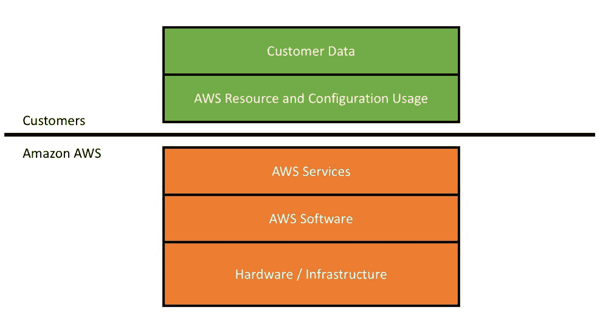
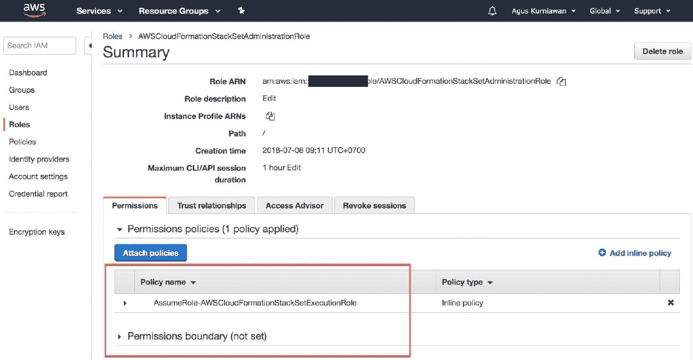
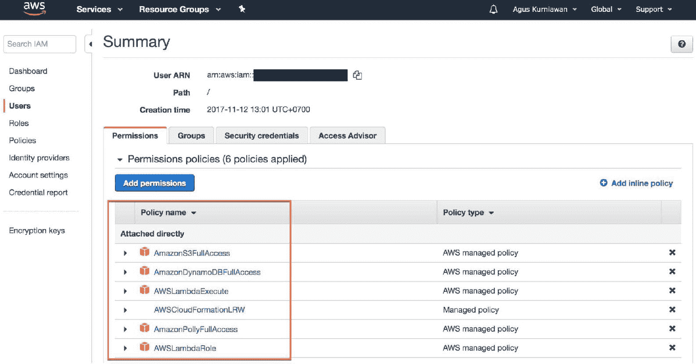

# AWS CloudFormation 安全

设计和部署基础设施时，涉及安全问题时需要特别小心。在本章中，我们探讨了如何构建符合安全要求的基础设施即代码（IaC）。我们还探讨了一些安全最佳实践和建议，以便应用于安全的 AWS CloudFormation。

以下是我们将要探讨的主题列表：

+   AWS CloudFormation 的安全威胁和模型

+   AWS 安全最佳实践

+   管理所有 AWS 资源的安全

+   减少对 CloudFormation 堆栈的安全访问

+   堆栈策略

+   CloudFormation 的 IAM 条件

+   AWS 安全检查清单

# AWS CloudFormation 的安全威胁和模型

Amazon AWS 由 AWS 服务组成。你在系统中使用 AWS 服务越多，系统面临的安全风险也就越大。每个 AWS 服务都需要特别关注，以解决安全问题。

理解我们系统中的安全威胁和模型，可以帮助我们解决安全问题。Amazon AWS 提供了 AWS 安全资源，帮助我们加强系统的安全性。请参考[`aws.amazon.com/security/security-resources/`](https://aws.amazon.com/security/security-resources/)。

AWS 安全基于共享安全责任模型。这意味着 Amazon 负责保护其基础设施，而你需要为自己在云中部署和存储的数据与应用程序设置安全控制措施。你可以通过此链接找到 AWS 安全责任模型的详细信息，[`aws.amazon.com/compliance/shared-responsibility-model/`](https://aws.amazon.com/compliance/shared-responsibility-model/)。

AWS 保护运行在 AWS Cloud 中的所有服务的基础设施。该基础设施包括运行 AWS Cloud 服务的硬件、软件、网络和设施。除此之外，客户需要负责满足 AWS 配置安全要求，确保每个 AWS 资源部署到其系统中时的安全性。我们在*图 6-1*中描述了这一模型。作为客户，我们应该更多关注系统的实现，如数据和配置/设置。



图 6-1：AWS 安全责任模型的示意图

我们还将回顾一些安全威胁建模，以便了解系统风险。一个简单的安全威胁建模示例是 STRIDE 模型，由微软创建。技术上讲，这一模型应用于计算机系统，但我们可以将其应用于我们的 AWS 安全威胁模型。以下表格简要描述了 STRIDE 模型。有关 STRIDE 的更多信息，可以访问[`docs.microsoft.com/en-us/previous-versions/commerce-server/ee823878(v=cs.20)`](https://docs.microsoft.com/en-us/previous-versions/commerce-server/ee823878(v=cs.20))。

| **安全威胁** | **缓解措施** | **缓解示例** |
| --- | --- | --- |

| 欺骗 | 身份验证 | 密码 多因素身份验证

数字签名 |

| 篡改 | 完整性 | 权限/ACLs 数字签名 |
| --- | --- | --- |
| 否认 | 不可否认 | 安全日志记录与审计 数字签名 |
| 信息泄露 | 保密性 | 加密 权限/访问控制列表（ACLs） |

| 拒绝服务（DoS） | 可用性 | 权限/ACLs 过滤

配额 |

| 权限提升 | 授权 | 权限/ACLs 输入验证 |
| --- | --- | --- |

亚马逊 AWS 还提供安全服务，帮助你调查系统实现情况。它们可以分析你的系统，识别安全威胁和风险。它们还可以对你的 AWS 平台进行渗透测试。如果你有兴趣，可以在此网站上申请此服务，[`aws.amazon.com/security/penetration-testing/`](https://aws.amazon.com/security/penetration-testing/)。

以下是 AWS 可以帮助你进行渗透测试的 AWS 资源列表。

+   EC2

+   RDS

+   Aurora

+   CloudFront

+   API Gateway

+   Lambda

+   Lightsail

+   DNS 区域漫游

一些第三方本地和全球公司也可以帮助你调查安全威胁。例如，ThreatModeler 提供工具帮助你识别安全威胁，然后建立其 AWS 威胁模型。你可以通过以下链接阅读 ThreatModeler 关于 AWS Web 应用程序威胁模型的总结报告，[`threatmodeler.com/wp-content/uploads/2018/04/AWS-Basic-Web-App-Hosting-Summary-Report.pdf`](https://threatmodeler.com/wp-content/uploads/2018/04/AWS-Basic-Web-App-Hosting-Summary-Report.pdf)。

# AWS 安全最佳实践

降低 AWS 系统安全风险的更简单方法是遵循最佳实践。一般来说，最佳实践是安全专家基于其处理安全问题经验的安全建议。

亚马逊 AWS 提供了 AWS 安全最佳实践，帮助其客户在 AWS 平台上部署系统时加强安全。你可以在[`d1.awsstatic.com/whitepapers/Security/AWS_Security_Best_Practices.pdf`](https://d1.awsstatic.com/whitepapers/Security/AWS_Security_Best_Practices.pdf)阅读此内容。

# 管理所有 AWS 资源的安全性

AWS Amazon 提供了一个安全中心，用于管理所有 AWS 资源的安全访问。我们可以通过 AWS IAM 查看用户、角色及其访问 AWS 资源时的权限。可以在[`console.aws.amazon.com/iam/`](https://console.aws.amazon.com/iam/)查看此内容。

*图 6-2*展示了一个 IAM 用户。我们可以配置其权限和策略，确保用户的安全。如果你认为该用户未被使用，应该从 AWS IAM 中删除它。



图 6-2：管理 AWS IAM 上角色的权限

你还应该注意你的 IAM 角色。应审查所有角色权限。如果 IAM 角色未使用某些权限，应将其移除。*图 6-3*展示了一个 IAM 角色及其权限：



图 6-3：管理 AWS IAM 上的用户权限

# 降低对 CloudFormation 堆栈的安全访问

所有 AWS 资源都可以通过 AWS IAM 进行管理，包括策略和用户或角色。AWS CloudFormation 使用 IAM 控制其模板部署的安全性。我们可以在 CloudFormation 模板上使用 IAM 策略。CloudFormation 策略可以如下定义。

```
{
  "Statement" : [
    {
      "Effect" : "Deny_or_Allow",
      "Action" : "update_actions",
      "Principal" : "*",
      "Resource" : "LogicalResourceId/resource_logical_ID",
      "Condition" : {
        "StringEquals_or_StringLike" : {
          "ResourceType" : [resource_type, ...]
        }
      }
    } 
  ]
}
```

建议您限制对 CloudFormation 中资源的安全访问。此方法应用最小权限原则。例如，我们从 IAM 用户或角色中移除对 CloudFormation 堆栈的更新和删除访问权限。以下是一个模板示例。

```
{
    "Version":"2012-10-17",
    "Statement":[{
        "Effect":"Allow",
        "Action":[ 
            "cloudformation:*"
        ],
        "Resource":"*"
    },
    {
        "Effect":"Deny",
        "Action":[ 
            "cloudformation:UpdateStack",
            "cloudformation:DeleteStack"
        ],
        "Resource":"arn:aws:cloudformation:us-east-1:123456789012:stack/MyStack/*"
    }]
}
```

该 CloudFormation 模板允许访问所有 CloudFormation API，但拒绝`UpdateStack`和`DeleteStack` API 访问您的 MyStack 堆栈。

您应该审查所有资源的使用情况，并分析应应用于模板的安全访问类型。关于 CloudFormation 操作，我们可以使用以下操作并应用最小权限原则。

+   取消更新堆栈

+   继续更新回滚

+   创建堆栈

+   删除堆栈

+   描述堆栈事件

+   描述堆栈资源

+   描述堆栈资源

+   描述堆栈

+   估算模板成本

+   获取堆栈策略

+   获取模板

+   获取模板摘要

+   列出导出

+   列出导入

+   列出堆栈资源

+   列出堆栈

+   设置堆栈策略

+   更新堆栈

+   更新终止保护

+   验证模板

您可以查看此网站上的所有操作，[`docs.aws.amazon.com/AWSCloudFormation/latest/APIReference/Welcome.html`](https://docs.aws.amazon.com/AWSCloudFormation/latest/APIReference/Welcome.html)。

# 堆栈策略

在某些情况下，由于对资源的意外更改，您可能会导致框架崩溃。您的团队可能会对 CloudFormation 进行更改，导致框架不稳定。CloudFormation 提供堆栈策略，可以防止堆栈资源在堆栈更新过程中意外被刷新或删除。我们可以与 IAM 和堆栈策略集成，以防止意外和恶意的资源更改。

您应该设置或更新策略，您的 IAM 用户或角色应能够调用`cloudformation:SetStackPolicy`操作。默认情况下，设置堆栈策略会通过拒绝所有堆栈资源的更新，除非您显式指定允许。例如，我们在系统上线后，保护特定资源不被更新。您可以查看以下 CloudFormation 模板。

```
{
  "Statement" : [
    {
      "Effect" : "Deny",
      "Action" : "Update:*",
      "Principal": "*",
      "Resource" : "<certain_resource>"
    },
    {
      "Effect" : "Allow",
      "Action" : "Update:*",
      "Principal": "*",
      "Resource" : "*"
    }
  ]
}
```

# CloudFormation 的 IAM 条件

如果我们拥有相应的 IAM 策略，我们可以通过 CloudFormation 创建或删除特定的 AWS 资源。有时，您不需要 CloudFormation 操作中的创建任务。我们可以实施 IAM 条件来应用这种情况。

总的来说，CloudFormation 提供与 IAM 条件相关的 IAM 策略。以下是 IAM 条件策略的列表：

+   `cloudformation:TemplateURL`

+   `cloudformation:ResourceTypes`

+   `cloudformation:StackPolicyURL`

当您应用 IAM 条件时，可以确保针对堆栈操作的 API 调用（例如创建、更新实例或针对特定模板）仅限于特定资源。

`cloudformation:TemplateURL` 是一个 CloudFormation 属性，表示 CloudFormation 模板文件的位置。它可以是 .json、.yaml 或 .template 文件格式。例如，我们在 CloudFormation 模板上应用一个 IAM 条件，如下所示。

```
{
    "Version":"2012-10-17",
    "Statement":[{
        "Effect": "Deny",
        "Action": [
            "cloudformation:CreateStack",
            “cloudformation:UpdateStack”
        ],
        "Resource": "*",
        "Condition": {
            "StringNotEquals": {
                "cloudformation:TemplateURL": [
                    "https://s3.amazonaws.com/cloudformation-templates-us-east-1/IAM_Users_Groups_and_Policies.template"
                ]
            }
        }
    },
    {
        "Effect": "Deny",
        "Action": [
            "cloudformation:CreateStack",
            "cloudformation:UpdateStack"
        ],
        "Resource": "*",
        "Condition": {
            "Null": {
                "cloudformation:TemplateURL": "true"
            }
        }
    }]
}
```

此模板确保对于所有 `CreateStack` 或 `UpdateStack` API 调用，用户必须使用指定的模板。否则，操作将被拒绝。

`Condition:StackPolicyURL` 使您的 CloudFormation 在创建时能够使用 `StackPolicyURL` 条件应用堆栈策略。以下是来自 AWS 的一个 CloudFormation 模板，示范如何在模板中使用 cloudformation:StackPolicyUrl。

```
{
    "Version":"2012-10-17",
    "Statement":[
    {
            "Effect": "Deny",
            "Action": [
                "cloudformation:SetStackPolicy"
            ],
            "Resource": "*",
            "Condition": {
                "ForAnyValue:StringNotEquals": {
                    "cloudformation:StackPolicyUrl": [
                        "https://s3.amazonaws.com/samplebucket/sampleallowpolicy.json"
                    ]
                }
            }
        }, 
       {
        "Effect": "Deny",
        "Action": [
            "cloudformation:CreateStack",
            "cloudformation:UpdateStack"
        ],
        "Resource": "*",
        "Condition": {
            "ForAnyValue:StringNotEquals": {
                "cloudformation:StackPolicyUrl": [
                    “https://s3.amazonaws.com/samplebucket/sampledenypolicy.json”
                ]
            }
        }
    },
    {
        "Effect": "Deny",
        "Action": [
            "cloudformation:CreateStack",
            "cloudformation:UpdateStack",
            “cloudformation:SetStackPolicy”
        ],
        "Resource": "*",
        "Condition": {
            "Null": {
                "cloudformation:StackPolicyUrl": "true"
            }
        }
    }]
}
```

# AWS 安全检查清单

在通过 CloudFormation 设计并部署系统到 AWS 平台后，最后一项任务是确保您的系统符合 AWS 安全要求。AWS 提供了一个安全检查清单，其中包含安全检查操作。您可以通过以下文档了解安全检查清单：[`d1.awsstatic.com/whitepapers/Security/AWS_Security_Checklist.pdf`](https://d1.awsstatic.com/whitepapers/Security/AWS_Security_Checklist.pdf)。该文档包括以下三个关于不同 AWS 资源的安全检查清单：

+   一般安全检查清单

+   EC2/VPC/EBS 安全检查清单

+   S3 安全检查清单

使用 AWS 安全检查清单，您的系统可能存在较低的安全风险。但再次提醒，定期进行渗透测试总是更好的。

# 总结

在本章中，我们学习了如何确保使用 AWS CloudFormation 部署的资源的安全性。最后，我们深入了解了 CloudFormation 的安全威胁和模型。
