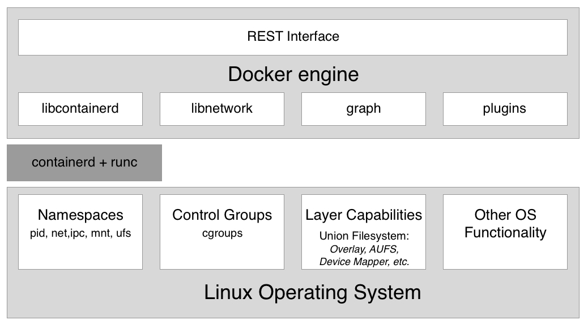

# 第一章：什么是容器，为什么我应该使用它们？

本章将介绍容器及其编排的世界。本书从最基础开始，假设你没有任何容器的相关知识，并将为你提供一个非常实用的入门介绍。

本章将重点讨论软件供应链及其中的摩擦。接着，我们将介绍容器，它们用于减少这种摩擦并在其上增加企业级的安全性。我们还将探讨容器及其周围生态系统是如何组装的。我们将特别指出，容器的上游**开源软件**（**OSS**）组件，统一以 Moby 为代号，这些组件构成了 Docker 及其他供应商的下游产品的基石。

本章内容包括以下主题：

+   什么是容器？

+   为什么容器如此重要？

+   对我或我的公司有什么好处？

+   Moby 项目

+   Docker 产品

+   容器架构

完成本模块后，你将能够做到以下几点：

+   用简单的几句话，使用类似物理容器的类比，向感兴趣的外行人解释容器是什么。

+   使用类比解释为什么容器如此重要，比如将物理容器与传统运输方式或公寓房屋与独立住宅进行比较，以此向感兴趣的外行人说明。

+   列举至少四个被 Docker 产品使用的上游开源组件，比如 Docker for Desktop。

+   识别至少三个 Docker 产品。

# 什么是容器？

软件容器是一个相当抽象的概念，因此如果我们从一个大多数人都很熟悉的类比入手，可能会更容易理解。这个类比是运输行业中的货运集装箱。纵观历史，人们一直在通过各种方式运输货物。轮子发明之前，货物很可能是通过袋子、篮子或箱子，由人类自己肩挑，或者他们可能会使用驴、骆驼或大象等动物来运输。

随着轮子的发明，运输变得更加高效，人类修建了可以推动马车的道路，能够一次运输更多的货物。随着第一台蒸汽驱动机器的问世，后续出现的汽油发动机，运输变得更加强大。现在，我们可以通过火车、船舶和卡车运输大量的货物。同时，货物的种类越来越多，有时也变得更加复杂，难以处理。

在这几千年的发展中，有一件事始终没有改变，那就是需要在目标地点卸下货物，并可能将它们装上另一种运输工具。比如，农民将一车苹果运到一个中央火车站，那里会将苹果与其他许多农民的苹果一起装上火车。又比如，酿酒师将装满酒桶的卡车运到港口，货物被卸下后再转移到船上，运往海外。

将货物从一种运输工具卸下再装上另一种运输工具的过程，曾经是一个非常复杂且繁琐的流程。每种类型的产品都有自己独特的包装方式，因此需要以特定的方式处理。此外，散装货物还面临着被不道德工人偷窃或在处理过程中损坏的风险。

然后，集装箱出现了，它们彻底改变了运输行业。集装箱只是一个具有标准化尺寸的金属盒子。每个集装箱的长度、宽度和高度都是一样的。这是一个非常重要的点。如果全世界没有就标准尺寸达成一致，集装箱的成功就不会像现在这样。

现在，借助标准化的集装箱，想要将货物从 A 地运输到 B 地的公司，会将这些货物装入这些集装箱。然后，他们会联系一个运输公司，运输公司会提供标准化的运输工具。这可以是一个能装载集装箱的卡车，或者是一个每个车厢可以运输一个或多个集装箱的火车。最后，我们有专门用来运输大量集装箱的船只。运输公司无需拆卸或重新包装货物。对于运输公司来说，集装箱只是一个黑色的盒子，他们对里面的东西不感兴趣，大多数情况下也不需要关心。它只是一个具有标准尺寸的大铁盒子。现在，包装货物进入集装箱的任务完全交由那些希望将货物运输出去的各方，他们应该知道如何处理和包装这些货物。

由于所有集装箱都具有相同的形状和尺寸，运输公司可以使用标准化的工具来处理集装箱；例如，起重机可以将集装箱从火车或卡车上卸下，再装到船上，反之亦然。只需一种类型的起重机，就可以处理所有过来的集装箱。此外，运输工具也可以标准化，比如集装箱船、卡车和火车。

正是由于这一切标准化，所有与货物运输相关的流程也得以标准化，从而比集装箱时代之前要高效得多。

现在，你应该已经很好地理解了为什么集装箱运输如此重要，以及它为什么能彻底改变整个运输行业。我故意选择这个类比，因为我们将要介绍的软件容器在所谓的软件供应链中，正好履行了与运输行业中集装箱相同的角色。

在过去，开发者会开发一个新的应用程序。一旦他们认为应用程序完成了，就会将其交给运维工程师，后者负责将其安装到生产服务器上并启动。如果运维工程师足够幸运，他们甚至能从开发者那里获得一份相对准确的安装文档。到此为止，一切顺利，生活也变得简单。

但当一个企业中有多个开发团队，开发出不同类型的应用，而这些应用却都需要安装在同一台生产服务器上并保持运行时，事情就变得有些失控了。通常，每个应用都有一些外部依赖，例如它基于的框架、所使用的库等等。有时，两个应用使用相同的框架，但版本不同，这可能会导致兼容性问题。我们的运维工程师的工作变得越来越困难。他们必须非常有创意地想办法在不出问题的情况下将不同的应用加载到（他们的服务器）上。

安装某个应用的新版本如今已经变成了一个复杂的项目，通常需要几个月的规划和测试。换句话说，软件供应链中存在很多摩擦。然而，现在的公司越来越依赖软件，发布周期需要变得越来越短。我们已经无法再只每年发布一两次了。应用需要在几周或几天内更新，有时甚至是每天多次更新。不遵守这一点的公司，因缺乏敏捷性而面临破产的风险。那么，解决方案是什么呢？

最初的一个解决方法是使用**虚拟机**（**VMs**）。公司不再在同一台服务器上运行多个应用，而是将每个应用打包并在各自的虚拟机上运行。通过这种方式，所有的兼容性问题都解决了，生活似乎恢复了平静。不幸的是，这种幸福没有持续多久。虚拟机本身非常“沉重”，因为每个虚拟机都包含一个完整的操作系统，如 Linux 或 Windows Server，而这一切只是为了运行单个应用。这就像你在运输行业中，使用整艘船只来运输一车香蕉。真是浪费！这种方式永远无法盈利。

解决这个问题的终极方案是提供比虚拟机（VMs）更轻量级的东西，但又能够完美封装需要运输的物品。在这里，物品指的是由我们的开发者编写的实际应用程序，并且——这点很重要——还包括所有应用程序的外部依赖项，如框架、库、配置等。这种软件包装机制的“圣杯”就是*Docker 容器*。

开发者使用 Docker 容器将他们的应用程序、框架和库打包到其中，然后将这些容器交给测试人员或运维工程师。对于测试人员和运维工程师来说，容器只是一个黑盒子。尽管如此，它是一个标准化的黑盒子。所有容器，不管内部运行什么应用，都可以平等对待。工程师知道，如果任何容器能够在他们的服务器上运行，那么其他容器也应该能运行。除了一些总会存在的边缘情况外，这一点是成立的。

因此，Docker 容器是一种以标准化方式打包应用程序及其依赖项的手段。然后，Docker 创造了“*构建、运输和随处运行*”这一说法。

# 为什么容器如此重要？

现如今，应用程序的更新发布周期越来越短，但软件本身却没有变得更简单。相反，软件项目的复杂性不断增加。因此，我们需要一种方法来驯服这一“猛兽”，简化软件供应链。

此外，我们每天都听到网络攻击正在上升。许多知名公司已经或曾经受到过安全漏洞的影响。像社会安全号码、信用卡信息等高度敏感的客户数据在此类事件中被盗取。但不仅仅是客户数据受到威胁——公司的敏感机密也同样被盗取。

容器可以在许多方面提供帮助。首先，Gartner 发现，运行在容器中的应用比那些没有运行在容器中的应用更安全。容器利用 Linux 安全原语，如 Linux 内核*命名空间*，将运行在同一台计算机上的不同应用程序进行沙箱化，同时使用**控制组**（**cgroups**）来避免“噪声邻居”问题，即某个不良应用占用了服务器的所有可用资源，导致其他应用无法运行。

由于容器镜像是不可变的，因此很容易对其进行扫描，以检测**常见漏洞和暴露**（**CVE**），从而提高我们应用程序的整体安全性。

让我们的软件供应链更安全的另一种方法是让容器使用内容信任。内容信任基本上确保容器镜像的作者是真正的身份，并且容器镜像的消费者能够保证镜像在传输过程中没有被篡改。这种攻击被称为**中间人攻击**（**MITM**）。

我刚才所说的一切，当然在技术上也可以在不使用容器的情况下实现，但由于容器引入了一个全球公认的标准，它们使得实施这些最佳实践并加以执行变得更加容易。

好的，但安全并不是容器重要的唯一原因，还有其他原因。

其中一个原因是容器使得即使在开发者的笔记本电脑上，也能轻松模拟类似生产环境的情况。如果我们能容器化任何应用程序，那么我们也能容器化一个数据库，比如 Oracle 或 MS SQL Server。现在，任何曾经在计算机上安装过 Oracle 数据库的人都知道，这并不是一件容易的事，而且它会占用你电脑上大量宝贵的空间。你肯定不想为了测试你开发的应用程序是否真正能端到端运行而在开发笔记本上做这样的操作。有了容器，我们可以像说 1、2、3 一样，轻松地在容器中运行一个完整的关系型数据库。而且当测试完成后，我们只需停止并删除容器，数据库也会消失，不会在我们的电脑上留下任何痕迹。

由于与虚拟机相比，容器非常精简，因此在开发者的笔记本电脑上同时运行多个容器而不使电脑超负荷是很常见的情况。

容器重要的第三个原因是，运维人员终于可以专注于他们擅长的事情：提供基础设施并在生产环境中运行和监控应用程序。当他们需要在生产系统中运行的所有应用程序都是容器化的时，运维人员就可以开始标准化他们的基础设施。每台服务器就变成了另一个 Docker 主机。这些服务器上无需安装特殊的库或框架，只需要一个操作系统和容器运行时，比如 Docker。

此外，运维人员不再需要深入了解应用程序的内部结构，因为这些应用程序在容器中独立运行，这些容器对他们来说应该就像黑匣子一样，类似于运输行业中的货运集装箱对工作人员的意义。

# 那么，这对我或我的公司有什么好处呢？

有人曾经说过，今天每个一定规模的公司都必须认识到，他们需要成为一家软件公司。从这个意义上讲，现代银行是一家软件公司，恰好专注于金融业务。软件运行所有的业务，没错。随着每个公司都成为软件公司，建立软件供应链成为一种需求。为了保持竞争力，公司的软件供应链必须既安全又高效。效率可以通过全面的自动化和标准化来实现。但是，在安全、自动化和标准化这三个领域中，容器技术已经展现出卓越的优势。大型和知名企业报告称，当它们将现有的传统应用程序（许多人称之为旧版应用程序）容器化，并建立基于容器的完全自动化软件供应链时，能够将这些关键应用程序的维护成本降低 50%到 60%，并且能够将这些传统应用程序的新版本发布之间的时间缩短最多 90%。

话虽如此，采用容器技术为这些公司节省了大量资金，同时也加快了开发进程并缩短了上市时间。

# Moby 项目

最初，当 Docker（公司）推出 Docker 容器时，一切都是开源的。那个时候，Docker 没有任何商业产品。公司开发的 Docker 引擎是一个单体软件，包含了许多逻辑部分，例如容器运行时、网络库、**RESTful**（**REST**）API、命令行界面等等。

其他供应商或项目，如 Red Hat 或 Kubernetes，曾将 Docker 引擎应用于自己的产品中，但大多数情况下，他们只是使用了 Docker 引擎的部分功能。例如，Kubernetes 并没有使用 Docker 引擎的网络库，而是提供了自己的网络方式。Red Hat 则更倾向于不频繁更新 Docker 引擎，而是为 Docker 引擎的旧版本应用非官方补丁，但他们仍然称之为 Docker 引擎。

在所有这些原因，以及更多的原因中，出现了这样一个想法：Docker 必须采取措施，明确区分 Docker 的开源部分与 Docker 的商业部分。此外，公司还希望防止竞争对手利用并滥用 Docker 这一名称谋取私利。这就是 Moby 项目诞生的主要原因。Moby 项目作为一个伞式项目，涵盖了 Docker 开发并持续开发的大部分开源组件。这些开源项目现在不再使用 Docker 这个名称。

Moby 项目提供了用于镜像管理、秘密管理、配置管理、网络和配置等方面的组件，举几个例子。同时，Moby 项目的一部分是特殊的 Moby 工具，例如，用于将组件组装成可运行的工件。

一些技术上属于 Moby 项目的组件已被 Docker 捐赠给云原生计算基金会（CNCF），因此这些组件不再出现在组件列表中。最显著的包括 `notary`、`containerd` 和 `runc`，其中 `notary` 用于内容信任，后两个则组成了容器运行时。

# Docker 产品

Docker 目前将其产品线分为两个部分。一个是**社区版**（**CE**），它是闭源的但完全免费；另一个是**企业版**（**EE**），它也是闭源的，需要按年许可。这些企业产品提供 24/7 支持并包含错误修复。

# Docker CE

Docker 社区版的一部分包括像 Docker Toolbox 和 Docker for Desktop 这样适用于 Mac 和 Windows 的版本。这些产品主要面向开发人员。

Docker for Desktop 是一个易于安装的桌面应用程序，可以在 macOS 或 Windows 机器上构建、调试和测试 Docker 化的应用程序或服务。Docker for macOS 和 Docker for Windows 是完整的开发环境，深度集成了各自的虚拟化框架、网络和文件系统。这些工具是运行 Docker 于 Mac 或 Windows 上最快且最可靠的方式。

在 CE 版下，还有两个更偏向运维工程师的产品。这些产品是 Docker for Azure 和 Docker for AWS。

例如，使用原生 Azure 应用程序的 Docker for Azure，您可以通过几次点击即可在 Azure 上设置 Docker，它已优化并与底层 Azure **基础设施即服务**（**IaaS**）服务集成。它帮助运维工程师在 Azure 中构建和运行 Docker 应用时加速生产力。

Docker for AWS 的工作方式非常相似，但它是为 Amazon 云设计的。

# Docker EE

Docker 企业版由**统一控制平面**（**UCP**）和**Docker 受信注册表**（**DTR**）组成，它们都运行在 Docker Swarm 之上。这两个组件都是 Swarm 应用程序。Docker EE 基于 Moby 项目的上游组件，并添加了企业级功能，如**基于角色的访问控制**（**RBAC**）、多租户、Docker Swarm 和 Kubernetes 混合集群、基于 Web 的 UI、内容信任以及图像扫描等。

# 容器架构

现在，让我们讨论一下一个能够运行 Docker 容器的系统是如何设计的。下图展示了已安装 Docker 的计算机的外观。请注意，安装了 Docker 的计算机通常被称为 Docker 主机，因为它可以运行或托管 Docker 容器：

Docker 引擎的高级架构图

在上面的图中，我们可以看到三个关键部分：

+   底部是**Linux 操作系统**

+   在中间，深灰色部分是容器运行时

+   在顶部，我们有 **Docker 引擎**

容器之所以可能，是因为 Linux 操作系统提供了一些基本功能，比如命名空间、控制组、层能力等，所有这些都被容器运行时和 Docker 引擎以非常特定的方式利用。Linux 内核命名空间，如**进程 ID**（**pid**）命名空间或**网络**（**net**）命名空间，允许 Docker 封装或沙箱化在容器内运行的进程。**控制组**确保容器不会受到“噪音邻居”现象的影响，即一个在容器中运行的单个应用程序可以消耗整个 Docker 主机的大部分或所有可用资源。**控制组**允许 Docker 限制每个容器分配的资源，如 CPU 时间或 RAM 数量。

Docker 主机上的容器运行时由 `containerd` 和 `runc` 组成。`runc` 是容器运行时的低级功能，而基于 `runc` 的 `containerd` 提供了更高级的功能。两者都是开源的，并且已由 Docker 捐赠给 CNCF。

容器运行时负责容器的整个生命周期。如果需要，它会从注册表中拉取容器镜像（容器的模板），基于该镜像创建容器，初始化并运行容器，最终在需要时停止并从系统中移除容器。

**Docker 引擎** 在容器运行时之上提供了额外的功能，例如网络库或插件支持。它还提供了一个 REST 接口，通过该接口可以自动化所有容器操作。本书中我们将频繁使用的 Docker 命令行界面就是这个 REST 接口的消费者之一。

# 总结

在本章中，我们研究了容器如何大大减少软件供应链的摩擦，并且在此基础上，使供应链更加安全。

在下一章，我们将学习如何准备个人或工作环境，以便我们能够高效且有效地使用 Docker。所以，请继续关注。

# 问题

请回答以下问题以评估你的学习进度：

1.  哪些说法是正确的（可能有多个答案）？

A. 容器是一种轻量级虚拟机

B. 容器仅在 Linux 主机上运行

C. 容器只能运行一个进程

D. 容器中的主进程始终具有 PID 1

E. 容器是一个或多个被 Linux 命名空间封装并受到 cgroups 限制的进程

1.  用你自己的话，也许通过类比，解释一下什么是容器。

1.  为什么容器被认为是 IT 领域的变革者？列举三到四个原因。

1.  当我们说：“如果一个容器在给定平台上运行，那么它可以在任何地方运行……”这是什么意思？列举两到三个原因，说明为什么这是正确的。

1.  Docker 容器仅对基于微服务的现代绿色田野应用程序非常有用。请解释你的答案。

A. 正确

B. 错误

1.  将企业的传统应用程序容器化后，通常能节省多少成本？

A. 20%

B. 33%

C. 50%

D. 75%

1.  容器基于 Linux 的哪两个核心概念？

# 进一步阅读

以下是一些链接，带有更多关于本章讨论内容的详细信息：

+   Docker 概述：[`docs.docker.com/engine/docker-overview/`](https://docs.docker.com/engine/docker-overview/)

+   Moby 项目：[`mobyproject.org/`](https://mobyproject.org/)

+   Docker 产品：[`www.docker.com/get-started`](https://www.docker.com/get-started)

+   云原生计算基金会：[`www.cncf.io/`](https://www.cncf.io/)

+   containerd – 行业标准的容器运行时：[`containerd.io/`](https://containerd.io/)
