# 第二章：设置工作环境

在上一章，我们了解了 Docker 容器是什么以及它们的重要性。我们学习了容器在现代软件供应链中解决了哪些问题。

在本章中，我们将准备个人或工作环境，以便高效、有效地使用 Docker。我们将详细讨论如何为开发人员、DevOps 和运维人员设置理想的工作环境，这些环境可以在使用 Docker 容器时使用。

本章包含以下内容：

+   Linux 命令行

+   Windows 的 PowerShell

+   安装和使用包管理器

+   安装 Git 并克隆代码仓库

+   选择和安装代码编辑器

+   在 macOS 或 Windows 上安装 Docker for Desktop

+   安装 Docker Toolbox

+   安装 Minikube

# 技术要求

对于本章，你将需要一台安装了 macOS 或 Windows 的笔记本电脑或工作站，最好是安装了 Windows 10 专业版。你还需要具备可用的互联网连接，以便下载应用程序并安装这些应用程序。

如果你的操作系统是 Linux 发行版，例如 Ubuntu 18.04 或更新版本，你也可以跟随本书的内容进行学习。我会尽力指出在命令和示例上与 macOS 或 Windows 存在显著差异的地方。

# Linux 命令行

Docker 容器最初是在 Linux 上为 Linux 开发的。因此，使用的主要命令行工具（也叫 shell）是 Unix shell；记住，Linux 来源于 Unix。大多数开发人员使用 Bash shell。在一些轻量级的 Linux 发行版中，例如 Alpine，Bash 默认未安装，因此需要使用更简单的 Bourne shell，通常称为 *sh*。每当我们在 Linux 环境中工作时，无论是在容器内还是在 Linux 虚拟机中，我们都会根据其可用性使用 `/bin/bash` 或 `/bin/sh`。

尽管苹果的 macOS X 不是 Linux 操作系统，但 Linux 和 macOS X 都是 Unix 系统的变种，因此支持相同的工具集。其中包括 shell 工具。因此，在 macOS 上工作时，你很可能会使用 Bash shell。

本书中，我们希望你熟悉最基本的 Bash 和 PowerShell 脚本命令，尤其是在 Windows 系统上工作时。如果你是完全的初学者，我们强烈建议你参考以下备忘单：

+   *Linux 命令行备忘单* 由 Dave Child 提供，链接在 [`bit.ly/2mTQr8l`](http://bit.ly/2mTQr8l)

+   *PowerShell 基本备忘单* 可在 [`bit.ly/2EPHxze`](http://bit.ly/2EPHxze) 查看

# Windows 的 PowerShell

在 Windows 电脑、笔记本电脑或服务器上，我们有多种命令行工具可供使用。最常见的是命令提示符，它已经在任何 Windows 电脑上存在了几十年。它是一个非常简单的 shell。为了更高级的脚本编写，微软开发了 PowerShell。PowerShell 非常强大，并且在 Windows 上工作的工程师中非常流行。在 Windows 10 上，我们终于有了所谓的 *Windows 子系统 Linux*，它允许我们使用任何 Linux 工具，如 Bash 或 Bourne shell。除此之外，还有其他工具可以在 Windows 上安装 Bash shell，例如 Git Bash shell。在本书中，所有命令都将使用 Bash 语法。大多数命令也可以在 PowerShell 中运行。

因此，我们建议你使用 PowerShell 或任何其他 Bash 工具来在 Windows 上使用 Docker。

# 使用包管理器

在 macOS 或 Windows 笔记本电脑上安装软件的最简单方法是使用一个好的包管理器。在 macOS 上，大多数人使用 Homebrew，而在 Windows 上，Chocolatey 是一个不错的选择。如果你使用的是基于 Debian 的 Linux 发行版，例如 Ubuntu，那么大多数人的包管理器选择是默认安装的 `apt`。

# 在 macOS 上安装 Homebrew

Homebrew 是 macOS 上最流行的包管理器，使用起来简单且非常灵活。在 macOS 上安装 Homebrew 很简单；只需按照[`brew.sh/`](https://brew.sh/)上的说明操作：

1.  简而言之，打开一个新的终端窗口并执行以下命令来安装 Homebrew：

```
$ /usr/bin/ruby -e "$(curl -fsSL https://raw.githubusercontent.com/Homebrew/install/master/install)"
```

1.  安装完成后，使用 `brew --version` 命令在终端中测试 Homebrew 是否正常工作。你应该看到类似下面的内容：

```
$ brew --version
Homebrew 2.1.4
Homebrew/homebrew-core (git revision 77d1b; last commit 2019-06-07)
```

1.  现在，我们准备使用 Homebrew 安装工具和实用程序。例如，如果我们想要安装 Vi 文本编辑器，可以这样操作：

```
$ brew install vim
```

这将下载并为你安装编辑器。

# 在 Windows 上安装 Chocolatey

Chocolatey 是一个流行的 Windows 包管理器，基于 PowerShell。要安装 Chocolatey 包管理器，请按照[`chocolatey.org/`](https://chocolatey.org/)上的说明操作，或者以管理员身份打开一个新的 PowerShell 窗口并执行以下命令：

```
PS> Set-ExecutionPolicy Bypass -Scope Process -Force; iex ((New-Object System.Net.WebClient).DownloadString('https://chocolatey.org/install.ps1'))
```

重要的是，以管理员身份运行上述命令，否则安装将无法成功。

1.  安装 Chocolatey 后，使用 `choco --version` 命令测试它。你应该能看到类似以下的输出：

```
PS> choco --version
0.10.15
```

1.  要安装像 Vi 编辑器这样的应用程序，请使用以下命令：

```
PS> choco install -y vim
```

`-y` 参数确保安装过程中不会要求重新确认。

请注意，一旦 Chocolatey 安装了一个应用程序，你需要打开一个新的 PowerShell 窗口才能使用该应用程序。

# 安装 Git

我们使用 Git 从本书的 GitHub 仓库中克隆示例代码。如果你已经在电脑上安装了 Git，可以跳过这一节：

1.  要在 macOS 上安装 Git，请在终端窗口中使用以下命令：

```
$ choco install git
```

1.  要在 Windows 上安装 Git，请打开 PowerShell 窗口并使用 Chocolatey 安装它：

```
PS> choco install git -y
```

1.  最后，在你的 Debian 或 Ubuntu 机器上，打开 Bash 控制台并执行以下命令：

```
$ sudo apt update && sudo apt install -y git
```

1.  一旦 Git 安装完成，验证它是否工作。所有平台上都使用以下命令：

```
$ git --version
```

这应该会输出类似于以下内容的结果：

```
git version 2.16.3
```

1.  现在 Git 已经可以正常工作，我们可以从 GitHub 克隆本书随附的源代码。执行以下命令：

```
$ cd ~
$ git clone https://github.com/PacktPublishing/Learn-Docker---Fundamentals-of-Docker-19.x-Second-Edition fod-solution
```

这将把主分支的内容克隆到你的本地文件夹 `~/fod-solution` 中。这个文件夹现在将包含我们在本书中一起完成的所有实验室的示例解决方案。如果你遇到困难，可以参考这些示例解决方案。

现在我们已经安装了基本工具，让我们继续使用代码编辑器。

# 选择一个代码编辑器

使用好的代码编辑器对于高效使用 Docker 至关重要。当然，哪个编辑器最好是一个备受争议的话题，取决于个人的偏好。很多人使用 Vim，或者其他一些编辑器，如 Emacs、Atom、Sublime，或者 **Visual Studio Code**（**VS Code**），仅举几例。VS Code 是一个完全免费的轻量级编辑器，但它非常强大，支持 macOS、Windows 和 Linux。根据 Stack Overflow 的数据，它目前是最受欢迎的代码编辑器。如果你还没有决定使用其他编辑器，强烈建议你尝试一下 VS Code。

但是，如果你已经有了喜欢的代码编辑器，请继续使用它。只要你能编辑文本文件就可以了。如果你的编辑器支持 Dockerfile、JSON 和 YAML 文件的语法高亮，那就更好了。唯一的例外是第六章，*调试容器中运行的代码*。该章中的示例将特别针对 VS Code 进行定制。

# 在 macOS 上安装 VS Code

按照以下步骤进行安装：

1.  打开一个新的终端窗口并执行以下命令：

```
$ brew cask install visual-studio-code
```

1.  一旦 VS Code 安装成功，导航到你的主目录（`~`）并创建一个文件夹 `fundamentals-of-docker`；然后进入这个新文件夹：

```
$ mkdir ~/fundamentals-of-docker && cd ~/fundamentals-of-docker
```

1.  现在从此文件夹中打开 VS Code：

```
$ code .
```

不要忘记前面命令中的点（.）。VS Code 将启动并将当前文件夹（`~/fundamentals-of-docker`）作为工作文件夹打开。

# 在 Windows 上安装 VS Code

按照以下步骤进行安装：

1.  在管理员模式下打开一个新的 PowerShell 窗口，并执行以下命令：

```
PS> choco install vscode -y
```

1.  关闭 PowerShell 窗口并打开一个新窗口，确保 VS Code 已添加到你的路径中。

1.  现在导航到你的主目录并创建一个文件夹 `fundamentals-of-docker`；然后进入这个新文件夹：

```
PS> mkdir ~\fundamentals-of-docker; cd ~\fundamentals-of-docker
```

1.  最后从此文件夹中打开 Visual Studio Code：

```
PS> code .
```

不要忘记前面命令中的点（.）。VS 将启动并将当前文件夹（`~\fundamentals-of-docker`）作为工作文件夹打开。

# 在 Linux 上安装 VS Code

按照以下步骤进行安装：

1.  在你的 Debian 或 Ubuntu 基础的 Linux 机器上，打开一个 Bash 终端，执行以下命令来安装 VS Code：

```
$ sudo snap install --classic code
```

1.  如果你使用的是非 Debian 或 Ubuntu 基础的 Linux 发行版，请点击以下链接获取更多详细信息：[`code.visualstudio.com/docs/setup/linux`](https://code.visualstudio.com/docs/setup/linux)

1.  一旦 VS Code 成功安装，导航到你的主目录（`~`）并创建一个名为 `fundamentals-of-docker` 的文件夹；然后进入这个新文件夹：

```
$ mkdir ~/fundamentals-of-docker && cd ~/fundamentals-of-docker
```

1.  现在，从该文件夹内打开 Visual Studio Code：

```
$ code .
```

不要忘记前面命令中的句点（.）。VS 将启动并将当前文件夹（`~/fundamentals-of-docker`）作为工作文件夹打开。

# 安装 VS Code 扩展

扩展是让 VS Code 成为多功能编辑器的关键。在所有三个平台——macOS、Windows 和 Linux 上，你都可以以相同的方式安装 VS Code 扩展：

1.  打开一个 Bash 控制台（在 Windows 上是 PowerShell），执行以下一组命令来安装我们在本书接下来的示例中将使用的最基本的扩展：

```
code --install-extension vscjava.vscode-java-pack
code --install-extension ms-vscode.csharp
code --install-extension ms-python.python
code --install-extension ms-azuretools.vscode-docker
code --install-extension eamodio.gitlens
```

我们正在安装一些扩展，以便我们能更高效地使用 Java、C#、.NET 和 Python 工作。我们还将安装一个旨在提升 Docker 使用体验的扩展。

1.  在前面提到的扩展成功安装后，重启 VS Code 以激活这些扩展。现在，你可以点击 VS Code 左侧活动面板中的扩展图标，查看所有已安装的扩展。

接下来，让我们安装 Docker for Desktop。

# 安装 Docker for Desktop

如果你正在使用 macOS 或者在你的笔记本上安装了 Windows 10 专业版，那么我们强烈建议你安装 Docker for Desktop。这个平台能为你提供最佳的容器工作体验。

目前，Docker for Desktop 不支持 Linux。请参考 *在 Linux 上安装 Docker CE* 部分获取更多信息。

请注意，较旧版本的 Windows 或 Windows 10 家庭版无法运行 Docker for Windows。Docker for Windows 使用 Hyper-V 在虚拟机中透明运行容器，但 Hyper-V 在旧版本的 Windows 上不可用；也无法在 Windows 10 家庭版中使用。在这种情况下，我们建议你使用 Docker Toolbox，具体内容我们将在下一节中介绍。

按照以下步骤操作：

1.  无论你使用的是什么操作系统，都可以前往 Docker 的起始页 [`www.docker.com/get-started`](https://www.docker.com/get-started)。

1.  在加载页面的右侧，你会看到一个大蓝色按钮，上面写着 “Download Desktop and Take a Tutorial”。点击该按钮并按照指示操作。你将被重定向到 Docker Hub。如果你还没有 Docker Hub 账户，创建一个。账户完全免费，但下载软件需要注册。如果已有账户，直接登录即可。

1.  登录后，请留意页面上的这个内容：

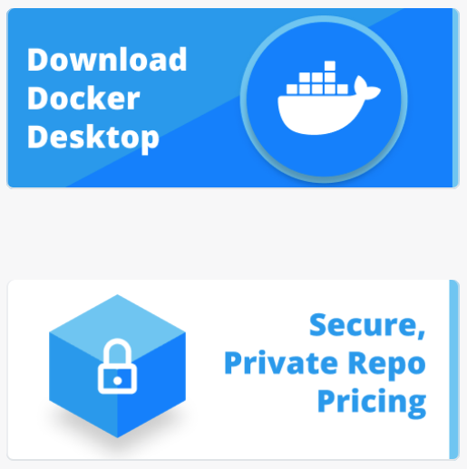

在 Docker Hub 上下载 Docker Desktop

1.  点击蓝色的“下载 Docker Desktop”按钮。然后您应该看到如下界面：

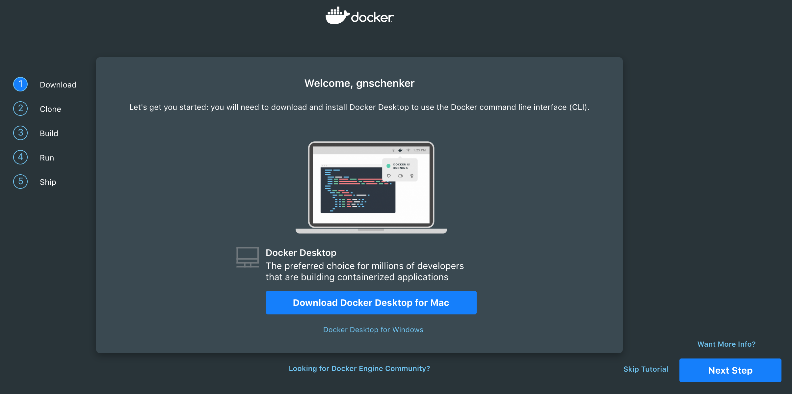

下载适用于 macOS 的 Docker Desktop 安装界面

请注意，如果您使用的是 Windows 电脑，蓝色按钮将显示为“下载 Docker Desktop for Windows”。

# 在 macOS 上安装 Docker for Desktop

请按照以下步骤进行安装：

1.  成功安装适用于 macOS 的 Docker Desktop 后，请打开终端窗口并执行以下命令：

```
$ docker version
```

您应该看到类似如下的内容：

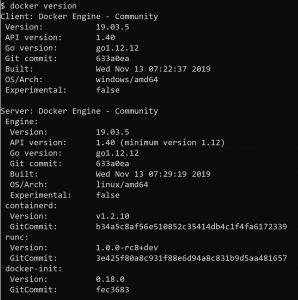

Docker for Desktop 上的 Docker 版本

1.  要查看是否可以运行容器，请在终端窗口中输入以下命令并按下*Enter*：

```
$ docker run hello-world
```

如果一切顺利，您的输出应该类似于以下内容：

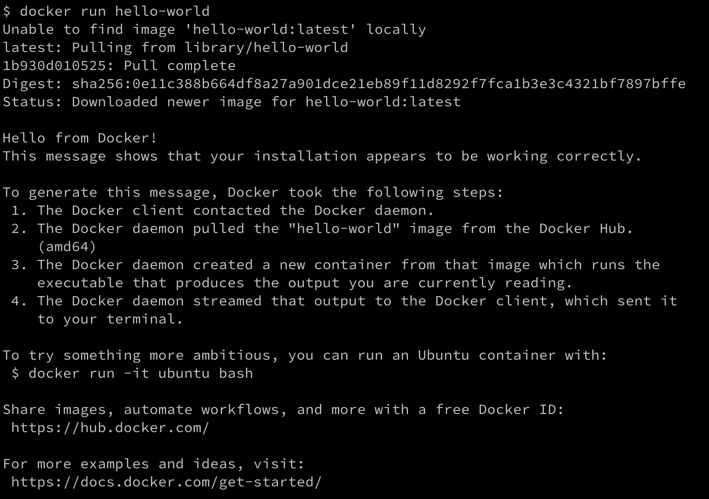

在 Docker for Desktop for macOS 上运行 Hello-World

接下来，我们将在 Windows 上安装 Docker。

# 在 Windows 上安装 Docker for Desktop

请按照以下步骤进行安装：

1.  成功安装适用于 Windows 的 Docker for Desktop 后，请打开 PowerShell 窗口并执行以下命令：

```
PS> docker --version
Docker version 19.03.5, build 633a0ea
```

1.  要查看是否可以运行容器，请在 PowerShell 窗口中输入以下命令并按下*Enter*：

```
PS> docker run hello-world
```

如果一切顺利，您的输出应该类似于前面的图示。

# 在 Linux 上安装 Docker CE

如前所述，Docker for Desktop 仅适用于 macOS 和 Windows 10 Pro。如果您使用的是 Linux 机器，可以使用 Docker **社区版**（**CE**），它包括 Docker 引擎，以及一些附加工具，如 Docker **命令行接口**（**CLI**）和 `docker-compose`。

请按照以下链接中的说明，为您的特定 Linux 发行版（在本例中是 Ubuntu）安装 Docker CE：[`docs.docker.com/install/linux/docker-ce/ubuntu/`](https://docs.docker.com/install/linux/docker-ce/ubuntu/)。

# 安装 Docker Toolbox

Docker Toolbox 已经提供给开发者使用几年了。它比像 Docker for Desktop 这样的新工具早推出。Docker Toolbox 让用户可以非常优雅地在任何 macOS 或 Windows 计算机上使用容器。容器必须在 Linux 主机上运行。Windows 和 macOS 无法原生运行容器。因此，我们需要在笔记本电脑上运行一个 Linux 虚拟机（VM），然后可以在其中运行容器。Docker Toolbox 会在我们的笔记本电脑上安装 VirtualBox，用来运行我们所需要的 Linux 虚拟机。

作为 Windows 用户，你可能已经知道有所谓的 Windows 容器可以原生运行在 Windows 上，你说得没错。微软已将 Docker 引擎移植到 Windows，并且可以直接在 Windows Server 2016 或更高版本上运行 Windows 容器，而无需虚拟机。因此，我们现在有两种类型的容器，Linux 容器和 Windows 容器。前者只能在 Linux 主机上运行，后者只能在 Windows 服务器上运行。在本书中，我们专门讨论 Linux 容器，但我们所学的大部分内容也适用于 Windows 容器。

如果你对 Windows 容器感兴趣，我们强烈推荐《*Docker on Windows, Second Edition*》这本书：[`www.packtpub.com/virtualization-and-cloud/docker-windows-second-edition`](https://www.packtpub.com/virtualization-and-cloud/docker-windows-second-edition)。

让我们从在 macOS 上安装 Docker Toolbox 开始。

# 在 macOS 上安装 Docker Toolbox

按照以下步骤进行安装：

1.  打开一个新的终端窗口，并使用 Homebrew 安装 Toolbox：

```
$ brew cask install docker-toolbox 
```

你应该看到类似于以下的内容：

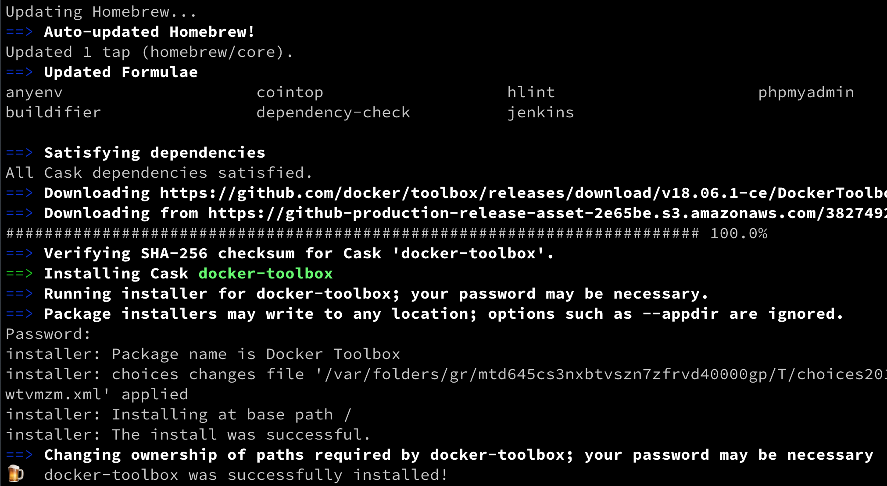

在 macOS 上安装 Docker Toolbox

1.  为了验证 Docker Toolbox 是否成功安装，尝试访问 `docker-machine` 和 `docker-compose`，这两个工具是安装的一部分：

```
$ docker-machine --version
docker-machine version 0.15.0, build b48dc28d
$ docker-compose --version
docker-compose version 1.22.0, build f46880f
```

接下来，我们将在 Windows 上安装 Docker Toolbox。

# 在 Windows 上安装 Docker Toolbox

以管理员模式打开一个新的 Powershell 窗口，并使用 Chocolatey 安装 Docker Toolbox：

```
PS> choco install docker-toolbox -y
```

输出应类似于以下内容：

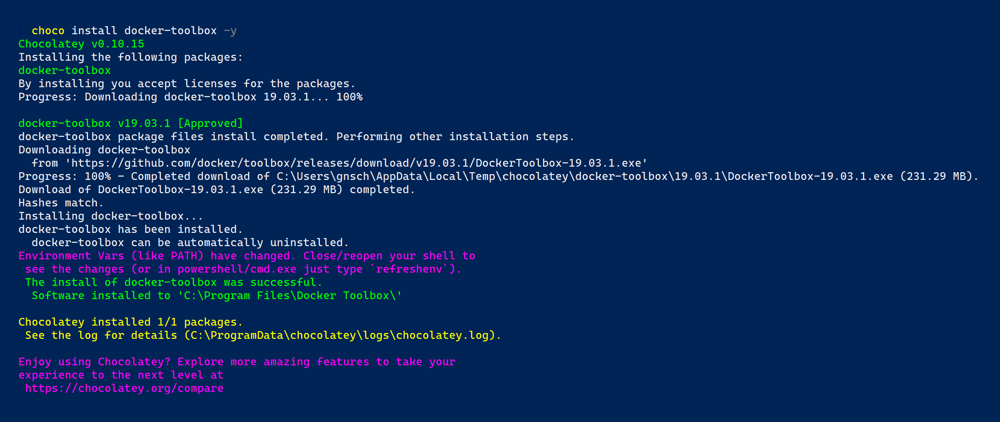

在 Windows 10 上安装 Docker Toolbox

我们现在将开始设置 Docker Toolbox。

# 设置 Docker Toolbox

按照以下步骤进行设置：

1.  让我们使用 `docker-machine` 设置我们的环境。首先，我们列出当前系统中定义的所有 Docker 就绪虚拟机。如果你刚刚安装了 Docker Toolbox，你应该看到以下输出：

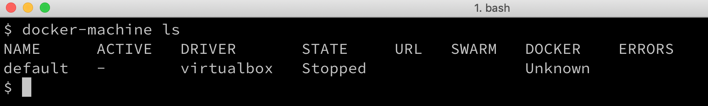

所有 Docker 就绪虚拟机的列表

1.  好的，我们可以看到安装了一个名为 `default` 的虚拟机，但它当前的 `STATE` 为 `stopped`。让我们使用 `docker-machine` 启动这个虚拟机，以便可以与之互动：

```
$ docker-machine start default
```

这将产生以下输出：


启动 Docker Toolbox 中的默认虚拟机

如果我们现在再次列出虚拟机，我们应该看到以下内容：

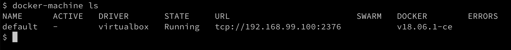

列出 Docker Toolbox 中正在运行的虚拟机

使用的 IP 地址可能与你的情况不同，但它一定会在`192.168.0.0/24`范围内。我们还可以看到虚拟机已经安装了 Docker 版本`18.06.1-ce`。

1.  如果因为某些原因，你没有默认虚拟机或不小心删除了它，你可以使用以下命令创建一个：

```
$ docker-machine create --driver virtualbox default 
```

这将生成以下输出：

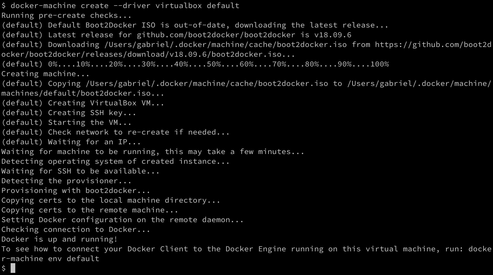

在 Docker Toolbox 中创建新的默认虚拟机

如果你仔细分析上面的输出，你会发现 `docker-machine` 自动从 Docker 下载了最新的虚拟机 ISO 文件。它意识到我当前的版本已经过时，并用版本 `v18.09.6` 替换了它。

1.  要查看如何将 Docker 客户端连接到运行在此虚拟机上的 Docker 引擎，请运行以下命令：

```
$ docker-machine env default 
```

这输出如下内容：

```
export DOCKER_TLS_VERIFY="1"
export DOCKER_HOST="tcp://192.168.99.100:2376"
export DOCKER_CERT_PATH="/Users/gabriel/.docker/machine/machines/default"
export DOCKER_MACHINE_NAME="default"
# Run this command to configure your shell:
# eval $(docker-machine env default)
```

1.  我们可以执行上面代码片段中最后一行列出的命令，来配置我们的 Docker CLI 使用在 `default` 虚拟机上运行的 Docker：

```
$ eval $(docker-machine env default) 
```

1.  现在，我们可以执行第一个 Docker 命令：

```
$ docker version
```

这应该会显示以下输出：

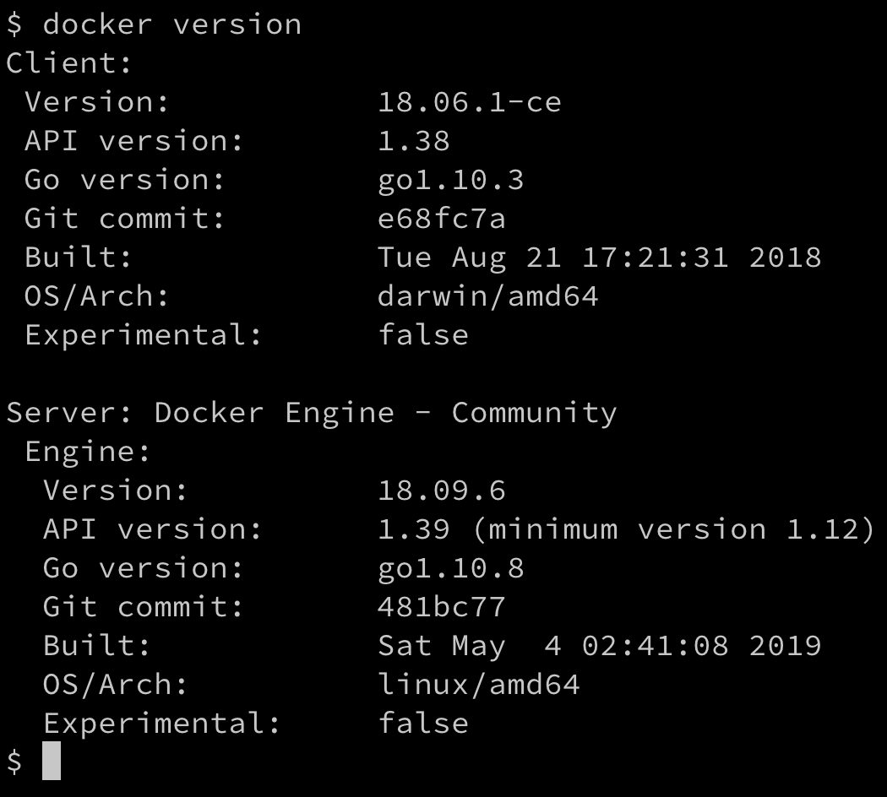

docker 版本输出

这里有两部分：客户端和服务器部分。客户端是直接在你的 macOS 或 Windows 笔记本上运行的 CLI，而服务器部分则运行在 VirtualBox 中的 `default` 虚拟机上。

1.  现在，让我们尝试运行一个容器：

```
$ docker run hello-world
```

这将产生以下输出：


上面的输出确认 Docker Toolbox 按预期工作并且能够运行容器。

即使你通常使用 Docker for Desktop 进行 Docker 开发，Docker Toolbox 也是一个很好的补充。Docker Toolbox 允许你在 VirtualBox 中创建多个 Docker 主机（或虚拟机），并将它们连接到一个集群，在这个集群上你可以运行 Docker Swarm 或 Kubernetes。

# 安装 Minikube

如果你无法使用 Docker for Desktop，或者由于某些原因你只能使用不支持 Kubernetes 的旧版本工具，那么安装 Minikube 是一个不错的选择。Minikube 在你的工作站上配置一个单节点 Kubernetes 集群，并且可以通过 `kubectl` 访问，它是用于与 Kubernetes 交互的命令行工具。

# 在 macOS 和 Windows 上安装 Minikube

要在 macOS 或 Windows 上安装 Minikube，请访问以下链接：[`kubernetes.io/docs/tasks/tools/install-minikube/`](https://kubernetes.io/docs/tasks/tools/install-minikube/)。

请仔细按照说明操作。如果你已经安装了 Docker Toolbox，那么你的系统中已经有一个虚拟化程序，因为 Docker Toolbox 安装程序同时也安装了 VirtualBox。否则，我建议你先安装 VirtualBox。

如果你已经安装了 macOS 或 Windows 版 Docker，那么你已经安装了 `kubectl`，因此可以跳过这一步。如果没有，请按照网站上的说明操作。

# 测试 Minikube 和 kubectl

一旦 Minikube 成功安装在你的工作站上，打开终端并测试安装。首先，我们需要启动 Minikube。在命令行输入 `minikube start`。此命令可能需要几分钟才能完成。输出应类似于以下内容：

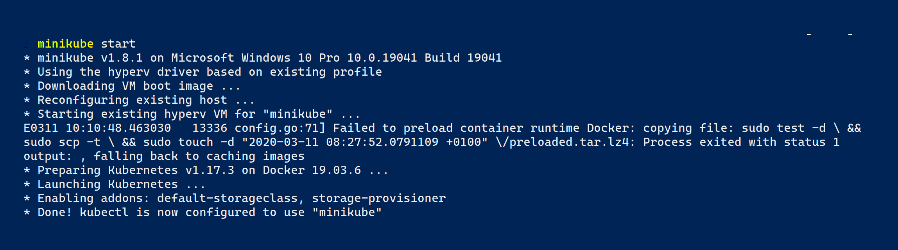

启动 Minikube

注意，您的输出可能会略有不同。在我的案例中，我在 Windows 10 Pro 计算机上运行 Minikube。在 Mac 上，通知的样式有所不同，但这在这里并不重要。

现在，输入`kubectl version`并按下*Enter*键，查看如下截图所示的内容：

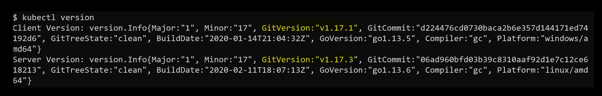

确定 Kubernetes 客户端和服务器的版本

如果前面的命令失败，例如由于超时而失败，可能是因为您的`kubectl`未配置为正确的上下文。`kubectl`可用于与多个不同的 Kubernetes 集群一起工作。每个集群称为一个上下文。要查找`kubectl`当前配置的上下文，请使用以下命令：

```
$ kubectl config current-context
minikube
```

答案应为`minikube`，如前面的输出所示。如果不是，请使用`kubectl config get-contexts`列出系统上定义的所有上下文，然后将当前上下文设置为`minikube`，如下所示：

```
$ kubectl config use-context minikube
```

`kubectl`的配置，存储上下文的地方，通常位于`~/.kube/config`，但也可以通过定义名为`KUBECONFIG`的环境变量来覆盖。如果该变量在您的计算机上已设置，您可能需要取消设置此变量。

关于如何配置和使用 Kubernetes 上下文的更深入信息，请参阅以下链接：[`kubernetes.io/docs/concepts/configuration/organize-cluster-access-kubeconfig/`](https://kubernetes.io/docs/concepts/configuration/organize-cluster-access-kubeconfig/)。

假设 Minikube 和`kubectl`按预期工作，我们现在可以使用`kubectl`获取 Kubernetes 集群的信息。输入以下命令：

```
$ kubectl get nodes
NAME STATUS ROLES AGE VERSION
minikube Ready master 47d v1.17.3
```

显然，我们有一个包含一个节点的集群，在我的案例中，该节点上安装了 Kubernetes` v1.17.3`。

# 总结

在本章中，我们设置并配置了个人或工作环境，以便能够高效地使用 Docker 容器。这同样适用于开发人员、DevOps 和运维工程师。在这一过程中，我们确保使用良好的编辑器，安装了 Docker for macOS 或 Docker for Windows，并能够使用`docker-machine`在 VirtualBox 或 Hyper-V 中创建虚拟机，然后使用这些虚拟机来运行和测试容器。

在下一章中，我们将学习有关容器的所有重要事实。例如，我们将探讨如何运行、停止、列出和删除容器，但更重要的是，我们还将深入研究容器的结构。

# 问题

基于您对本章的阅读，请回答以下问题：

1.  `docker-machine`用于什么？列举三到四种场景。

1.  使用 Windows 版 Docker，您可以开发并运行 Linux 容器。

A. 正确

B. 错误

1.  为什么良好的脚本编写技能（如 Bash 或 PowerShell）对于容器的高效使用至关重要？

1.  列举三到四个 Docker 认证可运行的 Linux 发行版。

1.  列举所有可以运行 Windows 容器的 Windows 版本。

# 进一步阅读

请参考以下链接进一步阅读：

+   *Chocolatey - Windows 的包管理器*，访问[`chocolatey.org/`](https://chocolatey.org/)

+   *在 Windows 上安装 Docker Toolbox:* [`dockr.ly/2nuZUkU`](https://dockr.ly/2nuZUkU)

+   *在 Hyper-V 上使用 Docker Machine 运行 Docker*，访问[`bit.ly/2HGMPiI`](http://bit.ly/2HGMPiI)

+   *在容器中开发*，访问[`code.visualstudio.com/docs/remote/containers`](https://code.visualstudio.com/docs/remote/containers)
