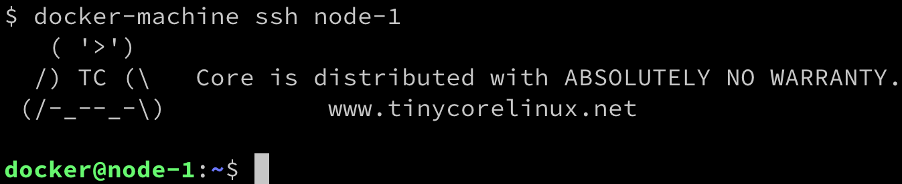

# 第六章：数据卷和配置

在上一章中，我们学习了如何构建和共享自己的容器镜像。重点是如何通过仅包含容器化应用程序真正需要的工件，来构建尽可能小的镜像。

在本章中，我们将学习如何处理有状态容器——即那些消耗和生产数据的容器。我们还将学习如何在运行时和镜像构建时，通过环境变量和配置文件来配置容器。

以下是我们将讨论的主题列表：

+   创建和挂载数据卷

+   容器之间共享数据

+   使用主机卷

+   在镜像中定义卷

+   配置容器

完成本章内容后，你将能够做到以下几点：

+   创建、删除和列出数据卷。

+   将现有的数据卷挂载到容器中。

+   在容器内使用数据卷创建持久化数据。

+   使用数据卷在多个容器之间共享数据。

+   使用数据卷将任何主机文件夹挂载到容器中。

+   在访问数据卷中的数据时，定义容器的访问模式（读/写或只读）。

+   为在容器中运行的应用程序配置环境变量。

+   通过使用构建参数来参数化 `Dockerfile`。

# 技术要求

本章内容需要在你的机器上安装 Docker Toolbox，或者可以访问一台在你的笔记本电脑或云端运行 Docker 的 Linux **虚拟机**（**VM**）。此外，安装 Docker for Desktop 会更加方便。本章没有配套代码。

# 创建和挂载数据卷

所有有意义的应用程序都会消耗或产生数据。然而，容器最好是无状态的。我们将如何处理这个问题呢？一种方法是使用 Docker 卷。卷允许容器消费、生产并修改状态。卷的生命周期超出了容器的生命周期。当使用卷的容器停止时，卷会继续存在。这对状态的持久性非常有利。

# 修改容器层

在深入讨论卷之前，让我们先讨论一下，如果容器中的应用程序更改了容器文件系统中的某些内容，会发生什么情况。在这种情况下，所有更改都发生在我们在第三章中介绍的可写容器层中，*掌握容器*。我们通过运行容器并在其中执行一个创建新文件的脚本来快速演示这一点，像这样：

```
$ docker container run --name demo \
 alpine /bin/sh -c 'echo "This is a test" > sample.txt'
```

上述命令创建了一个名为`demo`的容器，并在该容器内创建了一个名为`sample.txt`的文件，文件内容为`This is a test`。执行完`echo`命令后，容器退出，但仍保留在内存中，方便我们进行调查。接下来，我们可以使用`diff`命令来查看与原始镜像文件系统相比，容器文件系统发生了哪些变化，具体如下：

```
$ docker container diff demo
```

输出应如下所示：

```
A /sample.txt
```

显然，如`A`所示，容器的文件系统中添加了一个新文件，这是预期的结果。由于所有来自底层镜像（在本例中为`alpine`）的层都是不可变的，改变只能发生在可写的容器层中。

与原始镜像相比发生变化的文件将标记为`C`，被删除的文件将标记为`D`。

如果现在我们从内存中移除容器，它的容器层也将被移除，并且所有更改将不可逆转地被删除。如果我们需要让更改在容器生命周期结束后仍然存在，这不是一个解决方案。幸运的是，我们有更好的选择，即 Docker 卷。让我们来了解一下它们。

# 创建卷

由于在此时，使用 Docker for Desktop 的 macOS 或 Windows 计算机上，容器并没有在 macOS 或 Windows 上本地运行，而是在 Docker for Desktop 创建的（隐藏的）虚拟机中运行，为了演示目的，最好使用`docker-machine`创建并使用一个显式运行 Docker 的虚拟机。此时，我们假设你已经在系统上安装了 Docker Toolbox。如果没有，请返回第二章中的*设置工作环境*，那里有关于如何安装 Toolbox 的详细说明：

1.  使用`docker-machine`列出当前在 VirtualBox 中运行的所有虚拟机，如下所示：

```
$ docker-machine ls 
```

1.  如果没有名为`node-1`的虚拟机，请使用以下命令创建一个：

```
$ docker-machine create --driver virtualbox node-1 
```

如果你在 Windows 上启用了 Hyper-V，可以参考第二章中关于如何使用`docker-machine`创建基于 Hyper-V 的虚拟机的说明，*设置工作环境*。

1.  另一方面，如果你有一个名为`node-1`的虚拟机，但它没有运行，请启动它，如下所示：

```
$ docker-machine start node-1
```

1.  现在一切准备就绪，可以使用`docker-machine`通过 SSH 连接到这个虚拟机，如下所示：

```
$ docker-machine ssh node-1
```

1.  你应该会看到这个欢迎图片：



docker-machine 虚拟机欢迎消息

1.  要创建一个新的数据卷，我们可以使用`docker volume create`命令。此命令将创建一个命名的卷，可以将其挂载到容器中，用于持久化数据访问或存储。以下命令创建一个名为`sample`的卷，使用默认的卷驱动程序：

```
$ docker volume create sample 
```

默认的卷驱动程序是所谓的本地驱动程序，它将数据存储在主机文件系统中。

1.  查找数据在主机上存储位置的最简单方法是使用 `docker volume inspect` 命令查看我们刚创建的卷。实际位置因系统而异，因此这是找到目标文件夹的最安全方式。你可以在下面的代码块中看到这个命令：

```
$ docker volume inspect sample [ 
    { 
        "CreatedAt": "2019-08-02T06:59:13Z",
        "Driver": "local",
        "Labels": {},
        "Mountpoint": "/mnt/sda1/var/lib/docker/volumes/sample/_data",
        "Name": "my-data",
        "Options": {},
        "Scope": "local"
    } 
] 
```

主机文件夹可以在输出中的 `Mountpoint` 下找到。在我们的情况下，当使用 `docker-machine` 并在 VirtualBox 中运行基于 LinuxKit 的虚拟机时，该文件夹是 `/mnt/sda1/var/lib/docker/volumes/sample/_data`。

目标文件夹通常是受保护的文件夹，因此我们可能需要使用 `sudo` 来导航到该文件夹并执行任何操作。

在我们基于 LinuxKit 的 Docker Toolbox 虚拟机中，访问也被拒绝，且我们没有 `sudo` 权限。难道这就意味着我们的探索到此为止了吗？

幸运的是，没有；我已经准备了一个 `fundamentalsofdocker/nsenter` 工具容器，它允许我们访问之前创建的 `sample` 卷的后备文件夹。

1.  我们需要以 `privileged` 模式运行此容器，以便访问文件系统中的受保护部分，像这样：

```
$ docker run -it --rm --privileged --pid=host \
 fundamentalsofdocker/nsenter / #
```

我们正在以 `--privileged` 标志运行容器。这意味着在容器中运行的任何应用都可以访问主机的设备。`--pid=host` 标志表示容器可以访问主机的进程树（即 Docker 守护进程运行的隐藏虚拟机）。现在，前述容器运行 Linux `nsenter` 工具以进入主机的 Linux 命名空间，并在其中运行一个 shell。通过这个 shell，我们被授予访问主机管理的所有资源的权限。

运行容器时，我们基本上在容器内执行以下命令：

`nsenter -t 1 -m -u -n -i sh`

如果这听起来很复杂，不用担心；随着我们继续阅读这本书，你会理解得更多。如果你从中能获得一个收获，那就是要意识到正确使用容器有多么强大。

1.  在这个容器内，我们现在可以导航到表示卷挂载点的文件夹，并列出其内容，如下所示：

```
/ # cd /mnt/sda1/var/lib/docker/volumes/sample/_data
/ # ls -l total 0
```

该文件夹当前是空的，因为我们尚未在卷中存储任何数据。

1.  按下 *Ctrl* + *D* 键退出工具容器。

还有其他第三方卷驱动程序，作为插件的形式提供。我们可以在 `create` 命令中使用 `--driver` 参数来选择不同的卷驱动程序。其他卷驱动程序使用不同类型的存储系统来支持卷，例如云存储、**网络文件系统**（**NFS**）驱动、软件定义存储等。然而，其他卷驱动程序的正确使用讨论超出了本书的范围。

# 挂载卷

一旦我们创建了一个命名卷，就可以按照以下步骤将其挂载到容器中：

1.  为此，我们可以在 `docker container run` 命令中使用 `-v` 参数，像这样：

```
$ docker container run --name test -it \
 -v sample:/data \
    alpine /bin/sh Unable to find image 'alpine:latest' locally
latest: Pulling from library/alpine
050382585609: Pull complete
Digest: sha256:6a92cd1fcdc8d8cdec60f33dda4db2cb1fcdcacf3410a8e05b3741f44a9b5998
Status: Downloaded newer image for alpine:latest
/ #
```

上述命令将`sample`卷挂载到容器内的`/data`文件夹。

1.  在容器内，我们现在可以在`/data`文件夹中创建文件，然后退出，如下所示：

```
/ # cd /data / # echo "Some data" > data.txt 
/ # echo "Some more data" > data2.txt 
/ # exit
```

1.  如果我们导航到包含卷数据的宿主机文件夹并列出其内容，我们应该能看到我们刚刚在容器内创建的两个文件（记住：我们需要使用`fundamentalsofdocker/nsenter`工具容器来执行此操作），如下所示：

```
$ docker run -it --rm --privileged --pid=host \
 fundamentalsofdocker/nsenter
/ # cd /mnt/sda1/var/lib/docker/volumes/sample/_data
/ # ls -l 
total 8 
-rw-r--r-- 1 root root 10 Jan 28 22:23 data.txt
-rw-r--r-- 1 root root 15 Jan 28 22:23 data2.txt
```

1.  我们甚至可以尝试输出第二个文件的内容，像这样：

```
/ # cat data2.txt
```

1.  让我们尝试从宿主机在此文件夹中创建一个文件，然后使用该卷在另一个容器中，像这样：

```
/ # echo "This file we create on the host" > host-data.txt 
```

1.  按*Ctrl* + *D*退出工具容器。

1.  现在，让我们删除`test`容器，并运行另一个基于 CentOS 的容器。这次，我们甚至将我们的卷挂载到另一个容器文件夹`/app/data`，像这样：

```
$ docker container rm test
$ docker container run --name test2 -it \
 -v my-data:/app/data \
 centos:7 /bin/bash Unable to find image 'centos:7' locally
7: Pulling from library/centos
8ba884070f61: Pull complete
Digest: sha256:a799dd8a2ded4a83484bbae769d97655392b3f86533ceb7dd96bbac929809f3c
Status: Downloaded newer image for centos:7
[root@275c1fe31ec0 /]#
```

1.  进入`centos`容器后，我们可以导航到挂载了卷的`/app/data`文件夹，并列出其内容，如下所示：

```
[root@275c1fe31ec0 /]# cd /app/data 
[root@275c1fe31ec0 /]# ls -l 
```

正如预期的那样，我们应该能看到这三个文件：

```
-rw-r--r-- 1 root root 10 Aug 2 22:23 data.txt
-rw-r--r-- 1 root root 15 Aug 2 22:23 data2.txt
-rw-r--r-- 1 root root 32 Aug 2 22:31 host-data.txt
```

这是数据在 Docker 卷中超出容器生命周期存储的最终证明，同时也表明卷可以被其他容器甚至不同于第一个使用它的容器重用。

需要特别注意的是，我们挂载 Docker 卷到容器内的文件夹被排除在联合文件系统之外。也就是说，容器内该文件夹及其任何子文件夹中的所有更改都不会成为容器层的一部分，而是会保存在卷驱动程序提供的后端存储中。这个事实非常重要，因为容器层在对应容器停止并从系统中删除时会被删除。

1.  按*Ctrl* + *D*退出`centos`容器。现在，再次按*Ctrl* + *D*退出`node-1`虚拟机。

# 删除卷

可以使用`docker volume rm`命令删除卷。需要注意的是，删除卷会不可逆转地销毁其中的数据，因此应该视为一个危险命令。在这方面，Docker 稍微提供了帮助，因为它不允许删除仍在容器中使用的卷。在删除卷之前，请始终确保你要么已经备份了它的数据，要么真的不再需要这些数据。让我们按照以下步骤来看如何删除卷：

1.  以下命令删除我们之前创建的`sample`卷：

```
$ docker volume rm sample 
```

1.  执行上述命令后，双重检查宿主机上的文件夹是否已被删除。

1.  为了清理系统，删除所有正在运行的容器，请执行以下命令：

```
$ docker container rm -f $(docker container ls -aq)  
```

请注意，通过在删除容器时使用`-v`或`--volume`标志，你可以要求系统同时删除与该容器相关联的任何卷。当然，这仅在该卷仅被该容器使用时有效。

在下一节中，我们将展示如何在使用 Docker for Desktop 时访问卷的底层文件夹。

# 访问 Docker for Desktop 创建的卷

按照以下步骤进行操作：

1.  让我们创建一个`sample`卷，并在我们的 macOS 或 Windows 机器上使用 Docker for Desktop 对其进行检查，像这样：

```
$ docker volume create sample
$ docker volume inspect sample
[
 {
 "CreatedAt": "2019-08-02T07:44:08Z",
 "Driver": "local",
 "Labels": {},
 "Mountpoint": "/var/lib/docker/volumes/sample/_data",
 "Name": "sample",
 "Options": {},
 "Scope": "local"
 }
]
```

`Mountpoint`显示为`/var/lib/docker/volumes/sample/_data`，但你会发现，在你的 macOS 或 Windows 机器上并没有这样的文件夹。原因是，显示的路径是相对于 Docker for Windows 用来运行容器的隐藏虚拟机而言的。此时，Linux 容器无法在 macOS 或 Windows 上原生运行。

1.  接下来，让我们在`alpine`容器中生成两个文件，文件存储在卷中。要运行容器并将示例`volume`挂载到容器的`/data`文件夹中，请使用以下代码：

```
$ docker container run --rm -it -v sample:/data alpine /bin/sh
```

1.  在容器的`/data`文件夹中生成两个文件，像这样：

```
/ # echo "Hello world" > /data/sample.txt
/ # echo "Other message" > /data/other.txt
```

1.  按*Ctrl + D*退出`alpine`容器。

如前所述，我们不能直接从 macOS 或 Windows 访问`sample`卷的底层文件夹。因为该卷位于在 macOS 或 Windows 上运行 Docker for Desktop 的隐藏虚拟机中。

要从 macOS 访问那个隐藏虚拟机，我们有两种选择。我们可以使用一个特殊容器并以特权模式运行它，或者使用`screen`工具进入 Docker 驱动程序。第一种方法同样适用于 Docker for Windows。

1.  让我们从提到的第一种方法开始，通过运行来自`fundamentalsofdocker/nsenter`镜像的容器。我们已经在上一节中使用了这个容器。运行以下代码：

```
$ docker run -it --rm --privileged --pid=host fundamentalsofdocker/nsenter / #
```

1.  现在我们可以像这样导航到支撑`sample`卷的文件夹：

```
/ # cd /var/lib/docker/volumes/sample/_data
```

让我们通过运行这段代码来查看这个文件夹中的内容：

```
/ # ls -l 
total 8
-rw-r--r-- 1 root root 14 Aug 2 08:07 other.txt
-rw-r--r-- 1 root root 12 Aug 2 08:07 sample.txt
```

1.  让我们尝试从这个特殊的容器中创建一个文件，然后列出文件夹的内容，如下所示：

```
/ # echo "I love Docker" > docker.txt
/ # ls -l total 12
-rw-r--r-- 1 root root 14 Aug 2 08:08 docker.txt
-rw-r--r-- 1 root root 14 Aug 2 08:07 other.txt
-rw-r--r-- 1 root root 12 Aug 2 08:07 sample.txt
```

现在，我们已经在`sample`卷的底层文件夹中得到了文件。

1.  要退出我们的特权容器，只需按*Ctrl* + *D*。

1.  在我们探讨了第一种方法之后，如果你正在使用 macOS，让我们尝试使用`screen`工具，如下所示：

```
$ screen ~/Library/Containers/com.docker.docker/Data/com.docker.driver.amd64-linux/tty
```

1.  这样做后，我们将看到一个空白屏幕。按*Enter*键，会显示一个`docker-desktop:~#`命令行提示符。我们现在可以像这样导航到卷文件夹：

```
docker-desktop:~# cd /var/lib/docker/volumes/sample/_data
```

1.  让我们创建另一个包含数据的文件，然后列出文件夹的内容，如下所示：

```
docker-desktop:~# echo "Some other test" > test.txt 
docker-desktop:~# ls -l
total 16 -rw-r--r-- 1 root root 14 Aug 2 08:08 docker.txt
-rw-r--r-- 1 root root 14 Aug 2 08:07 other.txt
-rw-r--r-- 1 root root 12 Aug 2 08:07 sample.txt
-rw-r--r-- 1 root root 16 Aug 2 08:10 test.txt
```

1.  要退出与 Docker 虚拟机的会话，请按*Ctrl* + *A* + *K*。

我们现在已经通过三种不同的方法创建了数据，如下所示：

+   +   从挂载了`sample`卷的容器内部进行操作。

    +   使用一个特殊的特权文件夹来访问 Docker for Desktop 使用的隐藏虚拟机，并直接写入`sample`卷的底层文件夹。

    +   仅在 macOS 上，使用`screen`工具进入隐藏虚拟机，并直接写入`sample`卷的底层文件夹。

# 在容器之间共享数据

容器就像运行在其中的应用程序的沙箱。这通常是有益的，并且是期望的，以保护不同容器中运行的应用程序不相互干扰。它还意味着，容器中运行的应用程序所能看到的整个文件系统是该应用程序私有的，其他容器中的应用程序无法干扰它。

然而，有时我们希望在容器之间共享数据。假设容器 A 中运行的应用程序生成了一些数据，这些数据将被容器 B 中运行的另一个应用程序使用。*我们如何实现这一目标？* 你肯定已经猜到了——我们可以使用 Docker 卷来实现这个目的。我们可以创建一个卷，并将其挂载到容器 A 和容器 B。这样，应用程序 A 和 B 都能访问相同的数据。

现在，正如多种应用程序或进程同时访问数据时总是需要注意的，我们必须非常小心以避免不一致性。为了避免并发问题，如竞态条件，理想情况下我们应该只有一个应用程序或进程在创建或修改数据，而所有其他并发访问该数据的进程只能读取数据。我们可以通过将此卷挂载为只读来强制在容器中运行的进程仅能读取数据。请看下面的命令：

```
$ docker container run -it --name writer \
 -v shared-data:/data \
 alpine /bin/sh
```

在这里，我们创建一个名为`writer`的容器，该容器有一个名为`shared-data`的卷，挂载在默认的读/写模式下：

1.  尝试在此容器中创建一个文件，如下所示：

```
# / echo "I can create a file" > /data/sample.txt 
```

应该会成功。

1.  退出此容器，然后执行以下命令：

```
$ docker container run -it --name reader \
 -v shared-data:/app/data:ro \
 ubuntu:19.04 /bin/bash
```

并且我们有一个名为`reader`的容器，它将相同的卷挂载为**只读**（`ro`）。

1.  首先，确保你能在第一个容器中看到创建的文件，如下所示：

```
$ ls -l /app/data 
total 4
-rw-r--r-- 1 root root 20 Jan 28 22:55 sample.txt
```

1.  然后，尝试创建一个文件，如下所示：

```
# / echo "Try to break read/only" > /app/data/data.txt
```

它将以以下错误信息失败：

```
bash: /app/data/data.txt: Read-only file system
```

1.  让我们通过在命令提示符下输入`exit`来退出容器。返回主机后，让我们清理所有容器和卷，如下所示：

```
$ docker container rm -f $(docker container ls -aq) 
$ docker volume rm $(docker volume ls -q) 
```

1.  完成后，通过在命令提示符下输入`exit`退出`docker-machine`虚拟机。你应该回到你的 Docker for Desktop。使用`docker-machine`停止虚拟机，如下所示：

```
$ docker-machine stop node-1 
```

接下来，我们将展示如何将任意文件夹从 Docker 主机挂载到容器中。

# 使用主机卷

在某些场景下，比如开发新的容器化应用程序，或者当一个容器化应用程序需要消费某个由旧版应用程序生成的文件夹中的数据时，使用挂载特定主机文件夹的卷非常有用。让我们看以下示例：

```
$ docker container run --rm -it \
 -v $(pwd)/src:/app/src \
 alpine:latest /bin/sh
```

上述表达式交互式地启动一个`alpine`容器并打开一个 shell，并将当前目录的`src`子文件夹挂载到容器中的`/app/src`。我们需要使用`$(pwd)`（或者`` `pwd` ``，也可以）作为当前目录，因为在使用卷时，我们总是需要使用绝对路径。

开发人员在工作时经常使用这些技巧，当他们的应用程序在容器中运行时，并且希望确保容器始终包含他们对代码所做的最新更改，而无需在每次更改后重新构建镜像并重新运行容器。

让我们做一个示例来演示这一过程。假设我们想要使用 nginx 作为我们的 Web 服务器来创建一个简单的静态网站，如下所示：

1.  首先，让我们在主机上创建一个新文件夹，在其中放置我们的网页资源——例如 HTML、CSS 和 JavaScript 文件——并导航到该文件夹，像这样：

```
$ mkdir ~/my-web 
$ cd ~/my-web 
```

1.  接着，我们创建一个简单的网页，像这样：

```
$ echo "<h1>Personal Website</h1>" > index.html 
```

1.  现在，我们添加一个`Dockerfile`，该文件将包含如何构建包含我们示例网站的镜像的指令。

1.  向文件夹中添加一个名为`Dockerfile`的文件，内容如下：

```
FROM nginx:alpine
COPY . /usr/share/nginx/html
```

`Dockerfile`从最新版本的 Alpine nginx 开始，然后将当前主机目录中的所有文件复制到`/usr/share/nginx/html`容器文件夹中。这是 nginx 期望网页资源所在的位置。

1.  现在，让我们用以下命令构建镜像：

```
$ docker image build -t my-website:1.0 . 
```

1.  最后，我们从这个镜像运行一个容器。我们将以分离模式运行容器，像这样：

```
$ docker container run -d \
 --name my-site \
 -p 8080:80 \
 my-website:1.0
```

注意`-p 8080:80`参数。我们还没有讨论过这个内容，但我们将在第十章中详细讲解，*单主机网络*。目前，只需知道这将`nginx`监听的容器端口`80`映射到你笔记本电脑的`8080`端口，你可以在该端口访问应用程序。

1.  现在，打开浏览器标签页，导航到`http://localhost:8080/index.html`，你应该能看到你的网站，当前只包含一个标题，`个人网站`。

1.  现在，在你喜欢的编辑器中编辑`index.html`文件，使其看起来像这样：

```
<h1>Personal Website</h1> 
<p>This is some text</p> 
```

1.  现在，保存文件，然后刷新浏览器。哦！那没有成功。浏览器仍然显示先前版本的`index.html`文件，仅包含标题。所以，让我们停止并移除当前容器，然后重新构建镜像并重新运行容器，如下所示：

```
$ docker container rm -f my-site
$ docker image build -t my-website:1.0 .
$ docker container run -d \
 --name my-site \
   -p 8080:80 \
 my-website:1.0
```

这次，当你刷新浏览器时，新的内容应该会显示出来。好吧，成功了，但涉及的步骤太多了。想象一下，每次对你的网站做出简单更改时，都必须这么操作。这是不可持续的。

1.  现在是时候使用主机挂载卷了。再次移除当前容器，并使用挂载卷重新运行容器，像这样：

```
$ docker container rm -f my-site
$ docker container run -d \
 --name my-site \
   -v $(pwd):/usr/share/nginx/html \
 -p 8080:80 \
 my-website:1.0
```

1.  现在，向`index.html`文件中添加更多内容，并保存它。然后，刷新浏览器。你应该能看到变化。这正是我们想要实现的目标；我们也称之为*编辑并继续*的体验。你可以在网页文件中做任意修改，并且始终能立即在浏览器中看到结果，而无需重新构建镜像并重启包含你网站的容器。

需要注意的是，更新现在是双向传播的。如果你在主机上进行更改，它们会传播到容器中，反之亦然。同样重要的是，当你将当前文件夹挂载到容器目标文件夹`/usr/share/nginx/html`时，原本在那里已存在的内容将被主机文件夹的内容替换。

# 在镜像中定义卷

如果我们回到第三章，*容器掌握*，我们已经学到的内容，那么我们会发现：每个容器的文件系统，在启动时，由底层镜像的不可变层组成，再加上一个只针对该容器的可写容器层。容器内运行的进程对文件系统所做的所有更改都会保存在这个容器层中。一旦容器停止并从系统中移除，相应的容器层也会从系统中删除，并且不可恢复地丢失。

一些应用程序，如在容器中运行的数据库，需要在容器生命周期之外持久化它们的数据。在这种情况下，它们可以使用卷。为了让事情更加明确，我们来看一个具体的例子。MongoDB 是一个流行的开源文档数据库。许多开发者将 MongoDB 作为他们应用程序的存储服务。MongoDB 的维护者创建了一个镜像，并将其发布到 Docker Hub 上，可以用来在容器中运行数据库实例。这个数据库会生成需要长期持久化的数据，但 MongoDB 的维护者并不知道谁在使用这个镜像以及如何使用它。因此，他们无法影响用户启动容器时使用的`docker container run`命令。*那么，他们该如何定义卷呢？*

幸运的是，有一种方法可以在`Dockerfile`中定义卷。实现这一点的关键字是`VOLUME`，我们可以将单个文件夹的绝对路径或以逗号分隔的路径列表添加到其中。这些路径表示容器文件系统中的文件夹。我们来看几个这样的卷定义示例，如下所示：

```
VOLUME /app/data 
VOLUME /app/data, /app/profiles, /app/config 
VOLUME ["/app/data", "/app/profiles", "/app/config"] 
```

上述代码片段的第一行定义了一个要挂载到`/app/data`的单个卷。第二行定义了三个卷，并以逗号分隔的列表形式表示。最后一行定义了与第二行相同的内容，但这次，值的格式是一个 JSON 数组。

当启动容器时，Docker 会自动创建一个卷并将其挂载到`Dockerfile`中定义的每个路径的对应目标文件夹。由于每个卷都是由 Docker 自动创建的，它将拥有一个 SHA-256 作为其 ID。

在容器运行时，`Dockerfile`中定义的作为卷的文件夹被排除在联合文件系统之外，因此对这些文件夹的任何更改不会改变容器层，而是会被持久化到相应的卷中。现在，确保卷的后端存储得到妥善备份是运维工程师的责任。

我们可以使用`docker image inspect`命令获取有关`Dockerfile`中定义的卷的信息。让我们通过以下步骤查看 MongoDB 给我们的信息：

1.  首先，我们使用以下命令拉取镜像：

```
$ docker image pull mongo:3.7
```

1.  然后，我们检查此镜像，并使用`--format`参数从大量数据中仅提取必要部分，如下所示：

```
 $ docker image inspect \
    --format='{{json .ContainerConfig.Volumes}}' \
    mongo:3.7 | jq . 
```

注意命令末尾的`| jq .`。我们将`docker image inspect`的输出通过管道传递给`jq`工具，后者可以很好地格式化输出。如果你还没有在系统上安装`jq`，你可以通过在 macOS 上使用`brew install jq`，或者在 Windows 上使用`choco install jq`来安装。

前述命令将返回以下结果：

```
{
 "/data/configdb": {},
 "/data/db": {}
}
```

显然，MongoDB 的`Dockerfile`定义了两个卷，分别是`/data/configdb`和`/data/db`。

1.  现在，让我们在后台作为守护进程运行一个 MongoDB 实例，如下所示：

```
$ docker run --name my-mongo -d mongo:3.7
```

1.  我们现在可以使用`docker container inspect`命令获取有关已创建卷的信息，等等。

使用此命令仅获取卷的信息：

```
$ docker inspect --format '{{json .Mounts}}' my-mongo | jq .
```

前述命令应该会输出类似以下内容（已缩短）：

```
[
  {
    "Type": "volume",
    "Name": "b9ea0158b5...",
    "Source": "/var/lib/docker/volumes/b9ea0158b.../_data",
    "Destination": "/data/configdb",
    "Driver": "local",
    ...
  },
  {
    "Type": "volume",
    "Name": "5becf84b1e...",
    "Source": "/var/lib/docker/volumes/5becf84b1.../_data",
    "Destination": "/data/db",
    ...
  }
]
```

请注意，`Name`和`Source`字段的值已被裁剪以提高可读性。`Source`字段为我们提供了主机目录的路径，其中 MongoDB 在容器内生成的数据将被存储。

目前关于卷的内容就这些。在下一部分，我们将探讨如何配置在容器中运行的应用程序，以及容器镜像构建过程本身。

# 配置容器

我们经常需要为运行在容器中的应用程序提供一些配置。这些配置通常用于使同一个容器能够在非常不同的环境中运行，如开发、测试、预生产或生产环境。

在 Linux 中，配置值通常通过环境变量提供。

我们已经了解到，运行在容器中的应用程序与其主机环境是完全隔离的。因此，我们在主机上看到的环境变量与我们在容器内部看到的不同。

让我们通过首先查看我们主机上定义的内容来证明这一点：

1.  使用此命令：

```
$ export
```

在我的 macOS 上，我看到类似以下内容（已缩短）：

```
...
COLORFGBG '7;0'
COLORTERM truecolor
HOME /Users/gabriel
ITERM_PROFILE Default
ITERM_SESSION_ID w0t1p0:47EFAEFE-BA29-4CC0-B2E7-8C5C2EA619A8
LC_CTYPE UTF-8
LOGNAME gabriel
...
```

1.  接下来，让我们在一个`alpine`容器中运行一个 shell，并列出我们在那里看到的环境变量，如下所示：

```
$ docker container run --rm -it alpine /bin/sh
/ # export 
export HOME='/root'
export HOSTNAME='91250b722bc3'
export PATH='/usr/local/sbin:/usr/local/bin:/usr/sbin:/usr/bin:/sbin:/bin'
export PWD='/'
export SHLVL='1'
export TERM='xterm'
```

我们从`export`命令看到的前述输出显然与我们直接在主机上看到的完全不同。

1.  按*Ctrl* + *D*离开`alpine`容器。

接下来，让我们为容器定义环境变量。

# 为容器定义环境变量

现在，好消息是我们实际上可以在容器启动时传递一些配置值。我们可以使用`--env`（或者简写形式`-e`）参数，格式为`--env <key>=<value>`来实现，其中，`<key>`是环境变量的名称，而`<value>`表示要与该变量关联的值。假设我们希望容器中运行的应用程序能够访问名为`LOG_DIR`的环境变量，值为`/var/log/my-log`。我们可以使用以下命令来实现：

```
$ docker container run --rm -it \
 --env LOG_DIR=/var/log/my-log \
 alpine /bin/sh
/ #
```

上述代码在`alpine`容器中启动一个 shell，并在运行中的容器内定义所需的环境。为了证明这一点，我们可以在`alpine`容器内执行以下命令：

```
/ # export | grep LOG_DIR 
export LOG_DIR='/var/log/my-log'
```

输出如预期所示。现在，我们确实在容器内获得了所需的环境变量，并且值是正确的。

当然，我们在运行容器时可以定义多个环境变量。我们只需要重复`--env`（或`-e`）参数。请看这个示例：

```
$ docker container run --rm -it \
 --env LOG_DIR=/var/log/my-log \    --env MAX_LOG_FILES=5 \
 --env MAX_LOG_SIZE=1G \
 alpine /bin/sh
/ #
```

如果我们现在列出环境变量，我们会看到以下内容：

```
/ # export | grep LOG 
export LOG_DIR='/var/log/my-log'
export MAX_LOG_FILES='5'
export MAX_LOG_SIZE='1G'
```

现在，让我们来看一下当我们需要配置多个环境变量时的情况。

# 使用配置文件

复杂的应用程序可能需要配置多个环境变量，因此我们运行相应容器的命令可能会迅速变得难以管理。为此，Docker 允许我们将一组环境变量定义传递为一个文件，我们可以在`docker container run`命令中使用`--env-file`参数。

让我们试一下，操作如下：

1.  创建一个`fod/05`文件夹并进入该文件夹，如下所示：

```
$ mkdir -p ~/fod/05 && cd ~/fod/05
```

1.  使用你喜欢的编辑器，在这个文件夹中创建一个名为`development.config`的文件。将以下内容添加到文件中并保存，如下所示：

```
LOG_DIR=/var/log/my-log
MAX_LOG_FILES=5
MAX_LOG_SIZE=1G
```

请注意，我们每行定义一个环境变量，格式为`<key>=<value>`，其中，`<key>`是环境变量的名称，而`<value>`表示要与该变量关联的值。

1.  现在，从`fod/05`文件夹内，让我们运行一个`alpine`容器，传递该文件作为环境文件，并在容器内运行`export`命令，以验证文件中列出的变量是否确实已经作为环境变量在容器内创建，如下所示：

```
$ docker container run --rm -it \
 --env-file ./development.config \
 alpine sh -c "export"
```

确实，变量已经被定义，我们可以在生成的输出中看到：

```
export HOME='/root'
export HOSTNAME='30ad92415f87'
export LOG_DIR='/var/log/my-log'
export MAX_LOG_FILES='5'
export MAX_LOG_SIZE='1G'
export PATH='/usr/local/sbin:/usr/local/bin:/usr/sbin:/usr/bin:/sbin:/bin'
export PWD='/'
export SHLVL='1'
export TERM='xterm'
```

接下来，让我们来看一下如何为给定 Docker 镜像的所有容器实例定义有效的环境变量默认值。

# 在容器镜像中定义环境变量

有时候，我们希望为某个必须在给定容器镜像的每个容器实例中存在的环境变量定义一些默认值。我们可以通过以下步骤，在用于创建该镜像的`Dockerfile`中做到这一点：

1.  使用你最喜欢的编辑器在 `~/fod/05` 文件夹中创建一个名为 `Dockerfile` 的文件。将以下内容添加到该文件并保存：

```
FROM alpine:latest
ENV LOG_DIR=/var/log/my-log
ENV  MAX_LOG_FILES=5
ENV MAX_LOG_SIZE=1G
```

1.  使用前面的 `Dockerfile` 创建一个名为 `my-alpine` 的容器镜像，如下所示：

```
$ docker image build -t my-alpine .
```

从这个镜像运行一个容器实例，输出容器内定义的环境变量，像这样：

```
$ docker container run --rm -it \
    my-alpine sh -c "export | grep LOG" 
export LOG_DIR='/var/log/my-log'
export MAX_LOG_FILES='5'
export MAX_LOG_SIZE='1G'
```

这正是我们所期望的结果。

不过，好的地方在于，我们完全不必被这些变量值所限制。我们可以通过在 `docker container run` 命令中使用 `--env` 参数来覆盖其中一个或多个变量。看看以下命令及其输出：

```
$ docker container run --rm -it \
    --env MAX_LOG_SIZE=2G \
    --env MAX_LOG_FILES=10 \
    my-alpine sh -c "export | grep LOG" 
export LOG_DIR='/var/log/my-log'
export MAX_LOG_FILES='10'
export MAX_LOG_SIZE='2G'
```

我们还可以通过环境文件结合 `docker container run` 命令中的 `--env-file` 参数来覆盖默认值。请自己尝试一下。

# 构建时的环境变量

有时，我们希望能够定义一些在构建容器镜像时有效的环境变量。假设你想定义一个 `BASE_IMAGE_VERSION` 环境变量，并且这个变量将作为参数在 `Dockerfile` 中使用。假设以下是一个 `Dockerfile`：

```
ARG BASE_IMAGE_VERSION=12.7-stretch
FROM node:${BASE_IMAGE_VERSION}
WORKDIR /app
COPY packages.json .
RUN npm install
COPY . .
CMD npm start
```

我们使用 `ARG` 关键字来定义一个默认值，每次从前面的 `Dockerfile` 构建镜像时都会使用这个默认值。在这种情况下，这意味着我们的镜像使用的是 `node:12.7-stretch` 基础镜像。

现在，如果我们想要为测试目的创建一个特殊的镜像，我们可以在镜像构建时使用 `--build-arg` 参数覆盖这个变量，像这样：

```
$ docker image build \
 --build-arg BASE_IMAGE_VERSION=12.7-alpine \
 -t my-node-app-test .
```

在这种情况下，生成的 `my-node-test:latest` 镜像将从 `node:12.7-alpine` 基础镜像构建，而不是从默认的 `node:12.7-stretch` 镜像构建。

总结一下，通过 `--env` 或 `--env-file` 定义的环境变量在容器运行时有效。通过 `Dockerfile` 中的 `ARG` 或 `docker container build` 命令中的 `--build-arg` 定义的变量在容器镜像构建时有效。前者用于配置运行在容器内的应用程序，而后者用于为容器镜像构建过程提供参数。

# 总结

在本章中，我们介绍了可以用来持久化容器生成的状态并使其持久化的 Docker 卷。我们还可以使用卷为容器提供来自不同来源的数据。我们已经学习了如何创建、挂载和使用卷。我们还学习了多种定义卷的技巧，比如通过名称、挂载主机目录或在容器镜像中定义卷。

在本章中，我们还讨论了如何配置可以供容器内应用程序使用的环境变量。我们展示了如何在 `docker container run` 命令中显式地一个一个地定义这些变量，或将它们作为配置文件中的一部分进行定义。我们还展示了如何通过使用构建参数来为容器镜像构建过程提供参数。

在下一章中，我们将介绍常用的技术，允许开发人员在容器中运行代码时对其进行演化、修改、调试和测试。

# 问题

请尝试回答以下问题，以评估你的学习进度：

1.  你将如何使用默认驱动程序创建一个命名数据卷，例如`my-products`？

1.  你将如何使用`alpine`镜像运行容器，并将`my-products`卷以只读模式挂载到容器中的`/data`文件夹？

1.  你如何找到与`my-products`卷关联的文件夹并进入它？另外，你将如何创建一个名为`sample.txt`的文件，并为其添加一些内容？

1.  你将如何运行另一个`alpine`容器，并将`my-products`卷以读写模式挂载到`/app-data`文件夹？在该容器中，进入`/app-data`文件夹并创建一个名为`hello.txt`的文件并写入内容。

1.  你将如何将主机卷（例如`~/my-project`）挂载到容器中？

1.  你将如何从系统中删除所有未使用的卷？

1.  容器中运行的应用程序所看到的环境变量列表与该应用程序直接在主机上运行时看到的相同。

A. 正确

B. 错误

1.  需要在容器中运行的应用程序需要一大堆环境变量来进行配置。最简单的方法是什么，可以让你的应用程序在容器中运行并提供所有这些信息？

# 进一步阅读

以下文章提供了更深入的信息：

+   使用卷，见 [`dockr.ly/2EUjTml`](http://dockr.ly/2EUjTml)

+   在 Docker 中管理数据，见 [`dockr.ly/2EhBpzD`](http://dockr.ly/2EhBpzD)

+   **Play with Docker**（**PWD**）中的 Docker 卷，见 [`bit.ly/2sjIfDj`](http://bit.ly/2sjIfDj)

+   `nsenter` —Linux 手册，见 [`bit.ly/2MEPG0n`](https://bit.ly/2MEPG0n)

+   设置环境变量，见 [`dockr.ly/2HxMCjS`](https://dockr.ly/2HxMCjS)

+   理解`ARG`和`FROM`的相互作用，见 [`dockr.ly/2OrhZgx`](https://dockr.ly/2OrhZgx)
