# 第八章：使用 Docker 来加速自动化

在上一章中，我们介绍了常用的技术，帮助开发者在容器中运行时对代码进行演化、修改、调试和测试。我们还学习了如何对应用程序进行监控，使其生成日志信息，帮助我们进行故障根因分析，诊断在生产环境中运行的应用程序或应用服务的失败或异常行为。

在这一章中，我们将展示如何使用工具执行管理任务，而无需在主机上安装这些工具。我们还将说明如何使用容器托管并运行测试脚本或代码，用于测试和验证在容器中运行的应用服务。最后，我们将引导读者完成构建一个简单的基于 Docker 的 CI/CD 流水线的任务。

这是我们将在本章中涉及的所有主题的简要概述：

+   在容器中执行简单的管理任务

+   使用测试容器

+   使用 Docker 来驱动 CI/CD 流水线

完成本章后，你将能够执行以下操作：

+   在容器中运行主机上不可用的工具

+   使用容器运行测试脚本或代码来测试应用服务

+   使用 Docker 构建一个简单的 CI/CD 流水线

# 技术要求

在本节中，如果你想跟随代码进行操作，你需要在你的 macOS 或 Windows 机器上安装 Docker Desktop，并且需要一个代码编辑器，最好是 Visual Studio Code。该示例同样适用于安装了 Docker 和 VS Code 的 Linux 机器。

# 在容器中执行简单的管理任务

假设你需要去除文件中的所有前导空格，并且你找到了一个非常有用的 Perl 脚本来完成这一任务：

```
$ cat sample.txt | perl -lpe 's/^\s*//'
```

结果证明，你的工作机器上没有安装 Perl。那么你该怎么办？在机器上安装 Perl 吗？这当然是一个选项，也是大多数开发者或系统管理员会采取的做法。但等等，你的机器上已经安装了 Docker。难道我们不能用 Docker 来避免安装 Perl 吗？是的，我们可以。我们将按以下方式操作：

1.  创建一个文件夹，`ch07/simple-task`，并进入该文件夹：

```
$ mkdir -p ~/fod/ch07/simple-task && cd ~/fod/ch07/simple-task
```

1.  从该文件夹中打开 VS Code：

```
$ code .
```

1.  在这个文件夹中，创建一个`sample.txt`文件，内容如下：

```
1234567890
  This is some text
   another line of text
 more text
     final line
```

请注意每一行开头的空格。保存文件。

1.  现在，我们可以运行一个已经安装了 Perl 的容器。幸运的是，Docker Hub 上有一个官方的 Perl 镜像。我们将使用该镜像的精简版本：

```
$ docker container run --rm -it \
 -v $(pwd):/usr/src/app \
 -w /usr/src/app \
 perl:slim sh -c "cat sample.txt | perl -lpe 's/^\s*//'"
```

上述命令以交互方式运行一个 Perl 容器（`perl:slim`），将当前文件夹的内容映射到容器中的`/usr/src/app`文件夹，并将容器中的工作目录设置为`/usr/src/app`。在容器中运行的命令是`sh -c "cat sample.txt | perl -lpe 's/^\s*//'"`，基本上是启动一个 Bourne shell 并执行我们所需的 Perl 命令。

上述命令生成的输出应如下所示：

```
1234567890
This is some text
another line of text
more text
final line
```

1.  在不需要在机器上安装 Perl 的情况下，我们就能够实现目标。

如果这还不能说服你，假设你正在运行一个名为`your-old-perl-script.pl`的 Perl 脚本，这个脚本已经过时并且与系统中最新版本的 Perl 不兼容。你是否会尝试在机器上安装多个版本的 Perl，可能会导致一些问题？不，你只需要运行一个兼容脚本的（旧版）Perl 版本的容器，如下所示：

```
$ docker container run -it --rm \
-v $(pwd):/usr/src/app \
 -w /usr/src/app \
 perl:<old-version> perl your-old-perl-script.pl
```

在这里，`<old-version>`对应你需要运行脚本的 Perl 版本标签。好处是，脚本运行完后，容器会从系统中被移除，不会留下任何痕迹，因为我们在`docker container run`命令中使用了`--rm`标志。

很多人使用快速且简陋的 Python 脚本或小型应用程序来自动化一些不容易用比如 Bash 脚本来编写的任务。如果这个 Python 脚本是用 Python 3.7 写的，而你机器上只安装了 Python 2.7，或者根本没有安装任何版本，那么最简单的解决方案就是在容器内执行脚本。假设有这样一个简单的例子：这个 Python 脚本统计一个给定文件中的行数、单词数和字母数，并将结果输出到控制台：

1.  仍然在`ch07/simple-task`文件夹中，添加一个`stats.py`文件并加入以下内容：

```
import sys

fname = sys.argv[1]
lines = 0
words = 0
letters = 0

for line in open(fname):
    lines += 1
    letters += len(line)

    pos = 'out'
    for letter in line:
        if letter != ' ' and pos == 'out':
            words += 1
            pos = 'in'
        elif letter == ' ':
            pos = 'out'

print("Lines:", lines)
print("Words:", words)
print("Letters:", letters)
```

1.  保存文件后，可以使用以下命令运行它：

```
$ docker container run --rm -it \
 -v $(pwd):/usr/src/app \
 -w /usr/src/app \
 python:3.7.4-alpine python stats.py sample.txt
```

请注意，在这个例子中，我们正在重新使用之前的`sample.txt`文件。我的输出结果如下：

```
Lines: 5
Words: 13
Letters: 81
```

这种方法的优点是，这个 Python 脚本现在可以在任何安装了操作系统的计算机上运行，只要该机器是 Docker 主机，并且能够运行容器。

# 使用测试容器

对于每一个严肃的软件项目，强烈建议进行大量的测试。测试类别有很多种，例如单元测试、集成测试、压力和负载测试以及端到端测试。我试图在以下截图中可视化这些不同的类别：

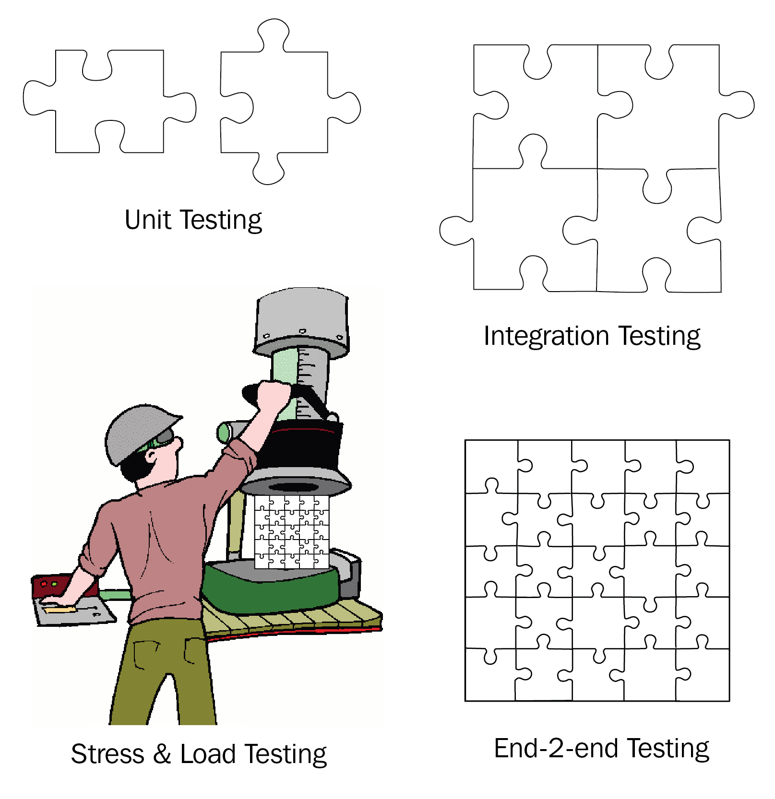

应用测试的类别

单元测试用于断言单个、孤立的应用或应用服务部分的正确性和质量。集成测试确保相关的部分能够按预期一起工作。压力和负载测试通常是对整个应用或服务进行测试，验证其在各种边缘情况下（例如通过多个并发请求高负载，或用大量数据淹没服务）是否能够正常工作。最后，端到端测试模拟真实用户使用应用或应用服务的场景。用户的典型任务会被自动化。

被测试的代码或组件通常被称为**待测试系统**（**SUT**）。

单元测试本质上与实际的代码或被测试系统（SUT）紧密耦合。因此，这些测试必须在与被测试代码相同的上下文中运行。因此，测试代码与 SUT 在同一个容器中运行。SUT 的所有外部依赖项都要么是模拟的，要么是桩方法。

集成测试、压力测试、负载测试和端到端测试，另一方面，作用于被测试系统的公共接口，因此，通常这些测试代码会运行在单独的容器中：

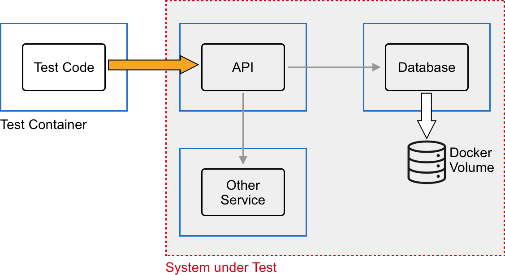

使用容器进行的集成测试

在前面的图表中，我们可以看到**测试代码**运行在自己的**测试容器**中。**测试代码**访问运行在专用容器中的**API**组件的公共接口。**API**组件有外部依赖项，如**其他服务**和**数据库**，它们各自运行在各自的容器中。在这种情况下，**API**、**其他服务**和**数据库**的整体组合就是我们的被测试系统（SUT）。

压力测试和负载测试到底是什么样的呢？假设我们有一个 Kafka Streams 应用程序，我们希望对其进行测试。下面的图表给出了我们可以测试的内容的大致概念：

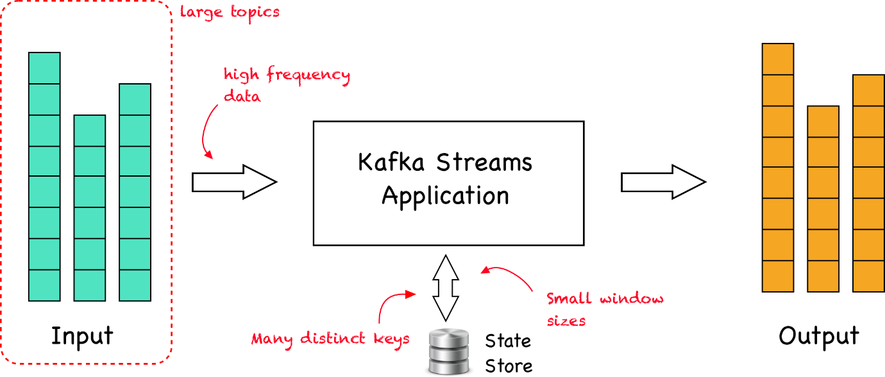

对 Kafka Streams 应用程序进行压力测试和负载测试

简而言之，**Kafka Streams 应用程序**从一个或多个存储在 Apache Kafka(R)中的主题消费数据。该应用程序对数据进行过滤、转换或聚合。结果数据会写回到一个或多个 Kafka 主题中。通常，在与 Kafka 一起工作时，我们处理实时流入 Kafka 的数据。现在，测试可以模拟以下情况：

+   大主题，包含大量记录

+   数据以非常高的频率流入 Kafka

+   数据由被测试的应用程序进行分组，存在大量不同的键，每个键的基数较低

+   按时间窗口聚合的数据，其中窗口的大小较小，例如，每个窗口只有几秒钟长

端到端测试通过使用像 Selenium Web Driver 这样的工具自动化与应用程序交互的用户操作，Selenium 提供了一个开发人员自动化操作的手段，例如在表单中填写字段或点击按钮。

# Node.js 应用程序的集成测试

现在，让我们来看一个在 Node.js 中实现的集成测试示例。以下是我们将要查看的设置：


Express JS 应用程序的集成测试

以下是创建这种集成测试的步骤：

1.  让我们首先准备项目文件夹结构。我们创建项目根目录并进入该目录：

```
$ mkdir ~/fod/ch07/integration-test-node && \
    cd ~/fod/ch07/integration-test-node
```

1.  在这个文件夹中，我们创建三个子文件夹，`tests`、`api`和`database`：

```
$ mkdir tests api database
```

1.  现在，我们从项目根目录打开 VS Code：

```
$ code .
```

1.  在`database`文件夹中，添加一个`init-script.sql`文件，内容如下：

```
CREATE TABLE hobbies(
 hobby_id serial PRIMARY KEY,
 hobby VARCHAR (255) UNIQUE NOT NULL
);

insert into hobbies(hobby) values('swimming');
insert into hobbies(hobby) values('diving');
insert into hobbies(hobby) values('jogging');
insert into hobbies(hobby) values('dancing');
insert into hobbies(hobby) values('cooking');
```

上述脚本将在我们的 Postgres 数据库中创建一个 `hobbies` 表，并将一些种子数据填充进去。保存文件。

1.  现在我们可以启动数据库了。当然，我们将使用 Postgres 的官方 Docker 镜像在容器中运行数据库。但首先，我们将创建一个 Docker 卷，用于存储数据库的文件。我们将此卷命名为 `pg-data`：

```
$ docker volume create pg-data
```

1.  现在，是时候启动数据库容器了。在项目根文件夹（`integration-test-node`）内，运行以下命令：

```
$ docker container run -d \
 --name postgres \
 -p 5432:5432 \
 -v $(pwd)/database:/docker-entrypoint-initdb.d \
 -v pg-data:/var/lib/postgresql/data \
 -e POSTGRES_USER=dbuser \
 -e POSTGRES_DB=sample-db \
 postgres:11.5-alpine
```

请注意，运行上述命令时，文件夹位置很重要，因为我们正在使用数据库初始化脚本 `init-script.sql` 的卷挂载。同时，我们通过环境变量定义了 Postgres 数据库的名称和用户，并将 Postgres 的端口 `5432` 映射到主机机器上的相应端口。

1.  启动数据库容器后，双重检查它是否按预期运行，方法是检索其日志：

```
$ docker container logs postgres
```

你应该会看到类似以下的内容：

```
...
server started
CREATE DATABASE

/usr/local/bin/docker-entrypoint.sh: running /docker-entrypoint-initdb.d/init-db.sql
CREATE TABLE
INSERT 0 1
INSERT 0 1
INSERT 0 1
INSERT 0 1
INSERT 0 1

...

PostgreSQL init process complete; ready for start up.

2019-09-07 17:22:30.056 UTC [1] LOG: listening on IPv4 address "0.0.0.0", port 5432
...
```

请注意，为了提高可读性，我们已简化了输出。前述输出的重点是前几行，我们可以看到数据库已经加载了我们的初始化脚本，创建了 `hobbies` 表并填充了五条记录。另一个重要的部分是最后一行，告诉我们数据库已经准备好工作。容器日志始终是排查问题的第一站！

到此为止，我们的第一个 SUT 部件已经准备好。接下来，我们将进入下一个部分，即我们在 Express JS 中实现的 API：

1.  在终端窗口中，导航到 `api` 文件夹：

```
$ cd ~/fod/ch07/integration-test-node/api
```

1.  然后，运行 `npm init` 来初始化 API 项目。只需接受所有默认选项：

```
$ npm init
```

生成的 `package.json` 文件应该如下所示：

```
{
  "name": "api",
  "version": "1.0.0",
  "description": "",
  "main": "index.js",
  "scripts": {
    "test": "echo \"Error: no test specified\" && exit 1"
  },
  "author": "",
  "license": "ISC"
}
```

1.  修改上述文件中的 `scripts` 节点，使其包含启动命令：

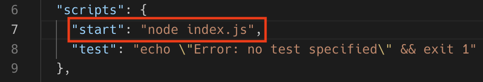

向 package.json 文件中添加启动脚本

1.  然后我们需要安装 Express JS，可以使用以下命令：

```
$ npm install express --save
```

这将安装该库及其所有依赖项，并在我们的 `package.json` 文件中添加一个类似于下面的依赖项节点：


将 Express JS 作为依赖项添加到 API

1.  在 `api` 文件夹中，创建一个 `server.js` 文件，并添加以下代码片段：

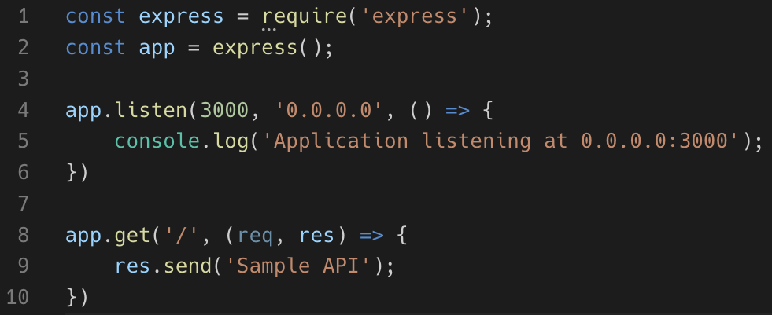

简单的 Express JS API

这是一个简单的 Express JS API，仅实现了 `/` 端点。它作为我们探索集成测试的起点。请注意，API 将在端口 `3000` 上监听，且容器内的所有端点都使用 `0.0.0.0`。

1.  现在我们可以通过 `npm start` 启动 API，然后测试首页端点，例如，使用 `curl`：

```
$ curl localhost:3000
Sample API
```

完成所有这些步骤后，我们已经准备好构建测试环境。

1.  我们将使用 `jasmine` 来编写我们的测试。导航到 `tests` 文件夹并运行 `npm init` 来初始化测试项目：

```
$ cd ~/fod/ch07/integration-test-node/tests && \
    npm init
```

接受所有默认设置。

1.  接下来，将`jasmine`添加到项目中：

```
$ npm install --save-dev jasmine
```

1.  然后为该项目初始化`jasmine`：

```
$ node node_modules/jasmine/bin/jasmine init
```

1.  我们还需要更改`package.json`文件，使得`script`块看起来像这样：


为我们的集成测试添加测试脚本

1.  我们不能随时通过在`tests`文件夹中执行`npm test`来运行测试。第一次运行时，我们会得到一个错误，因为我们还没有添加任何测试：

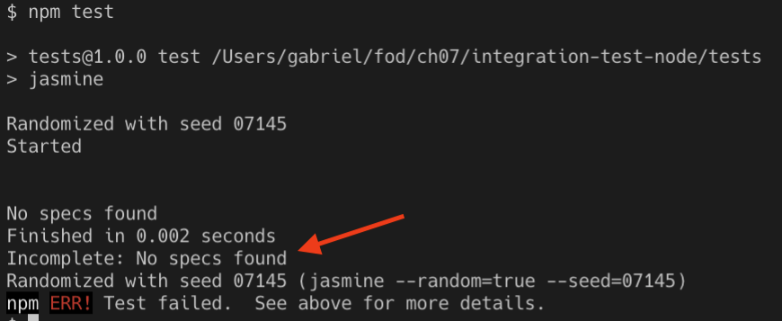

第一次运行失败，因为没有找到测试

1.  现在，在项目的`spec/support`子文件夹中，让我们创建一个`jasmine.json`文件。它将包含`jasmine`测试框架的配置设置。将以下代码片段添加到此文件并保存：

```
{
  "spec_dir": "spec",
  "spec_files": [
    "**/*[sS]pec.js"
  ],
  "stopSpecOnExpectationFailure": false,
  "random": false
}
```

1.  由于我们将编写集成测试，我们需要通过其公共接口访问 SUT，在我们的案例中，接口是一个 RESTful API。因此，我们需要一个客户端库来实现这一点。我的选择是 Requests 库。让我们将其添加到我们的项目中：

```
$ npm install request --save-dev
```

1.  向项目的`spec`子文件夹中添加一个`api-spec.js`文件。它将包含我们的测试函数。让我们从第一个测试开始：

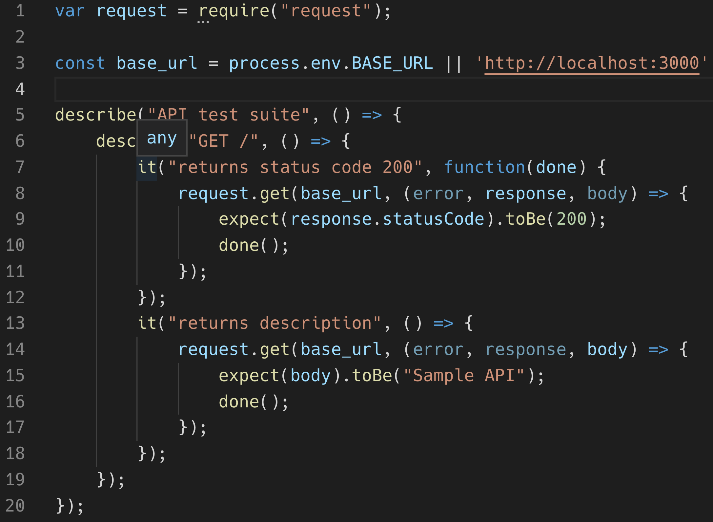

API 的示例测试套件

我们使用`request`库来向我们的 API 发出 RESTful 调用（第`1`行）。然后，在第`3`行，我们定义了 API 监听的基础 URL。注意，我们使用的代码允许我们通过一个名为`BASE_URL`的环境变量来覆盖默认的`http://localhost:3000`。第`5`行定义了我们的测试套件，在第`6`行，它有一个针对`GET /`的测试。然后我们断言两个结果，即`GET`调用`/`的状态码是`200`（OK），并且响应体中返回的文本等于`Sample API`。

1.  如果现在运行测试，我们将得到以下结果：

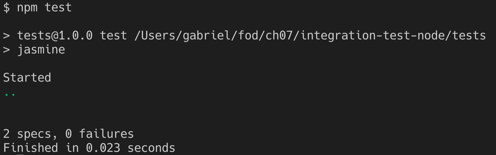

成功运行基于 Jasmine 的集成测试

我们有两个规格——测试的另一个说法——在运行；它们都是成功的，因为没有报告任何失败。

1.  在我们继续之前，请停止 API 并使用`docker container rm -f postgres`删除 Postgres 容器。

到目前为止一切顺利，但现在让我们将容器引入到工作中。这才是我们最兴奋的部分，不是吗？我们很期待在容器中运行所有内容，包括测试代码。如果你还记得，我们将使用三个容器：数据库、API 以及包含测试代码的容器。对于数据库，我们仅使用标准的 Postgres Docker 镜像，但对于 API 和测试，我们将创建自己的镜像：

1.  让我们从 API 开始。将以下内容添加到`api`文件夹中的`Dockerfile`文件：

```
FROM node:alpine
WORKDIR /usr/src/app
COPY package.json ./
RUN npm install
COPY . .
EXPOSE 3000
CMD npm start
```

这只是为基于 Node.js 的应用程序创建容器镜像的一种非常标准的方式。这里没有什么特别的。

1.  向`tests`文件夹中添加一个具有以下内容的 Dockerfile：

```
FROM node:alpine
WORKDIR /usr/src/app
COPY package.json ./
RUN npm install
COPY . .
CMD npm test
```

1.  现在，我们准备好按正确顺序运行所有三个容器了。为了简化这个任务，我们创建一个执行此操作的 shell 脚本。将`test.sh`文件添加到`integration-test-node`文件夹，即我们的项目根文件夹。将以下内容添加到该文件并保存：

```
docker image build -t api-node api
docker image build -t tests-node tests

docker network create test-net

docker container run --rm -d \
 --name postgres \
 --net test-net \
 -v $(pwd)/database:/docker-entrypoint-initdb.d \
 -v pg-data:/var/lib/postgresql/data \
 -e POSTGRES_USER=dbuser \
 -e POSTGRES_DB=sample-db \
 postgres:11.5-alpine

docker container run --rm -d \
 --name api \
 --net test-net \
api-node

echo "Sleeping for 5 sec..."
sleep 5

docker container run --rm -it \
 --name tests \
 --net test-net \
 -e BASE_URL="http://api:3000" \
 tests-node
```

在脚本的前两行，我们确保 API 和测试的两个容器镜像使用的是最新的代码。然后，我们创建一个名为`test-net`的 Docker 网络，所有三个容器将在此网络上运行。不要担心这些细节，我们将在第十章中详细解释网络。此时只需了解，如果所有容器都运行在同一网络上，那么运行在这些容器中的应用程序可以像在主机上本地运行一样相互看到，并且可以通过名称互相调用。

下一条命令启动数据库容器，接着启动 API 的命令。然后，我们暂停几秒钟，给数据库和 API 完全启动和初始化的时间，之后我们启动第三个也是最后一个容器——测试容器。

1.  使用以下命令使该文件可执行：

```
$ chmod +x ./test.sh 
```

1.  现在你可以运行它：

```
$ ./test.sh
```

如果一切按预期工作，你应该会看到类似以下内容（为了可读性已简化）：

```
...
Successfully built 44e0900aaae2
Successfully tagged tests-node:latest
b4f233c3578898ae851dc6facaa310b014ec86f4507afd0a5afb10027f10c79d
728eb5a573d2c3c1f3a44154e172ed9565606af8e7653afb560ee7e99275ecf6
0474ea5e0afbcc4d9cd966de17e991a6e9a3cec85c53a934545c9352abf87bc6
Sleeping for 10 sec...

> tests@1.0.0 test /usr/src/app
> jasmine

Started
..

2 specs, 0 failures
Finished in 0.072 seconds
```

1.  我们还可以创建一个脚本，在测试完成后进行清理。为此，添加一个名为`cleanup.sh`的文件，并像你对待`test.sh`脚本一样，使其可执行。将以下代码片段添加到此文件中：

```
docker container rm -f postgres api
docker network rm test-net
docker volume rm pg-data
```

第一行移除`postgres`和`api`容器。第二行移除我们为第三个容器使用的网络，最后，第三行移除 Postgres 使用的卷。每次测试运行后，执行此文件，使用`./cleanup.sh`。

现在你可以开始向 API 组件添加更多的代码和集成测试了。每次你想要测试新的或修改过的代码时，只需运行`test.sh`脚本。

挑战：你如何进一步优化这个过程，以减少手动操作步骤？

使用我们在第六章中学到的内容，*调试在容器中运行的代码*。

# Testcontainers 项目

如果你是 Java 开发者，那么有一个很棒的项目叫做 Testcontainers（[`testcontainers.org`](https://testcontainers.org)）。用他们的话说，这个项目可以总结如下：

"Testcontainers 是一个 Java 库，支持 JUnit 测试，提供轻量级、可丢弃的常见数据库、Selenium 浏览器实例，或者任何可以在 Docker 容器中运行的东西。"

要实验 Testcontainers，按照以下步骤进行：

1.  首先创建一个`testcontainer-node`文件夹并进入：

```
$ mkdir ~/fod/ch07/testcontainer-node && cd ~/fod/ch07/testcontainer-node
```

1.  接下来，在该文件夹中打开 VS Code，使用命令`code .`。在同一文件夹内创建三个子文件夹，`database`、`api`和`tests`。在`api`文件夹中，添加一个包含以下内容的`package.json`文件：

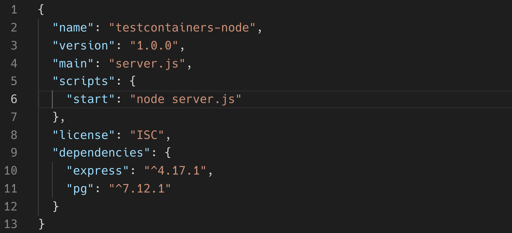

API 的 package.json 内容

1.  将一个`server.js`文件添加到`api`文件夹，并使用以下内容：

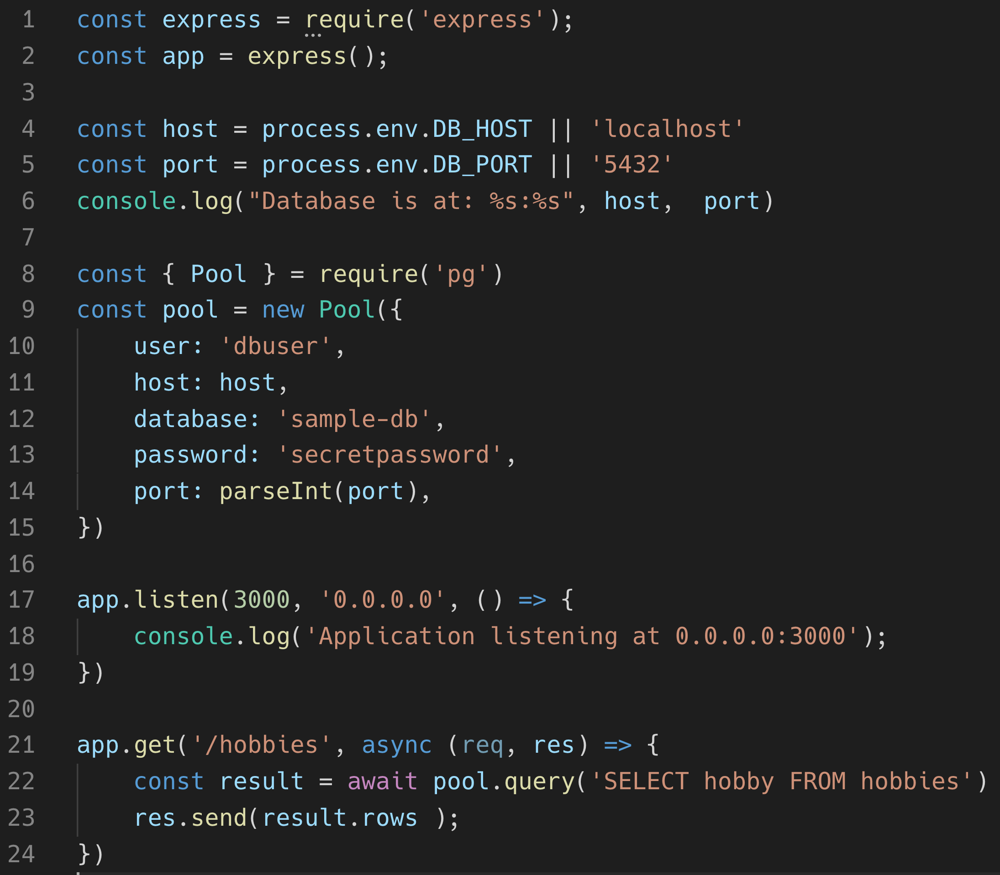

使用 pg 库访问 Postgres 的示例 API

在这里，我们创建一个监听`3000`端口的 Express JS 应用。该应用使用`pg`库，这是一个用于 Postgres 的客户端库，用于访问我们的数据库。在第`8`到`15`行，我们定义了一个连接池对象，使我们能够连接到 Postgres 并检索或写入数据。在第`21`到`24`行，我们定义了一个`GET`方法，位于`/hobbies`端点，该方法返回通过 SQL 查询`SELECT hobby FROM hobbies`从数据库中检索的爱好列表。

1.  现在，添加一个 Dockerfile 到同一文件夹，并使用以下内容：

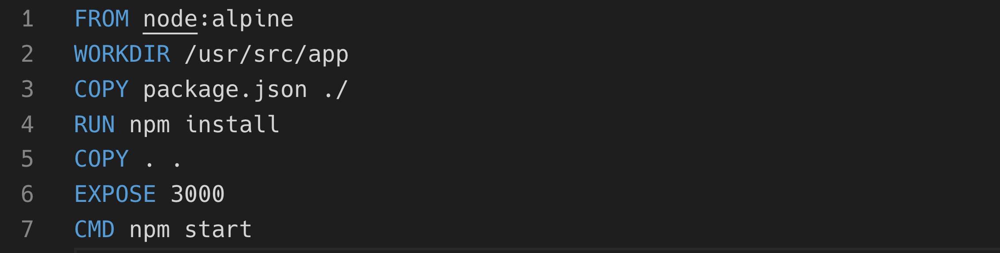

API 的 Dockerfile

这与我们在之前示例中使用的定义完全相同。通过这个，API 已准备好使用。现在让我们继续进行测试，使用`testcontainer`库简化基于容器的测试。

1.  在终端中，导航到我们之前创建的`tests`文件夹，并使用`npm init`将其初始化为一个 Node.js 项目。接受所有默认选项。接下来，使用`npm`安装`request`库和`testcontainers`库：

```
$ npm install request --save-dev
$ npm install testcontainers --save-dev
```

结果是一个`package.json`文件，应该类似于以下内容：

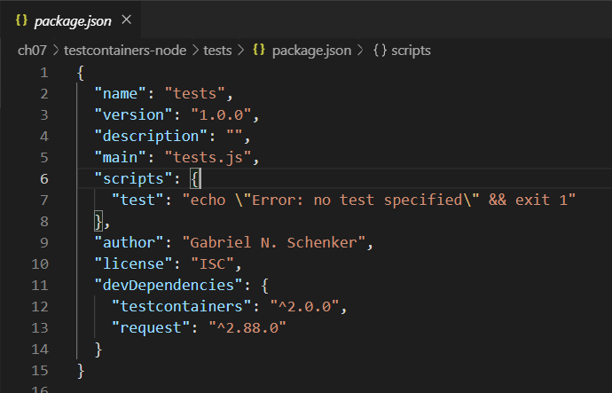

测试项目的 package.json 文件

1.  现在，仍然在`tests`文件夹中，创建一个`tests.js`文件，并添加以下代码片段：

```
const request = require("request");
const path = require('path');
const dns = require('dns');
const os = require('os');
const { GenericContainer } = require("testcontainers");

(async () => {
 // TODO
})();
```

请注意，我们如何请求一个新对象，比如`request`对象，它将帮助我们访问我们示例 API 组件的 RESTful 接口。我们还请求了`testcontainers`库中的`GenericContainer`对象，它将允许我们构建和运行任何容器。

然后，我们定义一个异步自调用函数，它将作为我们设置和测试代码的包装器。它必须是一个异步函数，因为在其中我们将等待其他异步函数，例如从`testcontainers`库使用的各种方法。

1.  作为第一步，我们希望使用`testcontainers`库创建一个 Postgres 容器，并加载必要的种子数据。让我们在`//TODO`之后添加以下代码片段：

```
const localPath = path.resolve(__dirname, "../database");
const dbContainer = await new GenericContainer("postgres")
 .withName("postgres")
 .withExposedPorts(5432)
 .withEnv("POSTGRES_USER", "dbuser")
 .withEnv("POSTGRES_DB", "sample-db")
 .withBindMount(localPath, "/docker-entrypoint-initdb.d")
 .withTmpFs({ "/temp_pgdata": "rw,noexec,nosuid,size=65536k" })
 .start();
```

上述代码片段与 Docker 的`run`命令有些相似。这并非偶然，因为我们正在指示`testcontainers`库做 exactly 这件事，并为我们运行一个 PostgreSQL 实例。

1.  接下来，我们需要找出暴露的端口`5432`映射到哪个主机端口。我们可以通过以下逻辑来做到这一点：

```
const dbPort = dbContainer.getMappedPort(5432);
```

我们需要这些信息，因为 API 组件必须通过这个端口访问 Postgres。

1.  我们还需要知道从容器内能够访问主机的 IP 地址——请注意，从容器内无法使用 localhost，因为这会映射到容器自身网络栈的回环适配器。我们可以通过以下方式获取主机的 IP 地址：

```
const myIP4 = await lookupPromise();
```

`lookupPromise`函数是一个包装函数，用来使普通的异步`dns.lookup`函数返回一个 promise，以便我们可以使用`await`。以下是它的定义：

```
async function lookupPromise(){
 return new Promise((resolve, reject) => {
 dns.lookup(os.hostname(), (err, address, family) => {
 if(err) throw reject(err);
 resolve(address);
 });
 });
};
```

1.  现在，有了这些信息，我们准备好指示`testcontainer`库首先为 API 构建容器镜像，然后从该镜像运行一个容器。我们先从构建开始：

```
const buildContext = path.resolve(__dirname, "../api");
const apiContainer = await GenericContainer
 .fromDockerfile(buildContext)
 .build();
```

请注意，这个命令使用了我们在`api`子文件夹中定义的 Dockerfile。

1.  一旦我们有了指向新镜像的`apiContainer`变量，我们就可以使用它来运行一个容器：

```
const startedApiContainer = await apiContainer
 .withName("api")
 .withExposedPorts(3000)
 .withEnv("DB_HOST", myIP4)
 .withEnv("DB_PORT", dbPort)
 .start();
```

1.  再次强调，我们需要找出 API 组件的暴露端口`3000`被映射到了哪个主机端口。`testcontainer`库使这变得非常简单：

```
const apiPort = startedApiContainer.getMappedPort(3000);
```

1.  使用这一行代码，我们已经完成了测试设置代码，现在终于可以开始实现一些测试了。我们首先定义了我们想要访问的 API 组件的基本 URL。然后，我们使用`request`库发出 HTTP GET 请求到`/hobbies`端点：

```
const base_url = `http://localhost:${apiPort}`
request.get(base_url + "/hobbies", (error, response, body) => {
 //Test code here...
})
```

1.  现在，让我们在`//Test code here...`注释之后实现一些断言：

```
console.log("> expecting status code 200");
if(response.statusCode != 200){
 logError(`Unexpected status code ${response.statusCode}`);
}
```

首先，我们在控制台上记录我们的预期结果，以便在运行测试时提供反馈。然后，我们断言返回的状态码是`200`，如果不是，我们就记录一个错误。`logError`辅助函数只是将给定的消息以红色写入控制台，并以`***ERR`为前缀。以下是这个函数的定义：

```
function logError(message){
 console.log('\x1b[31m%s\x1b[0m', `***ERR: ${message}`);
}
```

1.  让我们再添加两个断言：

```
const hobbies = JSON.parse(body);
console.log("> expecting length of hobbies == 5");
if(hobbies.length != 5){
 logError(`${hobbies.length} != 5`);
}
console.log("> expecting first hobby == swimming");
if(hobbies[0].hobby != "swimming"){
 logError(`${hobbies[0].hobby} != swimming`);
}
```

我将这个任务交给你，亲爱的读者，去弄清楚这些断言到底做了什么。

1.  在所有断言结束时，我们需要清理，以便为下一次运行做准备：

```
await startedApiContainer.stop()
await dbContainer.stop();
```

我们要做的就是停止 API 和数据库容器。这也会自动将它们从内存中移除。

1.  现在我们可以通过以下命令在`tests`子文件夹中运行这个测试套件：

```
$ node tests.js 
```

在我的情况下，输出如下所示（请注意，我在代码中添加了几个`console.log`语句，以便更容易地跟踪在特定时刻发生的事情）：

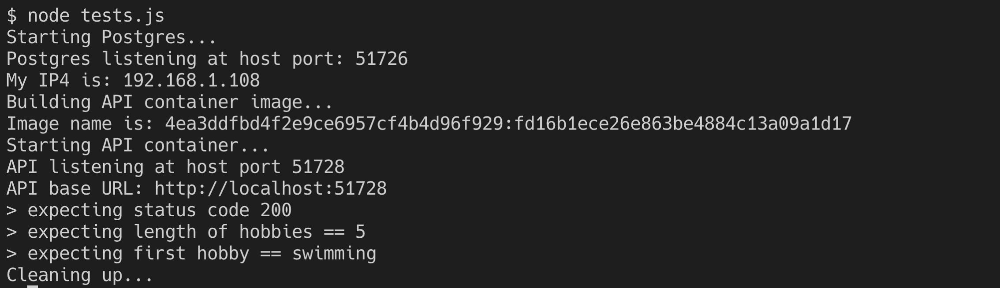

运行基于 testcontainer 的集成测试

完整的代码可以在你从 GitHub 克隆的示例代码仓库中找到。如果你在运行测试时遇到问题，请将你的实现与给定的示例解决方案进行比较。

现在，我们已经很好地理解了如何使用容器来运行集成测试，接下来我们将讨论另一个非常流行的基于容器的自动化用例，即构建一个持续集成和持续部署或交付（CI/CD）管道。

# 使用 Docker 驱动 CI/CD 管道

本节的目标是构建一个像这样的 CI/CD 管道：

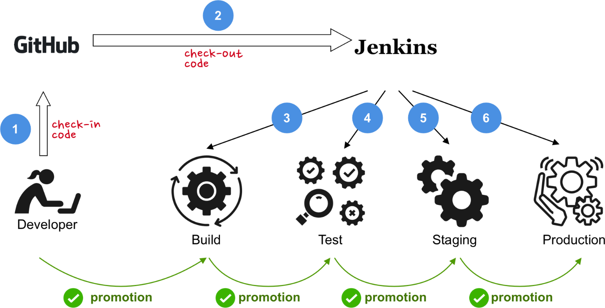

使用 Jenkins 构建一个简单的 CI/CD 管道

我们将使用 Jenkins（[`jenkins.io`](https://jenkins.io)）作为我们的自动化服务器。其他自动化服务器，如 TeamCity（[`www.jetbrains.com/teamcity`](https://www.jetbrains.com/teamcity)）同样有效。在使用 Jenkins 时，核心文档是`Jenkinsfile`，它将包含包含多个阶段的管道定义。

一个简单的`Jenkinsfile`，包含`Build`、`Test`、`Deploy to Staging`和`Deploy to Production`阶段，可能如下所示：

```
pipeline {
    agent any
    options {
        skipStagesAfterUnstable()
    }
    stages {
        stage('Build') {
            steps {
                echo 'Building'
            }
        }
        stage('Test') {
            steps {
                echo 'Testing'
            }
        }
        stage('Deploy to Staging') {
            steps {
                echo 'Deploying to Staging'
            }
        }
        stage('Deploy to Production') {
            steps {
                echo 'Deploying to Production'
            }
        }
    }
}
```

当然，前面的管道在每个阶段只是输出一条消息，什么也不做。不过它作为一个起点非常有用，可以在此基础上构建我们的管道：

1.  创建一个名为`jenkins-pipeline`的项目文件夹并导航至此文件夹：

```
$ mkdir ~/fod/ch07/jenkins-pipeline && cd ~/fod/ch07/jenkins-pipeline
```

1.  现在，让我们在 Docker 容器中运行 Jenkins。使用以下命令来实现：

```
$ docker run --rm -d \
 --name jenkins \
 -u root \
-p 8080:8080 \
-v jenkins-data:/var/jenkins_home \
 -v /var/run/docker.sock:/var/run/docker.sock \
 -v "$HOME":/home \
 jenkinsci/blueocean
```

请注意，我们以`root`用户身份在容器内运行，并且我们将 Docker 套接字挂载到容器内（`-v /var/run/docker.sock:/var/run/docker.sock`），这样 Jenkins 就可以在容器内访问 Docker。由 Jenkins 生成和使用的数据将存储在 Docker 卷`jenkins-data`中。

1.  我们可以通过以下命令找到 Jenkins 自动生成的初始管理员密码：

```
$ docker container exec jenkins cat /var/jenkins_home/secrets/initialAdminPassword
```

在我的情况下，这将输出`7f449293de5443a2bbcb0918c8558689`。请保存此密码，因为接下来的步骤中需要使用它。

1.  在浏览器中，导航至`http://localhost:8080`以访问 Jenkins 的图形化界面。

1.  使用前面命令获取的管理员密码解锁 Jenkins。

1.  接下来，选择“安装推荐插件”，让 Jenkins 自动安装最常用的插件。插件包括 GitHub 集成、邮件扩展、Maven 和 Gradle 集成等。

1.  插件安装完成后，创建你的第一个管理员账户。当系统提示重启 Jenkins 时，执行重启操作。

1.  配置好 Jenkins 服务器后，首先创建一个新项目；你可能需要在主菜单中点击**New Item**：

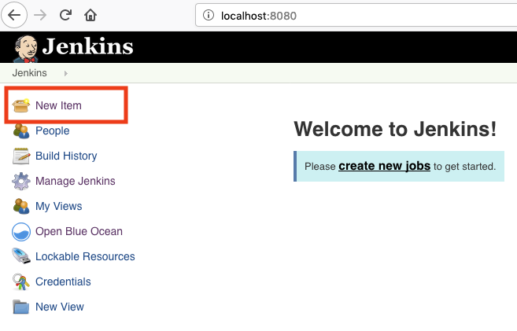

在 Jenkins 中添加新项目

1.  给项目命名为`sample-pipeline`，选择`Pipeline`类型，并点击 OK。

1.  在配置视图中，选择 Pipeline 选项卡，并将前面的管道定义添加到 Script 文本框中：

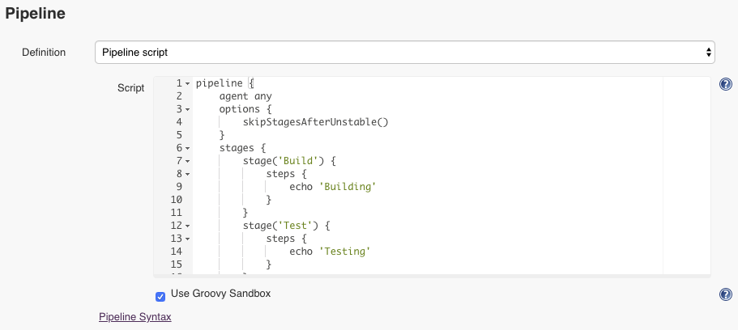

在我们名为 sample-pipeline 的 Jenkins 项目中定义管道

1.  点击保存，然后在 Jenkins 的主菜单中选择“立即构建”。稍等片刻后，你应该会看到如下内容：

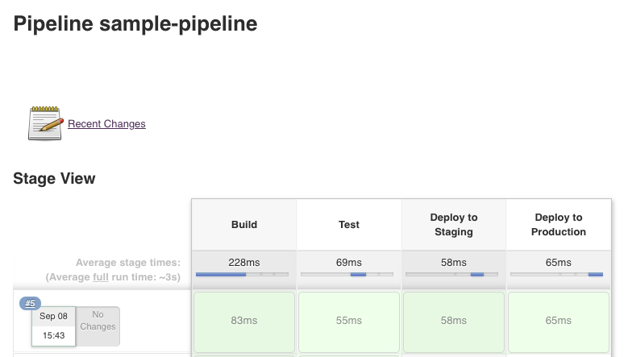

在 Jenkins 中运行我们的示例管道

1.  现在我们已经准备好 Jenkins，可以开始集成我们的示例应用程序。我们从构建步骤开始。首先，我们将`jenkins-pipeline`项目文件夹初始化为 Git 项目：

```
$ cd ~/fod/ch07/jenkins-pipeline && git init
```

1.  将一个`package.json`文件添加到此文件夹，内容如下：

```
{
  "name": "jenkins-pipeline",
  "version": "1.0.0",
  "main": "server.js",
  "scripts": {
    "start": "node server.js",
    "test": "jasmine"
  },
  "dependencies": {
    "express": "⁴.17.1"
  },
  "devDependencies": {
    "jasmine": "³.4.0"
  }
}
```

除了通常列出的外部依赖项 `express` 和 `jasmine`，这个文件没有什么特别之处。还要注意我们为 `npm` 定义的两个脚本 `start` 和 `test`。

1.  向项目中添加一个 `hobbies.js` 文件，文件实现了作为 JavaScript 模块 `hobbies` 获取爱好的逻辑：

```
const hobbies = ["jogging","cooking","diving","swimming","reading"];

exports.getHobbies = () => {
    return hobbies;
}

exports.getHobby = id => {
    if(id<1 || id > hobbies.length)
        return null;
    return hobbies[id-1];
}
```

这段代码显然是在通过提供存储在 `hobbies` 数组中的预设数据来模拟数据库。我们这么做是为了简化操作。

1.  接下来，在文件夹中添加一个 `server.js` 文件，定义一个具有三个端点的 RESTful API，`GET /`、`GET /hobbies` 和 `GET /hobbies/:id`。该代码使用 `hobbies` 模块中定义的逻辑来检索数据：

```
const hobbies = require('./hobbies');
const express = require('express');
const app = express();

app.listen(3000, '0.0.0.0', () => {
    console.log('Application listening at 0.0.0.0:3000');
})

app.get('/', (req, res) => {
    res.send('Sample API');
})

app.get('/hobbies', async (req, res) => {
    res.send(hobbies.getHobbies());
})

app.get('/hobbies/:id', async (req, res) => {
    const id = req.params.id;
    const hobby = hobbies.getHobby(id);
    if(!hobby){
        res.status(404).send("Hobby not found");
        return;
    }
    res.send();
})
```

1.  现在我们需要定义一些单元测试。在项目中创建一个 `spec` 子文件夹，并将 `hobbies-spec.js` 文件添加到该文件夹中，代码如下，用于测试 `hobbies` 模块：

```
const hobbies = require('../hobbies');
describe("API unit test suite", () => {
    describe("getHobbies", () => {
        const list = hobbies.getHobbies();
        it("returns 5 hobbies", () => {
            expect(list.length).toEqual(5);
        });
        it("returns 'jogging' as first hobby", () => {
            expect(list[0]).toBe("jogging");
        });
    })
})
```

1.  最后一步是添加一个 `support/jasmine.json` 文件，以配置我们的测试框架 Jasmine。添加以下代码片段：

```
{
    "spec_dir": "spec",
    "spec_files": [
      "**/*[sS]pec.js"
    ],
    "stopSpecOnExpectationFailure": false,
    "random": false
}
```

目前我们所需要的就是这些代码。

现在我们可以开始构建 CI/CD 流水线了：

1.  使用以下命令提交刚刚在本地创建的代码：

```
$ git add -A && git commit -m "First commit"
```

1.  为了避免所有的节点模块被保存到 GitHub 中，向项目的 `root` 文件夹添加一个 `.gitignore` 文件，内容如下：

```
node_modules
```

1.  现在，我们需要在 GitHub 上定义一个仓库。登录到你的 GitHub 账户：[`github.com`](https://github.com)。

1.  在那里创建一个新的仓库，并命名为 `jenkins-pipeline`：

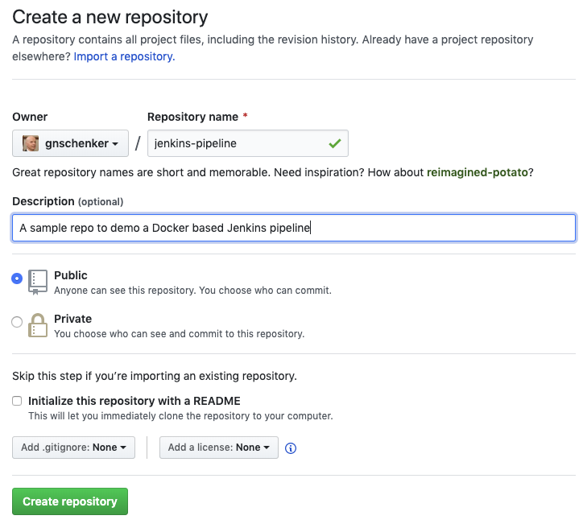

为 Jenkins 流水线示例应用程序创建一个新的 GitHub 仓库

请注意，我的 GitHub 账号是 `gnschenker`，在你的情况下，它将是你自己的账户。

1.  点击绿色按钮后，**创建仓库**，然后回到你的项目，并在项目 `root` 文件夹中执行以下两条命令：

```
$ git remote add origin https://github.com/gnschenker/jenkins-pipeline.git
$ git push -u origin master
```

确保你在第一行中将 `gnschenker` 替换为你自己的 GitHub 账号名。完成这一步后，你的代码将可以在 GitHub 上使用。稍后 Jenkins 就是其中一个将从这个仓库拉取代码的用户。

1.  接下来的步骤是回到 Jenkins (`localhost:8080`)，并修改项目的配置。如果需要，先登录 Jenkins，然后选择你的项目 `sample-pipeline`。

1.  然后，选择主菜单中的“配置”，选择“流水线”标签，并修改设置，使其看起来像这样：

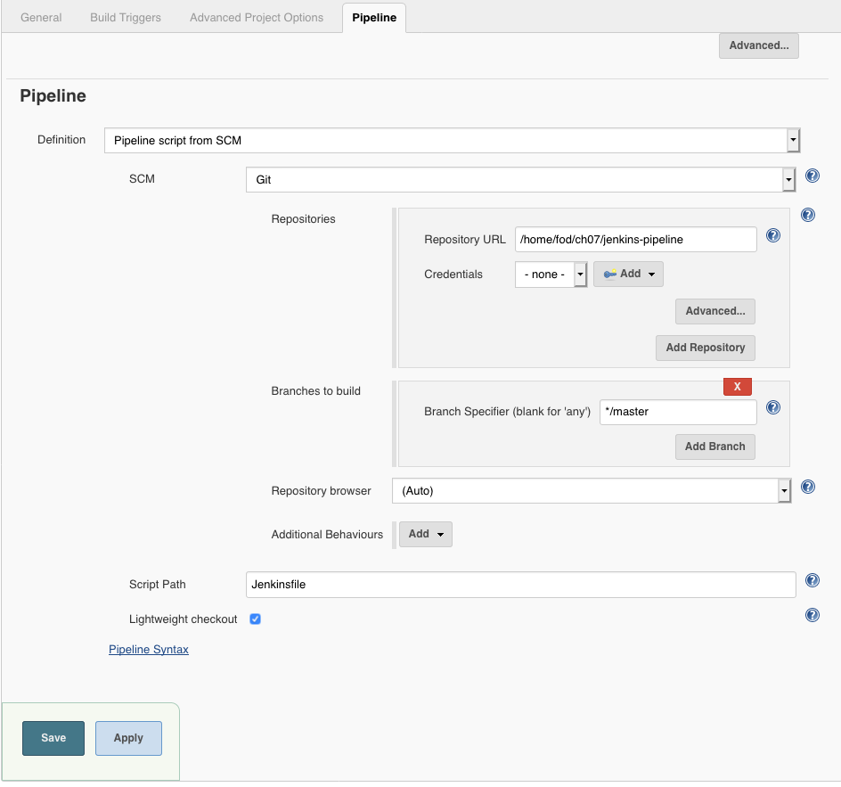

配置 Jenkins 从 GitHub 拉取源代码

这样，我们就配置了 Jenkins 从 GitHub 拉取代码，并使用 `Jenkinsfile` 来定义流水线。`Jenkinsfile` 应该位于项目的 `root` 目录中。注意，在仓库 URL 路径中，我们需要提供相对于 `/home` 目录的路径，该目录是我们项目所在的路径。记住，在运行 Jenkins 容器时，我们通过 `-v "$HOME":/home` 将主机上的个人文件夹映射到 Jenkins 容器内的 `/home` 文件夹。

1.  点击绿色的保存按钮以接受更改。

1.  我们已定义 `Jenkinsfile` 需要位于项目的 `root` 文件夹中。这是 **Pipeline-as-Code** 的基础，因为 pipeline 定义文件将与其他代码一起提交到 GitHub 仓库。因此，添加一个名为 `Jenkinsfile` 的文件到 `jenkins-pipeline` 文件夹中，并将此代码添加到文件中：

```
pipeline {
    environment {
        registry = "gnschenker/jenkins-docker-test"
        DOCKER_PWD = credentials('docker-login-pwd')
    }
    agent {
        docker {
            image 'gnschenker/node-docker'
            args '-p 3000:3000'
            args '-w /app'
            args '-v /var/run/docker.sock:/var/run/docker.sock'
        }
    }
    options {
        skipStagesAfterUnstable()
    }
    stages {
        stage("Build"){
            steps {
                sh 'npm install'
            }
        }
        stage("Test"){
            steps {
                sh 'npm test'
            }
        }
        stage("Build & Push Docker image") {
            steps {
                sh 'docker image build -t $registry:$BUILD_NUMBER .'
                sh 'docker login -u gnschenker -p $DOCKER_PWD'
                sh 'docker image push $registry:$BUILD_NUMBER'
                sh "docker image rm $registry:$BUILD_NUMBER"
            }
        }
    }
}
```

好的，我们一个部分一个部分地深入了解这个文件。在顶部，我们定义了两个环境变量，这些变量将在 pipeline 的每个阶段中都可用。我们将在 `Build & Push Docker image` 阶段使用这些变量：

```
environment {
    registry = "gnschenker/jenkins-docker-test"
    DOCKER_PWD = credentials('docker-login-pwd')
}
```

第一个变量，`registry`，仅包含我们最终将生成并推送到 Docker Hub 的容器镜像的完整名称。将 `gnschenker` 替换为你自己的 GitHub 用户名。第二个变量，`DOCKER_PWD`，稍微有点不同。它将包含登录到我 Docker Hub 帐户的密码。当然，我不希望在代码中硬编码这个值，因此，我使用 Jenkins 的凭据功能，这让我可以访问存储在 Jenkins 中名为 `docker-login-pwd` 的机密。

接下来，我们定义了一个代理，用来运行 Jenkins pipeline。在我们的例子中，这个代理基于 Docker 镜像。我们使用 `gnschenker/node-docker` 镜像来实现这一目的。该镜像基于 `node:12.10-alpine`，并且已经安装了 Docker 和 `curl`，因为我们将在某些阶段需要这两个工具：

```
agent {
    docker {
        image 'gnschenker/node-docker'
        args '-v /var/run/docker.sock:/var/run/docker.sock'
    }
}
```

使用 `args` 参数时，我们还将 Docker 套接字映射到容器中，以便可以在代理内部使用 Docker。

暂时忽略选项部分。我们接下来定义了三个阶段：

```
stages {
    stage("Build"){
        steps {
            sh 'npm install'
        }
    }
    stage("Test"){
        steps {
            sh 'npm test'
        }
    }
    stage("Build & Push Docker image") {
        steps {
            sh 'docker image build -t $registry:$BUILD_NUMBER .'
            sh 'docker login -u gnschenker -p $DOCKER_PWD'
            sh 'docker image push $registry:$BUILD_NUMBER'
            sh "docker image rm $registry:$BUILD_NUMBER"
        }
    }
}
```

第一个阶段，`Build`，只是运行 `npm install`，以确保可以安装我们应用程序的所有外部依赖。如果这例如是一个 Java 应用程序，我们可能还会在这一步编译并打包应用程序。

在第二个阶段，`Test`，我们运行 `npm test`，它会运行我们为示例 API 定义的单元测试。

第三个阶段，`Build & Push Docker image`，更有意思。现在我们已经成功构建并测试了我们的应用程序，我们可以为它创建一个 Docker 镜像，并将其推送到注册中心。我们使用 Docker Hub 作为注册中心，但任何私有或公共注册中心都可以使用。在这个阶段，我们定义了四个步骤：

1.  我们使用 Docker 来构建镜像。我们使用在 Jenkinsfile 第一个部分定义的环境变量 `$registry`。`$BUILD_NUMBER` 变量由 Jenkins 自身定义。

1.  在我们能将某些内容推送到注册中心之前，我们需要先登录。在这里，我使用了之前定义的 `$DOCKER_PWD` 变量。

1.  一旦我们成功登录到注册中心，就可以推送镜像。

1.  由于镜像现在已经在注册中心，我们可以从本地缓存中删除它，以避免浪费空间。

记住，所有阶段都在我们的`gnschenker/node-docker`构建器容器内运行。因此，我们是在容器内运行 Docker。但由于我们已将 Docker 套接字映射到构建器容器中，Docker 命令实际上是作用于主机的。

让我们再向管道中添加两个阶段。第一个阶段看起来是这样的：

```
stage('Deploy and smoke test') {
    steps{
        sh './jenkins/scripts/deploy.sh'
    }
}
```

将它添加到`Build & Push Docker image`阶段之后。这个阶段会执行位于`jenkins/scripts`子文件夹中的`deploy.sh`脚本。我们现在还没有这样的文件。

因此，将这个文件添加到你的项目中，内容如下：

```
#!/usr/bin/env sh

echo "Removing api container if it exists..."
docker container rm -f api || true
echo "Removing network test-net if it exists..."
docker network rm test-net || true

echo "Deploying app ($registry:$BUILD_NUMBER)..."
docker network create test-net

docker container run -d \
    --name api \
    --net test-net \
    $registry:$BUILD_NUMBER

# Logic to wait for the api component to be ready on port 3000

read -d '' wait_for << EOF
echo "Waiting for API to listen on port 3000..."
while ! nc -z api 3000; do 
  sleep 0.1 # wait for 1/10 of the second before check again
  printf "."
done
echo "API ready on port 3000!"
EOF

docker container run --rm \
    --net test-net \
    node:12.10-alpine sh -c "$wait_for"

echo "Smoke tests..."
docker container run --name tester \
    --rm \
    --net test-net \
    gnschenker/node-docker sh -c "curl api:3000"
```

好的，这段代码做了以下几件事。首先，它尝试移除任何可能由于先前失败的管道运行而留下的残留物。然后，它创建了一个名为`test-net`的 Docker 网络。接着，它从我们在上一阶段构建的镜像中运行一个容器。这个容器是我们的 Express JS API，命名为`api`。

这个容器和其中的应用程序可能需要一点时间才能准备好。因此，我们定义了一些逻辑，使用`netcat`或`nc`工具来探测端口`3000`。一旦应用程序在端口`3000`上开始监听，我们就继续进行冒烟测试。在我们的案例中，冒烟测试只是确保能够访问我们 API 的`/`端点。我们使用`curl`来完成这项任务。在更现实的设置中，你会在这里运行一些更复杂的测试。

作为最后一个阶段，我们添加了一个`Cleanup`步骤：

1.  将以下代码片段作为最后一个阶段添加到你的`Jenkinsfile`中：

```
stage('Cleanup') {
    steps{
        sh './jenkins/scripts/cleanup.sh'
    }
}
```

再次提醒，这个`Cleanup`阶段使用的是位于`jenkins/script`子文件夹中的脚本。

1.  请将以下内容的文件添加到你的项目中：

```
#!/usr/bin/env sh

docker rm -f api
docker network rm test-net
```

这个脚本会移除`api`容器和我们用于运行容器的 Docker 网络`test-net`。

1.  现在，我们准备好执行了。使用`git`提交你的更改并推送到你的代码库：

```
$ git -a . && git commit -m "Defined code based Pipeline"
$ git push origin master
```

一旦代码推送到 GitHub，返回到 Jenkins。

1.  选择你的`sample-pipeline`项目，并点击主菜单中的“立即构建”。Jenkins 将开始构建管道。如果一切顺利，你应该会看到类似这样的内容：

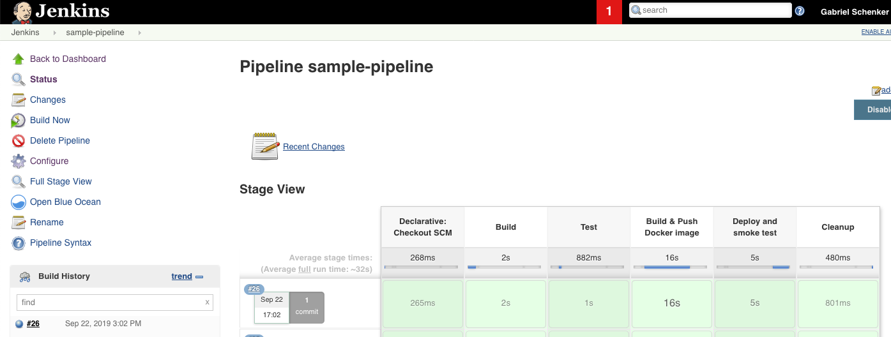

在 Jenkins 中运行我们的完整代码基础管道

我们的管道成功执行并且现在有六个步骤。GitHub 的检出已经自动作为第一个启用步骤添加了。要访问在管道执行期间生成的日志，你可以点击构建历史中运行项左侧的小球图标。在前面的截图中，它是**#26**左侧的蓝色图标。这对于在管道步骤失败时，快速定位失败原因非常有帮助。

总结一下，我们构建了一个简单的 CI/CD 管道，其中的一切，包括自动化服务器 Jenkins，都运行在容器中。我们只触及了可能性的一部分。

# 总结

在本章中，我们学习了如何使用 Docker 容器来优化各种自动化任务，从运行简单的一次性任务到构建容器化的 CI/CD 流水线。

在下一章中，我们将介绍在容器化复杂分布式应用程序或使用 Docker 自动化复杂任务时有用的高级技巧、窍门和概念。

# 问题

1.  列举在容器中运行一次性任务而不是直接在主机上运行的优缺点。

1.  列出两到三个在容器中运行测试的优点。

1.  绘制一个容器化 CI/CD 流水线的高层次图，从用户编写代码开始，直到代码被部署到生产环境。

# 进一步阅读

+   在[`www.docker.com/blog/maintainable-integration-tests-with-docker/`](https://www.docker.com/blog/maintainable-integration-tests-with-docker/)上阅读《使用 Docker 编写可维护的集成测试》

+   在[`gabrielschenker.com/index.php/2019/10/09/a-docker-workflow-for-net-developers-part-2/`](https://gabrielschenker.com/index.php/2019/10/09/a-docker-workflow-for-net-developers-part-2/)上阅读《.NET 开发者的 Docker 工作流 - 第二部分（集成测试）》

+   在[`hub.docker.com/_/jenkins/`](https://hub.docker.com/_/jenkins/)上了解 Jenkins 在 Docker Hub 上的情况

+   在[`jenkins.io/doc/tutorials/`](https://jenkins.io/doc/tutorials/)上阅读 Jenkins 教程概述
