# 第九章：高级 Docker 使用场景

在上一章中，我们向你展示了如何使用工具执行管理任务，而不需要在主机计算机上安装这些工具。我们还说明了如何使用容器来托管和运行测试脚本或代码，用于测试和验证在容器中运行的应用服务。最后，我们引导你完成了使用 Jenkins 作为自动化服务器，构建一个简单的基于 Docker 的 CI/CD 流水线的任务。

本章将介绍在容器化复杂的分布式应用程序时，或者使用 Docker 自动化复杂任务时，有用的高级技巧、窍门和概念。

这是我们将在本章中涉及的所有主题的快速概览：

+   成为 Docker 专家的所有技巧和窍门

+   在远程容器中运行你的终端，并通过 HTTPS 访问它

+   在容器中运行你的开发环境

+   在远程容器中运行你的代码编辑器，并通过 HTTPS 访问它

完成本章后，你将能够做以下事情：

+   成功恢复被彻底破坏的 Docker 环境

+   在容器中运行远程终端，并通过 HTTPS 使用浏览器访问它

+   通过 HTTPS 使用浏览器与 Visual Studio Code 远程编辑代码

# 技术要求

在本章中，如果你想跟着代码一起操作，你需要在 Mac 或 Windows 机器上安装 Docker for Desktop 以及 Visual Studio Code 编辑器。这个示例也可以在安装了 Docker 和 Visual Studio Code 的 Linux 机器上运行。本章不支持使用 Docker Toolbox。

# 成为 Docker 专家的所有技巧和窍门

在这一节中，我将介绍一些非常实用的技巧和窍门，这些技巧让高级 Docker 用户的生活更加轻松。我们将从一些关于如何保持 Docker 环境清洁的指导开始。

# 保持你的 Docker 环境干净

首先，我们需要了解如何删除悬挂的镜像。根据 Docker 的定义，悬挂镜像是指没有与任何已标记镜像关联的层。这些镜像层对我们来说显然是没有用的，并且会迅速填满我们的磁盘——最好定期删除它们。以下是删除命令：

```
$ docker image prune -f
```

请注意，我已将 `-f` 参数添加到 `prune` 命令中。这是为了防止命令行界面询问我们是否确认真的要删除那些多余的层。

停止的容器也可能浪费宝贵的资源。如果你确定这些容器不再需要，应该将它们删除，可以使用以下命令逐个删除：

```
$ docker container rm <container-id>
```

或者，你也可以使用以下命令批量删除它们：

```
$ docker container prune --force
```

值得再次提到的是，我们可以使用 `<container-name>` 来代替 `<container-id>` 来识别一个容器。

未使用的 Docker 卷也会迅速占满磁盘空间。在开发或 CI 环境中，创建大量大多是临时卷的情况，定期清理卷是一个很好的做法。但我必须提醒你，Docker 卷是用来存储数据的。通常，这些数据的生命周期需要长于容器的生命周期。这在生产或类生产环境中尤为重要，因为数据往往是至关重要的。因此，在使用以下命令清理 Docker 主机上的卷时，一定要确保自己完全了解自己在做什么：

```
$ docker volume prune
WARNING! This will remove all local volumes not used by at least one container.
Are you sure you want to continue? [y/N]
```

我建议在没有 `-f`（或 `--force`）标志的情况下使用此命令。这是一个危险且不可逆的操作，最好给自己一个重新考虑的机会。如果没有这个标志，CLI 会输出你在前面看到的警告。你需要显式确认，通过输入 `y` 并按下 *Enter* 键。

在生产或类生产系统中，你应该避免使用前面的命令，而是使用以下命令逐一删除不需要的卷：

```
$ docker volume rm <volume-name>
```

我还应该提到，有一个命令可以清理 Docker 网络。但由于我们还没有正式介绍网络内容，所以我将把它留到 第十章，*单主机网络*。

在接下来的部分，我们将展示如何在容器内部自动化 Docker 操作。

# 在 Docker 中运行 Docker

有时，我们可能想要运行一个托管应用程序的容器，这个应用程序可以自动化某些 Docker 任务。我们该如何实现呢？Docker 引擎和 Docker CLI 安装在主机上，但应用程序运行在容器内。实际上，Docker 从一开始就提供了一种方法，可以将 Linux 套接字从主机绑定到容器内。在 Linux 上，套接字作为进程间通信的高效数据传输端点，用于同一主机上运行的进程之间。Docker CLI 使用套接字与 Docker 引擎通信，通常称为 Docker 套接字。如果我们能够让容器内部的应用程序访问 Docker 套接字，那么我们就可以在容器内部安装 Docker CLI，之后我们就能够在同一容器内运行一个应用程序，使用本地安装的 Docker CLI 来自动化与容器相关的任务。

需要注意的是，我们在这里并不是在谈论在容器内运行 Docker 引擎，而只是运行 Docker CLI，并将主机上的 Docker 套接字绑定挂载到容器中，以便 CLI 可以与运行在主机上的 Docker 引擎进行通信。这是一个重要的区别。尽管可以，但不建议在容器内运行 Docker 引擎。

假设我们有一个名为 `pipeline.sh` 的脚本，用于自动化构建、测试和推送 Docker 镜像：

```
#! /bin/bash
# *** Sample script to build, test and push containerized Node.js applications ***
# build the Docker image
docker image build -t $HUB_USER/$REPOSITORY:$TAG .
# Run all unit tests
docker container run $HUB_USER/$REPOSITORY:$TAG npm test
# Login to Docker Hub
docker login -u $HUB_USER -p $HUB_PWD
# Push the image to Docker Hub
docker image push $HUB_USER/$REPOSITORY:$TAG
```

注意我们使用了四个环境变量：`$HUB_USER` 和 `$HUB_PWD` 是 Docker Hub 的凭据，而 `$REPOSITORY` 和 `$TAG` 是我们要构建的 Docker 镜像的名称和标签。最终，我们必须在 `docker run` 命令中传递这些环境变量的值。

我们希望在 builder 容器中运行该脚本。由于脚本使用了 Docker CLI，因此我们的 builder 容器必须安装 Docker CLI，并且为了访问 Docker 引擎，builder 容器必须绑定挂载 Docker 套接字。让我们开始为这样的 builder 容器创建一个 Docker 镜像：

1.  首先，创建一个 `builder` 文件夹并导航到该文件夹：

```
$ mkdir builder && cd builder
```

1.  在此文件夹内，创建一个如下所示的 `Dockerfile`：

```
FROM alpine:latest
RUN apk update && apk add docker
WORKDIR /usr/src/app
COPY . .
CMD ./pipeline.sh
```

1.  现在，在 `builder` 文件夹中创建一个 `pipeline.sh` 文件，并将我们在前一个文件中呈现的管道脚本作为内容添加进去。

1.  保存并使文件成为可执行文件：

```
$ chmod +x ./pipeline.sh
```

1.  构建镜像非常简单：

```
$ docker image build -t builder .
```

我们现在准备好使用真实的 Node.js 应用程序来尝试 `builder`，例如，我们在 `ch08/sample-app` 文件夹中定义的示例应用程序。确保将 `<user>` 和 `<password>` 替换为你自己的 Docker Hub 凭据：

```
$ cd ~/fod/ch08/sample-app
$ docker container run --rm \
 --name builder \
 -v /var/run/docker.sock:/var/run/docker.sock \
    -v "$PWD":/usr/src/app \
 -e HUB_USER=<user> \
 -e HUB_PWD=<password>@j \
 -e REPOSITORY=ch08-sample-app \
 -e TAG=1.0 \
 builder
```

注意在前面的命令中，我们使用 `-v /var/run/docker.sock:/var/run/docker.sock` 将 Docker 套接字挂载到容器内。如果一切顺利，你应该已经为示例应用程序构建了容器镜像，测试已经运行，镜像也已经推送到 Docker Hub。这仅仅是许多情况下，能够绑定挂载 Docker 套接字非常有用的一种用例。

特别提醒所有想尝试 Windows 容器的用户。在 Docker for Windows 上，你可以通过绑定挂载 Docker 的**命名管道**来创建一个类似的环境，而不是使用套接字。Windows 上的命名管道大致相当于基于 Unix 的系统中的套接字。假设你正在使用 PowerShell 终端，运行 Windows 容器并托管 Jenkins 时，绑定挂载命名管道的命令如下所示：

``**PS>** **docker container run `** **--name jenkins `** **-p 8080:8080 `** **-v \\.\pipe\docker_engine:\\.\pipe\docker_engine ` friism/jenkins**``

注意特殊语法，`\\.\pipe\docker_engine`，以访问 Docker 的命名管道。

# 格式化常见 Docker 命令的输出

你是否曾希望你的终端窗口是无限宽的，因为像 `docker container ps` 这样的 Docker 命令的输出会跨多行显示每个项目？不用担心，你可以根据自己的喜好自定义输出。几乎所有生成输出的命令都有一个 `--format` 参数，该参数接受所谓的 Go 模板作为参数。如果你想知道为什么是 Go 模板，那是因为 Docker 的大部分代码都是用这种流行的低级语言编写的。让我们看一个例子。假设我们只想显示容器的名称、镜像的名称以及容器的状态，用制表符分隔，由 `docker container ps` 命令输出。那么格式应该是这样的：

```
$ docker container ps -a \
--format "table {{.Names}}\t{{.Image}}\t{{.Status}}"
```

请注意，`format` 字符串是区分大小写的。此外，注意新增了 `-a` 参数，以便在输出中包括已停止的容器。一个示例输出可能如下所示：

```
NAMES              IMAGE            STATUS
elated_haslett     alpine           Up 2 seconds
brave_chebyshev    hello-world      Exited (0) 3 minutes ago
```

即使在较窄的终端窗口中，这种输出格式也比未格式化的输出更加美观，后者会在多行之间乱七八糟地分散。

# 过滤常见 Docker 命令的输出

类似于我们在前一节通过漂亮打印 Docker 命令输出所做的，我们也可以过滤输出内容。有相当多的过滤器是支持的。请在 Docker 在线文档中查找每个命令的完整列表。过滤器的格式非常简单，类型为 `--filter <key>=<value>`。如果我们需要组合多个过滤器，只需将这些语句组合起来即可。让我们通过 `docker image ls` 命令做一个示例，因为我的工作站上有很多镜像：

```
$ docker image ls --filter dangling=false --filter "reference=*/*/*:latest"
```

上述过滤器只输出非悬挂的镜像，即真实镜像，其完整名称的形式为 `<registry>/<user|org><repository>:<tag>`，并且标签为 `latest`。我机器上的输出如下所示：

```
REPOSITORY                                  TAG     IMAGE ID      CREATED   SIZE
docker.bintray.io/jfrog/artifactory-cpp-ce  latest  092f11699785  9 months  ago 900MB
docker.bintray.io/jfrog/artifactory-oss     latest  a8a8901c0230  9 months  ago 897MB
```

在展示如何漂亮地打印和过滤由 Docker CLI 生成的输出后，现在是时候再次讨论如何构建 Docker 镜像以及如何优化这个过程了。

# 优化构建过程

许多 Docker 初学者在编写他们的第一个 `Dockerfile` 时会犯以下错误：

```
FROM node:12.10-alpine
WORKDIR /usr/src/app
COPY . .
RUN npm install
CMD npm start
```

你能发现这个典型的 Node.js 应用程序的 `Dockerfile` 中的弱点吗？在 第四章《创建和管理容器镜像》中，我们学到了一张镜像由一系列层组成。每一行（逻辑上）都会创建一层，除了包含 `CMD` 和/或 `ENTRYPOINT` 关键字的行。我们还学到，Docker 构建器尽力通过缓存层并在后续构建之间重用它们来提高效率。但缓存只会使用发生在第一个更改层之前的缓存层。所有后续层都需要重新构建。也就是说，上述 `Dockerfile` 结构会破坏镜像层的缓存！

为什么？嗯，根据经验，你一定知道，在一个典型的 Node.js 应用程序中，`npm install`可能是一个相当耗费资源的操作，尤其是当有许多外部依赖时。这个命令的执行可能需要几秒钟到几分钟不等。也就是说，每当其中一个源文件发生变化，而我们知道在开发过程中这会经常发生时，第 3 行的`Dockerfile`会导致相应的镜像层发生变化。因此，Docker 构建器无法重用这个缓存中的层，也无法重用由`RUN npm install`创建的后续层。任何代码的小改动都会导致`npm install`的完整重跑。这是可以避免的。包含外部依赖列表的`package.json`文件很少变化。根据这些信息，我们来修复`Dockerfile`：

```
FROM node:12.10-alpine
WORKDIR /usr/src/app
COPY package.json ./
RUN npm install
COPY . .
CMD npm start
```

这一次，在第 3 行，我们只将`package.json`文件复制到容器中，这个文件很少变化。因此，后续的`npm install`命令也只需很少执行一次。第 5 行的`COPY`命令是一个非常快速的操作，因此在代码发生变化后重新构建镜像只需要重新构建最后一层。构建时间缩短到仅仅几分之一秒。

同样的原理适用于大多数语言或框架，如 Python、.NET 或 Java。避免破坏你的镜像层缓存！

# 限制容器使用的资源

除了封装应用程序进程，容器的一个重要特点是能够限制单个容器消耗的资源，包括 CPU 和内存。让我们来看一下限制内存（RAM）消耗是如何工作的：

```
$ docker container run --rm -it \
    --name stress-test \
 --memory 512M \
 ubuntu:19.04 /bin/bash
```

进入容器后，安装`stress`工具，我们将用它来模拟内存压力：

```
/# apt-get update && apt-get install -y stress
```

打开另一个终端窗口并执行`docker stats`命令。你应该会看到类似以下的内容：

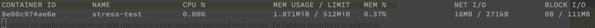

docker stats 显示一个资源受限的容器

查看`MEM USAGE`和`LIMIT`。当前，容器仅使用`1.87MiB`内存，并且内存限制为`512MB`。后者对应于我们为这个容器配置的值。现在，让我们使用`stress`模拟四个工作线程，这些线程尝试以`256MB`为单位的块分配内存。运行以下命令来实现：

```
/# stress -m 4
```

在终端运行 Docker stats 时，观察`MEM USAGE`的值接近但永远不会超过`LIMIT`。这正是我们预期的 Docker 行为。Docker 使用 Linux 的`cgroups`来强制执行这些限制。

我们同样可以使用`--cpu`选项限制容器能够使用的 CPU 数量。

通过这种操作，工程师们可以避免在繁忙的 Docker 主机上出现"噪音邻居"问题，即一个容器通过消耗过多资源使得其他所有容器都无法正常运行。

# 只读文件系统

为了保护您的应用程序免受恶意黑客攻击，通常建议将容器的文件系统或其中一部分设置为只读。这对无状态服务最为适用。假设您有一个在容器中运行的计费服务，作为您分布式关键任务应用程序的一部分。您可以按以下方式运行您的计费服务：

```
$ docker container run -d --rm \
 --name billing \
 --read-only \
 acme/billing:2.0
```

`--read-only`标志将容器的文件系统挂载为只读。如果黑客成功进入您的计费容器，并试图通过例如用一个被篡改的二进制文件替换其中的一个程序来恶意修改应用程序，那么这个操作将会失败。我们可以通过以下命令轻松演示这一点：

```
$ docker container run --tty -d \
    --name billing \
    --read-only \
    alpine /bin/sh 
$ docker container exec -it billing \
 sh -c 'echo "You are doomed!" > ./sample.txt' sh: can't create ./sample.txt: Read-only file system
```

第一个命令运行一个只读文件系统的容器，第二个命令尝试在该容器中执行另一个进程，目的是将某些内容写入文件系统——在此案例中，是一个简单的文本文件。正如我们在前面的输出中看到的那样，这个操作失败了，错误信息为`只读文件系统`。

加强容器中运行的应用程序安全性的另一种方法是避免以`root`身份运行它们。

# 避免以 root 身份运行容器化应用程序

大多数在容器中运行的应用程序或应用服务并不需要 root 权限。为了加强安全性，在这些情况下，尽可能用最小的必要权限运行这些进程是有益的。这些应用程序不应以`root`身份运行，也不应假设它们拥有`root`级别的权限。

再次让我们通过一个例子来说明我们所说的。假设我们有一个包含顶级机密内容的文件。我们希望使用`chmod`工具在基于 Unix 的系统上保护这个文件，确保只有拥有 root 权限的用户可以访问它。假设我以`gabriel`身份登录到`dev`主机，因此我的提示符是`gabriel@dev $`。我可以使用`sudo su`来模拟超级用户身份。但我必须输入超级用户密码：

```
gabriel@dev $ sudo su
Password: <root password>
root@dev $
```

现在，作为`root`用户，我可以创建一个名为`top-secret.txt`的文件并将其加密：

```
root@dev $ echo "You should not see this." > top-secret.txt
root@dev $ chmod 600 ./top-secret.txt
root@dev $ exit
gabriel@dev $
```

如果我尝试以`gabriel`身份访问该文件，以下情况会发生：

```
gabriel@dev $ cat ./top-secret.txt
cat: ./top-secret.txt: Permission denied
```

我得到`权限被拒绝`，这正是我们想要的。除`root`外，没有其他用户可以访问该文件。现在，让我们构建一个包含此加密文件的 Docker 镜像，当从该镜像创建容器时，尝试输出其内容。`Dockerfile`可能如下所示：

```
FROM ubuntu:latest
COPY ./top-secret.txt /secrets/
# simulate use of restricted file
CMD cat /secrets/top-secret.txt
```

我们可以使用以下命令从那个 Dockerfile（以`root`身份！）构建一个镜像：

```
gabriel@dev $ sudo su
Password: <root password>
root@dev $ docker image build -t demo-image .
root@dev $ exit
gabriel@dev $
```

然后，当我们从该镜像运行容器时，我们得到：

```
gabriel@dev $ docker container run demo-image You should not see this.
```

好的，尽管我在主机上以`gabriel`用户身份模拟，并且在此用户账户下运行容器，但容器内运行的应用程序会自动以`root`身份运行，因此拥有对受保护资源的完全访问权限。这不好，所以让我们修复它！我们不再使用默认设置，而是在容器内定义一个明确的用户。修改后的`Dockerfile`如下所示：

```
FROM ubuntu:latest
RUN groupadd -g 3000 demo-group |
 && useradd -r -u 4000 -g demo-group demo-user
USER demo-user
COPY ./top-secret.txt /secrets/
# simulate use of restricted file
CMD cat /secrets/top-secret.txt
```

我们使用`groupadd`工具定义一个新组`demo-group`，ID 为`3000`。然后，我们使用`useradd`工具将一个新用户`demo-user`添加到此组。该用户在容器内的 ID 是`4000`。最后，通过`USER demo-user`语句，我们声明所有后续操作应以`demo-user`身份执行。

以`root`身份重新构建镜像，然后尝试从中运行容器：

```
gabriel@dev $ sudo su
Password: <root password>
root@dev $ docker image build -t demo-image .
root@dev $ exit
gabriel@dev $ docker container run demo-image cat: /secrets/top-secret.txt: Permission denied
```

正如你在最后一行所看到的，运行在容器内的应用程序具有受限权限，无法访问需要根权限的资源。顺便问一下，如果我以`root`身份运行容器，你认为会发生什么？试试看吧！

这些是一些专业人士在日常容器使用中非常有用的提示和技巧。还有很多更多的技巧，去 Google 一下吧，值得一试。

# 在远程容器中运行终端并通过 HTTPS 访问它

有些情况下，你需要访问远程服务器，而唯一的选择是使用浏览器。你的笔记本电脑可能被你的雇主锁定，不允许你，例如，通过`ssh`连接到公司域外的服务器。

要测试这个场景，请按以下步骤操作：

1.  在 Microsoft Azure、GCP 或 AWS 上创建一个免费账户。然后，创建一个虚拟机，最好选择 Ubuntu 18.04 或更高版本的操作系统，以便更轻松地跟进。

1.  一旦你的虚拟机准备好，使用 SSH 连接到它。执行此操作的命令应该类似于以下内容：

```
$ ssh gnschenker@40.115.4.249
```

要获得访问权限，您可能需要先为虚拟机开放端口`22`以允许外部访问。

我在配置虚拟机时定义的用户是`gnschenker`，而我的虚拟机的公网 IP 地址是`40.115.4.249`。

1.  使用此处提供的说明，在虚拟机上安装 Docker：[`docs.docker.com/install/linux/docker-ce/ubuntu/`](https://docs.docker.com/install/linux/docker-ce/ubuntu/)。

1.  特别注意，不要忘记使用以下命令将你的用户（在我的例子中是`gnschenker`）添加到虚拟机的`docker`组中：

```
$ sudo usermod -aG docker <user-name>
```

这样，你就避免了在所有 Docker 命令中都必须使用`sudo`。你需要退出并重新登录虚拟机以使此更改生效。

1.  现在，我们准备在虚拟机上的容器中运行**Shell in a Box** ([`github.com/shellinabox/shellinabox`](https://github.com/shellinabox/shellinabox))。有很多人已经将 Shell in a Box 容器化。我们正在使用 Docker 镜像`sspreitzer/shellinabox`。在写这篇文章时，它是 Docker Hub 上最受欢迎的版本。通过以下命令，我们正在以用户`gnschenker`运行该应用程序；密码为`top-secret`；该用户启用了`sudo`；并且使用自签名证书：

```
$ docker container run --rm \
    --name shellinabox \
 -p 4200:4200 \
    -e SIAB_USER=gnschenker \
 -e SIAB_PASSWORD=top-secret \
 -e SIAB_SUDO=true \
 -v `pwd`/dev:/usr/src/dev \
 sspreitzer/shellinabox:latest
```

请注意，最初我们建议以交互模式运行容器，以便你可以观察到发生了什么。一旦你更熟悉该服务，可以考虑使用`-d`标志在后台运行它。同时，请注意，我们将主机的`~/dev`文件夹挂载到容器内的`/usr/src/dev`文件夹。这对于远程编辑我们在`~/dev`文件夹中从 GitHub 克隆的代码非常有用。

另外，请注意，我们将 Shell in a Box 的`4200`端口映射到主机的`4200`端口。我们将通过这个端口使用浏览器和 HTTPS 访问 Shell。因此，你需要在虚拟机上为流量打开`4200`端口。请选择 TCP 协议。

1.  一旦容器启动，并且你已为流量打开了`4200`端口，打开一个新的浏览器窗口，访问`https://<public-IP>:4200`，其中`<public-IP>`是你的虚拟机的公共 IP 地址。由于我们使用的是自签名证书，你将看到一个警告，下面是使用 Firefox 时的显示：

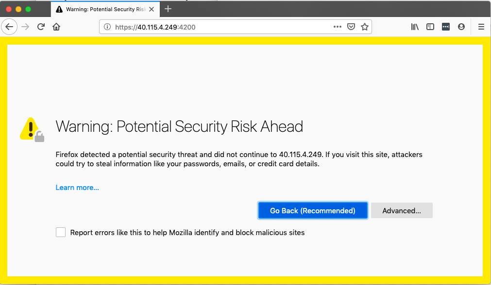

由于使用了自签名证书，浏览器会显示警告

1.  在我们的情况下，这不是问题；我们知道原因——它是自签名证书。因此，点击**高级...**按钮，然后选择接受风险并继续。现在，你将被重定向到登录页面。使用你的用户名和密码登录：

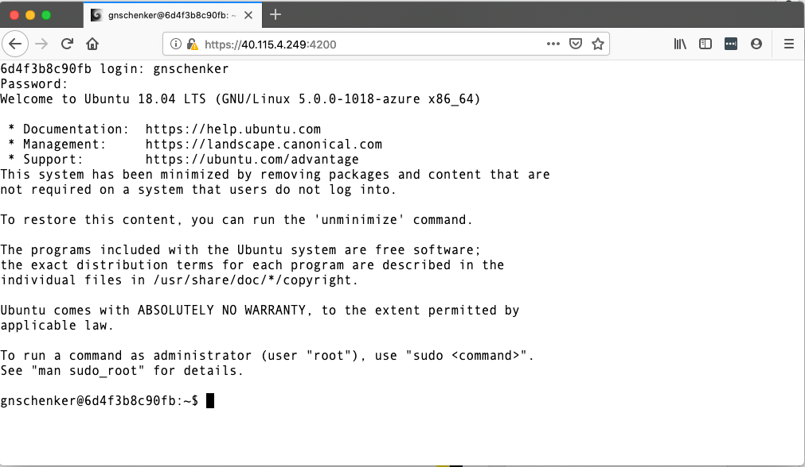

使用 HTTPS 通过浏览器登录远程虚拟机

我们已通过 HTTPS 协议登录到在远程虚拟机上运行的**Shell in a Box**应用程序。

1.  现在，我们完全可以访问，例如，从主机虚拟机映射到`/usr/src/dev`的文件和文件夹。我们可以使用`vi`文本编辑器来创建和编辑文件，尽管我们需要先通过以下命令安装 vi：

```
$ sudo apt-get update && sudo apt-get install -y vim
```

1.  可能性几乎是无穷无尽的。请尝试使用这个设置。例如，可以运行带有 Docker 套接字挂载的 Shell in a Box 容器，在容器内安装 Docker，然后尝试从容器内使用 Docker CLI。这真的很酷，因为你可以通过浏览器完成所有这些操作！

1.  如果你打算经常使用这个 Shell in a Box 容器，并且需要安装一些额外的软件，别犹豫，创建一个继承自`sspreitzer/shellinabox`的自定义 Docker 镜像吧。

接下来，我们将看到如何在容器内运行你的开发环境。

# 在容器内运行你的开发环境

假设你只有一台安装了 Docker for Desktop 的工作站，但无法对这台工作站进行任何其他修改或安装软件。现在，你想做一些概念验证，并使用 Python 编写一个示例应用程序。不幸的是，你的电脑上没有安装 Python。你该怎么办？如果你可以在一个容器内运行完整的开发环境，包括代码编辑器和调试器呢？而且，同时你还能将代码文件保存在主机上呢？

容器是非常强大的，聪明的工程师们为这种问题设计了完美的解决方案。

让我们试试这个 Python 应用：

1.  我们将使用 Visual Studio Code——我们最喜欢的代码编辑器——来展示如何在容器内运行完整的 Python 开发环境。不过，首先我们需要安装必要的 Visual Studio Code 扩展。打开 Visual Studio Code 并安装名为 Remote Development 的扩展：

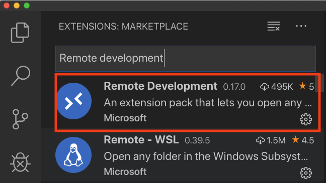

Visual Studio Code 的远程开发扩展

1.  然后，点击 Visual Studio Code 窗口左下角绿色的快速操作状态栏项。在弹出的菜单中，选择 **Remote-Containers: Open Folder in Container...**：

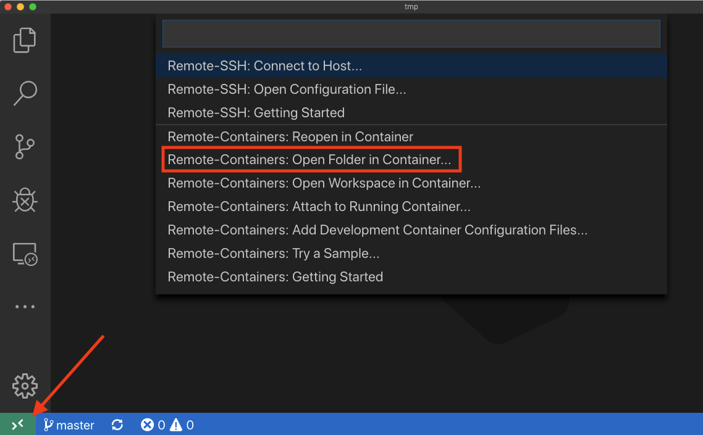

在远程容器中打开项目

1.  在容器中选择你想要工作的项目文件夹。在我们的例子中，我们选择了 `~/fod/ch08/remote-app` 文件夹。Visual Studio Code 将开始准备环境，而第一次准备时可能需要几分钟时间。你会看到类似如下的消息：

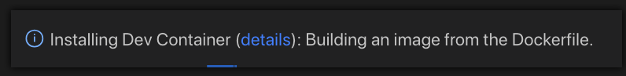

Visual Studio Code 准备开发容器

默认情况下，这个开发容器以非 root 用户身份运行——在我们的例子中是 `python` 用户。我们在前一部分学到，这是一种强烈推荐的最佳实践。不过，你也可以修改配置，以 `root` 用户身份运行，方法是注释掉 `.devcontainer/devcontainer.json` 文件中的这一行：`"runArgs": [ "-u", "python" ],`。

1.  在 Visual Studio Code 中，按 *Shift* + *Ctrl* + *`* 打开终端，并使用 `env FLASK_APP=main.py flask run` 命令运行 Flask 应用。你应该会看到类似如下的输出：

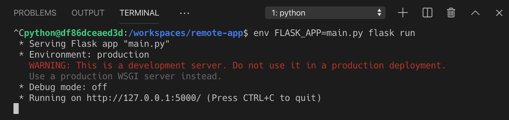

在容器内运行 Visual Studio Code 中的 Python Flask 应用

`python@df86dceaed3d:/workspaces/remote-app$` 提示符表示我们**并没有**直接在 Docker 主机上运行，而是从 Visual Studio Code 为我们启动的开发容器内运行。Visual Studio Code 的远程部分本身也运行在该容器内，只有 Visual Studio Code 的客户端部分——即用户界面——继续在主机上运行。

1.  按 *Shift+Ctrl+`* 打开另一个终端窗口，然后使用 `curl` 测试应用：

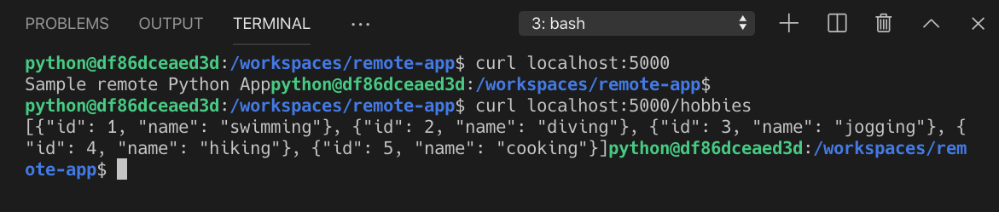

测试远程 Flask 应用

1.  按 *Ctrl* + *C* 停止 Flask 应用。

1.  我们也可以像在主机上工作时一样调试应用。打开 `.vscode/launch.json` 文件，了解 Flask 应用是如何启动的以及调试器是如何附加的。

1.  打开 `main.py` 文件，并在 `home()` 函数的 `return` 语句处设置断点。

1.  然后，切换到 Visual Studio Code 的调试视图，并确保下拉菜单中选择了启动任务 `Python: Flask`。

1.  接下来，按绿色的启动箭头开始调试。终端中的输出应该像这样：

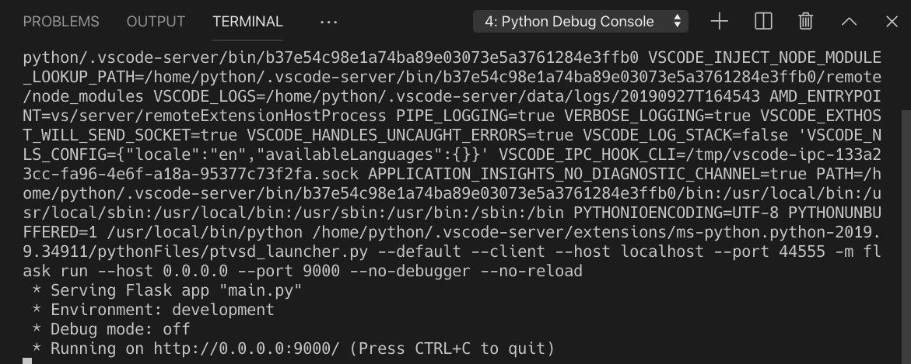

开始调试在容器中运行的远程应用程序

1.  打开另一个终端，按 *Shift* + *Ctrl* + *`* 并通过运行 `curl localhost:9000/` 命令来测试应用程序。调试器应该会命中断点，你可以开始分析：

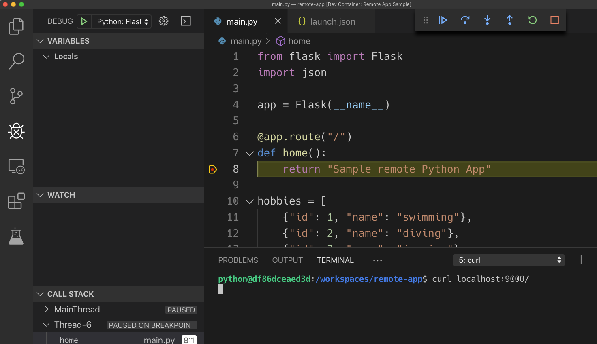

在容器内运行的 Visual Studio Code 中逐行调试

我不能过于强调这有多酷。Visual Studio Code 的后台（非 UI 部分）在容器内运行，Python、Python 调试器和 Python Flask 应用程序本身也是如此。同时，源代码从主机挂载到容器中，Visual Studio Code 的 UI 部分也运行在主机上。这为开发人员在最受限的工作站上打开了无限的可能性。你可以对所有流行的编程语言和框架做同样的操作，例如 .NET、C#、Java、Go、Node.js 和 Ruby。如果某种语言默认不支持，你可以自己创建一个开发容器，这样就能像我们展示的 Python 一样工作。

如果你正在使用没有安装 Docker Desktop 的工作站，并且该工作站的权限更加严格，你有哪些选择？

# 在远程容器中运行代码编辑器并通过 HTTPS 访问

在本节中，我们将展示如何使用 Visual Studio Code 在容器内启用远程开发。当你在工作站上有限制时，这会非常有用。让我们按照以下步骤操作：

1.  下载并解压最新版本的 `code-server`。你可以通过访问 [`github.com/cdr/code-server/releases/latest`](https://github.com/cdr/code-server/releases/latest) 来查找 URL。写本文时，版本是 `1.1156-vsc1.33.1`：

```
$ VERSION=<version>
$ wget https://github.com/cdr/code-server/releases/download/${VERSION}/code-server${VERSION}-linux-x64.tar.gz
$ tar -xvzf code-server${VERSION}-linux-x64.tar.gz
```

确保将`<version>`替换为你特定的版本。

1.  导航到解压后的二进制文件所在文件夹，使其可执行，并启动它：

```
$ cd code-server${VERSION}-linux-x64
$ chmod +x ./code-server
$ sudo ./code-server -p 4200
```

输出应该类似于以下内容：

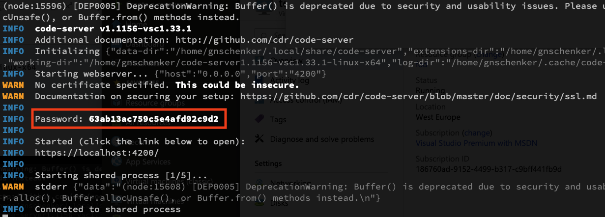

在远程虚拟机上启动 Visual Studio Code 远程服务器

Code Server 使用自签名证书来确保通信安全，因此我们可以通过 HTTPS 访问它。请确保记下屏幕上的 `Password` 输出，因为你在通过浏览器访问 Code Server 时需要它。还要注意，我们使用端口 `4200` 来在主机上公开 Code Server，原因是我们已经为虚拟机打开了该端口。你当然可以选择任何端口，只需确保为该端口开放入口流量。

1.  打开一个新的浏览器页面，访问 `https://<public IP>:4200`，其中 `<public IP>` 是你虚拟机的公共 IP 地址。由于我们再次使用了自签名证书，浏览器会显示类似于本章前面使用 Shell in a Box 时的警告。接受该警告后，你将被重定向到 Code Server 的登录页面：

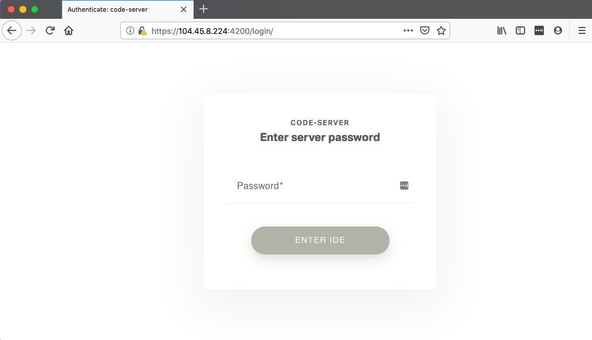

Code Server 的登录页面

1.  输入你之前记下的密码并点击 ENTER IDE。现在你可以通过浏览器远程使用 Visual Studio Code，连接是安全的 HTTPS 连接：

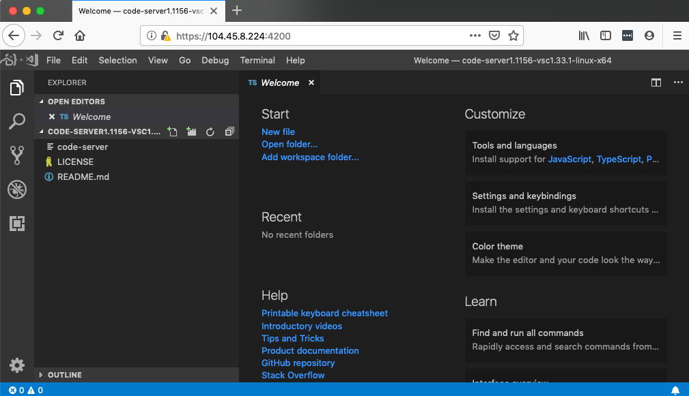

在浏览器中通过 HTTPS 运行的 Visual Studio Code

1.  现在你可以从任何地方进行开发，例如使用 Chromebook 或受限的工作站，毫无任何限制。但等一下，你现在可能会问！这和容器有什么关系？你说得对——到目前为止，确实没有涉及容器。不过，我可以说，如果你的远程虚拟机已安装 Docker，那么你可以使用 Code Server 进行任何与容器相关的开发，那样我就能解决问题了。但那样回答会太简单了。

1.  让我们在容器中运行 Code Server。这个应该不难吧？尝试使用这个命令，将内部端口`8080`映射到主机端口`4200`，并将包含 Code Server 设置和可能的项目的主机文件夹挂载到容器中：

```
$ docker container run -it \
 -p 4200:8080 \
 -v "${HOME}/.local/share/code-server:/home/coder/.local/share/code-server" \
 -v "$PWD:/home/coder/project" \
 codercom/code-server:v2
```

请注意，前面的命令在输出中显示 Code Server 以不安全模式运行：

```
info Server listening on http://0.0.0.0:8080
info - No authentication
info - Not serving HTTPS
```

1.  现在你可以通过浏览器访问 Visual Studio Code，网址为`http://<public IP>:4200`。请注意网址中的`HTTP`，而不是`HTTPS`！类似于在远程虚拟机上本地运行 Code Server，你现在可以直接在浏览器中使用 Visual Studio Code：

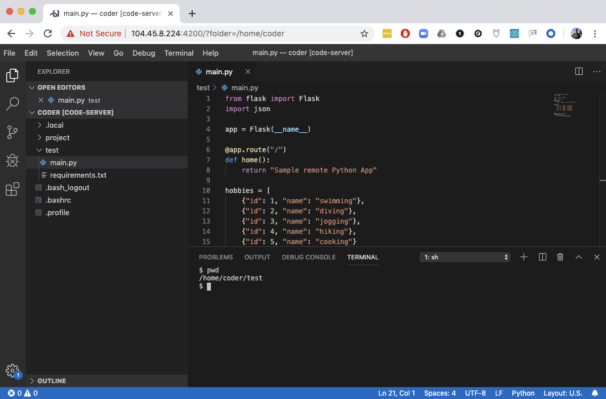

在浏览器中进行开发

有了这个，希望你已经感受到容器的使用为你提供的几乎无限的可能性。

# 总结

在本章中，我们展示了一些高级 Docker 用户的技巧和窍门，可以让你的工作更加高效。我们还展示了如何利用容器提供整套开发环境，这些环境运行在远程服务器上，并且可以通过安全的 HTTPS 连接从浏览器中访问。

在下一章中，我们将介绍分布式应用架构的概念，并讨论成功运行分布式应用所需的各种模式和最佳实践。此外，我们还将列出在生产环境或类似生产环境中运行此类应用所需满足的一些关切。

# 问题

1.  列出你希望将完整的开发环境运行在容器中的原因。

1.  为什么你应该避免以 `root` 用户身份在容器内运行应用程序？

1.  为什么你会将 Docker 套接字绑定挂载到容器中？

1.  当你清理 Docker 资源以释放空间时，为什么需要特别小心地处理卷？

# 深入阅读

+   使用 Docker 中的 Docker，参考[`jpetazzo.github.io/2015/09/03/do-not-use-docker-in-docker-for-ci/`](http://jpetazzo.github.io/2015/09/03/do-not-use-docker-in-docker-for-ci/)

+   Shell in a Box，参考[`github.com/shellinabox/shellinabox`](https://github.com/shellinabox/shellinabox)

+   使用 SSH 进行远程开发，详情请见[`code.visualstudio.com/docs/remote/ssh`](https://code.visualstudio.com/docs/remote/ssh)

+   在容器内进行开发，详情请见[`code.visualstudio.com/docs/remote/containers`](https://code.visualstudio.com/docs/remote/containers)
