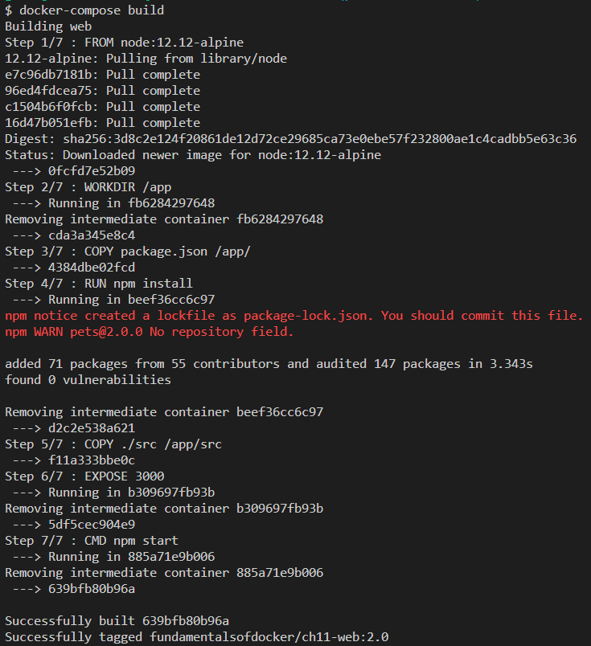
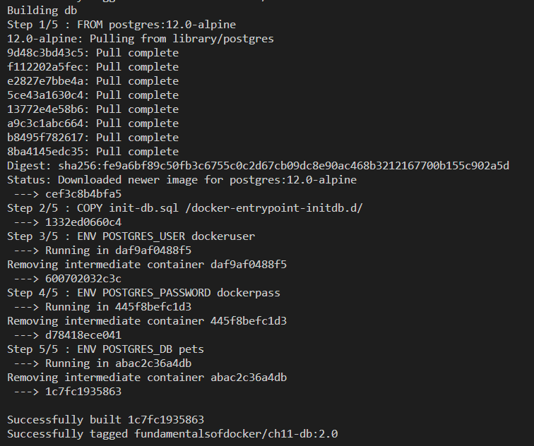
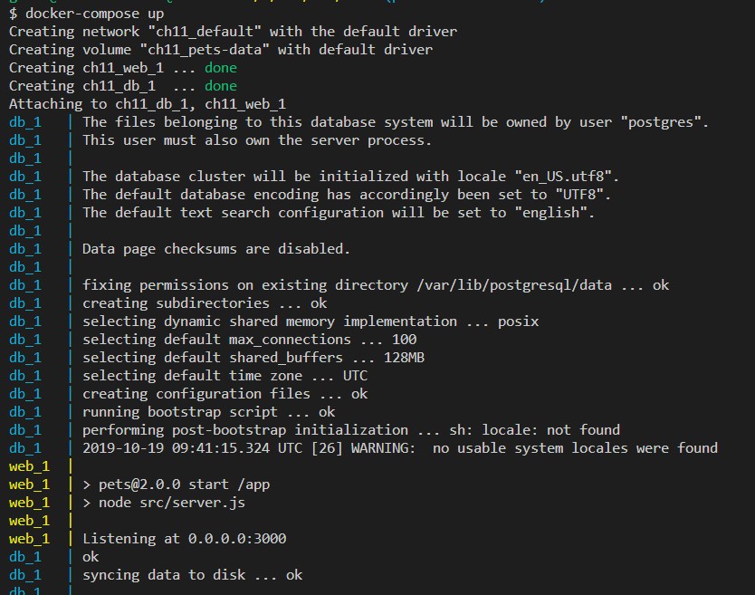
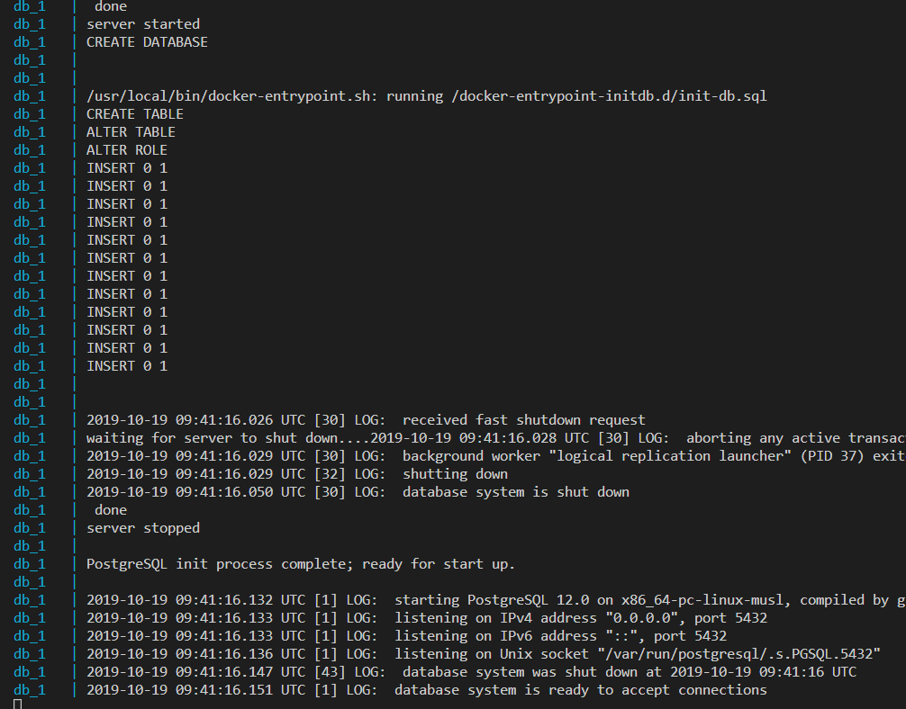
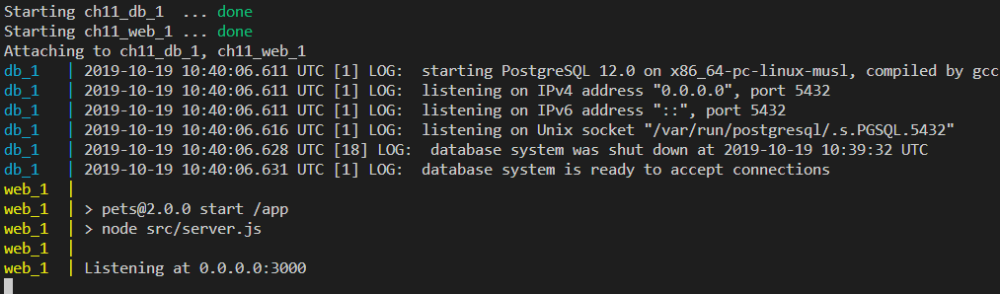
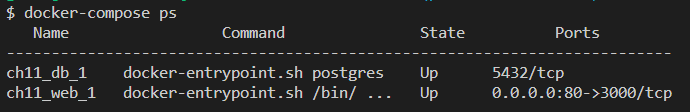
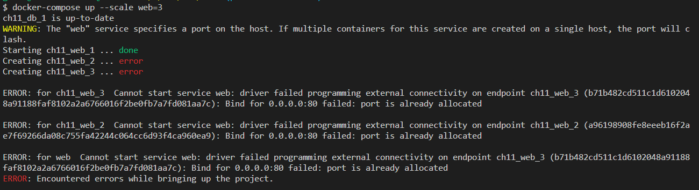
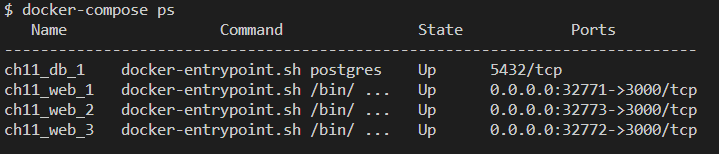
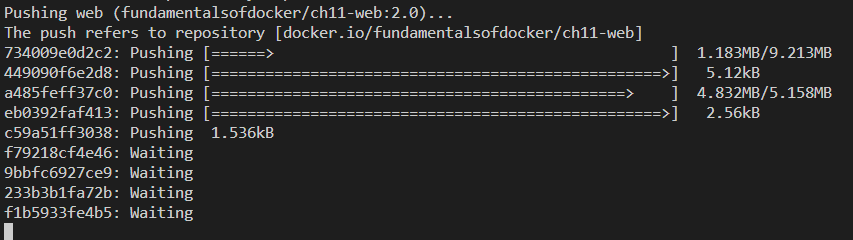

# 第十二章：Docker Compose

在上一章中，我们学习了容器网络在单一 Docker 主机上的工作原理。我们介绍了**容器网络模型**（**CNM**），它构成了 Docker 容器之间所有网络通信的基础，随后我们深入探讨了 CNM 的不同实现方式，特别是桥接网络。最后，我们介绍了 Traefik，一种反向代理，用于在容器之间启用复杂的 HTTP 应用级路由。

本章介绍了由多个服务组成的应用程序的概念，每个服务都运行在一个容器中，并且 Docker Compose 如何通过声明式方法轻松构建、运行和扩展这样的应用程序。

本章包含以下内容：

+   解密声明式与命令式的区别

+   运行多服务应用程序

+   扩展服务

+   构建并推送应用程序

+   使用 Docker Compose 重写设置

完成本章后，读者将能够做到以下几点：

+   简短地用几句话解释命令式和声明式方法在定义和运行应用程序时的主要区别

+   用他们自己的话描述容器与 Docker Compose 服务之间的区别

+   为一个简单的多服务应用程序编写 Docker Compose YAML 文件

+   使用 Docker Compose 构建、推送、部署并拆除一个简单的多服务应用程序

+   使用 Docker Compose 扩展应用程序服务的规模

+   使用重写设置定义特定环境的 Docker Compose 文件

# 技术要求

本章的代码可以在此处找到：[`github.com/PacktPublishing/Learn-Docker---Fundamentals-of-Docker-19.x-Second-Edition/tree/master/ch11`](https://github.com/PacktPublishing/Learn-Docker---Fundamentals-of-Docker-19.x-Second-Edition/tree/master/ch11)。

你需要在系统上安装 `docker-compose`。如果你已经在 Windows 或 macOS 计算机上安装了 Docker for Desktop 或 Docker Toolbox，通常会自动安装它。否则，你可以在此处找到详细的安装说明：[`docs.docker.com/compose/install/`](https://docs.docker.com/compose/install/)

# 解密声明式与命令式的区别

Docker Compose 是 Docker 提供的一个工具，主要用于在单个 Docker 主机上运行和协调容器。包括但不限于开发、**持续集成**（**CI**）、自动化测试、手动 QA 或演示。

Docker Compose 使用格式为 YAML 的文件作为输入。默认情况下，Docker Compose 期望这些文件命名为 `docker-compose.yml`，但也可以使用其他名称。`docker-compose.yml` 的内容被认为是描述和运行一个容器化应用程序的*声明式*方式，该应用程序可能由多个容器组成。

那么，*声明式的含义是什么？*

首先，*声明式*是*命令式*的反义词。嗯，这样并没有帮助太多。既然我介绍了另一个定义，我需要解释一下这两个词：

+   **命令式：**这是一种我们可以通过指定系统必须遵循的确切过程来解决问题的方法。

如果我以命令式的方式告诉一个系统（比如 Docker 守护进程）如何运行应用程序，那就意味着我必须一步步描述系统需要做什么，以及如果发生一些意外情况，系统应该如何反应。我必须非常明确和精确地给出指示。我需要涵盖所有边界情况以及如何处理它们。

+   **声明式：**这是一种我们可以在不要求程序员指定必须遵循的确切过程的情况下解决问题的方法。

声明式方法意味着我告诉 Docker 引擎我希望应用程序的期望状态是什么，它必须自行弄清楚如何实现这个期望的状态，以及如果系统偏离这个状态，如何进行调整。

Docker 明确推荐在处理容器化应用程序时使用声明式方法。因此，Docker Compose 工具采用了这种方法。

# 运行多服务应用

在大多数情况下，应用程序并不只由一个单一的整体块组成，而是由几个协同工作的应用程序服务组成。当使用 Docker 容器时，每个应用程序服务都会在自己的容器中运行。当我们想要运行这样的多服务应用时，当然可以使用著名的`docker container run`命令启动所有参与的容器，而在前面的章节中我们也做过这种操作。但这充其量是低效的。通过 Docker Compose 工具，我们可以以声明式的方式在一个使用 YAML 格式的文件中定义应用程序。

让我们看一下一个简单的`docker-compose.yml`文件的内容：

```
version: "2.4"
services:
 web:
    image: fundamentalsofdocker/ch11-web:2.0
    build: web
    ports:
    - 80:3000
 db:
    image: fundamentalsofdocker/ch11-db:2.0
    build: db
    volumes:
    - pets-data:/var/lib/postgresql/data

volumes:
 pets-data:
```

文件中的各行解释如下：

+   `version`：在这一行中，我们指定了要使用的 Docker Compose 格式版本。在写作时，这是版本 2.4。

+   `services`：在这一部分，我们在`services`块中指定组成我们应用程序的服务。在我们的示例中，我们有两个应用程序服务，分别命名为`web`和`db`：

+   `web`：`web`服务使用的镜像名为`fundamentalsofdocker/ch11-web:2.0`，如果镜像尚未缓存，则会从`web`文件夹中的`Dockerfile`构建。该服务还将容器端口`3000`映射到主机端口`80`。

+   `db`：另一方面，`db`服务使用的镜像名称是`fundamentalsofdocker/ch11-db:2.0`，这是一个定制的 PostgreSQL 数据库。再一次，如果镜像还不在缓存中，它会从`db`文件夹中的`Dockerfile`构建。我们将一个名为`pets-data`的卷挂载到`db`服务的容器中。

+   `volumes`：任何服务使用的卷必须在这一部分声明。在我们的示例中，这是文件的最后一部分。应用程序第一次运行时，Docker 将创建一个名为 `pets-data` 的卷，然后在随后的运行中，如果该卷仍然存在，它将被重用。这对于应用程序因某些原因崩溃并需要重启时非常重要。此时，之前的数据仍然存在，并准备好供重新启动的数据库服务使用。

请注意，我们正在使用 Docker Compose 文件语法的 2.x 版本。这个版本是针对部署在单个 Docker 主机上的应用程序的。同时，还有 Docker Compose 文件语法的 3.x 版本。这个版本用于定义面向 Docker Swarm 或 Kubernetes 的应用程序。我们将在第十二章中详细讨论*调度器*。

# 使用 Docker Compose 构建镜像

进入 `fods` 文件夹下的 `ch11` 子文件夹，然后构建镜像：

```
$ cd ~/fod/ch11
$ docker-compose build
```

如果我们输入前面的命令，那么工具会假设当前目录下必须有一个名为 `docker-compose.yml` 的文件，并将使用这个文件来运行。在我们的情况下，确实如此，工具将构建镜像。

在您的终端窗口中，您应该看到类似于以下的输出：



为 web 服务构建 Docker 镜像

在前面的截图中，您可以看到 `docker-compose` 首先从 Docker Hub 下载基础镜像 `node:12.12-alpine`，这是我们为 web 镜像构建的基础镜像。随后，它使用在 `web` 文件夹中找到的 `Dockerfile` 来构建镜像，并将其命名为 `fundamentalsofdocker/ch11-web:2.0`。但这只是第一部分；输出的第二部分应该类似于以下内容：



为 db 服务构建 Docker 镜像

这里，`docker-compose` 再次从 Docker Hub 拉取基础镜像 `postgres:12.0-alpine`，然后使用在 `db` 文件夹中找到的 `Dockerfile` 来构建我们称为 `fundamentalsofdocker/ch11-db:2.0` 的镜像。

# 使用 Docker Compose 运行应用程序

一旦我们构建了镜像，就可以使用 Docker Compose 启动应用程序：

```
$ docker-compose up
```

输出将显示应用程序的启动情况。我们应该看到以下内容：



运行示例应用程序，第一部分

在输出的第一部分中，我们可以看到 Docker Compose 执行了以下操作：

+   创建一个名为 `ch11_default` 的桥接网络

+   创建一个名为 `ch11_pets-data` 的卷

+   创建两个服务 `ch11_web_1` 和 `ch11_db_1`，并将它们附加到网络上

Docker Compose 还显示了由数据库（蓝色）和 Web 服务（黄色）生成的日志输出，两者都在启动中。输出的倒数第三行显示 Web 服务已准备就绪，并监听在端口 `3000`。请记住，这是容器端口，而不是主机端口。我们已将容器端口 `3000` 映射到主机端口 `80`，这是我们稍后要访问的端口。

现在让我们看看输出的第二部分：



运行示例应用程序，第二部分

我们稍微简化了输出的第二部分。它向我们展示了数据库如何完成初始化。我们可以具体看到我们的初始化脚本 `init-db.sql` 的应用，该脚本定义了一个数据库并用一些数据进行了填充。

现在，我们可以打开一个浏览器标签并导航到 `localhost/animal`。我们应该会看到一只野生动物的图片，这张图片是我在肯尼亚马赛马拉国家公园拍摄的：


浏览器中的示例应用程序

刷新浏览器几次以查看其他猫图片。应用程序从数据库中存储的 12 张图片的集合中随机选择当前图片。

由于应用程序正在交互模式下运行，因此我们运行 Docker Compose 的终端会被阻塞，我们可以通过按下 *Ctrl + C* 来取消应用程序。如果这样做，我们将看到以下结果：

```
^CGracefully stopping... (press Ctrl+C again to force)
Stopping ch11_web_1 ... done
Stopping ch11_db_1 ... done
```

我们会注意到数据库和 Web 服务立即停止。不过，有时某些服务可能需要约 10 秒钟才会停止。原因是数据库和 Web 服务监听并响应 Docker 发送的 `SIGTERM` 信号，而其他服务可能不会，因此 Docker 在预定义的 10 秒超时间隔后会强制终止它们。

如果我们使用 `docker-compose up` 再次运行应用程序，输出将会更短：



Docker Compose up 的输出

这一次，我们不需要下载镜像，数据库也不需要从头开始初始化，而只是重用了上一次运行时已经存在于 `pets-data` 卷中的数据。

我们也可以在后台运行应用程序。所有容器都将作为守护进程运行。为此，我们只需使用 `-d` 参数，如下所示：

```
$ docker-compose up -d
```

Docker Compose 为我们提供了比 `up` 更多的命令。我们可以使用该工具列出所有属于应用程序的服务：



Docker Compose ps 的输出

此命令类似于 `docker container ls`，唯一的区别在于 `docker-compose` 仅列出应用程序的容器或服务。

要停止和清理应用程序，我们使用 `docker-compose down` 命令：

```
$ docker-compose down
Stopping ch11_web_1 ... done
Stopping ch11_db_1 ... done
Removing ch11_web_1 ... done
Removing ch11_db_1 ... done
Removing network ch11_default
```

如果我们还想删除数据库的卷，那么我们可以使用以下命令：

```
$ docker volume rm ch11_pets-data
```

或者，我们可以将`docker-compose down`和`docker volume rm <volume name>`两个命令合并成一个命令：

```
$ docker-compose down -v
```

这里，`-v`（或`--volumes`）参数会删除在`compose`文件的`volumes`部分声明的命名卷和附加到容器的匿名卷。

为什么卷的名称中会有`ch11`前缀？在`docker-compose.yml`文件中，我们将要使用的卷命名为`pets-data`。但是，正如我们之前提到的，Docker Compose 会在所有名称前加上`docker-compose.yml`文件所在父文件夹的名称并加上下划线。在这种情况下，父文件夹名为`ch11`。如果你不喜欢这种方式，可以明确指定项目名称，例如如下所示：

```
$ docker-compose -p my-app up
```

它使用了一个名为 my-app 的项目名称来运行应用程序。

# 扩展服务

现在，让我们假设我们的示例应用程序已经上线并且非常成功，很多人都想查看我们的可爱动物图片。所以现在我们面临一个问题，因为应用程序开始变慢。为了应对这个问题，我们想要运行多个实例的 Web 服务。使用 Docker Compose，这可以轻松实现。

运行更多实例也称为扩展。我们可以使用这个工具将`web`服务扩展到三个实例，例如：

```
$ docker-compose up --scale web=3
```

如果我们这样做，会有一个惊喜。输出会类似于以下屏幕截图：



docker-compose --scale 的输出

Web 服务的第二个和第三个实例未能启动。错误信息告诉我们原因：我们不能多次使用相同的主机端口`80`。当实例 2 和 3 尝试启动时，Docker 发现端口`80`已经被第一个实例占用了。*我们该怎么办呢？* 好吧，我们可以让 Docker 自动决定每个实例使用哪个主机端口。

如果在`compose`文件的`ports`部分中，我们只指定了容器端口而省略了主机端口，那么 Docker 会自动选择一个临时端口。让我们就做这个：

1.  首先，让我们拆解一下这个应用程序：

```
$ docker-compose down
```

1.  然后，我们修改`docker-compose.yml`文件，使其如下所示：

```
version: "2.4"
services:
  web:
    image: fundamentalsofdocker/ch11-web:2.0
    build: web
    ports:
      - 3000
  db:
    image: fundamentalsofdocker/ch11-db:2.0
    build: db
    volumes:
      - pets-data:/var/lib/postgresql/data

volumes:
  pets-data:
```

1.  现在，我们可以重新启动应用程序，并立即进行扩展：

```
$ docker-compose up -d
$ docker-compose up -d --scale web=3
Starting ch11_web_1 ... done
Creating ch11_web_2 ... done
Creating ch11_web_3 ... done
```

1.  如果我们现在执行`docker-compose ps`，应该会看到以下屏幕截图：



docker-compose ps 的输出

1.  如我们所见，每个服务都已分配到不同的主机端口。我们可以尝试检查它们是否工作，例如使用`curl`。让我们测试第三个实例，`ch11_web_3`：

```
$ curl -4 localhost:32772
Pets Demo Application
```

答案是，`Pets Demo Application`，它告诉我们，我们的应用程序确实如预期那样正常工作。为了确认这一点，尝试对另外两个实例进行测试。

# 构建和推送应用程序

我们之前已经看到，我们也可以使用`docker-compose build`命令来仅构建在底层`docker-compose`文件中定义的应用程序镜像。但是为了使其生效，我们需要将构建信息添加到`docker-compose`文件中。在该文件夹中，我们有一个文件`docker-compose.dev.yml`，其中已经添加了这些指令。它基本上是我们迄今为止使用的`docker-compose.yml`文件的副本：

```
version: "2.4"
services:
  web:
    build: web
    image: fundamentalsofdocker/ch11-web:2.0
    ports:
      - 80:3000
  db:
    build: db
    image: fundamentalsofdocker/ch1-db:2.0
    volumes:
      - pets-data:/var/lib/postgresql/data

volumes:
  pets-data:
```

请注意每个服务的`build`键。该键的值表示 Docker 期望在哪里找到`Dockerfile`以构建相应的镜像。如果我们想使用一个名为`Dockerfile-dev`的`Dockerfile`，比如用于`web`服务，那么`docker-compose`文件中的`build`块将如下所示：

```
build:
    context: web
    dockerfile: Dockerfile-dev
```

现在让我们使用那个替代的`docker-compose-dev.yml`文件：

```
$ docker-compose -f docker-compose.dev.yml build
```

`-f`参数将告诉 Docker Compose 应用程序使用哪个`compose`文件。

要将所有镜像推送到 Docker Hub，我们可以使用`docker-compose push`。我们需要登录 Docker Hub 才能成功推送，否则在推送时会遇到身份验证错误。因此，在我的案例中，我执行以下操作：

```
$ docker login -u fundamentalsofdocker -p <password>
```

假设登录成功，我接下来可以推送以下代码：

```
$ docker-compose -f docker-compose.dev.yml push
```

这可能需要一些时间，具体取决于您的互联网连接带宽。在推送时，您的屏幕可能会显示如下：



使用 docker-compose 将镜像推送到 Docker Hub

上述命令将这两个镜像推送到 Docker Hub 上的`fundamentalsofdocker`帐户。您可以通过以下网址找到这两个镜像：[`hub.docker.com/u/fundamentalsofdocker/`](https://hub.docker.com/u/fundamentalsofdocker/)

# 使用 Docker Compose 覆盖设置

有时，我们需要在不同的环境中运行我们的应用程序，这些环境需要特定的配置设置。Docker Compose 提供了一种便捷的功能来解决这个问题。

让我们做一个具体的示例。我们可以定义一个基础的 Docker Compose 文件，然后定义特定环境的覆盖设置。假设我们有一个名为`docker-compose.base.yml`的文件，内容如下：

```
version: "2.4"
services:
  web:
    image: fundamentalsofdocker/ch11-web:2.0
  db:
    image: fundamentalsofdocker/ch11-db:2.0
    volumes:
      - pets-data:/var/lib/postgresql/data

volumes:
  pets-data:
```

这只定义了在所有环境中应该相同的部分。所有特定设置都已被移除。

假设我们暂时想要在 CI 系统中运行我们的示例应用程序，但在那里我们希望为数据库使用不同的设置。我们用来创建数据库镜像的`Dockerfile`看起来是这样的：

```
FROM postgres:12.0-alpine
COPY init-db.sql /docker-entrypoint-initdb.d/
ENV POSTGRES_USER dockeruser
ENV POSTGRES_PASSWORD dockerpass
ENV POSTGRES_DB pets
```

注意我们在第 3 到第 5 行定义的三个环境变量。`web`服务的`Dockerfile`有类似的定义。假设在 CI 系统中，我们想要执行以下操作：

+   从代码构建镜像

+   将`POSTGRES_PASSWORD`定义为`ci-pass`

+   将`web`服务的容器端口`3000`映射到主机端口`5000`

然后，相应的覆盖文件将如下所示：

```
version: "2.4"
services:
  web:
    build: web
    ports:
      - 5000:3000
    environment:
      POSTGRES_PASSWORD: ci-pass
  db:
    build: db
    environment:
      POSTGRES_PASSWORD: ci-pass
```

然后，我们可以使用以下命令运行此应用程序：

```
$ docker-compose -f docker-compose.yml -f docker-compose-ci.yml up -d --build
```

请注意，使用第一个`-f`参数时，我们提供基础 Docker Compose 文件，使用第二个参数时，我们提供覆盖文件。`--build`参数用于强制`docker-compose`重新构建镜像。

使用环境变量时，请注意以下优先级：

+   在 Docker 文件中声明它们会定义默认值

+   在 Docker Compose 文件中声明相同的变量会覆盖 Dockerfile 中的值

如果我们遵循标准命名约定，将基础文件命名为`docker-compose.yml`，并将覆盖文件命名为`docker-compose.override.yml`，那么我们可以通过`docker-compose up -d`启动应用，而无需显式指定 Compose 文件。

# 总结

在本章中，我们介绍了`docker-compose`工具。该工具主要用于在单一 Docker 主机上运行和扩展多服务应用。通常，开发人员和 CI 服务器会使用单一主机，而这两者是 Docker Compose 的主要用户。该工具使用 YAML 文件作为输入，声明性地描述应用程序。

该工具还可用于构建和推送镜像，以及许多其他有用的任务。本章附带的代码可以在`fod/ch11`中找到。

在下一章，我们将介绍**编排器**。编排器是用于在集群中运行和管理容器化应用程序的基础设施软件，同时确保这些应用程序始终处于所需状态。

# 问题

为了评估你的学习进度，请回答以下问题：

1.  你将如何使用`docker-compose`以守护进程模式运行应用？

1.  你将如何使用`docker-compose`显示运行服务的详细信息？

1.  你将如何将某个特定的 web 服务扩展到三个实例？

# 深入阅读

以下链接提供了本章讨论主题的更多信息：

+   官方 YAML 网站：[`www.yaml.org/`](http://www.yaml.org/)

+   Docker Compose 文档：[`dockr.ly/1FL2VQ6`](http://dockr.ly/1FL2VQ6)

+   Compose 文件版本 2 参考：[`dohttps://docs.docker.com/compose/compose-file/compose-file-v2/`](https://docs.docker.com/compose/compose-file/compose-file-v2/)

+   在文件和项目之间共享 Compose 配置：[`docs.docker.com/compose/extends/`](https://docs.docker.com/compose/extends/)
