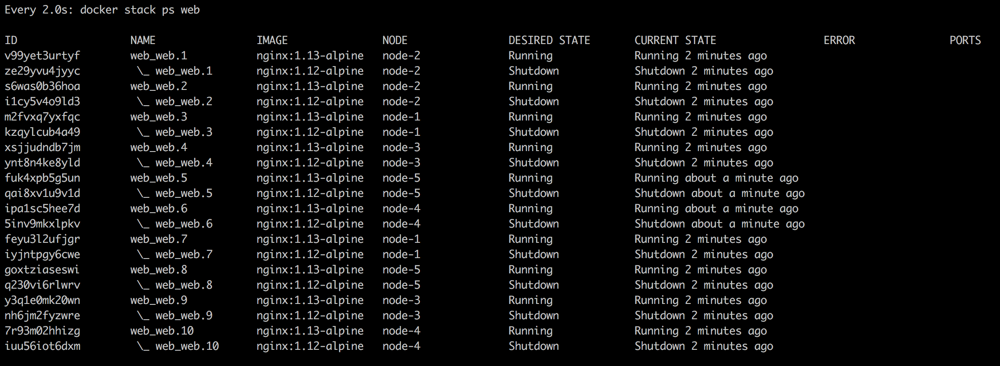

# 第十五章：零停机部署与密钥

在上一章中，我们详细探讨了 Docker Swarm 及其资源。我们学习了如何在本地和云中构建一个高可用的 Swarm 集群。接着，我们深入讨论了 Swarm 服务和堆栈。最后，我们在 Swarm 中创建了服务和堆栈。

本章中，我们将展示如何在不中断服务可用性的情况下，更新运行在 Docker Swarm 中的服务和堆栈。这被称为零停机部署。我们还将介绍 Swarm 密钥，作为一种安全地将敏感信息提供给使用这些密钥的服务容器的方法。

本章将涵盖以下主题：

+   零停机部署

+   在 Swarm 中存储配置数据

+   使用 Docker 密钥保护敏感数据

完成本章后，你将能够完成以下任务：

+   列出两到三种常用的部署策略，用于在不中断服务的情况下更新服务。

+   以批次更新服务而不导致服务中断。

+   定义用于服务回滚的策略，以防更新失败。

+   使用 Docker 配置存储非敏感的配置数据。

+   使用 Docker 密钥与服务配合。

+   更新密钥的值而不导致停机。

# 技术要求

本章的代码文件可以在 GitHub 上找到，网址为[`github.com/PacktPublishing/Learn-Docker---Fundamentals-of-Docker-19.x-Second-Edition`](https://github.com/PacktPublishing/Learn-Docker---Fundamentals-of-Docker-19.x-Second-Edition)。如果你已经按照第二章中提到的步骤克隆了仓库，*设置工作环境*，那么你将会在`~/fod-solution/ch14`找到代码。

# 零停机部署

一个需要频繁更新的关键任务应用程序最重要的一个方面是能够以零停机的方式进行更新。我们称之为零停机部署。在整个过程中，更新的应用程序必须始终保持完全可用。

# 常见的部署策略

有多种方法可以实现这一点，以下是其中一些方法：

+   滚动更新

+   蓝绿部署

+   金丝雀发布

Docker Swarm 开箱即支持滚动更新。其他两种类型的部署需要我们付出额外的努力来实现。

# 滚动更新

在一个关键任务的应用中，每个应用服务都必须以多个副本运行。根据负载，副本数量可能从两三个实例少到几十个、上百个或成千上万个实例。任何时候，我们都希望确保所有服务实例中有明显的多数在运行。因此，如果我们有三个副本，我们希望至少有两个副本始终在运行。如果有 100 个副本，我们也能接受至少有 90 个副本在可用状态。通过这样做，我们可以定义一个副本的批量大小，用来进行升级时的停机。在第一个例子中，批量大小是 1，而在第二个例子中，批量大小是 10。

当我们停机副本时，Docker Swarm 会自动将这些实例从负载均衡池中移除，所有流量将会重新在剩下的活跃实例中进行负载均衡。因此，这些剩余的实例将会经历流量的轻微增加。在下图中，在滚动更新开始之前，如果**任务 A3**想要访问**服务 B**，它可能会被 SwarmKit 负载均衡到**服务 B**的任意三个任务中的一个。一旦滚动更新开始，SwarmKit 会停止**任务 B1**进行更新。此时，这个任务会自动从目标池中移除。所以，如果**任务 A3**现在请求连接**服务 B**，负载均衡只会从剩余的任务中选择，也就是**B2**和**B3**。因此，这两个任务可能会暂时经历更高的负载：


任务 B1 被停机更新

被停止的实例将被等量的新实例替换，这些新实例是应用服务的新版本。一旦新实例启动并运行，我们可以让 Swarm 监控它们一段时间，并确保它们健康。如果一切正常，我们就可以继续进行，停掉下一批实例，并用新版本的实例替换它们。这个过程会重复，直到所有应用服务的实例都被替换。

在下图中，我们可以看到**服务 B**的**任务 B1**已更新至版本 2。**任务 B1**的容器被分配了新的**IP**地址，并且部署到了具有空闲资源的另一工作节点：


滚动更新中，第一批更新的副本

需要理解的是，当一个服务的任务更新时，在大多数情况下，它会被部署到不同于原来所在的工作节点。但只要对应的服务是无状态的，这应该没问题。如果我们有一个有状态的服务，它依赖于位置或节点，并且我们想要更新它，那么我们必须调整方法，但这超出了本书的范围。

现在，让我们看看如何实际指示 Swarm 执行应用服务的滚动更新。当我们在堆栈文件中声明一个服务时，可以定义多个在这个上下文中相关的选项。让我们看一下典型堆栈文件的片段：

```
version: "3.5"
services:
 web:
   image: nginx:alpine
   deploy:
     replicas: 10
     update_config:
       parallelism: 2
       delay: 10s
...
```

在这个片段中，我们可以看到一个部分 `update_config`，其中有 `parallelism` 和 `delay` 属性。`parallelism` 定义了在滚动更新过程中每次更新多少副本。`delay` 定义了 Docker Swarm 在更新每个批次之间等待的时间。在前述示例中，我们有 `10` 个副本，每次更新两个副本，并且在每次成功更新后，Docker Swarm 等待 `10` 秒。

让我们测试一下滚动更新。在 `labs` 文件夹下的 `ch14` 子文件夹中，使用 `stack.yaml` 文件创建一个已配置滚动更新的 web 服务。该服务使用基于 Alpine 的 Nginx 镜像，版本为 `1.12-alpine`。我们将把服务更新到一个更新的版本，即 `1.13-alpine`。

首先，我们将把这个服务部署到我们在 VirtualBox 中本地创建的 swarm 上。让我们来看一下：

1.  首先，我们需要确保终端窗口已配置好，可以访问我们集群中的一个主节点。我们以 leader 节点 `node-1` 为例：

```
$ eval $(docker-machine env node-1)
```

1.  现在，我们可以使用堆栈文件部署服务：

```
$ docker stack deploy -c stack.yaml web
```

前述命令的输出如下所示：


部署 web 堆栈

1.  服务部署完成后，我们可以使用以下命令进行监控：

```
$ watch docker stack ps web
```

我们将看到以下输出：


在 Swarm 中运行的 web 堆栈的 web 服务，包含 10 个副本

如果你在 macOS 上工作，需要确保已安装 watch 工具。可以使用 `brew install watch` 命令进行安装。

上述命令将持续更新输出，并为我们提供滚动更新过程中发生的事情的良好概览。

现在，我们需要打开第二个终端，并为我们的 swarm 的管理节点配置远程访问。完成这些后，我们可以执行 `docker` 命令，它将更新堆栈中 `web` 服务的镜像，也叫做 `web`：

```
$ docker service update --image nginx:1.13-alpine web_web
```

前述命令输出如下，显示了滚动更新的进度：


显示滚动更新进度的屏幕

前述输出表示，前两批，每批两个任务，已经成功，并且第三批正在准备中。

在第一个终端窗口中，我们应该能看到 Docker Swarm 如何以 `10` 秒的间隔逐批更新服务。第一批更新后，它应该像下面的截图一样：


Docker Swarm 服务的滚动更新

在上面的截图中，我们可以看到第一批两个任务（`8` 和 `9`）已经更新。Docker Swarm 正在等待`10 秒`后继续执行下一批任务。

有趣的是，在这个特定的案例中，SwarmKit 将任务的新版本部署到与旧版本相同的节点上。这是偶然发生的，因为我们有五个节点，每个节点上有两个任务。SwarmKit 总是尽力平衡各个节点的负载。所以，当 SwarmKit 终止一个任务时，相应的节点的负载会比其他节点小，因此新实例会被调度到该节点上。通常，你不能指望在同一个节点上找到任务的新实例。你可以通过删除堆栈（使用`docker stack rm web`）并将副本数改为七个，然后重新部署和更新来亲自试一下。

一旦所有任务更新完成，`docker stack ps web`命令的输出将类似于下面的截图：



所有任务已成功更新

请注意，SwarmKit 不会立即从相应的节点删除旧版本任务的容器。这是有道理的，因为我们可能希望，例如，检索这些容器的日志以进行调试，或者我们可能希望使用`docker container inspect`检索它们的元数据。SwarmKit 会保留最近终止的四个任务实例，在清除更旧的任务之前，确保不会让未使用的资源堵塞系统。

我们可以使用`--update-order`参数指示 Docker 在停止旧容器之前先启动新容器副本。这可以提高应用程序的可用性。有效值为`"start-first"`和`"stop-first"`，后者是默认值。

一旦完成，我们可以使用以下命令来销毁堆栈：

```
$ docker stack rm web
```

尽管使用堆栈文件定义和部署应用程序是推荐的最佳实践，但我们也可以在服务`create`语句中定义更新行为。如果我们只想部署一个单独的服务，这可能是更优的做法。让我们看一下这样的`create`命令：

```
$ docker service create --name web \
 --replicas 10 \
 --update-parallelism 2 \
 --update-delay 10s \
 nginx:alpine
```

这个命令定义了与前面的堆栈文件相同的期望状态。我们希望服务以`10`个副本运行，并希望以每次两个任务的批次进行滚动更新，连续批次之间的间隔为 10 秒。

# 健康检查

为了做出明智的决策，例如，在 Swarm 服务的滚动更新过程中，判断刚安装的新一批服务实例是否运行正常，或者是否需要回滚，SwarmKit 需要一种方式来了解系统的整体健康状况。仅靠 SwarmKit（和 Docker）可以收集到大量信息，但也有其局限性。试想，一个包含应用程序的容器。从外部看，容器可能看起来完全健康，运行得很好。但这并不一定意味着容器内部运行的应用程序也一样好。应用程序可能例如处于无限循环中或处于损坏状态，但仍然在运行。然而，只要应用程序在运行，容器也在运行，从外部看，一切都完美无缺。

因此，SwarmKit 提供了一个接口，我们可以在其中为其提供一些帮助。我们，作为在 Swarm 中容器内部运行的应用服务的作者，最清楚我们的服务是否处于健康状态。SwarmKit 让我们有机会定义一个命令，该命令会针对我们的应用服务执行健康检查。这个命令具体做什么对 Swarm 并不重要；它只需要返回`OK`、`NOT OK`或`time out`。后两种情况，即`NOT OK`或`timeout`，会告诉 SwarmKit 它正在检查的任务可能是不健康的。

在这里，我故意这么写，稍后我们会看到原因：

```
FROM alpine:3.6
...
HEALTHCHECK --interval=30s \
    --timeout=10s
    --retries=3
    --start-period=60s
    CMD curl -f http://localhost:3000/health || exit 1
...
```

在前面的`Dockerfile`代码片段中，我们可以看到关键字`HEALTHCHECK`。它有几个选项或参数，以及一个实际的命令，也就是`CMD`。让我们来讨论这些选项：

+   `--interval`：定义健康检查之间的等待时间。因此，在我们的例子中，调度器每`30`秒执行一次检查。

+   `--timeout`：此参数定义了如果健康检查没有响应，Docker 等待多长时间才会因超时而报错。在我们的示例中，这是`10`秒。现在，如果某次健康检查失败，SwarmKit 会重试几次，直到放弃并声明相应的任务为不健康，并允许 Docker 终止该任务并用新实例替换它。

+   重试次数由`--retries`参数定义。在前面的代码中，我们希望设置为三次重试。

+   接下来，我们有启动时间。一些容器需要一些时间才能启动（虽然这不是推荐的模式，但有时是不可避免的）。在启动期间，服务实例可能无法响应健康检查。通过启动时间，我们可以定义 SwarmKit 在执行第一次健康检查之前应该等待多长时间，从而为应用程序提供初始化的时间。要定义启动时间，我们使用`--start-period`参数。在我们的例子中，我们在`60`秒后进行第一次检查。启动时间的长短取决于应用程序及其启动行为。建议从相对较小的值开始，如果出现许多假阳性并且任务被多次重启，则可以考虑增加时间间隔。

+   最后，我们在最后一行用`CMD`关键字定义了实际的探测命令。在我们的例子中，我们定义了一个向`localhost`的`/health`端点发送请求的探测命令，端口为`3000`。这个调用预期会有三种可能的结果：

    +   命令成功执行。

    +   命令执行失败。

    +   命令超时。

后两者被 SwarmKit 以相同方式处理。这是编排器告诉我们，相应的任务可能处于不健康状态。我说 *可能* 是有意为之，因为 SwarmKit 并不会立即假设最坏的情况，而是认为这可能只是任务的一个暂时性问题，并且它会从中恢复。这就是为什么我们有`--retries`参数的原因。在这里，我们可以定义 SwarmKit 在认为任务确实不健康之前应该重试多少次，随后它会终止任务并重新调度另一个实例到其他空闲节点上，以便将服务的期望状态恢复。

*为什么我们可以在探测命令中使用 localhost？* 这是一个很好的问题，原因是因为当 SwarmKit 探测在 Swarm 中运行的容器时，它会在容器内部执行这个`探测`命令（也就是说，它做的是类似于`docker container exec <containerID> <probing command>`的操作）。因此，这个命令会在与容器内部运行的应用程序相同的网络命名空间中执行。在下面的图中，我们可以看到一个服务任务从开始到结束的生命周期：


服务任务出现暂时性的健康失败

首先，SwarmKit 会等到启动时间结束才开始探测。然后，我们进行第一次健康检查。不久后，任务在探测时失败。它连续失败了两次，但随后恢复。因此，**健康检查 4**是成功的，SwarmKit 让任务继续运行。

在这里，我们可以看到一个永久失败的任务：


任务的永久失败

我们刚刚学到了如何在服务的 `Dockerfile` 中为其镜像定义健康检查。但这并不是我们唯一可以做到的方式。我们还可以在用于将应用程序部署到 Docker Swarm 的堆栈文件中定义健康检查。以下是一个堆栈文件的简短示例：

```
version: "3.5"
services:
  web:
    image: example/web:1.0
    healthcheck:
      test: ["CMD", "curl", "-f", "http://localhost:3000/health"]
      interval: 30s
      timeout: 10s
      retries: 3
      start_period: 60s
...
```

在前面的代码片段中，我们可以看到健康检查相关的信息是如何在堆栈文件中定义的。首先要意识到的是，每个服务必须单独定义健康检查。应用程序级别或全局级别没有健康检查。

与我们在 `Dockerfile` 中之前定义的类似，SwarmKit 用于执行健康检查的命令是 `curl -f http://localhost:3000/health`。我们还定义了 `interval`、`timeout`、`retries` 和 `start_period`。这四个键值对的含义与我们在 `Dockerfile` 中使用的相同。如果镜像中已经定义了健康检查相关的设置，那么堆栈文件中的设置会覆盖 `Dockerfile` 中的设置。

现在，让我们尝试使用一个已定义健康检查的服务。在我们的 `lab` 文件夹中，有一个名为 `stack-health.yaml` 的文件，内容如下：

```
version: "3.5"
services:
  web:
    image: nginx:alpine
    healthcheck:
      test: ["CMD", "wget", "-qO", "-", "http://localhost"]
      interval: 5s
      timeout: 2s
      retries: 3
      start_period: 15s
```

让我们来部署这个：

```
$ docker stack deploy -c stack-health.yaml myapp
```

我们可以通过 `docker stack ps myapp` 找出单个任务部署的位置。在那个特定的节点上，我们可以列出所有容器，找到我们堆栈中的一个容器。在我的示例中，任务已部署到 `node-3`：


显示正在运行的任务实例的健康状态

这张截图中有趣的是 `STATUS` 列。Docker，或者更准确地说，SwarmKit，已经识别出该服务定义了健康检查功能，并正在使用它来确定服务中每个任务的健康状态。

# 回滚

有时，事情并不如预期那样发展。应用程序发布中的临时修复可能无意中引入了一个新漏洞，或者新版本显著降低了组件的吞吐量，等等。在这种情况下，我们需要有备选计划，通常意味着能够回滚更新到先前的良好版本。

与更新类似，回滚必须以不会导致应用程序中断的方式进行；它需要实现零停机时间。从这个意义上来说，回滚可以看作是一次反向更新。我们安装了一个新版本，但这个新版本实际上是上一个版本。

与更新操作类似，我们可以在堆栈文件或 Docker 服务的 `create` 命令中声明，如果需要执行回滚，系统应该如何处理。在这里，我们使用了之前的堆栈文件，不过这次加入了一些与回滚相关的属性：

```
version: "3.5"
services:
  web:
    image: nginx:1.12-alpine
    ports:
      - 80:80
    deploy:
      replicas: 10
      update_config:
        parallelism: 2
        delay: 10s

        failure_action: rollback
        monitor: 10s

    healthcheck:
      test: ["CMD", "wget", "-qO", "-", "http://localhost"]
      interval: 2s
      timeout: 2s
      retries: 3
      start_period: 2s
```

在这个堆栈文件中，我们定义了滚动更新、健康检查和回滚时的行为，文件在我们的实验室中以 `stack-rollback.yaml` 呈现。健康检查被定义为，在初始等待时间 `2` 秒后，协调器开始每 `2` 秒轮询一次服务（在 `http://localhost` 上），并在考虑任务为不健康之前，重试 `3` 次。

如果我们做一下计算，假设任务由于 bug 导致不健康，那么至少需要 8 秒钟才能停止任务。因此，现在在部署下，我们新增了一个名为 `monitor` 的条目。该条目定义了新部署的任务应该监控多久的健康状态，以及是否继续进行滚动更新中的下一批。在这个示例中，我们设置了 `10` 秒。这个时间比我们计算出来的发现服务故障的 8 秒稍长，因此是合适的。

我们还新增了一个条目，`failure_action`，用于定义在滚动更新过程中如果遇到失败（例如服务不健康）时，协调器将采取什么措施。默认情况下，行动是停止整个更新过程，并将系统保持在中间状态。由于这是滚动更新，系统并没有完全宕机，至少一些健康的服务实例仍然在运行，但操作工程师会更擅长检查并修复问题。

在我们的案例中，我们已经定义了回滚操作。因此，在失败的情况下，SwarmKit 会自动将所有已更新的任务回滚到其先前的版本。

# 蓝绿部署

在第九章《*分布式应用架构*》中，我们以抽象的方式讨论了蓝绿部署是什么。事实证明，在 Docker Swarm 中，我们无法对任意服务实现蓝绿部署。服务发现和负载均衡在 Docker Swarm 中由 Swarm 路由网格处理，不能（轻易地）进行自定义。

如果**服务 A**想调用**服务 B**，那么 Docker 会隐式处理这个过程。Docker 在给定目标服务的名称后，会使用 Docker **DNS** 服务将该名称解析为**虚拟 IP**（**VIP**）地址。当请求指向**VIP**时，Linux **IPVS** 服务会在 Linux 内核的 IP 表中根据**VIP**进行查找，并将请求负载均衡到服务代表的任务之一的物理 IP 地址，如下图所示：


Docker Swarm 中的服务发现和负载均衡工作原理

不幸的是，目前没有简单的方法来拦截这一机制并用自定义行为替代。但这对于实现我们示例中的目标服务**Service B**的真正蓝绿部署是必要的。正如我们将在第十六章《*使用 Kubernetes 部署、更新和保护应用程序*》中看到的那样，Kubernetes 在这一领域更具灵活性。

也就是说，我们始终可以以蓝绿方式部署面向公众的服务。我们可以使用 Interlock 2 及其第七层路由机制来实现真正的蓝绿部署。

# 金丝雀发布

从技术上讲，滚动更新是一种金丝雀发布。但由于缺少可以插入自定义逻辑的“缝隙”，滚动更新只是金丝雀发布的一个非常有限的版本。

真正的金丝雀发布要求我们对更新过程进行更细粒度的控制。此外，真正的金丝雀发布在所有流量都已完全切换到新版本之前，不会停止旧版本的服务。从这个角度来看，它们与蓝绿部署类似。

在金丝雀发布场景中，我们不仅仅希望使用健康检查等指标来决定是否将越来越多的流量引导到新版本的服务中；我们还希望在决策过程中考虑外部输入，例如由日志聚合器收集并汇总的度量数据或追踪信息。一个可以作为决策依据的示例是遵循**服务水平协议**（**SLA**），即如果新版本的服务响应时间超出了容忍范围。这可能发生在我们为现有服务添加新功能时，而这个新功能导致了响应时间的下降。

# 在 Swarm 中存储配置数据

如果我们想要在 Docker Swarm 中存储非敏感数据，如配置文件，我们可以使用 Docker 配置。Docker 配置与我们将在下一节中讨论的 Docker 密钥非常相似。主要的区别在于，配置值在静态存储时没有加密，而密钥则是加密的。Docker 配置只能在 Docker Swarm 中使用，也就是说，它们不能在非 Swarm 开发环境中使用。Docker 配置会直接挂载到容器的文件系统中。配置值可以是字符串或最大为 500 KB 的二进制值。

通过使用 Docker 配置，您可以将配置与 Docker 镜像和容器分离。这样，您的服务可以轻松地根据环境特定的值进行配置。生产 Swarm 环境的配置值与暂存 Swarm 的配置值不同，而暂存 Swarm 的配置值又与开发或集成环境的配置值不同。

我们可以将配置添加到服务中，也可以从正在运行的服务中删除它们。配置甚至可以在 Swarm 中运行的不同服务之间共享。

现在，让我们创建一些 Docker 配置：

1.  首先，我们从一个简单的字符串值开始：

```
$ echo "Hello world" | docker config create hello-config - rrin36epd63pu6w3gqcmlpbz0
```

上述命令创建了名为 `Hello world` 的配置值，并将其用作名为 `hello-config` 的配置输入。该命令的输出是这个新配置在 swarm 中的唯一 `ID`。

1.  让我们看看结果，并使用列表命令来查看：

```
$ docker config ls ID                         NAME           CREATED              UPDATED
rrin36epd63pu6w3gqcmlpbz0  hello-config   About a minute ago   About a minute ago
```

列表命令的输出显示了我们刚刚创建的配置的 `ID` 和 `NAME`，以及其 `CREATED` 和（最后一次）更新时间。但由于配置是非机密的，我们可以做更多的操作，甚至输出配置的内容，如下所示：

```
$ docker config docker config inspect hello-config
[
    {
        "ID": "rrin36epd63pu6w3gqcmlpbz0",
        "Version": {
            "Index": 11
        },
        "CreatedAt": "2019-11-30T07:59:20.6340015Z",
        "UpdatedAt": "2019-11-30T07:59:20.6340015Z",
        "Spec": {
            "Name": "hello-config",
            "Labels": {},
            "Data": "SGVsbG8gd29ybGQK"
        }
    }
]
```

嗯，挺有意思的。在前述 JSON 格式输出的 `Spec` 子节点中，我们看到 `Data` 键的值是 `SGVsbG8gd29ybGQK`。难道我们刚才没有说过配置数据在静态存储时并没有加密吗？事实证明，这个值只是我们字符串的 `base64` 编码，我们可以很容易地验证这一点：

```
$ echo 'SGVsbG8gd29ybGQK' | base64 -d
Hello world
```

到目前为止，一切顺利。

现在，让我们定义一个稍微复杂一点的 Docker 配置。假设我们正在开发一个 Java 应用程序。Java 推荐的将配置数据传递给应用程序的方式是使用所谓的 `properties` 文件。`properties` 文件只是一个包含键值对列表的文本文件。让我们看一下：

1.  让我们创建一个名为 `my-app.properties` 的文件，并添加以下内容：

```
username=pguser
database=products
port=5432
dbhost=postgres.acme.com
```

1.  保存文件并从中创建一个名为 `app.properties` 的 Docker 配置：

```
$ docker config create app.properties ./my-app.properties
2yzl73cg4cwny95hyft7fj80u
```

现在，我们可以使用这个（稍微做作的）命令来获取我们刚创建的配置的明文值：

```
$ docker config inspect app.properties | jq .[].Spec.Data | xargs echo | base64 -d username=pguser
database=products
port=5432
dbhost=postgres.acme.com
```

这正是我们所期望的结果。

1.  现在，让我们创建一个使用前述配置的 Docker 服务。为了简化，我们将使用 nginx 镜像来实现：

```
$ docker service create \
 --name nginx \
 --config source=app.properties,target=/etc/my-app/conf/app.properties,mode=0440 \
 nginx:1.13-alpine

p3f686vinibdhlnrllnspqpr0
overall progress: 1 out of 1 tasks
1/1: running [==================================================>]
verify: Service converged
```

在前面的服务 `create` 命令中，关键部分是包含 `--config` 的那一行。通过这一行，我们告诉 Docker 使用名为 `app.properties` 的配置，并将其作为文件挂载到容器内的 `/etc/my-app/conf/app.properties`。此外，我们希望该文件的权限模式为 `0440`。

让我们看看结果：

```
$ docker service ps nginx
ID            NAME     IMAGE              NODE DESIRED    STATE    CURRENT STATE ...
b8lzzwl3eg6y  nginx.1  nginx:1.13-alpine  node-1  Running  Running 2 minutes ago
```

在前述输出中，我们可以看到服务的唯一实例正在 `node-1` 节点上运行。在这个节点上，我现在可以列出容器以获取 nginx 实例的 `ID`：

```
$ docker container ls
CONTAINER ID   IMAGE               COMMAND                  CREATED         STATUS         PORTS ...
bde33d92cca7   nginx:1.13-alpine   "nginx -g 'daemon of…"   5 minutes ago   Up 5 minutes   80/tcp ...
```

最后，我们可以 `exec` 进入该容器并输出 `/etc/my-app/conf/app.properties` 文件的值：

```
$ docker exec bde33 cat /etc/my-app/conf/app.properties
username=pguser
database=products
port=5432
dbhost=postgres.acme.com
```

没有惊讶，这正是我们所期望的结果。

当然，Docker 配置也可以从 swarm 中删除，但前提是它们没有被使用。如果我们在没有先停止并删除服务的情况下尝试删除我们刚才使用的配置，将会得到以下输出：

```
$ docker config rm app.properties
Error response from daemon: rpc error: code = InvalidArgument desc = config 'app.properties' is in use by the following service: nginx
```

我们收到了一条错误信息，Docker 亲切地告诉我们配置正被名为`nginx`的服务使用。这种行为与我们在使用 Docker 卷时的行为有些相似。

因此，首先我们需要移除服务，然后才能移除配置：

```
$ docker service rm nginx
nginx
$ docker config rm app.properties
app.properties
```

需要再次强调的是，Docker 配置不应存储机密数据，如秘密、密码、访问密钥和密钥机密。

在下一节中，我们将讨论如何处理机密数据。

# 使用 Docker 秘密保护敏感数据

秘密用于以安全的方式处理机密数据。Swarm 秘密在静态和传输过程中都是安全的。也就是说，当在管理节点上创建一个新秘密时，它的值会被加密并存储在 Raft 共识存储中，这就是为什么它在静态时是安全的原因。如果某个服务分配了秘密，那么管理节点会从存储中读取秘密，解密后将其转发给所有请求该秘密的 Swarm 服务实例的容器。由于 Docker Swarm 中的节点间通信使用了 **传输层安全** (**TLS**)，即使秘密值被解密，它在传输中仍然是安全的。管理节点仅将秘密转发给服务实例所在的工作节点。然后，秘密作为文件挂载到目标容器中。每个秘密对应一个文件，秘密的名称将是容器内部的文件名，秘密的值则是该文件的内容。秘密从不存储在工作节点的文件系统中，而是通过 `tmpFS` 挂载到容器中。默认情况下，秘密挂载到容器中的 `/run/secrets`，但你可以将其更改为任何自定义文件夹。

需要注意的是，Windows 节点上不会对秘密进行加密，因为没有类似 `tmpfs` 的概念。为了达到与 Linux 节点相同的安全级别，管理员应该加密相应 Windows 节点的磁盘。

# 创建秘密

首先，让我们来看一下如何实际创建一个秘密：

```
$ echo "sample secret value" | docker secret create sample-secret - 
```

该命令创建一个名为 `sample-secret` 的秘密，其值为 `sample secret value`。请注意 `docker secret create` 命令末尾的连字符。这意味着 Docker 期望从标准输入中获取秘密的值。这正是我们通过将 `sample secret value` 值传输到 `create` 命令中所做的。

另外，我们可以使用文件作为秘密值的来源：

```
$ docker secret create other-secret ~/my-secrets/secret-value.txt
```

在这里，名为 `other-secret` 的秘密的值是从一个名为 `~/my-secrets/secret-value.txt` 的文件中读取的。一旦创建了一个秘密，就无法访问它的值。例如，我们可以列出所有秘密以获取以下输出：


所有机密的列表

在这个列表中，我们只能看到秘密的 `ID` 和 `NAME`，以及其他一些元数据，但秘密的实际值是不可见的。我们还可以对一个秘密使用 `inspect` 命令，例如，获取有关 `other-secret` 的更多信息：


检查 Swarm 秘密

即便如此，我们也无法获取到密钥的值。这当然是有意为之：密钥就是密钥，需要保持机密。如果需要，我们可以为密钥分配标签，并且如果 Docker 默认的密钥加解密方式不合适，我们还可以使用不同的驱动来加密和解密密钥。

# 使用密钥

密钥是由在集群中运行的服务使用的。通常，密钥会在服务创建时分配给该服务。因此，如果我们想运行一个名为`web`的服务并分配给它一个密钥，比如`api-secret-key`，语法如下：

```
$ docker service create --name web \
 --secret api-secret-key \
 --publish 8000:8000 \
 fundamentalsofdocker/whoami:latest
```

这个命令基于`fundamentalsofdocker/whoami:latest`镜像创建一个名为`web`的服务，将容器端口`8000`映射到所有集群节点上的`8000`端口，并为其分配名为`api-secret-key`的密钥。

只有当名为`api-secret-key`的密钥在集群中被定义时，这个命令才会生效；否则，会生成一个错误信息，内容为`secret not found: api-secret-key`。因此，我们现在来创建这个密钥：

```
$ echo "my secret key" | docker secret create api-secret-key -
```

现在，如果我们重新运行服务`create`命令，它将成功执行：


创建一个带密钥的服务

现在，我们可以使用`docker service ps web`来查找唯一的服务实例在哪个节点上部署，然后`exec`进入该容器。在我的情况下，该实例已经部署到`node-3`，所以我需要通过`SSH`进入该节点：

```
$ docker-machine ssh node-3
```

然后，我列出该节点上的所有容器，找到属于我的服务的那个实例，并复制它的`container ID`。接着，我们可以运行以下命令，确保密钥确实在容器中以预期的文件名存在，并且文件内容是明文的密钥值：

```
$ docker exec -it <container ID> cat /run/secrets/api-secret-key
```

再次说明，在我的情况下，命令如下：


容器如何看到密钥

如果由于某些原因，Docker 将密钥挂载到容器中的默认位置不符合你的需求，你可以定义一个自定义位置。在以下命令中，我们将密钥挂载到`/app/my-secrets`：

```
$ docker service create --name web \
 --name web \
 -p 8000:8000 \
 --secret source=api-secret-key,target=/run/my-secrets/api-secret-key \
 fundamentalsofdocker/whoami:latest
```

在这个命令中，我们使用扩展语法来定义一个包含目标文件夹的密钥。

# 在开发环境中模拟密钥

在开发时，我们通常在本地机器上没有一个集群。但密钥只在集群中有效。那么，*我们该怎么办*？幸运的是，答案非常简单。由于密钥被当作文件处理，我们可以轻松地将包含密钥的卷挂载到容器中预期的位置，默认位置是`/run/secrets`。

假设我们在本地工作站上有一个名为`./dev-secrets`的文件夹。对于每个密钥，我们有一个与密钥名称相同的文件，文件内容是该密钥的未加密值。例如，我们可以通过在工作站上执行以下命令来模拟一个名为`demo-secret`的密钥，密钥值为`demo secret value`：

```
$ echo "demo secret value" > ./dev-secrets/sample-secret
```

然后，我们可以创建一个挂载该文件夹的容器，方法如下：

```
$ docker container run -d --name whoami \
 -p 8000:8000 \
 -v $(pwd)/dev-secrets:/run/secrets \
 fundamentalsofdocker/whoami:latest
```

容器内运行的进程将无法区分这些挂载的文件和来自机密的文件。例如，`demo-secret`作为一个名为`/run/secrets/demo-secret`的文件存在于容器中，并具有预期的值`demo secret value`。我们将在以下步骤中更详细地了解这一点：

1.  为了测试这一点，我们可以在前面的容器中执行一个 shell：

```
$ docker container exec -it whoami /bin/bash
```

1.  现在，我们可以导航到`/run/secrets`文件夹并显示`demo-secret`文件的内容：

```
/# cd /run/secrets
/# cat demo-secret
demo secret value
```

接下来，我们将查看机密和遗留应用程序。

# 机密和遗留应用程序

有时，我们想要将一个遗留应用程序容器化，这个应用程序我们不能轻易更改，或者不想更改。这个遗留应用程序可能期望一个机密值作为环境变量提供。*我们现在该如何处理呢？* Docker 将机密呈现为文件，但应用程序期望以环境变量的形式获取这些机密。

在这种情况下，定义一个在容器启动时运行的脚本是很有帮助的（所谓的入口点或启动脚本）。该脚本将从相应的文件中读取机密值，并定义一个与文件同名的环境变量，将新变量赋值为从文件中读取的值。对于一个名为`demo-secret`的机密，其值应以名为`DEMO_SECRET`的环境变量的形式提供，那么启动脚本中的必要代码片段可能如下所示：

```
export DEMO_SECRET=$(cat /run/secrets/demo-secret)
```

类似地，假设我们有一个遗留应用程序，它期望机密值作为`/app/bin`文件夹中的 YAML 配置文件中的一个条目，该文件名为`app.config`，其相关部分如下所示：

```
...

secrets:
  demo-secret: "<<demo-secret-value>>"
  other-secret: "<<other-secret-value>>"
  yet-another-secret: "<<yet-another-secret-value>>"
...
```

我们的初始化脚本现在需要从`secret`文件中读取机密值，并将配置文件中相应的占位符替换为`secret`值。对于`demo-secret`，它可能如下所示：

```
file=/app/bin/app.conf
demo_secret=$(cat /run/secret/demo-secret)
sed -i "s/<<demo-secret-value>>/$demo_secret/g" "$file"
```

在前面的代码片段中，我们使用了`sed`工具来将占位符替换为实际值。我们可以对配置文件中的另外两个机密使用相同的技巧。

我们将所有初始化逻辑放入一个名为`entrypoint.sh`的文件中，并使该文件具有可执行权限，并将其添加到容器文件系统的根目录中。然后，我们在`Dockerfile`中将该文件定义为`ENTRYPOINT`，或者我们可以在`docker container run`命令中覆盖镜像的现有`ENTRYPOINT`。

让我们做一个示例。假设我们有一个在`fundamentalsofdocker/whoami:latest`镜像定义的容器中运行的遗留应用程序，该应用程序期望一个名为`db_password`的机密定义在应用程序文件夹中的`whoami.conf`文件中。让我们来看一下这些步骤：

1.  我们可以在本地机器上定义一个文件`whoami.conf`，其中包含以下内容：

```
database:
  name: demo
  db_password: "<<db_password_value>>"
others:
  val1=123
  val2="hello world"
```

重要的部分是这个片段的第 3 行。它定义了启动脚本需要将机密值放置的位置。

1.  让我们向本地文件夹中添加一个名为`entrypoint.sh`的文件，文件内容如下：

```
file=/app/whoami.conf
db_pwd=$(cat /run/secret/db-password)
sed -i "s/<<db_password_value>>/$db_pwd/g" "$file"

/app/http
```

前面脚本中的最后一行来自于原始`Dockerfile`中使用的启动命令。

1.  现在，将该文件的权限更改为可执行：

```
$ sudo chmod +x ./entrypoint.sh
```

现在，我们定义一个继承自`fundamentalsofdocker/whoami:latest`镜像的`Dockerfile`。

1.  向当前文件夹添加一个名为`Dockerfile`的文件，文件内容如下：

```
FROM fundamentalsofdocker/whoami:latest
COPY ./whoami.conf /app/
COPY ./entrypoint.sh /
CMD ["/entrypoint.sh"]
```

1.  让我们从这个`Dockerfile`构建镜像：

```
$ docker image build -t secrets-demo:1.0 .
```

1.  一旦镜像构建完成，我们就可以从中运行服务。但在此之前，我们需要在 Swarm 中定义机密：

```
$ echo "passw0rD123" | docker secret create demo-secret -
```

1.  现在，我们可以创建一个使用以下机密的服务：

```
$ docker service create --name demo \
 --secret demo-secret \
 secrets-demo:1.0
```

# 更新机密

有时，我们需要在运行中的服务中更新机密，因为机密可能已经泄露到公共环境或被恶意人员（如黑客）窃取。在这种情况下，我们需要更改我们的机密数据，因为一旦它泄露给不可信实体，它就必须被视为不安全的。

像任何其他更新一样，更新机密必须以零停机时间的方式进行。Docker SwarmKit 在这方面提供了支持。

首先，我们在 Swarm 中创建了一个新的机密。建议在执行此操作时使用版本控制策略。在我们的示例中，我们将版本作为机密名称的后缀。我们最初使用的机密名为`db-password`，而现在此机密的新版本名为`db-password-v2`：

```
$ echo "newPassw0rD" | docker secret create db-password-v2 -
```

假设原始使用该机密的服务是这样创建的：

```
$ docker service create --name web \
 --publish 80:80
 --secret db-password
 nginx:alpine
```

容器内运行的应用能够访问`/run/secrets/db-password`中的机密信息。现在，SwarmKit 不允许我们更新正在运行的服务中的现有机密，因此我们必须删除现已过时的机密版本，然后添加新的机密。让我们首先使用以下命令进行删除：

```
$ docker service update --secret-rm db-password web
```

现在，我们可以使用以下命令添加新的机密：

```
$ docker service update \
 --secret-add source=db-password-v2,target=db-password \
 web
```

请注意`--secret-add`的扩展语法，其中包含`source`和`target`参数。

# 总结

在本章中，我们了解了 SwarmKit 如何允许我们在不需要停机的情况下更新服务。我们还讨论了 SwarmKit 在零停机部署方面的当前限制。在本章的第二部分，我们介绍了机密作为一种以高度安全的方式向服务提供机密数据的方法。

在下一章中，我们将介绍当前最流行的容器编排工具 Kubernetes。我们将讨论用于在 Kubernetes 集群中定义和运行分布式、弹性、强健且高度可用的应用的对象。此外，本章还将帮助我们熟悉 MiniKube，这是一个用于在本地部署 Kubernetes 应用的工具，并展示 Kubernetes 与 Docker for macOS 和 Docker for Windows 的集成。

# 问题

为了评估你对本章讨论主题的理解，请回答以下问题：

1.  用几句话向一位对技术不太熟悉的外行解释什么是零停机时间部署。

1.  SwarmKit 如何实现零停机时间部署？

1.  与传统（非容器化）系统不同，为什么 Docker Swarm 中的回滚操作能顺利进行？请用几句话简要解释。

1.  描述 Docker secret 的两到三种特性。

1.  你需要推出一个新版本的`inventory`服务。你的命令应该是什么样的？以下是一些额外信息：

    +   新的镜像名为`acme/inventory:2.1`。

    +   我们希望使用滚动更新策略，每批任务的大小为两个任务。

    +   我们希望系统在每批任务执行完后等待一分钟。

1.  你需要通过 Docker secret 更新一个名为`inventory`的现有服务，新的密码通过一个名为`MYSQL_PASSWORD_V2`的 Docker secret 提供。服务中的代码期望这个 secret 名为`MYSQL_PASSWORD`。更新命令应该是什么样的？（请注意，我们不希望更改服务的代码！）

# 进一步阅读

下面是一些外部资源的链接：

+   对服务应用滚动更新，见[`dockr.ly/2HfGjlD`](https://dockr.ly/2HfGjlD)

+   使用 Docker secrets 管理敏感数据，见[`dockr.ly/2vUNbuH`](https://dockr.ly/2vUNbuH)

+   介绍 Docker secrets 管理，见[`dockr.ly/2k7zwzE`](https://dockr.ly/2k7zwzE)

+   从环境变量到 Docker secrets，见[`bit.ly/2GY3UUB`](https://bit.ly/2GY3UUB)
