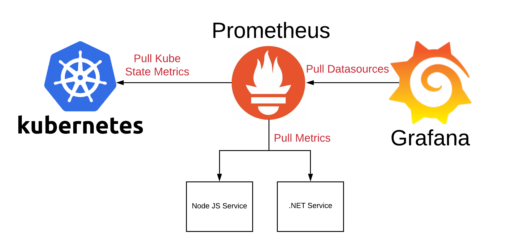
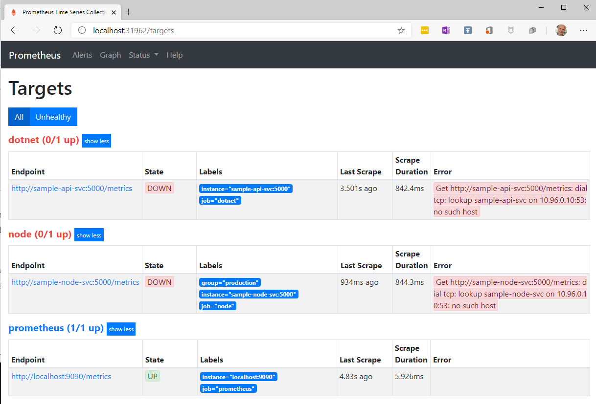
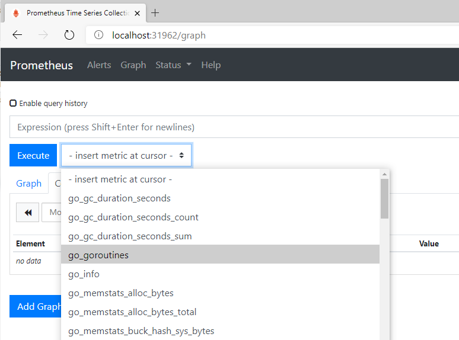
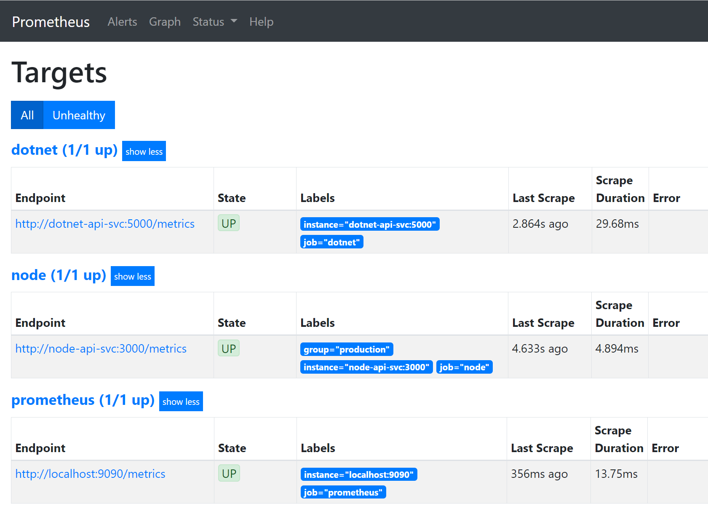
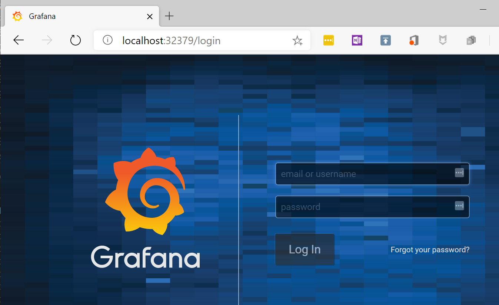
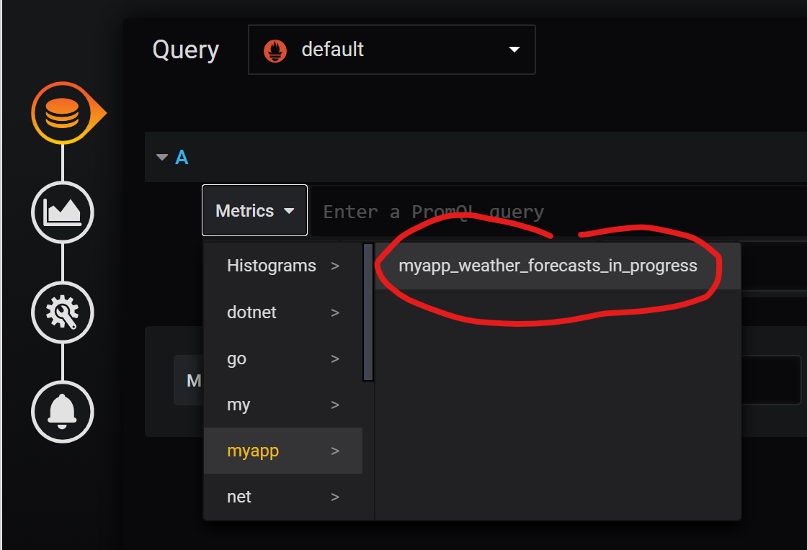
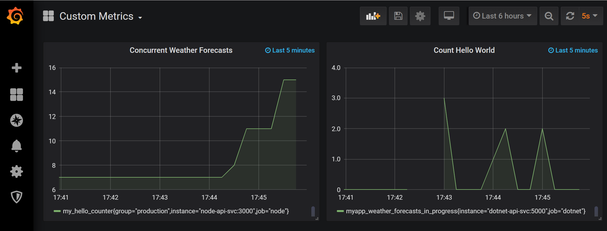

# 第十八章：生产环境中应用的监控与故障排除

在上一章中，我们学习了如何将一个多服务应用部署到 Kubernetes 集群中。我们为该应用配置了应用级路由，并使用零停机策略更新了其服务。最后，我们通过 Kubernetes Secrets 向运行中的服务提供了机密数据。

本章中，你将学习如何监控单个服务或运行在 Kubernetes 集群上的整个分布式应用。你还将学习如何在不更改集群或服务运行所在节点的情况下，故障排除生产环境中运行的应用服务。

本章涵盖以下主题：

+   监控单个服务

+   使用 Prometheus 监控你的分布式应用

+   生产环境中服务的故障排除

完成本章内容后，你将能够做到以下几点：

+   配置服务的应用级监控。

+   使用 Prometheus 收集并集中聚合相关的应用度量。

+   使用专门的工具容器故障排除生产环境中运行的服务。

# 技术要求

本章中，我们将在本地计算机上使用 Minikube。有关如何安装和使用 Minikube 的更多信息，请参见第二章，*设置工作环境*。

本章的代码可以在以下网址找到：[`github.com/PacktPublishing/Learn-Docker---Fundamentals-of-Docker-19.x-Second-Edition/tree/master/ch17`](https://github.com/PacktPublishing/Learn-Docker---Fundamentals-of-Docker-19.x-Second-Edition/tree/master/ch17)[.](https://github.com/fundamentalsofdocker/labs/tree/2nd-edition/ch16/probes)

请确保你已按照第二章，*设置工作环境*中描述的方法克隆了 GitHub 仓库。

在终端中，导航到`~/fod/ch17`文件夹。

# 监控单个服务

在生产环境或任何类似生产的环境中使用分布式关键任务应用时，获得尽可能多的应用内部工作情况的洞察至关重要。你有没有机会查看过飞机的驾驶舱或核电站的指挥中心？飞机和核电站都是高度复杂的系统，提供关键任务服务。如果飞机坠毁或核电站突然停运，至少会影响很多人。因此，驾驶舱和指挥中心充满了仪器，显示系统某部分的当前或过去状态。你看到的就是一些传感器的视觉表示，这些传感器被放置在系统的战略位置，不断收集诸如温度或流量等数据。

类似于飞机或发电厂，我们的应用程序需要通过“传感器”进行监控，这些传感器能够感知我们应用程序服务的“温度”或它们运行的基础设施的状态。我将“温度”加上双引号，因为它只是一个占位符，代表在应用程序中重要的事情，例如某个 RESTful 端点每秒的请求数，或请求到同一端点的平均延迟。

我们收集到的结果值或读数，例如请求的平均延迟，通常被称为指标。我们的目标应该是暴露尽可能多的应用程序服务的有意义指标。指标可以是功能性和非功能性的。功能性指标是那些对应用程序服务的业务相关性有描述的值，例如在电子商务应用程序中每分钟进行的结账次数，或者在流媒体应用程序中过去 24 小时内最受欢迎的五首歌曲。

非功能性指标是一些不特定于应用程序业务类型的关键值，例如某个特定网页请求的平均延迟是多少，或者每分钟某个端点返回多少个`4xx`状态码，或者某个服务使用了多少 RAM 或多少 CPU 周期。

在一个分布式系统中，每个部分都暴露指标时，应该有一个统一的服务定期从每个组件收集并汇总这些值。或者，允许每个组件将其指标转发到一个中央指标服务器。只有当我们高度分布式系统中所有组件的指标都可以在一个中央位置检查时，这些指标才有价值。否则，监控系统将变得不可能。因此，飞机的飞行员在飞行过程中不需要亲自检查飞机的各个关键部件；所有必要的读数都会收集并显示在驾驶舱里。

今天，最流行的用于暴露、收集和存储指标的服务之一是 Prometheus。它是一个开源项目，已经捐赠给**云原生计算基金会**(**CNCF**)。Prometheus 与 Docker 容器、Kubernetes 以及许多其他系统和编程平台有着一流的集成。在本章中，我们将使用 Prometheus 演示如何监控一个暴露重要指标的简单服务。

# 对基于 Node.js 的服务进行监控

本节中，我们将学习如何通过以下步骤对用 Node Express.js 编写的微服务进行监控：

1.  创建一个名为`node`的新文件夹，并进入该文件夹：

```
$ mkdir node && cd node
```

1.  在此文件夹中运行`npm init`，并接受所有默认设置，除了**入口点**，将其从默认的`index.js`更改为`server.js`。

1.  我们需要通过以下方式将`express`添加到我们的项目中：

```
$ npm install --save express
```

1.  现在，我们需要通过以下方式为 Node Express 安装 Prometheus 适配器：

```
$ npm install --save prom-client 
```

1.  向该文件夹添加一个名为 `server.js` 的文件，内容如下：

```
const app = require("express")();

app.get('/hello', (req, res) => {
  const { name = 'World' } = req.query;
  res.json({ message: `Hello, ${name}!` });
});

app.listen(port=3000, () => {
  console.log(`Example api is listening on http://localhost:3000`);
}); 
```

这是一个非常简单的 Node Express 应用，只有一个端点：`/hello`。

1.  在前面的代码中，添加以下代码片段来初始化 Prometheus 客户端：

```
const client = require("prom-client");
const register = client.register;
const collectDefaultMetrics = client.collectDefaultMetrics;
collectDefaultMetrics({ register });
```

1.  接下来，添加一个端点来暴露这些指标：

```
app.get('/metrics', (req, res) => {
  res.set('Content-Type', register.contentType);
  res.end(register.metrics());
});
```

1.  现在让我们运行这个示例微服务：

```
$ npm start

> node@1.0.0 start C:\Users\Gabriel\fod\ch17\node
> node server.js

Example api is listening on http://localhost:3000
```

我们可以在前面的输出中看到服务正在 `3000` 端口监听。

1.  现在让我们尝试访问我们在代码中定义的 `/metrics` 端点的指标：

```
$ curl localhost:3000/metrics
...
process_cpu_user_seconds_total 0.016 1577633206532

# HELP process_cpu_system_seconds_total Total system CPU time spent in seconds.
# TYPE process_cpu_system_seconds_total counter
process_cpu_system_seconds_total 0.015 1577633206532

# HELP process_cpu_seconds_total Total user and system CPU time spent in seconds.
# TYPE process_cpu_seconds_total counter
process_cpu_seconds_total 0.031 1577633206532
...
nodejs_version_info{version="v10.15.3",major="10",minor="15",patch="3"} 1
```

我们得到的输出是一长串指标，准备供 Prometheus 服务器使用。

这挺简单的，不是吗？通过添加一个节点包并在应用程序启动时添加几行简单的代码，我们就获得了大量的系统指标。

现在让我们定义我们自己的自定义指标。它将是一个 `Counter` 对象：

1.  将以下代码片段添加到 `server.js` 中，定义一个名为 `my_hello_counter` 的自定义计数器：

```
const helloCounter = new client.Counter({ 
  name: 'my_hello_counter', 
  help: 'Counts the number of hello requests',
});
```

1.  在现有的 `/hello` 端点中，添加代码以增加计数器：

```
app.get('/hello', (req, res) => {
  helloCounter.inc();
  const { name = 'World' } = req.query;
  res.json({ message: `Hello, ${name}!` });
});
```

1.  使用 `npm start` 重新运行应用程序。

1.  为了测试新的计数器，让我们访问 `/hello` 端点两次：

```
$ curl localhost:3000/hello?name=Sue
```

1.  访问 `/metrics` 端点时，我们将获得以下输出：

```
$ curl localhost:3000/metrics

...
# HELP my_hello_counter Counts the number of hello requests 
# TYPE my_hello_counter counter
my_hello_counter 2
```

我们在代码中定义的计数器显然起作用了，并且输出了我们添加的 `HELP` 文本。

现在我们知道如何为 Node Express 应用进行监控了，让我们为基于 .NET Core 的微服务做同样的事情。

# 对基于 .NET Core 的服务进行监控

让我们从创建一个基于 Web API 模板的简单 .NET Core 微服务开始。

1.  创建一个新的 `dotnet` 文件夹，并进入该文件夹：

```
$ mkdir dotnet && cd dotnet
```

1.  使用 `dotnet` 工具生成一个新的微服务，名为 `sample-api`：

```
$ dotnet new webapi --output sample-api
```

1.  我们将使用 Prometheus 的 .NET 适配器，它作为一个 NuGet 包 `prometheus-net.AspNetCore` 提供。使用以下命令将此包添加到 `sample-api` 项目中：

```
$ dotnet add sample-api package prometheus-net.AspNetCore
```

1.  打开项目到你喜欢的代码编辑器中；例如，当使用 VS Code 时，执行以下命令：

```
$ code .
```

1.  找到 `Startup.cs` 文件并打开它。在文件开头，添加一个 `using` 语句：

```
using Prometheus; 
```

1.  然后在 `Configure` 方法中，将 `endpoints.MapMetrics()` 语句添加到端点映射中。你的代码应该如下所示：

```
public void Configure(IApplicationBuilder app, IWebHostEnvironment env)
{
    ...
    app.UseEndpoints(endpoints =>
    {
        endpoints.MapControllers();
        endpoints.MapMetrics();
    });
}
```

请注意，以上内容适用于 .NET Core 版本 3.x。如果你使用的是早期版本，配置会稍有不同。有关更多详细信息，请查看以下仓库：[`github.com/prometheus-net/prometheus-net.`](https://github.com/prometheus-net/prometheus-net)

1.  有了这个，Prometheus 组件将开始发布 ASP.NET Core 的请求指标。我们来试试。首先，使用以下命令启动应用：

```
$ dotnet run --project sample-api

info: Microsoft.Hosting.Lifetime[0]
 Now listening on: https://localhost:5001 
info: Microsoft.Hosting.Lifetime[0]
 Now listening on: http://localhost:5000 
...
```

前面的输出告诉我们微服务正在 `https://localhost:5001` 上监听。

1.  我们现在可以使用 `curl` 调用服务的指标端点：

```
$ curl --insecure https://localhost:5001/metrics 

# HELP process_private_memory_bytes Process private memory size
# TYPE process_private_memory_bytes gauge
process_private_memory_bytes 55619584
# HELP process_virtual_memory_bytes Virtual memory size in bytes. 
# TYPE process_virtual_memory_bytes gauge
process_virtual_memory_bytes 2221930053632
# HELP process_working_set_bytes Process working set
# TYPE process_working_set_bytes gauge
process_working_set_bytes 105537536
...
dotnet_collection_count_total{generation="1"} 0
dotnet_collection_count_total{generation="0"} 0
dotnet_collection_count_total{generation="2"} 0
```

我们得到的是微服务的系统指标列表。很简单：我们只需要添加一个 NuGet 包和一行代码，就可以让我们的服务进行监控！

如果我们想要添加自定义的（功能性）指标呢？这同样简单。假设我们想要衡量对 `/weatherforecast` 端点的并发访问次数。为此，我们定义一个 `gauge`，并用它来包装该端点中适当的逻辑。我们可以按照以下步骤来完成：

1.  定位到 `Controllers/WeatherForecastController.cs` 类。

1.  在文件顶部添加 `using Prometheus;`。

1.  在 `WeatherForecastController` 类中定义一个 `Gauge` 类型的私有实例变量：

```
private static readonly Gauge weatherForecastsInProgress = Metrics
    .CreateGauge("myapp_weather_forecasts_in_progress", 
                 "Number of weather forecast operations ongoing.");
```

1.  用 `using` 语句包装 `Get` 方法的逻辑：

```
[HttpGet]
public IEnumerable<WeatherForecast> Get()
{
    using(weatherForecastsInProgress.TrackInProgress())
 {
...
 }
}
```

1.  重启微服务。

1.  使用 `curl` 多次调用 `/weatherforecast` 端点：

```
$ curl --insecure https://localhost:5001/weatherforecast
```

1.  使用 `curl` 获取指标，方法与本节前面相同：

```
$ curl --insecure https://localhost:5001/metrics 

# HELP myapp_weather_forecasts_in_progress Number of weather forecast operations ongoing.
# TYPE myapp_weather_forecasts_in_progress gauge
myapp_weather_forecasts_in_progress 0
...
```

你会注意到，现在列表中有一个名为 `myapp_weather_forecasts_in_progress` 的新指标。它的值为零，因为目前你并没有对跟踪的端点发出任何请求，且 `gauge` 类型的指标仅测量正在进行的请求数。

恭喜，你刚刚定义了你的第一个功能性指标。这只是一个开始，许多更复杂的可能性已经触手可及。

基于 Node.js 或 .NET Core 的应用服务并不特别。用其他语言编写的服务，比如 Java、Python 或 Go，也可以同样简单直接地进行监控。

在学习了如何对应用服务进行监控并暴露重要指标之后，让我们看一下如何使用 Prometheus 收集并聚合这些值，从而使我们能够监控分布式应用程序。

# 使用 Prometheus 监控分布式应用

现在我们已经学会了如何对应用服务进行监控并暴露 Prometheus 指标，接下来是展示如何收集这些指标并将它们转发到 Prometheus 服务器，在那里所有指标将被汇总和存储。然后我们可以使用 Prometheus 的（简单）Web UI，或者像 Grafana 这样的更复杂的解决方案，在仪表板上展示重要的指标。

与大多数用于从应用服务和基础设施组件收集指标的工具不同，Prometheus 服务器承担了工作负载，并定期抓取所有定义的目标。这样，应用程序和服务就无需担心转发数据。你也可以把这描述为拉取指标而非推送指标。这使得 Prometheus 服务器非常适合我们的案例。

我们现在将讨论如何将 Prometheus 部署到 Kubernetes，然后是我们的两个示例应用服务。最后，我们将把 Grafana 部署到集群中，并使用它在仪表板上展示我们的客户指标。

# 架构

让我们快速了解一下计划系统的架构。如前所述，我们有微服务、Prometheus 服务器和 Grafana。此外，所有内容都将部署到 Kubernetes 上。下图展示了它们之间的关系：



使用 Prometheus 和 Grafana 进行监控的应用程序高级概述

在图表的顶部中央，我们有 Prometheus，它定期从 Kubernetes 中抓取指标，显示在左侧。它还定期从服务中抓取指标，在我们的例子中是从我们在前一部分创建并加了监控的 Node.js 和.NET 示例服务中抓取。最后，在图表的右侧，我们有 Grafana，它定期从 Prometheus 中拉取数据，然后在图形化的仪表板上展示出来。

# 将 Prometheus 部署到 Kubernetes 中

如前所述，我们首先将 Prometheus 部署到 Kubernetes 中。让我们首先定义一个 Kubernetes YAML 文件，用来进行部署。首先，我们需要定义一个 Kubernetes `Deployment`，它将创建一个 Prometheus 服务器实例的`ReplicaSet`，然后我们将定义一个 Kubernetes 服务来暴露 Prometheus，以便我们可以从浏览器标签中访问它，或者 Grafana 可以访问它。让我们开始：

1.  创建一个`ch17/kube`文件夹，并进入该文件夹：

```
$ mkdir -p ~/fod/ch17/kube && cd ~/fod/ch17/kube
```

1.  在此文件夹中添加一个名为`prometheus.yaml`的文件。

1.  将以下代码片段添加到此文件中；它定义了 Prometheus 的`Deployment`：

```
apiVersion: apps/v1
kind: Deployment
metadata:
  name: prometheus-deployment
  labels:
    app: prometheus
    purpose: monitoring-demo
spec:
  replicas: 2
  selector:
    matchLabels:
      app: prometheus
      purpose: monitoring-demo
  template:
    metadata:
      labels:
        app: prometheus
        purpose: monitoring-demo
    spec:
      containers:
      - name: prometheus
        image: prom/prometheus
        volumeMounts:
          - name: config-volume
            mountPath: /etc/prometheus/prometheus.yml
            subPath: prometheus.yml
        ports:
        - containerPort: 9090
      volumes:
        - name: config-volume
          configMap:
           name: prometheus-cm
```

我们正在定义一个副本集，包含两个 Prometheus 实例。每个实例都被分配了两个标签：`app: prometheus`和`purpose: monitoring-demo`，用于标识。关键部分在于容器规格中的`volumeMounts`。在这里，我们将一个名为`prometheus-cm`的 Kubernetes `ConfigMap`对象（它包含 Prometheus 的配置）挂载到容器中，挂载到 Prometheus 期望其配置文件的位置。`ConfigMap`类型的卷在上面的代码片段最后四行定义。

请注意，我们稍后将定义`config`映射。

1.  现在，让我们定义 Prometheus 的 Kubernetes 服务。将这个片段追加到文件中：

```
---
kind: Service
apiVersion: v1
metadata:
  name: prometheus-svc
spec:
  type: NodePort
  selector:
    app: prometheus
    purpose: monitoring-demo
  ports:
  - name: promui
    protocol: TCP
    port: 9090
    targetPort: 9090
```

请注意，代码片段开头的三个破折号（`---`）用于分隔 YAML 文件中各个对象的定义。

我们将服务命名为`prometheus-svc`，并将其设置为`NodePort`（而不是`ClusterIP`类型的服务），这样就可以从主机访问 Prometheus 的 Web UI。

1.  现在，我们可以为 Prometheus 定义一个简单的配置文件。这个文件基本上指示 Prometheus 服务器从哪些服务抓取指标，以及抓取的频率。首先，创建一个`ch17/kube/config`文件夹：

```
$ mkdir -p ~/fod/ch17/kube/config
```

1.  请在最后一个文件夹中添加一个名为`prometheus.yml`的文件，并在其中添加以下内容：

```
scrape_configs:
    - job_name: 'prometheus'
      scrape_interval: 5s
      static_configs:
        - targets: ['localhost:9090']

    - job_name: dotnet
      scrape_interval: 5s
      static_configs:
        - targets: ['dotnet-api-svc:5000']

    - job_name: node
      scrape_interval: 5s
      static_configs:
        - targets: ['node-api-svc:3000']
          labels:
            group: 'production'
```

在前面的文件中，我们为 Prometheus 定义了三个任务：

+   +   第一个名为`prometheus`的抓取任务每 5 秒从 Prometheus 服务器自身抓取一次指标。它从`localhost:9090`目标中找到这些指标。请注意，默认情况下，指标应该暴露在`/metrics`端点。

    +   第二个任务叫做 `dotnet`，它从位于 `dotnet-api-svc:5000` 的服务中抓取指标，这将是我们之前定义并做了监控的 .NET Core 服务。

    +   最后，第三个任务对我们的 Node 服务执行相同的操作。请注意，我们还为该任务添加了一个 `group: 'production'` 标签。这允许对任务或任务进行进一步分组。

1.  现在我们可以使用以下命令在 Kubernetes 集群中定义 `ConfigMap` 对象。进入 `ch17/kube` 文件夹并执行以下命令：

```
$ kubectl create configmap prometheus-cm \
 --from-file config/prometheus.yml
```

1.  现在我们可以将 Prometheus 部署到我们的 Kubernetes 服务器，命令如下：

```
$ kubectl apply -f prometheus.yaml deployment.apps/prometheus-deployment created
service/prometheus-svc created
```

1.  让我们再检查一下部署是否成功：

```
$ kubectl get all

NAME                                        READY  STATUS   RESTARTS  AGE
pod/prometheus-deployment-779677977f-727hb  1/1    Running  0         24s
pod/prometheus-deployment-779677977f-f5l7k  1/1    Running  0         24s

NAME                    TYPE       CLUSTER-IP      EXTERNAL-IP  PORT(S)         AGE
service/kubernetes      ClusterIP  10.96.0.1       <none>       443/TCP         28d
service/prometheus-svc  NodePort   10.110.239.245  <none>       9090:31962/TCP  24s

NAME                                   READY  UP-TO-DATE  AVAILABLE  AGE
deployment.apps/prometheus-deployment  2/2    2           2          24s

NAME                                              DESIRED  CURRENT  READY  AGE
replicaset.apps/prometheus-deployment-779677977f  2        2        2      24s
```

密切关注 Pod 列表，并确保它们都在运行。还请注意 `prometheus-svc` 对象的端口映射。在我的例子中，`9090` 端口映射到 `31962` 主机端口。在你的例子中，后者可能不同，但它也会在 `3xxxx` 范围内。

1.  现在我们可以访问 Prometheus 的网页 UI。打开一个新的浏览器标签页，导航到 `http://localhost:<port>/targets`，其中 `<port>` 在我的例子中是 `31962`。你应该看到类似这样的页面：



Prometheus 网页 UI 显示已配置的目标

在上一张截图中，我们可以看到我们为 Prometheus 定义了三个目标。列表中的第三个目标是正在运行并且可以被 Prometheus 访问的。它是我们在配置文件中为从 Prometheus 本身抓取指标的任务定义的端点。其他两个服务此时未运行，因此它们的状态是停机的。

1.  现在通过点击 UI 顶部菜单中的相应链接来导航到 Graph。

1.  打开指标下拉列表，并检查 Prometheus 找到的所有列出的指标。在这种情况下，它仅显示由 Prometheus 服务器本身定义的指标列表：



Prometheus 网页 UI 显示可用的指标

这样，我们就准备将之前创建的 .NET 和 Node 示例服务部署到 Kubernetes。

# 将我们的应用服务部署到 Kubernetes

在我们可以使用之前创建的示例服务并将它们部署到 Kubernetes 之前，我们必须为它们创建 Docker 镜像，并将它们推送到容器注册表。在我们的例子中，我们将它们推送到 Docker Hub。

让我们从 .NET Core 示例开始：

1.  找到 .NET 项目中的 `Program.cs` 文件并打开它。

1.  修改 `CreateHostBuilder` 方法，使其如下所示：

```
Host.CreateDefaultBuilder(args)
    .ConfigureWebHostDefaults(webBuilder =>
    {
        webBuilder.UseStartup<Startup>();
        webBuilder.UseUrls("http://*:5000");
    });
```

1.  将包含以下内容的 `Dockerfile` 添加到 `ch17/dotnet/sample-api` 项目文件夹：

```
FROM mcr.microsoft.com/dotnet/core/aspnet:3.1 AS base
WORKDIR /app
EXPOSE 5000

FROM mcr.microsoft.com/dotnet/core/sdk:3.1 AS builder
WORKDIR /src
COPY sample-api.csproj ./
RUN dotnet restore
COPY . .
RUN dotnet build -c Release -o /src/build

FROM builder AS publisher
RUN dotnet publish -c Release -o /src/publish

FROM base AS final
COPY --from=publisher /src/publish .
ENTRYPOINT ["dotnet", "sample-api.dll"]
```

1.  使用以下命令在 `dotnet/sample-api` 项目文件夹中创建一个 Docker 镜像：

```
$ docker image build -t fundamentalsofdocker/ch17-dotnet-api:2.0 .
```

请注意，你可能需要将前面和后面的命令中的 `fundamentalsofdocker` 替换为你自己的 Docker Hub 用户名。

1.  将镜像推送到 Docker Hub：

```
$ docker image push fundamentalsofdocker/ch17-dotnet-api:2.0
```

现在我们对 Node 示例 API 做同样的操作：

1.  将包含以下内容的 `Dockerfile` 添加到 `ch17/node` 项目文件夹：

```
FROM node:13.5-alpine
WORKDIR /app
COPY package.json ./
RUN npm install
COPY . .
EXPOSE 3000
CMD ["npm", "start"]
```

1.  使用此命令在 `ch17/node` 项目文件夹内创建一个 Docker 镜像：

```
$ docker image build -t fundamentalsofdocker/ch17-node-api:2.0 .
```

再次注意，你可能需要将前面和后面的命令中的 `fundamentalsofdocker` 替换为你自己的 Docker Hub 用户名。

1.  将镜像推送到 Docker Hub：

```
$ docker image push fundamentalsofdocker/ch17-node-api:2.0
```

有了这些，我们就可以定义必要的 Kubernetes 对象来部署这两个服务了。定义较长，可以在仓库中的 `~/fod/ch17/kube/app-services.yaml` 文件中找到。请打开该文件并分析其内容。

我们使用这个文件来部署服务：

1.  使用以下命令：

```
$ kubectl apply -f app-services.yaml

deployment.apps/dotnet-api-deployment created
service/dotnet-api-svc created
deployment.apps/node-api-deployment created
service/node-api-svc created
```

1.  使用 `kubectl get all` 命令再次检查服务是否正常运行。确保 Node 和 .NET 示例 API 服务的所有 Pod 都在运行。

1.  列出所有 Kubernetes 服务，以查找每个应用服务的主机端口：

```
$ kubectl get services

NAME             TYPE        CLUSTER-IP       EXTERNAL-IP   PORT(S)          AGE
dotnet-api-svc   NodePort    10.98.137.249    <none>        5000:30822/TCP   5m29s
grafana-svc      NodePort    10.107.232.211   <none>        8080:31461/TCP   33m
kubernetes       ClusterIP   10.96.0.1        <none>        443/TCP          28d
node-api-svc     NodePort    10.110.15.131    <none>        5000:31713/TCP   5m29s
prometheus-svc   NodePort    10.110.239.245   <none>        9090:31962/TCP   77m
```

在我的例子中，.NET API 映射到端口 `30822`，而 Node API 映射到端口 `31713`。你的端口可能会有所不同。

1.  使用 `curl` 访问两个服务的 `/metrics` 端点：

```
$ curl localhost:30822/metrics # HELP process_working_set_bytes Process working set
# TYPE process_working_set_bytes gauge
process_working_set_bytes 95236096
# HELP process_private_memory_bytes Process private memory size
# TYPE process_private_memory_bytes gauge
process_private_memory_bytes 186617856
...

$ curl localhost:31713/metrics
# HELP process_cpu_user_seconds_total Total user CPU time spent in seconds.
# TYPE process_cpu_user_seconds_total counter
process_cpu_user_seconds_total 1.0394399999999997 1578294999302
# HELP process_cpu_system_seconds_total Total system CPU time spent in seconds.
# TYPE process_cpu_system_seconds_total counter
process_cpu_system_seconds_total 0.3370890000000001 1578294999302
...
```

1.  双重检查 Prometheus 中的 `/targets` 端点，确保这两个微服务现在可以访问：



Prometheus 显示所有目标都已正常运行

1.  为了确保我们为 Node.js 和 .NET 服务定义的自定义指标已经定义并暴露，我们需要至少访问每个服务一次。因此，使用 `curl` 多次访问相应的端点：

```
# access the /weatherforecast endpoint in the .NET service
$ curl localhost:31713/weatherforecast

# and access the /hello endpoint in the Node service 
$ curl localhost:30822/hello
```

最后一步是将 Grafana 部署到 Kubernetes，这样我们就能创建复杂且图形化的仪表盘，显示我们应用服务和/或基础设施组件的关键指标。

# 将 Grafana 部署到 Kubernetes

现在让我们也将 Grafana 部署到我们的 Kubernetes 集群中，这样我们就能像管理分布式应用的其他组件一样管理这个工具。作为一个可以帮助我们创建监控应用程序的仪表盘的工具，Grafana 可以被认为是关键任务工具，因此需要这样对待。

将 Grafana 部署到集群中非常简单。我们按如下步骤进行：

1.  在 `ch17/kube` 文件夹中添加一个名为 `grafana.yaml` 的新文件。

1.  在此文件中，添加一个 Grafana 的 Kubernetes `Deployment` 定义：

```
apiVersion: apps/v1
kind: Deployment
metadata:
  name: grafana-deployment
  labels:
    app: grafana
    purpose: monitoring-demo
spec:
  replicas: 1
  selector:
    matchLabels:
      app: grafana
      purpose: monitoring-demo
  template:
    metadata:
      labels:
        app: grafana
        purpose: monitoring-demo
    spec:
      containers:
      - name: grafana
        image: grafana/grafana
```

这个定义没有什么意外。在这个示例中，我们运行的是 Grafana 的单实例，并且它使用 `app` 和 `purpose` 标签进行标识，类似于我们为 Prometheus 使用的标签。这次不需要特别的卷映射，因为我们仅使用默认设置。

1.  我们还需要暴露 Grafana，因此将以下代码段添加到前面的文件中，以定义一个 Grafana 服务：

```
---
kind: Service
apiVersion: v1
metadata:
  name: grafana-svc
spec:
  type: NodePort
  selector:
    app: grafana
    purpose: monitoring-demo
  ports:
  - name: grafanaui
    protocol: TCP
    port: 3000
    targetPort: 3000
```

再次，我们使用 `NodePort` 类型的服务，以便从主机访问 Grafana UI。

1.  我们现在可以使用此命令来部署 Grafana：

```
$ kubectl apply -f grafana.yaml deployment.apps/grafana-deployment created
service/grafana-svc created
```

1.  让我们找出可以访问 Grafana 的端口号：

```
$ kubectl get services

NAME             TYPE        CLUSTER-IP      EXTERNAL-IP   PORT(S)          AGE
dotnet-api-svc   NodePort    10.100.250.40   <none>        5000:30781/TCP   16m
grafana-svc      NodePort    10.102.239.176  <none>        3000:32379/TCP   11m
kubernetes       ClusterIP   10.96.0.1       <none>        443/TCP          28d
node-api-svc     NodePort    10.100.76.13    <none>        3000:30731/TCP   16m
prometheus-svc   NodePort    10.104.205.217  <none>        9090:31246/TCP   16m
```

1.  打开一个新的浏览器标签页，访问`http://localhost:<port>`，其中`<port>`是您在上一步确定的端口号，举例来说是`32379`。您应该看到类似以下内容：



Grafana 登录界面

1.  使用默认的`admin`用户名登录，密码也是`admin`。当系统要求您更改密码时，点击“跳过”链接。您将被重定向到主页仪表盘**。**

1.  在主页仪表盘上，点击“创建您的第一个数据源”，并从数据源列表中选择 Prometheus。

1.  为 Prometheus 的 URL 添加`http://prometheus-svc:9090`，然后点击绿色的“保存并测试”按钮。

1.  在 Grafana 中，返回主页仪表盘，然后选择“新建仪表盘”。

1.  点击“添加查询”，然后在“度量”下拉菜单中，选择我们在.NET 示例服务中定义的自定义度量：



在 Grafana 中选择.NET 自定义度量

1.  将相对时间的值从`1h`改为`5m`（五分钟）。

1.  将仪表盘右上角的刷新率改为`5s`（五秒）。

1.  对 Node 示例服务中定义的自定义度量执行相同操作，这样您的新仪表盘将有两个面板。

1.  修改仪表盘及其面板以符合您的喜好，可以参考[`grafana.com/docs/grafana/latest/guides/getting_started/`](https://grafana.com/docs/grafana/latest/guides/getting_started/)上的文档。

1.  使用`curl`访问示例服务的两个端点，并观察仪表盘。它可能像这样：



显示我们的两个自定义度量的 Grafana 仪表盘

总结来说，我们可以说 Prometheus 非常适合用来监控我们的微服务，因为我们只需要暴露一个度量端口，因此不需要添加过多的复杂性或运行额外的服务。然后，Prometheus 负责定期抓取已配置的目标，因此我们的服务无需担心发送度量数据。

# 排查生产环境中运行的服务问题

推荐的最佳实践是为生产环境创建最小化的镜像，避免包含不必要的内容。这包括常用的调试和故障排除工具，如 netcat、iostat、ip 等。理想情况下，生产系统的集群节点上仅安装容器编排软件（如 Kubernetes）和一个最小化的操作系统，如 Core OS。而应用容器则只包含运行所需的绝对必要的二进制文件。这可以最小化攻击面，减少处理漏洞的风险。此外，小镜像的优势在于下载速度快，占用磁盘和内存空间小，启动时间更短。

但如果我们 Kubernetes 集群中的某个应用服务表现异常甚至崩溃，这可能会成为一个问题。有时候我们仅凭生成和收集的日志无法找到问题的根本原因，因此我们可能需要在集群节点本身进行故障排除。

我们可能会倾向于通过 SSH 登录到指定的集群节点并运行一些诊断工具。但这是不可能的，因为集群节点仅运行一个最小化的 Linux 发行版，并没有安装这些工具。作为开发人员，我们现在可以请求集群管理员为我们安装所有打算使用的 Linux 诊断工具。但这并不是一个好主意。首先，这样做会为潜在的脆弱软件打开大门，这些软件可能会驻留在集群节点上，危及所有在该节点上运行的其他 pod，并且还可能为集群本身打开一个漏洞，黑客可能会利用这个漏洞。此外，无论你多么信任开发人员，直接给予开发人员对生产集群节点的访问权限始终都是一个坏主意。只有少数集群管理员应该能够这样做。

更好的解决方案是让集群管理员代表开发人员运行一个所谓的堡垒容器。这个堡垒容器或故障排除容器安装了我们需要的所有工具，用于定位应用服务中的 bug 根本原因。它还可以在主机的网络命名空间中运行，从而完全访问容器主机的所有网络流量。

# netshoot 容器

前 Docker 员工 Nicola Kabar 创建了一个实用的 Docker 镜像，名为 `nicolaka/netshoot`，这是 Docker 的现场工程师们经常使用的工具，用于故障排除在 Kubernetes 或 Docker Swarm 上生产环境中运行的应用程序。我们为本书创建了该镜像的一个副本，名称为 `fundamentalsofdocker/netshoot`。该容器的目的，正如创始人所言，如下：

"目的：Docker 和 Kubernetes 网络故障排除可能变得复杂。通过正确理解 Docker 和 Kubernetes 网络的工作原理，并使用合适的工具集，你可以排查并解决这些网络问题。`netshoot` 容器提供了一套强大的网络故障排除工具，可用于排查 Docker 网络问题。" - *Nicola Kabar*

若要使用该容器进行调试，我们可以按以下步骤进行：

1.  使用以下命令在 Kubernetes 上快速启动一个临时堡垒容器以进行调试：

```
$ kubectl run tmp-shell --generator=run-pod/v1 --rm -i --tty \
 --image fundamentalsofdocker/netshoot \
 --command -- bash

 bash-5.0#
```

1.  现在你可以在这个容器内使用诸如`ip`之类的工具：

```
bash-5.0# ip a
```

在我的机器上，如果我在 Docker for Windows 上运行 pod，输出结果大致如下：

```
1: lo: <LOOPBACK,UP,LOWER_UP> mtu 65536 qdisc noqueue state UNKNOWN group default qlen 1000
 link/loopback 00:00:00:00:00:00 brd 00:00:00:00:00:00
 inet 127.0.0.1/8 scope host lo
 valid_lft forever preferred_lft forever
 2: sit0@NONE: <NOARP> mtu 1480 qdisc noop state DOWN group default qlen 1000
 link/sit 0.0.0.0 brd 0.0.0.0
 4: eth0@if263: <BROADCAST,MULTICAST,UP,LOWER_UP> mtu 1500 qdisc noqueue state UP group default
 link/ether 52:52:9d:1d:fd:cc brd ff:ff:ff:ff:ff:ff link-netnsid 0
 inet 10.1.0.71/16 scope global eth0
 valid_lft forever preferred_lft forever
```

1.  要退出这个故障排除容器，只需按 *Ctrl* + *D* 或输入 `exit` 然后按 *Enter*。

1.  如果我们需要深入研究并将容器运行在与 Kubernetes 主机相同的网络命名空间中，那么我们可以使用以下命令：

```
$ kubectl run tmp-shell --generator=run-pod/v1 --rm -i --tty \
 --overrides='{"spec": {"hostNetwork": true}}' \
 --image fundamentalsofdocker/netshoot \
 --command -- bash
```

1.  如果我们在这个容器中再次运行 `ip`，我们将看到容器主机所看到的所有内容，例如，所有 `veth` 端点。

`netshoot` 容器安装了所有工程师需要的常用工具来故障排除与网络相关的问题。一些更常见的工具包括 `ctop`、`curl`、`dhcping`、`drill`、`ethtool`、`iftop`、`iperf` 和 `iproute2`。

# 总结

在本章中，你学习了一些技术，如何监控在 Kubernetes 集群中运行的单个服务或整个分布式应用程序。此外，你还研究了如何故障排除在生产环境中运行的应用服务，而不需要更改集群或服务运行的集群节点。

在本书的下一章也是最后一章，你将了解在云中运行容器化应用程序的几种最流行的方式。本章包括如何自托管和使用托管解决方案的示例，并讨论它们的优缺点。像微软 Azure 和谷歌云引擎这样的完全托管服务也会简要讨论。

# 问题

为了评估你的学习进度，请回答以下问题：

1.  为什么为你的应用服务添加监控非常重要？

1.  你能向一个感兴趣的外行描述一下 Prometheus 是什么吗？

1.  导出 Prometheus 指标很简单。你能用简单的语言描述如何为 Node.js 应用程序做到这一点吗？

1.  你需要调试一个在生产环境中运行的 Kubernetes 服务。不幸的是，仅由该服务产生的日志不足以提供足够的信息来确定根本原因。你决定直接在相应的 Kubernetes 集群节点上进行故障排除。你该如何进行？

# 进一步阅读

这里有一些链接，提供了有关本章讨论主题的额外信息：

+   使用 Prometheus 监控 Kubernetes*：*[`sysdig.com/blog/kubernetes-monitoring-prometheus/`](https://sysdig.com/blog/kubernetes-monitoring-prometheus/)

+   Prometheus 客户端库*：*[`prometheus.io/docs/instrumenting/clientlibs/`](https://prometheus.io/docs/instrumenting/clientlibs/)

+   `netshoot` 容器*：*[`github.com/nicolaka/netshoot`](https://github.com/nicolaka/netshoot)
