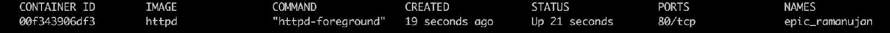
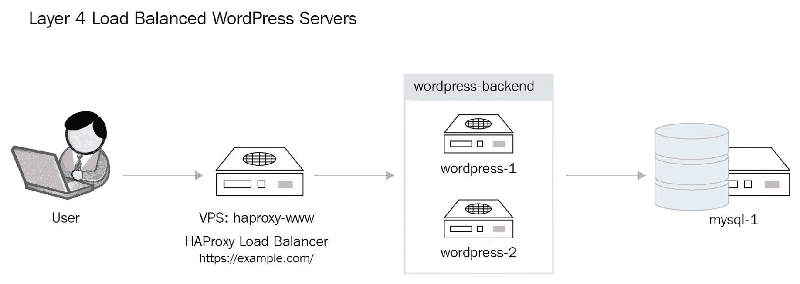

# 容器和 Docker 概述

本书不仅仅是 OpenShift 基础知识的介绍。它讲述了微服务和容器的过去、现在与未来。我们将在本书中讨论 OpenShift 及其相关内容；这包括容器基础、Docker 基础等主题，并通过与 Kubernetes 和 OpenShift 的结合使用，帮助你更好地掌握它们。

在我们的 OpenShift 之旅中，我们将带领你了解 OpenShift 的所有主要组件以及大多数高级组件。我们将涵盖 OpenShift 的安全性、网络配置，以及使用 OpenShift 最受欢迎和内建的 DevOps 工具（如 Jenkins 的 CI/CD 和与 GitHub 配合使用的 **Source-to-Image** (**S2I**)）进行应用开发。

我们还将学习每个希望在公司实际实现 OpenShift 的人最关键的一部分——设计部分。我们将展示如何正确设计和实现 OpenShift，分析那些刚开始使用 OpenShift 的人最常犯的错误。

本章重点介绍容器和 Docker 技术。我们将从架构到低层技术，介绍容器概念和 Docker 基础。在本章中，我们将学习如何使用 Docker CLI 管理 Docker 容器和 Docker 镜像。本章的一个重要部分是构建和运行 Docker 容器镜像。作为本章的一部分，你需要开发多个 Dockerfile，并将多个应用程序容器化。

本章内容包括以下几个部分：

+   容器概述

+   Docker 容器架构

+   理解 Docker 镜像和层

+   理解 Docker Hub 和 Docker 注册表

+   安装和配置 Docker 软件

+   使用 Docker 命令行

+   通过 Docker CLI 管理镜像

+   通过 Docker CLI 管理容器

+   理解环境变量在 Docker 容器中的重要性

+   为 Docker 容器管理持久存储

+   构建自定义 Docker 镜像

# 技术要求

在本章中，我们将使用以下技术和软件：

+   Vagrant

+   Bash Shell

+   GitHub

+   Docker

+   推荐使用 Firefox 或任何其他浏览器

Vagrant 安装以及我们在本章使用的所有代码都可以在 GitHub 上找到：[`github.com/PacktPublishing/Learn-OpenShift`](https://github.com/PacktPublishing/Learn-OpenShift)。

本章将提供如何安装和配置 Docker 的说明，随着学习的进展，我们将深入了解这些内容。

Bash Shell 将作为你基于 CentOS 7 的虚拟环境的一部分使用。

可以使用 Firefox 或其他任何浏览器来浏览 Docker Hub。

作为前提条件，你需要一台能够稳定连接互联网的笔记本电脑。

# 容器概述

传统上，软件应用的开发遵循单体架构方法，这意味着所有的服务或组件都紧密耦合在一起。你不能随意抽出一部分并替换成其他组件。随着时间的推移，这种方法发生了变化，演变成了 N 层架构。N 层应用架构是容器和微服务架构向前迈进的一步。

单体架构的主要缺点是其缺乏可靠性、可扩展性和高可用性。由于单体应用的特性，扩展这些应用变得非常困难。这些应用的可靠性也是一个问题，因为你几乎无法在不发生停机的情况下轻松地操作和升级它们。你无法有效地扩展单体应用，也就是说，你不能简单地再添加一个、五个或十个应用，并让它们相互共存。

过去我们有单体应用，但随着人们和公司开始关注应用的可扩展性、安全性、可靠性和**高可用性**（**HA**），这种架构才逐渐发展起来。这就是 N 层设计的由来。N 层设计是一种标准的应用设计方式，比如三层 Web 应用，其中包括 Web 层、应用层和数据库后端。这是一个非常标准的设计。如今，它正向微服务架构演变。那么，为什么我们需要微服务？简短的回答是 *为了更好的效果*。它更便宜、扩展性更强、也更安全。容器化的应用将把你带到一个全新的层次，这也是你能从自动化和 DevOps 中受益的地方。

容器是新一代虚拟机，它将软件开发带入了一个全新的层次。容器是在单一操作系统内的一组隔离的不同规则和资源。这意味着容器能够提供与虚拟机相同的好处，但使用的 CPU、内存和存储却少得多。当前有几个流行的容器提供商，包括 LXC、Rockt 和 Docker，我们在本书中将重点讨论 Docker。

# 容器的特点和优势

这种架构为软件开发带来了诸多优势。

容器的主要优势包括以下几点：

+   高效的硬件资源消耗

+   应用与服务隔离

+   更快速的部署

+   微服务架构

+   容器的无状态特性

# 高效的硬件资源消耗

无论你是在裸金属服务器上原生运行容器，还是使用虚拟化技术，容器都能让你更好、更高效地利用资源（CPU、内存和存储）。在裸金属服务器的情况下，容器允许你运行几十个甚至上百个相同或不同的容器，与通常只在专用服务器上运行一个应用程序相比，提供了更好的资源利用率。我们曾经看到过某些服务器在高峰期的利用率只有 3%，这是一种资源浪费。如果你要在同一台服务器上运行几个相同或不同的应用程序，它们会相互冲突。即使它们能正常工作，你在日常操作和故障排除中也会面临许多问题。

如果你打算通过引入流行的虚拟化技术（如 KVM、VMware、XEN 或 Hyper-V）来隔离这些应用程序，你会遇到另一个问题。由于为了虚拟化你的应用程序，你需要在虚拟机管理程序操作系统之上安装一个操作系统，而这个操作系统需要 CPU 和内存来运行。例如，每个虚拟机都有自己的内核和内核空间。与标准虚拟机相比，经过精心调优的容器平台可以让你运行最多四倍数量的容器。当你只有五个或十个虚拟机时，差异可能不显著，但当我们谈论上百或上千个虚拟机时，差距就非常大。

# 应用程序和服务隔离

假设我们有十个不同的应用程序托管在同一台服务器上。每个应用程序都有一些依赖项（如包、库等）。如果需要更新某个应用程序，通常涉及到更新该应用程序及其依赖项。如果你更新所有相关的依赖项，很可能会影响其他应用程序和服务，导致这些应用程序无法正常工作。当然，某种程度上，这些问题可以通过环境管理工具来解决，比如 Python 的`virtualenv`和 Ruby 的`rbenv`/`rvm`，而共享库的依赖项可以通过`LD_LIBRARY_PATH`进行隔离。但如果你需要同一个包的不同版本呢？容器和虚拟化技术解决了这个问题。虚拟机和容器都为你的应用程序提供了环境隔离。

但与裸金属应用程序部署相比，容器技术（例如 Docker）提供了一种高效的方式，将应用程序和其他计算资源库相互隔离。它不仅使这些应用程序能够在同一操作系统上共存，还提供了高效的安全性，这是每个面向客户和内容敏感的应用程序所必须的。它使你能够独立地更新和修补容器化的应用程序。

# 更快的部署

使用本书后续将讨论的容器镜像，可以加速容器部署。我们说的是几秒钟就能完全重启一个容器，而不像裸金属服务器和虚拟机那样需要几分钟甚至几十分钟。这主要是因为容器不需要重启整个操作系统，它只需要重启应用程序本身。

# 微服务架构

容器通过引入微服务架构，将应用程序部署提升到全新水平。其实质是，如果你有一个单体应用或多层应用，它通常有许多不同的服务相互通信。将服务容器化可以让你将应用程序拆分成多个部分，并独立操作每个部分。假设你有一个标准的应用程序，包含一个 Web 服务器、应用程序和数据库。你可能会将其部署到一台或三台不同的服务器、三台虚拟机或三个简单的容器中，每个容器运行应用程序的一个部分。这些选项所需的工作量、时间和资源各不相同。本书后续会展示使用容器进行这一操作是多么简单。

# 容器的无状态特性

容器是无状态的，这意味着你可以随时启动和关闭容器，创建或销毁容器，这不会影响你的应用性能。这是容器的最伟大特性之一。本书后续将深入探讨这一点。

# Docker 容器架构

Docker 是当今最流行的应用容器化技术之一。那么，既然有其他容器选项，为什么我们要使用 Docker 呢？因为在开源时代，协作和贡献至关重要，而 Docker 在这一领域做到了其他技术无法做到的许多事情。

例如，Docker 与其他容器开发者（如 Red Hat、Google 和 Canonical）合作，共同开发其组件。Docker 还将其软件容器格式和运行时贡献给了 Linux 基金会的开放容器项目。Docker 使得容器的学习和使用变得非常简单。

# Docker 架构

正如我们已经提到的，Docker 是最流行的容器平台。它允许在 Docker 容器中创建、共享和运行应用程序。Docker 将运行中的应用程序与基础设施分开。它可以大大加快应用程序交付的速度。Docker 还将应用程序开发提升到一个全新的水平。在下图中，你可以看到 Docker 架构的高级概览：


Docker 架构

Docker 使用的是客户端-服务器类型的架构：

+   **Docker 服务器**：这是一个作为守护进程在操作系统中运行的服务。该服务负责下载、构建和运行容器。

+   **Docker 客户端**：该命令行工具负责使用 REST API 与 Docker 服务器进行通信。

# Docker 的主要组件

Docker 使用三个主要组件：

+   **Docker 容器**：隔离的用户空间环境，运行相同或不同的应用程序，并共享相同的主机操作系统。容器是由 Docker 镜像创建的。

+   **Docker 镜像**：包含应用程序库和应用程序的 Docker 模板。镜像用于创建容器，您可以立即启动容器。您可以创建和更新自己的自定义镜像，也可以从 Docker 的公共注册表中下载构建镜像。

+   **Docker 注册表**：这是一个镜像存储库。Docker 注册表可以是公共的或私有的，这意味着您可以使用互联网上可用的镜像，也可以为内部用途创建自己的注册表。一个流行的公共 Docker 注册表是 Docker Hub，本章稍后会讨论。

# Linux 容器

如前一节所述，Docker 容器是安全的，并且彼此隔离。在 Linux 中，Docker 容器使用 Linux 内核的几个标准特性。这包括：

+   **Linux 命名空间**：这是 Linux 内核中的一个功能，用于将资源彼此隔离。这允许一组 Linux 进程看到一组资源，而另一组 Linux 进程则看到另一组资源。Linux 中有几种类型的命名空间：**挂载**（**mnt**）、**进程 ID**（**PID**）、**网络**（**net**）、**用户 ID**（**user**）、**控制组**（**cgroup**）和**进程间通信**（**IPC**）。内核可以将通常对所有进程可见的特定系统资源放入命名空间中。在命名空间内，进程只能看到与同一命名空间中的其他进程相关联的资源。您可以将进程或一组进程与其自己的命名空间关联，或者如果使用网络命名空间，甚至可以将网络接口移动到网络命名空间。例如，位于两个不同挂载命名空间中的两个进程可能对挂载的根文件系统有不同的视图。每个容器都可以与一组特定的命名空间关联，这些命名空间仅在这些容器内部使用。

+   **控制组**（**cgroups**）：这些提供了一种有效的资源限制机制。通过 cgroups，您可以按 Linux 进程控制和管理系统资源，提高整体资源利用效率。Cgroups 允许 Docker 按容器控制资源的使用。

+   **SELinux**：**Security Enhanced Linux**（**SELinux**）是**强制访问控制**（**MAC**），用于细粒度的系统访问，最初由**国家安全局**（**NSA**）开发。它是 Debian 和基于 RHEL 的发行版（如 Red Hat Enterprise Linux、CentOS 和 Fedora）的一层附加安全性。Docker 使用 SELinux 的两个主要原因：主机保护和将容器彼此隔离。容器进程使用特殊的 SELinux 规则，以限制对系统资源的访问。

Docker 的优势在于它利用了上述低级内核技术，但通过提供一种简便的方式来管理容器，隐藏了所有复杂性。

# 理解 Docker 镜像和层

Docker 镜像是一个只读模板，用于构建容器。一个镜像由多个层组成，这些层被组合成一个单一的虚拟文件系统，Docker 应用可以访问。通过使用一种特殊的技术，将多个层合并成一个单一视图，从而实现这一点。Docker 镜像是不可变的，但你可以添加一个额外的层并将其保存为一个新的镜像。基本上，你可以添加或更改 Docker 镜像的内容，而无需直接更改这些镜像。Docker 镜像是运送、存储和交付容器化应用的主要方式。容器是通过 Docker 镜像创建的；如果没有 Docker 镜像，你需要下载或构建一个。

# 容器文件系统

容器文件系统用于每个 Docker 镜像，它表现为一个堆叠在一起的只读层列表。这些层最终形成容器的基础根文件系统。为了实现这一点，使用了不同的存储驱动程序。对正在运行的容器文件系统的所有更改都会应用到容器的最上层镜像层，这一层称为容器层。基本上，这意味着多个容器可以共享对 Docker 镜像的相同底层访问权限，但会在本地独立且唯一地写入更改。这个过程在以下图示中展示：


Docker 层

# Docker 存储驱动程序

Docker 存储驱动程序是启用和管理容器镜像的主要组件。为了实现这一点，使用了两种主要技术——写时复制和可堆叠的镜像层。存储驱动程序的设计目的是处理这些层的细节，使它们能够相互作用。有多种驱动程序可供选择。它们基本上执行相同的工作，但每一种方法都不同。最常见的存储驱动程序是 AUFS、Overlay/Overlay2、Devicemapper、Btrfs 和 ZFS。所有存储驱动程序可以分为三种不同类型：

| **存储驱动类别** | **存储驱动** |
| --- | --- |
| 联合文件系统 | AUFS, Overlay, Overlay2 |
| 快照文件系统 | Btrfs, ZFS |
| 写时复制块设备 | Devicemapper |

# 容器镜像层

如前所述，Docker 镜像包含多个层，这些层通过存储驱动程序组合成一个单一的文件系统。层（也称为中间镜像）是在执行 Docker 镜像构建过程中的命令时生成的。通常，Docker 镜像是通过 Dockerfile 创建的，其语法将在后面描述。每一层代表镜像 Dockerfile 中的一个指令。

除了最后一层外，每一层都是只读的：


Docker 镜像层

一个 Docker 镜像通常由多个层组成，层与层之间是堆叠的。最上层具有读写权限，所有其他层都是只读权限。这个概念与写时复制技术非常相似。因此，当你从镜像启动容器时，所有更改都会应用到最上层的可写层。

# Docker 注册表

如前所述，Docker 镜像是一种交付应用程序的方式。你可以创建一个 Docker 镜像并通过公共/私有注册表服务与其他用户共享。注册表是一个无状态的、高度可扩展的服务器端应用程序，你可以用它来存储和下载 Docker 镜像。Docker 注册表是一个开源项目，使用宽松的 Apache 许可证。一旦镜像在 Docker 注册表服务上可用，其他用户可以通过拉取镜像来下载它，并使用该镜像创建新的 Docker 镜像或从该镜像运行容器。

Docker 支持几种类型的 Docker 注册表：

+   公共注册表

+   私有注册表

# 公共注册表

你可以从存储在公共注册表中的镜像启动容器。默认情况下，Docker 守护进程会从 Docker Hub（一个由 Docker 提供的公共注册表）查找并下载 Docker 镜像。然而，许多厂商在安装时将自己的公共注册表添加到 Docker 配置中。例如，Red Hat 有自己的 *经过验证且被推荐* 的公共 Docker 注册表，你可以用它来拉取 Docker 镜像并构建容器。

# 私有注册表

一些组织或特定团队出于某种原因，不希望与所有人共享他们定制的容器镜像。它们仍然需要一个服务来共享 Docker 镜像，但仅供内部使用。在这种情况下，私有注册表服务可能会很有用。可以在专用服务器或网络内的虚拟机上安装并配置一个私有注册表服务。

你可以通过从公共注册表镜像启动一个 Docker 容器，轻松安装私有 Docker 注册表。私有 Docker 注册表的安装过程与使用附加选项运行常规 Docker 容器没有区别。

# 访问注册表

通过 Docker 客户端使用 Docker 守护进程服务访问 Docker 注册表。Docker 命令行使用 RESTful API 来请求守护进程执行处理。这些命令大多被转换为 HTTP 请求，并可以通过 `curl` 传输。

使用 Docker 注册表的过程将在下一个部分中展示。

开发者可以创建一个 Docker 镜像，并将其上传到私有或公共注册表。一旦镜像上传成功，就可以立即用来运行容器或构建其他镜像。

# Docker Hub 概述

Docker Hub 是一个基于云的注册服务，它允许您构建镜像并进行测试，推送这些镜像，并连接到 Docker 云，以便将镜像部署到您的主机上。Docker Hub 提供了一个集中式资源，用于容器镜像的发现、分发和变更管理、用户和团队协作以及整个开发管道中的工作流自动化。

Docker Hub 是由 Docker 项目管理的公共注册中心，托管着大量容器镜像，包括由主要开源项目（如 MySQL、Nginx、Apache 等）提供的镜像，以及由社区开发的定制容器镜像。

Docker Hub 提供以下一些功能：

+   **镜像仓库**：您可以查找并下载其他 Docker Hub 用户管理的镜像。您还可以推送或拉取您有权限访问的私人镜像库中的镜像。

+   **自动构建**：当您对源代码仓库进行更改时，可以自动创建新的镜像。

+   **Webhooks**：当仓库发生推送时触发的操作，以便自动化构建。

+   **组织**：创建小组并管理对镜像仓库的访问权限。

要开始使用 Docker Hub，您需要使用 Docker ID 登录 Docker Hub。如果您没有 Docker ID，可以通过简单的注册过程创建一个。它完全免费。如果您还没有 Docker ID，创建链接是 [`hub.docker.com/`](https://hub.docker.com/)。

您可以在不登录的情况下搜索和拉取 Docker 镜像；但是，要推送镜像，您必须先登录。Docker Hub 让您能够创建公共和私人仓库。公共仓库将对所有人开放，而私人仓库将仅限于特定用户或组织使用。

Docker Hub 包含多个官方仓库。这些是来自不同供应商和 Docker 贡献者的公共认证仓库，涵盖了像 Red Hat、Canonical 和 Oracle 等供应商。

# Docker 安装和配置

Docker 软件有两个版本：**社区版**（**CE**）和**企业版**（**EE**）。

**Docker CE** 是学习 Docker 和使用容器化应用程序的一个很好的起点。它支持多个平台和操作系统。Docker CE 带有安装程序，您可以立即开始使用容器。Docker CE 集成并优化了基础设施，因此在开始使用 Docker 时，您可以保持原生应用体验。

**Docker 企业版**（**EE**）是一个**容器即服务**（**CaaS**）平台，面向 IT 管理并保护跨不同基础设施（无论是本地还是云端）的多样化应用程序。换句话说，Docker EE 与 Docker CE 类似，它由 Docker Inc. 提供支持。

Docker 软件支持多种平台和操作系统。大多数流行的操作系统都可以获得 Docker 的安装包，如 Red Hat Enterprise Linux、Fedora Linux、CentOS、Ubuntu Linux、Debian Linux、macOS 和 Microsoft Windows。

# Docker 安装

Docker 安装过程取决于具体的操作系统。在大多数情况下，官方 Docker 门户网站上已经有很好的描述——[`docs.docker.com/install/`](https://docs.docker.com/install/)。作为本书的一部分，我们将在 CentOS 7.x 上使用 Docker 软件。在其他平台上的 Docker 安装与配置不在本书范围内。如果您仍然需要在其他操作系统上安装 Docker，请访问官方 Docker 网站。

通常，Docker 节点的安装过程如下：

1.  操作系统的安装与配置

1.  Docker 包安装

1.  配置 Docker 设置

1.  启动 Docker 服务

我们假设读者已经具备足够的知识来安装和配置基于 CentOS 的 **虚拟机** (**VM**) 或裸金属主机。如果您不知道如何使用 Vagrant，请参阅以下指南：[`www.vagrantup.com/intro/getting-started/`](https://www.vagrantup.com/intro/getting-started/)。

一旦您在系统上正确安装了 Vagrant，只需运行 `vagrant init centos/7`，然后运行 `vagrant up`。您可以通过 `vagrant status` 命令验证 Vagrant 是否已启动，最后可以通过 `vagrant ssh` 命令进入虚拟机。

由于 Docker 支持包括最流行的操作系统在内的多种操作系统，您可以选择直接在桌面操作系统上安装 Docker。我们建议您使用 Vagrant 或其他虚拟化提供商，如 VMware 或 KVM，因为我们已经在 CentOS 7 的虚拟环境中完成了所有测试。如果您仍然希望在桌面操作系统上安装 Docker，请访问链接：[`docs.docker.com/install/`](https://docs.docker.com/install/)。

Docker CE 可以在 CentOS 7 上通过标准仓库进行安装。安装过程侧重于 `docker` 包的安装：

```
# yum install docker -y
...
output truncated for brevity
...
Installed:
docker.x86_64 2:1.12.6-71.git3e8e77d.el7.centos.1
Dependency Installed:
...
output truncated for brevity
...
```

安装完成后，您需要启动 Docker 守护进程，才能管理您的容器和镜像。在 RHEL7 和 CentOS 7 上，这仅仅意味着启动 Docker 服务，操作如下：

```
# systemctl start docker
# systemctl enable docker
Created symlink from /etc/systemd/system/multi-user.target.wants/docker.service to /usr/lib/systemd/system/docker.service.
```

您可以通过运行 `docker info` 命令来验证 Docker 守护进程是否正常工作，从而显示 Docker 信息：

```
# docker info
Containers: 0
Running: 0
Paused: 0
Stopped: 0
Images: 0
...
output truncated for brevity
...
Registries: docker.io (secure)
```

# Docker 配置

Docker 守护进程的配置由 Docker 配置文件（`/etc/docker/daemon.json`）管理，Docker 守护进程的启动选项通常由名为 Docker 的 `systemd` 单元控制。在基于 Red Hat 的操作系统中，一些配置选项可以在 `/etc/sysconfig/docker` 和 `/etc/sysconfig/docker-storage` 中找到。修改上述文件将允许您更改 Docker 参数，如 UNIX 套接字路径、`listen` 在 TCP 套接字上的配置、注册表配置、存储后端等。

# 使用 Docker 命令行

为了开始使用 Docker CLI，你需要配置并启动一个 Vagrant 虚拟机。如果你使用的是 macOS，使用 Vagrant 进行配置的过程如下所示：

```
end
**$ vagrant up** 
**$ vagrant ssh**
```

**# 使用 Docker man、help、info

Docker 守护进程监听 `unix:///var/run/docker.sock`，但你可以将 Docker 绑定到其他主机/端口或 Unix 套接字。Docker 客户端（`docker` 工具）使用 Docker API 与 Docker 守护进程进行交互。

Docker 客户端支持数十个命令，每个命令都有众多选项，因此尝试列出它们会导致一份官方文档中的 CLI 参考副本。相反，我们将为你提供最有用的子集命令，帮助你快速上手。

你可以随时通过以下命令查看所有 Docker 子命令的手册页：

```
$ man -k docker
```

你将能够看到 Docker 及其所有子命令的手册页列表：

```
$ man docker
$ man docker-info
$ man Dockerfile

```

获取有关命令的另一个方法是使用 `docker COMMAND --help`：

```
# docker info --help
Usage: docker info
Display system-wide information
--help             Print usage
```

`docker` 工具允许你管理容器基础设施。所有子命令可以按如下方式进行分组：

| **活动类型** | **相关子命令** |
| --- | --- |
| 管理镜像 | `search`, `pull`, `push`, `rmi`, `images`, `tag`, `export`, `import`, `load`, `save` |
| 管理容器 | `run`, `exec`, `ps`, `kill`, `stop`, `start` |
| 构建自定义镜像 | `build`, `commit` |
| 信息收集 | `info`, `inspect` |

# 使用 Docker CLI 管理镜像

在你的服务器或笔记本电脑上运行和使用容器的第一步是使用 `docker search` 命令从 Docker 注册表中搜索并拉取 Docker 镜像。

让我们搜索 Web 服务器容器。执行此操作的命令是：

```
$ docker search httpd
NAME DESCRIPTION STARS OFFICIAL AUTOMATED
httpd ... 1569 [OK]
hypriot/rpi-busybox-httpd ... 40
centos/httpd 15 [OK]
centos/httpd-24-centos7 ... 9
```

或者，我们可以访问[`hub.docker.com/`](https://hub.docker.com/)，在搜索窗口输入`httpd`，它会给我们类似于 `docker search httpd` 的结果：


Docker Hub 搜索结果

一旦找到容器镜像，我们可以从 Docker 注册表中拉取该镜像以开始使用它。要将容器镜像拉取到主机上，你需要使用 `docker pull` 命令：

```
$ docker pull httpd
```

上述命令的输出如下：


请注意，Docker 使用联合文件系统层的概念来构建 Docker 镜像。这就是为什么你可以看到从 Docker Hub 拉取的七个层级。一个层叠加在另一个之上，最终构建出一个完整的镜像。

默认情况下，Docker 会尝试拉取最新标签的镜像，但我们也可以使用不同的标签下载我们感兴趣的较旧版本镜像。快速找到可用标签的最佳方式是访问[`hub.docker.com/`](https://hub.docker.com/)，搜索特定镜像并点击镜像详情：


Docker Hub 镜像详情

在那里我们可以看到从 Docker Hub 拉取的所有镜像标签。也有方法可以通过 `docker search` CLI 命令实现相同的目标，稍后我们将在本书中介绍。

```
$ docker pull httpd:2.2.29
```

上述代码的输出应如下所示：


你可能会注意到，第二个镜像的下载时间明显低于第一个镜像。这是因为我们拉取的第一个镜像（`docker:latest`）与第二个镜像（`httpd:2.2.29`）有许多层是相同的。因此，系统无需再次下载所有的层。这在大型环境中非常有用，可以节省大量时间。

# 操作镜像

现在，我们想检查本地服务器上可用的镜像。为此，我们可以使用`docker images`命令：

```
$ docker images
```

上述命令的输出将如下所示：


如果我们下载了一个错误的镜像，可以使用`docker rmi`命令将其从本地服务器中删除：**删除镜像**（**RMI**）。在我们的案例中，我们有两个版本的同一镜像，因此可以指定要删除的镜像标签：

```
$ docker rmi httpd:2.2.29
```

上述命令的输出将如下所示：


目前我们只剩下一个镜像，它是`httpd:latest`：

```
$ docker images
```

上述命令的输出将如下所示：


# 保存与加载镜像

Docker CLI 允许我们使用 export/import 或 save/load 命令导出和导入 Docker 镜像和容器层。save/load 与 export/import 的区别在于，前者处理包含元数据的镜像，而后者仅使用容器层，不包含任何镜像元数据，如名称、标签等。在大多数情况下，save/load 的组合更加相关，并且适用于没有特殊需求的镜像。`docker save`命令将打包所有用于构建镜像的层和元数据。然后，你可以将这个*保存的*镜像链加载到另一个 Docker 实例中，并基于这些镜像创建容器。

`docker export`将提取整个容器，类似于普通虚拟机的快照。它不仅保存操作系统，还包括你在容器生命周期中所做的任何更改和写入的任何数据文件。这更像是传统的备份：

```
$ docker save httpd -o httpd.tar $ ls -l httpd.tar 
```


要从文件中加载镜像，我们可以使用`docker load`命令。不过，在此之前，我们先从本地仓库中删除 httpd 镜像：

```
$ docker rmi httpd:latest
```

上述命令的输出将如下所示：


我们验证本地仓库中没有任何镜像：

```
 $ docker images
 REPOSITORY TAG IMAGE ID CREATED SIZE
```

使用`docker save`命令保存的镜像文件，可以通过`docker load`命令将其加载回来。像`docker export`和`docker import`一样，这个命令与 Docker 的 save 功能成对使用，因此用于将保存的容器归档（包含所有中间层和元数据）加载到 Docker 缓存中：

```
$ docker load -i httpd.tar
```

上述命令的输出将如下所示：


使用`docker image`命令检查本地的 docker 镜像：

```
$ docker images
```

上述命令的输出如下所示：


# 将镜像上传到 Docker 仓库

现在我们知道如何搜索、拉取、删除、保存、加载和列出可用的镜像。最后我们缺少的部分是如何将镜像推送回 Docker Hub 或私有仓库。

要将镜像上传到 Docker Hub，我们需要做一些处理并按照以下步骤操作：

1.  登录 Docker Hub：

```
$ docker login
Username: #Enter your username here
Password: #Enter your password here
Login Succeeded
```

1.  将您想要推送的 Docker 镜像复制到服务器上 Docker 仓库中的不同路径：

```
$ docker tag httpd:latest flashdumper/httpd:latest
```

请注意，`flashdumper` 是您的 Docker Hub 用户名。

1.  最后，将复制的镜像推送回 Docker Hub：

```
$ docker push flashdumper/httpd:latest
```

上述命令的输出如下所示：


现在，镜像已推送到您的 Docker Hub 并可供任何人下载。

```
$ docker search flashdumper/*
```

上述命令的输出如下所示：


您可以使用网页浏览器查看相同的结果。如果您访问 [`hub.docker.com/`](https://hub.docker.com/)，您应该能够在您的帐户下看到该 `httpd` 镜像：


Docker Hub 账户镜像

# 使用 Docker CLI 管理容器

下一步是实际运行一个容器，该容器来自于我们在上一章从 Docker Hub 或私有仓库拉取的镜像。我们将使用 `docker run` 命令来运行一个容器。在此之前，让我们先用 `docker ps` 命令检查是否有任何容器正在运行：

```
$ docker ps
CONTAINER ID IMAGE COMMAND CREATED STATUS PORTS NAME
```

使用 `docker run` 命令运行一个容器：

```
$ docker run httpd
```

上述命令的输出如下所示：


容器正在运行，但我们无法离开终端并继续在前台工作。而我们唯一能逃离的方法是发送一个 TERM 信号（*Ctrl* + *C*）并终止它。

# Docker ps 和日志

运行 `docker ps` 命令来显示没有正在运行的容器：

```
$ docker ps
CONTAINER ID IMAGE COMMAND CREATED STATUS PORTS NAMES
```

运行 `docker ps -a` 命令来显示运行中的和已停止的容器：

```
$ docker ps -a
```

上述命令的输出如下所示：


这里有几点需要注意。`STATUS` 字段表示容器 `5e3820a43ffc` 大约在一分钟前退出。为了获取容器日志信息，我们可以使用 `docker logs` 命令：

```
$ docker logs 5e3820a43ffc
```

上述命令的输出如下所示：


最后一条消息显示 `caught SIGTERM, shutting down`。这发生在我们按下 *Ctrl* + *C* 之后。为了在后台模式下运行容器，我们可以使用 `docker run` 命令的 `-d` 选项：

```
$ docker run -d httpd
5d549d4684c8e412baa5e30b20697b72593d87130d383c2273f83b5ceebc4af3
```

它会生成一个随机的 ID，其中前 12 个字符用于容器 ID。同时还会生成一个随机的容器名称。

运行 `docker ps` 来验证容器的 ID、名称和状态：

```
$ docker ps
```

上述命令的输出如下所示：



# 在容器内执行命令

从输出中，我们可以看到容器状态为`UP`。现在我们可以使用不同选项的`docker exec`命令在容器内执行一些命令：

```
$ docker exec -i 00f343906df3 ls -l /
total 12
drwxr-xr-x. 2 root root 4096 Feb 15 04:18 bin
drwxr-xr-x. 2 root root 6 Nov 19 15:32 boot
drwxr-xr-x. 5 root root 360 Mar 6 21:17 dev
drwxr-xr-x. 42 root root 4096 Mar 6 21:17 etc
drwxr-xr-x. 2 root root 6 Nov 19 15:32 home
...
Output truncated for brevity
...
```

选项`-i`（`--interactive`）允许你运行 Docker 而不进入容器。但我们可以通过使用`-i`和`-t`（`--tty`）选项（或者直接使用`-it`）轻松覆盖这种行为，进入容器：

```
$ docker exec -it 00f343906df3 /bin/bash
root@00f343906df3:/usr/local/apache2#
```

我们应该进入容器的 bash CLI。在这里，我们可以执行其他常规的 Linux 命令。这种技巧在故障排除时非常有用。要退出容器控制台，只需输入`exit`或按*Ctrl* + *D*。

# 启动和停止容器

我们还可以通过运行`docker stop`和`docker start`命令来停止和启动正在运行的容器：

输入以下命令以停止容器：

```
$ docker stop 00f343906df3
00f343906df3 
```

输入以下命令以启动容器：

```
$ docker start 00f343906df3
00f343906df3
```

# Docker 端口映射

为了实际利用容器，我们需要使它从外部可访问。为此，我们在运行`docker run`命令时需要使用`-p`选项并提供一些参数：

```
$ docker run -d -p 8080:80 httpd
3b1150b5034329cd9e70f90ee21531b8b1ab1d4a85141fd3a362cd40db80e193
```

选项`-p`将容器的端口`80`映射到服务器端口`8080`。验证是否有`httpd`容器暴露并且 web 服务器正在运行：

```
$ curl localhost:8080
<html><body><h1>It works!</h1></body></html>
```

# 检查 Docker 容器

当容器正在运行时，我们可以使用`docker inspect`命令检查其参数。输出以 JSON 格式提供，给我们一个非常全面的结果：

```
$ docker inspect 00f343906df3
[
   {
       "Id": "00f343906df3f26c24e02cd61d6a37bbc36106b3b0372073673c2983cb6f",
       ...
       output truncated for brevity
       ...
   }
]
```

# 删除容器

为了删除一个容器，你可以使用`docker rm`命令。如果你要删除的容器正在运行，你可以先停止并删除它，或者使用`-f`选项，它会完成任务：

```
$ docker rm 3b1150b50343
Error response from daemon: You cannot remove a running container 3b1150b5034329cd9e70f90ee21531b8b1ab1d4a85141fd3a362cd40db80e193\. Stop the container before attempting removal or force remove
```

让我们尝试使用`-f`选项。

```
$ docker rm  -f 3b1150b50343
```

你可以使用以下命令来删除所有容器，包括已停止和正在运行的容器：

```
$ docker rm -f $(docker ps -qa)
830a42f2e727
00f343906df3
5e3820a43ffc
419e7ce2567e
```

验证所有容器是否已删除：

```
$ docker ps  -a
CONTAINER ID IMAGE COMMAND CREATED STATUS PORTS NAMES
```

# 使用环境变量

由于容器的动态和无状态特性，应用程序在与中间件和其他应用服务通信时无法依赖固定的 IP 地址或 DNS 主机名。Docker 允许你将数据，如配置设置、加密密钥和外部资源地址，存储在环境变量中。

# 向容器传递环境变量

在运行时，环境变量会暴露给容器内的应用程序。你可以像使用`docker run -e VARIABLE=VALUE`一样，使用*environment*键在服务的容器中设置环境变量。你还可以通过不提供值的方式，直接将环境变量从你的 shell 传递给服务的容器，就像使用`docker run -e VARIABLE`一样。

环境变量用于设置特定的应用程序参数，如 IP 地址，以便服务器连接到数据库服务器地址和登录凭证。

一些容器启动脚本使用环境变量来执行应用程序的初始配置。

例如，`mariadb`镜像是为了使用多个环境变量来启动容器，并在启动时创建用户/数据库。该镜像使用以下重要参数（其中包括其他参数）：

| **参数** | **描述** |
| --- | --- |
| `MYSQL_ROOT_PASSWORD` | 这个变量是必需的，它指定将为 MariaDB `root`超级用户账户设置的密码。 |
| `MYSQL_DATABASE` | 这个变量是可选的，允许你指定在镜像启动时要创建的数据库名称。如果提供了用户/密码（见下行参数），则该用户将被授予此数据库的超级用户访问权限（对应于`GRANT ALL`）。 |
| `MYSQL_USER` 和 `MYSQL_PASSWORD` | 这些变量是可选的，用于一起创建新用户并设置该用户的密码。这个用户将被授予指定的`MYSQL_DATABASE`变量所指定数据库的超级用户权限。创建用户时，这两个变量都是必需的。 |

首先，我们可以尝试拉取并启动一个`mariadb`容器，而不指定与密码/用户/数据库相关的信息。它将失败，因为镜像期望这些参数。在这个例子中，我们在前台启动容器，以便看到所有错误信息：

```
$ docker pull mariadb
latest: Pulling from docker.io/library/mariadb
       ...
       output truncated for brevity
       ...
Digest: sha256:d5f0bc88ba397233677ff75b7b1de693d5e84527ecf2b4f59adebf8d0bcac3c4
```

现在尝试运行没有任何选项和参数的`mariadb`容器。

```
$ docker run mariadb
error: database is uninitialized and password option is not specified
You need to specify one of MYSQL_ROOT_PASSWORD, MYSQL_ALLOW_EMPTY_PASSWORD and MYSQL_RANDOM_ROOT_PASSWORD
```

`docker run`命令失败，因为 MariaDB 镜像的初始启动脚本无法找到所需的变量。该脚本要求我们至少提供 MariaDB 的 root 密码，以便启动数据库服务器。让我们尝试再次启动数据库容器，提供所有必需的变量：

```
$ docker run -d --name mariadb -e MYSQL_ROOT_PASSWORD=password -e MYSQL_DATABASE=example -e MYSQL_USER=example_user -e MYSQL_PASSWORD=password mariadb
721dc752ed0929dbac4d8666741b15e1f371aefa664e497477b417fcafee06ce
```

运行`docker ps`命令验证容器是否已成功启动：

```
$ docker ps
CONTAINER ID IMAGE COMMAND CREATED STATUS PORTS NAMES
721dc752ed09 mariadb "docker-entrypoint.sh" 10 seconds ago Up 9 seconds 3306/tcp mariadb
```

容器已成功创建。运行验证命令检查`example_user`是否有权限访问`example`数据库：

```
$ docker exec -it mariadb mysql -uexample_user -ppassword example -e "show databases;"
+--------------------+
| Database           |
+--------------------+
| example            |
| information_schema |
+--------------------+
```

启动脚本创建了一个名为`example_user`的用户，并将密码设置为`password`，这是我们在环境变量中指定的。它还为 root 用户配置了一个密码。你可以在[`hub.docker.com/_/mariadb/`](https://hub.docker.com/_/mariadb/)查看你可以指定的 MariaDB 镜像变量的完整列表。

# 链接容器

环境变量调整单个容器的设置。相同的方法也可以用于启动多层应用程序，其中一个容器或应用程序与另一个协同工作：



多层应用程序示例

在多层应用程序中，应用服务器容器和数据库服务器容器可能都需要共享数据库登录凭据等变量。当然，我们可以使用环境变量将所有数据库连接设置传递给应用程序容器。在将多个 `-e` 选项传递给 `docker run` 命令时，很容易出错，而且这种方法非常耗时，更不用说效率低下了。另一种选择是使用容器 IP 地址建立连接。我们可以使用 `docker inspect` 收集 IP 地址信息，但在多容器环境中追踪这些信息将非常困难。

这意味着，仅使用环境变量不足以构建多层应用程序，其中容器相互依赖。

Docker 有一个名为 *链接容器* 的功能来解决这个问题。它会自动将一个容器的所有环境变量复制到另一个容器。此外，通过链接容器，我们可以根据另一个容器的 IP 地址和暴露的端口定义环境变量。

使用链接容器非常简单，只需将 `--link container:alias` 选项添加到 `docker run` 命令中。例如，以下命令使用 DB 别名链接到一个名为 MariaDB 的容器：

```
$ docker run --link mariadb:db --name my_application  httpd
```

新的 `my_application` 容器将获得从链接容器 `mariadb` 定义的所有变量。这些变量名以 `DB_ENV_` 为前缀，以避免与新容器的环境变量冲突。

请注意，别名都是大写的。

提供有关容器 IP 地址和端口信息的变量按照以下规则命名：

+   `{ALIAS}_PORT_{exposed-port}_TCP_ADDR`

+   `{ALIAS}_PORT_{exposed-port}_TCP_PORT`

继续以 MariaDB 镜像为例，应用容器将获得以下变量：

+   `DB_PORT_3306_TCP_ADDR`

+   `DB_PORT_3306_TCP_PORT`

如果链接的容器暴露多个端口，每个端口都会生成一组环境变量。

让我们来看一个例子。我们将创建一个需要访问数据库服务器的 WordPress 容器。这个集成将需要共享的数据库访问凭据。创建此应用程序的第一步是创建一个数据库服务器：

```
$ docker rm -f $(docker ps -qa)
$ docker run -d --name mariadb -e MYSQL_ROOT_PASSWORD=wordpress -e MYSQL_DATABASE=wordpress -e MYSQL_USER=wordpress -e MYSQL_PASSWORD=password mariadb
221462288bc578511154fe79411de002e05f08642b63a72bc7a8f16f7102e52b
```

下一步是运行一个 WordPress 容器。在该命令中，我们将把 `wordpress` 容器与 `mariadb` 容器链接起来：

```
$ docker run -d --name wordpress --link mariadb:mysql -p 8080:80 wordpress
Unable to find image 'wordpress:latest' locally
Trying to pull repository docker.io/library/wordpress ...
latest: Pulling from docker.io/library/wordpress
...
output truncated for brevity
...
Digest: sha256:670e4156377063df1a02f036354c52722de0348d46222ba30ef6a925c24cd46a
1f69aec1cb88d273de499ca7ab1f52131a87103d865e4d64a7cf5ab7b430983a
```

使用 `docker exec` 命令检查容器环境：

```
$ docker exec -it wordpress env|grep -i mysql
MYSQL_PORT=tcp://172.17.0.2:3306
MYSQL_PORT_3306_TCP=tcp://172.17.0.2:3306
MYSQL_PORT_3306_TCP_ADDR=172.17.0.2
MYSQL_PORT_3306_TCP_PORT=3306
MYSQL_PORT_3306_TCP_PROTO=tcp
...
output truncated for brevity
...
```

你可以看到所有这些变量，因为 WordPress 容器启动脚本处理了 `mysql` 链接。我们可以看到，这里链接设置了一些 `MYSQL_ENV` 和 `MYSQL_PORT` 变量，WordPress 启动脚本将使用这些变量。

# 使用持久化存储

在前面的章节中，我们看到容器可以轻松创建和删除。但是，当容器被删除时，所有与该容器相关的数据也会消失。这就是为什么很多人将容器称为无状态架构的原因。但我们可以通过使用持久化卷来改变这一行为，保持所有数据。为了为 Docker 容器启用持久化存储，我们需要使用`-v`选项，它将容器文件系统与运行该容器的主机文件系统绑定。

在下一个示例中，我们将创建一个在主机`/mnt/data`文件夹中具有持久化存储的 MariaDB 容器。然后，我们删除 MariaDB 容器，并使用相同的持久化存储重新创建它。

首先，删除所有之前创建的容器：

```
$ docker rm -f $(docker ps -aq)
```

我们在开始之前必须为节点准备持久化存储。请注意，我们需要为持久化存储目录授予读写权限。MariaDB 应用程序与容器内的 MySQL 用户 *UID=999* 配合工作。此外，重要的是要提到，特殊的 SE Linux 安全上下文 `svirt_sandbox_file_t` 是必需的。可以通过以下命令实现：

```
# mkdir /mnt/data
# chown 999:999 /mnt/data
# chcon -Rt svirt_sandbox_file_t /mnt/data
```

下一步是创建运行 MariaDB 服务的容器：

```
$ docker run -d -v /mnt/data:/var/lib/mysql --name mariadb -e MYSQL_ROOT_PASSWORD=password mariadb
41139532924ef461420fbcaaa473d3030d10f853e1c98b6731840b0932973309
```

运行`docker ps`命令：

```
$ docker ps
CONTAINER ID IMAGE COMMAND CREATED STATUS PORTS NAMES
41139532924e mariadb "docker-entrypoint.sh" 4 seconds ago Up 3 seconds 3306/tcp mariadb
```

创建一个新数据库并验证该新数据库的存在：

```
$ docker exec -it mariadb mysql -uroot -ppassword -e "create database persistent;"

$ docker exec -it mariadb mysql -uroot -ppassword -e "show databases;"
+--------------------+
| Database           |
+--------------------+
| information_schema |
| mysql              |
| performance_schema |
| persistent         |
+--------------------+
```

验证`/mnt/data`目录中是否有新的数据，这些数据是由`mariadb`容器创建的。这就是我们使数据持久化的方式：

```
$ ls -l /mnt/data/
drwx------. 2 polkitd ssh_keys 4096 Mar 6 16:18 mysql
drwx------. 2 polkitd ssh_keys 20 Mar 6 16:18 performance_schema
drwx------. 2 polkitd ssh_keys 20 Mar 6 16:23 persistent
...
output truncated for brevity
...
```

删除`mariadb`容器并验证所有文件将被保留：

```
$ docker rm -f mariadb
mariadb

$ ls -l /mnt/data/
drwx------. 2 polkitd ssh_keys 4096 Mar 6 16:18 mysql
drwx------. 2 polkitd ssh_keys 20 Mar 6 16:18 performance_schema
drwx------. 2 polkitd ssh_keys 20 Mar 6 16:23 persistent
...
output truncated for brevity
...
```

我们将重新运行容器并验证先前创建的数据库 *persistent* 是否在容器删除和创建后仍然存在：

```
$ docker run -d -v /mnt/data:/var/lib/mysql --name mariadb mariadb
c12292f089ccbe294cf3b9a80b9eb44e33c1493570415109effa7f397579b235
```

正如你所看到的，名为`persistent`的数据库仍然存在。

在继续下一部分之前，删除所有容器：

```
$ docker rm -f $(docker ps -aq)
```

# 创建自定义 Docker 镜像

Docker 社区为大多数流行的软件应用程序提供了 Docker 镜像。例如，包含 Web 服务器（Apache、Nginx 等）、企业应用平台（JBoss EAP、Tomcat）、编程语言镜像（Perl、PHP、Python）等。

在大多数情况下，你无需构建自己的 Docker 镜像来运行标准软件。但是，如果你有需要自定义应用程序的业务需求，你可能需要创建自己的 Docker 镜像。

创建新 Docker 镜像有多种方式：

+   **提交**：从运行中的容器创建 Docker 镜像。Docker 允许你使用`docker commit`命令将一个正在运行的容器*转换*为 Docker 镜像。这意味着镜像层将作为独立的 Docker 镜像存储。这种方法是创建新镜像的最简单方式。

+   **导入/导出**：这与第一个方法类似，但使用了另一个 Docker 命令。运行的容器层会通过 `docker export` 命令保存到文件系统中，然后通过 `docker import` 命令重新创建镜像。我们不推荐使用这种方法来创建新镜像，因为第一个方法更简单。

+   **Dockerfile**：使用 Dockerfile 构建 Docker 镜像。Dockerfile 是一个包含多个步骤的纯文本文件，这些步骤有时被称为指令。这些指令可以在容器内运行特定的命令或将文件复制到容器中。用户可以通过 Dockerfile 启动构建过程，Docker 守护进程会在临时容器中执行 Dockerfile 中的所有指令。然后，这个容器会被转换成 Docker 镜像。这是创建新 Docker 镜像最常见的方法。如何从 Dockerfile 构建自定义 Docker 镜像将在后续章节中详细介绍。

+   **从零开始**：构建一个基础的 Docker 镜像。在前两种方法中，Docker 镜像是通过 Docker 镜像创建的，而这些 Docker 镜像又是从基础 Docker 镜像创建的。除非自己创建一个，否则无法修改这个基础镜像。如果你想了解镜像内部的内容，可能需要创建一个基础镜像。可以通过两种方式来实现：

    +   使用 `tar` 命令创建一个基础镜像层。

    +   使用特殊的 Dockerfile 指令（从零开始）。两种方法将在后续章节中描述。

# 使用 `docker commit` 自定义镜像

通常建议所有 Docker 镜像都应该通过 Dockerfile 构建，以创建干净且正确的镜像层，避免包含不需要的临时文件和日志文件，尽管一些供应商提供的 Docker 镜像没有可用的 Dockerfile。如果需要修改现有镜像，可以使用标准的 `docker commit` 功能将现有容器转换为新镜像。

作为示例，我们将尝试修改现有的 httpd 容器并从中创建一个镜像。

首先，我们需要获取 httpd 镜像：

```
$ docker pull httpd
Using default tag: latest
Trying to pull repository docker.io/library/httpd ...
latest: Pulling from docker.io/library/httpd
...
output truncated for brevity
...
Digest: sha256:6e61d60e4142ea44e8e69b22f1e739d89e1dc8a2764182d7eecc83a5bb31181e
```

接下来，我们需要一个正在运行的容器。这个容器将作为未来镜像的模板。

```
$ docker run -d --name httpd httpd
c725209cf0f89612dba981c9bed1f42ac3281f59e5489d41487938aed1e47641
```

现在我们可以连接到容器并修改其层。作为示例，我们将更新 `index.html` 文件：

```
$ docker exec -it httpd /bin/sh
# echo "This is a custom image" > htdocs/index.html
# exit
```

让我们来看一下使用 `docker diff` 命令所做的更改。该命令会显示从原始镜像中修改的所有文件。输出结果如下：

```
$ docker diff httpd
C /usr
C /usr/local
C /usr/local/apache2
C /usr/local/apache2/htdocs
C /usr/local/apache2/htdocs/index.html
...
output truncated for brevity
...
```

下表展示了 `docker diff` 命令的文件状态：

| **符号** | **描述** |
| --- | --- |
| **A** | 添加了文件或目录 |
| **D** | 删除了文件或目录 |
| **C** | 文件或目录已更改 |

在我们的例子中，`docker diff httpd` 命令显示 `index.html` 文件已被更改。

从运行中的容器创建新镜像：

```
$ docker commit httpd custom_image
sha256:ffd3a523f9848776d65de8302253de9dc78e4948a792569ee46fad5c099312f6
```

验证新镜像是否已经创建：

```
$ docker images
REPOSITORY TAG IMAGE ID CREATED SIZE
custom_image latest ffd3a523f984 3 seconds ago 177.4 MB
docker.io/httpd latest 01154c38b473 2 weeks ago 177.4 MB
```

最后一步是验证镜像是否正常工作：

```
$ docker run -d --name custom_httpd -p 80:8080 custom_image
78fc5731d62e5a6377a7de152c0ba25d350603e6d97fa26967e06a82c8257e71
```

```
$ curl localhost:8080
This is a custom image
```

# 使用 Dockerfile 构建

通常，使用 Docker 容器的人期望实现高度自动化，而 `docker commit` 命令很难自动化。幸运的是，Docker 可以通过读取一个通常称为 Dockerfile 的特殊文件中的指令来自动构建镜像。Dockerfile 是一个文本文件，包含了用户可以在命令行上调用的所有命令，用于组装镜像。通过使用 docker build，用户可以创建一个自动化构建，依次执行多个命令行指令。在 CentOS 7 上，你可以通过 Dockerfile 内置的文档页面 `man Dockerfile` 学到更多。

Dockerfile 有许多指令，帮助 Docker 根据你的需求构建镜像。下面是一个 Dockerfile 示例，它允许我们实现与上一节相同的结果：

```
$ cat Dockerfile
FROM httpd
RUN echo "This is a custom image" > /usr/local/apache2/htdocs/index.html
```

一旦创建了这个 Dockerfile，我们可以使用 `docker build` 命令构建自定义镜像：

```
$ docker build -t custom_image2 . 
Sending build context to Docker daemon 2.048 kB
Step 1 : FROM httpd
 ---> 01154c38b473
Step 2 : RUN echo "This is a custom image" > /usr/local/apache2/htdocs/index.html
 ---> Using cache
 ---> 6b9be8efcb3a
Successfully built 6b9be8efcb3a
```

请注意，第一行末尾的 `.` 非常重要，它指定了工作目录。或者，你可以使用 `./` 或甚至 `$(pwd)`。所以完整的命令将是：

`docker build -t custom_image2 .`

或

`docker build -t custom_image2 ./`

或

`docker build -t custom_image2 $(pwd)`

```
$ docker images
REPOSITORY TAG IMAGE ID CREATED SIZE
custom_image2 latest 6b9be8efcb3a 2 minutes ago 177.4 MB
custom_image latest ffd3a523f984 19 minutes ago 177.4 MB
docker.io/httpd latest 01154c38b473 2 weeks ago 177.4 MB
```

# 使用 Docker 历史记录

我们可以使用 `docker history` 来查看镜像修改的历史：

```
$ docker history custom_image2
IMAGE CREATED CREATED BY SIZE COMMENT
6b9be8efcb3a 21 hours ago /bin/sh -c echo "This is a custom image" > /u 23 B
01154c38b473 2 weeks ago /bin/sh -c #(nop) CMD ["httpd-foreground"] 0 B
...
output truncated for brevity
...
```

请注意，添加了一个新层，`6b9be8efcb3a`。这就是我们与原始 `httpd` 镜像相比更改 `index.html` 文件内容的地方。

# Dockerfile 指令

一些 Dockerfile 指令如下表所示：

| **指令** | **描述及示例** |
| --- | --- |
| `FROM image[:tag]` | 设置在构建过程中使用的基础镜像。示例：FROM httpd FROM httpd:2.2 |
| `RUN <command> <parameters>` | RUN 指令在当前镜像上方的新层中执行任何命令并提交结果。示例：RUN `yum install -y httpd &&\`  `echo "custom answer" >/var/www/html/index.html` |
| `RUN ["command", "param1", "param2"]` | 这与最后一个相同，但采用 Docker 格式。 |
| `COPY <src> <dst>` | COPY 指令将新的文件从 `<src>` 复制并添加到容器的 `<dst>` 路径中。`<src>` 必须是相对于正在构建的源目录（构建上下文）的文件或目录路径，或者是远程文件的 URL。示例：COPY `index.html /var/www/html/index.html` |
| `ENTRYPOINT ["executable", "param1", "param2"]` | ENTRYPOINT 帮助你配置一个可以作为可执行文件运行的容器。当你指定一个 ENTRYPOINT 时，整个容器就像只运行那个可执行文件一样。示例：ENTRYPOINT `["/usr/sbin/httpd","-D","FOREGROUND"]` 在大多数情况下，ENTRYPOINT 的默认值是 `/bin/sh -c`，这意味着 CMD 将被解释为要运行的命令 |
| `EXPOSE <port>` | 此指令通知 Docker 守护进程，某个应用程序将在运行时监听这个端口。当与独立的 Docker 容器一起工作时，这个指令并不特别有用，因为端口发布是通过 CLI 的`-p`参数来完成的，但它在 OpenShift 中创建新应用程序服务时会使用，并且 Docker 本身在容器内导出默认环境变量时也会用到。 |
| `CMD ["executable", "param1", "param2"]` | 提供参数给`ENTRYPOINT`命令，并且可以在运行时通过`docker run`命令进行覆盖。例如：`CMD  [" /usr/sbin/httpd", "-D", "FOREGROUND"]` |

当运行`docker build`命令时，Docker 从上到下读取提供的 Dockerfile，为每个指令创建一个单独的层并将其放入内部缓存中。如果 Dockerfile 中的某个指令被更新，它将使相应的缓存层以及所有后续层失效，这将迫使 Docker 在再次运行`docker build`命令时重新构建这些层。因此，将最易变的指令放在 Dockerfile 的末尾更为有效，这样可以最小化失效的层数，并最大化缓存的使用。例如，假设我们有一个包含以下内容的 Dockerfile：

```
$ cat Dockerfile
FROM centos:latest
RUN yum -y update
RUN yum -y install nginx, mariadb, php5, php5-mysql
RUN yum -y install httpd
CMD ["nginx", "-g", "daemon off;"]
```

在这个例子中，如果你选择使用 MySQL 而不是 MariaDB，那么第二个 RUN 命令创建的层，以及第三个命令创建的层，将会被失效，这对于复杂的镜像意味着构建过程明显变长。

参考以下示例。Docker 包含了最小操作系统的镜像。这些基础镜像可以用来在其上构建自定义镜像。在这个例子中，我们将使用一个 CentOS 7 基础镜像从零开始创建一个 Web 服务器容器：

1.  首先，我们需要创建一个`project`目录：

```
$ mkdir custom_project; cd custom_project
```

然后，我们创建一个包含以下内容的 Dockerfile：

```
$ cat Dockerfile
FROM centos:7
RUN yum install httpd -y
COPY index.html /var/www/html/index.html
ENTRYPOINT ["/usr/sbin/httpd","-D","FOREGROUND"]
```

1.  创建`index.html`文件：

```
$ echo "A new cool image" > index.html
```

1.  使用`docker build`命令构建镜像：

```
$ docker build -t new_httpd_image .
Sending build context to Docker daemon 3.072 kB
...
output truncated for brevity
...
Successfully built 4f2f77cd3026
```

1.  最后，我们可以检查新镜像是否存在，并且包含所有需要的镜像层：

```
$ docker history new_httpd_image
IMAGE CREATED CREATED BY SIZE COMMENT
4f2f77cd3026 20 hours ago /bin/sh -c #(nop) ENTRYPOINT "/usr/sbin/htt 0 B
8f6eaacaae3c 20 hours ago /bin/sh -c #(nop) COPY file:318d7f73d4297ec33 17 B
e19d80cc688a 20 hours ago /bin/sh -c yum install httpd -y 129 MB
...
output truncated for brevity
...
```

前三层是我们在 Dockerfile 中添加的指令。

# 总结

本章中，我们讨论了容器架构，使用了 Docker 镜像和容器，检查了不同的 Docker 注册表，学习了如何管理容器的持久存储，最后了解了如何使用 Dockerfile 构建 Docker 镜像。所有这些技能都将在[第三章中用到，*CRI-O 概述*，我们将在那里开始使用 Kubernetes。Kubernetes 是 OpenShift 的一个重要组成部分，至关重要。它们就像滚雪球一样：Kubernetes 需要 Docker 技能，OpenShift 又需要 Kubernetes 技能。

在下一章中，我们将使用 Kubernetes。Kubernetes 是 Docker 容器的行业标准编排层。在这里，你将安装并运行一些基本的 Docker 容器，使用 Kubernetes 进行管理。

# 问题

1.  Docker 的三个主要组件是什么？请选择一个：

    1.  Docker 容器、Docker 镜像、Docker 注册中心

    1.  Docker Hub、Docker 镜像、Docker 注册中心

    1.  Docker 运行时、Docker 镜像、Docker Hub

    1.  Docker 容器、Docker 镜像、Docker Hub

1.  选择两个有效的注册中心类型：

    1.  个人注册中心

    1.  私有注册中心

    1.  公共注册中心

    1.  安全注册中心

1.  Docker 持久存储的主要目的是确保在容器死亡时，应用数据能够被保存：

    1.  正确

    1.  错误

1.  什么 Linux 特性控制 Docker 容器的资源限制？选择一个：

    1.  Cgroups

    1.  命名空间

    1.  SELinux

    1.  chroot

1.  什么命令可以用来从 Dockerfile 构建自定义镜像？选择两个：

    1.  docker build -t new_httpd_image .

    1.  docker build -t new_httpd_image .\

    1.  docker build -t new_httpd_image ($pwd)

    1.  docker build -t new_httpd_image ./

1.  `docker commit` 命令将 Docker 镜像保存到上游仓库：

    1.  正确

    1.  错误

# 进一步阅读

由于我们正在讲解 Docker 容器的基础知识，你可能有兴趣深入了解一些特定的主题。这里有一份链接列表，供你参考，帮助你更深入地了解 Docker 和容器的相关内容：

+   **Docker 概览**: [`docs.docker.com/engine/docker-overview/`](https://docs.docker.com/engine/docker-overview/)

+   **Docker CLI**: [`docs.docker.com/engine/reference/commandline/cli/`](https://docs.docker.com/engine/reference/commandline/cli/)

+   **Docker 存储**: [`docs.docker.com/storage/volumes/`](https://docs.docker.com/storage/volumes/)

+   **Docker 存储驱动**: [`docs.docker.com/storage/storagedriver/select-storage-driver/`](https://docs.docker.com/storage/storagedriver/select-storage-driver/)
