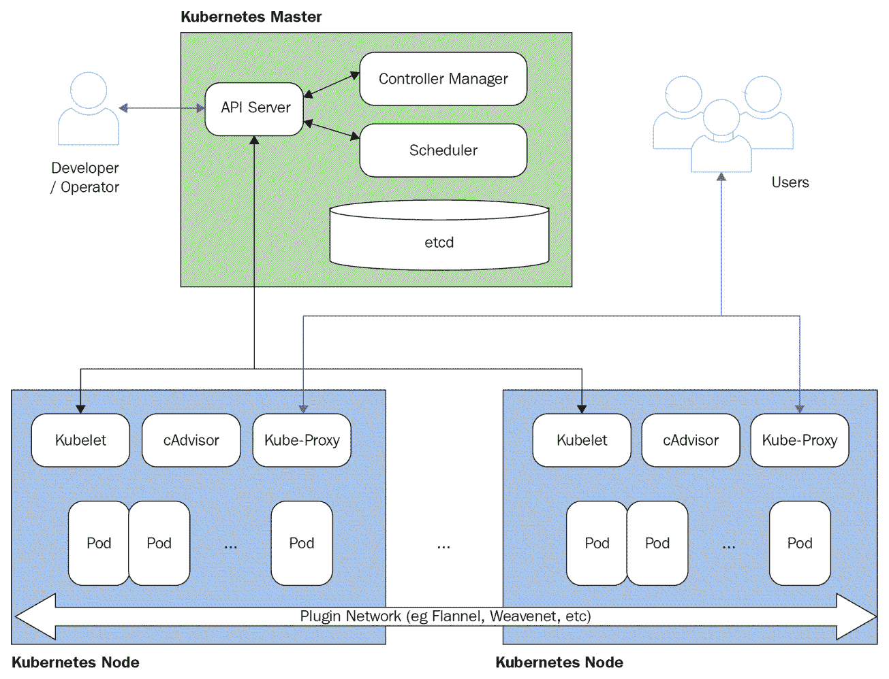
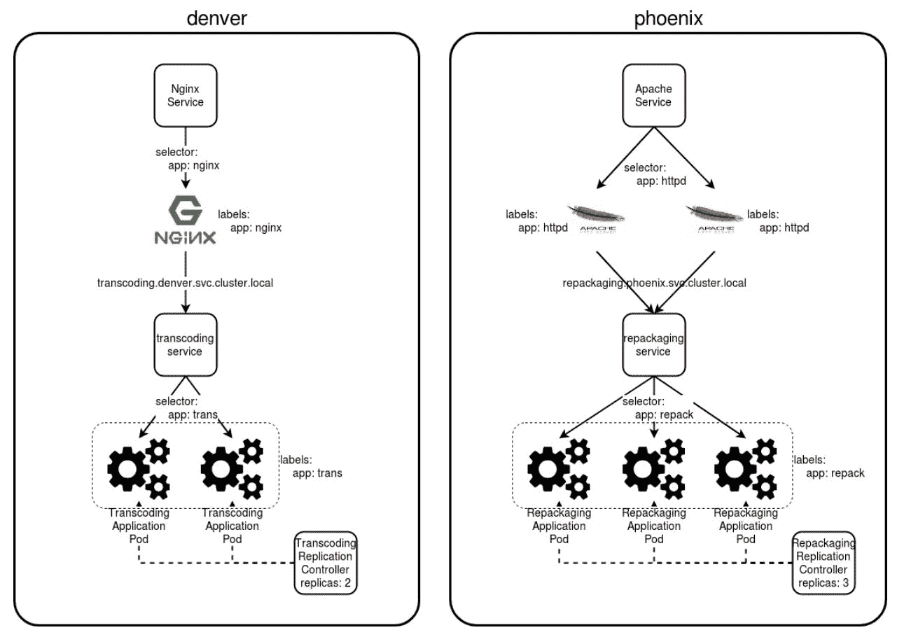
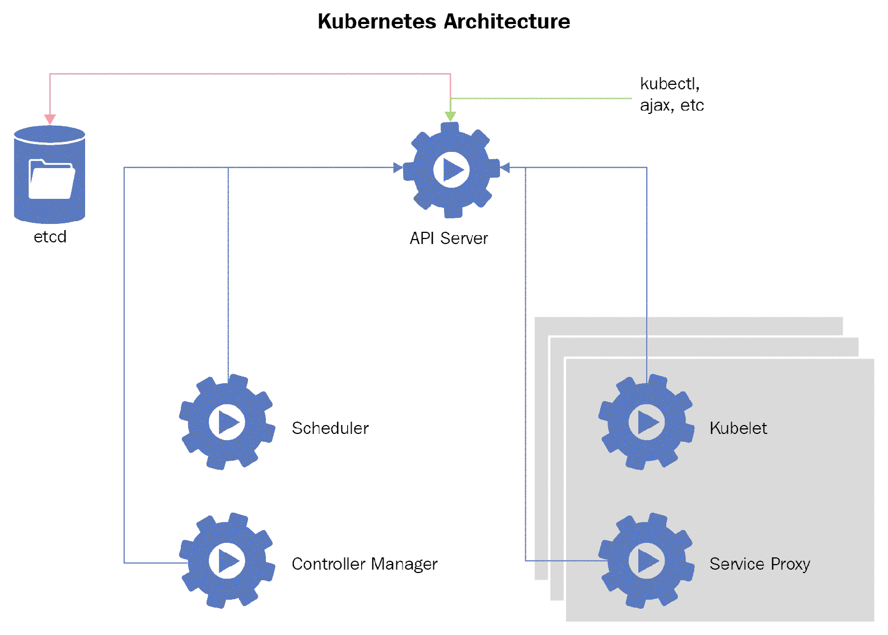
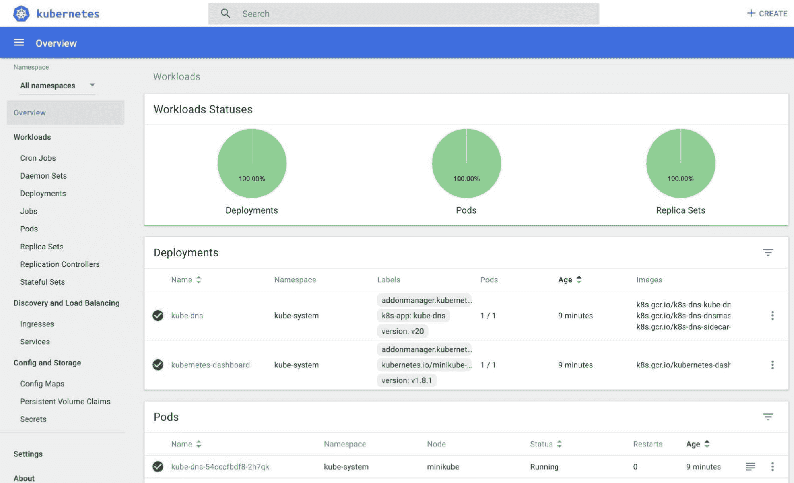

# 第二章：Kubernetes 概述

在上一章中，我们讨论了容器架构，使用了 Docker 镜像和容器，查看了不同的 Docker 注册表，学习了如何管理容器的持久存储，最后，学习了如何使用 Dockerfile 构建自己的 Docker 镜像。所有这些技能将在 第三章，“*CRI-O 概述*”中使用到，届时我们将开始使用 Kubernetes。Kubernetes 是 OpenShift 中的一个关键组件。一切就像滚雪球一样：Kubernetes 需要 Docker 技能，OpenShift 需要 Kubernetes 技能。

在分布式环境中进行容器管理是困难的，但 Kubernetes 使其变得容易。这篇简短的 Kubernetes 介绍将让你了解 Kubernetes 是什么，以及它是如何工作的。在本章中，你将学习如何使用简化的方法安装和配置 Kubernetes 集群。我们还将解释容器管理的基础知识，包括一些关于 pods、services 和 routes 的理论。我们将向你展示如何在 Kubernetes 集群中部署应用程序。

由于在我们的实验环境中只有一个 Kubernetes 节点，因此我们将在本章中交替使用 Kubernetes 集群和 Minikube 虚拟机的术语。

在本章中，我们将关注以下内容：

+   容器管理系统概述

+   Kubernetes 与 Docker Swarm 的区别

+   Kubernetes 关键概念

+   Kubernetes 安装与配置

+   使用 kubectl

+   清理虚拟环境

+   Kubernetes 限制

# 技术要求

在本章中，我们将使用以下技术和软件：

+   Minikube

+   Bash Shell

+   GitHub

+   Kubernetes

+   Docker

+   Firefox

你需要在笔记本电脑或任何其他虚拟环境中安装 Minikube。所有关于安装 Minikube 的指令可以在 [`kubernetes.io/docs/tasks/tools/install-minikube/`](https://kubernetes.io/docs/tasks/tools/install-minikube/) 找到。

本章的所有代码都可以在 GitHub 上找到：[`github.com/PacktPublishing/Learn-OpenShift`](https://github.com/PacktPublishing/Learn-OpenShift)。

Bash Shell 将作为虚拟环境的一部分使用。

可以使用 Firefox 或任何其他浏览器来浏览 Docker Hub。

# 容器管理系统概述

与虚拟化相比，容器在密度、部署速度和可扩展性方面提供了无与伦比的优势。但仅凭容器本身并不足以满足现代业务的所有需求，今天的业务期望基础设施能够适应动态挑战。启动和管理几十个容器相对简单，但当容器数量增加到数百个时，问题就变得复杂起来，这在大型工作负载中非常常见。这就是**容器编排引擎**（**COE**）发挥作用的地方。它们为容器带来了真正的力量，提供了多种机制来快速部署、销毁和扩展多个容器。

目前有多种容器管理解决方案，其中最流行的是 Kubernetes 和 Docker Swarm：

+   **Kubernetes**：Kubernetes 于 2015 年 7 月首次发布，源自 Google 开发的集群管理和作业调度系统 Borg。Kubernetes 也是由 Google 工程师开发的；实际上，许多曾在 Borg 项目中工作的开发人员后来转而参与 Kubernetes 的开发。与 Docker 一样，Kubernetes 是用 Go 语言编写的，而 Go 语言也是 Google 于 2007 年设计和实现的。它围绕资源的概念构建——复杂的 API 实体，作为底层机制的接口，并以 YAML 或 JSON 格式序列化。所有软件组件都运行在两种类型的机器上：主节点和工作节点。主节点负责管理、调度和同步功能，而工作节点为容器的运行提供运行环境。

+   **Docker Swarm**：Docker Swarm 是由 Docker 项目提供的原生容器编排解决方案。它具备 Kubernetes 提供的许多功能，但使用不同的机制，并可用于快速部署单个服务或甚至一组服务到工作节点上。Swarm 集群由两种类型的节点组成：管理节点和工作节点。管理节点控制容器的位置，在 Swarm 术语中称为*任务*，工作节点负责容器的实际运行。

# Kubernetes 与 Docker Swarm

Kubernetes 和 Docker Swarm 是最常用的编排框架。它们提供了一套相似的功能，基本上解决了相同的问题——在不安全且高度动态的环境中管理容器。虽然它们的一些功能有重叠，但也存在显著差异，系统的选择取决于许多因素，例如容器数量、可用性要求和团队专业知识等。

表格展示了最重要的差异：

| **Kubernetes** | **Docker Swarm** |
| --- | --- |
| 一个具有独立依赖关系的单独模块化设计项目。 | 开箱即用的原生容器编排解决方案。 |
| 学习曲线较陡峭，因为涉及新的概念和复杂的架构。 | 容易上手；使用熟悉的术语；更轻量。 |
| Pod 是一个最小的部署单元，表示一组容器。与其他应用程序的集成通过服务完成，在此情况下，服务表示一个一致的`IP:port`对。 | 应用程序以容器作为服务的形式，在整个集群或一部分工作节点中使用标签进行部署。 |
| 通过部署/复制控制器支持自动扩展，方法是指定所需的 Pod 数量。`HorizontalPodAutoscaler`资源提供考虑 CPU 利用率的动态自动扩展。 | 系统本身不支持自动扩展，但仍然可以进行手动扩展。 |
| 持久存储层分为两个组件，PVs 和 PVCs，它们根据请求动态绑定在一起，可以用于实现共享存储。 | 存储卷直接挂载到容器中。 |
| 新的主节点可以加入现有的集群，但不支持节点的提升/降级。 | 工作节点可以轻松地提升为管理节点，反之亦然。 |
| 服务根据它们所创建的项目和名称被分配唯一的 DNS 名称，因此每个服务可以通过其名称而无需域名来访问同一命名空间中的其他服务。 | 每个服务都会在内部 DNS 中注册，名称仅基于服务本身的名称。 |

# Kubernetes 核心概念

像任何复杂的系统一样，Kubernetes 集群可以从多个角度进行观察。从基础设施的角度来看，它由两组节点组成；这些节点可以是裸金属服务器，也可以是虚拟机：

+   **主节点**：

这种类型的节点负责集群管理、网络分配、配额执行、同步和通信。主节点作为客户的主要联系点——无论是实际的用户还是外部系统。在最简单的设置中，集群中只有一个主节点，但高可用集群需要至少两个主节点，以防止常见的故障情况。主节点运行的最重要的服务是 API。

+   **节点**：

节点实际执行托管 Docker 容器的工作。更具体地说，节点为运行 Pod 提供运行时环境，Pod 将在本书后面进行描述。这些服务器运行 kubelet 服务以管理 Pod：



Kubernetes 架构

从逻辑上讲，Kubernetes API 提供了许多资源，允许你使用 Kubernetes 提供的各种机制，同时抽象一些底层实现细节。这些资源可以使用 YAML 或 JSON 格式定义。以下是其中的一些：

+   **命名空间**：这些资源的目的是在多租户环境中分隔用户和其项目的组织单元。此外，它们还用于更细粒度的访问控制和配额执行。几乎所有 Kubernetes 资源，除了卷和命名空间本身，都是基于命名空间的，这意味着它们的名称在任何给定的命名空间中必须是唯一的。

+   **Pod**：Pod 代表一组容器，每个 Pod 是 Kubernetes 中的基本管理单元。Pod 中的所有容器共享相同的存储卷和网络。

+   **服务**：它们代表客户端与运行在 Pod 中的实际应用之间的接口。一个服务是一个`IP:端口`对，它将流量以轮询的方式转发到后端 Pod。拥有一个一致的地址和端口可以避免客户端需要跟随集群中任何瞬时的变化。

+   **复制控制器**（**RC**）：简而言之，这些资源定义了必须复制的 Pod 数量。它们的定义包括描述要启动的 Pod 的 Pod 模板，每个 RC 包含的一个参数是要维护的副本数。如果由于某种原因一个或多个 Pod 宕机，Kubernetes 将启动新的 Pod 以满足这个数量。

+   **持久卷**（**PV**）：这些资源抽象了实际的物理存储系统，无论是 NFS、iSCSI 还是其他什么。通常，它们由集群管理员创建，并可以通过 PVC 绑定机制挂载到 Pod 内，后者将在后文中提到。

+   **持久卷声明**（**PVC**）：PVC 代表对存储资源的请求。Pod 定义不会直接使用 PV，而是通过 Kubernetes 将 PV 与 PVC 绑定来实现。

+   **Secrets（机密）**：用于在 Pod 内部传递敏感数据，如密钥、令牌和密码。

+   **标签**：标签提供了一种通过选择器作用于一组资源的机制。例如，服务使用选择器来指定将流量转发到哪些 Pod。当使用相同标签启动新的 Pod 时，它们会动态地与在其定义中指定该标签作为选择器的服务关联。

这是一个示例场景，其中有两个团队分别位于丹佛和凤凰城，并且拥有独立的命名空间。选择器、标签和副本数使用与实际 YAML 定义中的服务、Pod 和复制控制器相同的表示法来指定：



Kubernetes 资源

从服务的角度来看，Kubernetes 可以表示为一组相互作用的服务：

+   这些服务通常运行在主节点上：

    +   `etcd`：这是一个分布式的键值配置存储，用于存储所有元数据和集群资源。由于其仲裁模型，建议您运行一个奇数数量的 etcd 节点，最少从三个节点开始，以确保高可用性。

    +   `kube-apiserver`：暴露 Kubernetes API 给客户端的服务。由于其无状态特性，它可以通过水平扩展的方式部署为高可用配置。

    +   `kube-scheduler`：控制新创建 Pod 在节点上的分配的组件。此过程考虑了硬件/策略限制、数据本地性和亲和性规则等因素。值得注意的是，从集群的角度来看，主节点与其他节点没有区别，因此可以有资格运行 Pod，尽管最佳实践建议不要给主节点增加额外的负担，而应将它们仅用于管理功能。

    +   `kube-controller-manager`：运行各种控制器的组件——其中一些是副本控制器，用于保持所需数量的运行中 Pod，节点控制器用于发现已下线的节点，卷控制器用于将 PV 与 PVC 绑定，以及一个端点控制器，用于将服务和 Pod 绑定在一起。

    +   `cloud-controller-manager`：提供与底层云提供商（如 DigitalOcean 和 Oracle Cloud Infrastructure）集成的服务。

+   这些服务通常在节点上运行：

    +   **kubelet**：该服务使用 Pod 规范来管理其 Pod，并进行定期的健康检查。

    +   **kubeproxy**：该组件通过提供 TCP 和 UDP 转发能力，在一组后端 Pod 之间实现服务抽象。

    +   **容器运行时环境**：该组件在 Kubernetes 中由底层容器技术表示。写本文时，Kubernetes 支持 docker 和 rkt 作为运行时：



Kubernetes 服务

# Kubernetes 安装与配置

在本章中，你将安装 Minikube——一个简单的单节点 Kubernetes 集群。虽然它不适用于生产环境工作负载，但它是一个快速学习集群管理基础的有用工具。虽然它支持多种虚拟机提供商的驱动程序，但在本教程中我们将使用 KVM2 驱动程序，因为 KVM 虚拟化甚至可以在基础的 Linux 环境中使用。

最简单的方法是访问[`kubernetes.io/docs/getting-started-guides/minikube/`](https://kubernetes.io/docs/getting-started-guides/minikube/)，并在你喜欢的操作系统上安装 Minikube。然后访问[`kubernetes.io/docs/tasks/tools/install-kubectl/`](https://kubernetes.io/docs/tasks/tools/install-kubectl/)，安装`kubectl`。`kubectl`是管理 Kubernetes 的 CLI 命令。完成后，到了启动 Minikube 的时候：

```
$ minikube start
Starting local Kubernetes v1.9.0 cluster...
Starting VM...
Downloading Minikube ISO
...
<output omitted>
...
Kubectl is now configured to use the cluster.
Loading cached images from config file.
```

下载和设置阶段完成后，使用`minikube`命令检查你的 Kubernetes 集群状态：

```
$ minikube status
minikube: Running
cluster: Running
kubectl: Correctly Configured: pointing to minikube-vm at 192.168.99.101
```

使用`kubectl`命令检查 Kubernetes 集群状态：

```
$ kubectl cluster-info
Kubernetes master is running at https://192.168.99.101:8443
```

我们还可以打开浏览器或使用 curl 命令来验证 Kubernetes API：

```
$ curl https://192.168.99.101:8443
{
"kind": "Status",
"apiVersion": "v1",
"metadata": {
},
"status": "Failure",
"message": "Unauthorized",
"reason": "Unauthorized",
"code": 401
}
```

Kubernetes 附带了一个漂亮的仪表盘，提供美观的图形用户界面，可以通过 HTTP 在`30000`端口访问（例如，`http://192.168.99.100:30000/`）。你可以使用我们用于集群验证的相同 IP 打开浏览器：



Kubernetes 图形用户界面

目前没有太多可以查看的内容，因为我们简单的集群只有一个节点、一个服务和三个默认的命名空间。这是管理 Kubernetes 的一种方式，但为了有效使用其所有功能并排除问题，你需要熟悉使用 CLI，这也是下一节的内容。

# 使用 kubectl

Kubectl 是一个用于管理 Kubernetes 集群及其资源的命令行接口。在本节中，你将学习到最常用的命令及其使用场景。

所有命令的语法遵循以下约定：

```
$ kubectl <COMMAND> <RESOURCE_TYPE> <RESOURCE_NAME> <OPTIONS>
```

括号中的命令`<>`表示以下内容：

+   `COMMAND`：要对一个或多个资源执行的操作。

+   `RESOURCE_TYPE`：要操作的资源类型，例如 Pod 或服务。

+   `RESOURCE_NAME`：要管理的资源名称。

+   `OPTIONS`：用于修改 kubectl 命令行为的各种标志。它们的优先级高于默认值和环境变量，因此会覆盖它们。

# 获取帮助

kubectl 有数百个不同的子命令、选项和参数。幸运的是，kubectl 有非常好的帮助选项。第一个是手册页。如果你使用的是 macOS 或 Linux，可以运行`man-f kubectl`命令查看与 kubectl 相关的手册页：

```
$ man -f kubectl
kubectl(1) - kubectl controls the Kubernetes cluster manager
kubectl-alpha(1), kubectl alpha(1) - Commands for features in alpha
kubectl-alpha-diff(1), kubectl alpha diff(1) - Diff different versions of configurations
...
<output omitted>
...
```

如果由于某些原因你无法在系统上使用手册页，可以直接运行`kubectl`命令而不带任何选项或参数。它会显示可用子命令的列表：

```
$ kubectl
kubectl controls the Kubernetes cluster manager.
Find more information at https://github.com/kubernetes/kubernetes.
Basic Commands (Beginner):
  create Create a resource from a file or from stdin.
  expose Take a replication controller, service, deployment or pod and expose it as a new Kubernetes Service
...
<output omitted>
...
Basic Commands (Intermediate):
 get Display one or many resources
 explain Documentation of resources
...
<output omitted>
...
Use "kubectl <command> --help" for more information about a given command.
Use "kubectl options" for a list of global command-line options (applies to all commands)
```

下一步是通过运行`kubectl <command>`或`kubectl <command> --help`命令来检查可用资源的列表，例如，`kubectl get`：

```
$ kubectl get
  * all
  * certificatesigningrequests (aka 'csr')
  * clusterrolebindings
...
<output omitted>
...
Use "kubectl explain <resource>" for a detailed description of that resource (e.g. kubectl explain pods).
See 'kubectl get -h' for help and examples.

```

如你所见，你还可以通过运行`kubectl get -h`来获取`kubectl get`命令的示例，并通过运行`kubectl explain pods`来获取详细的资源解释。`kubectl`命令非常易于操作和使用。

# 使用 kubectl get 命令

第一个必不可少的命令是`kubectl get nodes`。它会告诉我们可用的 Kubernetes 节点数量：

```
$ kubectl get nodes
NAME      STATUS  ROLES   AGE   VERSION
minikube   Ready   <none> 2h    v1.9.0
```

在我们的案例中，节点数将等于 1，因为我们使用的是一个虚拟机进行实践。正如我们之前提到的，为了让不同的项目能够在同一或不同的节点上共存，使用了命名空间。你可能会猜到，我们应该使用的命令是`kubectl get namespaces`：

```
$ kubectl get namespaces
NAME          STATUS   AGE
default       Active   15h
kube-public   Active   15h
kube-system   Active   15h
```

它会告诉你，在使用 Minikube 安装 Kubernetes 时，默认有三个命名空间可用：

| **名称       **                           | **描述** |
| --- | --- |
| `default` | 所有没有指定命名空间的资源所在的命名空间。当没有指定命名空间时，使用此命名空间。 |
| `kube-public` | 用于必须对未认证用户公开的资源。 |
| `kube-system` | 顾名思义，它是 Kubernetes 内部使用的，处理所有系统资源。 |

这里最后一个主要缺失的组件是 pods；如前所述，pods 代表一组容器，pod 是 Kubernetes 中的基本管理单元。在我们的案例中，pods 是 Docker 容器。目前我们还没有任何正在运行的 pods，可以通过运行 `kubectl get pods` 来轻松验证：

```
$ kubectl get pods
No resources found.
```

它显示 `No resources found`，这是因为 pod 是 Kubernetes 资源，类似于我们在本书中将要介绍的其他资源。

与 `kubectl get pods` 类似，您可以获取任何其他 Kubernetes 资源的状态。我们将在本章稍后讨论其他 Kubernetes 资源。

# 运行 Kubernetes pods

与 Docker 一样，我们可以使用 `kubectl run` 命令来运行一个 Kubernetes pod。让我们从一个简单的 Web 服务器示例开始：

```
$ kubectl run httpd --image=httpd
```

我们可以通过运行 `kubectl get pods` 命令来验证结果，获取 Kubernetes pods 的列表：

```
$ kubectl get pods
NAME                      READY    STATUS    RESTARTS    AGE
httpd-8576c89d7-qjd62      1/1     Running    0          6m
```

当您第一次运行此命令时，您可能会看到 Kubernetes pod 状态显示为 `ContainerCreating`。发生的情况是 Docker httpd 镜像正在下载到 Minikube VM 上。请耐心等待，给它一些时间下载镜像。几分钟后，您应该能看到容器状态为 `Running`。

`kubectl run` 命令不仅仅是下载一个镜像并从中运行一个容器。我们将在本章后面讲解这个。

`8576c89d7-qjd62` 部分是自动生成的。我们将在本章后面讨论这个。

实际上，这个 pod 是 Minikube VM 中的一个 Docker 容器，我们可以轻松验证这一点。首先，我们需要使用 `minikube ssh` 登录到 Minikube VM，然后运行 `docker ps` 命令：

```
$ minikube ssh
$
$ docker ps
CONTAINER ID IMAGE COMMAND CREATED STATUS PORTS NAMES
c52c95f4d241 httpd "httpd -g 'daemon ..." 12 minutes ago Up 12 minutes k8s_httpd-container_httpd_default_39531635-23f8-11e8-ab32-080027dcd199_0
...
<output omitted>
...
```

我们可以尝试杀掉这个 httpd Docker 容器，但 Kubernetes 会自动启动一个新的容器：

```
$ docker rm -f c52c95f4d241   
```

再次检查容器状态：

```
$ docker ps
CONTAINER ID IMAGE COMMAND CREATED STATUS PORTS NAMES
5e5460e360b6 httpd "httpd -g 'daemon ..." 5 seconds ago Up 5 seconds k8s_httpd-container_httpd_default_4f5e05df-2416-11e8-ab32-080027dcd199_0
$ exit
```

请注意，httpd 容器仍然在运行，但具有另一个 ID。初始的 ID 是 `c52c95f4d241`，现在变成了 `5e5460e360b6`（您将看到其他 ID）。这就是 Kubernetes 的一个优点：如果一个容器挂掉，Kubernetes 会自动启动一个新的。我们将在本章稍后详细讨论这个问题。

# 描述 Kubernetes 资源

我们可以通过运行 `kubectl describe` 命令快速查看该 pod 的内部信息：

```
$ kubectl describe pod httpd-8576c89d7-qjd62
Name: httpd
Namespace: default
Node: minikube/192.168.99.101
Start Time: Sat, 10 Mar 2018 00:01:33 -0700
Annotations: <none>
Status: Running
IP: 172.17.0.4
...
<output omitted>
...
```

它为我们提供了足够的信息，以便在必要时高效地定位 pod 并进行适当的故障排除。在我们的案例中，我们可以 ssh 登录到 Minikube VM 并运行 curl 命令，检查 pod 是否正确运行 Web 服务器。

您可能需要为 `curl` 命令使用另一个 IP 地址；在我们的案例中，它是 `172.17.0.4`，这是从 `kubectl describe` 命令的输出中获取的。

```
$ minikube ssh
$
$ curl 172.17.0.4
<html><body><h1>It works!</h1></body></html>
$ exit
```

请注意，这个 pod 仅在 Kubernetes 集群内可访问。这就是为什么我们需要登录到 Minikube VM 的原因。如果我们尝试从本地 PC 访问这个地址，它将无法工作。我们将在接下来的部分中讨论这个问题。

# 编辑 Kubernetes 资源

我们还可以使用 `kubectl edit pod httpd-8576c89d7-qjd62` 编辑正在运行的容器的属性。此时我们不会更改任何内容，但你可以尝试在我们删除容器之前更改某些内容。我们将在后续章节中与 OpenShift 一起使用编辑命令。

`kubectl edit` 命令默认使用 vi 编辑器。如果你不熟悉这个文本编辑器，建议先学习如何使用 vi，否则可能会遇到麻烦。

另一个小技巧是，通过运行 `export EDITOR=nano` 来更改编辑器，其中 nano 是你喜欢的文本编辑器。

同样，你可以编辑其他任何 Kubernetes 资源。我们将在本章后面讨论其他 Kubernetes 资源。

# 暴露 Kubernetes 服务

当我们使用 `kubectl run` 命令运行一个 Pod 时，这个 Pod 只对 Kubernetes 内部可访问。在大多数情况下，我们希望这个 Pod 也能从外部访问。这时 `kubectl expose` 命令就派上用场了。让我们再创建一次 httpd Pod，然后将其暴露到外部：

```
$ kubectl run httpd --image=httpd

$ kubectl get pods
NAME READY STATUS RESTARTS AGE
httpd-66c6df655-8h5f4 1/1 Running 0 27m
```

现在，让我们使用 `kubectl expose` 命令，将 httpd Web 服务器暴露到 Kubernetes 外部：

```
$ kubectl expose pod httpd-66c6df655-8h5f4 --port=80 --name=httpd-exposed --type=NodePort
```

使用 `kubectl expose` 命令时，我们指定了几个选项：

+   `port`：我们将要暴露到 Kubernetes 集群外部的 Pod（Docker 容器）端口。

+   `name`：Kubernetes 服务名称。

+   `type`：Kubernetes 服务类型。NodePort 使用 Kubernetes 节点 IP。

获取暴露的 Kubernetes 服务列表的命令是 `kubectl get services`：

```
$ kubectl get services
NAME         TYPE     CLUSTER-IP   EXTERNAL-IP   PORT(S)      AGE
kubernetes   ClusterIP 10.96.0.1    <none>     443/TCP         1d
httpd-exposed NodePort 10.110.40.149<none>     80:31395/TCP    3s
```

请注意，端口 `80` 映射到了 Minikube 虚拟机上的动态端口 `31395`。该端口在 `30000–32767` 范围内动态选择。

此外，还有一个 `ClusterIP` 字段，IP 地址为 `10.110.40.149`，这是为 `httpd-expose` 服务分配的。暂时不用关注这个内容，我们将在本书后面讨论这个问题。

最后，使用 `curl` 检查 httpd 服务器是否可以从 Kubernetes 集群外部访问：

```
$ curl 192.168.99.101:31395
<html><body><h1>It works!</h1></body></html>
```

如果你在网页浏览器中打开这个链接，你应该能在网页上看到`It works!`。

# 使用 Kubernetes 标签

当你的应用程序由一个 Pod 和一个服务组成时，操作这些资源没有问题。但当应用程序规模扩大，或者你有数十个甚至数百个项目、Pods、服务和其他 Kubernetes 资源时，操作和有效地排查问题就会变得更加困难。此时，我们可以使用本章前面提到的 Kubernetes 标签。我们将使用标签再运行几个 Kubernetes Pods：

```
$ kubectl run httpd1 --image=httpd --labels="app=httpd-demo1"
$ kubectl run httpd2 --image=httpd --labels="app=httpd-demo2"

```

检查我们目前的 Kubernetes Pods：

```
$ kubectl get pods
NAME READY STATUS RESTARTS AGE
httpd-8576c89d7-qjd62 1/1 Running 0 17m
httpd1-c9f7d7fd9-rn2nz 1/1 Running 0 21s
httpd2-5b4ff5cf57-9llkn 1/1 Running 0 15s
```

现在，假设你有至少 10 个或更多 Pods。为了高效地筛选输出结果，我们可以使用 `-l` 选项：

```
$ kubectl get pods -l="app=httpd-demo2"
NAME                   READY       STATUS      RESTARTS       AGE
httpd2-5b4ff5cf57-9llkn 1/1         Running    0              2m
```

使用 Kubernetes 标签筛选输出并非唯一的应用场景。标签还与选择器一起使用。您可以通过 Kubernetes 官方文档了解这两个话题，文档地址：[`kubernetes.io/docs/concepts/overview/working-with-objects/labels/`](https://kubernetes.io/docs/concepts/overview/working-with-objects/labels/)。

# 删除 Kubernetes 资源

如果我们对 pod 做错了什么，或者它可能因为某种原因崩溃了，可以通过`kubectl delete pod`命令轻松删除该 pod：

```
$ kubectl delete pod httpd-8576c89d7-qjd62
pod "httpd-8576c89d7-qjd62" deleted
```

我们可以使用`--all`选项删除所有 pod：

```
$ kubectl delete pod --all
pod "httpd-8576c89d7-qjd62" deleted
pod "httpd1-c9f7d7fd9-rn2nz" deleted
pod "httpd2-5b4ff5cf57-vlhb4" deleted
```

请注意，如果你运行`kubectl get pods`，你会看到所有的容器再次运行。原因在于，当我们运行`kubectl run`命令时，它会创建多个不同的 Kubernetes 资源，这些资源将在接下来的部分中讨论。

我们可以通过运行`kubectl delete all`命令并加上`-l`选项来删除 Kubernetes 资源：

```
$ kubectl delete all -l app=httpd-demo1
deployment "httpd1" deleted
pod "httpd1-c9f7d7fd9-d9w94" deleted

$ kubectl get pods
NAME READY STATUS RESTARTS AGE
httpd-8576c89d7-qjd62 1/1 Running 0 17m
httpd2-5b4ff5cf57-9llkn 1/1 Running 0 15s
```

此命令将只删除带有`httpd-demo1`标签的所有 Kubernetes 资源。其他两个 pod 仍然可用。

或者，我们可以通过运行`kubectl delete all --all`命令删除所有已创建的 Kubernetes 资源：

```
$ kubectl delete all --all
deployment "httpd" deleted
deployment "httpd2" deleted
pod "httpd-8576c89d7-ktnwh" deleted
pod "httpd2-5b4ff5cf57-t58nd" deleted
service "kubernetes" deleted
service "nginx-exposed" deleted
```

# Kubernetes 高级资源

当我们使用`kubectl run`命令创建应用程序时，它会处理多个任务。让我们再运行一次这个命令来创建一个 httpd pod，并深入了解背后实际发生了什么：

```
$ kubectl run httpd1 --image=httpd
```

我们可以通过运行`kubectl get events`命令来查看在此过程中发生的一系列事件。它会展示 Kubernetes 在幕后启动应用程序时所做的所有操作。你会看到一个相当长的列表，乍一看可能会让人困惑，但我们可以通过以下命令缩小范围：

```
$ kubectl get events --sort-by=.metadata.creationTimestamp | tail -n 8
4s 4s ... kubelet, minikube pulling image "httpd"
4s 4s ... replicaset-controller Created pod: httpd1-6d8bb9cdf9-thlkg
4s 4s ... default-scheduler Successfully assigned httpd1-6d8bb9cdf9-thlkg to minikube
4s 4s ... deployment-controller Scaled up replica set httpd1-6d8bb9cdf9 to 1
4s 4s ... kubelet, minikube MountVolume.SetUp succeeded for volume "default-token-dpzmw"
2s 2s ... kubelet, minikube Created container
2s 2s ... kubelet, minikube Successfully pulled image "httpd"
2s 2s ... kubelet, minikube Started container
```

我们使用`kubectl get events`命令并加上`--sort-by=.metadata.creationTimestamp`选项来按时间戳排序事件。如果没有使用此选项，事件将会乱序。

我们主要关注每一行的最后两个字段，它们分别是`SOURCE`和`MESSAGE`。如果我们从上到下阅读事件序列，会看到一个 Kubernetes 组件告诉另一个组件在 Minikube VM 上创建名为`httpd1-6d8bb9cdf9-thlkg`的 pod，并且这一过程最终发生了。让我们来描述一下这些组件：

+   `replicaset-controller`：有时候我们需要多个`httpd` pod 来处理应用程序的所有负载。ReplicaSet 确保一定数量的 pod 正在运行并可用。ReplicaSet 由 Deployment 控制器管理。

+   `default-scheduler`：决定将特定的 pod 运行在哪个节点上。在我们的例子中，它是 Minikube VM。

+   `deployment-controller`：定义 Kubernetes 资源的期望状态。在我们的例子中，它是`httpd` pod 的状态。Deployment 控制器还会指示 ReplicaSet 确保某些 pod 正在运行。

如前所述，`kubectl run` 命令会创建其他 Kubernetes 资源，包括 ReplicaSet 和 Deployment。我们可以通过分别运行 `kubectl get replicaset` 和 `kubectl get deployment` 来验证这一点：

```
$ kubectl get deploy
NAME DESIRED CURRENT UP-TO-DATE AVAILABLE AGE
httpd1 1 1 1 1 38m

$ kubectl get rs
NAME DESIRED CURRENT READY AGE
httpd1-6d8bb9cdf9 1 1 1 38m
```

我们提到过，Deployment 控制器定义了多少个 `httpd` Pods 运行。默认情况下，这个数量是 `1`。我们可以轻松改变这个行为，并使用 `kubectl edit deploy httpd1` 命令编辑 Deployment 配置：

```
$ kubectl edit deploy httpd1 ...
<output omitted>
...
spec:
 replicas: 1 # change this value to 3
...
<output omitted>
...
```

一旦你将副本值更改为 `3`，保存更改并退出编辑模式。Deployment 控制器将检测到配置中的变化，并指示 ReplicaSet 启动两个新的 `httpd` Pods。让我们验证一下：

```
$ kubectl get pods
NAME                    READY STATUS   RESTARTS      AGE
httpd1-6d8bb9cdf9-hqks6  1/1   Running   0           5s
httpd1-6d8bb9cdf9-thlkg  1/1   Running   0           48m
httpd1-6d8bb9cdf9-xwmmz  1/1   Running   0           5s
```

如果我们尝试删除所有的 Pods，ReplicaSet 会自动启动一组新的 Pods。让我们再看一遍它是如何工作的：

```
$ kubectl delete pods --all
pod "httpd1-6d8bb9cdf9-hqks6" deleted
pod "httpd1-6d8bb9cdf9-thlkg" deleted
pod "httpd1-6d8bb9cdf9-xwmmz" deleted

$ kubectl get pods
NAME READY STATUS RESTARTS AGE
httpd1-6d8bb9cdf9-7nx7k 1/1 Running 0 16s
httpd1-6d8bb9cdf9-gsxzp 1/1 Running 0 16s
httpd1-6d8bb9cdf9-skdn9 1/1 Running 0 16s
```

在我们进入下一章节之前，删除所有 Kubernetes 资源：

```
$ kubectl delete all --all 
```

# 使用 YAML 和 JSON 文件创建 Kubernetes 服务

你也可以使用 YAML 和 JSON 文件手动创建 Kubernetes 资源。我们来创建一个简单的运行 httpd Web 服务器的 Pod，使用 `kubectl create` 命令。我们需要创建一个 YAML 格式的文件：

```
$ cat httpd-pod.yaml
apiVersion: v1
kind: Pod
metadata:
  name: httpd
  namespace: default
spec:
  containers:
  - name: httpd-container
    image: httpd
    ports:
    - containerPort: 80
```

阅读 YAML 和 JSON 格式的文件对 Kubernetes 和后续的 OpenShift 章节至关重要。如果你不熟悉 YAML 或 JSON 文件，建议学习相关内容。请查阅 *进一步阅读* 部分获取更多信息。

这看起来可能有点复杂，难以理解，但随着我们在本书中继续前进，你会发现这些 YAML 和 JSON 文件之间有很多相似之处。

YAML 配置文件结构非常明确，每个资源都是一组键值对。你可以使用 Kubernetes API 文档来了解每个参数的作用：[`kubernetes.io/docs/reference/generated/kubernetes-api/v1.9/`](https://kubernetes.io/docs/reference/generated/kubernetes-api/v1.9/)。

使用 `httpd-pod.yaml` 文件创建一个 Pod：

```
$ kubectl create -f httpd-pod.yaml

$ kubectl get all
NAME        READY       STATUS     RESTARTS     AGE
po/httpd    1/1         Running       0         25s

NAME            TYPE     CLUSTER-IP    EXTERNAL-IP PORT(S) AGE
svc/kubernetes ClusterIP 10.96.0.1     <none>     443/TCP  56s

```

这个命令创建了一个名为 `httpd` 的 Pod；它不会创建其他任何内容。在涉及大量自动化的更大部署中，这是部署 Kubernetes 资源的方式，但这当然需要更好的 Kubernetes 技能。

同样，我们也可以创建其他 Kubernetes 资源，包括 ReplicaSet、Deployment 等。

# 清理虚拟环境

一旦你完成了 Kubernetes 的工作，你可以通过运行 `minikube stop` 命令轻松停止 Minikube 集群：

```
$ minikube stop
Stopping local Kubernetes cluster...
Machine stopped.
```

之后，如果你想删除 Minikube 虚拟机，可以运行 `minikube delete` 命令：

```
$ minikube delete
Deleting local Kubernetes cluster...
Machine deleted.
```

验证 Minikube 集群是否已不再存在：

```
$ minikube status
minikube:
cluster:
kubectl:
```

# Kubernetes 的限制

尽管 Kubernetes 是一个强大的编排引擎，但它没有像 OpenShift 等 PaaS 解决方案所常见的那些功能：

+   **安全性**：

Kubernetes 命名空间主要用于不同用户组的资源配额强制执行，但它们不提供任何安全约束或身份验证。例如，每个命名空间中的每个用户都可以看到所有其他命名空间及其资源。

+   **部署**：

Kubernetes 提供通过单个命令从镜像创建部署的方式，但不会为外部客户端创建服务。

+   **SCM 集成**：

Kubernetes 不支持通过 webhook 与 SCM 集成来促进部署。

+   **构建**：

Kubernetes 不提供高级构建模式，如**源到镜像**（**S2I**）和自定义构建器。

+   **身份验证**：

对于 LDAP、Google、GitHub、Keystone 或 Kerberos 等高级身份验证方案的支持，只有通过 webhook 或身份验证代理才能实现。

+   **CI/CD**：

Kubernetes 没有集成的应用生命周期支持，这使得它难以集成到企业软件交付框架中。

所有这些限制将在后续章节的 OpenShift 部分中得到解决。

# 总结

在本章中，我们简要讨论了 Kubernetes 的概念、Kubernetes 架构以及 Kubernetes 和 Docker Swarm 之间的主要区别。我们使用 Minikube 安装了 Kubernetes，这是一个非常易于使用的 CLI 工具，可以用来搭建 Kubernetes 实验环境。然后，我们使用`kubectl`命令执行了各种任务，如运行、编辑、描述和删除 Kubernetes 的 Pod 以及其他 Kubernetes 资源。最后，我们列出了 Kubernetes 的主要限制，后续章节中我们将对此进行讨论。

在下一章，我们将学习如何使用 CRI-O，它是一个通用容器运行时接口，允许 Kubernetes 为不同的容器平台提供支持。

# 问题

1.  Kubernetes 使用了哪两种节点类型？：

    1.  节点

    1.  Minikube

    1.  Vagrant

    1.  主节点

1.  Kubernetes 支持哪些容器平台？选择两个：

    1.  Docker

    1.  OpenShift

    1.  Rkt

    1.  Minishift

1.  在 Kubernetes 中，Pod 是最小的部署单位，表示一组容器：

    1.  正确

    1.  错误

1.  Kubernetes 节点上运行的主要两个服务是什么？选择两个：

    1.  etcd

    1.  kubelet

    1.  kube-proxy

    1.  kube-node

    1.  kube-apiserver

1.  使用`kubectl create -f`命令创建 Kubernetes 资源时，接受哪些文件格式？选择两个：

    1.  JSON

    1.  Jinja2

    1.  CSV

    1.  YANG

    1.  YAML

1.  Kubernetes 拥有内置的 CI/CD 工具集，以改善企业软件交付框架：

    1.  正确

    1.  错误

# 深入阅读

由于我们只涉及 Docker 容器的基础知识，您可能会有兴趣深入研究特定主题。以下是一些链接，您可以通过它们进一步了解 Docker 和容器的一般知识：

+   **Kubernetes 概念**：[`kubernetes.io/docs/concepts/`](https://kubernetes.io/docs/concepts/)

+   **Kubernetes CLI**：[`kubernetes.io/docs/reference/generated/kubectl/kubectl/`](https://kubernetes.io/docs/reference/generated/kubectl/kubectl/)

+   **Kubernetes 安装**：[`kubernetes.io/docs/setup/pick-right-solution/`](https://kubernetes.io/docs/setup/pick-right-solution/)

+   **Kubernetes 备忘单**：[`kubernetes.io/docs/reference/kubectl/cheatsheet/`](https://kubernetes.io/docs/reference/kubectl/cheatsheet/)

+   **Kubernetes API 概述**：[`v1-9.docs.kubernetes.io/docs/reference/generated/kubernetes-api/v1.9/`](https://v1-9.docs.kubernetes.io/docs/reference/generated/kubernetes-api/v1.9/)

+   **YAML 维基页面**：[`en.wikipedia.org/wiki/YAML`](https://en.wikipedia.org/wiki/YAML)

+   **YAML 语法检查**：[`www.yamllint.com/`](http://www.yamllint.com/)

+   **JSON 维基页面**：[`en.wikipedia.org/wiki/JSON`](https://en.wikipedia.org/wiki/JSON)

+   **JSON 语法检查**：[`jsonlint.com/`](https://jsonlint.com/)
