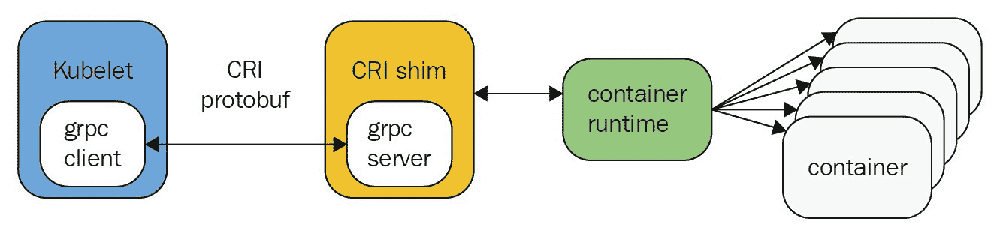
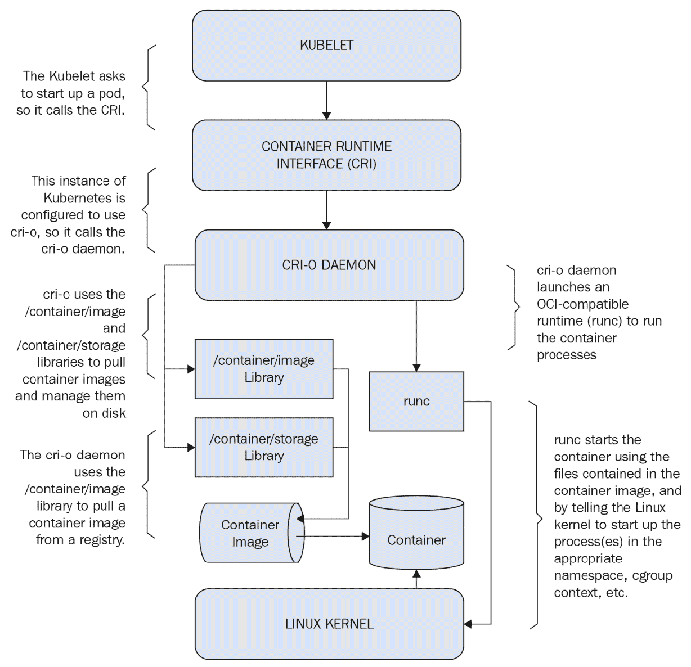

# CRI-O 概述

在上一章中，我们简要讨论了 Kubernetes 的概念、架构以及 Kubernetes 和 Docker Swarm 之间的主要区别。

本章的目标是让你对 Kubernetes 的替代容器运行时技术——CRI-O——有一个基本的了解。本章提供了关于容器运行时接口、开放容器倡议和 CRI-O 的基础知识，并描述了如何使用该技术管理容器。

阅读完本章后，你将对以下主题有一个扎实的理解：

+   容器运行时接口和开放容器倡议

+   CRI-O 如何与 Kubernetes 协作

+   安装并使用 CRI-O

# 技术要求

在本章中，我们将使用以下技术和软件：

+   Minikube

+   Bash Shell

+   GitHub

+   Kubernetes

+   Docker

+   Firefox

你需要在笔记本电脑或任何其他虚拟环境中安装 Minikube。关于如何安装 Minikube 的所有说明可以在[`kubernetes.io/docs/tasks/tools/install-minikube/`](https://kubernetes.io/docs/tasks/tools/install-minikube/)找到。

Bash Shell 将作为你的虚拟环境的一部分使用。

可以使用 Firefox 或任何其他浏览器浏览 Docker Hub。

# 容器运行时和容器运行时接口

在开始使用 CRI-O 之前，我们需要先谈谈基础知识。最好的起点就是容器运行时。我们已经知道什么是容器、Docker 和 Kubernetes 了。但这些是如何在底层工作的呢？以下图示展示了 Kubernetes 和容器之间通信的高层次概述：



Kubernetes 与容器的通信

如你所见，Kubernetes 并不是直接与容器通信的。图中有两个额外的层次。让我们来讨论一下为什么我们实际上需要它们：

+   **容器运行时**：每种容器技术，如 Docker、Rkt 或 Windows 容器，都有自己的运行时。简而言之，容器运行时是一组脚本和软件工具，用来运行和维护容器的工作。

+   **容器运行时接口（CRI）**：顾名思义，CRI 是一个接口，或者说是 Kubernetes 和容器运行时之间的一个适配层，换句话说。

你可能会问自己，*为什么我需要 CRI？为什么 Kubernetes 不能直接与容器运行时通信？*想象一下，Kubernetes 和容器运行时分别是一个经理和一个讲英语的员工，没问题。但假设有一个新员工，他是该领域的专家并被某个组织聘用，因此他们必须开始一起工作。然而，这个新员工只会讲俄语，现在就有了问题。现在，我们需要逐步增加更多讲不同语言的员工。你能明白我说的意思吧。在我们的情况下，我们有一些解决这个问题的方法：

1.  每次有新员工讲新语言时，经理必须学习一门新语言

1.  员工必须学习英语。

1.  为每一种新员工所讲的语言雇佣一个翻译员。

1.  雇佣一位能讲通用语言的翻译员。

尝试回答这个问题——在列出的四个选项中，最有效的选项是哪一个？我希望你能理解，选项 4 是最有效的。基于同样的原因，CRI 和 CRI-O 应运而生。沿用前面的类比，CRI 是选项 3，而 CRI-O 是选项 4。

# CRI-O 与 **开放容器倡议**（Open Container Initiative，OCI）

Kubernetes 最初只与 Docker 配合使用，但后来 CoreOS 推出的 Rkt 也进入了市场，他们希望 Kubernetes 能够支持它。因此，每增加一个容器运行时，你必须为其开发一个 CRI。如今，不同的容器技术经常被引入。这种解决方案并不具备良好的扩展性，还会给整个解决方案带来很多复杂性和不稳定性。

这就是 CRI-O 被引入的背景。CRI-O 代表 **OCI 兼容的容器运行时接口**，而 OCI 代表 **开放容器倡议**。开放容器倡议是一个开源社区项目，旨在为 Linux 容器设计开放标准。这使得 Kubernetes 可以使用任何其他符合 OCI 标准的容器运行时来运行 Pods。

# CRI-O 与 Kubernetes 的工作原理

当你想要使用 Kubernetes 启动或停止一个容器时，Kubernetes 会与 CRI-O 通信，CRI-O 再与符合 OCI 标准的容器运行时（如 Docker 使用的 runc）通信，启动容器。CRI-O 还可以拉取符合 OCI 标准的容器镜像并在磁盘上进行管理。对于容器开发人员来说，这个好消息是——他们无需直接与 CRI-O 打交道，因为 Kubernetes 会自动处理。但理解这个概念和整体架构仍然很重要：



CRI-O 架构

总结一下，在我们动手安装 CRI-O 之前，有几点需要注意：

+   Kubernetes 被配置为与 CRI-O 通信，以便在容器环境中启动一个新的 Pod。

+   CRI-O 从注册表中拉取符合 OCI 标准的容器镜像（如果需要），并在本地进行管理。

+   CRI-O 与符合 OCI 标准的容器运行时（默认为 `runc`）进行通信，并在 Kubernetes 节点上运行容器。

+   容器运行时通过与 Linux 内核进行交互，从容器镜像启动容器。

+   Linux 内核启动容器进程，例如不当的命名空间、组、上下文等。

+   每个容器都由一个独立的进程进行监控和记录，该进程由 Linux 内核控制。

+   容器的网络部分由 **容器网络接口**（**CNI**）控制，CRI-O 也可以使用该接口。

# 安装和使用 CRI-O

现在是时候亲自操作 CRI-O 了。我们不会深入探讨 CRI-O，而是展示如何通过配置 CRI-O 来搭建一个具备一些基本功能的开发环境。

在撰写本文时，CRI-O 仍在开发中。因此，在您的情况下，设置说明可能会有所不同，您需要参考官方的 Minikube 文档。

为了使用 CRI-O 作为容器运行时接口启动 Kubernetes，我们将使用 Minikube，并额外添加 `--container-runtime crio` 选项：

```
$ minikube start --container-runtime crio
Starting local Kubernetes v1.9.0 cluster...
...
<output omitted>
...
Loading cached images from config file.
```

检查 Minikube 的状态，确保它正在运行：

```
$ minikube status
minikube: Running
cluster:  Running
kubectl:  Correctly Configured: pointing to minikube-vm at 192.168.99.106
```

看起来相当标准，但如果我们查看 Minikube 日志，我们会看到 Minikube 正在初始化 CRI-O 运行时：

```
$ minikube logs | grep cri-o
Jul 08 21:11:36 minikube localkube[3098]: I0708 21:11:36.333484 3098 kuberuntime_manager.go:186] Container runtime cri-o initialized, version: 1.8.4, apiVersion: v1alpha1
```

让我们使用 `kubectl run` 命令创建一个使用 Docker 镜像的 Pod：

```
$ kubectl run httpd --image=docker.io/httpd
deployment "httpd" created
```

我们需要指定 Docker 镜像的完整路径，因为 CRI-O 是一个通用的运行时接口，它不知道我们是否要使用 Docker 或其他任何容器技术的注册表。

等待一分钟左右，直到 Kubernetes Note 下载 `httpd` 镜像，然后验证我们已经成功启动了一个 httpd Pod：

```
$ kubectl get pods
NAME                   READY STATUS RESTARTS  AGE
httpd-7dcb9bd6c4-x5dhm 1/1   Running  0       4m
```

再次从这个角度来看，它看起来相当标准，但如果我们运行 `kubectl describe` 命令，我们会看到容器 ID 以 `cri-o://` 开头：

```
$ kubectl describe pods/httpd-7dcb9bd6c4-x5dhm
Name: httpd-7dcb9bd6c4-x5dhm...
<output omitted>
...
IP: 10.1.0.4
Container ID: crio://3f2c2826318f1526bdb9710050a29b5d4a3de78d61e0...
Image: docker.io/httpd
...
<output omitted>
...
```

到此为止，这向我们展示了 Kubernetes 正在使用 CRI-O 运行时接口。这意味着 Kubernetes 正在与 CRI-O 通信。CRI-O（具体来说是 crio 守护进程）负责处理镜像拉取和容器创建过程。让我们通过在 Minikube 虚拟机中运行 `docker images` 和 `docker ps` 命令来验证这一点：

```
$ minikube ssh docker images
REPOSITORY TAG IMAGE ID CREATED SIZE
gcr.io/k8s-minikube/storage-provisioner v1.8.0 4689081edb10 4 months ago 80.8MB

$ minikube ssh docker ps
CONTAINER ID IMAGE COMMAND CREATED STATUS PORTS NAMES
```

如您所见，没有名为 `httpd` 的镜像或容器。我们之前提到，CRI-O 背后使用的是 `runc` 容器运行时。为了帮助我们进一步验证，我们将在 Minikube 虚拟机中使用 `runc` 命令。`runc` 是一个用于运行根据 OCI 格式打包的容器的 CLI 命令。`runc` 命令的语法与我们在第一章中使用的 `docker` 命令非常相似，*容器和 Docker 概述*。

```
$ minikube ssh "sudo runc ps \
3f2c2826318f1526bdb9710050a29b5d4a3de78d61e07ac9d83cedb9827c62e4"
UID PID PPID C STIME TTY TIME CMD
root 5746 5695 0 02:39 ? 00:00:00 httpd -DFOREGROUND
daemon 5788 5746 0 02:39 ? 00:00:00 httpd -DFOREGROUND
daemon 5792 5746 0 02:39 ? 00:00:00 httpd -DFOREGROUND
daemon 5793 5746 0 02:39 ? 00:00:00 httpd -DFOREGROUND
```

请注意，`3f2c2826318f1526bdb9710050a29b5d4a3de78d61e07ac9d83cedb9827c62e4` 是我们之前运行的 `kubectl describe pods/httpd-7dcb9bd6c4-x5dhm` 命令中的容器 ID。

# 停止虚拟环境

在进入下一章之前，先关闭您的虚拟环境：

```
$ minikube stop
Stopping local Kubernetes cluster...
Machine stopped.
```

删除 Minikube 虚拟机：

```
$ minikube delete
Deleting local Kubernetes cluster...
Machine deleted.
```

# 总结

本章简要介绍了容器运行时和容器运行时接口的基础知识，接着介绍了 CRI-O 及其工作原理。最后，我们安装了 Kubernetes 集群，并将 CRI-O 作为容器运行时接口，并运行了一些简单的命令来验证 Kubernetes 是否通过 CRI-O 正常工作。

在下一章中，我们将讨论 OpenShift 架构、不同的 OpenShift 版本以及 OpenShift 的基本情况。我们还将比较 OpenShift 和 Kubernetes，以便您理解为什么我们实际上需要 OpenShift 以及它的独特之处。

# 问题

1.  以下哪个 Kubernetes kubelet 服务直接与之通信以运行 pod？请选择 1：

    1.  OCI

    1.  CRI

    1.  Docker

    1.  Linux 内核

1.  CRI-O 支持哪些容器技术？请选择 2：

    1.  Docker

    1.  Minishift

    1.  Rkt

    1.  Minikube

1.  最初，CRI-O 设计用于与 Kubernetes 容器管理平台配合使用：

    1.  正确

    1.  错误

1.  验证 CRI-O 容器 ID 的命令是什么？请选择 1：

    1.  kubectl describe pods/httpd

    1.  kubectl show pods/httpd

    1.  docker ps

    1.  docker images

1.  以下哪些关于 CRI-O 的陈述是正确的？请选择 2：

    1.  CRI-O 直接与 Linux 内核通信

    1.  CRI-O 直接与容器运行时通信

    1.  CRI-O 兼容 OCI

    1.  CRI-O 是唯一可用于 Kubernetes 的容器运行时接口

1.  CRI-O 默认使用 runc 容器运行时：

    1.  正确

    1.  错误

# 深入阅读

相较于其他技术，网上关于 CRI-O 的信息较少。如果你有兴趣了解更多关于 CRI-O 的内容，以下是一些链接：

+   **CRI-O 项目的官网**： [`cri-o.io/`](http://cri-o.io/)

+   **CRI-O 博客**： [`medium.com/cri-o`](https://medium.com/cri-o)

+   **CRI-O GitHub 仓库**： [`github.com/kubernetes-incubator/cri-o`](https://github.com/kubernetes-incubator/cri-o)

+   **OCI 网站**： [`www.opencontainers.org/`](https://www.opencontainers.org/)

+   **CRI-O Trello 面板**： [`trello.com/b/xMCopwZm/containers`](https://trello.com/b/xMCopwZm/containers)
