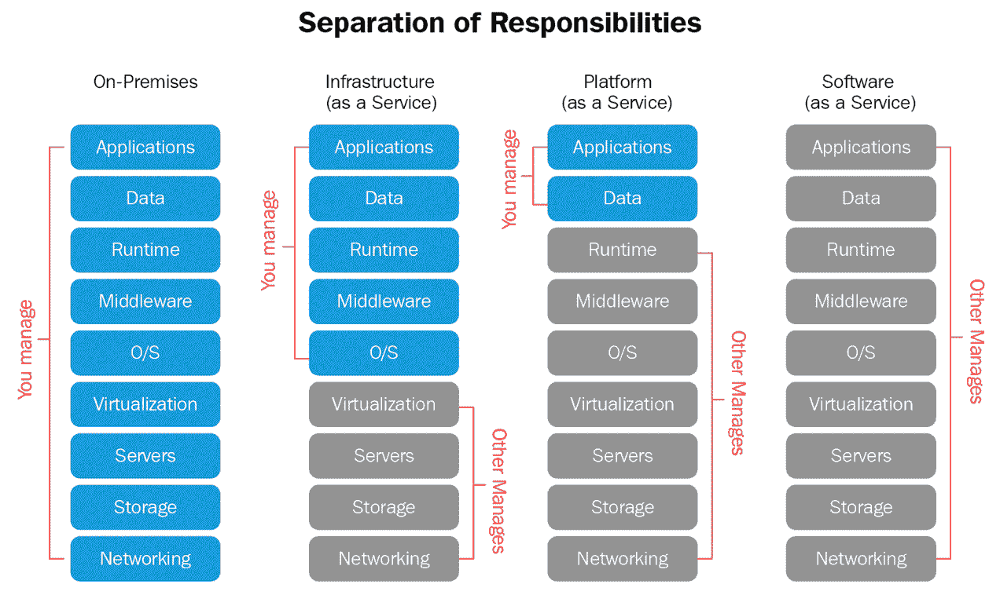
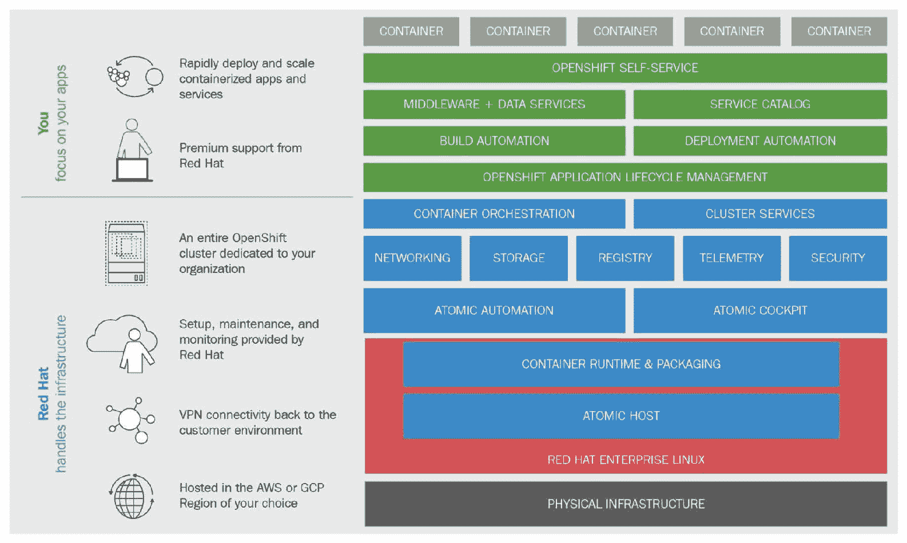
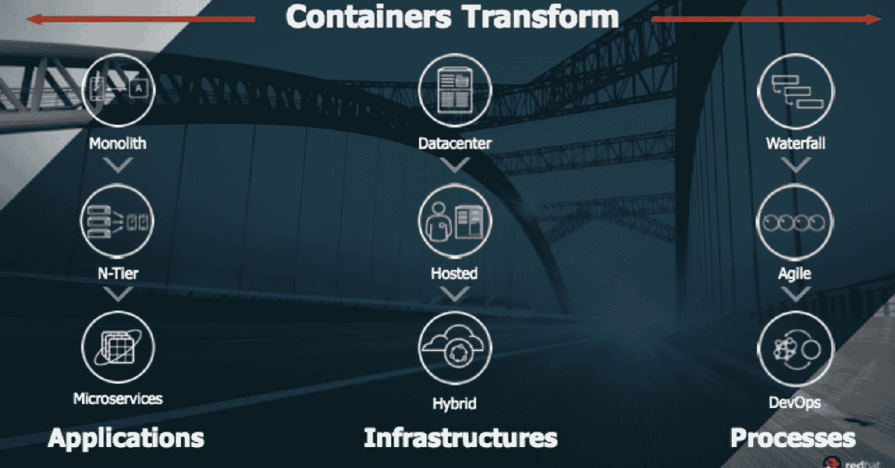
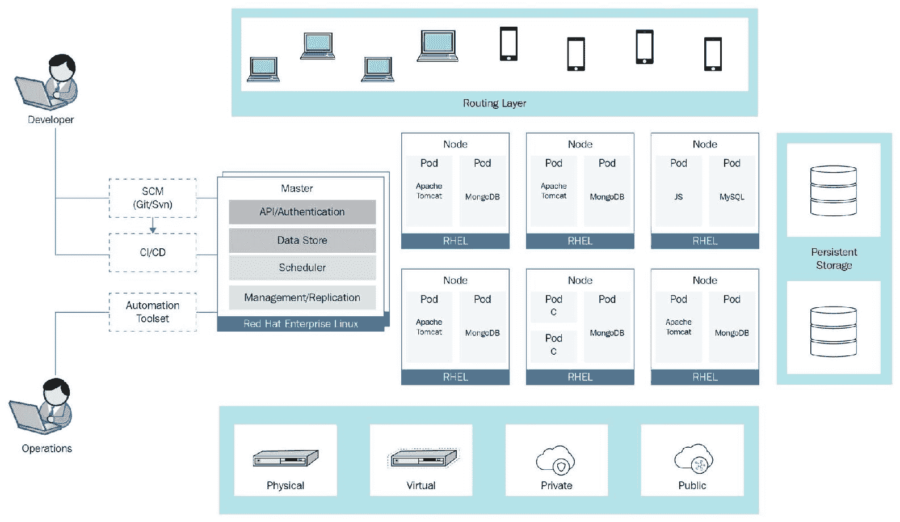
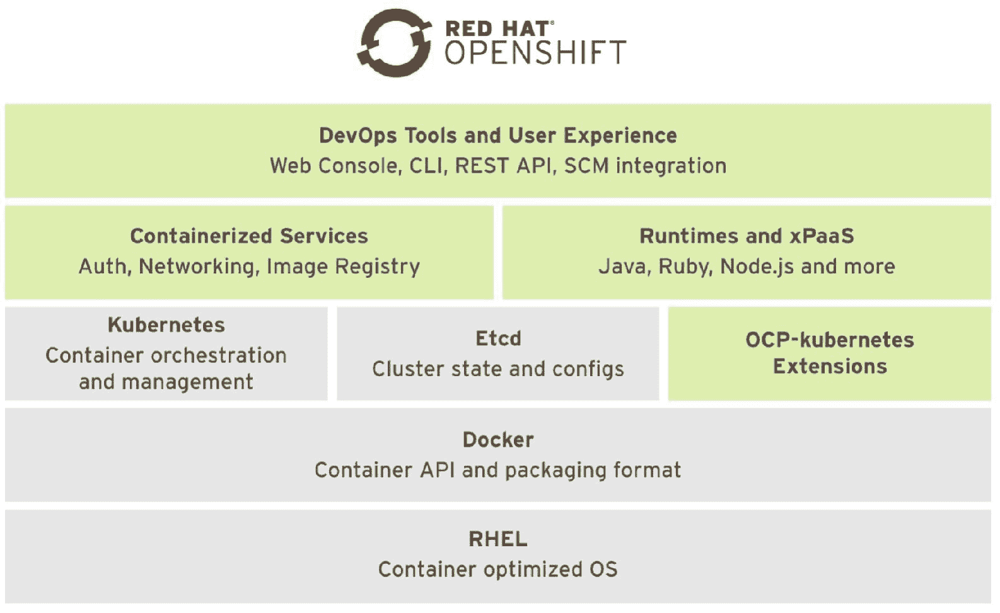

# OpenShift 概述

在上一章中，我们简要介绍了容器运行时和容器运行时接口的基础知识，接着讲解了 CRI-O 是什么以及它是如何工作的。最后，我们安装了一个以 CRI-O 作为容器运行时接口的 Kubernetes 集群，并运行了一些简单的命令，以验证 Kubernetes 是否通过 CRI-O 正常工作。

本章重点简要描述了 OpenShift 作为**平台即服务**（**PaaS**）解决方案的概况。我们将介绍**基础设施即服务**（**IaaS**）和 PaaS 云。作为 PaaS 云描述的一部分，我们将提供 OpenShift 业务价值的基本解释。在本章中，您还将了解 OpenShift 的技术组件和可用的 OpenShift 变体。

阅读本章后，您将了解以下内容：

+   云技术格局与 PaaS 的角色

+   OpenShift 作为 Kubernetes 的扩展

+   OpenShift 的业务价值

+   OpenShift 口味

+   OpenShift 架构

# 云技术格局与 PaaS 的角色

今天，任何企业都期望自动化成为成功的基石。传统方法在应对商业生态系统变化的速度时过于缓慢，这是许多企业向自动化和 DevOps 转型的主要原因之一。

如果我们看看软件交付技术的演变，可以很容易发现，旧一代应用程序最初是直接安装在裸机上，然后是虚拟机。随着时间的推移，这些公司开始使用不同的 IaaS 云平台。原因显而易见——IaaS 平台通过使用云编排工具和公开的 API 将自动化带到了一个新层次。IaaS 自动化在基础设施层面上实现这一目标的方式是简化虚拟网络、存储和虚拟服务器。使用 IaaS 平台时，我们仍然需要安装和配置应用程序，这通常是一个耗时的过程。想象一下，每次开发新功能并进行测试时，都需要从头开始安装和配置一个基于 PHP 的应用程序。即使使用自动化工具，这也需要大量时间。

PaaS 是下一代平台，用于以快速和自动化的方式在生产环境中交付应用程序。通过 PaaS，应用程序交付过程看起来非常简单——不需要为 Web 服务器、数据库等安装和配置应用平台。这些都由平台本身提供，在我们的案例中就是 OpenShift。这意味着您只需要上传应用程序代码和数据库结构；其余的将由 PaaS 处理：

下图显示了将应用程序托管在裸机、IaaS 和 PaaS 平台上的差异：

IaaS、PaaS 和 SaaS 云比较

# OpenShift 作为 Kubernetes 的扩展

在前几章中，我们讨论了 Kubernetes 如何简化 Docker 容器的管理，并处理容器的部署。Kubernetes 在跨多个节点的容器管理中带来了额外的价值，这在现代高度可用和分布式的基础设施中至关重要。尽管 Kubernetes 具有许多优势，但它也有缺点，大部分缺点都被 OpenShift 修正。

OpenShift 是来自 Red Hat 的 PaaS 服务，原生集成 Docker 和 Kubernetes，创建了一个强大的容器集群管理和编排系统。OpenShift 包括了架构、流程、平台和服务，旨在赋能开发人员和运维团队。OpenShift 提高了所有环境中的可靠性，满足了所有客户需求，同时降低了基础设施成本。

OpenShift 利用 Kubernetes 作为容器管理平台，并添加了多个重要的新组件和功能，其中包括：

+   自服务门户和服务目录

+   构建和应用部署自动化

+   内置注册表服务

+   扩展应用路由

OpenShift 服务

# 理解 OpenShift 的商业价值

N 层设计是一种标准的应用设计，例如具有 Web、应用和数据库层的三层 Web 应用。这个设计逐步演变成了微服务架构。微服务架构影响了整个行业，迫使许多公司接受这一新趋势，并将其作为新标准。与单体架构和 N 层架构相比，微服务架构更便宜、更具可扩展性，并且更安全。这就是为什么容器化应用将把你带到全新高度的原因：

应用、基础设施和软件开发的演变

OpenShift 进一步推动了这些边界，允许软件开发人员和运维团队利用强大的微服务架构，以及 OpenShift GUI 的简便性和它带来的附加功能。OpenShift 是你真正能够从自动化和 DevOps 中受益的地方。OpenShift 内置了许多工具，使得新的微服务架构与上一代软件兼容。

正如我们所提到的，软件开发方法也发生了变化；最初，软件开发者遵循瀑布模型，精益求精地打磨应用，逐一添加功能，确保应用没有漏洞。但这种方式既不高效，也不节省时间和成本。因此，敏捷方法应运而生。企业主需要更短的软件开发周期。然而，这并不完美，因为存在许多漏洞和其他不足之处。接下来的进化步骤是 DevOps。OpenShift 利用现代 DevOps 流程，使其变得更加简单和高效。

# OpenShift 版本

OpenShift 的生产版有几个不同的变种：

+   OpenShift Origin

+   OpenShift 容器平台

+   OpenShift 在线版

+   OpenShift 专用版

与其他 Red Hat 旗下产品类似，OpenShift 也有一个上游项目，叫做**OpenShift Origin**。OpenShift Origin 的主页可以访问[`openshift.org`](http://openshift.org)。它提供多种安装方法，包括在本地开发者机器上安装开发环境。

**Red Hat OpenShift Container Platform**是 OpenShift Origin 的生产级版本，拥有所有 Red Hat 生产优势，包括官方支持、认证等。OpenShift Container Platform 与 Red Hat Enterprise Linux 集成，并通过 Red Hat 的质量保证过程进行测试，旨在为希望拥有自己的私有云或本地云的客户提供一个稳定且可支持的产品。企业可能会每六个月获得一次更新，从而在小版本更新之间保持稳定。OpenShift Container Platform 允许在您的基础设施上构建私有或公共 PaaS 云。

**Red Hat OpenShift Online**是一个由 Red Hat 管理的多租户公共云平台。对于希望使用 OpenShift 但不想拥有自己本地基础设施的公司，OpenShift Online 是一个不错的选择。这个平台允许免费托管一个小型应用程序。

**Red Hat OpenShift Dedicated**是一个单租户的容器应用平台，托管在**Amazon Web Services**（**AWS**）或 Google Cloud Platform 上，由 Red Hat 管理。它允许应用开发团队快速构建、部署和扩展传统和云原生应用。OpenShift Dedicated 基于 Red Hat Enterprise Linux、Docker 容器技术和 Google Kubernetes 进行编排和管理。它安全地连接到您的数据中心，让您能够通过最小的基础设施和运营费用实施灵活的混合云 IT 策略。如果不希望与其他公司共享平台，这对于公司来说是一个不错的选择。

# OpenShift 架构

就 OpenShift 组件和整体架构而言，OpenShift 容器平台既简单又复杂。它的复杂性在于涉及许多相互连接的组件，但 OpenShift 的简单性在于所有组件相互独立运行，即使某个部分发生故障，其他部分仍能无缝协作。

OpenShift 组件

OpenShift 和 Kubernetes 有许多架构组件是相同的，例如：

+   OpenShift 主节点

+   OpenShift 节点

+   Etcd 作为一个键值存储

OpenShift 特有的组件包括：

+   路由器作为入口流量控制

+   OpenShift 内部注册表

以下图表描述了从架构角度看 OpenShift 容器平台：

OpenShift 架构

OpenShift 建立在 Docker 和 Kubernetes 之上，有时被称为 Kubernetes++。除了 Docker 和 Kubernetes 解决方案外，OpenShift 还带来了额外的功能和特性，以提供稳定和生产就绪的 PaaS 平台。这些新功能和特性包括：

+   **认证**：OpenShift 具有几种内置的认证方法，允许对 OpenShift 项目进行精细的访问控制。

    +   本地认证

    +   LDAP 认证

    +   请求头认证

    +   Keystone 认证

    +   GitHub 认证

+   **多租户**：OpenShift 强大的功能允许精细的多用户和多项目访问控制，这是中型和大型组织必备的功能，允许不同组织间的协作和访问控制。

+   **内部镜像注册表**：OpenShift 使用内部注册表存储准备部署到 OpenShift 节点上的镜像。它还用于 S2I 构建。

+   **GUI 和 Web 控制台**：OpenShift 提供易于使用的 Web 界面，功能强大到足以创建、构建、部署、更新和排查 OpenShift 项目及其内部运行的微服务应用程序。

+   **SCM 集成**：OpenShift 与 Git 有内置集成。该解决方案与镜像构建器紧密耦合。

+   **镜像构建器**：用于将图像参数或源代码转换为可运行图像的过程。

+   **CI/CD 集成**：OpenShift 与 Jenkins 提供非常灵活的持续集成和持续交付管道集成。它通过在容器中进行 Jenkins provisioning 来扩展管道执行。这允许 Jenkins 并行运行所需数量的作业，并且能够按需扩展解决方案。

+   **附加的 Kubernetes 资源扩展**：OpenShift 向 Kubernetes 添加了一组资源：

    +   **Deployment Configurations (DC)**：这是从相同容器镜像创建的一组 pod。

    +   **Build Configurations (BC)**：主要由 S2I 用于从 Git 中的源代码构建镜像。

    +   **Routes**：OpenShift 路由器使用的 DNS 主机名服务，用作 OpenShift 应用程序的入口点。

+   **REST API**：除了 Kubernetes API 外，Openshift 还提供自己的 API 接口，以利用所有自动化功能，并与外部平台、其他自动化框架和 DevOps 解决方案无缝集成。

# 摘要

在本章中，我们简要讨论了 IaaS 和 PaaS 解决方案之间的区别。我们还讨论了 OpenShift 作为 PaaS 解决方案的一部分。我们提供了 OpenShift 业务价值的基本解释，主要 OpenShift 组件，并总体上谈到了 OpenShift。

在下一章中，我们将使用 OpenShift 并学习使用最流行的方法和工具构建 OpenShift 开发环境的不同方式。

# 问题

1.  OpenShift 是以下云平台之一：

    1.  IaaS

    1.  PaaS

    1.  MaaS

    1.  SaaS

1.  哪两个 OpenShift 版本可以在你的数据中心内部署？选择 2 个：

    1.  OpenShift Origin

    1.  OpenShift 专用版

    1.  OpenShift 企业版

    1.  OpenShift 离线版

1.  OpenShift 使用自己的容器管理平台来编排和控制容器部署：

    1.  正确

    1.  错误

1.  以下哪项是 OpenShift 相对于 Kubernetes 增加的新特性？选择一个：

    1.  SCM 集成

    1.  GUI 和 Web 控制台

    1.  多租户

    1.  持久存储

1.  相比 Kubernetes，OpenShift 有哪些独特的组件？选择两个：

    1.  路由器作为入口流量控制

    1.  OpenShift 内部注册中心

    1.  OpenShift 主节点

    1.  OpenShift 节点

1.  OpenShift 提供了一个额外的 REST API，除了 Kubernetes API：

    1.  正确

    1.  错误

# 进一步阅读

OpenShift 的开发生命周期为每 3 个月一次，这意味着每 3 个月都会增加新特性。这也意味着，到本书发布时，OpenShift 可能会有所不同。因此，跟踪这些变化非常重要。以下是一些链接，包括进一步阅读：

+   **OpenShift 一般文档**：[`docs.openshift.com/index.html`](https://docs.openshift.com/index.html)

+   **OpenShift Origin 文档网页**：[`docs.openshift.org/`](https://docs.openshift.org/)

+   **OpenShift GitHub 项目**：[`github.com/openshift/`](https://github.com/openshift/)
