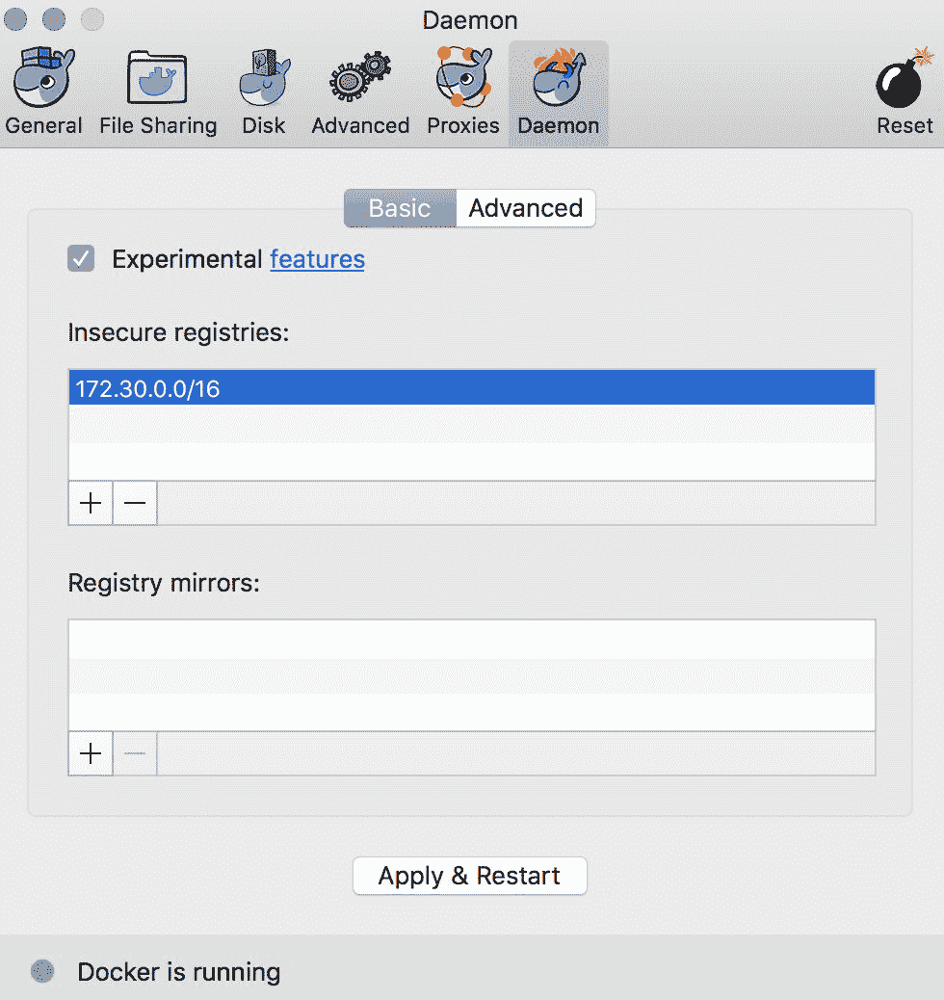
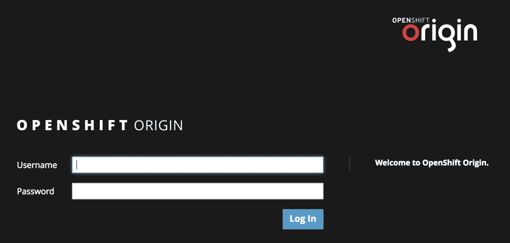
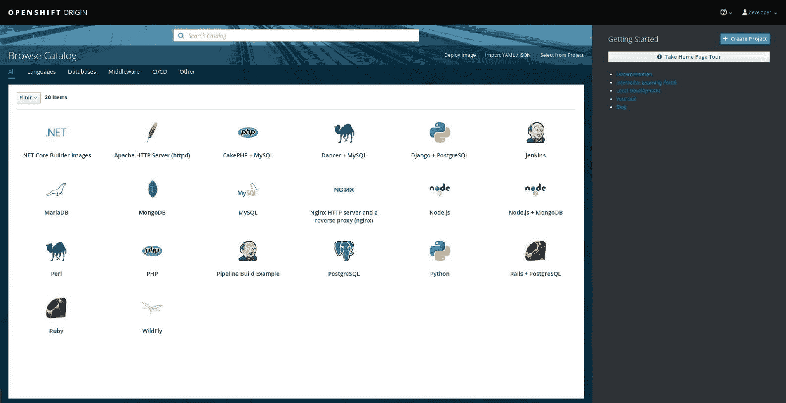
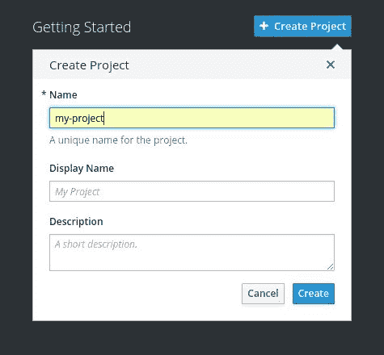
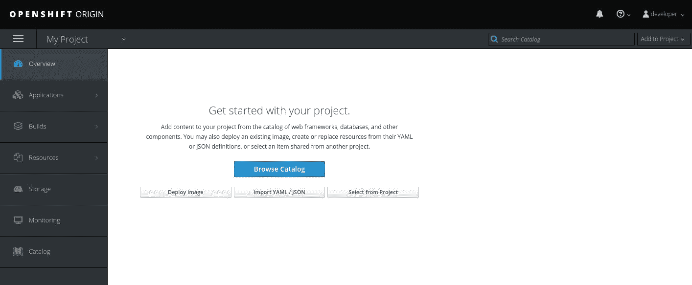
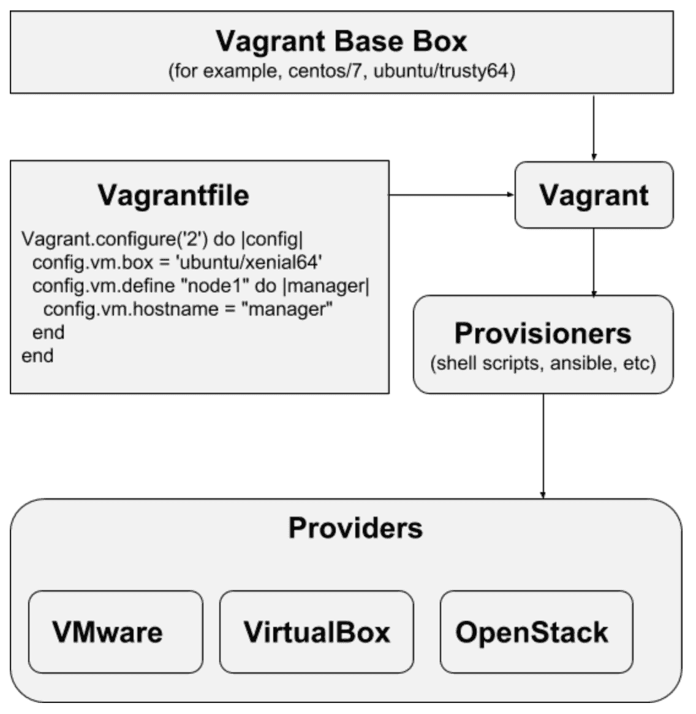

# 构建 OpenShift 实验环境

在上一章中，我们简要讨论了 IaaS 和 PaaS 解决方案之间的区别。我们还讨论了 OpenShift 作为 PaaS 解决方案的一部分。我们提供了 OpenShift 商业价值和主要组件的基本解释。

一些 OpenShift 用户不想花时间部署和配置 OpenShift 开发或评估环境。然而，他们可能需要该环境来执行日常操作。本章将展示如何在大多数流行桌面操作系统上，使用最流行的方法快速设置一个现成的开发环境。

本章将涵盖以下主题：

+   为什么使用开发环境？

+   部署变体

+   使用 oc cluster up

+   使用 Minishift

+   使用 Vagrant

# 技术要求

为了顺利完成本章的实验，你将需要以下内容：

+   以下任一桌面操作系统：

    +   macOS

    +   Linux (CentOS 7)

    +   Windows

+   用于 Linux 或 macOS 的 Bash

+   macOS 的 Brew 包管理器

+   VirtualBox

+   虚拟化支持

+   用于 macOS/Linux/Windows 的 Docker

+   OpenShift 客户端工具

你还需要下载并安装一些依赖项和二进制文件。

# 为什么使用开发环境？

正如我们在上一章提到的，OpenShift 是一个应用交付平台，可以简化基础设施工程师和开发团队的日常工作。如果公司的软件交付策略与容器对接，OpenShift 可以显著减少生产时间。

每个平台都有一个社区。它是围绕平台构建的生态系统，旨在帮助提升平台功能，使平台与最终用户需求对接，等等。OpenShift 拥有一个社区，社区成员包括一些使用该平台的重要人物：软件开发人员、QA 专家、系统管理员、IT 架构师等。对于 OpenShift 来说，扩展社区并吸引新的团队成员和客户是非常重要的。为了实现这一目标，所有团队成员都应该能够访问 OpenShift 环境；根据他们的角色，专家们将进行软件开发、测试和软件交付。并非每个软件开发人员或 QA 团队成员都能从零开始搭建 OpenShift，这是他们寻找简便方法开始使用 OpenShift 的主要原因。

OpenShift 开发环境可以轻松创建，不需要大量的努力。通常，这个环境位于本地计算机上，并且不需要大容量。

拥有易于使用的开发环境有很多好处：

+   **OpenShift 评估**：有时，用户希望了解 OpenShift 如何与他们的需求对接。他们可能没有 OpenShift 经验，可能想在真实系统上试用它。对于大多数技术人员而言，营销演示并没有实质意义。为开发环境提供一个快速简便的部署过程可以帮助解决这个问题。

+   **为开发者/QA 提供快速环境**：开发者通常不想过多参与环境的部署。快速部署 OpenShift 的方法可以节省一些精力，让他们能够专注于主要工作（如软件开发和测试）。

# 部署变体

有多种方法可以设置和启动开发环境。通常，开发环境运行在工作站上，覆盖最流行的工作站操作系统非常重要。在下一节中，我们将描述几种在不同平台的工作站上快速部署 OpenShift 的方法。最流行的桌面操作系统包括 Windows、macOS 和 Linux。

请注意，开发环境不等同于生产环境，原因是容量、可扩展性和安全性方面的限制。

# 使用 oc cluster up

名为 `oc` 的 OpenShift 客户端工具可以启动本地 OpenShift 集群，其中包括所有必要的服务，如内部注册表、路由器、模板等。这是启动开发环境最简单的方法之一。`oc cluster up` 会创建一个默认用户和项目，完成后，你可以使用任何命令来操作 OpenShift 环境，如 `oc new-app`。

该方法提供了一个容器化的 OpenShift 环境，可以轻松在多个平台上运行。

# 系统要求和前提条件

`oc cluster up` 方法支持基于 Linux、macOS 和 Windows 的工作站。默认情况下，该方法需要安装了 Docker 的环境。然而，命令本身也可以创建 Docker 机器。以下表格展示了可用的部署场景：

| **操作系统** | **Docker 实现** |
| --- | --- |
| Linux | 操作系统默认 Docker 守护进程 |
| macOS | Docker for macOS |
| macOS | Docker Toolbox |
| Windows | Docker for Windows |
| Windows | Docker Toolbox |

# CentOS 7

此方法也可以用于 Fedora 或基于 RHEL 的主机。

部署过程涉及多个步骤：

1.  安装 Docker

1.  配置不安全的注册表

1.  允许防火墙上的端口

1.  下载 OpenShift 客户端工具

1.  启动集群

让我们详细研究这些步骤：

1.  **Docker 安装**：这并不涉及特别的操作，之前的章节中已有描述。以下命令必须以 root 用户身份运行：

```
$ sudo -i
# sudo yum -y install docker
# systemctl enable docker
```

1.  **配置不安全的注册表**：这对于能够使用与 OpenShift 安装一起提供的内部 Docker 注册表是必需的。如果没有配置这个，`oc cluster up` 将会失败。

为了允许不安全的 OpenShift 注册表，请在 root 用户下运行以下命令：

```
# cat << EOF >/etc/docker/daemon.json
{
   "insecure-registries": [
     "172.30.0.0/16"
   ]
}
EOF

# systemctl start docker
```

这需要重新启动 Docker 守护进程以应用新的配置。

1.  **配置防火墙**：默认的防火墙配置没有启用 OpenShift 集群所需的所有端口。你需要使用`firewall-cmd`调整设置：

| **端口** | **描述** |
| --- | --- |
| `8443`/`tcp` | `API 端口` |
| `53`/`udp` | `DND` |
| `8053`/`udp` | `内部 DNS` |

这可以通过以下代码片段实现：

```
# firewall-cmd --permanent --new-zone dockerc
# firewall-cmd --permanent --zone dockerc --add-source 172.17.0.0/16
# firewall-cmd --permanent --zone dockerc --add-port 8443/tcp
# firewall-cmd --permanent --zone dockerc --add-port 53/udp
# firewall-cmd --permanent --zone dockerc --add-port 8053/udp
# firewall-cmd --reload
```

在大多数情况下，防火墙在开发环境中不是问题，可以通过`systemctl stop firewalld`和`systemctl disable firewalld`停止防火墙。

你可以通过运行以下命令来确定 Docker 的网络地址：

`docker network inspect -f "{{range .IPAM.Config }}{{ .Subnet }}{{end}}" bridge`。

1.  **下载** **oc** **工具**：名为`oc`的 OpenShift 客户端工具可以在标准仓库中找到；但是，也可以从[`github.com/openshift/origin/releases`](https://github.com/openshift/origin/releases)下载该工具。我们建议使用标准的 CentOS 仓库：

```
# yum -y install centos-release-openshift-origin39
# yum -y install origin-clients
```

我们省略了命令的输出。预计这些命令将安装多个依赖项。

1.  **启动 OpenShift 集群**：一旦满足所有前提条件，你就可以通过运行`oc cluster up`来启动集群。该命令将从公共仓库下载所有必需的 Docker 镜像，然后运行所有必需的容器：

```
# oc cluster up --version=v3.9.0
Starting OpenShift using openshift/origin:v3.9.0 ...
...
output truncated for brevity
...
OpenShift server started.

The server is accessible via web console at:
    https://127.0.0.1:8443

You are logged in as:
    User: developer
    Password: <any value>

To login as administrator:
    oc login -u system:admin
```

在前面的示例中，我们将 OpenShift 集群的版本静态绑定到`v3.9.0`。在大多数情况下，你无需指定版本。因此，你只需要运行`oc cluster up`，而不带任何参数。

如你所见，`oc cluster up`已部署了一个可供使用的单节点 OpenShift 环境。

默认情况下，这个 OpenShift 环境被配置为在回环接口（`127.0.0.1`）上监听。这意味着你可以通过`https://127.0.0.1:8443`连接到集群。可以通过添加特定的参数（如`--public-hostname=`）来更改这种行为。可以使用以下命令显示所有可用选项：

```
# oc cluster up --help
```

1.  **验证**：集群部署完成后，你可以验证它是否准备好使用。默认的 OpenShift 配置指向一个无特权的用户，名为`developer`。你可以使用以下命令提升权限：

```
# oc login -u system:admin
Logged into "https://127.0.0.1:8443" as "system:admin" using existing credentials.

You have access to the following projects and can switch between them with 'oc project <projectname>':

    default
    kube-public
    kube-system
  * myproject
    openshift
    openshift-infra
    openshift-node

Using project "myproject".
```

一旦你获得管理员访问权限，就可以使用`oc get node`来验证节点配置：

```
# oc get node
NAME      STATUS  AGE     VERSION
localhost Ready   9m       v1.7.6+a08f5eeb62
```

1.  **关闭**：一旦`oc cluster up`环境部署完成，可以通过`oc cluster down`将其关闭。

# macOS

macOS 的安装和配置过程与 Linux 非常相似。假设正在使用 Docker for macOS。部署过程包括以下步骤：

+   Docker for macOS 的安装和配置

+   安装`openshift-cli`和所需的包

+   启动集群

`oc cluster up` 命令要求系统上安装 Docker，因为它本质上是创建一个 Docker 容器并在该容器内运行 OpenShift。这是一个非常优雅且清晰的解决方案。

Docker for macOS 的安装过程可以参考官方门户：[`docs.docker.com/docker-for-mac`](https://docs.docker.com/docker-for-mac)。

一旦 Docker 服务运行起来，你需要配置不安全的注册表（`172.30.0.0/16`）。在工具栏的 Docker 菜单中，选择首选项菜单并点击 Daemon 图标。在配置对话框的基本选项卡中，点击不安全注册表下的 + 图标，并添加以下新条目：`172.30.0.0/16`：



完成后，点击应用并重启。

一旦配置好 Docker 服务，我们需要安装所有必需的软件，并按照以下步骤启动集群：

1.  **OpenShift 客户端安装**：按照以下步骤在系统上安装 `socat` 和 `openshift-cli` 包：

```
$ brew install openshift-cli socat --force
```

如果你没有安装`brew`，可以在[`brew.sh/`](https://brew.sh/)找到安装过程。

1.  **启动和停止 OpenShift 集群**：集群可以像在 Linux 中一样启动：

```
$ oc cluster up
Starting OpenShift using registry.access.redhat.com/openshift3/ose:v3.7.23 ...
OpenShift server started.

The server is accessible via web console at:
https://127.0.0.1:8443

You are logged in as:
User: developer
Password: <any value>

To login as administrator:
oc login -u system:admin
```

在编写本书时，`oc cluster up`在 macOS 上的版本 3.9 不可用。我建议你暂时使用版本 3.7 的客户端工具。

OpenShift 管理员用户可以执行安装验证，方法如下：

```
$ oc login -u system:admin
Logged into "https://127.0.0.1:8443" as "system:admin" using existing credentials.

You have access to the following projects and can switch between them with 'oc project <projectname>':

default
kube-public
kube-system
* myproject
openshift
openshift-infra
openshift-node

Using project "myproject".
```

OpenShift 集群已经启动并准备好工作。我们可以使用以下命令检查集群的状态：

```
$ oc get nodes
NAME      STATUS AGE VERSION
localhost Ready 20h  v1.7.6+a08f5eeb62
```

集群可以通过以下方式停止：

```
$ oc cluster down
```

# Windows

OpenShift 环境可以部署在支持 Docker for Windows 的 Windows 机器上。

+   **Docker for Windows 安装与配置**：

Docker for Windows 的安装过程可以参考[`docs.docker.com/docker-for-windows`](https://docs.docker.com/docker-for-windows)。

一旦 Docker 运行，你需要配置不安全注册表设置，如下所示：

1.  右键点击通知区域的 Docker 图标，选择设置。

1.  在设置对话框中点击 Docker Daemon。

1.  通过添加 `172.30.0.0/16` 到 `"insecure-registries":` 设置中，编辑 Docker 守护进程配置：

```
{
"registry-mirrors": [],
"insecure-registries": [ "172.30.0.0/16" ]
}
```

1.  点击应用，Docker 将重启。

一旦配置好 Docker 服务，就可以按照以下方式安装 OpenShift 客户端`oc`。示例还展示了如何启动集群：

+   **OpenShift 客户端安装**：从[`github.com/openshift/origin/releases/download/v3.7.1/openshift-origin-client-tools-v3.7.1-ab0f056-mac.zip`](https://github.com/openshift/origin/releases/download/v3.7.1/openshift-origin-client-tools-v3.7.1-ab0f056-mac.zip)下载 Windows `oc.exe` 二进制文件，并将其放置在 `C:\Windows\system32` 或其他路径文件夹中。

您还可以从 [`github.com/openshift/origin/releases`](https://github.com/openshift/origin/releases) 下载最新代码，在 `Assets` 下。

+   **启动/停止集群**：OpenShift 客户端的 Windows 版本也可以启动和停止集群，具体操作如下：

```
C:\> oc cluster up
```

OpenShift 集群已启动。您可能希望使用以下命令检查集群的状态：

```
C:\> oc get node
NAME STATUS AGE
origin Ready 1d
```

# 通过 Web 浏览器访问 OpenShift。

无论您是使用 `oc cluster up` 还是其他解决方案，当 OpenShift 正在运行时，您都可以通过 Web 浏览器访问它。OpenShift 默认在端口 `8443` 上可用。在 `oc cluster up` 的情况下，您可以通过 `https://localhost:8443/` 访问 OpenShift 登录页面：



使用开发者登录并输入任意密码即可登录 OpenShift。稍后我们将通过本书中的 Web 界面开发和运行微服务应用程序。

登录后，您将看到服务目录，您可以从中选择可用的语言运行时：



OpenShift 中的 *Project* 扩展了 Kubernetes 的命名空间概念，作为将同一 OpenShift 集群中的团队和个人用户分隔开来的手段。项目的另一个常用术语是 *tenant*（例如，在 OpenStack 中）。您可以通过点击“创建项目”按钮并指定项目名称来从 Web 控制台创建项目：



创建项目后，您可以点击屏幕右侧的项目名称，系统将引导您进入项目概览页面，在该页面您可以创建应用程序和其他资源：



为了让您基本了解如何在 OpenShift Web 控制台中导航，请参阅下面的简要指南：

+   应用程序菜单用于访问与您的应用程序直接相关的资源，如部署、Pods、服务、Stateful Sets 和路由。

+   Builds 菜单让您管理构建配置和构建策略，如 Pipelines，以及用于从源代码构建应用程序的镜像。

+   Resources 菜单让您访问可以在高级用例中由应用程序使用的其他次要资源，如配额、配置映射、秘密和其他资源。您还可以使用此菜单查看和管理项目的成员资格。

+   存储菜单用于通过创建持久存储声明来请求持久存储。

+   监控菜单为您提供访问 OpenShift 收集的各种指标，包括 CPU、RAM 和网络带宽利用率（如果启用了指标收集），以及实时发生的事件。

+   最后，Catalog 菜单是您可以直接访问服务目录的快捷方式，您无需返回首页即可从当前项目访问。这一功能在 OpenShift Origin 3.9 中引入。

# 使用 Minishift。

Minishift 是另一种在本地部署 OpenShift 的方式，它通过在虚拟机中运行一个单节点的 OpenShift 集群来实现。最近，我们展示了如何使用 Minikube 来部署 Kubernetes 的开发环境。Minishift 采用了相同的方法，因为它是 Kubernetes 社区开发的，并作为 Minikube 的延续（详见 第二章，*Kubernetes 概述*），因此使用了相同的命令行语法。Minishift 支持在 Windows、macOS 和 Linux 操作系统上进行部署。Minishift 使用 libmachine 来提供虚拟机，使用 boot2docker 作为操作系统，并使用 OpenShift Origin 来运行集群。Minishift 需要一个虚拟化管理程序来运行包含 OpenShift 的虚拟机。

根据你的主机操作系统，你可以选择以下虚拟化管理程序：

| **操作系统** | **虚拟化管理程序** | **平台** |
| --- | --- | --- |
| macOS | xhyve | VirtualBox |
| Linux | KVM | VirtualBox |
| Windows | Hyper-V | VirtualBox |

`boot2docker` 是一个基于 Tiny Core Linux 的轻量级 Linux 发行版，专门为运行容器而构建。该项目现已弃用。

在开始之前，你需要配置虚拟化支持（[`docs.openshift.org/latest/minishift/getting-started/installing.html#install-prerequisites`](https://docs.openshift.org/latest/minishift/getting-started/installing.html#install-prerequisites)）并安装 VirtualBox。

然后，你需要从 Minishift 发布页面下载适用于你操作系统的压缩包（[`github.com/minishift/minishift/releases`](https://github.com/minishift/minishift/releases)）并解压。压缩包中的 `minishift` 二进制文件需要复制到操作系统的首选位置，并将该位置添加到你的 `PATH` 环境变量中。Minishift 将使用系统 `PATH` 环境中找到的 SSH 二进制文件。

在 macOS 上，你还可以使用 Homebrew Cask 安装 Minishift 的稳定版本：

`$ brew cask install minishift`

要更新二进制文件，请运行以下命令：

`$ brew cask install --force minishif`

如果所有先决条件都满足，你可以使用 `minishift start` 启动一个集群。

```
$ minishift start --vm-driver=virtualbox
-- Starting profile 'minishift'
-- Checking if requested OpenShift version 'v3.7.1' is valid ... OK
...
output truncated for brevity
...
OpenShift server started.

The server is accessible via web console at:
    https://192.168.64.2:8443

You are logged in as:
    User: developer
    Password: <any value>

To login as administrator:
    oc login -u system:admin

-- Exporting of OpenShift images is occuring in background process with pid 7123.
```

部署过程完成后，你将能够使用 OpenShift 客户端连接：

```
$ oc login -u system:admin
Logged into "https://192.168.64.2:8443" as "system:admin" using existing credentials.

You have access to the following projects and can switch between them with 'oc project <projectname>':

* default
kube-public
kube-system
myproject
openshift
openshift-infra
openshift-node

Using project "default".
```

你还需要安装 `oc client`。你可以参考本章前面的章节来获取 `oc client` 安装的步骤。

OpenShift 集群已启动。你可能需要使用 `oc get nodes` 来检查其状态，如下所示：

```
$ oc get nodes
NAME      STATUS   AGE  VERSION
localhost Ready   20h   v1.7.6+a08f5eeb62
```

你可以通过 `minishift ssh` 连接到 Minishift 虚拟机。可以使用 `minishift stop` 停止 Minishift 集群。

根据 `oc client` 和 OpenShift 的版本，输出结果可能有所不同。

要停止一个 Minishift 环境并删除它，你可以使用 `minishift stop` 和 `minishift delete`，如下所示：

```
$ minishift stop
Stopping local OpenShift cluster...
Cluster stopped.

$ minishift delete
You are deleting the Minishift VM: 'minishift'. Do you want to continue [y/N]?: y
Deleting the Minishift VM...
Minishift VM deleted.
```

# 与 Vagrant 一起使用

该方法允许使用已安装所有 OpenShift 软件的可用 Vagrant box，在单个虚拟机上运行。

Vagrant 软件通过使用不同的底层虚拟化技术，简化了虚拟机的部署和初始配置。在大多数情况下，一个名为 `Vagrantfile` 的纯文本文件描述了虚拟机的参数（如名称、主机名、内存、vCPUs、存储等）。一旦 `Vagrantfile` 准备好，Vagrant 软件就可以使用它来创建、停止和销毁虚拟机。

使用 Vagrant 的优点是我们可以根据需要重新部署虚拟机多次，并且每次都会得到相同的结果：



Vagrant 架构

Vagrant 包含以下主要组件：

+   **Vagrant 软件**：自动化虚拟机的构建和配置。具有 vagrant CLI 工具，适用于不同的操作系统。

+   **Box**：包含虚拟机镜像和元数据的 TAR 文件。Box 文件及其包含的镜像特定于每个提供商。

+   **Provider**：允许 Vagrant 与不同虚拟化平台通信的接口。默认情况下，使用 VirtualBox。也可以使用 Libvirt、KVM、OpenStack 和其他提供商。

+   **Vagrantfile**：一个纯文本文件，包含创建虚拟机的指令。这些指令是使用基于 Ruby 的 **领域特定语言**（**DSL**）编写的。对于高级用例，也可以使用纯 Ruby。

# Vagrant 安装

Vagrant 的安装指令和下载软件可在 [`www.vagrantup.com/docs/installation/`](https://www.vagrantup.com/docs/installation/) 找到。

只需下载适用于你的操作系统的安装包，然后进行安装。Vagrant 还需要一个虚拟化平台，如 Vmware、KVM、VirtualBox、AWS、Hyper-V 或 Docker。根据操作系统的不同，你需要安装适当的虚拟化平台。

**对于 macOS，安装以下组件**：

1.  从上述链接下载最新的 Vagrant 软件并安装。

1.  从 [`www.virtualbox.org/wiki/Downloads`](https://www.virtualbox.org/wiki/Downloads) 下载并安装 VirtualBox。

**对于 CentOS，安装以下组件**：

1.  从上述链接下载最新的 Vagrant 软件并安装。

1.  安装 `libvirt` 驱动程序和 `kvm`：

```
# yum install epel-release -y
# yum localinstall https://releases.hashicorp.com/vagrant/1.9.5/vagrant_1.9.5_x86_64.rpm
# yum install qemu libvirt libvirt-devel ruby-devel gcc qemu-kvm -y
# vagrant plugin install vagrant-libvirt
```

**对于 Windows，安装以下组件**：

1.  从上述链接下载最新的 Vagrant 软件并安装。

1.  从 [`www.virtualbox.org/wiki/Downloads`](https://www.virtualbox.org/wiki/Downloads) 下载并安装 VirtualBox。

安装完成后，通过检查 Vagrant 软件版本来验证 Vagrant 是否已安装：

```
$ vagrant --version
Vagrant 1.9.5
```

# 使用全功能 Vagrant box 安装 OpenShift

在 2017 年 5 月引入 Minishift 之前，用户主要依赖 `openshift/origin-all-in-one` Vagrant 全功能盒子。这种方法不太流行，因为该盒子已近两年没有更新，并且代表的是 OpenShift Origin 1.3，功能和稳定性较差，因此现在主要具有历史意义。尽管它仍然可以用于测试目的，我们建议你使用 `oc cluster up` 和 Minishift。

可以按照以下方式部署基于 Vagrant 的环境：

```
$ vagrant init openshift/origin-all-in-one
$ vagrant up
```

上述命令将创建以下 `Vagrantfile`：

```
$ cat Vagrantfile
Vagrant.configure("2") do |config|
   config.vm.box = "openshift/origin-all-in-one"
end
```

一旦盒子部署完成，你可以使用 `admin` 和密码登录，如下所示：

```
$ oc login
Server [https://localhost:8443]:
The server uses a certificate signed by an unknown authority.
You can bypass the certificate check, but any data you send to the server could be intercepted by others.
Use insecure connections? (y/n): y

Authentication required for https://localhost:8443 (openshift)
Username: admin
Password: admin
Login successful.

You have access to the following projects and can switch between them with 'oc project <projectname>':

cockpit
* default
kube-system
openshift
openshift-infra

Using project "default".
Welcome! See 'oc help' to get started.
```

OpenShift 集群已启动。你可能想要检查集群状态，使用以下命令查看：

```
$ oc get node
NAME STATUS AGE
origin Ready 1y
```

请记住，这种方法的 Vagrant 盒子落后于最新版本的 OpenShift 两年，因此，如果你想看到最新的功能，建议使用其他选项。

# 总结

在这一章中，我们讨论了如何使用最流行和最简单的方法：`oc cluster up`、Minishift 和 Vagrant，在 CentOS 7、macOS 和 Windows 操作系统上快速轻松地创建 OpenShift 实验环境。

在下一章中，你将了解 OpenShift Origin 的硬件和软件要求。你将对 OpenShift 的部署场景和安装方法有一个基本的理解。此外，你还将使用 Ansible 执行 OpenShift 的高级安装，并了解如何通过 Ansible 清单自定义你的设置。

# 问题

1.  `oc cluster up` 解决方案的主要前提是什么？（请选择一个）：

    1.  Docker

    1.  Minishift

    1.  Virtualbox

    1.  Hyper-V

1.  默认情况下，访问 OpenShift 管理网页所使用的端口是哪个？请选择一个：

    1.  8443

    1.  443

    1.  8080

    1.  80

1.  `oc cluster up` 命令使用虚拟机启动 OpenShift 集群：

    1.  True

    1.  False

1.  用于通过 CLI 登录 OpenShift 的命令是什么？请选择一个：

    1.  oc login system:admin

    1.  oc login -u system:admin

    1.  oc login -u admin

    1.  oc login admin

1.  使用 `oc` 命令启动和停止 OpenShift 演示集群的命令是什么？请选择一个：

    1.  oc cluster up

    1.  oc cluster start

    1.  oc cluster down

    1.  oc cluster stop

1.  `minishift start` 命令使用虚拟机启动 OpenShift 集群：

    1.  True

    1.  False

# 深入阅读

如果你有兴趣了解更多内容或在实验环境中遇到问题，请查看以下链接：

+   **oc cluster up 安装**: [`github.com/openshift/origin/blob/master/docs/cluster_up_down.md`](https://github.com/openshift/origin/blob/master/docs/cluster_up_down.md)

+   **Minishift 安装**: [`docs.openshift.org/latest/minishift/getting-started/installing.html`](https://docs.openshift.org/latest/minishift/getting-started/installing.html)

+   **Vagrant 安装**: [`www.vagrantup.com/intro/getting-started/install.html`](https://www.vagrantup.com/intro/getting-started/install.html)

+   **在虚拟机中安装 OpenShift 集群的替代方法**：[`blog.openshift.com/openshift-developers-set-full-cluster-30-minutes/`](https://blog.openshift.com/openshift-developers-set-full-cluster-30-minutes/)

+   **在 OpenShift 上设置开发环境的 4 种方法**：[`developers.redhat.com/blog/2016/10/11/four-creative-ways-to-create-an-openshiftkubernetes-dev-environment/`](https://developers.redhat.com/blog/2016/10/11/four-creative-ways-to-create-an-openshiftkubernetes-dev-environment/)
