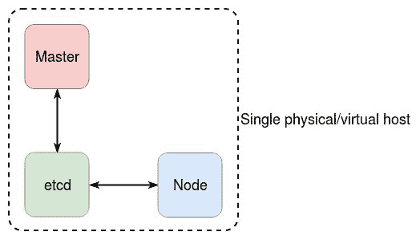
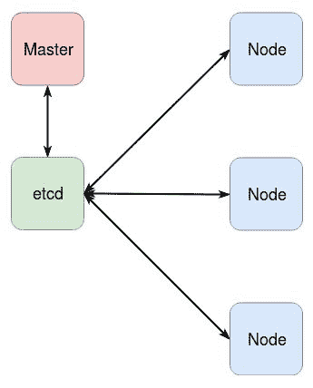
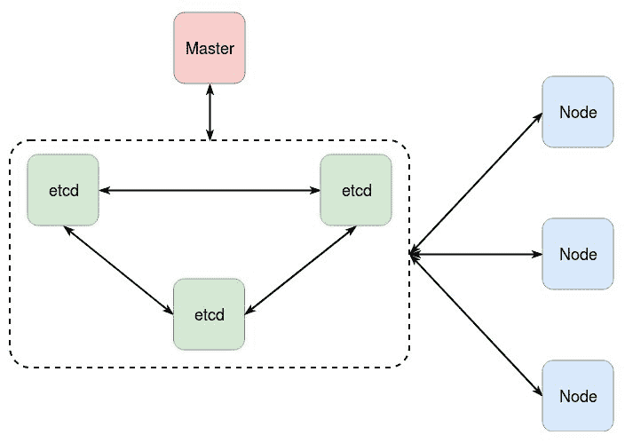
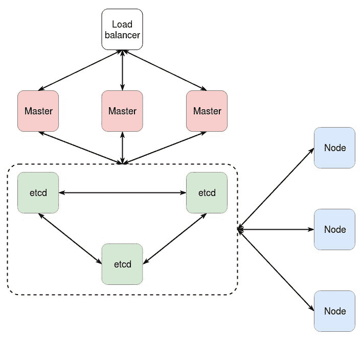
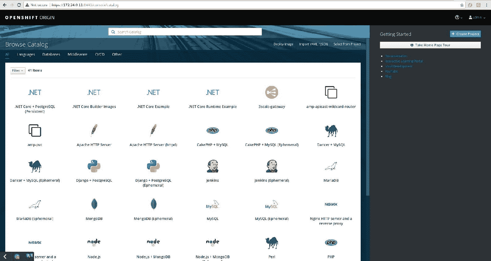

# 第六章：OpenShift 安装

在上一章中，我们讨论了如何使用`oc cluster up`、MiniShift 和 Vagrant 在 CentOS7、macOS 和 Windows 操作系统上快速轻松地设置 OpenShift 实验环境。

在本章中，您将了解 OpenShift Origin 的硬件和软件要求，并对 OpenShift 部署场景和安装方法有一个基本的了解。您还将能够使用 Ansible 执行 OpenShift 的高级安装，并了解通过 Ansible 库存自定义设置的各种选项。

在本章中，我们将讨论以下主题：

+   前提条件

+   OpenShift 安装方法概览

+   环境准备

+   高级安装

# 技术要求

本章的学习环境将通过 Vagrant 在 VirtualBox 上部署单个虚拟机表示。为了支持该环境，您将需要以下最低配置：

| **CPU** | **RAM, GiB** | **操作系统** |
| --- | --- | --- |
| 启用 HT 的 2 核 | 6 | Fedora 26/CentOS 7/RHEL 7 |

虚拟机的大小约为 3 GB，因此请确保你的`/home`分区有足够的空闲空间，或者通过文件 | 偏好设置 | 常规 | 默认机器文件夹更改 VirtualBox 存储虚拟机文件的位置。

可用于部署我们虚拟机的`Vagrantfile`可能类似于以下内容：

```
$ cat Vagrantfile 
Vagrant.configure("2") do |config|
  config.vm.box = "centos/7"
  config.vm.hostname = "openshift.example.com"
  config.vm.provider "virtualbox" do |v|
    v.memory = 4096
    v.cpus = 4
  end
  config.vm.network "private_network", ip: "172.24.0.11"
end
```

由于本章中的所有 OpenShift 服务都将在单个虚拟机上部署，因此我们将为其提供 4 个 vCPU 和 4 GiB 的 RAM，以便所有进程能够得到足够的资源启动。

为了能够拉取`centos/7`镜像，您需要 Vagrant 版本 2.x。

# 前提条件

在本章中，我们将重点介绍 OpenShift 的 Origin 版本，Origin 版本可以公开访问，无需任何订阅。与其他 OpenShift 变种一样，Origin 支持所有由 RedHat 提供的商业版 OpenShift 的功能。OpenShift 是一个复杂的平台，包含多个相互交互和协同工作的组件，每个组件都有自己的要求，因此在开始之前，我们需要满足这些要求。

# 硬件要求

官方 OpenShift Origin 文档提供了不同主机类型的足够硬件要求。它们总结在以下表格中：

|  | **Masters** | **Nodes** | **External etcd** |
| --- | --- | --- | --- |
| **vCPU** | 2 | 1 | 2 |
| **RAM, GiB** | 16 | 8 | 8 |
| **磁盘存储/分区, GB** | `/var: 40``/usr/local/bin: 1``/tmp: 1` | `/var: 15``/usr/local/bin: 1``/tmp: 1``Docker 存储后端: 15` | `20, 推荐使用 SSD` |
| **网络, GB/s** | 1 | 1 | 1 |

上述信息并非一成不变，仅供参考。特定安装的硬件要求会受到许多因素的影响，例如预期的应用程序数量和工作负载。实际上，要求可能会更宽松。

# OpenShift 安装方法概览

OpenShift Origin 可以根据操作系统以及关于可用性、可靠性和可扩展性的要求采用不同的安装方式。

# RPM 安装

这是默认方法。它从 RPM 包中安装所有必需的服务作为 systemd 单元，并且可以在 RHEL/CentOS/Fedora 上使用。我们将在接下来的章节中使用 CentOS 7 Linux 发行版重点介绍这种方法，以便你更好地理解涉及的机制。

# 容器化安装

这是 Atomic Host OS 唯一可用的方法。它在 Docker 容器中安装 OpenShift 服务，从而提供了额外的控制层级。该方法在企业环境中更为优选，因为 Atomic Host 使得软件包之间的依赖问题成为过去，并且简化了主机准备过程，因为 Atomic Host 提供了一个开箱即用的容器化环境。

# 部署场景

OpenShift Origin 支持多种部署模型，列举如下：

+   **一体化**：单个 master、单个 etcd 和单个节点安装在同一系统上。

+   **单个 master、单个 etcd 和多个节点**：这是我们将要重点关注的场景，因为它相对简单易设且能提供相关经验。master 和 etcd 将安装在同一主机上。

+   **单个 master、多个外部 etcd 和多个节点**：该场景通过集群提供 etcd 节点的高可用性（HA）。多个 etcd 节点形成法定多数，因此建议使用奇数个节点。

+   **多个 master、多个外部 etcd 和多个节点**：该场景还提供了 API 的原生高可用性（HA），这一点将在本书后续部分中探讨。Master 本身是无状态的，这意味着它们不需要任何同步机制。

以下图表展示了一个一体化安装：



一体化

以下图表展示了一个包含单个 master 和 etcd 实例的多节点 OpenShift 安装：



单个 master、单个 etcd 和多个节点

以下图表展示了使用多节点 etcd 集群进行安装的场景：



单个 master、多个 etcd 和多个节点

在生产环境中，冗余性和数据持久性非常重要。以下图表给出了一个生产环境中 OpenShift 安装的示例。该安装包含三个 master 和三个 etcd 服务，所有入口流量都经过负载均衡：



多个 master、多个 etcd 和多个节点

虽然将 etcd 部署在与 master 相同的主机上并不罕见，但它们是独立的实体，尽管前者需要在高可用性设置中实现法定多数，master 不需要，并且可以在实际中以任何数量单独部署。

# 环境准备

对于 RPM 安装方法，在安装开始之前需要进行一些配置。以下小节中的所有命令都需要以 root 身份执行。

首先，启动 vagrant 虚拟机并以 root 用户登录：

```
$ vagrant up
Bringing machine 'default' up with 'virtualbox' provider...
...
<output omitted>
...
$ vagrant ssh
$ sudo -i
#
```

在做任何其他操作之前，确保所有主机都已更新，以便内核和用户空间库能够支持 OpenShift 所需的所有功能：

```
# yum -y update
…
<output omitted>
…
Complete!
# reboot
```

你还需要以下软件包：

```
# yum -y install git docker epel-release
…
<output omitted>
…
Complete!
# yum -y install ansible
…
<output omitted>
…
Complete!
```

我们还安装了 `epel-release` 包，以启用 EPEL 仓库，从而可以安装 OpenShift 3.9 所需的最新版本的 Ansible。

通常，你可以在任何系统上安装 Ansible，甚至在你的笔记本上安装并从那里安装 OpenShift。但为了简化操作，我们将包括 Ansible 控制功能在内的所有内容集中在一个虚拟机上。

# Docker

与 Kubernetes 一样，OpenShift 依赖 Docker 提供容器运行时环境。因此，我们需要在 OpenShift 虚拟机上激活 Docker：

```
# systemctl start docker
# systemctl enable docker
Created symlink from /etc/systemd/system/multi-user.target.wants/docker.service to /usr/lib/systemd/system/docker.service.
```

# SELinux

在运行安装程序之前，必须在所有 OpenShift 节点（包括主节点）上启用 SELinux。这是为了使用特殊的 MLS 标签隔离容器进程所必需的。

打开虚拟机上的 `/etc/selinux/config` 文件，确保 `SELINUX` 和 `SELINUXTYPE` 参数设置如下：

```
$ cat /etc/selinux/config
# This file controls the state of SELinux on the system.
# SELINUX= can take one of these three values:
# enforcing - SELinux security policy is enforced.
# permissive - SELinux prints warnings instead of enforcing.
# disabled - No SELinux policy is loaded.
SELINUX=enforcing
# SELINUXTYPE= can take one of three two values:
# targeted - Targeted processes are protected,
# minimum - Modification of targeted policy. Only selected processes are protected.
# mls - Multi Level Security protection.
SELINUXTYPE=targeted
```

SELinux 默认应该已经配置好。如果你做了任何更改，需要重启虚拟机以激活这些更改。

检查 `SELINUX` 是否启用：

```
# getenforce
Enforcing
```

# Ansible 安装

Ansible 是一个用 Python 编写的配置管理和编排工具。OpenShift Origin 安装程序实际上是一个 Ansible playbook 集合，采用 YAML 格式，定义了必须安装的服务及其配置方式。

Ansible playbook 从一个单一的控制机器运行，在 Ansible 术语中，控制机器可以是任何机器，在我们的高级安装演示中，我们将使用主节点作为控制机器。

这些软件包由 EPEL 仓库提供，我们的实验室已经启用了该仓库。如果没有启用，你需要安装 `epel-release` 包。

接下来，从 Git 仓库克隆安装 playbook：

```
# git clone https://github.com/openshift/openshift-ansible
Cloning into 'openshift-ansible'...
remote: Counting objects: 95983, done.
remote: Compressing objects: 100% (13/13), done.
remote: Total 95983 (delta 1), reused 6 (delta 0), pack-reused 95969
Receiving objects: 100% (95983/95983), 24.45 MiB | 972.00 KiB/s, done.
Resolving deltas: 100% (59281/59281), done.
# cd openshift-ansible
# git branch -r
…
<output omitted>
…
origin/release-3.9
…
<output omitted>
…
# git checkout release-3.9
Branch release-3.9 set up to track remote branch release-3.9 from origin.
Switched to a new branch 'release-3.9'
```

我们特别切换到了 **3.9** 版本，因为主分支实际上跟踪的是开发版本。

# SSH 访问

Ansible 通过 SSH 协议连接到其他系统，因此它需要 SSH 密钥对。在本节中，我们将确保从虚拟机的 root 账户到同一虚拟机的 root 账户的 SSH 访问。这可以通过以下命令完成：

```
# ssh-keygen 
Generating public/private rsa key pair.
Enter file in which to save the key (/root/.ssh/id_rsa): 
Created directory '/root/.ssh'.
Enter passphrase (empty for no passphrase): 
Enter same passphrase again: 
Your identification has been saved in /root/.ssh/id_rsa.
Your public key has been saved in /root/.ssh/id_rsa.pub.
…
<output omitted>
…
# cat ~/.ssh/id_rsa.pub > ~/.ssh/authorized_keys
```

你可以通过运行以下命令来检查访问是否已启用：

```
# ssh 172.24.0.11
The authenticity of host '172.24.0.11 (172.24.0.11)' can't be established.
ECDSA key fingerprint is SHA256:JX1N6Zt7136jH2cXzd0cwByvFTahuOj3NHYvcIjpG2A.
ECDSA key fingerprint is MD5:9b:04:4a:89:5d:65:7a:b0:4b:02:62:fa:25:91:d3:05.
Are you sure you want to continue connecting (yes/no)? yes
Warning: Permanently added '172.24.0.11' (ECDSA) to the list of known hosts.
[root@openshift ~]# logout
Connection to 172.24.0.11 closed.
```

# 高级安装

能够在几分钟内启动一个小型集群，并且只需最小的努力，当然很棒。但是，如果你需要对各种功能进行更多控制，以便在安装后即可获得一个完全功能的集群呢？答案就是高级安装。与快速安装不同，它包括以下内容：

1.  创建 Ansible 库存文件，其中包含所有按照选择的部署模型分组的主机，以及自定义安装环境的变量

1.  运行 Ansible playbook 来安装、配置和启动所有 OpenShift 组件，包括内部注册表、注册表控制台和路由器

# OpenShift Ansible 库存

一个典型的 Ansible 库存是一个文本文件，其中包含主机组及其变量。在 OpenShift 的情况下，可能会根据部署拓扑和其他要求，包含特定的节。它们在下表中总结：

| **Section** | **Description** | **Required** |
| --- | --- | --- |
| `masters` | 安装主服务的主机，尤其是 API。可以是单个节点用于独立部署，或者是奇数个主机用于高可用设置。 | 是 |
| `new_masters` | 在扩展现有集群时，安装主节点组件的额外主机。 | 否 |
| `nodes` | 安装节点组件的主机，尤其是 kubelet。通常会有多个节点，因为最佳实践建议将至少一个节点指定为基础设施节点，用于托管如注册表和路由器等系统服务。本节必须包含所有主节点。 | 是 |
| `new_nodes` | 在扩展现有集群时，安装节点组件的额外主机。 | 否 |
| `etcd` | 仅在进行高可用配置且有多个外部 etcd 的情况下，才会指定此节。它可能包含与主机相同的主机，但由于主机和 etcd 的系统要求不同，最好将它们部署在不同的机器上。建议选择奇数个以确保投票机制。 | 是 |
| `nfs` | 配置 NFS 作为 Ansible 中介、内部注册表、Hawkular 指标和 Elasticsearch 日志的持久存储后端的主机。 | 否 |
| `lb` | 如果有多个主节点，你需要提供一个外部客户端的接入点，该接入点将在主机之间分配流量。通过将主机放入此节，你将指示 Ansible 在该主机上安装 HAProxy 并配置负载均衡和 TLS/SSL 穿透。 | 否 |
| `glusterfs` | 配置 GlusterFS 作为持久存储后端的主机。 | 否 |
| `glusterfs_registry` | 配置 GlusterFS 作为内部注册表的持久存储后端的主机。 | 否 |
| `OSEv3:vars` | 本节包含配置 OpenShift 各个方面的全局变量，如身份验证、注册表位置等。 | 是 |
| `OSEv3:children` | 本节列出了文件中其余部分所指定的所有组。 | 是 |

Ansible 寻找特定的变量来决定如何配置各个子系统。我们将使用的变量列在下面的表格中。完整的变量列表可以在官方文档中找到：[`docs.openshift.org/latest/install_config/install/advanced_install.html`](https://docs.openshift.org/latest/install_config/install/advanced_install.html)：

| **变量** | **描述** |
| --- | --- |
| `openshift_node_labels` | 分配给特定节点或所有节点的标签，具体取决于它是为节点还是全局在 `OSEv3:vars` 中设置的。您应该至少有一个节点标记为 `{'region': 'infra'}`。 |
| `openshift_schedulable` | 控制一个节点是否可以用来运行 Pod。默认情况下，主节点被配置为不可调度，但如果没有标记为 infra 的节点，则必须显式将其设置为 true，至少为一个主节点，否则，注册表和路由器的 Pod 将无法启动。 |
| `ansible_ssh_user` | Ansible 用于通过 SSH 连接到主机的用户账户。 |
| `openshift_master_identity_providers` | 身份验证后端。默认情况下，OpenShift 使用 `AllowAllPasswordIdentityProvider`，实际上接受所有凭据，这在企业环境中是不安全且不可接受的。 |
| `deployment_type` | 要安装的 OpenShift 发行版。可接受的值为 `enterprise`，表示 Red Hat OpenShift 容器平台，和 `origin`，表示 OpenShift Origin。 |
| `openshit_master_default_subdomain` | 曝露服务的子域名。默认情况下，它是`<namespace>.svc.cluster.local`。 |
| `openshift_disable_check` | 在实际安装之前，Ansible 会执行一系列检查，以确保环境满足某些要求，例如可用内存、磁盘空间等。这是为了防止资源规划不当，但在像我们这样的概念验证安装中，这些检查可能显得过于严格。由于我们不需要 8 GB 的内存、40 GB 的主节点磁盘空间以及 15 GB 的 /var 节点磁盘空间用于测试环境，因此可以安全跳过这些检查。 |
| `openshift_clock_enabled` | OpenShift 主机依赖时间戳来正确传播更新通过 `etcd`、故障转移和法定人数，这是通过 NTP 时间同步实现的。此设置控制是否必须启用 `chronyd` 守护进程。 |

总结前面表格中的信息，库存文件的结构应类似于以下内容：

```
# cat /etc/ansible/hosts
...
<output omitted>
...
[masters]
172.24.0.11

[nodes]
172.24.0.11 openshift_node_labels="{'region': 'infra', 'zone': 'default'}" openshift_schedulable=true

[etcd]
172.24.0.11

[OSEv3:vars]
openshift_deployment_type=origin
openshift_disable_check=memory_availability,disk_availability
openshift_ip=172.24.0.11
ansible_service_broker_install=false
openshift_master_cluster_hostname=172.24.0.11
openshift_master_cluster_public_hostname=172.24.0.11
openshift_hostname=172.24.0.11
openshift_public_hostname=172.24.0.11

[OSEv3:children]
masters
nodes
etcd
```

由于我们只有一个节点，我们必须将其标记为可调度并属于`infra`区域，以便可以部署注册表、注册表控制台和路由器。在生产环境中，通常会将专用的主节点用于管理和同步任务，而将所有运行容器的工作留给节点，并且将多个节点分布在不同区域以保证可用性。

# OpenShift Ansible 剧本

OpenShift 的 Ansible 仓库包含了各种不同任务的操作手册。下表展示了一些操作手册：

| **操作手册** | **描述** |
| --- | --- |
| `playbooks/prerequisites.yml` | 为集群部署设置先决条件，例如将主机订阅到 Red Hat（如果是 Red Hat Enterprise Linux），启用软件仓库并配置防火墙。 |
| `playbooks/deploy_cluster.yml` | 完成 OpenShift Origin 的完整安装，安装所有必需的包，配置并启动服务。我们将在本章中使用这个操作手册。 |
| `playbooks/openshift-master/scaleup.yml` | 在清单中查找主机组`new_masters`，并将这些主机配置为集群的新成员。扩展完成后，必须将这些主机移至`masters`组，以避免 Ansible 在下一次运行时将它们视为新的主机。 |
| `playbooks/openshift-node/scaleup.yml` | 在清单中查找主机组`new_nodes`，并将这些主机配置为集群的新成员。扩展完成后，必须将这些主机移至`nodes`组，以避免 Ansible 在下一次运行时将它们视为新的主机。 |
| `playbooks/openshift-etcd/scaleup.yml` | 在清单中查找主机组`new_etcd`，并将这些主机配置为集群的新成员。扩展完成后，必须将这些主机移至`etcd`组，以避免 Ansible 在下一次运行时将它们视为新的主机。 |

对 Ansible 的熟悉有帮助，但不是必需的。

# 安装

此时，我们应该已经具备了开始安装所需的一切，接下来就直接运行先决条件操作手册开始安装吧：

```
# ansible-playbook playbooks/prerequisites.yml
…
<output omitted>
…
PLAY RECAP **************************************************************************************
172.24.0.11 : ok=65 changed=17 unreachable=0 failed=0 
localhost   : ok=12 changed=0  unreachable=0 failed=0 

INSTALLER STATUS ********************************************************************************
Initialization : Complete (0:00:13)
…
<output omitted>
…
```

这个操作手册通常运行几分钟。

最后，我们开始实际的部署：

```
# ansible-playbook playbooks/deploy_cluster.yml
…
<output omitted>
…
PLAY RECAP **************************************************************************************
172.24.0.11 : ok=555 changed=234 unreachable=0 failed=0 
localhost   : ok=13  changed=0   unreachable=0 failed=0 

INSTALLER STATUS ********************************************************************************
Initialization            : Complete (0:00:18)
Health Check              : Complete (0:01:12)
etcd Install              : Complete (0:00:50)
NFS Install               : Complete (0:00:17)
Master Install            : Complete (0:04:27)
Master Additional Install : Complete (0:00:29)
Node Install              : Complete (0:02:37)
Hosted Install            : Complete (0:02:21)
Web Console Install       : Complete (0:01:13)
Service Catalog Install   : Complete (0:01:23)
```

这个过程通常需要 15 到 20 分钟，所以你可以利用这段时间快速浏览一下本书的基本操作，帮助你更快地上手。

# 验证

安装完成且没有任何故障后，你可以通过查询主节点 API 检查已安装的节点，以进行基本的健康检查：

```
# oc get node
NAME          STATUS   ROLES          AGE      VERSION
172.24.0.11   Ready  compute,master   32m      v1.9.1+a0ce1bc657
```

正如清单所示，我们的单节点既作为主节点又作为工作节点。

你还可以进行另一个检查，看看基础设施组件，如注册表、注册表控制台和路由器是否成功部署：

```
# oc get po -n default
NAME                     READY STATUS  RESTARTS AGE
docker-registry-1-8g89z  1/1   Running 0        42m
registry-console-1-2srg8 1/1   Running 0        42m
router-1-c6h95           1/1   Running 0        42m
```

OpenShift 的基础设施组件位于`default`项目/命名空间中。

你也可以登录到`https://172.24.0.11:8443`的网页控制台，在这里你会被提示接受自签名证书，你需要同意接受。你可以使用任何凭据，因为 OpenShift 默认接受任何人，你将看到以下页面：



图 1. OpenShift 服务目录

用户登录 OpenShift 后看到的第一个内容是服务目录，它展示了他们可以用来部署应用程序的各种语言和运行时。技术上来说，这些是模板，你将在第九章，高级 OpenShift 概念和第十三章，*使用模板部署多层应用程序*中深入了解这些模板。

# 总结

在本章中，你了解了 OpenShift Origin 的各种部署场景，以及安装方法。你编写了一个 Ansible 清单文件，并使用它部署了一个即用型的 OpenShift Origin 平台，平台内置了内部注册表、注册表控制台，并且即开即用地安装了路由器。

在接下来的章节中，我们将介绍 OpenShift 的核心概念，例如如何使用 OpenShift pod、服务、路由、项目和用户创建新应用程序。这将为你提供基础技能，足以让你能够在 OpenShift 中运行和管理你的应用容器基础设施。

# 问题

1.  在 Ansible 清单文件中，哪些部分是 OpenShift 安装必需的？请选择两个：

    1.  masters

    1.  nfs

    1.  new_masters

    1.  etcd

1.  必须为至少一个节点分配什么标签，才能成功部署路由器和内部注册表？

    1.  基础设施

    1.  dedicated

    1.  infra

    1.  special

1.  用于部署 OpenShift 集群的 Ansible playbook 是什么？

    1.  playbooks/deploy_cluster.yml

    1.  playbooks/byo/config.yml

    1.  playbooks/prerequisites.yml

    1.  playbooks/common/openshift-cluster/config.yml

# 进一步阅读

请参阅以下内容以进一步阅读本章相关内容：

+   **硬件要求**: [`docs.openshift.org/latest/install_config/install/prerequisites.html`](https://docs.openshift.org/latest/install_config/install/prerequisites.html)

+   **部署场景**: [`docs.openshift.org/latest/install_config/install/planning.html#installation-methods`](https://docs.openshift.org/latest/install_config/install/planning.html#installation-methods)

+   **高级安装和变量参考**: [`docs.openshift.org/latest/install_config/install/advanced_install.html`](https://docs.openshift.org/latest/install_config/install/advanced_install.html)

+   **OpenShift 安装与配置**: [`access.redhat.com/documentation/en-us/openshift_container_platform/3.9/html-single/installation_and_configuration/#install-config-install-planning`](https://access.redhat.com/documentation/en-us/openshift_container_platform/3.9/html-single/installation_and_configuration/#install-config-install-planning)
