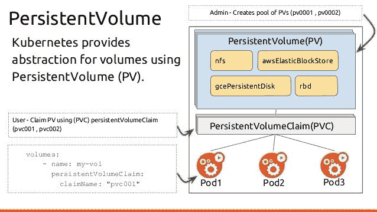

# 管理持久存储

在上一章中，我们描述了如何使用高级安装方法安装 OpenShift 集群。安装过程的下一步是为 OpenShift 用户提供持久存储。在 第一章 *容器和 Docker 概述* 中，我们已经介绍了如何使用 Docker 持久卷。通常，开发或测试时不需要持久存储，但在生产环境中，我们有时需要存储持久数据。本章将描述有关 OpenShift 基础设施的持久存储概念。我们还将解释在生产环境中使用持久存储的必要性。本章的重点是如何配置基础设施以支持持久存储。这包括以下存储类型：NFS、GlusterFS、iSCSI 等。除了基础设施准备之外，本章还介绍了如何在 OpenShift 中使用 **持久卷**（**PVs**）和 **持久卷声明**（**PVCs**）来利用持久存储。最后，我们将展示如何在部署在 OpenShift 上的 Pods/应用程序中使用持久存储。

本章将涵盖以下主题：

+   持久存储与临时存储

+   OpenShift 持久化存储概念

+   存储后端比较

+   存储基础设施设置

+   配置 PVs

+   在 Pods 中使用持久存储

# 技术要求

本章的学习环境由两台虚拟机组成，具有以下特点：

| **主机名** | **内存** | **vCPU** | **操作系统** |
| --- | --- | --- | --- |
| `openshift.example.com` | 4GB | 2 | CentOS 7 |
| `storage.example.com` | 2GB | 1 | CentOS 7 |

这些机器可以部署在任何地方（裸机、VMware、OpenStack、AWS 等）。然而，出于教育目的，我们建议使用 Vagrant + VirtualBox/libvirt 配置，以简化虚拟环境的部署和重新部署过程。

我们还假设所有服务器都可以通过 FQDN 和短名称访问。这需要配置 `/etc/hosts` 记录，具体配置如下：

```
172.24.0.11 openshift.example.com openshift
172.24.0.12 storage.example.com storage
```

这些 IP 地址必须与以下 Vagrantfile 中指定的 IP 地址相同。如果你只想在此实验中使用一台机器，可以将 `/etc/hosts` 文件配置为将两个记录指向同一台机器。

可以通过使用以下 `Vagrantfile` 来简化实验环境的部署：

```
$ cat Vagrantfile 
$lab_script = <<SCRIPT
cat <<EOF >> /etc/hosts
172.24.0.11 openshift.example.com openshift
172.24.0.12 storage.example.com storage
EOF
SCRIPT

$lab_openshift = <<SCRIPT
systemctl disable firewalld
systemctl stop firewalld
yum install -y epel-release git
yum install -y docker
cat << EOF >/etc/docker/daemon.json
{
 "insecure-registries": [
 "172.30.0.0/16"
 ]
}
EOF
systemctl start docker
systemctl enable docker
yum -y install centos-release-openshift-origin39
yum -y install origin-clients
oc cluster up
SCRIPT

Vagrant.configure(2) do |config|
 config.vm.define "openshift" do |conf|
 conf.vm.box = "centos/7"
 conf.vm.hostname = 'openshift.example.com'
 conf.vm.network "private_network", ip: "172.24.0.11"
 conf.vm.provider "virtualbox" do |v|
 v.memory = 4096
 v.cpus = 2
 end
 conf.vm.provision "shell", inline: $lab_script
 conf.vm.provision "shell", inline: $lab_openshift
 end

 config.vm.define "storage" do |conf|
 conf.vm.box = "centos/7"
 conf.vm.hostname = 'storage.example.com'
 conf.vm.network "private_network", ip: "172.24.0.12"
 conf.vm.provider "virtualbox" do |v|
 v.memory = 2048
 v.cpus = 1
 end
 conf.vm.provision "shell", inline: $lab_script
 end
end
```

不必使用前面代码中使用的相同 IP 地址。重要的是将你的 `/etc/hosts` 记录指向这些 IP。

# 持久存储与临时存储

默认情况下，OpenShift/Kubernetes 容器不会持久化存储数据。我们可以启动一个应用程序，OpenShift 会从一个不可变的 Docker 镜像启动一个新的容器。它使用的是短暂存储，这意味着数据在容器被删除或重建之前是可用的。如果我们的应用程序（及所有相关容器）被重建，所有数据都会丢失。然而，这种方法对于任何无状态应用程序来说是可行的。例如，它适用于一个简单的网站，这个网站不充当门户，只提供嵌入在 HTML/CSS 中的信息。另一个例子是用于开发的数据库——通常没有人在乎数据是否丢失。

让我们考虑另一个例子。假设我们需要为 WordPress 容器提供数据库。如果我们将数据库文件存储在短暂存储中，当数据库容器被重建或删除时，我们可能会丢失所有数据。我们不能允许数据库文件被删除或丢失。OpenShift 可以无问题地重建我们的数据库容器。它将给我们一个工作实例的数据库，但没有所需的数据库/表结构和表中的数据。从应用程序的角度来看，这意味着所有必需的信息都丢失了。对于这些类型的应用程序（有状态的），我们需要一个持久存储，即使容器崩溃、被删除或重建，它依然可用。

存储需求（短暂存储与持久存储）取决于您的具体使用案例。

# OpenShift 持久存储概念

OpenShift 使用**持久卷**（**PV**）概念，允许管理员为集群提供持久存储，然后让开发人员通过**持久卷声明**（**PVC**）请求存储资源。因此，最终用户可以在无需深入了解底层存储基础设施的情况下请求存储。同时，管理员可以配置底层存储基础设施，并通过 PV 概念将其提供给最终用户。

PV 资源在 OpenShift 集群中是共享的，因为其中任何一个都可以（如果允许的话）被任何用户/项目使用。另一方面，PVC 资源是特定于某个项目（命名空间）的，通常由最终用户（如开发人员）创建和使用。一旦 PVC 资源被创建，OpenShift 会尝试找到一个合适的 PV 资源，满足特定的标准，比如大小要求、访问模式（RWO、ROX、RWX）等。如果找到了满足 PVC 请求的 PV，OpenShift 会将该 PV 绑定到我们的 PVC。一旦绑定完成，PV 将不能再绑定到其他 PVC。

这个概念在以下截图中有所展示：



OpenShift Pod、PV、PVC 和存储关系

# 持久卷

PV 由一个 PersistentVolume OpenShift API 对象表示，该对象描述了现有的存储基础设施，如 NFS 共享、GlusterFS 卷、iSCSI 目标、Ceph RBD 设备等。假定底层存储组件已经存在并准备好被 OpenShift 集群使用。

PV（持久卷）有其自己的生命周期，这与任何使用 PV 的 pod 是独立的。

基础设施中的存储高可用性由底层存储提供商负责。

# 持久卷声明（PVC）

正如我之前提到的，OpenShift 用户可以通过 PVC（由 `PersistentVolumeClaim` OpenShift API 对象定义）请求应用程序所需的存储资源。PVC 代表终端用户（通常是开发人员）提出的请求。PVC 消耗 PV 资源。

PVC 包含一些关于应用程序/用户请求的资源的重要信息：

+   所需大小

+   访问模式

在 OpenShift 基础架构中，可以使用几种访问模式：

| **模式** | **描述** | **示例** |
| --- | --- | --- |
| ReadOnlyMany | 卷可以被多个节点以只读模式挂载。 | NFS 只读模式 |
| ReadWriteOnce | 卷可以被单个节点以读写模式挂载。 | 基于 iSCSI 的 xfs 等 |
| ReadWriteMany | 卷可以被多个节点以读写模式挂载。 | GlusterFS，NFS |

一旦 PVC 资源被创建，OpenShift 必须找到合适的 PV 资源并将其绑定到 PVC。如果绑定成功，PVC 资源可以被应用程序使用。

# OpenShift 中的存储生命周期

PV 和 PVC（持久卷声明）资源之间的交互包括多个步骤，如下图所示：


OpenShift: 存储生命周期

OpenShift 集群管理员可以配置动态 PV 配置，或提前配置 PV 资源。一旦用户使用 PVC 请求具有特定大小和访问模式要求的存储资源，OpenShift 将查找可用的 PV 资源。至少，用户总是能获得他们要求的资源。为了将存储使用保持在最低限度，OpenShift 会绑定最小的符合所有标准的 PV。PVC 会一直处于未绑定状态，直到找到合适的 PV。如果有符合所有标准的卷，OpenShift 软件会将它们绑定在一起。从这一步骤开始，存储可以被 pod 使用。一个 pod 消耗 PVC 资源作为卷。

OpenShift 检查声明，找到绑定的卷并将该卷挂载到 pod。对于那些支持多种访问模式的卷，用户在将其作为 pod 中的卷使用时，指定希望使用的模式。

用户可以删除 PVC 对象，这样就可以回收存储资源。如果 PVC 被删除，该卷被视为 *已释放*，但尚未立即可以绑定到其他声明。这要求根据回收策略处理存储在卷上的数据。

回收策略定义了 OpenShift 在释放卷后如何处理卷的方式。支持以下回收策略：

| **策略** | **描述** |
| --- | --- |
| 保留 | 允许手动回收支持此功能的卷插件的资源。在这种情况下，存储管理员应手动删除数据。 |
| 删除 | 从 OpenShift 容器平台中删除 PV 对象以及在外部基础设施（如 AWS EBS、GCE PD 或 Cinder 卷）中关联的存储资产。 |

# 存储后端比较

OpenShift 支持多种不同工作方式的持久存储后端。其中一些支持多客户端的读写（如 NFS），而其他的则仅支持单个挂载。

下表包含了支持的存储后端/插件的比较：

| **卷后端** | **ReadWriteOnce** | **ReadWriteMany** | **ReadOnlyMany** |
| --- | --- | --- | --- |
| AWS EBS | 是 |  |   |
| Azure Disk | 是 |  |  |
| Ceph RBD | 是 |  | 是 |
| 光纤通道 | 是 |  | 是 |
| GCE Persistent Disk | 是 |  |  |
| GlusterFS | 是 | 是 | 是 |
| HostPath | 是 |  |  |
| iSCSI | 是 |  | 是 |
| NFS（网络文件系统） | 是 | 是 | 是 |
| OpenStack Cinder | 是 |  |  |
| VMware vSphere | 是 |  |  |
| 本地 | 是 |  |  |

`HostPath` 允许您直接从运行您的 Pod 的节点挂载持久存储，因此不适合生产使用。请仅在测试或开发目的下使用它。

在 OpenShift 集群中支持两种类型的存储：

+   基于文件系统的存储（如 NFS、Gluster 和 HostPath）

+   基于块的存储（如 iSCSI、OpenStack Cinder 等）

Docker 容器需要基于文件系统的存储作为持久卷使用。这意味着 OpenShift 可以直接使用基于文件系统的存储。在使用作为持久卷之前，OpenShift 需要在块存储上创建文件系统。例如，如果提供了一个 iSCSI 块设备，集群管理员在 PV 创建过程中必须定义将在块设备上创建的文件系统。

# 存储基础设施设置

配置底层存储基础设施通常是存储管理员的任务。这需要一些设置和设计决策，以便达到预期的耐用性、可用性和性能水平。这需要对底层资源、物理基础设施、网络等有重要的了解。一旦存储子系统由存储管理员正确配置，OpenShift 集群管理员可以利用它来创建 PV。

本书讲述的是 OpenShift 管理，因此底层存储技术的配置超出了其范围。然而，我们想演示如何在 Linux 系统上为 NFS、GlusterFS 和 iSCSI 执行存储基础设施的基本设置。

如果你仍然需要设置其他类型的存储，请参考相关文档。例如，你可以在 [`ceph.com`](https://ceph.com) 查找到 Ceph 存储文档；OpenStack Cinder 文档可以在项目主页 [openstack.org](http://openstack.org) 查找到。

我们选择了 NFS 和 GlusterFS 基于存储的方式，原因有很多：

+   两者都是基于文件系统的存储解决方案

+   两者都支持 `ReadWriteMany` OpenShift 访问类型

+   两者都可以轻松地在任何 OpenShift 集群节点上配置

+   NFS 是任何 Linux 系统管理员都熟知的

我们还想展示如何在 OpenShift 集群中使用基于块的存储。我们选择了基于 iSCSI 的存储作为示例存储，因为它是 Linux 上使用块存储的最简单方式之一。

# 设置 NFS

**网络文件系统** (**NFS**) 是一种客户端/服务器文件系统协议，最初由 Sun Microsystems 于 1984 年开发。NFS 允许客户端计算机（NFS 客户端）通过网络甚至互联网访问存储在 NFS 服务器上的文件。NFS 服务器与多个允许的 NFS 客户端共享一个或多个 NFS 共享。NFS 客户端将 NFS 共享挂载为常规文件系统。由于 NFS 是符合 POSIX 的文件系统协议，因此不需要特定的应用程序设置。这是 NFS 作为网络存储解决方案如此受欢迎的主要原因。NFS 默认由 Linux 内核支持，可以在任何基于 Linux 的服务器上进行配置。

在本教程中，我们将使用一个独立的 NFS 服务器为我们将在 OpenShift 集群上部署的应用程序提供持久存储。

所描述的安装过程适用于 CentOS 7。

NFS 安装和配置过程涉及多个步骤：

1.  在服务器和客户端上安装 NFS 软件包

1.  配置服务器上的 NFS 导出

1.  启动并启用 NFS 服务

1.  在客户端上验证或挂载 NFS 共享

在我们开始之前，需要部署两台机器，具体描述请见 *技术要求* 部分。在本实验中，我们假设这些机器是通过 Vagrant 部署为虚拟机的。

启动你的 Vagrant 环境并登录到 `storage` 虚拟机：

```
$ vagtrant up
$ vagrant ssh storage
```

# 在服务器和客户端上安装 NFS 软件包

需要在 NFS 服务器以及所有 OpenShift 节点上安装 NFS 软件包，因为它们将作为 NFS 客户端。NFS 库和二进制文件由 `nfs-utils` 包提供：

```
# yum install -y nfs-utils
…
<output omitted>
…
Updated:
  nfs-utils.x86_64 1:1.3.0-0.54.el7
Complete!
```

我们将在 storage.example.com 上配置 NFS 服务。所有配置均在 `root` 账户下完成。你可以使用 `sudo -i` 命令切换到 root 用户。

# 配置服务器上的 NFS 导出

这只需要在服务器端完成。我们将会在 `/exports` 目录下导出多个文件系统。这些导出的文件系统将仅对 OpenShift 节点可访问。

OpenShift 集群使用随机 **用户 ID** (**UIDs**) 运行 Docker 容器。由于难以预测 UID 以授予正确的 NFS 权限，因此我们必须配置以下 NFS 设置，允许 OpenShift 正常使用 NFS 共享：

+   共享应由 `nfsnobody` 用户和组拥有。

+   共享应具有 `0700` 访问权限。

+   共享应使用 `all_squash` 选项进行导出。稍后将在本主题中描述这一点。

1.  创建所需的目录并赋予正确的权限：

```
# mkdir -p /exports/{nfsvol1,nfsvol2,nfsvol3}
# chmod 0700 /exports/{nfsvol1,nfsvol2,nfsvol3}
# chown nfsnobody:nfsnobody /exports/{nfsvol1,nfsvol2,nfsvol3}
```

1.  配置防火墙：

```
# firewall-cmd --perm --add-service={nfs,mountd,rpc-bind}
success

# firewall-cmd --reload
success
```

在 Vagrant box centos/7 上不需要此步骤，因为默认情况下 `firewalld` 被禁用。

1.  通过将以下行添加到 `/etc/exports` 文件中创建 NFS 导出：

```
# cat <<EOF > /etc/exports
/exports/nfsvol1 openshift.example.com(rw,sync,all_squash)
/exports/nfsvol2 openshift.example.com(rw,sync,all_squash)
/exports/nfsvol3 openshift.example.com(rw,sync,all_squash)
EOF
```

你也可以指定节点的 IP 地址，而不是提供 FQDN。如下所示，代码中将显示：

```
# cat <<EOF > /etc/exports
/exports/nfsvol1 172.24.0.11(rw,sync,all_squash)
/exports/nfsvol2 172.24.0.11(rw,sync,all_squash)
/exports/nfsvol3 172.24.0.11(rw,sync,all_squash)
EOF
```

`all_squash` NFS 导出选项将 NFS 配置为将所有 UID 映射到 `nfsnobody` 用户 ID。

# 启动并启用 NFS 服务

我们还需要使用 `systemctl` 命令启用并启动 nfs-server。以下代码片段展示了如何启用和启动 NFS 服务所需的所有服务：

```
# systemctl enable rpcbind nfs-server
Created symlink from /etc/systemd/system/multi-user.target.wants/nfs-server.service to /usr/lib/systemd/system/nfs-server.service.
# systemctl start rpcbind nfs-server
```

# 验证

你可能需要检查 NFS 共享是否正确导出。以下命令将显示所有可用的导出：

```
# exportfs -v
/exports/nfsvol1 openshift.example.com(rw,sync,wdelay,hide,no_subtree_check,sec=sys,secure,root_squash,all_squash)
/exports/nfsvol2 openshift.example.com(rw,sync,wdelay,hide,no_subtree_check,sec=sys,secure,root_squash,all_squash)
/exports/nfsvol3 openshift.example.com(rw,sync,wdelay,hide,no_subtree_check,sec=sys,secure,root_squash,all_squash)
```

# 配置 GlusterFS 共享

GlusterFS 是一个免费的可扩展网络文件系统，适用于数据密集型任务，如云存储和媒体流。GlusterFS 在一个或多个存储节点上创建一个卷，使用 *砖块*。砖块代表存储节点上的文件系统。根据数据在砖块上的存放方式，定义了几种类型的 GlusterFS 卷。更多信息可以通过本章末尾提供的链接找到。在本章中，我们只需要了解以下几种卷类型的基本知识：

| **类型** | **描述** |
| --- | --- |
| 分布式 | 所有文件在砖块/存储节点之间分布。此卷类型不提供冗余。 |
| 复制 | 所有文件在两个或多个砖块之间复制。因此，每个文件至少存储在两个砖块上，从而提供冗余。 |
| 条带化 | 每个文件被分布在多个砖块上。 |

在本演示中，我们将在单个存储节点上设置一个基本的 GlusterFS 卷。

# 安装软件包

首先，我们需要安装 GlusterFS 软件包，这些软件包位于一个特殊的 GlusterFS 仓库中。`centos-release-gluster312` 包配置了 GlusterFS 3.12 仓库。我们需要在服务器端（`storage.example.com`）安装 `glusterfs-server`，并在客户端（`openshift.example.com`）安装 `glusterfs` 包：

```
# yum install -y centos-release-gluster312 ...
<output omitted>
...
# yum install -y glusterfs-server
...
<output omitted>
...
Dependency Installed:
 attr.x86_64 0:2.4.46-12.el7
 glusterfs.x86_64 0:3.12.6-1.el7
 glusterfs-api.x86_64 0:3.12.6-1.el7
 glusterfs-cli.x86_64 0:3.12.6-1.el7
 glusterfs-client-xlators.x86_64 0:3.12.6-1.el7
 glusterfs-fuse.x86_64 0:3.12.6-1.el7
 glusterfs-libs.x86_64 0:3.12.6-1.el7
 psmisc.x86_64 0:22.20-15.el7
 userspace-rcu.x86_64 0:0.10.0-3.el7

Complete!
```

一旦安装了 GlusterFS 软件包，我们需要启动并启用 Gluster 管理服务 `glusterd`：

```
# systemctl enable glusterd
Created symlink from /etc/systemd/system/multi-user.target.wants/glusterd.service to /usr/lib/systemd/system/glusterd.service.
# systemctl start glusterd
```

# 配置砖块和卷

以下 GlusterFS 卷配置步骤要求我们创建一个砖块文件系统和卷本身：

对于本实验，我们将使用根文件系统来创建 GlusterFS 砖块。此设置仅适用于测试和开发目的，不适合生产使用。所有 GlusterFS 生产安装应使用独立的文件系统来存储 GlusterFS 砖块，最好位于独立的物理块设备上。

```
# mkdir /exports/gluster
# gluster volume create gvol1 storage.example.com:/exports/gluster force
volume create: gvol1: success: please start the volume to access data
```

由于我们使用`/`文件系统来创建 GlusterFS 卷，因此需要使用`force`选项。如果未提供此选项，您可能会看到以下输出：

```
# gluster volume create gvol1 storage.example.com:/exports/gluster
volume create: gvol1: failed: The brick storage.example.com:/exports/gluster is being created in the root partition. It is recommended that you don't use the system's root partition for storage backend. Or use 'force' at the end of the command if you want to override this behavior.
```

现在我们已经创建了一个卷，正是启动它、使其对客户端可用的好时机：

```
# gluster volume start gvol1
volume start: gvol1: success
```

# 配置 iSCSI

**互联网小型计算机系统接口**（**iSCSI**）是一种客户端/服务器协议，通过在 TCP/IP 网络上传输 SCSI 命令，为存储设备提供块级访问。由于 iSCSI 使用 TCP/IP 网络，它可以在**局域网**（**LAN**）、**广域网**（**WAN**）和互联网中传输数据，实现位置无关的数据存储和检索。该协议允许客户端（*发起者*）向远程服务器上的存储设备（*目标*）发送 SCSI 命令。它是**存储区域网络**（**SAN**）协议。iSCSI 允许客户端与远程块设备一起工作，并将其视为本地连接的磁盘。存在多种 iSCSI 目标实现（如 stgtd、LIO 目标等）。在本章中，我们将配置基于 LIO 目标的 iSCSI 存储。

配置`storage.example.com`上的 iSCSI 目标所需的步骤如下：

1.  安装 CLI 工具：

```
# yum install -y targetcli
```

1.  启用`target`服务：

```
# systemctl enable target; systemctl start target
```

1.  配置防火墙：

```
# firewall-cmd --permanent --add-port=3260/tcp
# firewall-cmd --reload
```

1.  使用`targetcli`配置 iSCSI 导出：

```
# targetcli
targetcli shell version 2.1.fb46
Copyright 2011-2013 by Datera, Inc and others.
For help on commands, type 'help'.

/> /backstores/fileio create iscsivol1 /exports/iscsivol1.raw 1g
Created fileio iscsivol1 with size 1073741824
/> /iscsi create iqn.2018-04.com.example.storage:disk1
Created target iqn.2018-04.com.example.storage:disk1.
Created TPG 1.
Global pref auto_add_default_portal=true
Created default portal listening on all IPs (0.0.0.0), port 3260.
/> cd iscsi/iqn.2018-04.com.example.storage:disk1/tpg1/
/iscsi/iqn.20...ge:disk1/tpg1> luns/ create /backstores/fileio/iscsivol1
Created LUN 0.
/iscsi/iqn.20...ge:disk1/tpg1> set attribute authentication=0 demo_mode_write_protect=0 generate_node_acls=1 cache_dynamic_acls=1
Parameter generate_node_acls is now '1'.
/iscsi/iqn.20...ge:disk1/tpg1> exit
Global pref auto_save_on_exit=true
Last 10 configs saved in /etc/target/backup.
Configuration saved to /etc/target/saveconfig.json
```

所有基本配置选项都可以在 man `targetcli`的*QUICKSTART*部分找到。出于教育目的，前面的示例将 iSCSI 卷导出到任何主机。请注意，这不是一个生产就绪的配置。在生产环境中，您可能只希望将目标的访问权限授予某些主机。

# 客户端验证

接下来的主题将描述如何在 OpenShift 集群内使用 NFS、Gluster 和 iSCSI 存储资源。不过，您也可以手动使用之前配置的资源。在进入下一个主题之前，我们强烈建议通过在客户端进行挂载来验证所有资源是否正确配置。在我们的例子中，客户端位于`openshift.example.com`节点。我们在开始之前，先登录到 OpenShift 节点并切换到 root 账户：

```
$ vagrant ssh openshift
Last login: Sun Jul 8 22:24:44 2018 from 10.0.2.2
[vagrant@openshift ~]$ sudo -i
```

# NFS 验证

为了验证 NFS 导出是否正常工作，我们需要在`openshift.example.com`节点上挂载它们，下面的代码展示了这一点。如果所有共享都能顺利挂载，您可以认为该共享已正确导出：

```
# yum install -y nfs-utils
... <output omitted>
...
# showmount -e storage.example.com
Export list for storage.example.com:
/exports/nfsvol3 openshift.example.com
/exports/nfsvol2 openshift.example.com
/exports/nfsvol1 openshift.example.com
# mkdir /mnt/{nfsvol1,nfsvol2,nfsvol3}
# mount storage.example.com:/exports/nfsvol1 /mnt/nfsvol1
# mount storage.example.com:/exports/nfsvol2 /mnt/nfsvol2
# mount storage.example.com:/exports/nfsvol3 /mnt/nfsvol3
# df -h|grep nfsvol
storage.example.com:/exports/nfsvol1 38G 697M 37G 2% /mnt/nfsvol1
storage.example.com:/exports/nfsvol2 38G 697M 37G 2% /mnt/nfsvol2
storage.example.com:/exports/nfsvol3 38G 697M 37G 2% /mnt/nfsvol3
# umount /mnt/nfsvol1 /mnt/nfsvol2 /mnt/nfsvol3
```

假设通过运行`yum install -y nfs-utils`，所有必需的包已安装。

# GlusterFS 验证

可以通过使用 FUSE 客户端手动挂载 GlusterFS 卷。验证过程如下：

```
# yum install centos-release-gluster312 -y
# yum install glusterfs-fuse -y
# mkdir /mnt/gvol1
# mount -t glusterfs storage.example.com:/gvol1 /mnt/gvol1 
```

创建一个示例持久数据以供以后使用：

```
# echo "Persistent data on GlusterFS" > /mnt/gvol1/index.html
```

此存储将作为 Web 服务器根数据存储使用。

验证挂载点是否可用，然后卸载存储：

```
# df -h /mnt/gvol1/
Filesystem Size Used Avail Use% Mounted on
storage.example.com:/gvol1 38G 713M 37G 2% /mnt/gvol1
# umount /mnt/gvol1
```

# iSCSI 验证

iSCSI 验证假设 OpenShift 节点可以访问块存储设备。如果一切顺利，你应该会在 `/proc/partitions` 看到一个额外的磁盘。iSCSI 客户端工具由 `iscsi-initiator-utils` 包提供。安装该包后，可以使用 `iscsiadm` 工具扫描目标以查找 iSCSI 导出：

```
# yum install -y iscsi-initiator-utils
... <output omitted>
...
# iscsiadm --mode discoverydb --type sendtargets --portal storage.example.com --discover 172.24.0.12:3260,1 iqn.2018-04.com.example.storage:disk1 # iscsiadm --mode node --login Logging in to [iface: default, target: iqn.2018-04.com.example.storage:disk1, portal: 172.24.0.12,3260] (multiple)
Login to [iface: default, target: iqn.2018-04.com.example.storage:disk1, portal: 172.24.0.12,3260] successful.
# cat /proc/partitions major minor #blocks name

   8 0 41943040 sda
   8 1 1024 sda1
   8 2 1048576 sda2
   8 3 40892416 sda3
 253 0 39288832 dm-0
 253 1 1572864 dm-1
   8 16 1048576 sdb

# iscsiadm --mode node --logout Logging out of session [sid: 2, target: iqn.2018-04.com.example.storage:disk1, portal: 172.24.0.12,3260]
Logout of [sid: 2, target: iqn.2018-04.com.example.storage:disk1, portal: 172.24.0.12,3260] successful.

# iscsiadm --mode node -T iqn.2018-04.com.example.storage:disk1 --op delete
```

你还可以使用 `lsblk` 工具发现系统中可用的块设备。

# 配置物理卷（PV）

如前所述，OpenShift 集群管理员可以为 OpenShift 用户创建 PV 资源以供将来使用。

本主题假设 OpenShift 环境已在 `openshift.example.com` 节点上运行。你可以使用 `oc cluster up` 或通过 Ansible 进行高级 OpenShift 安装。

如前所述，只有集群管理员才能配置 PV。因此，在开始以下实验之前，你必须切换到管理员账户：

```
# oc login -u system:admin 
```

我们建议创建一个新项目来进行这个与 `持久存储` 相关的实验：

```
# oc new-project persistent-storage
```

客户端将自动将当前项目切换到新创建的项目。

在接下来的示例中，我们将创建以下 PV：

| **PV** | **存储后端** | **大小** |
| --- | --- | --- |
| `pv-nfsvol1` | NFS | 2 GiB |
| `pv-gluster` | GlusterFS | 3 GiB |
| `pv-iscsi` | iSCSI | 1 GiB |

# 为 NFS 共享创建 PV

由 OpenShift API 创建的与 NFS 相关的 `PersistentVolume` 资源可以使用 YAML 或 JSON 表示法定义，并可以通过 `oc create` 命令提交给 API。之前，我们在 `storage.example.com` 上设置了多个 NFS 导出。现在，我们需要为它们创建适当的 PV 资源。

以下示例提供了一个文件，可以使 NFS 资源在 OpenShift 集群中可用：

```
# cat pv-nfsvol1.yaml
apiVersion: v1
kind: PersistentVolume
metadata:
  name: pv-nfsvol1
spec:
  capacity:
    storage: 2Gi 
  accessModes:
    - ReadWriteMany 
  persistentVolumeReclaimPolicy: Retain 
  nfs: 
    path: /exports/nfsvol1
    server: storage.example.com
    readOnly: false
```

该文件包含以下信息：

+   持久卷名称（`pv_nfsvol1`）位于 `metadata` 部分

+   可用容量（2 GiB）

+   支持的访问模式（ReadWriteMany）

+   存储回收策略（保留）

+   NFS 导出信息（服务器地址和路径）

文件创建后，我们可以通过以下命令使资源可用于集群：

```
# oc create -f pv-nfsvol1.yaml persistentvolume "pv-nfsvol1" created
```

上述命令会创建相应的 OpenShift API 资源。请注意，资源尚未挂载到 Pod，但已准备好与 PVC 绑定。

你可能希望创建另外两个定义来抽象之前创建的其他 NFS 共享。这些共享位于 `storage.example.com:/exports/nfsvol2` 和 `storage.example.com:/exports/nfsvol3`。共享 `/exports/nfsvol2` 和 `/exports/nfsvol3` 将不会被使用。

与任何其他 OpenShift API 资源一样，我们可以通过运行`describe`命令查看其配置：

```
# oc describe pv pv-nfsvol1
Name: pv-nfsvol1
Labels: <none>
Annotations: <none>
StorageClass:
Status: Available
Claim:
Reclaim Policy: Retain
Access Modes: RWX
Capacity: 2Gi
Message:
Source:
    Type: NFS (an NFS mount that lasts the lifetime of a pod)
    Server: storage.example.com
    Path: /exports/nfsvol1
    ReadOnly: false
Events: <none>
```

你可以通过以下命令使用`oc get pv`查看我们的 PV：

```
# oc get pv | egrep "^NAME|^pv-"
NAME CAPACITY ACCESSMODES RECLAIMPOLICY STATUS CLAIM STORAGECLASS REASON AGE
pv-nfsvol1 2Gi RWX Retain Available 37s
```

`oc cluster up`创建了一些预定义的 PV，命名为`pv0001`和`pv0100`。它们未显示在前面的输出中。

# 为 GlusterFS 卷创建 PV

GlusterFS 天生是分布式的，且与之前基于 NFS 的存储有很大不同。OpenShift 集群需要了解底层的 Gluster 存储基础设施，以便任何可调度的 OpenShift 节点都能挂载 GlusterFS 卷。配置 GlusterFS 持久卷涉及以下内容：

+   在每个可调度的 OpenShift 节点上安装`glusterfs-fuse`包

+   你底层基础设施中的现有 GlusterFS 存储

+   在 GlusterFS 集群中定义一组不同的服务器（IP 地址）作为端点

+   一个用于持久化端点的服务（可选）

+   一个现有的 Gluster 卷将作为持久卷对象中的引用。

首先，我们需要在 OpenShift 节点上安装`glusterfs-fuse`包：

```
# yum install -y centos-release-gluster312
# yum install -y glusterfs-fuse
```

端点定义旨在表示 GlusterFS 集群的服务器作为端点，因此包括你的 Gluster 服务器的 IP 地址。端口值可以是端口范围内的任何数值（`0` - `65535`）。可选地，你可以创建一个持久化端点的服务。

GlusterFS 服务由`Service` OpenShift API 对象表示，显示如下：

```
# cat gluster-service.yaml
apiVersion: v1
kind: Service
metadata:
  name: glusterfs-cluster
spec:
  ports:
    - port: 1
```

一旦该文件创建完成，可以像常规 API 对象一样创建`glusterfs`端点：

```
# oc create -f gluster-service.yaml
service "glusterfs-cluster" created
# oc get svc
NAME CLUSTER-IP EXTERNAL-IP PORT(S) AGE
glusterfs-cluster 172.30.193.29 <none> 1/TCP 3s
```

GlusterFS 端点的定义应包含所有用于数据交换的 Gluster 存储节点的信息。我们的示例只包含一个节点，IP 地址为`172.24.0.12`。因此，为了创建 Gluster 端点定义文件并创建 Gluster 端点，请运行以下命令：

```
# cat gluster-endpoint.yaml
apiVersion: v1
kind: Endpoints
metadata:
  name: glusterfs-cluster 
subsets:
  - addresses:
      - ip: 172.24.0.12
    ports:
      - port: 1

# oc create -f gluster-endpoint.yaml
endpoints "glusterfs-cluster" created

# oc get endpoints
NAME ENDPOINTS AGE
glusterfs-cluster 172.24.0.12:1 17s
```

现在，我们准备创建一个指向之前创建的 Gluster 卷的 PV：

```
# cat pv-gluster.yaml
apiVersion: v1
kind: PersistentVolume
metadata:
  name: pv-gluster 
spec:
  capacity:
    storage: 3Gi 
  accessModes: 
    - ReadWriteMany
  glusterfs: 
    endpoints: glusterfs-cluster 
    path: gvol1 
    readOnly: false
  persistentVolumeReclaimPolicy: Retain 

# oc create -f pv-gluster.yaml
persistentvolume "pv-gluster" created
```

我们正在使用`Retain`策略来演示系统管理员需要手动处理数据回收。

如我们所见，GlusterFS 的 PV 定义文件包含端点信息和卷的名称。

现在，以下卷应该可以使用：

```
# oc get pv | egrep "^NAME|^pv-"
NAME CAPACITY ACCESSMODES RECLAIMPOLICY STATUS CLAIM STORAGECLASS REASON AGE
pv-gluster 3Gi RWX Retain Available 2s
pv-nfsvol1 2Gi RWX Retain Available 2m
```

# iSCSI 的 PV

与 NFS 或 GlusterFS 持久卷不同，iSCSI 卷一次只能从一个客户端/Pod 访问。这是一个基于块的持久存储，我们应该提供我们将要使用的文件系统类型。在以下示例中，将使用`ext4`文件系统：

```
# cat pv-iscsi.yaml
apiVersion: v1
kind: PersistentVolume
metadata:
  name: pv-iscsi
spec:
  capacity:
    storage: 1Gi
  accessModes:
    - ReadWriteOnce
  iscsi:
     targetPortal: storage.example.com
     iqn: iqn.2018-04.com.example.storage:disk1
     lun: 0
     fsType: 'ext4'
     readOnly: false
```

让我们创建卷：

```
# oc create -f pv-iscsi.yaml
persistentvolume "pv-iscsi" created
```

在实验结束时，你应该至少有三个 PV，如以下代码所示：

```
# oc get pv | egrep "^NAME|^pv-"
NAME CAPACITY ACCESSMODES RECLAIMPOLICY STATUS CLAIM STORAGECLASS REASON AGE
pv-gluster 3Gi RWX Retain Available 1m
pv-iscsi   1Gi RWO Retain Available 6s
pv-nfsvol1 2Gi RWX Retain Available 3m
```

# 在 Pod 中使用持久存储

之前，我们创建了所有必需的 PV OpenShift API 对象，这些对象由 OpenStack 集群管理员提供。现在，我们将向你展示如何在应用程序中使用持久化存储。任何 OpenShift 用户都可以通过 PVC 概念请求持久化卷。

# 请求持久化卷

一旦 PV 资源可用，任何 OpenShift 用户都可以创建 PVC 来请求存储，并稍后使用该 PVC 将其附加为 Pod 中容器的卷。

接下来的示例不需要在`system:admin`账户下运行。任何非特权的 OpenShift 用户都可以使用 PVC 请求持久化卷。

用户应使用 YAML 或 JSON 语法创建 PVC 定义。以下示例展示了一个请求 1 GiB 持久化存储，并具有`ReadWriteOnce`权限的声明：

```
# cat pvc-db.yaml
apiVersion: v1
kind: PersistentVolumeClaim
metadata:
  name: pvc-db 
spec:
  accessModes:
  - ReadWriteOnce 
  resources:
     requests:
       storage: 1Gi 
```

现在，我们可以创建相应的 API 实体——PVC：

```
# oc create -f pvc-db.yaml
persistentvolumeclaim "pvc-db" created
```

我们可以使用`oc get pv`和`oc get pvc`命令来验证 PVC 的状态。两者应显示 PV/PVC 的状态：

```
# oc get pv | egrep "^NAME|^pv-"
NAME CAPACITY ACCESSMODES RECLAIMPOLICY STATUS CLAIM STORAGECLASS REASON AGE
pv-gluster 3Gi RWX Retain Available 2m
pv-iscsi   1Gi RWO Retain Bound persistent-storage/pvc-db 1m
pv-nfsvol1 2Gi RWX Retain Available 4m

# oc get pvc
NAME STATUS VOLUME CAPACITY ACCESSMODES STORAGECLASS AGE
pvc-db Bound pv-iscsi 1Gi RWO 28s
```

在你的特定案例中，PVC 将绑定到基于 iSCSI 的物理卷，因为它满足所有要求（`ReadWriteOnce`和`capacity`）。`Bound`状态意味着 OpenShift 能够找到合适的物理卷来执行绑定过程。

# 将 PVC 绑定到特定的 PV

通常，用户无需担心底层存储基础设施。用户只需使用 PVC 指定所需的存储大小和访问模式即可订购所需的存储。在某些情况下，可能需要将 PVC 绑定到特定的 PV。假设以下场景：你的存储基础设施复杂，并且你需要为数据库服务器提供尽可能快速的存储。将其放在 SSD 存储上会是一个不错的选择。在这种情况下，存储管理员可以为你提供由 SSD 硬盘支持的 FC 或 iSCSI 基础卷。OpenShift 管理员可能会为未来使用创建一个特定的 PV。在用户端，我们需要将新创建的 PVC 绑定到该特定的 PV。通过在`spec`部分下指定`volumeName`参数（`spec.volumeName`），可以实现 PVC 到 PV 的静态绑定。

在我们的特定示例中，我们剩下两个未绑定的卷，具有`ReadWriteMany`访问类型：`pv-gluster`和`pv-nfsvol1`。在以下示例中，我们将执行它们的静态绑定。

让我们为 Web 服务器数据创建一个 PVS 定义：

```
# cat pvc-web.yaml
apiVersion: "v1"
kind: "PersistentVolumeClaim"
metadata:
  name: "pvc-web"
spec:
  accessModes:
    - "ReadWriteMany"
  resources:
    requests:
      storage: "1Gi"
  volumeName: "pv-gluster"
```

从之前的定义创建 PVC，并查看 OpenShift 是否为其找到匹配的 PV：

```
# oc create -f pvc-web.yaml
persistentvolumeclaim "pvc-web" created

# oc get pv | egrep "^NAME|^pv-"
NAME CAPACITY ACCESSMODES RECLAIMPOLICY STATUS CLAIM STORAGECLASS REASON AGE
pv-gluster 3Gi RWX Retain Bound persistent-storage/pvc-web 3m
pv-iscsi   1Gi RWO Retain Bound persistent-storage/pvc-db 2m
pv-nfsvol1 2Gi RWX Retain Available 5m
```

最后，我们将使用以下 PVC 请求 100 MiB 的数据：

```
# cat pvc-data.yaml
apiVersion: "v1"
kind: "PersistentVolumeClaim"
metadata:
  name: "pvc-data"
spec:
  accessModes:
    - "ReadWriteMany"
  resources:
    requests:
      storage: "100Mi"

# oc create -f pvc-data.yaml
persistentvolumeclaim "pvc-data" created

# oc get pv | egrep "^NAME|^pv-"
NAME CAPACITY ACCESSMODES RECLAIMPOLICY STATUS CLAIM STORAGECLASS REASON AGE
pv-gluster 3Gi RWX Retain Bound persistent-storage/pvc-web 4m
pv-iscsi 1Gi RWO Retain Bound persistent-storage/pvc-db 2m
pv-nfsvol1 2Gi RWX Recycle Bound persistent-storage/pvc-data 6m
```

请注意，所有 PVS 现在都处于`Bound`状态。

# 在 Pod 定义中使用声明作为卷

之前，我们通过创建 PVC 请求了持久化存储，现在我们将创建一个应用程序，使用相应的 PVC，因为它们现在已绑定到由真实存储支持的 PVs。OpenShift 允许开发人员创建`Pod`并将 PVC 用作卷。以下示例展示了如何在基于 Apache 的容器中使用它：

```
# cat pod-webserver.yaml
apiVersion: v1
kind: Pod
metadata:
  name: mywebserverpod
  labels:
    name: webeserver
spec:
  containers:
    - name: webserver
      image: docker.io/centos/httpd
      ports:
        - name: web
          containerPort: 80
      volumeMounts:
        - name: volume-webroot
          mountPath: /var/www/html
 volumes:
 - name: volume-webroot
 persistentVolumeClaim:
 claimName: pvc-web
```

在前面的代码中，我们定义了一个 Apache pod，并配置它附加上之前申请的 `pvc-web` 提供的持久化卷到容器。OpenShift 会自动找到绑定的 PV，并将其挂载到容器上。

名为 `pvc-web` 的 PVC 已绑定到基于 GlusterFS 的 PV。这个持久化存储实现要求在 OpenShift 的每个命名空间/项目中定义 Gluster 端点和服务。所以，在进入实验的下一部分之前，我们需要通过运行以下命令再次创建这些服务和端点：

`oc create -f gluster-service.yaml`

`oc create -f gluster-endpoint.yaml`：

```
# oc create -f pod-webserver.yaml
pod "mywebserverpod" created
```

我们可以使用以下命令显示 pod 和卷相关信息：

```
# oc describe pod mywebserverpod | grep -A 4 Volumes:
Volumes:
  nfsvol:
    Type: PersistentVolumeClaim (a reference to a PersistentVolumeClaim in the same namespace)
    ClaimName: pvc-web
    ReadOnly: false
```

如果我们连接到容器并尝试创建 `/var/www/index.html` 文件，它将存储在 GlusterFS 中。我们可以验证 GlusterFS 卷是否已经挂载到节点上：

```
# df -h | grep gvol1
172.24.0.12:gvol1 38G 720M 37G 2% /var/lib/origin/openshift.local.volumes/pods/e2ca34d3-4823-11e8-9445-5254005f9478/volumes/kubernetes.io~glusterfs/pv-gluster
```

所以，现在容器可以访问挂载在`/var/www/html`的持久化数据。

之前，我们创建了一个存储在 GlusterFS 上的 `index.html` 文件。这意味着我们的 Web 服务器将自动访问 GlusterFS 卷 `gvol1` 上的所有数据。

现在，我们可以验证之前写入的持久化数据是否可访问。首先，我们需要获取 Web 服务器的集群 IP 地址：

```
# oc describe pod mywebserverpod | grep IP:
IP: 172.17.0.2
```

其次，尝试通过 `curl` 访问：

```
# curl http://172.17.0.2
Persistent data on GlusterFS
```

如我们所见，当前，Web 服务器显示的是 GlusterFS 上可用的数据。

现在，我们可以通过两种不同的方式验证数据是持久存储的：

+   在后台存储上

+   通过重新创建容器

让我们验证该文件确实存在于我们的 `storage.example.com` 服务器上：

```
[root@storage ~]# cat /exports/gluster/index.html Persistent data on GlusterFS
```

最后，让我们尝试再次删除并创建容器：

```
# oc delete pod mywebserverpod
pod "mywebserverpod" deleted
# oc create -f pod-webserver.yaml
pod "mywebserverpod" created
# oc describe pod mywebserverpod | grep IP:
IP: 172.17.0.2
# curl http://172.17.0.2:80 Persistent data on GlusterFS
```

如我们所见，数据得以持久存储并可访问，即使容器已被删除。

# 通过 `oc volume` 管理卷

OpenShift 用户可以通过 `oc volume` 将卷附加到任何运行中的应用程序。在这个例子中，我们将创建一个包含基本应用程序的 pod，并将持久化卷附加到该 pod 上。

首先，使用 `oc new-app` 部署一个基本的 Apache Web 服务器：

```
# oc new-app httpd ...
<output omitted>
...
```

一会儿后，所有 httpd 服务资源将会可用：

```
# oc get pod | egrep "^NAME|httpd"
NAME           READY STATUS   RESTARTS  AGE
httpd-1-qnh5k   1/1  Running    0       49s
```

`oc new-app` 创建了一个部署配置，控制应用程序部署过程。

在这个例子中，我们将把名为 `pvc-data` 的 PVC 作为卷附加到正在运行的容器中：

```
# oc volume dc/httpd --add --name=demovolume -t pvc --claim-name=pvc-data --mount-path=/var/www/html
deploymentconfig "httpd" updated

# oc get pod | egrep "^NAME|httpd" NAME READY STATUS RESTARTS AGE
httpd-2-bfbft 1/1 Running 0 40s

# oc describe pod httpd-2-bfbft | grep -A 4 Volumes:
Volumes:
 demovolume:
 Type: PersistentVolumeClaim (a reference to a PersistentVolumeClaim in the same namespace)
 ClaimName: pvc-data
 ReadOnly: false
```

我们可以验证是否将 NFS 共享挂载到容器：

```
# df -h | grep nfsvol1
storage.example.com:/exports/nfsvol1 38G 720M 37G 2% /var/lib/origin/openshift.local.volumes/pods/12cfe985-482b-11e8-9445-5254005f9478/volumes/kubernetes.io~nfs/pv-nfsvol1
```

现在，我们可以直接在导出目录中，在我们的存储服务器上创建一个 `index.html` 文件：

```
[root@storage ~]# echo "New NFS data" >/exports/nfsvol1/index.html
```

前面的命令是在存储服务器上运行的，而不是在 OpenShift 上！

一旦持久化数据可用，我们可以尝试访问 Web 服务：

```
# oc describe pod httpd-2-bfbft | grep IP:
IP: 172.17.0.3

# curl http://172.17.0.3:8080
New NFS data
```

如我们所见，将卷附加到 pod 上是成功的。现在，我们可以将其分离：

```
# oc volume dc/httpd --remove --name=demovolume
deploymentconfig "httpd" updated
```

请注意，每次更新相应的部署配置时，OpenShift 会滚动部署新的 pod。这意味着容器的 IP 地址会发生变化。为了避免这种情况，我们建议使用服务的 IP 地址来测试配置。

一旦容器被重新创建，注意到持久数据不可用。`httpd` 守护进程会显示默认页面：

```
# oc get pod
NAME READY STATUS RESTARTS AGE
httpd-3-fbq74 1/1 Running 0 1m

# oc describe pod httpd-3-fbq74 | grep IP:
IP: 172.17.0.4

# curl http://172.17.0.4:8080
<!DOCTYPE html PUBLIC "-//W3C//DTD XHTML 1.1//EN" "http://www.w3.org/TR/xhtml11/DTD/xhtml11.dtd">

<html  xml:lang="en">
 <head>
 <title>Test Page for the Apache HTTP Server on Red Hat Enterprise Linux</title>
...
<output omitted>
...
```

# 数据库容器的持久数据

让我们为 MariaDB 实例附加一个基于 iSCSI 的持久卷。首先，我们需要启动一个 `mariadb` 应用程序，如下所示：

```
# oc new-app \
-e MYSQL_USER=openshift \
-e MYSQL_PASSWORD=openshift \
-e MYSQL_DATABASE=openshift \
mariadb
Found image a339b72 (10 days old) in image stream "openshift/mariadb" under tag "10.1" for "mariadb"

MariaDB 10.1
------------
MariaDB is a multi-user, multi-threaded SQL database server. The container image provides a containerized packaging of the MariaDB mysqld daemon and client application. The mysqld server daemon accepts connections from clients and provides access to content from MariaDB databases on behalf of the clients.

Tags: database, mysql, mariadb, mariadb101, rh-mariadb101, galera

* This image will be deployed in deployment config "mariadb"
* Port 3306/tcp will be load balanced by service "mariadb"
* Other containers can access this service through the hostname "mariadb"
* This image declares volumes and will default to use non-persistent, host-local storage.
You can add persistent volumes later by running 'volume dc/mariadb --add ...'

--> Creating resources ...

deploymentconfig "mariadb" created
service "mariadb" created
--> Success
Application is not exposed. You can expose services to the outside world by executing one or more of the commands below:
'oc expose svc/mariadb'
Run 'oc status' to view your app.
```

等待几分钟，然后检查 `mariadb` 实例的状态：

```
# oc get pod | egrep "^NAME|mariadb"
NAME            READY STATUS   RESTARTS AGE
mariadb-1-lfmrn 1/1   Running   0       1m
```

我们需要知道数据库文件的默认位置。可以使用`oc describe dc`命令来获取此信息，示例如下所示：

```
# oc describe dc mariadb
Name: mariadb
...
<output omitted>
...
 Mounts:
 /var/lib/mysql/data from mariadb-volume-1 (rw)
 Volumes:
 mariadb-volume-1:
 Type: EmptyDir (a temporary directory that shares a pod's lifetime)
 Medium:
...
<output omitted>
...
```

如我们所见，默认情况下，该容器将所有数据存储在 `/var/lib/mysql/data` 目录下的 `mariadb-volume-1` 卷中。这允许我们使用 `oc volume` 子命令替换其中的数据。

现在，我们将为 `mariadb` 容器附加一个卷。请注意，之前创建的数据库结构将丢失，因为它们未被持久化存储：

```
# oc volume dc/mariadb --add --name=mariadb-volume-1 -t pvc --claim-name=pvc-db --mount-path=/var/lib/mysql --overwrite deploymentconfig "mariadb" updated
```

这将自动重新部署 `mariadb` 并将数据库文件放置在持久存储上。

`ext4` 文件系统应该提前在 iSCSI 目标上创建。

现在你可以看到，OpenShift 可以轻松与最流行的存储协议集成，并允许你使容器化应用程序更具弹性。

# 总结

在生产环境中，持久存储的使用是 OpenShift 集群管理员和 OpenShift 用户的日常活动。在本章中，我们简要讨论了 OpenShift API 对象，如 PV 和 PVC，它们允许你定义并使用持久存储。我们展示了如何配置基础的存储服务，如 NFS、GlusterFS 和 iSCSI，并通过 `PV` 对象将它们添加到 OpenShift 的基础设施中。此外，我们还介绍了如何通过 `PVC` 对象请求持久存储。最后，我们从应用程序的角度展示了持久存储的基本使用示例。

# 问题

1.  哪种情况下使用持久存储比较合适？

    1.  开发环境中的 PostgreSQL 数据库

    1.  生产环境中的 MariaDB 数据库

    1.  Memcached

    1.  JDBC-连接器

1.  以下哪些 OpenShift 存储插件支持 `ReadWriteMany` 访问模式？选择两个：

    1.  NFS

    1.  iSCSI

    1.  Cinder 卷

    1.  GlusterFS

1.  PV 必须属于哪个项目？

    1.  默认

    1.  openshift

    1.  任何项目

    1.  openshift-infra

1.  假设我们创建了一个请求 2 Gi 存储的 PVC。哪个 PV 会与其绑定？

    1.  1950 Mi

    1.  1950 M

    1.  2 Gi

    1.  3 Gi

1.  在使用 GlusterFS 卷之前，必须创建哪些 OpenShift API 对象？选择两个：

    1.  Pod

    1.  服务

    1.  端点

    1.  路由

# 深入阅读

如果你对本章讨论的主题感兴趣，以下是一些链接供你参考：

+   [`docs.openshift.org/latest/install_config/persistent_storage/index.html`](https://docs.openshift.org/latest/install_config/persistent_storage/index.html)

+   [`linux-iscsi.org/wiki/LIO`](http://linux-iscsi.org/wiki/LIO)

+   [`docs.gluster.org/en/latest/Administrator%20Guide/Setting%20Up%20Volumes/`](https://docs.gluster.org/en/latest/Administrator%20Guide/Setting%20Up%20Volumes/)
