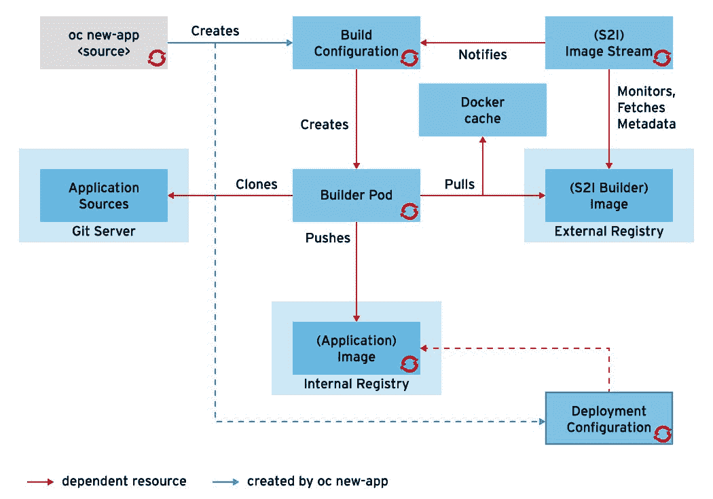
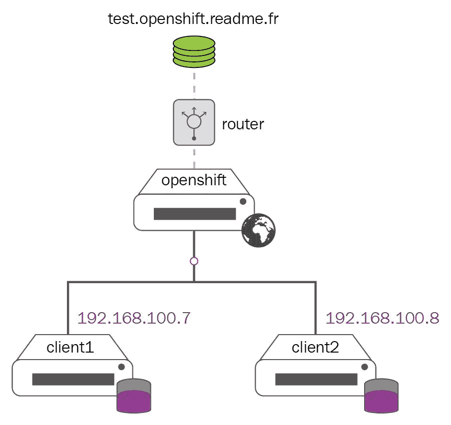
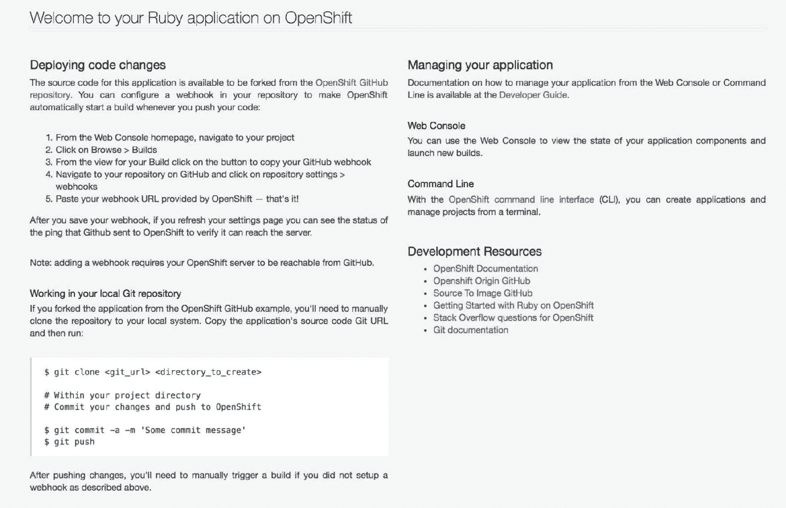

# OpenShift 核心概念

在前几章中，我们介绍了 Docker 和 Kubernetes 的基础知识，并讲解了 OpenShift 的架构。我们已经知道如何构建 OpenShift 实验环境，现在是时候动手操作，看看如何处理 OpenShift 的主要资源了。

本章将介绍 OpenShift 的核心概念，例如如何使用 OpenShift Pods、服务、路由、项目和用户创建新应用程序。这将为您提供基础技能，足以让您在 OpenShift 中运行和管理应用容器基础设施。

阅读完本章后，您将学习以下内容：

+   在 OpenShift 中管理项目和命名空间

+   在 OpenShift 中管理普通用户

+   在 OpenShift 中创建新应用程序

+   在 OpenShift 中管理 Pods

+   在 OpenShift 中管理服务

+   在 OpenShift 中管理路由

# 在 OpenShift 中管理项目

在我们开始之前，请确保您的 OpenShift 已经启动并运行。我们将使用 MiniShift 来完成本章内容：

```
$ minishift start --openshift-version=v3.9.0 --vm-driver=virtualbox
-- Starting profile 'minishift'
...
<output omitted>
...
```

一旦虚拟机启动，作为系统管理员登录：

```
$ oc login -u system:admin ...
<output omitted>
...
Using project "myproject".
```

如前所述，OpenShift CLI 与 Kubernetes CLI 有许多相似之处。`oc` 是 OpenShift 客户端的缩写，其工作方式类似于 Kubernetes 的 `kubectl`。随着我们深入了解，您会发现这两个命令有很多相似之处。

在我们深入了解如何创建第一个 OpenShift 应用程序并使用基础的 OpenShift 资源（如 Pods、服务和路由）之前，我们需要先熟悉 OpenShift 的管理和其他基本功能，如 OpenShift 项目和用户账户。首先，我们将重点关注 OpenShift 项目。

OpenShift 项目是一个带有额外功能（称为注释）的 Kubernetes 命名空间，注释为 OpenShift 提供了用户多租户和基于角色的访问控制。每个项目都有自己的一套策略、约束和服务账户。您可以看到，在 OpenShift 中，命名空间和项目的数量是相同的。我们需要使用的命令是 `oc get namespaces` 和 `oc get projects`：

```
$ oc get projects
NAME DISPLAY NAME STATUS
default Active
kube-public Active
kube-system Active
myproject My Project Active
openshift Active
openshift-infra Active
openshift-node Active
```

```
$ oc get namespaces
NAME              STATUS    AGE
default           Active     3d
kube-public       Active     3d
kube-system       Active     3d
myproject         Active     3d
openshift         Active     3d
openshift-infra   Active     3d
openshift-node    Active     3d
```

正如我们之前提到的，每个命名空间，或者说项目，是通过一系列规则与其他项目隔离的。这使得不同的团队可以独立工作。为了识别我们当前正在使用的项目，您可以使用 `oc projects` 命令。此命令会列出您可以使用的 OpenShift 项目，并告诉您当前正在使用的项目：

```
$ oc projects
You have access to the following projects and can switch between them with 'oc project <projectname>':
    default
    kube-public
    kube-system
    myproject - My Project
  * new-project1
    openshift
    openshift-infra
    openshift-node
Using project "new-project1" on server "https://127.0.0.1:8443".
```

星号 `*` 也表示当前项目。

我们可以看到有许多不同的项目可用，尽管我们还没有创建任何项目，因为系统管理员用户可以访问所有内容。

要创建一个新的 OpenShift 项目，必须使用 `oc new-project` 命令：

```
$ oc new-project new-project1
Now using project "new-project1" on server "https://127.0.0.1:8443".
...
<output omitted>
...
```

此命令创建一个新项目并自动切换到该项目。在我们的例子中，它会切换到 `new-project1`。我们也可以通过运行 `oc project` 命令手动切换到另一个可用的项目。现在让我们切换到 `default` 项目：

```
$ oc project default
Now using project "default" on server "https://127.0.0.1:8443".
```

请注意，`oc project default` 的输出不仅告诉你项目已切换到 `default`，还指定了 OpenShift 集群的 URL：`https://127.0.0.1:8443`。当我们处理多个独立工作的 OpenShift 集群时，这非常有用。

要删除一个 OpenShift 项目，可以使用 `oc delete` 命令：

```
$ oc delete project new-project1
project "new-project1" deleted
```

在接下来的章节中，我们将紧密地与项目一起工作。

# 在 OpenShift 中管理用户

当我们使用 `oc` 命令时，它会使用用户凭据向 OpenShift 集群发出 API 调用。

OpenShift 中有三种主要的用户类型。让我们快速了解这三种类型：

+   **普通用户**：一个普通的 OpenShift 用户。普通用户通常是具有 OpenShift 项目访问权限的开发人员。普通 OpenShift 用户的示例包括 user1 和 user2。

+   **系统用户**：系统 OpenShift 用户是特殊的，其中大多数用户在安装 OpenShift 时创建。系统用户的示例包括：

    +   `system:admin`：OpenShift 集群管理员用户

    +   `system:node:node1.example.com`：`node1.example.com` 节点用户

    +   `system:openshift-registry`：OpenShift 注册表用户

+   **服务账户**：与项目相关联的特殊系统用户。其中一些用户在创建新的 OpenShift 项目时会被创建。

在下一章中，我们将处理系统用户和服务账户。本章中，我们将处理普通用户。

我们可以通过使用 `oc whoami` 命令获取当前登录的 OpenShift 用户信息：

```
$ oc whoami
system:admin
```

要创建一个普通用户，可以使用 `oc create user` 命令：

```
$ oc create user user1
user "user1" created
```

在这个实验中，我们不需要设置用户密码，因为我们的实验环境已经设置为接受任何用户的任何密码。

默认情况下，用户会为我们当前正在工作的项目创建。要获取用户列表，可以使用 `oc get users` 命令：

```
$ oc get users
NAME      UID FULL NAME IDENTITIES
developer 46714e6b-2981-11e8-bae6-025000000001 anypassword:developer
user1 473664ec-299d-11e8-bae6-025000000001
```

我们应该能够看到两个用户：`developer` 和 `user1`。

开发者用户是通过 `oc cluster up` 命令以及项目 `myproject` 创建的。

`IDENTITIES` 字段定义了身份验证方法。在我们的实验环境设置中，开发者用户可以使用任何密码。这就是 `anypassword:developer` 的含义。

最后，我们需要学习的一个基本操作是如何在不同用户之间切换。我们可以使用 `oc login` 命令来实现：

```
$ oc login -u developer
Logged into "https://127.0.0.1:8443" as "developer" using existing credentials.
You have one project on this server: "myproject"
Using project "myproject".
```

`user1` 没有定义任何身份验证方法。这就是为什么你如果尝试登录 `user1` 会失败的原因。

在接下来的章节中，我们将把所有这些内容整合在一起，并为一个或多个项目分配特定用户，并为用户授予不同的权限。

# 在 OpenShift 中创建新应用程序

在 OpenShift 中运行的第一个最基本命令是 `oc new-app`。这个命令类似于 Kubernetes 的 `kubectl run`，但是 `oc new-app` 更加强大，并且工作方式略有不同。我们将在本章后面详细展示 `oc new-app` 是如何工作的。

测试 `oc new-app` 命令的最佳方式是创建一个新项目，然后在那里运行它：

```
$ oc new-project project1
Now using project "project1" on server "https://127.0.0.1:8443".
You can add applications to this project with the 'new-app' command. For example, try:

    oc new-app centos/ruby-22-centos7~https://github.com/openshift/ruby-ex.git
to build a new example application in Ruby.
```

命令输出告诉我们运行 `oc new-app centos/ruby-22-centos7~https://github.com/openshift/ruby-ex.git` 命令。运行该命令看看它是如何工作的：

```
$ oc new-app centos/ruby-22-centos7~https://github.com/openshift/ruby-ex.git
--> Found Docker image 1f02469 (8 days old) from Docker Hub for "centos/ruby-22-centos7"
...
<output omitted>
...
 * An image stream will be created as "ruby-22-centos7:latest" that will track the source image
 * A source build using source code from https://github.com/openshift/ruby-ex.git will be created
 * The resulting image will be pushed to image stream "ruby-ex:latest"
 * Every time "ruby-22-centos7:latest" changes a new build will be triggered
 * This image will be deployed in deployment config "ruby-ex"
 * Port 8080/tcp will be load balanced by service "ruby-ex"
 * Other containers can access this service through the hostname "ruby-ex"
...
<output omitted>
...
 Run 'oc status' to view your app.
```

我们已经看到，运行 `oc new-app` 有时会花费很长时间，或者只是卡住好几个小时。

如果你遇到这种情况，可以尝试重新安装集群。

同时，请确保主机上的防火墙已关闭。

如果这些选项对你都无效，你可以始终运行一个独立的虚拟机，并从头安装 OpenShift。

相较于我们之前看到的输出，将会有更多的信息，但如果仔细阅读，你应该能够发现：

+   OpenShift 拉取 Docker 镜像 `centos/ruby-22-centos7`

+   OpenShift 从 GitHub 获取源代码并下载

+   OpenShift 将 GitHub 的源代码应用到镜像中，并将其存储在内部注册表中，命名为 `ruby-ex`

+   `ruby-ex` 用于创建构建和部署配置

+   `ruby-ex` 服务用于负载均衡那些名称中包含 `ruby-ex` 的 pod 的流量。

以下图表表示这一流程：



oc new-app workflow

我们将在下一章深入了解所有这些资源。

# 管理 OpenShift 中的 pod

OpenShift pod 是 Kubernetes pod，代表一组容器，每个 pod 作为基本的管理单元。pod 中的所有容器共享相同的存储卷和网络。为了获取 OpenShift 中 pod 的列表，我们可以使用 `oc get pods` 命令：

```
$ oc get pods
NAME            READY  STATUS    RESTARTS      AGE
ruby-ex-1-build  0/1   Completed   0           1h
ruby-ex-1-zzhrc  1/1   Running     0           56m
```

它与 Kubernetes pod 没有区别，这意味着它背后运行的是一个 Docker 容器。唯一的区别是现在有两个容器。其中一个容器是用于构建应用了源代码的最终镜像的容器（`ruby-ex-1-build`）。我们可以通过在 Minishift 虚拟机中运行 `docker ps` 命令轻松验证这一点：

```
$ minishift ssh docker ps
CONTAINER ID IMAGE COMMAND CREATED STATUS PORTS NAMES
d07dd7cf63e4 172.30.1.1:5000/myproject/ruby-ex@sha256:aa86aab41fbf81ce0b09a1209618b67f353b18e5ac2ed00a030e7577bad1ed44 "container-entrypoint"...
<output omitted>
...
```

我们可以通过查看镜像 ID 中的 `myproject/ruby-ex` 部分，轻松找到正确的运行容器。我们可以在 Kubernetes 中执行类似的操作，例如获取日志、编辑或描述、删除 pod 等。

在开始下一部分之前，尝试运行 `oc delete`。

# 管理 OpenShift 中的服务

与 Kubernetes 类似，OpenShift 服务代表客户端与运行在 pod 中的实际应用程序之间的接口。一个服务是一个 IP:端口 对，将流量以轮询方式转发到后端 pod。

通过运行 `oc new-app` 命令，OpenShift 会自动创建一个服务。我们可以通过运行 `oc get services` 命令来验证这一点：

```
$ oc get services
NAME CLUSTER-IP         EXTERNAL-IP    PORT(S)           AGE
ruby-ex 172.30.173.195  <none>         8080/TCP          1h
```

输出结果与我们在 Kubernetes 中使用 `kubectl get services` 命令时得到的类似。我们可以通过运行 `oc delete` 和 `oc expose` 命令来删除并重新创建这个服务。在此之前，先在 Minishift 虚拟机内运行 `curl` 命令，验证服务是否正常运行：

```
$ minishift ssh "curl -I -m3 172.30.173.195:8080" ...
<output omitted>
...
0 0 0 0 0 0 0 0 --:--:-- --:--:-- 0 HTTP/1.1 200 OK ...
<output omitted>
...
```

状态码为`200`，这意味着网页可用且服务正常运行：

```
$ oc delete svc/ruby-ex
service "ruby-ex" deleted
```

确保服务已删除并且不再可用：

```
$ oc get svc
NAME CLUSTER-IP EXTERNAL-IP PORT(S) AGE

$ minishift ssh "curl -I -m3 172.30.173.195:8080" ...
<output omitted>
...
Command failed: exit status 28
```

现在，使用`oc expose`命令创建一个新的服务：

```
$ oc expose pods/ruby-ex-1-zzhrc
service "ruby-ex-1-zzhrc" exposed
```

在您的情况下，容器名称将会不同。重新运行`oc get pods`以获取运行的 Pod 名称。还有其他方法来创建服务，我们稍后将在本书中介绍：

```
$ oc get svc
NAME           CLUSTER-IP EXTERNAL-IP PORT(S) AGE
ruby-ex-1-zzhrc 172.30.79.183 <none> 8080/TCP 1m
```

最后，通过在 Minishift VM 上运行`curl`命令来检查服务是否恢复正常：

```
$ minishift ssh "curl -I -m3 172.30.79.183:8080" ...
<output omitted>
...
0 0 0 0 0 0 0 0 --:--:-- --:--:-- 0 HTTP/1.1 200 OK ...
<output omitted>
...
```

# 在 OpenShift 中管理路由

OpenShift 有一种优雅的方式来暴露服务，以便可以从 OpenShift 集群外部访问。这个资源在 OpenShift 中称为`router`。OpenShift 提供了将外部主机名映射到负载均衡器的功能，以将流量分发到 OpenShift 服务：



OpenShift 路由器工作流程

为了使 OpenShift 路由器能够负载均衡外部流量，必须使用 HTTP 或 HTTPS 协议，并且可以通过 DNS 使用 DNS 通配符解析。

通过使用额外的参数运行`oc expose`命令，让我们将我们的服务暴露到 OpenShift 集群外部：

```
$ oc expose service/ruby-ex-1-zzhrc --hostname="openshiftdemo.local"
```

检查路由列表：

```
$ oc get routes
NAME    HOST/PORT PATH SERVICES    PORT  TERMINATION       WILDCARD
ruby-ex-1-zzhrc openshiftdemo.local ruby-ex-1-zzhrc 8080   None
```

如果尝试运行`curl openshiftdemo.local`命令，它将无法工作，因为`openshiftdemo.local`没有 DNS 记录。最简单的方法之一是在 hosts 文件中添加静态 DNS 记录。由于我们使用的是 Minishift VM，因此需要创建一个指向 Minishift VM 的静态 DNS 记录。第一步是使用`oc status`命令检查 Minishift VM：

```
$ oc status
In project My Project (myproject) on server https://192.168.99.109:8443
```

现在，我们需要通过使用 Minishift VM 的 IP 地址和我们的项目主机名在 hosts 文件中创建静态记录：

```
$ cat /etc/hosts | grep openshift
192.168.99.109 openshiftdemo.local
```

一切准备就绪，现在我们可以进行最终测试。打开 Web 浏览器并访问[`openshiftdemo.local/webpage`](http://openshiftdemo.local/webpage)：



Ruby 演示应用程序网页

如果您没有看到欢迎网页，请检查是否可以 ping 通`openshiftdemo.local`，并尝试运行`curl openshiftdemo.local`命令。

如果尝试使用 Minishift VM 的 IP 地址而不是`openshiftdemo.local`打开网页，将会收到`Application is not available`。这是因为 OpenShift 路由器是基于 HAProxy 的容器，根据 URL 进行负载均衡。我们可以通过运行带有 OpenShift 路由器 Pod 的`oc describe`命令轻松验证这一点。首先，以`system:admin`身份登录，然后检查`default`命名空间中的路由器 Pod 名称：

```
$ oc login -u system:admin ...
<output omitted>
...
```

```
$ oc get pods -n default
NAME READY STATUS RESTARTS AGE
docker-registry-1-qctp4 1/1 Running 0 22h
persistent-volume-setup-mdmw6 0/1 Completed 0 22h
router-1-s9b7f 1/1 Running 0 22h
```

最后，运行`oc describe`命令，指定`router-1-s9b7f pod`，并查找`Image`行：

```
$ oc describe pods router-1-s9b7f -n default | grep Image:
    Image: openshift/origin-haproxy-router:v3.9.0
```

您可以将基于 HAProxy 的路由器替换为其他路由器，如 Nginx 或其他内容，但这超出了本书的范围。

# 摘要

在本章中，我们介绍了 OpenShift 核心概念，如 pods、services、routes、projects 和 users。在接下来的章节中，我们将详细探讨这些主题，并与这些资源密切合作，展示它们如何与其他 OpenShift 资源集成。

在下一章，我们将探讨高级 OpenShift 资源，包括源到镜像（source to image）和镜像流（image streams）、构建和构建配置（builds and build configs）、部署和部署配置（deployments and deployment configs），以及配置映射（config maps）和模板（templates）。我们还将使用 YAML 和 JSON 文件通过手动方式创建这些资源。

# 问题

1.  OpenShift 使用的两种节点类型是什么？选择两个：

    1.  节点

    1.  MiniShift

    1.  Vagrant

    1.  Master

1.  以下哪项不是 OpenShift 用户类型？选择两个：

    1.  普通用户

    1.  管理员用户

    1.  系统用户

    1.  服务账户

    1.  服务用户

1.  在 OpenShift 中，pod 是最小的部署单元，表示一组容器：

    1.  正确

    1.  错误

1.  在 OpenShift 中，哪个资源负责将 OpenShift 应用程序暴露给外部？选择一个：

    1.  服务

    1.  路由

    1.  Pod

    1.  负载均衡器

1.  列出可用 pods 和 routes 的两个命令是什么？选择两个：

    1.  oc 获取 po

    1.  oc 列出 pods

    1.  oc 获取 rt

    1.  oc 获取 routes

1.  在 OpenShift 中，系统管理员用户账户仅能访问与系统相关的资源：

    1.  正确

    1.  错误

# 深入阅读

在本章中，我们简要介绍了 OpenShift 容器平台的核心概念。以下是一些链接，供您浏览，以便深入学习 OpenShift 基础知识：

+   **OpenShift 核心概念**：[`docs.openshift.org/latest/architecture/core_concepts/index.html`](https://docs.openshift.org/latest/architecture/core_concepts/index.html)

+   **OpenShift 官方博客**：[`blog.openshift.com/`](https://blog.openshift.com/)
