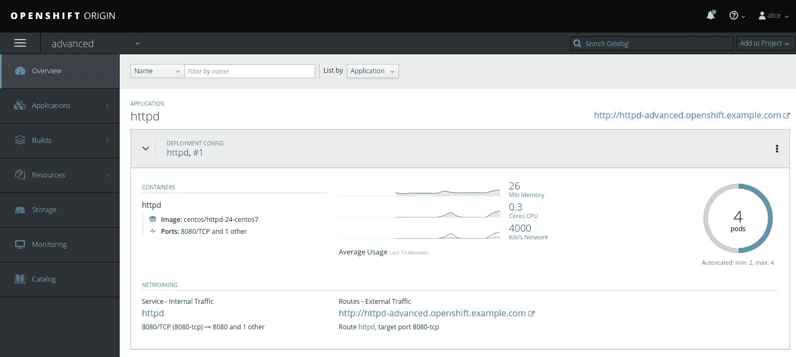
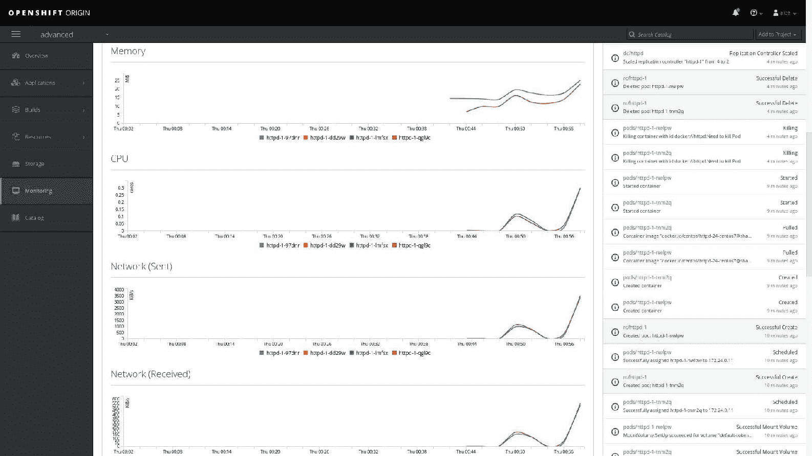
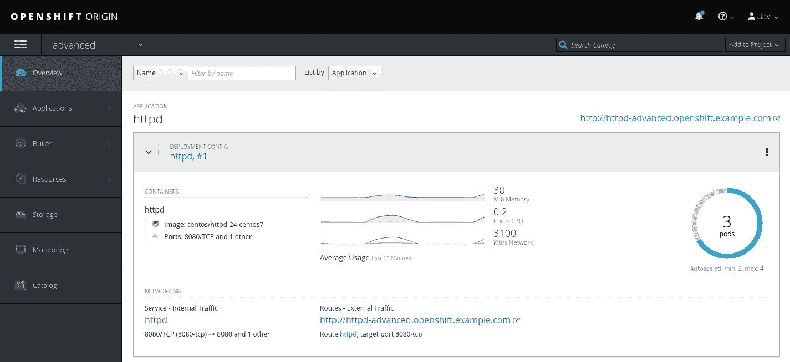
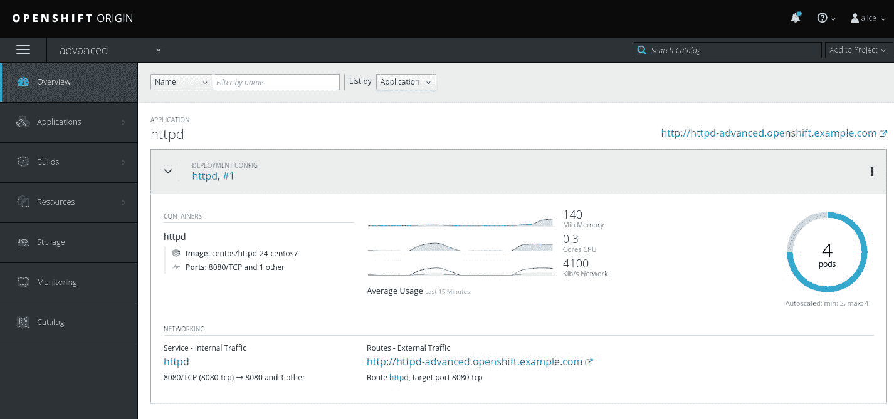
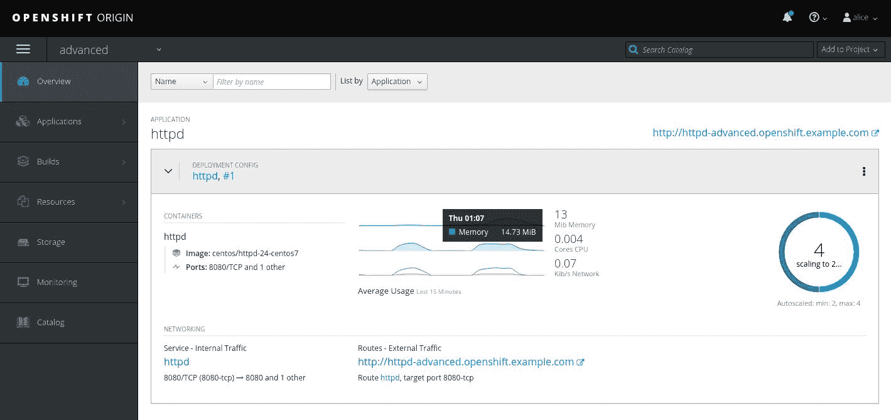

# 高级 OpenShift 概念

在上一章中，我们简要描述了基本的 OpenShift 对象，如 pod、服务和路由。我们还让您了解了如何使用命名空间进行资源隔离，以及如何管理 OpenShift 中的用户。

本章讲解了高级 OpenShift 资源，如 **ImageStreams** 和 **ConfigMaps**，逻辑上延续了上一章关于 OpenShift 核心概念的内容。OpenShift API 提供了数十种不同的资源来控制应用部署、安全性等各个方面。现在，我们将重点介绍一些最重要的资源。

完成本章后，您将学到以下内容：

+   使用 ImageStreams 跟踪镜像版本历史

+   使用 ConfigMaps 将配置与应用程序代码分离

+   使用 LimitRanges 和 ResourceQuotas 控制资源消耗

+   根据 CPU 和 RAM 使用情况自动扩展应用程序

# 技术要求

本章中，我们将在 Vagrant 管理的虚拟机上实践部署的 OpenShift。最后一部分关于自动扩展需要启用 Hawkular 度量，因此您需要通过 `openshift_metrics_install_metrics` Ansible 变量来安装 OpenShift。度量收集器和仪表板被部署在它们自己的 pod 中，因此我们还需要为虚拟机提供更多的 RAM。使用以下 Vagrantfile 来部署实验：

```
$ cat Vagrantfile $lab_openshift = <<SCRIPT
yum -y update
yum install -y epel-release git docker httpd-tools java-1.8.0-openjdk-headless
yum install -y ansible python-passlib
systemctl start docker
systemctl enable docker
git clone -b release-3.9 https://github.com/openshift/openshift-ansible /root/openshift-ansible
ssh-keygen -f /root/.ssh/id_rsa -N ''
cp /root/.ssh/id_rsa.pub /root/.ssh/authorized_keys
ssh-keyscan 172.24.0.11 >> .ssh/known_hosts
cp .ssh/known_hosts /root/.ssh/known_hosts
ssh-copy-id -i /root/.ssh/id_rsa root@172.24.0.11
reboot
SCRIPT

Vagrant.configure(2) do |config|
 config.vm.define "openshift" do |conf|
 conf.vm.box = "centos/7"
 conf.vm.hostname = 'openshift.example.com'
 conf.vm.network "private_network", ip: "172.24.0.11"
 conf.vm.provider "virtualbox" do |v|
 v.memory = 6144
 v.cpus = 2
 end
 conf.vm.provision "shell", inline: $lab_openshift
 end
end
```

为了能够从您的主机系统访问 VM 内的集群，请确保您笔记本电脑上的文件 `/etc/hosts` 看起来像这样：

```
$ cat /etc/hosts
127.0.0.1 localhost openshift localhost.localdomain localhost4 localhost4.localdomain4
::1 localhost localhost.localdomain localhost6 localhost6.localdomain6
172.24.0.11 openshift.example.com hawkular-metrics.openshift.example.com
```

运行`vagrant up`并等待它完成所有工作。这可能需要最多 30 分钟，具体取决于您的互联网连接和计算资源：

```
$ vagrant up
Bringing machine 'openshift' up with 'virtualbox' provider...
...
<output omitted>
...
```

完成后，打开 SSH 会话连接到 VM 并切换为 root 用户：

```
$ vagrant ssh
[vagrant@openshift ~]$ sudo -i
[root@openshift ~]#
```

您可以使用以下清单来部署 OpenShift：

```
# cat /etc/ansible/hosts ...
<output omitted>
...
[masters]
172.24.0.11

[nodes]
172.24.0.11 openshift_node_labels="{'region': 'infra', 'zone': 'default'}" openshift_schedulable=true

[etcd]
172.24.0.11

[OSEv3:vars]
openshift_deployment_type=origin
openshift_disable_check=memory_availability,disk_availability
openshift_ip=172.24.0.11
ansible_service_broker_install=false
openshift_master_cluster_hostname=172.24.0.11
openshift_master_cluster_public_hostname=openshift.example.com
openshift_hostname=172.24.0.11
openshift_public_hostname=openshift.example.com
openshift_metrics_install_metrics=true
openshift_metrics_image_version=v3.9
openshift_master_default_subdomain=openshift.example.com

[OSEv3:children]
masters
nodes
etcd
```

请注意，我们已经指定了 `openshift_metrics_install_metrics` 变量来配置与自动扩展相关的度量。

截至写作时，度量镜像尚未标记正确版本，因此我们不得不提供 `openshift_metrics_image_version` 变量，以防止度量 pod 进入 `ImagePullBackOff` 状态。更多细节请参见 [`github.com/openshift/origin/issues/19440`](https://github.com/openshift/origin/issues/19440)。

现在，到了安装 OpenShift 的时候：

```
# cd openshift-ansible
# ansible-playbook playbooks/prerequisites.yml
...
<output omitted>
...
# ansible-playbook playbooks/deploy_cluster.yml
...
<output omitted>
..
```

以普通用户身份登录：

```
# oc login -u alice Username: alice
Password: anypassword
Login successful.
```

请记住，由于这次我们没有显式配置身份提供者，OpenShift 默认为 AllowAll，因此我们可以使用任何密码。

接下来，创建一个专门用于我们实验的项目：

```
# oc new-project advanced
...
<output omitted>
...
```

以 `system:admin` 用户身份重新登录：

```
# oc login -u system:admin ...
<output omitted>
...
```

接下来，我们需要运行以下命令：

```
# oc adm policy add-scc-to-user anyuid -z default
scc "anyuid" added to: ["system:serviceaccount:advanced:default"]
```

我们还没有讨论上面命令背后的概念，但在此时，只需理解它放宽了 OpenShift 对 pod 强加的权限即可。这个概念被称为 **安全上下文约束**（**SCC**），在第十章 *OpenShift 安全性* 中的 *安全上下文约束* 部分会更详细地讨论。

最后，以 `alice` 用户重新登录：

```
# oc login -u alice
```

# 使用镜像流跟踪镜像的版本历史

某些 OpenShift 资源，如 pods、deployments、DeploymentConfigs、ReplicationControllers 和 ReplicaSets，引用 Docker 镜像来部署容器。通常的做法是通过镜像流引用这些镜像，而不是直接引用它们，镜像流充当了内部/外部仓库与客户端资源之间的间接层，创建了一个虚拟的镜像视图。

在官方文档和一些博客中，你可能会看到将镜像流与仓库进行比较。虽然从某种意义上说，资源通过镜像流引用镜像的方式类似于仓库，但这个类比不够清晰；镜像流本身不存储任何东西，它们仅仅是镜像管理的抽象。因此，在本章中，我们将它们视为虚拟视图，以便更准确地理解它们的实际作用。

使用镜像流有以下优点：

+   如果上游镜像的更新引入了错误，你的应用程序不会意外崩溃，因为镜像流会标记你的 pod，使其仍然映射到镜像的工作版本，有效保护你免受故障影响

+   可以在镜像流级别配置镜像更改触发器和周期性重新导入镜像

你很可能不需要从头创建镜像流，但理解它们的结构对于理解它们的功能非常重要。

使用 Ansible 安装的 Minishift 和 OpenShift 包含一些最流行镜像的默认镜像流，如 PostgreSQL、HTTPD 和 Python。它们位于 `openshift` 项目中：

```
# oc get is -n openshift
NAME        DOCKER REPO                                            ...
...
<output omitted>
...
mongodb     docker-registry.default.svc:5000/openshift/mongodb     ...
...
<output omitted>
...
```

为了更清楚地理解本节开头提到的“间接层”是什么意思，我们来仔细看看 `mongodb` 镜像流：

```
# oc describe is/mongodb -n openshift
...
<output omitted>
...
Unique Images:   3
Tags:            4

3.2 (latest)
  tagged from centos/mongodb-32-centos7:latest

  Provides a MongoDB 3.2 database on CentOS 7\. For more information about using this database image, including OpenShift considerations, see https://github.com/sclorg/mongodb-container/tree/master/3.2/README.md.
  Tags: mongodb

  * centos/mongodb-32-centos7@sha256:d4dc006a25db1423caed1dcf0f253f352dbbe0914c20949a6302ccda55af72b1
      22 hours ago
...
<output omitted>
...
```

镜像流使用特定的符号来引用仓库中的镜像。我们以之前的例子为参考，进行分析：

```
centos/mongodb-32-centos7@sha256:d4dc006a25db1423caed1dcf0f253f352dbbe0914c20949a6302ccda55af72b1
```

上述镜像引用具有以下结构：

+   `centos/mongodb-32-centos7`：Docker 仓库中镜像的路径

+   `sha256`：表示镜像标识符是通过 SHA256 哈希算法生成的

+   `d4dc006a25db1423caed1dcf0f253f352dbbe0914c20949a6302ccda55af72b1`：镜像的哈希/ID 本身

镜像流本身没有实际用途，只有在支持应用程序生命周期时才存在。它们通常在以下场景中被后台创建：

+   从 S2I 构建创建应用程序

+   导入镜像

+   直接从 Docker 镜像创建应用程序

+   手动将镜像推送到内部注册表

由于本书中会进一步讨论 S2I 构建，我们将考虑另外三种方法。

# 导入镜像

可以通过从外部注册表导入镜像到内部注册表来创建镜像流：

```
# oc import-image nginx --confirm
The import completed successfully.

Name: nginx
Namespace: advanced
Created: Less than a second ago
Labels: <none>
Annotations: openshift.io/image.dockerRepositoryCheck=2018-07-18T20:02:07Z
Docker Pull Spec: docker-registry.default.svc:5000/advanced/nginx
Image Lookup: local=false
Unique Images: 1
Tags: 1

latest
  tagged from nginx

  * nginx@sha256:42e8199b5eb4a9e4896308cabc547740a0c9fc1e1a1719abf31cd444d426fbc8
      Less than a second ago

Image Name: nginx:latest
Docker Image: nginx@sha256:42e8199b5eb4a9e4896308cabc547740a0c9fc1e1a1719abf31cd444d426fbc8
Name: sha256:42e8199b5eb4a9e4896308cabc547740a0c9fc1e1a1719abf31cd444d426fbc8
...
<output omitted>
...
```

你可以从前面的输出中看到，Nginx 镜像已经上传到内部注册表

`docker-registry.default.svc:5000/advanced/nginx`。如你所见，它的名称与我们之前提供的镜像引用结构相对应。

让我们删除镜像流，为下一个练习提供一个干净的起点：

```
# oc delete is/nginx
imagestream "nginx" deleted
```

# 直接从 Docker 镜像创建应用程序

创建镜像流的另一种方法是使用 `new-app` 命令从现成的 Docker 镜像创建应用程序：

```
# oc new-app gists/lighttpd
--> Found Docker image cd7b707 (11 days old) from Docker Hub for "gists/lighttpd"

    * An image stream will be created as "lighttpd:latest" that will track this image
...
<output omitted>
...
```

Lighttpd 是另一个 Web 服务器，类似于 Nginx 或 Apache。我们在这个示例中使用它，因为 Nginx 和 Apache 镜像流都已开箱即用地提供给 OpenShift。

这将创建多个资源，其中之一就是镜像流。

如果你 `describe` 新创建的部署配置，你会看到它实际上引用的是镜像流，而不是镜像本身：

```
# oc describe dc/lighttpd
...
<output omitted>
...
  Containers:
   lighttpd:
    Image: gists/lighttpd@sha256:23c7c16d3c294e6595832dccc95c49ed56a5b34e03c8905b6db6fb8d66b8d950
...
<output omitted>
...
```

在之前的示例中，DeploymentConfig 根据以下方案引用了 Lighttpd 服务器镜像的镜像流：

+   `gists/lighttpd`：镜像流名称

+   `sha256`：表示镜像标识符是使用 SHA256 哈希算法生成的

+   `23c7c16d3c294e6595832dccc95c49ed56a5b34e03c8905b6db6fb8d66b8d950`：镜像哈希值/ID

这就是部署配置和复制控制器通常在 OpenShift 中引用镜像的方式。

再次，让我们清理一下环境：

```
# oc delete all --all
deploymentconfig "lighttpd" deleted
imagestream "lighttpd" deleted
pod "lighttpd-1-hqjfg" deleted
service "lighttpd" deleted
```

# 手动将镜像推送到内部注册表

我们将讨论的最后一种创建镜像流的方法是直接将镜像推送到 OpenShift 内部注册表。

如果你还没有登录，请以 `alice` 的非特权账户登录：

```
# oc login -u alice
```

然后，运行以下命令以登录到内部注册表：

```
# docker login -u $(oc whoami) -p $(oc whoami -t) docker-registry.default.svc:5000 Login Succeeded
```

在前面的命令中，我们使用了一个称为 **命令扩展** 的 Bash 特性，它允许我们从左到右提供 `login` 命令所需的用户名、密码/令牌和注册表 `IP:port`。你可以单独运行所有这些命令（`oc whoami` 和 `oc whoami -t`）来查看它们的输出。

现在我们已经在内部注册表中完成身份验证，可以像操作一般的 Docker 注册表一样直接推送镜像。让我们看看 OpenShift 内部注册表中有什么：

```
# docker images
REPOSITORY     TAG     IMAGE ID        CREATED                 SIZE
docker.io/cockpit/kubernetes latest 110aeeca4b8c 7 days ago     425 MB
docker.io/centos/nginx-112-centos7 <none> b6923820bf5b 7 days ago     313 MB
docker.io/gists/lighttpd <none>  cd7b7073c0fc  11 days ago    12.1 MB
docker.io/openshift/origin-web-console v3.9.0  aa12a2fc57f7      3 weeks ago    495 MB
docker.io/openshift/origin-docker-registry v3.9.0  8e6f7a854d66  3 weeks ago    465 MB
docker.io/openshift/origin-haproxy-router v3.9.0  448cc9658480   3 weeks ago    1.28 GB
docker.io/openshift/origin-deployer v3.9.0 39ee47797d2e 3 weeks ago 1.26 GB
docker.io/openshift/origin-service-catalog v3.9.0  96cf7dd047cb  3 weeks ago    296 MB
docker.io/openshift/origin-template-service-broker v3.9.0  be41388b9fcb  3 weeks ago    308 MB
docker.io/openshift/origin-pod v3.9.0  6e08365fbba9  3 weeks ago    223 MB
docker.io/sebp/lighttpd <none>  6b681cc70957  20 months ago  8.53 MB
```

让我们删除上一个练习中遗留下的 Lighttpd 镜像：

```
# docker rmi cd7b7073c0fc
...
<output omitted>
...
```

现在使用与上一小节相同的 Lighttpd 镜像：

```
# docker pull gists/lighttpd ...
<output omitted>
...
Status: Downloaded newer image for docker.io/gists/lighttpd:latest
```

用包含注册表地址和端口的标签标记它：

```
# docker tag docker.io/gists/lighttpd docker-registry.default.svc:5000/advanced/lighttpd
```

我们使用项目的名称来创建镜像流，作为仓库中镜像路径的一部分，因为我们使用的令牌只授予开发者用户在 `myproject` 项目中创建镜像流的权限。OpenShift 期望我们在特定位置找到镜像，这样它就可以从镜像中创建镜像流。

让我们检查一下是否存在两个标签引用的镜像：

```
# docker images
REPOSITORY    TAG   IMAGE  ID                                          ...
docker-registry.default.svc:5000/advanced/lighttpd latest cd7b7073c0fc ...
docker.io/gists/lighttpd                           latest cd7b7073c0fc ...
...
<output omitted>
...
```

最后，我们需要将镜像推送到仓库中：

```
# docker push docker-registry.default.svc:5000/advanced/lighttpd
The push refers to a repository [docker-registry.default.svc:5000/advanced/lighttpd]
...
<output omitted>
...
```

现在验证一下 `lighttpd` 镜像流是否已在 OpenShift 中创建：

```
# oc get is
NAME     DOCKER REPO                                        TAGS   UPDATED
lighttpd docker-registry.default.svc:5000/advanced/lighttpd latest 15 minutes ago
```

正如预期的那样，镜像流已创建。

和之前一样，我们需要删除所有内容，然后才能继续下一部分：

```
$ oc delete is/lighttpd
imagestream "lighttpd" deleted
```

# 使用 ConfigMap 将配置与应用程序代码分离

ConfigMap 资源用于将数据与运行应用程序的 pod 分离。这类资源包含任意数据，可以作为配置注入到 pod 中。在这个上下文中，“注入”意味着 pod 可以通过以下方式使用它：

+   将其键/值对导出为环境变量

+   将其值作为命令行参数传递给应用程序

+   将其作为卷挂载到 pod 内部，挂载到应用程序期望找到配置文件的位置

在开始之前，确保你以非特权用户登录，以获得最具代表性的体验：

```
# oc login -u alice
```

让我们看看将 ConfigMap 导出为容器中的环境变量的过程。首先，我们需要从一系列环境变量创建 ConfigMap 本身：

```
# cat example.env 
VAR_1=Hello
VAR_2=World

# oc create cm example-config-map --from-env-file=example.env
configmap "example-config-map" created
```

使用以下命令查看实际资源的样子：

```
# oc describe configmap/example-config-map
Name: example-config-map
Namespace: advanced
Labels: <none>
Annotations: <none>

Data
====
VAR_1:
----
Hello
VAR_2:
----
World
Events: <none>
```

现在，我们已经准备好将其注入到 pod 中。创建一个简单的 `Pod` 定义，引用新创建的 ConfigMap：

```
# cat example-pod-1.yml 
apiVersion: v1
kind: Pod
metadata:
  name: example
spec:
  containers:
    - name: example
      image: cirros
      command: ["/bin/sh", "-c", "env"]
      envFrom:
        - configMapRef:
            name: example-config-map
```

然后，使用前面的定义创建 pod：

```
# oc create -f example-pod-1.yml
pod "example" created
```

正如你在第二章《Kubernetes 概览》中学到的，OpenShift 支持 YAML 和 JSON 两种格式用于资源定义；在本书中，我们主要依赖前者。为了提醒你 YAML 语法，可以参考这个链接：[`www.yaml.org/start.html`](http://www.yaml.org/start.html)。

无论你使用 YAML 还是 JSON，OpenShift REST API 都支持非常具体的字段，这些字段在不同的资源类型之间有所不同，且已在 [`docs.openshift.org/latest/rest_api/api/`](https://docs.openshift.org/latest/rest_api/api/) 中进行了文档化。

由于该命令是一个简单的 Linux 命令 `env`，而不是某种进程或监听服务器，pod 在命令完成后立即退出，但你仍然可以看到其日志：

```
# oc logs po/example
...
<output omitted>
...
VAR_1=Hello
VAR_2=World
```

正如你所看到的，我们在 ConfigMap 中定义的两个环境变量已经成功注入到容器中。如果我们在容器中运行应用程序，它将能够读取这些变量。

相同的方法可以用来将这些变量作为命令行参数传递给容器命令。首先，让我们删除旧的 pod：

```
# oc delete po/example
pod "example" deleted
```

然后，创建一个新的 pod 定义，以便你可以使用这些变量作为命令行参数来回显命令：

```
# cat example-pod-2.yml
apiVersion: v1
kind: Pod
metadata:
  name: example2
spec:
  containers:
    - name: example2
      image: cirros
      command: ["/bin/sh", "-c", "echo ${VAR_1} ${VAR_2}"]
      envFrom:
        - configMapRef:
            name: example-config-map
```

现在，使用更新后的定义创建一个容器：

```
# oc create -f example-pod-2.yml
pod "example2" created
```

如前所述，容器将在命令返回后立即退出，但其日志将包含由我们 ConfigMap 中的两个变量构成的命令输出：

```
# oc logs po/example2
Hello World
```

最后，我们将演示如何将 ConfigMap 作为配置文件挂载到 pod 中。再次，先删除之前练习中的 pod：

```
# oc delete po/example2
pod "example2" deleted
```

在本例中，我们将为 Nginx Web 服务器提供自定义配置文件，这将使其默认虚拟主机监听 `8888` 端口，而不是 `80` 端口。以下是实现这一目标的简单配置：

```
# cat nginx_custom_default.conf 
server {
    listen       8888;
    server_name  localhost;
    location / {
        root   /usr/share/nginx/html;
        index  index.html index.htm;
    }
}
```

现在，让我们继续从这个配置中创建一个 ConfigMap：

```
# oc create cm nginx --from-file nginx_custom_default.conf 
configmap "nginx" created
```

如果我们查看这个 ConfigMap 的原始资源定义，将会看到以下内容：

```
# oc export configmap/nginx
apiVersion: v1
data:
  nginx_custom_default.conf: |
    server {
        listen 8888;
        server_name localhost;
        location / {
            root /usr/share/nginx/html;
            index index.html index.htm;
        }
    }
kind: ConfigMap
metadata:
  creationTimestamp: null
  name: nginx
```

正如你所看到的，配置文件的全部内容作为值插入到 config map 定义中的`nginx_custom_default.conf`键下，这样可以在 Pod 中引用该配置。

现在是时候创建一个将使用这个 ConfigMap 的 Pod 了。使用以下结构再创建一个 Pod 定义：

```
# cat example-pod-3.yml 
apiVersion: v1
kind: Pod
metadata:
  name: example3
  labels:
    role: web
spec:
  containers:
  - name: example3
    image: nginx
    volumeMounts:
    - name: conf
      mountPath: /etc/nginx/conf.d
  volumes:
  - name: conf
    configMap:
      name: nginx
      items:
      - key: nginx_custom_default.conf
        path: default.conf
```

你可以在`configMap.items`中指定路径参数，以提供配置将被存储的文件名。如果我们在前面的例子中没有这么做，文件名将与`configMap-nginx_custom_default.conf`中的键相同。我们必须为我们的 Pod 指定标签，以便之后能够为其创建服务。

现在我们来创建 Pod：

```
# oc create -f example-pod-3.yml 
pod "example3" created
```

为了检查服务器是否在 ConfigMap 中指定的端口上监听，我们可以在 Pod 内部打开一个 bash 会话，查看配置文件是否到位，但让我们使用一种更好的方法，这样我们可以更多地实践 OpenShift 资源。

我们需要为这个 Pod 创建一个服务并暴露它。首先，创建一个服务：

```
# oc expose po/example3 --port 8888
service "example3" exposed
```

我们必须在命令中明确指定端口，因为我们没有在 Pod 的定义中的`containerPort`参数中提供端口。

然后通过`route`暴露这个服务：

```
# oc expose svc/example3
route "example3" exposed
# oc get route
... example3-advanced.openshift.example.com ...
```

最后，我们可以使用`curl`命令从服务器的默认虚拟主机请求一个默认网页：

```
# curl -H 'Host: example3-advanced.openshift.example.com' 127.0.0.1
...
<output omitted>
...
<title>Welcome to nginx!</title>
...
<output omitted>
...
```

我们本可以在`/etc/hosts`中为上述路由创建一个单独的记录，指向`127.0.0.1`，但是为了保持环境尽可能干净，最好使用`Host` HTTP 头来选择特定的应用程序。

上述输出表明 Nginx 确实在`8888/tcp`端口上监听，正如 ConfigMap 中所指定的。这标志着我们对 ConfigMap 的练习结束，接下来我们清理实验环境：

```
$ oc delete all --all
route "example3" deleted
pod "example3" deleted
service "example3" deleted
$ oc delete configmap --all configmap "example-config-map" deleted
configmap "nginx" deleted
```

ConfigMap 与其他资源（如 Pod 或服务）不同，必须单独删除。

# 使用 ResourceQuota 控制资源消耗

OpenShift 项目在多租户环境中的主要思想之一是需要在比整个集群更精细的级别上限制资源消耗，从而为操作提供将这些限制应用于组织和部门的能力。

OpenShift 提供了两种机制来设置集群中资源消耗的限制：

+   `ResourceQuota`

+   `LimitRanges`

本节仅介绍 ResourceQuota，LimitRanges 将在下一节讨论。

ResourceQuota 可以用来控制可以创建的 API 资源数量，或者控制在同一项目中定义配额的 Pod 所消耗的 CPU、内存和存储量。本质上，它们决定了一个项目的容量。ResourceQuota 允许你控制以下类型的资源：

+   Pods

+   ReplicationControllers

+   服务

+   Secrets

+   ResourceQuotas

+   ConfigMap

+   ImageStreams

+   PersistentVolumeClaims

+   `requests.storage`

+   CPU

+   内存

+   临时存储

+   limits.ephemeral-storage

+   `limits.cpu`

+   `limits.memory`

如果 CPU/内存或 `limits.cpu`/`limits.memory` 受配额管理，则同一项目中的所有 Pods 必须为相应的计算资源指定请求/限制。

在配额的背景下，所有 Pods 属于以下范围，配额可以应用于这些范围，并在这些范围内设置一定数量的资源：

| **范围** | **描述** | **受管资源** |
| --- | --- | --- |
| `BestEffort` | 适用于所有以 BestEffort 服务质量运行的 Pods，这意味着对于 CPU、内存或两者都具有相等请求和限制的 Pods。这些 Pods 可以申请它们需要的任何资源，但在运行它们的节点内存不足时，它们最有可能被终止。 |

+   Pods

|

| `NotBestEffort` | 适用于所有运行时没有 BestEffort 服务质量的 Pods。 |
| --- | --- |

+   Pods

+   CPU

+   `limits.cpu`

+   内存

+   临时存储

+   limits.ephemeral-storage

+   `limits.memory`

|

| `Terminating` | 适用于所有通过 `spec.activeDeadlineSeconds >= 0` 部署的作业 Pods，例如在 S2I 构建期间部署的构建 Pods。 |
| --- | --- |
| `NotTerminating` | 适用于所有通过 `spec.activeDeadlineSeconds` 为 nil 的作业部署的 Pods，这意味着通常用于应用的 Pods。 |

现在，让我们看看如何为项目创建配额。与任何其他资源一样，它们可以通过 API 创建，但您也可以使用 CLI，这正是我们要做的。让我们切换回 `system:admin` 用户，因为管理配额需要管理员权限：

```
# oc login -u system:admin 
```

然后，我们将能够创建我们的第一个配额：

```
# oc create quota my-quota \
--hard=cpu=500m,memory=256Mi,pods=1,resourcequotas=1
resourcequota "my-quota" created
```

正如您所见，配额已成功创建：

```
# oc describe quota/my-quota
Name:            my-quota
Namespace:       advanced
Resource         Used    Hard
--------         ----    ----
cpu              0       500m
memory           0       256Mi
pods             0       1
resourcequotas   1       1
```

有趣的是，每个项目本身的配额数量可以由 ResourceQuota 控制。即使您为配额设置限制为 `0`，只要没有其他已存在的限制此数量的配额，您仍然可以创建第一个配额。

通过创建这个配额，我们在当前项目上设置了`500` CPU 毫核（半核）、`256Mi` 请求的 RAM、`1` 个 Pod，以及 `1` 个 ResourceQuota。让我们看看配额是否生效。

首先，创建一个简单的 Pod 定义：

```
$ cat nginx-pod.yml
apiVersion: v1
kind: Pod
metadata:
  name: nginx
  labels:
    role: web
spec:
  containers:
  - name: nginx
    image: nginx
```

让我们尝试从中创建一个 Pod：

```
# oc create -f nginx-pod.yml 
Error from server (Forbidden): error when creating "nginx-pod.yml": pods "nginx" is forbidden: failed quota: my-quota: must specify cpu,memory
```

正如您所见，我们的定义没有通过配额的检查，因为它明确限制了请求的 CPU 和 RAM 量，但我们没有指定它们。让我们修改 `nginx-pod.yml` 并添加 `resources` 部分：

```
# cat nginx-pod.yml 
apiVersion: v1
kind: Pod
metadata:
  name: nginx
  labels:
    role: web
spec:
  containers:
  - name: nginx
    image: nginx
    resources:
 requests:
 cpu: 100m
 memory: 128Mi
```

在创建时，Pod 将请求 1 个 CPU 核心和 128 MiB RAM，这完全在配额设置的限制范围内。让我们再试一次：

```
# oc create -f nginx-pod.yml 
pod "nginx" created
```

如预期，Pod 已成功创建。此时，我们可以查看我们的配额消耗了多少：

```
# oc describe quota/my-quota
Name:            my-quota
Namespace:       advanced
Resource         Used    Hard
--------         ----    ----
cpu              100m    500m
memory           128Mi   256Mi
pods             1       1
resourcequotas   1       1
```

现在，让我们看看如果我们尝试创建更多的 Pod 会发生什么。通过将用于创建第一个 Pod 的定义替换 `nginx` 为 `httpd` 来准备一个新的 Pod 定义：

```
# cat httpd-pod.yml 
apiVersion: v1
kind: Pod
metadata:
  name: httpd
  labels:
    role: web
spec:
  containers:
  - name: httpd
    image: httpd
    resources:
      requests:
        cpu: 400m
        memory: 128Mi
```

如果我们尝试创建第二个 Pod，我们将看到以下内容：

```
$ oc create -f httpd-pod.yml 
Error from server (Forbidden): error when creating "httpd-pod.yml": pods "httpd" is forbidden: exceeded quota: my-quota, requested: pods=1, used: pods=1, limited: pods=1
```

即使请求的内存量不会违反配额，pod 创建仍然被拒绝，因为配额限制了当前项目中的 pod 总数为 `1`。

编辑配额以允许 2 个 pod 和 2 个 CPU 核心：

```
$ oc edit quota/my-quota
spec:
  hard:
    cpu: 500m
    memory: 256Mi
 pods: "2"
    resourcequotas: "1"
```

尝试再次创建第二个 pod：

```
$ oc create -f httpd-pod.yml
pod "httpd" created
```

它之所以有效，是因为配额设置为允许当前项目中最多 `2` 个 pod。

让我们再次查看配额允许的总资源使用情况：

```
$ oc describe quota/my-quota
Name:            my-quota
Namespace:       myproject
Resource         Used    Hard
--------         ----    ----
cpu              500m    500m
memory           256Mi   256Mi
pods             2       2
resourcequotas   1       1
```

如你所见，我们已用尽整个配额，无法创建新的 pod。

现在这项练习结束了，是时候通过清理实验室来准备下一项任务：

```
$ oc delete all --all
pod "httpd" deleted
pod "nginx" deleted

$ oc delete quota/my-quota
resourcequota "my-quota" delete
```

ConfigMaps 和 ResourceQuotas 被视为不同种类的资源，必须分别删除。

# 使用 LimitRanges 控制资源消耗

这是一种在 OpenShift 中按项目级别控制资源分配的方式，但与 ResourceQuotas 不同，它们在某些方面有所不同：

+   它们应用于单个 pod、容器、镜像或镜像流

+   它们无法控制某些资源，如机密、ConfigMaps、ResourceQuotas、服务和 ReplicationControllers。

+   它们只能从原始定义中创建

根据它们应用的资源类型，LimitRanges 控制不同的计算资源和对象：

| **资源类型** | **控制的计算资源/属性** |
| --- | --- |
| Pod |

+   CPU

+   RAM

|

| Container |
| --- |

+   CPU

+   RAM

|

| 镜像 | 推送到内部注册表的镜像大小 |
| --- | --- |
| ImageStream |

+   根据镜像流的规格，唯一镜像标签的数量

+   根据镜像流的状态，唯一镜像引用的数量

|

| PersistentVolumeClaim | 请求的存储量 |
| --- | --- |

Pod 和容器可以明确声明它们所需的 CPU 和/或 RAM 以及它们的限制，LimitRanges 会确保它们不会超出某些边界。此外，如果未指定，LimitRanges 还可以为请求的资源数量及其限制提供默认值。

根据 pod 声明的计算资源请求和限制的存在及差异，它们以不同的 **服务质量**（**QoS**）等级运行，以便在资源争用时优先运行某些 pod。下表总结了可用的等级以及何时应用它们：

| **QoS 等级** | **描述** |
| --- | --- |
| `BestEffort` | 此等级分配给未明确指定请求和限制的 pod。这些 pod 可以根据需要消耗任何 CPU 和 RAM，但如果 pod 所在的节点缺少这些资源，它们将是首先被终止的 pod。 |
| `Burstable` | 请求的限制高于请求的 pod 被分配到 Burstable QoS 等级。它们的优先级低于 BestEffort pod，意味着只有在没有 BestEffort pod 可终止时，它们才会被终止。 |
| `Guaranteed` | 这个层级适用于计算资源请求和限制相等的 pod。每个使用此 QoS 的 pod 有权获得请求的资源量，但不能更多。它们具有最高优先级，这意味着只有在没有 BestEffort 或 Burstable pod 时，才会被终止。 |

正如上一节所述，设置 LimitRanges 需要管理员权限，因此请确保以 `system:admin` 用户登录：

```
# oc login -u system:admin
```

让我们考虑一个从头创建 `LimitRange` 的示例：

```
# cat my-limits.yaml 
apiVersion: v1
kind: LimitRange
metadata:
  name: my-limits
spec:
  limits:
    - type: Pod
      min:
        cpu: 200m
        memory: 256Mi
      max:
        cpu: 400m
        memory: 512Mi
    - type: Container
      min:
        cpu: 100m
        memory: 128Mi
      max:
        cpu: 300m
        memory: 256Mi
```

从前面的定义创建限制：

```
# oc create -f my-limits.yaml 
limitrange "my-limits" created
```

现在，让我们描述一下我们新创建的限制：

```
# oc describe limits/my-limits
Name:        my-limits
Namespace:   advanced
Type    Resource    Min    Max    Default Request    Default Limit    ...
----    --------    ---    ---    ---------------    -------------    ...
Pod         cpu     200m   400m   -                  -                ...
Pod         memory  256Mi  512Mi  -                  -                ...
Container   cpu     100m   300m   300m               300m             ...
Container   memory  128Mi  256Mi  256Mi              256Mi            ...
```

还有 `spec.limits[].default` 和 `spec.limits[].defaultRequest` 参数，它们分别确定容器使用的 CPU/RAM 限制量以及默认请求的量。由于我们没有明确指定，它们默认与最大值相同。

下一步是创建一个请求特定计算资源并为自身设置资源使用限制的 pod。准备以下 pod 定义：

```
# cat limits-example-pod.yml 
apiVersion: v1
kind: Pod
metadata:
  name: limits-example
  labels:
    role: web
spec:
  containers:
  - name: httpd
    image: httpd
    resources:
      requests:
        cpu: 100m
        memory: 256Mi
      limits:
        cpu: 350m
        memory: 256Mi
```

接下来，从定义中创建一个 pod：

```
# oc create -f limits-example-pod.yml 
Error from server (Forbidden): error when creating "limits-example-pod.yml": pods "limits-example" is forbidden: [minimum cpu usage per Pod is 200m, but request is 100m., maximum cpu usage per Container is 300m, but limit is 350m.]
```

正如您通过查看 pod 定义可能预料到的那样，操作被拒绝，因为 pod 的请求和限制范围违反了之前定义的策略。

最小边界也被强制执行。

让我们编辑 pod 的定义，使其符合定义的 LimitRange：

```
# cat limits-example-pod.yml 
...
<output omitted>
...
    resources:
      requests:
        cpu: 200m
        memory: 256Mi
      limits:
        cpu: 250m
        memory: 256Mi
```

再次尝试创建并观察它是否正常工作：

```
# oc create -f limits-example-pod.yml 
pod "limits-example" created
# oc get po
NAME          READY   STATUS    RESTARTS   AGE
limits-example 1/1    Running    0         4s
```

让我们清理实验环境，为下一节做准备：

```
# oc delete po/limits-example
pod "limits-example" deleted

# oc delete limits/my-limits
limitrange "my-limits" delete
```

LimitRanges 也被视为一种单独的资源，就像模板、ConfigMaps 和 ResourceQuotas 一样，因此它们必须通过单独的命令删除。

# 使用模板创建复杂的应用程序堆栈

另一个有用的 OpenShift 资源是模板。与其逐个创建资源——例如 pod、服务和路由——模板允许您通过单个 CLI 命令一次性创建多个对象。更重要的是，它们可能包含可以是可选的参数，或者根据特定规则生成的静态或默认值。从某种意义上说，它们类似于 Docker Compose 或 OpenStack Heat——这些都提供了从零开始创建完整应用程序堆栈的功能。通过模板，集群管理员可以为开发人员提供部署多层应用程序及其所有依赖服务的能力。

默认情况下，OpenShift 安装了许多默认模板，称为 **Instant App** 和 **Quick Start** 模板。它们可用于部署基于各种语言和框架的运行时环境，例如 Ruby on Rails（Ruby）、Django（Python）和 CakePHP（PHP）。它们还包括带有持久存储的 SQL 和 NoSQL 数据库引擎模板，其中包括 `PersistentVolumeClaims` 作为提供数据持久性的对象之一。

在本次练习中，您不需要管理员权限，因此可以作为普通用户登录：

```
# oc login -u alice
```

默认模板在安装期间会在 `openshift` 项目中创建。您可以通过运行以下命令查看它们：

```
# oc get template -n openshift | cut -d' ' -f1
NAME
3scale-gateway
amp-apicast-wildcard-router
amp-pvc
cakephp-mysql-example
cakephp-mysql-persistent
dancer-mysql-example
dancer-mysql-persistent
django-psql-example
django-psql-persistent
dotnet-example
dotnet-pgsql-persistent
dotnet-runtime-example
httpd-example
...
<output omitted>
...
```

我们使用了 `cut` 命令来排除描述和其他信息，目的是简化输出，但您也可以在不使用 `cut` 的情况下运行该命令，以查看完整输出。

当 MiniShift 和 OpenShift 通过 Ansible 安装器安装时，默认模板会直接安装。但在容器化快速安装的情况下，您可能需要从位于 `roles/openshift_examples/files/examples/` 目录中的 YAML 定义手动创建它们。

要获取特定模板支持的参数列表，请使用 `process` 命令：

```
# oc process --parameters mariadb-persistent -n openshift 
NAME                   DESCRIPTION       GENERATOR       VALUE
MEMORY_LIMIT           ...                               512Mi
NAMESPACE              ...                               openshift
DATABASE_SERVICE_NAME  ...                               mariadb
MYSQL_USER             ...               expression      user[A-Z0-9]{3}
MYSQL_PASSWORD         ...               expression      [a-zA-Z0-9]{16}
MYSQL_ROOT_PASSWORD    ...               expression      [a-zA-Z0-9]{16}
MYSQL_DATABASE         ...                               sampledb
MARIADB_VERSION        ...                               10.2
VOLUME_CAPACITY        ...                               1Gi
```

我们省略了参数的描述，以便让输出更加易读。

正如您可能已经注意到的，某些参数具有动态默认值，这些值是由表达式生成的，这些表达式 loosely 基于 **Perl 兼容正则表达式** (**PCREs**)。

`process` 命令会从所有动态表达式中生成默认值，使得模板定义准备好用于创建资源，可以通过将其输出传递给 `create` 命令，或运行 `new-app` 命令来实现——稍后我们将详细讲解。现在，让我们使用该命令查看要创建的对象的 `List`：

```
# oc process openshift//mariadb-persistent
{
    "kind": "List",
    "apiVersion": "v1",
    "metadata": {},
    "items": [
        {
            "apiVersion": "v1",
            "kind": "Secret",
            ...
            <output omitted>
            ...
            "stringData": {
                "database-name": "sampledb",
                "database-password": "tYuwInpmocV1Q1uy",
                "database-root-password": "icq5jd8bfFPWXbaK",
                "database-user": "userC7A"
            }
        },
        ...
        <output omitted>
        ...
    ]
}
```

`process` 命令允许使用另一种语法，`<NAMESPACE>//<TEMPLATE>`。我们在此处使用它是为了演示，但您可以自由地使用更熟悉的 `-n <NAMESPACE>` 语法。

列表很长，所以我们只提供了一个摘录，显示包含所有生成的敏感值的 `Secret` 资源，这些值将用于模板实例化。

为了更清楚地理解，让我们看一下生成这些值的原始模板定义中的表达式：

```
# oc export template mariadb-persistent -n openshift
apiVersion: v1
kind: Template
...
<output omitted>
...
objects:
- apiVersion: v1
  kind: Secret
  ...
  <output omitted>
  ... 
  stringData:
    database-name: ${MYSQL_DATABASE}
    database-password: ${MYSQL_PASSWORD}
    database-root-password: ${MYSQL_ROOT_PASSWORD}
    database-user: ${MYSQL_USER}
...
<output omitted>
...
parameters:
...
<output omitted>
...
- description: Username for MariaDB user that will be used for accessing the database.
  displayName: MariaDB Connection Username
  from: user[A-Z0-9]{3}
  generate: expression
  name: MYSQL_USER
  required: true
...
<output omitted>
...
- description: Name of the MariaDB database accessed.
  displayName: MariaDB Database Name
  name: MYSQL_DATABASE
  required: true
  value: sampledb
...
<output omitted>
...
```

您可能已经注意到，例如，`MYSQL_DATABASE` 是 `sampledb`，而 `MYSQL_USER` 以字符串 `user` 开头，后面跟着三个字母数字字符，正如我们在之前的列表中看到的那样。

要了解如何为动态参数构造正则表达式，请参考 [`perldoc.perl.org/perlre.html`](http://perldoc.perl.org/perlre.html)。

现在，我们将创建我们自己的简单模板。创建一个新的模板定义，内容如下：

```
# cat example-template.yml 
kind: Template
apiVersion: v1
metadata:
  name: example-template
labels:
  role: web
message: You chose to deploy ${WEB_SERVER}
objects:
  - kind: Pod
    apiVersion: v1
    metadata:
      name: example-pod
    spec:
      containers:
        - name: ${WEB_SERVER}
          image: ${WEB_SERVER}
  - kind: Service
    apiVersion: v1
    metadata:
      name: example-svc
    spec:
      ports:
        - port: 80
      selector:
        role: web
  - kind: Route
    apiVersion: v1
    metadata:
      name: example-route
    spec:
      to:
        kind: Service
        name: example-svc
parameters:
  - name: WEB_SERVER
    displayName: Web Server
    description: Web server image to use
    value: nginx
```

尽管在我们的案例中，`message` 参数的使用方式相当基础，但在更复杂的模板中，它的目的是告诉用户如何使用模板——例如生成了哪些用户名、密码、URL 等。

这个模板可以用来创建三个资源：

+   一个运行 Web 服务器的 pod，您可以通过提供 `WEB_SERVER` 参数来选择服务器类型。默认情况下，它是 `nginx`。

+   一个代理服务，用于转发传入流量到 pod。

+   用于外部访问的路由。

我们可以立即处理该定义，并将生成的资源列表传递给 `create` 命令，但一种常见的策略是先从定义中创建模板：

```
# oc create -f example-template.yml 
template "example-template" created
```

让我们试着处理一下：

```
# oc process --parameters example-template
NAME       DESCRIPTION             GENERATOR         VALUE
WEB_SERVER Web server image to use                   nginx
```

你可以看到唯一的参数，以及你之前定义的默认值和描述。

现在，是时候从我们的模板创建一组资源了。可以通过将 `process` 命令的输出传递给之前提到的 `create` 命令，或者使用 `new-app` 命令来完成。让我们从前者开始：

```
# oc process example-template | oc create -f -
pod "example-pod" created
service "example-svc" created
route "example-route" created
```

如你所见，`create` 命令只是将资源列表传递给 API，并一一提交请求以创建它们，因此输出类似于你手动创建三个单独的资源定义并从中创建资源时看到的输出。

但另一种实例化模板的方法会为你提供更多关于发生了什么的信息。我们先删除已创建的资源：

```
# oc delete all --all
route "example-route" deleted
pod "example-pod" deleted
service "example-svc" deleted
```

我们不必删除模板，因为它不会发生变化。现在，我们可以使用 `new-app` 命令：

```
# oc new-app --template=example-template
--> Deploying template "myproject/example-template" to project myproject

     example-template
     ---------
     You chose to deploy nginx

     * With parameters:
        * Web Server=nginx

--> Creating resources ...
    pod "example-pod" created
    service "example-svc" created
    route "example-route" created
--> Success
    Access your application via route 'example-route-advanced.openshift.example.com' 
    Run 'oc status' to view your app.
# oc status
In project advanced on server https://172.24.0.11:8443

http://example-route-advanced.openshift.example.com (svc/example-svc)
  pod/example-pod runs nginx

1 info identified, use 'oc status -v' to see details.
```

如你所见，我们创建了 pod，前端服务并通过路由暴露出来，仅用一个命令就完成了。请注意，你无需运行 `oc get route` 命令来查找你的应用程序可通过哪个 URL 访问——这一切都会在输出中显示出来。

让我们检查一下我们的 Web 服务器是否可以通过 `curl` 访问：

```
# curl -IH 'Host: example-route-advanced.openshift.example.com' 127.0.0.1
HTTP/1.1 200 OK
Server: nginx/1.15.1
...
<output omitted>
...
```

我们使用了 `curl` 命令的 `-I` 参数来只查看响应头，这足以检查服务器的响应性并确保它不会将原始 HTML 输出到控制台。同时，和之前一样，我们使用了 `-H` 选项来从 OpenShift 的路由器请求特定的应用程序。

你可以轻松删除所有资源并再次实例化模板，但这次使用另一种 Web 服务器镜像，比如 Apache：

```
# oc delete all --all
route "example-route" deleted
pod "example-pod" deleted
service "example-svc" deleted

# oc new-app --template=example-template -p WEB_SERVER=httpd
--> Deploying template "myproject/example-template" to project myproject

     example-template
     ---------
     You chose to deploy httpd
...
<output omitted>
...
    Access your application via route 'example-route-advanced.openshift.example.com' 
    Run 'oc status' to view your app.

# curl -H 'Host: example-route-advanced.openshift.example.com' 127.0.0.1
<html><body><h1>It works!</h1></body></html>

# curl -IH 'Host: example-route-advanced.openshift.example.com' 127.0.0.1
HTTP/1.1 200 OK
Date: Thu, 19 Jul 2018 00:59:47 GMT
Server: Apache/2.4.34 (Unix)
...
<output omitted>
...
```

就是这样——一个参数，你就可以在几秒钟内部署一个不同的 Web 服务器。

你也可以执行逆向操作——从现有资源创建模板。为此，使用 `export` 命令：

```
# oc export all --as-template=exported-template > exported-template.yml
```

让我们删除我们的资源，以防发生冲突：

```
# oc delete all --all
route "example-route" deleted
pod "example-pod" deleted
service "example-svc" deleted
```

并从导出的模板中重新创建它们：

```
# oc new-app -f exported-template.yml 
--> Deploying template "advanced/exported-template" for "exported-template.yml" to project advanced

--> Creating resources ...
    route "example-route" created
    pod "example-pod" created
    service "example-svc" created
--> Success
    Access your application via route 'example-route-advanced.openshift.example.com' 
    Run 'oc status' to view your app.
```

你可能注意到 Web 服务器是通过与之前相同的 URL 暴露的。这是因为导出的模板是从已经实例化的资源创建的，所有参数都解析为具体值，因此 OpenShift 无法知道哪些字段是参数化的。你也可以从 `process` 命令的输出中推断出这一点，它会显示所有字段已经初始化。因此，严格来说，这并不是一个完全的逆向操作，但它可以用于备份。

现在我们完成了，让我们进行清理：

```
# oc delete all --all
route "example-route" deleted
pod "example-pod" deleted
service "example-svc" deleted

# oc delete template/example-template
template "example-template" deleted
```

# 根据 CPU 和 RAM 使用情况自动扩展应用程序

你可以使用 `oc scale` 命令来扩展应用程序中的 pod，但它有两个缺点：

+   每次需要扩展 pod 时都必须手动运行此命令

+   你需要自己考虑 CPU 和 RAM 使用情况

这种方式无法使企业迅速适应不断变化的客户需求。还有一种更好的方式——`HorizontalPodAutoscaler`。

在撰写本文时，自动扩缩只能跟踪 CPU 和 RAM 的使用情况。例如，基于流量的自动扩缩并不被支持。

让我们以`system:admin`身份登录，看看 Hawkular、Cassandra 和 Heapster 的 Pod 是否已启动并运行：

```
# oc login -u system:admin
...
<output omitted>
...
# oc get po -n openshift-infra
NAME                       READY STATUS  RESTARTS AGE
hawkular-cassandra-1-ffszl 1/1   Running 0        10m
hawkular-metrics-bl6jh     1/1   Running 0        10m
heapster-brvfd             1/1   Running 0        10m
```

当你到达本节时，所有的指标 Pod 都会准备就绪，但通常需要 8 到 10 分钟才能在安装完成后启动。

# 基于 CPU 的自动扩缩

基于 CPU 的自动扩缩还需要为被扩缩的 Pod 设置 CPU 请求的限制范围，因此我们可以使用之前章节中的`LimitRange`定义。

```
# cat my-limits.yaml apiVersion: v1
kind: LimitRange
metadata:
  name: my-limits
spec:
  limits:
    - type: Pod
      min:
        cpu: 50m
        memory: 64Mi
      max:
        cpu: 150m
        memory: 128Mi
    - type: Container
      min:
        cpu: 50m
        memory: 64Mi
      max:
        cpu: 150m
        memory: 128Mi
 # oc create -f my-limits.yaml 
limitrange "my-limits" created
```

根据你的主机 CPU，可能需要调整上述文件中的值，以使自动扩缩功能生效。这也是为什么在上面的列表中，它们与章节开头的设置有所不同。

自动扩缩功能可以应用于部署配置，因此创建一个最简单的方法是使用已经熟悉的`new-app`命令：

```
# oc new-app httpd
...
<output omitted>
...
--> Creating resources ...
    deploymentconfig "httpd" created
    service "httpd" created
--> Success
    Application is not exposed. You can expose services to the outside world by executing one or more of the commands below:
     'oc expose svc/httpd' 
    Run 'oc status' to view your app.
```

出于演示目的，我们使用了 Apache Web 服务器镜像来创建镜像流，镜像流又用于创建应用程序。现在`deploymentconfig`已经准备好管理 Pod，我们可以创建一个`HorizontalPodAutoscaler`来管理`deploymentconfig`本身：

```
# oc autoscale dc/httpd --min=2 --max=4 --cpu-percent=10
deploymentconfig "httpd" autoscaled
```

我们指定了`2`作为始终必须保持的最小 Pod 数量，这样你就可以快速观察到自动扩缩的效果，而不必在 Pod 上生成 CPU 负载来触发它。我们稍后也会这样做。

让我们确认它已经创建：

```
# oc get hpa
NAME   REFERENCE              TARGETS   MINPODS MAXPODS REPLICAS  AGE
httpd  DeploymentConfig/httpd 0% / 20%  2       4       2         3m
```

如果你在创建后立即运行此命令，你很可能会在前面的输出中看到"unknown"而不是`0%`。这是预期的，因为`HorizontalPodAutoscaler`通常需要几分钟时间来收集足够的指标。

几分钟后，你可以列出正在运行的 Pod，并注意到现在有两个 Pod：

```
# oc get po
NAME            READY     STATUS    RESTARTS   AGE
httpd-1-5845b   1/1       Running   0          7s
httpd-1-scq85   1/1       Running   0          2m
```

现在，我们需要模拟大量用户请求到我们的 Pod，以增加 CPU 负载，使得自动扩缩能够生效。但在此之前，我们需要先创建一个路由：

```
# oc expose svc/httpd
route "httpd" exposed

# oc get route
... httpd-advanced.openshift.example.com ...
```

到此为止，我们已经准备好了所有所需内容，接下来让我们使用`ab` Apache 基准测试工具来模拟 CPU 负载：

```
# ab -c 100 -n 10000000 -H 'Host: httpd-advanced.openshift.example.com' \ http://127.0.0.1/

This is ApacheBench, Version 2.3 <$Revision: 1430300 $>
Copyright 1996 Adam Twiss, Zeus Technology Ltd, http://www.zeustech.net/
Licensed to The Apache Software Foundation, http://www.apache.org/
...
<output omitted>
...
^C
Percentage of the requests served within a certain time (ms)
  50% 46
  66% 56
  75% 66
  80% 73
  90% 95
  95% 124
  98% 171
  99% 200
 100% 528 (longest request)
```

当`httpd`的 DeploymentConfig 被扩展时，你可以按`Ctrl+C`停止生成流量，如上面输出中的`^C`所示。

在另一个终端中以`system:admin`身份登录，之后你应该能看到你有 4 个 Pod 在运行：

```
# oc get po
NAME            READY     STATUS    RESTARTS   AGE
httpd-1-5wsb5   1/1       Running   0          6m
httpd-1-gvqg2   1/1       Running   0          4m
httpd-1-n92jp   1/1       Running   0          1m
httpd-1-smqhb   1/1       Running   0          1m
```

一旦你按下*Ctrl* + *C*并停止基准测试，过一会儿，Pod 的数量会恢复正常：

```
# oc get po
NAME            READY     STATUS    RESTARTS   AGE
httpd-1-5wsb5   1/1       Running   0          35m
httpd-1-gvqg2   1/1       Running   0          34m
```

如果你感兴趣，你可以在 Web 控制台中查看收集的指标和自动扩缩的情况。在浏览器中打开[`openshift.example.com:8443/`](https://openshift.example.com:8443/)，确认自签名证书的安全异常，并以用户名`alice`和任意密码登录。

由于我们的 OpenShift 集群使用自签名的 TLS 证书来加密 HTTP 流量，初始时，你无法从 web 控制台的 Overview 选项卡访问 Hawkular 指标——你会在 pod 列表上方看到一个错误信息。为了解决这个问题，点击提供的链接，在浏览器中打开 Hawkular URL 并确认证书的安全例外。之后，刷新 Overview 选项卡，你就可以看到每个 pod 的计算指标，这些指标会用不同的颜色标出：



你也可以使用 Monitoring 选项卡来获得更详细的视图：



你可以清楚地看到与`ab`运行对应的 CPU 负载和网络流量的峰值。

我们需要在下一个练习之前删除基于 CPU 的自动扩展器：

```
# oc delete hpa/httpd
horizontalpodautoscaler "httpd" deleted
```

# 基于内存的自动扩展

与基于 CPU 使用率的自动扩展不同，基于内存的自动扩展只能通过从原始 YAML/JSON 定义创建 `HorizontalPodAutoscaler` 来启用：

```
# cat hpa-memory.yml 
kind: HorizontalPodAutoscaler
apiVersion: autoscaling/v1
metadata:
  name: hpa-httpd-memory
spec:
  scaleTargetRef:
    apiVersion: v1
    kind: DeploymentConfig
    name: httpd
  minReplicas: 2
  maxReplicas: 4
  metrics:
  - type: Resource
    resource:
      name: memory
      targetAverageUtilization: 10
```

现在让我们启用自动扩展：

```
# oc create -f hpa-memory.yml 
horizontalpodautoscaler "hpa-httpd-memory" created
```

等待一两分钟，以便从 Heapster 收集度量数据，你将能够看到当前的内存使用情况与目标之间的差异：

```
# oc get hpa
NAME      REFERENCE  TARGETS   MINPODS MAXPODS          ... 
hpa-httpd-memory DeploymentConfig/httpd 7% / 10%  2  4  ...
```

如果在创建之后立即运行此命令，你很可能会看到输出中显示“unknown”而不是`7%`。这是预期中的情况，因为`HorizontalPodAutoscaler`通常需要几分钟时间来收集足够的度量数据。

现在让我们继续为应用生成流量，就像上一节那样，不过这次我们将建立 `1000` 个并发连接，而不是 `100`：

```
# ab -c 1000 -n 10000000 -H 'Host: httpd-advanced.openshift.example.com' http://127.0.0.1/
This is ApacheBench, Version 2.3 <$Revision: 1430300 $>
Copyright 1996 Adam Twiss, Zeus Technology Ltd, http://www.zeustech.net/
Licensed to The Apache Software Foundation, http://www.apache.org/
...
<output omitted>
...
^C
Percentage of the requests served within a certain time (ms)
  50% 382
  66% 410
  75% 429
  80% 441
```

```
 90% 502
  95% 737
  98% 1439
  99% 3181
 100% 38031 (longest request)
```

保持基准测试打开 5-10 分钟，同时在浏览器中打开 [`hawkular-metrics.openshift.example.com/hawkular/metrics`](https://hawkular-metrics.openshift.example.com/hawkular/metrics)，以确保 Hawkular 指标正在运行，然后再打开 [`openshift.example.com:8443/console/project/advanced/overview`](https://openshift.example.com:8443/console/project/advanced/overview)

你可以从 web 控制台观察到自动扩展的发生。首先，它将我们的 web 服务器扩展到 3 个副本：



随后转到 4：



在`ab`完成生成流量后，pod 数量会慢慢减少：



如果对服务施加过大负载，你可能会观察到副本数出现短暂的激增。这是正常的，你可能会从事件中看到 `deploymentconfig` 从 3 扩展到 6 而没有过渡状态，然后迅速发现异常并通过缩减副本数恢复到最大值。

由于 pods 的内存使用特点，通常`deploymentconfig`/`replicationcontroller` 不会完全缩放回最小副本数。

练习结束了，现在是清理的时候了：

```
# oc delete all --all
horizontalpodautoscaler "hpa-httpd-memory" deleted
deploymentconfig "httpd" deleted
imagestream "httpd" deleted
route "httpd" deleted
pod "httpd-1-97dnr" deleted
pod "httpd-1-qgl9c" deleted
service "httpd" deleted

# oc delete limits/my-limits
limitrange "my-limits" deleted
```

不建议同时启用基于 CPU 和内存的自动扩展器，因为它们可能会相互冲突。确定应用程序通常依赖于哪些资源，并使用适当的自动扩展。

# 总结

在本章中，我们向您介绍了镜像流的概念以及创建镜像流的方法，如何使用配置映射来管理应用程序的配置，如何通过资源配额和限制范围机制来限制每个项目的资源消耗，如何使用模板创建多个相关的资源，以及如何根据 CPU 或内存使用情况配置应用程序的自动扩展。

在下一章中，我们将讨论 OpenShift 中的安全性。我们将帮助您理解 OpenShift 安全性实施，这对于任何生产环境都是必需的。

# 问题

1.  ImageStreams 用于什么？选择 2 个：

+   1.  保护应用程序不因 ImageStream 指向的镜像发生变化而导致意外崩溃。

    1.  实现应用程序的滚动更新。

    1.  用于存储构建镜像。

    1.  实现镜像更改时的自动构建和部署。

1.  创建 ConfigMap 时可以使用哪些命令？选择 2 个：

+   1.  oc create configmap my-configmap --from-file=nginx.conf

    1.  oc create cm --from-env-file=environment.env

    1.  oc create -f configmap_definition.yaml

    1.  oc edit configmap/my-configmap

1.  以下哪些命令是有效的创建配额命令？选择 2 个：

+   1.  oc create resourcequota example-quota --hard=cpus=2,memory=512Mi

    1.  oc create quota example-quota --hard=cpu=4,ram=1Gi

    1.  oc create resourcequota my-quota --hard=cpu=4,services=5

    1.  oc create quota another-quota --hard=pods=8,secrets=4

1.  LimitRange 不能控制哪些资源？选择 2 个：

+   1.  Pod

    1.  ConfigMap

    1.  ImageStream

    1.  服务

1.  在模板中引用 VARIABLE 参数的正确语法是什么？

+   1.  #{VARIABLE}

    1.  <VARIABLE>

    1.  ${VARIABLE}

    1.  %VARIABLE%

1.  CPU 自动扩展时，Pods 必须指定什么？

+   1.  标签

    1.  限制

    1.  请求

    1.  选择器

1.  配置内存自动扩展时必须使用什么 API 版本？

+   1.  v1

    1.  v2

    1.  v2alpha1

    1.  v1beta1

# 深入阅读

在本章中，我们介绍了 OpenShift 容器平台的高级概念。以下是一些可能有助于您深入学习的链接列表：

+   **OpenShift 文档：ImageStreams**：[`docs.openshift.org/latest/architecture/core_concepts/builds_and_image_streams.html`](https://docs.openshift.org/latest/architecture/core_concepts/builds_and_image_streams.html)

+   **OpenShift 文档：ConfigMaps**：[`docs.openshift.org/latest/dev_guide/configmaps.html`](https://docs.openshift.org/latest/dev_guide/configmaps.html)

+   **OpenShift 文档：ResourceQuotas**：[`docs.openshift.org/latest/admin_guide/quota.html`](https://docs.openshift.org/latest/admin_guide/quota.html)

+   **OpenShift 文档：LimitRanges**：[`docs.openshift.org/latest/admin_guide/limits.html`](https://docs.openshift.org/latest/admin_guide/limits.html)

+   **OpenShift 模板文档**: [`docs.openshift.org/latest/dev_guide/templates.html#dev-guide-templates`](https://docs.openshift.org/latest/dev_guide/templates.html#dev-guide-templates)

+   **OpenShift 关于 HorizontalPodAutoscaler 的文档**: [`docs.openshift.org/latest/dev_guide/pod_autoscaling.html`](https://docs.openshift.org/latest/dev_guide/pod_autoscaling.html)

+   **Wikipedia 上关于 YAML 标记法的文章**: [`en.wikipedia.org/wiki/YAML`](https://en.wikipedia.org/wiki/YAML)

+   **YAML 语法验证器**: [`www.yamllint.com/`](http://www.yamllint.com/)

+   **JSON 标记法**: [`www.json.org`](https://www.json.org/)

+   **JSON 语法验证器**: [`jsonlint.com/`](https://jsonlint.com/)

+   **YAML 标记法规范**: [`www.yaml.org/start.html`](http://www.yaml.org/start.html)

+   **OpenShift REST API 参考**: [`docs.openshift.org/latest/rest_api/api/`](https://docs.openshift.org/latest/rest_api/api/)

+   **PCRE 参考文档**: [`perldoc.perl.org/perlre.html`](http://perldoc.perl.org/perlre.html)
