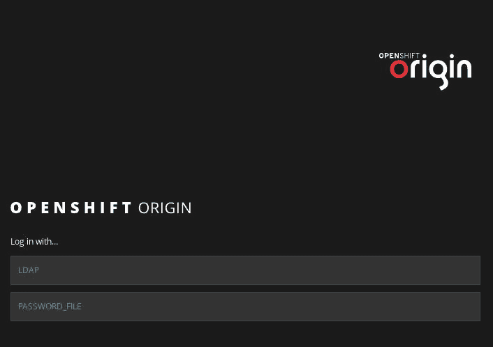

# OpenShift 中的安全性

之前，我们使用了高级 OpenShift 资源，如 ImageStreams、ConfigMaps 和模板。这些资源可以简化 OpenShift 资源管理和应用交付过程。

在本章中，我们将介绍 OpenShift 中的安全领域。任何企业的成功取决于许多因素，其中之一就是公司能够为不同的用户、部门和应用程序实施不同的安全策略。OpenShift 是一个企业级的应用平台，支持多种安全特性，使其能够融入任何企业的安全架构。

本章将帮助你理解以下概念：

+   身份验证——用户和身份、服务账户以及身份提供者

+   授权和基于角色的访问控制

+   访问控制器

+   安全上下文约束

+   在 OpenShift 中存储敏感数据

# 技术要求

在本节中，我们将使用 Vagrant 来演示这些方法之间的区别，因为我们需要两个虚拟机：一个用于单节点 OpenShift 集群，另一个用于 FreeIPA 服务器。使用以下 Vagrantfile 来启动环境：

```
$ cat Vagrantfile 
$lab_idm = <<SCRIPT
cat <<EOF >> /etc/hosts
172.24.0.11 openshift.example.com openshift
172.24.0.12 idm.example.com idm
EOF
sed -i '/¹²⁷.0.0.1.*idm.*$/d' /etc/hosts
yum -y update
yum -y install ipa-server
systemctl restart dbus
ipa-server-install -r IDM.EXAMPLE.COM -n idm.example.com -p idmsecret -a idmsecret --unattended
echo idmsecret | kinit admin
echo supersecret | ipa user-add alice --first Alice --last Springs --password
SCRIPT

$lab_openshift = <<SCRIPT
cat <<EOF >> /etc/hosts
172.24.0.12 idm.example.com idm
EOF
yum -y update
yum install -y epel-release git docker
yum install -y ansible
systemctl start docker
systemctl enable docker
git clone -b release-3.9 https://github.com/openshift/openshift-ansible /root/openshift-ansible
ssh-keygen -f /root/.ssh/id_rsa -N ''
cp /root/.ssh/id_rsa.pub /root/.ssh/authorized_keys
ssh-keyscan 172.24.0.11 >> .ssh/known_hosts
cp .ssh/known_hosts /root/.ssh/known_hosts
ssh-copy-id -i /root/.ssh/id_rsa root@172.24.0.11
reboot
SCRIPT

Vagrant.configure(2) do |config|
  config.vm.define "openshift" do |conf|
    conf.vm.box = "centos/7"
    conf.vm.hostname = 'openshift.example.com'
    conf.vm.network "private_network", ip: "172.24.0.11"
    conf.vm.provider "virtualbox" do |v|
       v.memory = 4096
       v.cpus = 2
    end
    conf.vm.provision "shell", inline: $lab_openshift
  end

  config.vm.define "idm" do |conf|
    conf.vm.box = "centos/7"
    conf.vm.hostname = 'idm.example.com'
    conf.vm.network "private_network", ip: "172.24.0.12"
    conf.vm.provider "virtualbox" do |v|
```

```
 v.memory = 2048
       v.cpus = 1
    end
    conf.vm.provision "shell", inline: $lab_idm
  end
end
```

与 第六章 *OpenShift 安装* 中的文件相比，上面的文件可能看起来很复杂，但它所做的只是自动化了该章节中手动执行的步骤，因为本章节的目的是在建立到此为止获得的知识的基础上，讨论安全性。此外，它在另一个虚拟机上设置 FreeIPA 服务器，并创建一个将在本章稍后使用的用户。

命令 `systemctl restart dbus` 是必要的，以防止在重新启动认证管理器时 FreeIPA 安装失败。

为了简单起见，我们为目录管理器和 IPA 管理员使用了相同的简单密码，但在生产环境中，请确保使用复杂且独特的密码！

运行 `vagrant up`，并等待直到它完成所有工作。根据你的网络连接和计算资源，可能需要最多 30 分钟：

```
$ vagrant up
Bringing machine 'openshift' up with 'virtualbox' provider...
Bringing machine 'idm' up with 'virtualbox' provider...
...
<output omitted>
...

```

完成后，打开 `openshift` 虚拟机的 SSH 会话并成为 root 用户：

```
$ vagrant ssh openshift
[vagrant@openshift ~]$ sudo -i
[root@openshift ~]#
```

不要被上述命令输出中的一些红色内容吓到。许多 CentOS 命令（如 yum）会将警告、错误甚至其他信息发送到标准错误，这些信息会被 Vagrant 解释为错误。

然后使用以下 Ansible 清单文件在 `openshift` 虚拟机上安装 OpenShift。如果你已经完成了 第六章 *OpenShift 安装*，你会注意到这是相同的文件，只是新增了 `openshift_master_identity_providers` 变量：

```
# cat /etc/ansible/hosts ...
<output omitted>
...
[masters]
172.24.0.11

[nodes]
172.24.0.11 openshift_node_labels="{'region': 'infra', 'zone': 'default'}" openshift_schedulable=true

[etcd]
172.24.0.11

[OSEv3:vars]
openshift_deployment_type=origin
openshift_disable_check=memory_availability,disk_availability
openshift_ip=172.24.0.11
ansible_service_broker_install=false
openshift_master_cluster_hostname=172.24.0.11
openshift_master_cluster_public_hostname=172.24.0.11
openshift_hostname=172.24.0.11
openshift_public_hostname=172.24.0.11
openshift_master_identity_providers=[{'name': 'LDAP', 'challenge': 'true', 'login': 'true', 'kind': 'LDAPPasswordIdentityProvider', 'mappingMethod': 'claim', 'attributes': {'id': ['dn'], 'email': ['mail'], 'name': ['cn'], 'preferredUsername': ['uid']}, 'insecure': 'true', 'bindDN': 'uid=admin,cn=users,cn=accounts,dc=idm,dc=example,dc=com', 'bindPassword': 'idmsecret', 'url': 'ldap://idm.example.com/cn=users,cn=accounts,dc=idm,dc=example,dc=com?uid'}, {'name': 'PASSWORD_FILE', 'challenge': 'true', 'login': 'true', 'kind': 'HTPasswdPasswordIdentityProvider', 'mappingMethod': 'claim', 'filename': '/etc/origin/master/.users'}]

[OSEv3:children]
masters
nodes
etcd
```

即使 `openshift_schedulable` 变量看起来位于单独的一行，它实际上是在上一行。如果你直接复制本书提供的文件，它会照常工作。

运行以下剧本来分别执行前提检查和实际安装：

```

# cd openshift-ansible
# ansible-playbook playbooks/prerequisites.yml
...
<output omitted>
...
# ansible-playbook playbooks/deploy_cluster.yml
...
<output omitted>
...
```

在我们的练习中，我们将使用两个身份提供者：**LDAP** 和 **HTPasswd**。我们将在后续的子章节中更详细地讨论它们。注意，我们为它们都指定了 `claim` 映射方法，以展示如何在多个提供者中使用此方法。

在 OpenShift 安装完成后，使用 `httpd-tools` 包提供的以下命令创建一个包含用户 `alice` 和哈希密码 `supersecret` 的 `htpasswd` 文件：

```
# htpasswd -c /etc/origin/master/.users alice
New password: `redhat123`
Re-type new password: `redhat123`
Adding password for user alice
```

现在我们已经准备好进一步进行操作。

# 身份验证

身份验证一词指的是验证一个人身份的过程。通常，用户不会在 OpenShift 中创建，而是由外部实体提供，如 LDAP 服务器或 GitHub。OpenShift 唯一涉及的部分是授权—确定用户的角色及其权限。OpenShift 支持与多种在企业环境中使用的身份管理解决方案集成，如 FreeIPA/Identity Management、Active Directory、GitHub、Gitlab、OpenStack Keystone 和 OpenID。为了简洁起见，我们将仅讨论最常用的几种，但你可以参考 [`docs.openshift.org/latest/install_config/configuring_authentication.html`](https://docs.openshift.org/latest/install_config/configuring_authentication.html) 获取完整文档。

# 用户和身份

用户是任何能够向 OpenShift API 发出请求、访问资源并执行操作的人。用户通常是在外部身份提供者中创建的，通常是企业身份管理解决方案，如 **轻量级目录访问协议** (**LDAP**) 或 Active Directory。

为了支持多个身份提供者，OpenShift 依赖于身份的概念，作为用户和身份提供者之间的桥梁。默认情况下，在第一次登录时会创建新的用户和身份。将用户映射到身份有四种方式：

| **方法** | **描述** |
| --- | --- |
| 声明 | 如果已存在具有相同名称的用户并且该用户映射到另一个身份，则无法创建另一个身份并进行登录。这在你希望在用户名相同的情况下，保持由多个提供者提供的身份之间的清晰区分时非常有用。此方法的一个潜在使用场景是从一种认证方案迁移到另一种认证方案。 |
| 添加 | 如果已存在具有相同名称的用户并且该用户映射到另一个身份，则会为同一用户创建另一个映射的身份。如果你需要为来自不同组织实体的用户提供身份管理解决方案，并允许他们使用方便的认证机制进行认证，这种方式会很有用。 |
| lookup | OpenShift 查找现有的用户、身份和映射，但不创建其中任何一个，因此这些实体必须在用户能够登录之前存在。 |
| generate | 如果已存在具有相同名称的用户并映射到另一个身份，则为该身份生成一个单独的用户。 |

在你的浏览器中访问`https://172.24.0.11:8443`，你将看到登录页面，您可以从可用的身份提供者中进行选择：



使用`LDAP`身份提供者通过浏览器登录，用户名为`alice`，密码为`supersecret`，并观察到用户是通过 CLI 创建的：

```
# oc get user
NAME    UID      FULL NAME     IDENTITIES
alice bf11471e-47a8-11e8-8dee-525400daa710  Alice Springs   LDAP:uid=alice,cn=users,cn=accounts,dc=idm,dc=example,dc=com
```

请注意，身份的名称由其类型和用户定位符组成，用冒号分隔。定位符是特定于提供者的，并指定如何从特定的提供者请求特定的用户。

你还可以看到创建了一个身份，并将其映射到该用户：

```
# oc get identity
NAME  IDP  NAME  IDP  USER NAME                                             USER   NAME  USER UID
LDAP:uid=alice,cn=users,cn=accounts,dc=idm,dc=example,dc=com   LDAP            uid=alice,cn=users,cn=accounts,dc=idm,dc=example,dc=com   alice       bf11471e-47a8-11e8-8dee-525400daa710
```

让我们尝试使用相同的凭据通过`PASSWORD_FILE`提供者登录：


凭据是正确的，但 OpenShift 无法创建新的身份并将其映射到现有用户，因为该用户已被`LDAP`提供者**认领**。这正是消息“无法创建用户”所表示的含义。

让我们删除用户及其身份，以为即将进行的演示提供干净的环境：

```
# oc delete user/alice
user "alice" deleted

# oc delete \
identity/LDAP:uid=alice,cn=users,cn=accounts,dc=idm,dc=example,dc=com
identity "LDAP:uid=alice,cn=users,cn=accounts,dc=idm,dc=example,dc=com" deleted
```

将`PASSWORD_FILE`提供者的映射方法更改为`add`：

```
# cat /etc/origin/master/master-config.yaml
...
<output omitted>
...
 - challenge: true
 login: true
 mappingMethod: add
 name: PASSWORD_FILE
...
<output omitted>
...
```

并重启主 API 服务：

```
# systemctl restart origin-master-api
```

再次使用`alice:supersecret`通过`LDAP`登录，像第一次一样，然后使用`alice:redhat123`通过`PASSWORD_FILE`登录。请注意，第二个身份已被添加到现有身份中，并映射到同一个用户：

```
# oc get user
NAME      UID     FULL NAME     IDENTITIES
alice     bf11471e-47a8-11e8-8dee-525400daa710   Alice Springs   LDAP:uid=alice,cn=users,cn=accounts,dc=idm,dc=example,dc=com, PASSWORD_FILE:alice
```

使用身份提供者登录的顺序很重要！由于你只为`PASSWORD_FILE`提供者指定了`add`方法，如果你首先尝试使用它进行登录，你将无法通过**LDAP**登录，因为它仍然设置为**认领**不存在的用户，并在用户已存在时返回错误。

为了更清楚地看到我们现在有两个身份映射到同一个用户，请运行以下命令：

```
# oc get identity
NAME IDP     NAME IDP USER NAME                                             USER  NAME   USER UID
LDAP:uid=alice,cn=users,cn=accounts,dc=idm,dc=example,dc=com   LDAP            uid=alice,cn=users,cn=accounts,dc=idm,dc=example,dc=com   alice       bf11471e-47a8-11e8-8dee-525400daa710
PASSWORD_FILE:alice                                            PASSWORD_FILE   alice                                                     alice       bf11471e-47a8-11e8-8dee-525400daa7
```

如果用户名不同，第二个身份将映射到该单独的用户。

在继续下一次演示之前，删除用户和身份：

```
# oc delete user/alice
user "alice" deleted
 # oc delete \
identity/LDAP:uid=alice,cn=users,cn=accounts,dc=idm,dc=example,dc=com
identity 
```

```
"LDAP:uid=alice,cn=users,cn=accounts,dc=idm,dc=example,dc=com" deleted
 # oc delete identity/PASSWORD_FILE:alice
identity "PASSWORD_FILE:alice" deleted
```

现在，将同一提供者的映射方法更改为`lookup`：

```
# cat /etc/origin/master/master-config.yaml
...
<output omitted>
...
 - challenge: true
 login: true
 mappingMethod: lookup
 name: PASSWORD_FILE
...
<output omitted>
...
```

重启主 API 以应用更改：

```
# systemctl restart origin-master-api
```

现在，首先使用`alice:supersecret`通过`LDAP`登录。它应该允许你登录。然后尝试使用`alice:redhat123`通过`PASSWORD_FILE`登录。你应该看到如下提供的新错误：


无法找到用户意味着我们没有为此提供者在 OpenShift 中创建身份，也没有将其映射到任何用户，因为`lookup`映射方法要求如此。让我们通过首先创建身份来纠正这一点：

```
# oc create identity PASSWORD_FILE:alice
identity "PASSWORD_FILE:alice" created
```

然后，将其映射到预先存在的用户：

```
# oc create useridentitymapping PASSWORD_FILE:alice alice
useridentitymapping "PASSWORD_FILE:alice" created
```

之后，登录尝试将会成功。

一旦你验证了可以使用`alice:redhat123`登录后，你可以删除该用户和两个身份以继续操作。

```
# oc delete user/alice
user "alice" deleted
# oc delete \
identity/LDAP:uid=alice,cn=users,cn=accounts,dc=idm,dc=example,dc=com
identity "LDAP:uid=alice,cn=users,cn=accounts,dc=idm,dc=example,dc=com" deleted
# oc delete identity/PASSWORD_FILE:alice
identity "PASSWORD_FILE:alice" deleted
```

我们不需要再次运行`oc get identity`命令来获取所有身份的列表，因为你可以使用其名称删除一个身份，这个名称取决于提供者的名称和用户的定位符；由于它们没有变化，我们可以使用之前的命令。

最后，将映射方法更改为`generate`：

```
# cat /etc/origin/master/master-config.yaml
...
<output omitted>
...
  - challenge: true
    login: true
    mappingMethod: generate
    name: PASSWORD_FILE
...
<output omitted>
...
```

重启主 API：

```
# systemctl restart origin-master-api
```

就像之前一样，使用`LDAP`登录，凭证为`alice:supersecret`，然后使用`PASSWORD_FILE`登录，凭证为`alice:redhat123`。让我们来看一下创建了哪些用户：

```
# oc get user
NAME      UID       FULL NAME       IDENTITIES
alice     97bd5ede-47b5-11e8-9f47-525400daa710   Alice Springs   LDAP:uid=alice,cn=users,cn=accounts,dc=idm,dc=example,dc=com
alice2    a145c96e-47b5-11e8-9f47-525400daa710                   PASSWORD_FILE:alice
```

如你所见，如果已有相同名称的用户存在，这种方法会创建一个使用单独身份映射的`generate`名称的独立用户。

你可以看到现在两个身份已映射到不同的用户：

```
# oc get identity
NAME   IDP NAME IDP USER NAME  USER NAME   USER UID
LDAP:uid=alice,cn=users,cn=accounts,dc=idm,dc=example,dc=com   LDAP            uid=alice,cn=users,cn=accounts,dc=idm,dc=example,dc=com   alice       97bd5ede-47b5-11e8-9f47-525400daa710
PASSWORD_FILE:alice                                            PASSWORD_FILE   alice                                                     alice2      a145c96e-47b5-11e8-9f47-525400daa710
```

最后，让我们删除该用户和身份：

```
# oc delete user/alice
user "alice" deleted # oc delete user/alice2 user "alice2" deleted
# oc delete \
identity/LDAP:uid=alice,cn=users,cn=accounts,dc=idm,dc=example,dc=com
identity "LDAP:uid=alice,cn=users,cn=accounts,dc=idm,dc=example,dc=com" deleted
# oc delete identity/PASSWORD_FILE:alice
identity "PASSWORD_FILE:alice" deleted # exit
$ exit
```

现在这个练习已经结束，我们可以停止我们的虚拟机释放 MiniShift 的系统资源，接下来的章节不再使用它们：

```
$ vagrant halt
==> idm: Attempting graceful shutdown of VM...
==> openshift: Attempting graceful shutdown of VM...
```

我们建议你只需`halt`此实验室，因为它将在*Admission controllers*部分中使用。

# 服务账户

服务账户使我们能够灵活控制 API 访问，而无需共享用户的凭证。为了向你展示它是如何工作的，我们需要启动 MiniShift 虚拟机：

```
$ minishift start --openshift-version=v3.9.0 --vm-driver=virtualbox
...
<output omitted>
...
```

接下来，`export PATH`到`oc`客户端：

```
$ export PATH="/home/$USER/.minishift/cache/oc/v3.9.0/linux:$PATH"
```

现在，将你的 Docker 客户端指向 MiniShift 虚拟机中的 docker 守护进程：

```
$ eval $(minishift docker-env)
```

最后，以特权用户`system:admin`身份登录，以便能够执行特权操作，例如添加 SCC 和角色：

```
$ oc login -u system:admin
```

现在，我们准备开始了。

另一种我们将使用的用户类型是服务账户。它们由 Pods 和其他非人类实体使用来执行各种操作，是其访问资源的主要管理方式。默认情况下，每个项目中都会创建三个服务账户：

| **名称** | **描述** |
| --- | --- |
| builder | 由构建 Pods 使用，并分配了 system:image-builder 角色，该角色授予将镜像推送到项目中任何镜像流的权限。 |
| deployer | 由部署 Pods 使用，并分配了 system:deployer 角色，该角色允许修改项目中的复制控制器。 |
| default | 默认由所有其他 Pods 使用。 |

你可以通过运行以下命令看到它们：

```
$ oc get serviceaccounts
NAME               SECRETS   AGE
builder            2         58s
default            2         58s
deployer           2         58s
```

每个服务账户由`ServiceAccount`资源表示，并与两个额外的密钥相关联——用于访问 OpenShift API 和内部注册表：

```
$ oc describe serviceaccounts/default
Name: default
Namespace: myproject
Labels: <none>
Annotations: <none>
Image pull secrets:    default-dockercfg-wggrl
Mountable secrets:     default-token-mg64x
                       default-dockercfg-wggrl
Tokens:                default-token-7cljg
                       default-token-mg64x
Events:                <none>
```

服务账户可以通过简单的命令创建：

```
$ oc create sa myserviceaccount
serviceaccount "myserviceaccount" created
```

现在我们先删除它，因为我们将在本章后面重新创建它：

```
$ oc delete sa/myserviceaccount
serviceaccount "myserviceaccount" deleted
```

每个服务账户也是两个组的成员：

+   `system:serviceaccounts`，包含集群中的所有服务账户。

+   `system:serviceaccounts:<project>`，它包括`project`中所有的服务账户。

您可以向服务账户组授予权限，这将有效地将这些权限授予组中的所有账户。例如，要授予集群中`myproject`项目下所有服务账户查看权限，请输入以下命令：

```
$ oc adm policy add-role-to-group view system:serviceaccounts -n myproject
role "view" added: "system:serviceaccounts"
```

我们仅以演示为目的指定了`-n`；由于您的当前项目是`myproject`，您本可以省略它。

让我们恢复之前的更改，并了解如何从用户中移除特定角色：

```
$ oc adm policy remove-role-from-group view system:serviceaccounts -n myproject
role "view" removed: "system:serviceaccounts"
```

# 身份提供者

通常，用户不会直接在 OpenShift 中创建，而是通过外部身份管理解决方案提供，身份管理解决方案可以像 LDAP 和 Active Directory 那样复杂，并且它们之间建立了信任关系，或者可以像一个带有哈希密码的文本密码文件那样简单。选择特定的身份提供者受到以下因素的影响：

+   您公司现有的身份管理解决方案

+   用户添加和删除的频率

+   是否需要集中管理

OpenShift 实现了以下身份提供者：

+   AllowAll

+   DenyAll

+   HTPasswd

+   LDAP

+   Keystone

+   BasicAuth

+   RequestHeader

+   GitLab

+   GitHub

+   OpenID

+   Google

为了简洁起见，我们将仅限于演示前面列表中的前四个提供者，您可以通过参考[`docs.openshift.org/latest/install_config/configuring_authentication.html`](https://docs.openshift.org/latest/install_config/configuring_authentication.html)来填补其他部分。这些配置需要应用于位于`/etc/origin/master/master-config.yml`的主配置文件。

如果您想测试下面的配置，您需要启动您的 vagrant 环境，因为它不能与 minishift 一起使用。

# AllowAll

这是 MiniShift 和 OpenShift Origin 的默认身份提供者，包括在没有配置文件的情况下启动 master 时。它允许所有用户使用所有密码，因此不会执行身份验证。仅在将集群与企业身份解决方案集成时，用于调试目的。

该提供者的主配置文件的配置片段如下：

```
...
<output omitted>
... 
 identityProviders:
  - challenge: true
    login: true
    mappingMethod: claim
    name: anypassword
    provider:
      apiVersion: v1
      kind: AllowAllPasswordIdentityProvider
...
<output omitted>
... 
```

# DenyAll

这个身份提供者与 AllowAll 相反，即它拒绝所有人的访问。当您想临时锁定集群以进行维护或其他目的时，它非常有用。这是 Red Hat OpenShift 容器平台的默认提供者。

该提供者的主配置文件的配置片段如下：

```
...
<output omitted>
... 
 identityProviders:        
  - challenge: true   
    login: true                        
    mappingMethod: claim       
    name: anypassword        
    provider:            
      apiVersion: v1
      kind: DenyAllPasswordIdentityProvider
...
<output omitted>
... 
```

如您所见，启用它所需的唯一操作是将`Allow`改为`Deny`。

# HTPasswd

该提供者允许您创建一个包含带有哈希密码的用户文件，从而实现更细粒度的访问控制。虽然这比让您的安装只是接受或拒绝所有人要好，但这种方法仍然有两个缺点：

+   对于具有多个主节点的高可用安装，你需要在所有主节点之间同步密码文件的更改，这容易出错且效率低下。当然，使用配置管理和 **版本控制系统** (**VCS**) 可以自动化这一过程，但几乎没有使用场景是不希望将集群与企业身份管理服务器集成的。

+   它不与企业身份管理解决方案集成，这要求你要么直接在密码文件中创建所有用户，要么在身份管理服务器和 OpenShift 主节点/配置管理服务器之间设置某种同步机制。

要启用此身份提供者，我们首先需要创建密码文件，这反过来需要安装 `httpd-tools` 包：

```
# sudo yum -y install httpd-tools
...
<output omitted>
...
Complete!
```

接下来，创建文件并将用户添加到其中。创建第一个用户时，请指定 `-c` 标志来创建文件：

```
# htpasswd -c /etc/origin/master/.htpasswd bob
New password: 
Re-type new password: 
Adding password for user bob
# htpasswd /etc/origin/master/.htpasswd alice
New password: 
Re-type new password: 
Adding password for user alice
```

现在，我们可以通过将默认配置中的 AllowAll 更改为 `htpasswd` 并指定密码文件的位置来启用此身份提供者：

```
...
<output omitted>
... 
 identityProviders:        
  - challenge: true   
    login: true                        
    mappingMethod: claim       
    name: anypassword        
    provider:            
      apiVersion: v1
      kind: HTPasswdPasswordIdentityProvider
      file: /etc/origin/master/.htpasswd
...
<output omitted>
...
```

最后，重启主节点 API 服务以使其更新变更：

```
# systemctl restart origin-master-api
```

# LDAP

这是你在组织中最可能使用的身份提供者，因为 LDAP（轻量目录访问协议）非常流行。如果你从头开始构建 OpenShift 实验环境，可以使用 FreeIPA 或 IdM——它们非常容易设置。像其他集中式身份管理解决方案一样，LDAP 使你不需要在多个主节点设置中同步密码文件的更改。

该身份提供者的主节点配置文件中的配置片段可能如下所示：

```
...
<output omitted>
...
  identityProviders:        
  - challenge: true   
    login: true                        
    mappingMethod: claim       
    name: ldap               
    provider:            
      apiVersion: v1
      kind: LDAPPasswordIdentityProvider   
      attributes:        
        id:                                  
          - dn                               
        email:                               
          - mail                             
        name:                                
          - cn                               
        preferredUsername:                   
          - uid                              
     insecure: true                          
     bindDN: 'uid=openshift_admin,cn=users,cn=accounts,dc=example,dc=com'        
     bindPassword: 'secretpassword'          
     url: 'ldap://idm.example.com/cn=users,cn=accounts,dc=example,dc=com?uid'
...
<output omitted>
... 
```

如果你的 LDAP 服务器支持 LDAPS 安全协议，你可以将 `insecure` 参数设置为 `false`。

# 授权和基于角色的访问控制

OpenShift 中的授权围绕以下概念构建：

+   **规则：** 允许对特定资源执行的操作集。

+   **角色：** 一组规则，允许根据特定的使用配置文件将其应用于用户。角色可以在集群级别或项目级别应用。

+   **角色绑定：** 用户/组与角色之间的关联。一个给定的用户或组可以与多个角色关联。

让我们回到我们的 MiniShift 环境。要查看所有可用集群角色的列表，请运行以下命令：

```
$ oc get clusterrole
NAME
admin
basic-user
cluster-admin
```

```

...
<output omitted>
...
view
```

使用 `describe` 命令了解某个角色中的规则：

```
$ oc describe clusterrole/edit
...
<output omitted>
...
```

从之前的输出中你可以看到，例如，具有此角色的用户可以创建和删除如 pods、configmaps、deploymentconfigs、imagestreams、routes 和 services 等资源，但不能对项目执行任何操作，除了查看它们。

另一方面，如果你描述视图角色，你会注意到对资源的唯一允许操作是获取、列出和观察，这使得它成为一个完美的选择。例如，如果你想授予开发团队查看生产环境中应用程序资源的权限，但不允许修改任何资源或创建新资源：

```
$ oc describe clusterrole/view
...
<output omitted>
...
```

# 使用内置角色

让我们看看如何使用`edit`预定义角色将用户授予另一个用户的项目访问权限。首先，作为`alice`在 MiniShift 中登录：

```
$ oc login -u aliceAuthentication required for https://192.168.99.100:8443 (openshift)
Username: alice
Password: <anypassword>
Login successful.
```

就像通过 Ansible 部署的 OpenShift 集群一样，默认的身份提供者是 AllowAll，允许你使用任何凭证。

接下来，创建一个名为`alice-project`的新项目：

```
$ oc new-project alice-project
Now using project "alice-project" on server "https://192.168.99.100:8443".
...
<output omitted>
...
```

以`bob`身份登录并观察，默认情况下他没有被添加为任何项目的成员：

```
$ oc login -u bob
Username: bob
Password: <anypassword>
Login successful.

$ oc project alice-project
error: You are not a member of project "alice-project".
You are not a member of any projects. You can request a project to be created with the 'new-project' command.
To see projects on another server, pass '--server=<server>'.
```

让我们通过授予`bob`在`alice-project`项目中`edit`大多数资源的权限来纠正这个问题：

```
$ oc login -u alice
...
<output omitted>
...
Using project "alice-project".

$ oc adm policy add-role-to-user edit bob
role "edit" added: "bob"
```

你可以使用以下命令查看当前`alice-project`项目中现有的`rolebinding`：

```
$ oc get rolebinding
NAME                    ROLE   USERS GROUPS  SERVICE ACCOUNTS   SUBJECTS
admin                   /admin                  alice
edit                    /edit                   bob
system:deployers        /system:deployer                                                         deployer
system:image-builders   /system:image-builder                                                    builder
system:image-pullers    /system:image-puller              system:serviceaccounts:alice-project
```

请注意，`deployer`和`builder`服务帐户始终有两个本地绑定，以及一个绑定授予`alice-project`项目中的所有服务帐户从内部注册表中拉取镜像的权限。另有两个绑定使`alice`成为她项目的管理员，并授予`bob`在该项目中编辑大多数资源的权限。

让我们查看`edit`角色绑定的详细信息：

```
$ oc describe rolebinding edit
Name:                          edit
Namespace:                     alice-project
Created:                       17 hours ago
Labels:                        <none>
Annotations:                   <none>
Role:                          /edit
Users:                         bob
...
<output omitted>
...
```

上面的输出告诉我们用户`bob`被绑定到`alice-project`项目中的`edit`角色。省略的输出与`edit`角色的详细信息相同。

以`bob`身份重新登录，并查看你现在是否可以访问 Alice 的项目：

```
$ oc login -u bob
Logged into "https://192.168.99.100:8443" as "bob" using existing credentials.

You have one project on this server: "alice-project"

Using project "alice-project".
```

# 创建自定义角色

如果预定义的角色不足以满足你的需求，你始终可以创建自定义角色，只需包含你需要的特定规则。让我们创建一个自定义角色，可以代替`edit`角色来创建和获取 pod：

```
$ oc login -u system:admin
...
$ oc create clusterrole alice-project-edit --verb=get,list,watch --
```

```
resource=namespace,project
clusterrole "alice-project-edit" created
```

请注意，我们必须以集群管理员身份登录才能创建集群角色。集群角色是将其用户加入特定项目所必需的。

OpenShift 的`create clusterrole`命令仅限于创建一组资源和动词，因此我们无法为 pods 添加不同的动词。我们可以通过直接编辑角色来解决这个限制：

```
$ oc edit clusterrole/alice-project-edit
...
<output omitted>
...
- apiGroups:
  - ""  # DO NOT MISS THIS LINE OR IT IS NOT GOING TO WORK  
  attributeRestrictions: null
  resources:
  - pods
  verbs:
  - create
  - get
  - list
  - watch

clusterrole "alice-project-edit" edited
```

接下来，从`bob`中删除`edit`角色：

```
$ oc adm policy remove-role-from-user edit bob
role "edit" removed: "bob"
```

将新角色分配给`bob`：

```
$ oc adm policy add-role-to-user alice-project-edit bob
role "alice-project-edit" added: "bob"
```

以`bob`身份登录：

```
$ oc login -u bob
...
```

并启动一个新的 pod，就像我们之前做的一样：

```
$ cat nginx-pod.yml
apiVersion: v1
kind: Pod
metadata:
  name: nginx
  labels:
    role: web
spec:
  containers:
  - name: nginx
    image: nginx
    resources:
      requests:
        cpu: 100m
        memory: 128Mi

$ oc create -f nginx-pod.yml
pod "nginx" created

$ oc get po
NAME  READY STATUS RESTARTS AGE
nginx 0/1   Error  0        2h
```

发生了什么？让我们看看 pod 的日志：

```
$ oc logs -f nginx 
Error from server (Forbidden): pods "nginx" is forbidden: User "bob" cannot get pods/log in the namespace "alice-project": User "bob" cannot get pods/log in project "alice-project"
```

这是预期的结果，因为我们没有授予自定义角色`alice-project-edit`访问 pod 日志的权限。如果你仔细看，错误信息实际上包含了我们需要做的操作——授予对`pods/log`资源的访问权限。让我们通过以`system:admin`用户身份登录，向角色定义中添加所需的部分，然后再以`bob`身份重新登录来修复它：

```
$ oc login -u system:admin
...
<output omitted>
...
$ oc edit clusterrole/alice-project-edit
...
<output omitted>
...
- apiGroups:
  - ""
  attributeRestrictions: null
  resources:
  - pods
  - pods/log
  verbs:
  - get
```

```

$ oc login -u bob
...
<output omitted>
...
```

再次尝试列出 pod 的日志：

```
$ oc logs -f nginx 
2018/07/18 02:44:31 [warn] 1#1: the "user" directive makes sense only if the master process runs with super-user privileges, ignored in /etc/nginx/nginx.conf:2
nginx: [warn] the "user" directive makes sense only if the master process runs with super-user privileges, ignored in /etc/nginx/nginx.conf:2
2018/07/18 02:44:31 [emerg] 1#1: mkdir() "/var/cache/nginx/client_temp" failed (13: Permission denied)
nginx: [emerg] mkdir() "/var/cache/nginx/client_temp" failed (13: Permission denied)
```

这次成功了，你能够看到容器在权限上出现问题。目前，运行以下命令来修正这个问题，但我们将在 *安全上下文约束* 部分更详细地讨论这个问题：

```
$ oc login -u system:admin
...
<output omitted>
...

$ oc delete po/nginx 
pod "nginx" deleted

$ oc adm policy add-scc-to-user anyuid -z default
scc "anyuid" added to: ["system:serviceaccount:alice-project:default"]

$ oc login -u bob
...
<output omitted>
...
```

现在它有效了：

```
$ oc create -f nginx-pod.yml
pod "nginx" created $ oc get po 
NAME  READY STATUS  RESTARTS AGE
nginx 1/1   Running 0        2h
```

我们刚刚创建了一个自定义角色，可以用来授予其用户只创建 pod 的权限。它本身并不是很有用，因为它不会让你创建一个服务，例如：

```
$ oc expose po/nginx --port=80
Error from server (Forbidden): User "bob" cannot create services in the namespace "alice-project": User "bob" cannot create services in project "alice-project" (post services)
```

现在这项操作结束了，让我们清理一下所有内容：

```
$ oc login -u system:admin
... <output omitted>
...
$ oc delete po/nginx
pod "nginx" deleted
$ oc adm policy remove-role-from-user alice-project-edit bob
role "alice-project-edit" removed: "bob"
$ oc delete clusterrole alice-project-edit
clusterrole "alice-project-edit" deleted
```

我们不得不以 `system:admin` 身份登录来删除我们的 pod，因为我们没有授予 `alice-project-edit` 角色删除 pod 的权限，只授予了创建 pod 的权限。这是 OpenShift 中 RBAC 可细化的又一例证。

# 入站控制器

由于本节内容的特殊性，我们将不使用 MiniShift，因此现在就停止它：

```
$ minishift stop
...
```

然后，改为启动 Vagrant 虚拟机：

```
$ vagrant up
...
<output omitted>
...
```

最后，在 `openshift` 虚拟机中打开一个会话：

```
$ vagrant ssh openshift
$ sudo -i
```

入站控制器是在 API 请求经过身份验证和授权后调用的一个子程序，但在将其持久化到 etcd 之前。入站控制器的作用是变更和验证将要持久化的资源，例如添加各种注释和默认值，并确保它们符合特定的限制。所有入站控制器是链式的，因此首先应用变更控制器，然后应用验证控制器。

以下图示展示了整体资源入站过程：


OpenShift 资源入站链

如上图所示，入站链通常由以下类型的入站控制器组成：

+   可以在主配置文件的 `admissionConfig` 部分启用的默认入站插件

+   变更入站 webhook

+   验证入站 webhook

以下是主配置文件中默认存在的入站控制器，除非在安装过程中通过 openshift_master_admission_plugin_config 变量另行配置：

```
# cat /etc/origin/master/master-config.yaml
...
<output omitted>
...
admissionConfig:
  pluginConfig:
    BuildDefaults:
      configuration:
        apiVersion: v1
        env: []
```

```

        kind: BuildDefaultsConfig
        resources:
          limits: {}
          requests: {}
    BuildOverrides:
      configuration:
        apiVersion: v1
        kind: BuildOverridesConfig
    PodPreset:
      configuration:
        apiVersion: v1
        disable: false
        kind: DefaultAdmissionConfig
    openshift.io/ImagePolicy:
      configuration:
        apiVersion: v1
        executionRules:
        - matchImageAnnotations:
          - key: images.openshift.io/deny-execution
            value: 'true'
          name: execution-denied
          onResources:
          - resource: pods
          - resource: builds
          reject: true
          skipOnResolutionFailure: true
        kind: ImagePolicyConfig
...
<output omitted>
...
```

即使你通过 SSH 登录到 MiniShift 虚拟机并查看主配置文件，也无法在 MiniShift 主 API 配置中找到这些入站插件。这就是为什么我们使用自己安装的 OpenShift 的原因。

OpenShift 默认支持以下入站控制插件：

| **Admission Control Plugin** | **描述** |
| --- | --- |
| ProjectRequestLimit | 限制每个用户自我提供的项目数量。 |
| BuildDefaults | 为 BuildConfigs 定义默认的配置参数，例如 git 代理服务器或运行构建器 pod 的节点。 |
| BuildOverrides | 可用于覆盖 BuildConfig 中定义的设置。 |
| RunOnceDuration | 限制构建器和部署器 pod 可以运行的时间。 |
| PodPreset | 启用使用 PodPreset 向 pod 提供资源，如 Secrets、ConfigMaps 和卷。 |
| PodNodeConstraints | 将 pod 限制在具有特定标签的节点上。 |
| PodNodeSelector | 将 Pod 限制为具有特定标签的项目。 |
| openshift.io/ImagePolicy | 控制哪些镜像可以在集群中使用，依据其注册表和注解。 |
| openshift.io/IngressAdmission | 禁用路由和入口对象的主机名冲突防止功能，允许没有`cluster-admin`集群角色的用户在对象创建后更改主机名。 |

让我们使用`ProjectRequestLimit`准入插件来演示如何配置准入控制器。

1.  将`ProjectRequestLimit`部分添加到主配置文件的准入链末尾：

```
admissionConfig:
  pluginConfig:
    ProjectRequestLimit:
      configuration:
        apiVersion: v1
        kind: ProjectRequestLimitConfig
        limits:
        - selector:
            department: ops
          maxProjects: 2
        - maxProjects: 3
...
<output omitted>
...
```

在这个特定示例中，我们创建了两个不同的限制。一个是针对“ops”部门，限制最大项目数为 2；另一个是针对其他所有人，限制最大项目数为 3。

1.  重启主 API 以应用更改：

```
# systemctl restart origin-master-api
```

1.  以`alice`身份登录，使用密码`supersecret`，这样用户和其身份会被创建：

```
$ oc login -u alice Username: alice
Password: supersecret
Login successful
```

1.  以集群管理员身份登录，才能创建标签：

```
$ oc login -u system:admin
```

现在，我们需要用与准入插件配置中的选择器匹配的键/值对来`标记``alice`：

```
$ oc label user/alice department=ops
user "alice" labeled
```

1.  以`alice`身份重新登录：

```
$ oc login -u alice
```

然后尝试创建多个项目：

```
$ oc new-project alice-project-1
...
$ oc new-project alice-project-2
...
$ oc new-project alice-project-3
Error from server (Forbidden): projectrequests.project.openshift.io "alice-project-3" is forbidden: user alice cannot create more than 2 project(s).
```

如你所见，创建第三个项目的请求被准入插件拦截并由于验证失败被拒绝。

让我们通过创建一个没有任何标签的新用户来查看全局限制如何作用。

1.  首先，创建一个名为`bob`的新用户。为了简便起见，你可以使用相同的密码`supersecret`：

```
$ htpasswd /etc/origin/master/.users bob
New password: supersecret
Re-type new password: supersecret
Adding password for user bob
```

1.  接下来，以新创建的用户身份登录。这次，我们不会为其关联任何标签：

```
$ oc login -u bob Username: bob Password: supersecret Login successful
```

让我们尝试创建项目，直到达到限制为止：

```
$ oc new-project bob-project-1
...
$ oc new-project bob-project-2
...
$ oc new-project bob-project-3
...
$ oc new-project bob-project-4
Error from server (Forbidden): projectrequests.project.openshift.io "bob-project-4" is forbidden: user bob cannot create more than 3 project(s).
```

如你所见，`bob`不能创建超过三个项目，正如准入插件配置中为没有标签的用户所指定的那样。

现在这个练习完成了，让我们进行清理：

```
$ oc delete project bob-project-{1..3}
project "bob-project-1" deleted
project "bob-project-2" deleted
project "bob-project-3" deleted
$ oc login -u alice
...
$ oc delete project alice-project-{1,2}
project "alice-project-1" deleted
project "alice-project-2" deleted
```

同时，从主配置文件中删除准入插件的部分，并重启主 API：

```
# sed -i '/ProjectRequestLimit/,+8d' /etc/origin/master/master-config.yaml
# systemctl restart origin-master-api
# exit 
$ exit 
```

上述代码段中的第一个命令删除匹配字符串及其后面的八行内容。

由于我们在本章剩余部分不再需要 Vagrant，因此让我们停止其虚拟机，以便为接下来的练习做准备：

```
$ vagrant halt
...
```

如果你完成了 Vagrant 环境的实验，可以运行`vagrant destroy`来清除它。

# 安全上下文约束

在我们开始之前，让我们重新启动 MiniShift 环境：

```
$ minishift start --openshift-version 3.9.0 --vm-driver virtualbox
...
<output omitted>
...
```

控制 Pod 行为的另一种机制是**安全上下文约束**（**SCCs**）。这些集群级别的资源定义了 Pod 可以访问哪些资源，并提供了额外的控制层级。默认情况下，OpenShift 支持七种 SCC：

```
$ oc login -u system:admin ...
<output omitted>
... $ oc get scc
anyuid                ...
hostaccess            ...
hostmount-anyuid      ...
hostnetwork           ...
nonroot               ...
privileged            ...
restricted            ...
```

你可能注意到我们在“小节‘创建自定义角色’”中使用的`anyuid` SCC，目的是解决容器权限问题。

默认情况下，除构建和部署用的 pod 外，所有 pod 都使用由 `restricted` SCC 分配的 `default` 服务账户，该账户不允许特权容器运行——也就是说，不允许以 root 用户身份运行并监听特权端口（<1024）。

使用 `docker inspect` 查看 `nginx` 镜像元数据中指定的用户：

```
$ docker inspect nginx
[
    {
...
<output omitted>
...
            "User": "",
...
<output omitted>
...
    }
]
```

恰巧，元数据没有指定用户，这导致镜像以 root 用户身份运行。这正是受限的 SCC（安全上下文约束）设计用来防止的情况。

之前，我们只是将 `anyuid` SCC 分配给了默认服务账户，这意味着所有容器都可以作为特权用户运行，这存在很大的安全风险。一个好的做法是为我们的 pod/容器创建一个专用服务账户，因此我们要以正确的方式来做：

```
$ oc create sa myserviceaccount
serviceaccount "myserviceaccount" created
```

接下来，我们需要将 `anyuid` SCC 分配给这个账户，但为此我们必须首先以集群管理员身份登录：

```
$ oc adm policy add-scc-to-user anyuid -z myserviceaccount scc "anyuid" added to: ["system:serviceaccount:myproject:myserviceaccount"]
```

现在，将我们的服务账户添加到 pod 的定义中：

```
$ cat nginx-pod2.yml 
apiVersion: v1
kind: Pod
metadata:
  name: nginx
  labels:
    role: web
spec:
  containers:
  - name: nginx
    image: nginx
    resources:
      requests:
        cpu: 100m
        memory: 128Mi
  serviceAccountName: myserviceaccount
```

让我们再次尝试创建 pod：

```
$ oc create -f nginx-pod2.yml 
pod "nginx" created
$ oc get po
NAME      READY     STATUS    RESTARTS   AGE
nginx     1/1       Running   0          15s
```

如你所见，既然我们已经将适当的 SCC 添加到 pod 使用的服务账户中，它已经成功启动。

与其允许镜像作为 root 用户运行，一个更好的做法是通过指定一个非特权用户来优化它，使其作为任意用户运行，设置文件和目录的适当权限，并配置应用程序监听非特权端口。

清理我们的操作后，但保留已分配 `anyuid` SCC 的 `myserviceaccount` 服务账户——我们稍后需要它来运行特权 pod：

```
$ oc delete po/nginx
pod "nginx" deleted
```

# 在 OpenShift 中存储敏感数据

在现代世界中，应用程序如此复杂，以至于它们由许多服务组成，通过 REST/SOAP API、二进制协议、消息中间件、集成总线等相互交互。举个例子，一个电子商店的后端应用程序；管理客户订单意味着你需要访问包含产品详细信息的数据库。另一个例子是支付处理应用程序，它必须能够访问国际支付网络，如 SWIFT，以便验证卡片详细信息并处理支付。这些例子在范围和使用的技术上非常不同，但它们有一个共同点——所有服务都需要某种认证数据来相互识别，并且这些数据必须存储在某个地方。

一个明显但最不安全的策略是通过配置映射将这些数据作为纯文本传递给 pods，就像其他任何数据一样。采用这种方法，任何具有项目资源查看权限的人都可以查看敏感数据，因此无法实现细粒度的访问控制。

作为一个企业级的 PaaS 解决方案，OpenShift 采用了专门的安全机制来保护这些数据免受未经授权的泄露——`Secret`（机密）。

虽然 OpenShift 为敏感信息提供了足够的保护，但它并不是专门的安全解决方案的替代品。例如，如果你需要将加密/解密密钥存储在安全的位置，你可能需要考虑使用**硬件安全模块**（**HSM**）。

# 什么数据被认为是敏感的？

一般来说，任何需要防止未经授权访问的数据都被视为敏感数据。这包括登录凭据、令牌、加密密钥、智能卡、机密文件等。各种类型的敏感数据的保护由许多政府批准的安全信息标准和公司政策规范，因此成为信息安全的一个独立领域。在应用程序和微服务的上下文中，我们主要关注敏感数据的一个子集，例如：

+   登录凭据（用户名/密码）

+   API 令牌

+   加密密钥

+   X.509 证书/密钥对

# 秘密

秘密与我们在前一章中讨论的配置映射类似，它们也用于将数据传递给 Pod，但它们的相似之处仅止于此。秘密的唯一用途是存储应用程序使用的敏感数据——如 API 令牌、凭据、X.509 证书/密钥等。它们由 tmpfs（内存中的临时文件系统）支持，防止它们被存储在持久化存储中。秘密与配置映射的不同之处在于：

+   很多秘密在 OpenShift 启动时自动创建（例如，供 Pod 访问 OpenShift API 和内部注册表等）

+   默认情况下，秘密值是经过 base64 编码的，这使得它们在被注入到容器之前无法查看

OpenShift 支持三种类型的秘密：

| **类型** | **描述** |
| --- | --- |
| generic | 任意数据，如文件、目录或字符串的内容。 |
| docker-registry | 存储在`.dockercfg`文件中的 Docker 注册表凭据。 |
| tls | X.509 证书及其对应的密钥。我们将在本节稍后使用此类型的秘密作为示例。 |

如果你还没有登录，请首先以`system:admin`用户身份登录：

```
$ oc login -u system:admin
..
<output omitted>
...
```

使用熟悉的`get`命令查看当前项目中的所有秘密：

```
$ oc get secret
NAME                               TYPE                                  DATA      AGE
builder-dockercfg-2bpc7            kubernetes.io/dockercfg               1         4d
builder-token-2cdj5                kubernetes.io/service-account-token   4         4d
builder-token-8lhrx                kubernetes.io/service-account-token   4         4d
default-dockercfg-wggrl            kubernetes.io/dockercfg               1         4d
default-token-7cljg                kubernetes.io/service-account-token   4         4d
default-token-mg64x                kubernetes.io/service-account-token   4         4d
deployer-dockercfg-kd88d           kubernetes.io/dockercfg               1         4d
deployer-token-5rf6f               kubernetes.io/service-account-token   4         4d
deployer-token-k8lwh               kubernetes.io/service-account-token   4         4d
myserviceaccount-dockercfg-n6lg7   kubernetes.io/dockercfg               1         4d
myserviceaccount-token-fxwpn       kubernetes.io/service-account-token   4         4d
myserviceaccount-token-k4d5g       kubernetes.io/service-account-token   4         4d
```

请注意，每个服务帐户在项目中都有三个秘密，这一点在服务帐户的子节中已有说明。让我们来看一下默认服务帐户的`dockercfg`令牌实际包含哪些数据：

```
$ oc edit secret/default-dockercfg-wggrl 
# Please edit the object below. Lines beginning with a '#' will be ignored,
# and an empty file will abort the edit. If an error occurs while saving this file will be
# reopened with the relevant failures.
#
apiVersion: v1
data:
 .dockercfg: ... <output omitted> ...
kind: Secret
...
<output omitted>
...
```

你会看到`data`属性包含一个长的 base64 编码字符串，表示用于访问内部注册表的 Docker 客户端凭据。使用以下 Python 单行命令解码`.dockercfg`的内容：

```
$ python -c "import base64, json; secret_json = base64.b64decode('...<base64-encoded value of .dockercfg from the secret>...'); parsed = json.loads(secret_json); print json.dumps(parsed, indent=4, sort_keys=True)"
$ {
    "172.30.1.1:5000": {
        "auth": "c2Vydmlj...<output omitted>...ZkFRTEE=", 
        "email": "serviceaccount@example.org", 
        "password": "eyJhbGci...<output omitted>...wVBfAQLA", 
        "username": "serviceaccount"
    }, 
    "docker-registry.default.svc:5000": {
        "auth": "c2Vydmlj...<output omitted>...ZkFRTEE=", 
        "email": "serviceaccount@example.org", 
        "password": "eyJhbGci...<output omitted>...wVBfAQLA", 
        "username": "serviceaccount"
    }
}
```

请注意，`auth`和`password`值在文档的两个部分中是相同的，因为它们指定了相同注册表的凭据。让我们进一步深入并解码`auth`字段的值：

```
$ python -c "import base64; print base64.b64decode('c2Vydmlj...<output omitted>...ZkFRTEE=')"
$ serviceaccount:eyJhbGci...<output omitted>...wVBfAQLA
```

你可能已经注意到，冒号后面的字符串实际上是我们之前解码的 JSON 文档中的密码。你可以使用相同的一行命令来解码它，不过我们没有在这里提供输出，因为它包含了非 Unicode 字符。

现在，我们开始动手创建自己的秘密并在 pod 中使用它。秘密的一个典型用例是配置了 SSL/TLS 支持的 Web 服务器，其中秘密用于存储证书/密钥对。

首先，我们需要创建一个 X.509 证书及其密钥：

```
$ openssl req -x509 -nodes -days 365 -newkey rsa:2048 -keyout ssl.key -out ssl.crt
Generating a 2048 bit RSA private key
.............+++
..............+++
writing new private key to 'ssl.key'
-----
You are about to be asked to enter information that will be incorporated
into your certificate request.
What you are about to enter is what is called a Distinguished Name or a DN.
There are quite a few fields but you can leave some blank
For some fields there will be a default value,
If you enter '.', the field will be left blank.
-----
Country Name (2 letter code) [XX]:US
State or Province Name (full name) []:AZ
Locality Name (eg, city) [Default City]:Phoenix
Organization Name (eg, company) [Default Company Ltd]:ACME
Organizational Unit Name (eg, section) []:IT
Common Name (eg, your name or your server's hostname) []:localhost
Email Address []:
```

在证书字段中指定的内容并不重要，因为它只会用于展示配置了 SSL 的工作 Nginx 服务器。

接下来，创建一个自定义的 Nginx 虚拟主机，监听 TCP 端口`443`并配置证书和密钥的位置：

```
$ cat nginx_custom_default.conf 
server {
    listen       80;
    listen       443 ssl;
```

```

    server_name  localhost;
    ssl_certificate     ssl/..data/tls.crt;
    ssl_certificate_key ssl/..data/tls.key;
    location / {
        root   /usr/share/nginx/html;
        index  index.html index.htm;
    }
}
```

TLS 秘密被挂载在容器的 mountPath 下的子目录`..data`中——这就是证书和密钥路径包含`..data`的原因。

使用前面的配置文件创建一个配置映射，稍后 pod 将使用它：

```
$ oc create cm nginx --from-file nginx_custom_default.conf 
configmap "nginx" created
```

下一步是使用证书和密钥创建秘密：

```
$ oc create secret tls nginx --cert ssl.crt --key ssl.key 
secret "nginx" created
```

让我们来看一下新创建的秘密定义：

```
$ oc export secret/nginx
apiVersion: v1
data:
  tls.crt: ...<base64-encoded certificate>...
  tls.key: ...<base64-encoded key>...
kind: Secret
metadata:
  creationTimestamp: null
  name: nginx
type: kubernetes.io/tls
```

注意，秘密的密钥`tls.crt`和`tls.key`分别存储证书和密钥。当 TLS 秘密被挂载到 pod 时，证书和密钥会被解密并存储到这些密钥名称的文件中——这就是为什么在虚拟主机配置中我们必须指定密钥名称而不是文件名的原因，因为我们是通过`openssl`命令创建它们的。

我们需要创建的最后一个构建块是 pod 本身。使用适当的指令将配置映射和秘密挂载为 pod 中的卷：

```
$ cat nginx-pod3.yml 
apiVersion: v1
kind: Pod
metadata:
  name: nginx
  labels:
    role: web
spec:
  containers:
  - name: nginx
    image: nginx
    resources:
      requests:
        cpu: 100m
        memory: 128Mi
    volumeMounts:
      - name: conf
        mountPath: /etc/nginx/conf.d
      - name: tls
        mountPath: /etc/nginx/ssl
  volumes:
    - name: conf
      configMap:
        name: nginx
        items:
          - key: nginx_custom_default.conf
            path: default.conf
    - name: tls
      secret:
        secretName: nginx
  serviceAccountName: myserviceaccount
```

现在，轮到我们创建 pod 了：

```
$ oc create -f nginx-pod3.yml 
pod "nginx" created
```

观察它的创建过程：

```
$ oc get po
NAME    READY   STATUS            RESTARTS   AGE
```

```

nginx    0/1    ContainerCreating   0         3s
nginx    1/1    Running   0         7s
```

出于好奇，我们来看看容器内部，看看证书和密钥是如何访问的：

```
$ oc rsh nginx ls -l /etc/nginx/ssl
total 0
lrwxrwxrwx 1 root root 14 Apr 25 11:21 tls.crt -> ..data/tls.crt
lrwxrwxrwx 1 root root 14 Apr 25 11:21 tls.key -> ..data/tls.key
```

使用以下命令查看秘密未存储在文件系统上（即使它是短暂的，在我们这个案例中），而是通过`tmpfs`挂载在内存中：

```
$ oc rsh nginx df -h
Filesystem Size Used Avail Use% Mounted on
overlay 19G 2.0G 17G 11% /
tmpfs 1000M 0 1000M 0% /dev
tmpfs 1000M 0 1000M 0% /sys/fs/cgroup
/dev/sda1 19G 2.0G 17G 11% /etc/hosts
shm 64M 0 64M 0% /dev/shm
tmpfs 1000M 8.0K 1000M 1% /etc/nginx/ssl
tmpfs 1000M 16K 1000M 1% /run/secrets/kubernetes.io/serviceaccount
tmpfs 1000M 0 1000M 0% /proc/scsi
tmpfs 1000M 0 1000M 0% /sys/firmware
```

为 pod 创建一个服务：

```
$ oc expose po/nginx --port 443
service "nginx" exposed
```

然后，`expose`服务以创建一个可供外部访问的路由：

```
$ oc expose svc/nginx
route "nginx" exposed
```

路由已创建：

```
$ oc get route
NAME   HOST/PORT  PATH   SERVICES  PORT   TERMINATION  WILDCARD
nginx     nginx-myproject.192.168.42.43.nip.io             nginx      443                     None
```

最后一步，我们需要为路由添加 TLS 终止，并将其类型设置为`passthrough`，这样 OpenShift 路由器就能接受加密的流量并且不对其进行任何修改。无法通过`expose` CLI 命令创建安全路由，所以我们必须直接`patch`路由定义：

```
$ oc patch route/nginx -p '{"spec" : {"tls": {"termination": "passthrough"}}}'
route "nginx" patched
```

为了验证我们的 Nginx 服务器是否正确配置了 TLS 支持，请打开你喜欢的网页浏览器，访问代表该路由的 URL，并确认安全例外，因为我们使用的是自签名证书：


注意 URL 左侧的小锁图标，表示已建立安全连接。黄色三角形警告（如在 Mozilla Firefox 中所示）表示证书无效，但在我们的实验环境中这是完全可以接受的。

在 Google Chrome 和 Chromium 浏览器中，你会看到 URL 字段左侧显示“不安全”的警告，这两者是相同的。

既然这个练习已经结束，让我们清理当前的项目：

```
$ oc delete all --all
route "nginx" deleted
pod "nginx" deleted
service "nginx" deleted
$ oc delete cm/nginx secret/nginx
configmap "nginx" deleted
secret "nginx" deleted
```

你可以在`stringData`部分中指定未编码的纯文本数据，而不是`data`。这对于模板非常有用，这样你可以为生成的各种秘密（例如 Webhook 密钥）参数化。

# 总结

在本章中，你了解了在 OpenShift 中实现认证的各种身份提供者、服务账户，并理解了用户与身份之间的关系。我们还讨论了授权过程以及如何授予用户权限、准入控制器和安全上下文约束。最后，我们讨论了 Secrets，并学习了它们如何被应用程序使用。

在下一章，我们将处理更高层次的网络—OpenShift SDN。

# 问题

1.  可以使用哪些映射方法来防止将多个身份映射到同一用户？选择两个：

    1.  lookup

    1.  generate

    1.  add

    1.  claim

1.  哪个服务账户用于运行应用程序 Pod？

    1.  all

    1.  builder

    1.  deployer

    1.  default

1.  可以为用户分配哪些角色，以授予其在特定项目中创建和删除资源的权限？选择两个：

    1.  create

    1.  admin

    1.  view

    1.  edit

1.  哪个准入控制插件可以限制每个用户自我创建项目的数量？

    1.  PodPreset

    1.  ProjectRequestNumber

    1.  ProjectRequestLimit

    1.  SelfProvisionedProjects

1.  可以使用哪些 SCCs 来以 root 身份运行容器？选择 2 个：

    1.  anyuid

    1.  restricted

    1.  hostmount-anyuid

    1.  privileged

1.  哪个 secret 的属性存储了 base64 编码的数据？

    1.  stringData

    1.  data

    1.  base64

    1.  spec

# 进一步阅读

+   **用户**：[`docs.openshift.org/latest/admin_guide/manage_users.html`](https://docs.openshift.org/latest/admin_guide/manage_users.html)

+   **服务账户**：[`docs.openshift.org/latest/admin_guide/service_accounts.html`](https://docs.openshift.org/latest/admin_guide/service_accounts.html)

+   **RBAC**：[`docs.openshift.org/latest/admin_guide/manage_rbac.html`](https://docs.openshift.org/latest/admin_guide/manage_rbac.html)

+   **身份提供者**：[`docs.openshift.org/latest/install_config/configuring_authentication.html`](https://docs.openshift.org/latest/install_config/configuring_authentication.html)

+   **准入控制器**：[`docs.openshift.org/latest/architecture/additional_concepts/admission_controllers.html`](https://docs.openshift.org/latest/architecture/additional_concepts/admission_controllers.html)

+   **安全上下文约束**：[`docs.openshift.org/latest/admin_guide/manage_scc.html`](https://docs.openshift.org/latest/admin_guide/manage_scc.html)

+   **Secrets**：[`docs.openshift.org/latest/dev_guide/secrets.html`](https://docs.openshift.org/latest/dev_guide/secrets.html)
