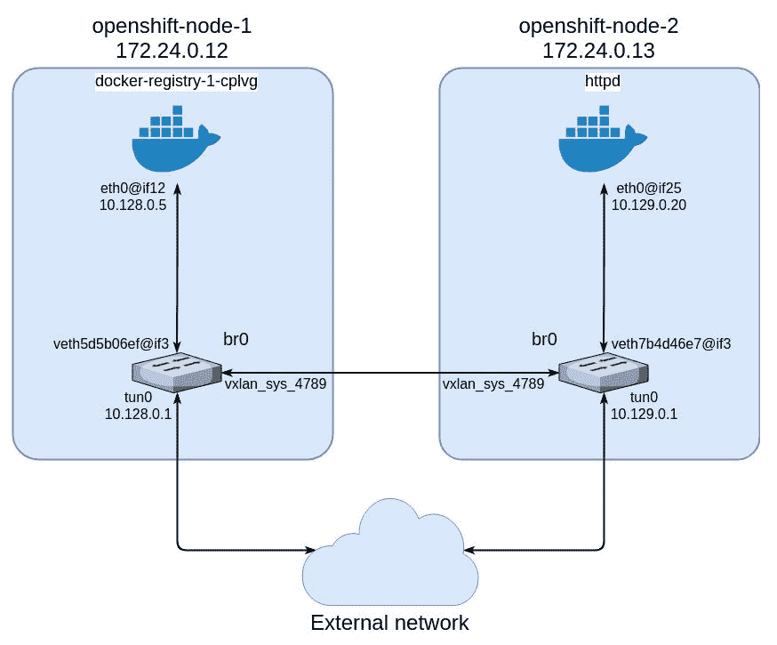
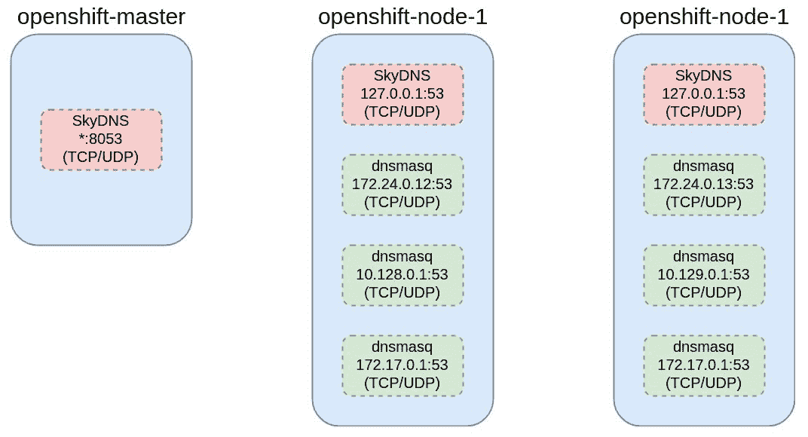
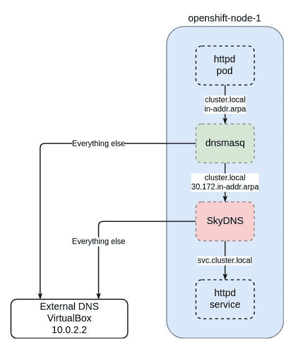

# 第十一章：管理 OpenShift 网络

在上一章中，我们介绍了 OpenShift 中的安全领域。OpenShift 是一个企业级的应用管理平台，支持多种安全功能，能够融入任何企业的安全环境。

和任何云平台一样，OpenShift 在两个不同的层次上严重依赖网络堆栈：

+   基础网络拓扑，直接由物理网络设备或在虚拟环境中部署的 OpenShift 自身的虚拟网络设备确定。此层提供 OpenShift 主节点和节点之间的连接，超出了 OpenShift 本身的控制范围。

+   由所使用的 OpenShift SDN 插件确定的虚拟网络拓扑。此层关注于管理应用程序之间的连接性并提供外部访问。

在本章中，我们将处理更高层次的网络配置——OpenShift SDN，并将涵盖以下主题：

+   OpenShift 中的网络拓扑

+   SDN 插件

+   出口路由器

+   外部项目流量的静态 IP

+   出口网络策略

+   DNS

# 技术要求

对于本章，我们将使用通过 Vagrant 管理的以下 VM 配置，使用默认的 VirtualBox 提供者：

| **名称** | **角色** |
| --- | --- |
| openshift-master | 主节点 |
| openshift-node-1 | 节点 |
| openshift-node-2 | 节点 |

确保你使用的桌面或笔记本电脑有足够的 RAM。上面的配置在 8GB RAM 上进行了测试，但几乎不够，所以我们建议至少在 16GB 的系统上运行。

此配置对应以下 Vagrantfile：

```
$ cat Vagrantfile 
$common_provision = <<SCRIPT
cat <<EOF >> /etc/hosts
172.24.0.11 openshift-master.example.com openshift-master
172.24.0.12 openshift-node-1.example.com openshift-node-1
172.24.0.13 openshift-node-2.example.com openshift-node-2
EOF
sed -i '/¹²⁷.0.0.1.*openshift.*$/d' /etc/hosts
yum -y update
yum install -y docker
systemctl start docker
systemctl enable docker
SCRIPT

$master_provision = <<SCRIPT
yum -y install git epel-release
yum -y install ansible
git clone -b release-3.9 https://github.com/openshift/openshift-ansible /root/openshift-ansible
ssh-keygen -f /root/.ssh/id_rsa -N ''
cp /root/.ssh/id_rsa.pub /root/.ssh/authorized_keys
for i in 1 3; do ssh-keyscan 172.24.0.1$i; done >> .ssh/known_hosts
cp .ssh/known_hosts /root/.ssh/known_hosts
for i in 1 2; do sudo ssh-copy-id -o IdentityFile=/vagrant_private_keys/machines/openshift-node-$i/virtualbox/private_key -f -i /root/.ssh/id_rsa root@172.24.0.1$((i+1)); done
reboot
SCRIPT

$node_provision = <<SCRIPT
cp -r /home/vagrant/.ssh /root
reboot
SCRIPT

Vagrant.configure(2) do |config|
  config.vm.define "openshift-node-1" do |conf|
    conf.vm.box = "centos/7"
    conf.vm.hostname = 'openshift-node-1.example.com'
    conf.vm.network "private_network", ip: "172.24.0.12"
    conf.vm.provider "virtualbox" do |v|
       v.memory = 2048
       v.cpus = 2
    end
    conf.vm.provision "shell", inline: $common_provision
    conf.vm.provision "shell", inline: $node_provision
  end

  config.vm.define "openshift-node-2" do |conf|
    conf.vm.box = "centos/7"
    conf.vm.hostname = 'openshift-node-2.example.com'
    conf.vm.network "private_network", ip: "172.24.0.13"
    conf.vm.provider "virtualbox" do |v|
       v.memory = 2048
       v.cpus = 2
    end
    conf.vm.provision "shell", inline: $common_provision
    conf.vm.provision "shell", inline: $node_provision
  end

  config.vm.define "openshift-master" do |conf|
    conf.vm.box = "centos/7"
    conf.vm.hostname = 'openshift-master.example.com'
    conf.vm.network "private_network", ip: "172.24.0.11"
    conf.vm.synced_folder '.vagrant/', '/vagrant_private_keys', type: 'rsync'
    conf.vm.provider "virtualbox" do |v|
       v.memory = 4096
       v.cpus = 2
    end
    conf.vm.provision "shell", inline: $common_provision
    conf.vm.provision "shell", inline: $master_provision
  end
end
```

为了能够从你的主机系统访问 VM 中的集群，确保你的笔记本电脑上的 `/etc/hosts` 文件如下所示：

```
$ cat /etc/hosts
127.0.0.1   localhost openshift localhost.localdomain localhost4 localhost4.localdomain4
::1         localhost localhost.localdomain localhost6 localhost6.localdomain6
172.24.0.11 openshift.example.com
```

运行 `vagrant up` 并等待直到它完成所有工作。根据你的网络连接和计算资源，这可能需要最多 30 分钟：

```
$ vagrant up
Bringing machine 'openshift-node-1' up with 'virtualbox' provider...
Bringing machine 'openshift-node-2' up with 'virtualbox' provider...
Bringing machine 'openshift-master' up with 'virtualbox' provider...
...
<output omitted>
...
```

完成后，打开 SSH 会话进入主 VM，并切换为 root 用户：

```
$ vagrant ssh openshift-master
[vagrant@openshift-master ~]$ sudo -i
[root@openshift-master ~]#
```

你可以使用以下清单来部署 OpenShift：

```
# cat /etc/ansible/hosts ...
<output omitted>
...
[masters]
172.24.0.11

[nodes]
172.24.0.11 openshift_node_labels="{'region': 'us', 'zone': 'default'}" openshift_ip=172.24.0.11 openshift_master_cluster_hostname=172.24.0.11 openshift_hostname=172.24.0.11
172.24.0.12 openshift_node_labels="{'region': 'infra', 'zone': 'east'}" openshift_ip=172.24.0.12 openshift_master_cluster_hostname=172.24.0.12 openshift_hostname=172.24.0.12
172.24.0.13 openshift_node_labels="{'region': 'us', 'zone': 'west'}" openshift_ip=172.24.0.13 openshift_master_cluster_hostname=172.24.0.13 openshift_hostname=172.24.0.13

[etcd]
172.24.0.11

[OSEv3:vars]
openshift_deployment_type=origin
openshift_disable_check=memory_availability,disk_availability
ansible_service_broker_install=false
openshift_master_cluster_public_hostname=openshift.example.com
openshift_public_hostname=openshift.example.com
openshift_master_default_subdomain=openshift.example.com
openshift_schedulable=true

[OSEv3:children]
masters
nodes
etcd
```

即使 `nodes` 组中的变量看起来在单独的行上，它们实际上是与其关联的主机上的前一行。如果你直接复制这个文件，并且它与本书其他材料提供的文件一致，它将正常工作。

现在，是时候安装 OpenShift 了：

```
# cd openshift-ansible
# ansible-playbook playbooks/prerequisites.yml
...
<output omitted>
...
# ansible-playbook playbooks/deploy_cluster.yml
...
<output omitted>
...
```

# OpenShift 中的网络拓扑

为了提供容器之间通信的公共介质，OpenShift 使用了通过 VXLAN 实现的覆盖网络。**虚拟扩展局域网**（**VXLAN**）协议提供了一种在第 3 层（IP 网络）上传输第 2 层（以太网）帧的机制。根据使用的 SDN 插件，通信的范围可能仅限于同一项目内的 Pods，或者可能完全不受限制。无论使用哪个插件，网络拓扑仍然是相同的。

当新节点在 `etcd` 中注册时，主节点从集群网络中分配一个私有的`/23`子网。默认情况下，子网从 `10.128.0.0/14` 中分配，但可以在主节点配置文件的 `networkConfig` 部分进行配置。以下是文件中包含相关参数的摘录：

```
# cat /etc/origin/master/master-config.yaml
...
<output omitted>
...
networkConfig:
  clusterNetworkCIDR: 10.128.0.0/14
  clusterNetworks:
  - cidr: 10.128.0.0/14
    hostSubnetLength: 9
...
<output omitted>
...
```

`hostSubnetLength` 设置决定了每个节点分配多少个 IP 地址，以便在该节点上运行的 Pod 之间分配。在我们默认的配置中，每个子网的大小是 2⁹ = 512 个地址，这使得 `510` 个 IP 可供 Pod 使用。总结一下，每个 Pod 的 IP 地址将有 /23 的子网掩码（14+9）。

请注意，`clusterNetworks[].cidr` 设置只能更改为一个包含先前设置的较大子网。例如，它可以设置为 `10.128.0.0/12`，因为它包含 `/14`，但不能设置为 `10.128.0.0/16`，因为它们不完全重叠。

此外，`hostSubnetLength` 一旦集群创建后不能更改。

OpenShift 中的覆盖网络由以下组件构成：

+   `br0`：一个 OVS 桥接器，所有在特定节点上运行的 Pod 都通过 `veth` 对连接到它。每个节点都有一个 `br0` 设备，充当虚拟交换机。

+   `tun0`：这是 `br0` 的一个内部端口，编号为 2，分配给每个节点子网的默认网关地址，并用于外部访问。OpenShift 还创建了路由和 netfilter 规则，通过 NAT 将流量引导到外部网络。

+   `vxlan_sys_4789`：`br0` 的 OVS 端口 `1`，提供跨不同节点运行的 Pod 之间的连接。在 OVS 规则中，它被称为 `vxlan`。

# 跟踪连接性

在本小节中，我们将创建一个名为 `demo` 的项目，托管一个 `httpd` Pod，以便亲身体验 OpenShift 中覆盖网络的构建过程。

1.  首先，让我们创建项目：

```
# oc new-project demo
...
```

1.  然后，在该项目中创建一个运行 Apache Web 服务器的 Pod：

```
# cat httpd-pod.yml 
apiVersion: v1
kind: Pod
metadata:
  name: httpd
  labels:
    role: web
spec:
  containers:
  - name: httpd
    image: manageiq/httpd
    resources:
      requests:
        cpu: 400m
        memory: 128Mi
# oc create -f httpd-pod.yml
pod "httpd" created
```

1.  我们将需要分配给 Pod 的 IP 地址，以及它被调度到的节点的地址：

```
# oc describe po/httpd | grep '\(Node\|IP\):'
Node: 172.24.0.13/172.24.0.13
IP: 10.129.0.20
```

1.  另一个步骤是获取 Pod 网络接口的名称，它实际上是用来连接 Pod 和 `br0` 桥接器的 `veth` 对的一端：

```
# oc rsh httpd ip a
...
<output omitted>
...
3: eth0@if25: <BROADCAST,MULTICAST,UP,LOWER_UP> mtu 1450 qdisc noqueue state UP group default 
    link/ether 0a:58:0a:81:00:2c brd ff:ff:ff:ff:ff:ff link-netnsid 0
    inet 10.129.0.20/23 brd 10.129.1.255 scope global eth0
       valid_lft forever preferred_lft forever
    inet6 fe80::14d1:32ff:fef9:b92c/64 scope link 
       valid_lft forever preferred_lft forever
```

现在，让我们转到另一个名为 `default` 的项目。此项目用于托管路由器和内部 Docker 注册表的特殊 Pod。这两个 Pod 部署在标记为 `infra` 的节点上，在我们这里是 `openshift-node-1`。让我们确认这一点并找出注册表 Pod 的 IP 地址：

```
# oc project default
Now using project "default" on server "https://openshift-master.example.com:8443".
# oc get po
NAME READY STATUS RESTARTS AGE
docker-registry-1-cplvg 1/1 Running 1 17h
router-1-52xrr 1/1 Running 1 17h
# oc describe po/docker-registry-1-cplvg | grep '\(Node\|IP\):'
Node: 172.24.0.12/172.24.0.12
IP: 10.128.0.5
```

我们选择注册表 Pod 的原因是路由器 Pod 以特权模式运行，以便能够直接访问节点的网络栈；因此，它不能代表典型的配置。

现在，运行以下命令获取注册表 Pod 的网络接口卡（NIC）的名称：

```
# oc rsh docker-registry-1-cplvg ip a
...
<output omitted>
...
3: eth0@if12: <BROADCAST,MULTICAST,UP,LOWER_UP> mtu 1450 qdisc noqueue state UP group default
    link/ether 0a:58:0a:80:00:05 brd ff:ff:ff:ff:ff:ff link-netnsid 0
    inet 10.128.0.5/23 brd 10.128.1.255 scope global eth0
       valid_lft forever preferred_lft forever
    inet6 fe80::948e:9aff:feca:7f61/64 scope link
       valid_lft forever preferred_lft forever
```

以下步骤将在第一个节点`openshift-node-1`上执行。

首先，让我们看看 OpenShift 安装后在该节点上创建了哪些网络设备：

```
# ip a
...
<output omitted>
...
9: br0: <BROADCAST,MULTICAST> mtu 1450 qdisc noop state DOWN group default qlen 1000
    link/ether ae:da:68:ed:ac:4c brd ff:ff:ff:ff:ff:ff
10: vxlan_sys_4789: <BROADCAST,MULTICAST,UP,LOWER_UP> mtu 65520 qdisc noqueue master ovs-system state UNKNOWN group default qlen 1000
    link/ether 0e:fd:50:11:a1:a8 brd ff:ff:ff:ff:ff:ff
11: tun0: <BROADCAST,MULTICAST,UP,LOWER_UP> mtu 1450 qdisc noqueue state UNKNOWN group default qlen 1000
    link/ether fa:4e:a6:71:84:8e brd ff:ff:ff:ff:ff:ff
    inet 10.128.0.1/23 brd 10.128.1.255 scope global tun0
       valid_lft forever preferred_lft forever
    inet6 fe80::f84e:a6ff:fe71:848e/64 scope link
       valid_lft forever preferred_lft forever
12: veth5d5b06ef@if3: <BROADCAST,MULTICAST,UP,LOWER_UP> mtu 1450 qdisc noqueue master ovs-system state UP group default
    link/ether be:3e:2d:24:22:42 brd ff:ff:ff:ff:ff:ff link-netnsid 0
    inet6 fe80::bc3e:2dff:fe24:2242/64 scope link
       valid_lft forever preferred_lft forever
```

`br0` 是在 *OpenShift 网络拓扑* 部分开始时提到的 OVS 桥接器。为了查看其活动端口，请使用 `ovs-vsctl` 命令，该命令由 `openvswitch` 包提供：

```
# ovs-vsctl show
bb215e68-10dc-483f-863c-5cd67927ed6b
    Bridge "br0"
        fail_mode: secure
        Port "vxlan0"
            Interface "vxlan0"
                type: vxlan
                options: {key=flow, remote_ip=flow}
        Port "tun0"
            Interface "tun0"
                type: internal
        Port "veth5d5b06ef"
            Interface "veth5d5b06ef"
        Port "br0"
            Interface "br0"
                type: internal
    ovs_version: "2.6.1"
```

现在，了解关于第二个节点 `openshift-node-2` 的相同信息：

```
# ip a
...
<output omitted>
...
9: br0: <BROADCAST,MULTICAST> mtu 1450 qdisc noop state DOWN group default qlen 1000
    link/ether ea:e2:58:58:04:44 brd ff:ff:ff:ff:ff:ff
10: vxlan_sys_4789: <BROADCAST,MULTICAST,UP,LOWER_UP> mtu 65520 qdisc noqueue master ovs-system state UNKNOWN group default qlen 1000
    link/ether 76:ef:26:5c:61:08 brd ff:ff:ff:ff:ff:ff
11: tun0: <BROADCAST,MULTICAST,UP,LOWER_UP> mtu 1450 qdisc noqueue state UNKNOWN group default qlen 1000
    link/ether 4a:a7:ab:95:bc:46 brd ff:ff:ff:ff:ff:ff
    inet 10.129.0.1/23 brd 10.129.1.255 scope global tun0
       valid_lft forever preferred_lft forever
    inet6 fe80::48a7:abff:fe95:bc46/64 scope link
       valid_lft forever preferred_lft forever
30: veth7b4d46e7@if3: <BROADCAST,MULTICAST,UP,LOWER_UP> mtu 1450 qdisc noqueue master ovs-system state UP group default
    link/ether 7e:82:7a:d2:9b:df brd ff:ff:ff:ff:ff:ff link-netnsid 0
    inet6 fe80::7c82:7aff:fed2:9bdf/64 scope link
       valid_lft forever preferred_lft forever
# ovs-vsctl show
3c752e9a-07c9-4b19-9789-a99004f2eaa3
    Bridge "br0"
        fail_mode: secure
        Port "br0"
            Interface "br0"
                type: internal
        Port "vxlan0"
            Interface "vxlan0"
                type: vxlan
                options: {key=flow, remote_ip=flow}
        Port "veth7b4d46e7"
            Interface "veth7b4d46e7"
        Port "tun0"
            Interface "tun0"
                type: internal
    ovs_version: "2.6.1"
```

为了总结前面的代码，以下图示直观展示了我们集群中结果覆盖网络的样子：



图 1 - 覆盖网络拓扑

最后，让我们在下一节之前进行清理：

```
# oc delete project demo
project "demo" deleted
```

# SDN 插件

在前面的部分中，我们了解了 OpenShift 中覆盖网络的组成部分。现在，是时候查看如何配置它以满足特定环境的需求了。

OpenShift 默认提供内部 SDN 插件，以及与第三方 SDN 框架集成的插件。以下是 OpenShift 中可用的三个内置插件：

+   `` `ovs-subnet` ``

+   `ovs-multitenant`

+   `ovs-networkpolicy`

关于使用哪个插件的决策取决于你希望达到的安全性和控制级别。在以下小节中，我们将讨论每个插件的主要功能和使用场景。

随着 SDN 接管网络，第三方供应商也开始开发他们自己的可编程网络解决方案。Red Hat 与这些供应商紧密合作，确保其产品能够顺利集成到 OpenShift 中。以下解决方案已被 Red Hat 测试并验证为生产就绪：

+   Nokia Nuage

+   Cisco Contiv

+   Juniper Contrail

+   Tigera Calico

+   VMWare NSX-T

使这些与 OpenShift 配合工作超出了本书的范围，但你可以通过访问本章结尾提供的链接找到详细的说明。

# ovs-subnet 插件

这是 OpenShift 安装后默认启用的插件。它为整个集群中的 Pods 提供了无任何限制的连接，这意味着流量可以在所有 Pods 之间自由流动。在高度重视安全性的多租户环境中，这可能是不可取的。正在使用的 SDN 插件由主配置文件中的 `networkConfig.networkPluginName` 设置决定：

```
# cat /etc/origin/master/master-config.yaml
...
<output omitted>
...
networkConfig:
  clusterNetworkCIDR: 10.128.0.0/14
  clusterNetworks:
  - cidr: 10.128.0.0/14
    hostSubnetLength: 9
  externalIPNetworkCIDRs:
  - 0.0.0.0/0
  hostSubnetLength: 9
  networkPluginName: redhat/openshift-ovs-subnet ...
<output omitted>
...
```

安装时，也可以通过 `os_sdn_network_plugin_name` Ansible 变量显式指定 SDN 插件。默认情况下，它是 `redhat/openshift-ovs-subnet`。

为了亲自了解 `ovs-subnet` 插件的作用（或者说不作用），可以创建两个项目，每个项目一个 Pod，并尝试从一个 Pod 访问另一个 Pod。

1.  首先，创建一个 `demo-1` 项目：

```
# oc new-project demo-1
...
```

1.  接下来，使用相同的 YAML 定义启动一个 Pod，运行 httpd Web 服务器，就像我们在 *跟踪连接性* 小节中做的那样：

```
# cat httpd-pod.yml apiVersion: v1
kind: Pod
metadata:
  name: httpd
  labels:
    role: web
spec:
  containers:
  - name: httpd
    image: manageiq/httpd
    resources:
      requests:
        cpu: 400m
        memory: 128Mi # oc create -f httpd-pod.yml
pod "httpd" created
```

1.  让我们找出分配给 Pod 的 IP 地址：

```
# oc describe po/httpd | grep IP:
IP: 10.129.0.22
```

1.  继续创建第二个项目：

```
# oc new-project demo-2
...
```

并在该项目中创建相同的 Pod：

```
# oc create -f httpd-pod.yml
pod "httpd" created
```

1.  现在，让我们看一下能否通过 `ping` 测试从刚创建的 pod 访问第一个 pod：

```
# oc rsh httpd ping 10.129.0.22
PING 10.129.0.22 (10.129.0.22) 56(84) bytes of data.
64 bytes from 10.129.0.22: icmp_seq=1 ttl=64 time=0.345 ms
...
<output omitted>
...
```

为了确保准确性，让我们逆向实验，尝试从 `demo-1` 部署的 pod 访问 `demo-2` 项目的 pod：

```
# oc project
Using project "demo-2" on server "https://openshift-master.example.com:8443".
# oc describe po/httpd | grep IP:
IP: 10.129.0.23
# oc project demo-1Now using project "demo-1" on server "https://openshift-master.example.com:8443".
# oc rsh httpd ping 10.129.0.23
PING 10.129.0.23 (10.129.0.23) 56(84) bytes of data.
64 bytes from 10.129.0.23: icmp_seq=1 ttl=64 time=0.255 ms
...
<output omitted>
...
```

如你所见，pod 之间的通信完全没有限制，这可能并不是我们所希望的。在接下来的两个子节中，我们将演示如何使用其他 OpenShift 插件强制执行项目隔离。

# ovs-multitenant 插件

虽然在 PoC 和沙箱环境中通常不是大问题，但在拥有多元团队和项目组合的大型企业中，安全问题变得至关重要，尤其是当某些应用的开发外包给第三方公司时。如果仅仅将项目分开就足够，`ovs-multitenant` 插件是一个完美的选择。与将所有流量通过所有 pod 的 `ovs-subnet` 插件不同，`ovs-multitenant` 插件为每个项目的所有 pod 分配相同的 VNID，确保项目间的唯一性，并在 `br0` 桥接器上设置流量规则，确保只有拥有相同 VNID 的 pod 之间才能互相通信。

然而，这条规则有一个例外——流量可以在 `default` 项目与其他项目之间流动。因为 `default` 项目是特权项目并分配了 VNID，所以集群中的所有 pod 都可以访问路由器和内部注册表。它们是 OpenShift 的核心组件。

为了切换到新插件，我们需要执行一系列步骤。

1.  首先，修改主节点配置文件中的 `networkPluginName`：

```
# cat /etc/origin/master/master-config.yaml
...
<output omitted>
...
networkConfig:
  clusterNetworkCIDR: 10.128.0.0/14
  clusterNetworks:
  - cidr: 10.128.0.0/14
    hostSubnetLength: 9
  externalIPNetworkCIDRs:
  - 0.0.0.0/0
  hostSubnetLength: 9
  networkPluginName: redhat/openshift-ovs-multitenant
...
<output omitted>
...
```

然后，在所有节点上：

```
# cat /etc/origin/node/node-config.yaml
...
<output omitted>
...
networkPluginName: redhat/openshift-ovs-multitenant
# networkConfig struct introduced in origin 1.0.6 and OSE 3.0.2 which
# deprecates networkPluginName above. The two should match.
networkConfig:
   mtu: 1450
   networkPluginName: redhat/openshift-ovs-multitenant
...
<output omitted>
...
```

1.  接下来，重启主 API 和控制器：

```
# systemctl restart origin-master-{api,controllers}
```

1.  停止所有节点上的节点进程：

```
# systemctl stop origin-node
```

1.  重启所有节点上的 OpenVSwitch 服务：

```
 # systemctl restart openvswitch
```

1.  最后，再次启动节点进程：

```
# systemctl start origin-node
```

注意，当你重启节点进程时，该节点上的 pod 会获得新的 IP 地址。

现在，让我们检查一下 `demo-1` 和 `demo-2` 项目是否能够互相访问。首先，我们从 `demo-1` 项目获取 `httpd` pod 的新 IP 地址：

```
# oc describe po/httpd | grep IP:
IP: 10.129.0.25
```

现在，对 `demo-2` 项目做同样的操作：

```
# oc project demo-2
Now using project "demo-2" on server "https://openshift-master.example.com:8443".

# oc describe po/httpd | grep IP:
IP: 10.129.0.24
```

让我们尝试 `ping` 从 `demo-2` 访问 `demo-1` 项目的 pod：

```
# oc rsh httpd ping 10.129.0.25
PING 10.129.0.25 (10.129.0.25) 56(84) bytes of data.
^C
--- 10.129.0.25 ping statistics ---
10 packets transmitted, 0 received, 100% packet loss, time 9057ms

command terminated with exit code 1
```

反过来也可以：

```
# oc project demo-1
Now using project "demo-1" on server "https://openshift-master.example.com:8443".
# oc rsh httpd ping 10.129.0.24

PING 10.129.0.24 (10.129.0.24) 56(84) bytes of data.

^C
--- 10.129.0.24 ping statistics ---
5 packets transmitted, 0 received, 100% packet loss, time 4012ms

command terminated with exit code 1
```

我们已经确认项目之间确实是隔离的。但如果在实际场景中有例外，且需要某些项目之间能够通信该怎么办呢？例如，一个标准的三层应用，数据库、后台和前端部署在不同的项目中，以便对资源分配进行更细粒度的控制。对于这些用例，OpenShift CLI 提供了一个命令来将项目 `join` 在一起，从而有效地启用它们之间的通信：

```
# oc adm pod-network join-projects --to=demo-1 demo-2
```

此命令没有输出，可以作为快速在安全策略中做出例外的方式。

值得注意的是，通过交换项目也可以实现相同的结果：`oc adm pod-network join-projects --to=demo-2 demo-1`。

现在，让我们看看是否成功。先从`demo-1`项目尝试`ping`我们的 pod，然后从`demo-2`尝试：

```
# oc rsh httpd ping 10.129.0.24
PING 10.129.0.24 (10.129.0.24) 56(84) bytes of data.
64 bytes from 10.129.0.24: icmp_seq=1 ttl=64 time=0.323 ms
...
<output omitted>
...
# oc project demo-2
Now using project "demo-2" on server "https://openshift-master.example.com:8443".
# oc rsh httpd ping 10.129.0.25
PING 10.129.0.25 (10.129.0.25) 56(84) bytes of data.
64 bytes from 10.129.0.25: icmp_seq=1 ttl=64 time=0.287 ms
...
<output omitted>
...
```

现在我们已经用普通项目测试过插件的功能，接下来确认`default`项目的特权状态。切换到`default`，查找注册表 pod 的 IP 地址：

```
# oc project default
Now using project "default" on server "https://openshift-master.example.com:8443".
# oc get po
NAME                        READY   STATUS      RESTARTS  AGE
docker-registry-1-cplvg     1/1     Running     2         22h
router-1-52xrr              1/1     Running     1         22h
# oc describe po/docker-registry-1-cplvg | grep IP:
IP: 10.128.0.6
```

接下来，切换回`demo-1`并尝试从那里访问注册表 pod：

```
# oc project demo-1
Now using project "demo-1" on server "https://openshift-master.example.com:8443".
# oc rsh httpd ping 10.128.0.6
PING 10.128.0.6 (10.128.0.6) 56(84) bytes of data.
64 bytes from 10.128.0.6: icmp_seq=1 ttl=64 time=1.94 ms
...
<output omitted>
...
```

再次对`demo-2`项目执行相同操作：

```
# oc project demo-2
Now using project "demo-2" on server "https://openshift-master.example.com:8443".
# oc rsh httpd ping 10.128.0.6
PING 10.128.0.6 (10.128.0.6) 56(84) bytes of data.
64 bytes from 10.128.0.6: icmp_seq=1 ttl=64 time=1.72 ms
...
<output omitted>
...
```

将项目连接在一起并不是不可逆的操作——你可以轻松地将某个项目从其他环境中隔离出来：

```
# oc adm pod-network isolate-projects demo-1
```

上述命令有效地阻止了所有流量进出`demo-1`项目中的所有 pod。让我们通过尝试从`demo-2`（我们当前所在的项目）访问该项目中的 pod 来确认这一点：

```
# oc rsh httpd ping 10.129.0.25
PING 10.129.0.25 (10.129.0.25) 56(84) bytes of data.

^C
--- 10.129.0.25 ping statistics ---
3 packets transmitted, 0 received, 100% packet loss, time 2014ms

command terminated with exit code 1
```

就像我们之前做的那样，继续从`demo-1`执行相同操作：

```
# oc project demo-1
Now using project "demo-1" on server "https://openshift-master.example.com:8443".

# oc rsh httpd ping 10.129.0.24
PING 10.129.0.24 (10.129.0.24) 56(84) bytes of data.
^C
--- 10.129.0.24 ping statistics ---
4 packets transmitted, 0 received, 100% packet loss, time 3009ms

command terminated with exit code 1
```

如你所见，该项目已经成功隔离，只用了一个命令。

除了将项目连接和隔离，OpenShift 还提供了另一种管理 pod 网络的功能——将项目设为全局。这允许来自所有项目的所有 pod 与该项目之间的流量互通——与`default`项目相同。这样的配置的一个潜在用例是项目承载一个消息总线，供集群中的所有其他应用程序使用。

让我们把`demo-2`项目设为全局：

```
# oc adm pod-network make-projects-global demo-2
```

让我们看看是否成功：

```
# oc rsh httpd ping 10.129.0.24
PING 10.129.0.24 (10.129.0.24) 56(84) bytes of data.
64 bytes from 10.129.0.24: icmp_seq=1 ttl=64 time=0.276 ms
...
<output omitted>
...
```

与之前将`demo-1`项目隔离不同，现在允许流量通过。

现在，让我们继续处理最后一个由 OpenShift 提供的 SDN 插件。

# `ovs-networkpolicy`插件

尽管提供了一个简单易用且大致足够的机制来管理项目间的访问，但`ovs-multitenant`插件缺乏更细粒度的访问控制能力。此时，`ovs-networkpolicy`插件发挥作用——它允许你创建自定义的`NetworkPolicy`对象，例如，可以对流入或流出流量进行限制。

为了从`ovs-multitenant`插件迁移到这个插件，我们需要将普通项目彼此隔离，并允许与全局项目之间的流量。全局项目的 NETID 为`0`，如下输出所示：

```
[root@openshift-master book]# oc get netnamespaces
NAME                NETID      EGRESS IPS
default             0          []
demo-1              9793016    []
demo-2              0          []
kube-public         10554334   []
kube-system         8648643    []
logging             11035285   []
management-infra    4781458    []
openshift           13291653   []
openshift-infra     12251614   []
openshift-node      38906      []
```

在我们的案例中，唯一的全局项目是`default`和`demo-2`。

为了节省你的手动操作，已经编写了一个辅助脚本，用于创建所有必要的`NetworkPolicy`对象，以允许同一项目内的 pod 之间以及每个项目与全局项目之间的流量。此脚本必须在执行从一个 OpenShift 插件迁移到另一个插件的常规步骤之前运行。

首先，我们需要下载脚本并使其可执行：

```
# curl -O https://raw.githubusercontent.com/openshift/origin/master/contrib/migration/migrate-network-policy.sh
# chmod +x migrate-network-policy.sh
```

接下来，运行它并观察采取了哪些步骤，以确保跨项目存在正确的网络策略：

```
# ./migrate-network-policy.sh

NAMESPACE: default
Namespace is global: adding label legacy-netid=0

NAMESPACE: demo-1
networkpolicy "default-deny" created
networkpolicy "allow-from-self" created
networkpolicy "allow-from-global-namespaces" created

NAMESPACE: demo-2
Namespace is global: adding label legacy-netid=0
...
<output omitted>
...
```

注意全局项目的特殊处理：它们被赋予了`pod.network.openshift.io/legacy-netid=0`标签，NetworkPolicy 对象使用该标签作为选择器，允许来自这些项目的访问。要亲自查看这一点，可以导出`allow-from-global-namespaces`网络策略的定义：

```
# oc export networkpolicy/allow-from-global-namespaces
apiVersion: extensions/v1beta1
kind: NetworkPolicy
metadata:
  creationTimestamp: null
  generation: 1
  name: allow-from-global-namespaces
spec:
  ingress:
 - from:
 - namespaceSelector:
 matchLabels:
 pod.network.openshift.io/legacy-netid: "0"
  podSelector: {}
  policyTypes:
  - Ingress
```

一旦完成，接下来的过程与前一小节相同，只需将`networkPluginName`设置为`redhat/openshift-ovs-networkpolicy`。有关如何启用 OpenShift 插件的详细说明，请参阅前一部分。

既然这些问题已经解决，接下来我们来提醒一下自己当前所在的项目：

```
# oc project
Using project "demo-1" on server "https://openshift-master.example.com:8443".
```

接下来，查找我们 Apache pod 的新 IP 地址以供将来参考：

```
# oc describe po/httpd | grep IP:
IP: 10.129.0.26
```

对`demo-2`项目做同样的操作：

```
# oc project demo-2
...
# oc describe po/httpd | grep IP:
IP: 10.129.0.27
```

现在，尝试从`demo-2`中 ping`demo-1`中的 pod：

```
# oc rsh httpd ping 10.129.0.26
PING 10.129.0.26 (10.129.0.26) 56(84) bytes of data.
64 bytes from 10.129.0.26: icmp_seq=1 ttl=64 time=0.586 ms
...
<output omitted>
...
```

反过来，从`demo-1`到`demo-2`：

```
# oc project demo-1
Now using project "demo-1" on server "https://openshift-master.example.com:8443".
# oc rsh httpd ping 10.129.0.27
PING 10.129.0.27 (10.129.0.27) 56(84) bytes of data.
64 bytes from 10.129.0.27: icmp_seq=1 ttl=64 time=0.346 ms
...
<output omitted>
...
```

细心的读者可能会记得，`demo-2`实际上是一个全局项目，这意味着由于`allow-from-global-namespaces`网络策略，它与任何其他项目之间的入站和出站流量都是启用的。

让我们再创建一个名为`demo-3`的项目，来托管相同的`httpd` pod，并获取该 pod 的 IP 地址：

```
# oc new-project demo-3
...

# oc create -f httpd-pod.yml
pod "httpd" created

# oc describe po/httpd | grep IP:
IP: 10.129.0.28
```

尝试访问`demo-1`项目中的 pod：

```
# oc rsh httpd ping 10.129.0.26
PING 10.129.0.26 (10.129.0.26) 56(84) bytes of data.
^C
--- 10.129.0.26 ping statistics ---
10 packets transmitted, 0 received, 100% packet loss, time 9063ms

command terminated with exit code 1
```

这次数据包没有通过，因为`demo-3`只是一个普通项目，因此它受网络策略限制。我们通过在`demo-1`项目中创建一个网络策略，允许来自`demo-3`的流量，但在此之前，我们需要为`demo-3`项目添加标签，以便策略能够通过选择器引用它：

```
# oc project demo-1
...

# oc label namespace demo-3 name=demo-3
namespace "demo-3" labeled

# cat networkpolicy-demo-3.yml
kind: NetworkPolicy
apiVersion: extensions/v1beta1
metadata:
  name: networkpolicy-demo-3
spec:
  podSelector:
  ingress:
 - from:
 - namespaceSelector:
 matchLabels:
 name: demo-3

# oc create -f networkpolicy-demo-3.yml
networkpolicy "networkpolicy-demo-3" created
```

注意`ingress`与`podSelector`的缩进在同一层级——这不是笔误，而是省略了 pod 选择器，因为在我们的示例中，我们是根据命名空间来匹配，而不是 pod。

让我们再尝试访问`demo-1`：

```
# oc project demo-3
Now using project "demo-3" on server "https://openshift-master.example.com:8443".
# oc rsh httpd ping 10.129.0.26
PING 10.129.0.26 (10.129.0.26) 56(84) bytes of data.
64 bytes from 10.129.0.26: icmp_seq=1 ttl=64 time=0.546 ms
...
<output omitted>
...
```

如你所见，网络策略现在已经生效。

OpenShift 还可以配置为在实例化项目时为每个项目创建一个默认的网络策略。OpenShift CLI 提供了一个用于引导项目模板的命令：

```
# oc adm create-bootstrap-project-template -o yaml > demo-project-request.yml
```

修改模板，使其包含一个网络策略，阻止所有的入站流量——这是检查它是否有效的最简单方法：

```
# cat demo-project-request.yml
apiVersion: v1
kind: Template
metadata:
  creationTimestamp: null
  name: demo-project-request
objects:
...
<output omitted>
...
- apiVersion: extensions/v1beta1
  kind: NetworkPolicy
  metadata:
    name: default-deny
  spec:
    ingress:
...
<output omitted>
...
```

从其 YAML 定义创建模板：

```
# oc create -f demo-project-request.yml
template "demo-project-request" created
```

该模板是在`demo-3`项目中创建的，因为它在技术上并不重要，但建议将其存储在现有的项目中，如`default`或`openshift-infra`。

为了让 OpenShift 能够使用新的模板，修改主节点的配置文件如下：

```
# cat /etc/origin/master/master-config.yaml
projectConfig:
  defaultNodeSelector: node-role.kubernetes.io/compute=true
  projectRequestMessage: ''
  projectRequestTemplate: demo-3/demo-project-request
```

最后，重启主 API 服务以激活更改：

```
# systemctl restart origin-master-api
```

让我们创建一个`new-project`，看看是否创建了网络策略：

```
# oc new-project demo-4
...

# oc get networkpolicy
NAME POD-SELECTOR AGE
default-deny <none> 7s
```

现在项目已经成功实例化，并应用了我们配置的安全策略，接下来让我们检查一下该策略是否有效。就像我们之前做的那样，我们将创建一个运行 Apache Web 服务器的 pod，并获取它的 IP 地址：

```
# cat httpd-pod.yml apiVersion: v1
kind: Pod
metadata:
  name: httpd
  labels:
    role: web
spec:
  containers:
  - name: httpd
    image: manageiq/httpd
    resources:
      requests:
        cpu: 400m
        memory: 128Mi
 # oc create -f httpd-pod.yml
pod "httpd" created

# oc describe po/httpd | grep IP:
IP: 10.129.0.29
```

接下来，我们将切换项目到`demo-3`，看看是否能从那里访问我们的 Pod：

```
# oc project demo-3
Now using project "demo-3" on server "https://openshift-master.example.com:8443".
# oc rsh httpd ping 10.129.0.29
PING 10.129.0.29 (10.129.0.29) 56(84) bytes of data.
^C
--- 10.129.0.29 ping statistics ---
5 packets transmitted, 0 received, 100% packet loss, time 4019ms

command terminated with exit code 1
```

正如预期的那样，所有进入的流量都被阻止了。

在此，我们结束了关于 OpenShift SDN 插件的部分。

# 出口路由器

正如您之前所学，OpenShift 中的路由器将来自外部客户端的入口流量引导到服务，而服务又将其转发到 Pod。OpenShift 还提供了一种反向类型的路由器，用于将 Pod 中的出口流量转发到外部网络的特定目标。但与通过 HAProxy 实现的入口路由器不同，出口路由器是基于 Squid 构建的。出口路由器在以下情况下可能非常有用：

+   使用单一全局资源来屏蔽多个应用程序所使用的不同外部资源。例如，应用程序可能以这样一种方式开发，即它们从不同的镜像拉取依赖，而它们的开发团队之间的协作相对松散。因此，操作团队可以设置一个出口路由器来拦截所有指向这些镜像的流量，并将其重定向到同一个站点，而不是让它们使用相同的镜像。

+   将所有针对特定站点的可疑请求重定向到审计系统进行进一步分析。

OpenShift 支持以下类型的出口路由器：

+   *redirect* 用于将流量重定向到特定的目标 IP。

+   *http-proxy* 用于代理 HTTP、HTTPS 和 DNS 流量。

由于在 VirtualBox 中`macvlan`接口的限制，我们无法在虚拟实验室或 AWS 中设置出口路由器。最适合使用的环境是裸机。

# 外部项目流量的静态 IP

OpenShift 调度器负责决定 Pod 在节点上的部署位置，考虑因素包括 Pod 的均匀分布、节点亲和性和可用资源。OpenShift 默认的调度策略的核心目标是尽可能高效地利用可用资源，但它不会考虑其中创建的项目 Pods。这是因为开发人员不应该关心应用程序的 Pods 在集群中的位置，这也是他们完全无法控制 Pods 最终位置的原因。问题在于，当组织规模较大，涉及多个应用程序，并且这些应用程序受到不同的安全性和合规性政策的约束时，这个问题就开始显现出来。

例如，处理银行账户信息的应用程序必须经过严格的审计，而其开发版本不能访问生产数据库。由于调度器无法识别项目的概念，不同应用程序的 pod 可能会部署在同一节点上，从而产生相同源 IP 地址（节点的 IP 地址）的流量，使得在公司防火墙上无法区分它们，也无法应用适当的策略。从技术上讲，可以创建一个自定义调度策略，将具有特定标签的 pod 固定到特定节点或节点集，这将提供一个一致的源地址池，允许通过防火墙。然而，随着时间的推移，这将严重扭曲 pod 在集群中的分布，导致资源使用效率低下，并混淆操作和开发团队的控制范围，最终破坏调度的目的。

OpenShift 为这种问题提供了解决方案——您可以为特定项目分配一个可外部路由的 IP 地址，并在公司防火墙上将其列入白名单，同时使调度对开发人员保持完全透明。

与出口路由器一样，VirtualBox 的虚拟环境对演示此功能的可能性有限制。

# 出口网络策略

网络策略的理念是控制跨项目的 pod 间访问，而出口网络策略允许您限制来自项目中所有 pod 对某些*外部*资源的访问。此功能的典型用例是禁止 pod 访问托管提供商的源代码和内容镜像，以防止在这些 pod 中更新应用程序和/或系统库。需要理解的是，与出口路由器不同，出口网络策略不进行任何流量重定向，而是仅基于*允许与拒绝*来工作。

让我们查看一下`demo-1`项目的 pod 访问级别：

```
# oc project demo-1
...
# oc rsh httpd ping github.com
PING github.com (192.30.255.113) 56(84) bytes of data.
64 bytes from lb-192-30-255-113-sea.github.com (192.30.255.113): icmp_seq=1 ttl=61 time=61.8 ms
...
<output omitted>
...
# oc rsh httpd ping google.com
PING google.com (172.217.14.78) 56(84) bytes of data.
64 bytes from lax17s38-in-f14.1e100.net (172.217.14.78): icmp_seq=1 ttl=61 time=132 ms
...
<output omitted>
...
```

当前，项目中没有强制执行出口网络策略，因此访问外部资源完全不受限制。

现在，从 YAML 定义中创建一个自定义出口网络策略，阻止所有流量到 GitHub 并允许流量访问所有其他外部资源：

```
# cat demo-egress-policy.yml 
kind: EgressNetworkPolicy
apiVersion: v1
metadata:
  name: demo-egress-policy
spec:
  egress:
  - type: Deny
    to:
      dnsName: github.com

# oc create -f demo-egress-policy.yml 
egressnetworkpolicy "demo-egress-policy" created
```

让我们尝试访问与本节开始时相同的资源：

```
# oc rsh httpd ping github.com
PING github.com (192.30.255.113) 56(84) bytes of data.
^C
--- github.com ping statistics ---
20 packets transmitted, 0 received, 100% packet loss, time 19090ms

command terminated with exit code 1
# oc rsh httpd ping google.com
PING google.com (172.217.14.78) 56(84) bytes of data.
64 bytes from lax17s38-in-f14.1e100.net (172.217.14.78): icmp_seq=1 ttl=61 time=35.9 ms
...
<output omitted>
...
```

如您所见，GitHub 现在无法访问，这正是我们预期的结果。

在这个例子中，我们实现了*仅拒绝其他*类型的安全策略，但我们也可以实现一个反向类型，允许访问单个资源，阻止所有其他访问。继续我们以 GitHub 和 Google 为例，`编辑`策略的规范如下：

```
# oc edit egressnetworkpolicy/demo-egress-policy
...
<output omitted>
...
spec:
  egress:
  - to:
      dnsName: github.com
    type: Allow
  - to:
      cidrSelector: 0.0.0.0/0
    type: Deny
```

上述配置指示策略阻止所有流量到外部资源，除了 GitHub 和节点上的`dnsmasq`。

让我们来测试一下：

```
# oc rsh httpd-egress ping github.com
PING github.com (192.30.253.112) 56(84) bytes of data.
64 bytes from lb-192-30-253-112-iad.github.com (192.30.253.112): icmp_seq=1 ttl=61 time=68.4 ms
...
<output omitted>
...
# oc rsh httpd-egress ping google.com
PING google.com (209.85.201.138) 56(84) bytes of data.
^C
--- google.com ping statistics ---
18 packets transmitted, 0 received, 100% packet loss, time 17055ms

command terminated with exit code 1
```

再次，策略如预期般工作。

注意，出站规则是按照指定的顺序进行评估的，匹配的第一个规则会生效。这意味着，如果我们先放置了拒绝规则，GitHub 的流量也会被阻止，即使在后续规则中明确允许了该流量。

# DNS

之前在本书中讨论的将 Pod 连接在一起的一种机制依赖于环境变量——这和使用普通 Docker 实现的方式相同。当你在 OpenShift 上部署一个多容器应用时，提供某些环境变量给消费它们的 Pod 的那些 Pod 必须先启动，以便 OpenShift 能正确配置这些变量。例如，如果你部署一个包含数据库、后端和前端的三层应用，你必须首先部署数据库，以便后端 Pod 能够获取到带有正确地址和端口的数据库环境变量。

Pod 可以通过它们的 IP 直接访问彼此的服务，但在一个高度动态的环境中，服务可能经常被重建，因此需要一种更稳定的解决方案。除了使用环境变量，OpenShift 还提供了其内部 DNS，使用 SkyDNS 和 dnsmasq 实现服务发现。这个方法不会限制部署顺序，且不需要在部署策略中实现额外的逻辑。通过 OpenShift DNS，所有应用可以通过一致的名称在整个集群中发现彼此，这使得开发人员在迁移到 OpenShift 时可以依赖这些名称。唯一需要做的就是与运维团队达成一致，确定服务的名称。

OpenShift 中的 DNS 使 Pod 能够发现以下资源：

| **名称** | **域名** |
| --- | --- |
| 服务 | `<service>.<project>.svc.cluster.local` |
| 端点 | `<service>.<project>.endpoints.cluster.local` |

在接下来的练习中，我们将看到部署在不同项目中的两个应用如何互相连接。

1.  首先，让我们创建一个名为 `demo-1` 的项目：

```
# oc new-project demo-1
...
```

1.  接下来，创建一个运行 Apache Web 服务器的 Pod。我们将使用之前相同的 YAML 配置：

```
# oc create -f httpd-pod.yml
pod "httpd" created
```

为了模拟 *真实* 应用之间的交互，我们需要创建一个服务，作为 Pod 唯一的入口点：

```
# oc expose po/httpd --port 80
service "httpd" exposed
```

现在第一个项目已准备好，我们来创建另一个项目：

```
# oc new-project demo-2
...
```

和之前一样，使用之前相同的 YAML 定义创建一个 Pod：

```
# oc create -f httpd-pod.yml
pod "httpd" created
```

然后通过暴露 Pod 创建一个服务：

```
# oc expose po/httpd --port 80
service "httpd" exposed
```

现在，让我们打开一个 bash 会话，进入新创建的 Pod，并尝试从 `demo-1` 项目访问该 Pod：

```
# oc exec httpd -it bash
bash-4.2$ dig httpd.demo-1.svc.cluster.local
...
<output omitted>
...
;; ANSWER SECTION:
httpd.demo-1.svc.cluster.local. 30 IN A 172.30.35.41
...
<output omitted>
...
```

为了完整性，我们将切换项目到 `demo-1` 并从第一个 Pod 尝试相同的操作：

```
# oc project demo-1
Now using project "demo-1" on server "https://openshift-master.example.com:8443".
# oc exec httpd -it bash
bash-4.2$ dig httpd.demo-2.svc.cluster.local
...
<output omitted>
...
;; ANSWER SECTION:
httpd.demo-2.svc.cluster.local. 30 IN A 172.30.81.86
...
<output omitted>
...
```

即便如此，也可以获取某个特定服务的所有端点，尽管建议使用服务作为接入点：

```
$ dig httpd.demo-2.endpoints.cluster.local
...
<output omitted>
...
;; ANSWER SECTION:
httpd.demo-2.endpoints.cluster.local. 30 IN A 10.129.0.7 ...
<output omitted>
...
```

OpenShift 将集群级别的子域注入到本地解析器的配置中，路径为 `/etc/resolv.conf`，所以如果你查看该文件，你会找到一行 `search <project>.svc.cluster.local svc.cluster.local cluster.local`。因此，FQDN（完全限定域名）不必在项目边界和同一项目内的资源间传递。例如，你可以使用 `httpd.demo-1` 来调用 `demo-1` 项目中的名为 `httpd` 的服务，或者如果在同一项目中，则只需使用 `httpd`。

如你所见，两个 pod 可以通过它们的服务互相访问，这使得不再依赖环境变量成为可能。因此，为了将他们的应用迁移到 OpenShift，开发人员需要配置应用的环境变量，以指向依赖服务的 DNS 名称。

在本章开始时，我们提供了详细的 OpenShift 中 DNS 架构和 DNS 请求流的图示。现在，让我们看看在实际集群中的表现。

在 master 节点上运行以下命令，查看监听 `53`（DNS）端口的 TCP 和 UDP 进程：

```
# ss -tulpn | grep '53 '
udp UNCONN 0 0 *:8053 *:* users:(("openshift",pid=1492,fd=10))
tcp LISTEN 0 128 *:8053 *:* users:(("openshift",pid=1492,fd=13))
```

从 `openshift` 二进制文件启动的进程就是 OpenShift Master API，因为 SkyDNS 被嵌入其中，并且使用 etcd 作为权威源来跟踪新服务，并删除已删除服务的记录：

```
# ps auxf | grep openshift
...
root       1492  7.3 10.3 1040996 402668 ?      Ssl  00:41  17:51 /usr/bin/openshift start master api --config=/etc/origin/master/master-config.yaml --loglevel=2 --listen=https://0.0.0.0:8443 --master=https://openshift-master.example.com:8443
...
```

现在，让我们查看第一个节点上的监听端口——该设置在集群中的所有节点上完全相同：

```
# ss -tulpn | grep '53 '
udp UNCONN 0 0 172.24.0.12:53 *:* users:(("dnsmasq",pid=1202,fd=4))
udp UNCONN 0 0 127.0.0.1:53 *:* users:(("openshift",pid=2402,fd=26))
udp UNCONN 0 0 10.128.0.1:53 *:* users:(("dnsmasq",pid=1202,fd=15))
udp UNCONN 0 0 172.17.0.1:53 *:* users:(("dnsmasq",pid=1202,fd=19))
udp UNCONN 0 0 10.0.2.15:53 *:* users:(("dnsmasq",pid=1202,fd=6))
...
tcp LISTEN 0 5 172.24.0.12:53 *:* users:(("dnsmasq",pid=1202,fd=5))
tcp LISTEN 0 128 127.0.0.1:53 *:* users:(("openshift",pid=2402,fd=31))
tcp LISTEN 0 5 10.128.0.1:53 *:* users:(("dnsmasq",pid=1202,fd=16))
tcp LISTEN 0 5 172.17.0.1:53 *:* users:(("dnsmasq",pid=1202,fd=20))
tcp LISTEN 0 5 10.0.2.15:53 *:* users:(("dnsmasq",pid=1202,fd=7))
...
```

从前面的输出中，我们可以看到 SkyDNS 仍然存在于节点上，但也有 `dnsmasq`。后者实际上将 DNS 请求转发到 `cluster.local` 和 `in-addr.arpa` 区域，同时将其他所有请求重定向到上游 DNS 服务器——在我们的案例中，其 DNS 由 VirtualBox 本身提供。

让我们查看在节点上运行的 OpenShift 进程：

```
# ps auxf | grep openshift
...
root       2402  9.0  5.4 1067700 102980 ?      Ssl  00:42  22:39 /usr/bin/openshift start node --config=/etc/origin/node/node-config.yaml --loglevel=2
```

请注意，这是与 `ss` 命令输出中列出的相同的 OpenShift 进程。与 Master API 一样，SkyDNS 也被嵌入到节点进程中，以为部署在 OpenShift 上的应用服务提供 DNS 请求服务。

我们学到的信息可以通过以下图示表示：



图 2 - OpenShift 中的 DNS 架构

最后，让我们弄清楚 DNS 查询在到达目的地之前实际经过的路径。为此，我们将查看各种解析器和 `dnsmasq` 配置文件。

我们的第一站是 `demo-2` 项目中 `httpd` pod 的本地 DNS 解析器配置：

```
# oc exec httpd -it bash
bash-4.2$ cat /etc/resolv.conf 
nameserver 10.0.2.15
search demo-1.svc.cluster.local svc.cluster.local cluster.local example.com
options ndots:5
```

根据前面的配置，`search` 指令中指定的域名的 DNS 查询将由 `10.0.2.15` 上的 DNS 服务器解析，这个 IP 地址是 dnsmasq 在节点上监听的网络接口之一。

现在，让我们查看指定内部区域 DNS 转发策略的文件：

```
# cat /etc/dnsmasq.d/node-dnsmasq.conf
server=/in-addr.arpa/127.0.0.1
server=/cluster.local/127.0.0.1
```

上述配置指示 dnsmasq 将所有针对 `in-addr.arpa` 和 `cluster.local` 域的 DNS 查询转发到监听在本地主机上的 DNS 服务器，即 SkyDNS。

接下来，打开以下文件：

```
# cat /etc/dnsmasq.d/origin-upstream-dns.conf
server=10.0.2.2
```

与之前的配置不同，这个指令配置 `dnsmasq` 将所有其他 DNS 查询转发到上游 DNS，实际上是我们使用的 VirtualBox 提供的 DNS。

我们刚刚发现的内容可以通过以下图示表示：



图 3 - OpenShift 中的 DNS 查询流

以上就是我们对 OpenShift DNS 的探索总结。

# 概述

本章中，你了解了 SDN 的重要性以及它在 OpenShift 中的作用，了解了现有 OpenShift 集群的网络拓扑图，掌握了各种 OpenShift 插件和第三方插件的功能，并亲自体验了它们提供的特性。你还了解了出口路由器和静态 IP 在外部项目流量中的使用场景，并创建了自己的出口网络策略以限制访问外部资源。

在下一章中，我们将部署一个简单的应用程序。

# 问题

1.  OVS 桥接器的哪个接口用于在特定节点上运行的 pod 与在其他节点上运行的 pod 之间传递流量？

    1.  tun0

    1.  br0

    1.  veth...

    1.  vxlan_sys_4789

1.  假设我们有一个多租户环境，里面有许多由独立团队和外包承包商开发的应用，这些应用需要在少数情况下能够协作，但大部分时间必须完全隔离。要实现这一点，最简单的方式是什么？

    1.  使用 ovs-networkpolicy 插件，并编写自定义网络策略，允许相关方使用的项目之间进行全向流量传输

    1.  使用 ovs-subnet 插件

    1.  使用 ovs-multitenant 插件，根据需要加入或隔离项目

    1.  使用第三方解决方案的插件，例如 VMWare NSX-T 或 Tigera Calico

1.  哪个特性最适合对白名单中的流量进行过滤，针对来自特定项目中所有 pod 的流量？

    1.  代理模式下的出口路由器

    1.  重新定向模式下的出口路由器

    1.  项目外部流量的静态 IP

    1.  自定义调度策略

    1.  `OPENSHIFT-ADMIN-OUTPUT-RULES` 链中的自定义 iptables 规则（属于 `filter` 表）

1.  以下哪项是正确的出口网络策略，允许仅访问 `rubygems.org` 和 `launchpad.net`，假设这是项目中的唯一出口网络策略？

    1.  `- type: Deny`

        `  to:`

        `    cidrSelector: 0.0.0.0/0`

        `- type: Allow`

        `  to:`

        `    dnsName: rubygems.org`

        `- type: Allow`

        `  to:`

        `    dnsName: launchpad.net`

    1.  `- type: Allow`

        `  to:`

        `    dnsName: rubygems.org`

        `- type: Allow`

        `  to:`

        `    dnsName: launchpad.net`

    1.  `- type: Allow`

        `  to:`

        `    dnsName: rubygems.org`

        `- type: Allow`

        `  to:`

        `    dnsName: launchpad.net`

        `- type: Deny`

        `  to:`

        `    cidrSelector: 0.0.0.0/0`

    1.  `- type: Allow`

        `  to:`

        `    dnsNames:`

    1.  `    - launchpad.net`

        `   - rubygems.org`

        `- type: Deny`

        `  to:`

        `    cidrSelector: 0.0.0.0/0`

1.  服务`web`在`dev`项目中的正确 DNS 名称是什么？

    1.  `web.dev.cluster.local`

    1.  `web.cluster.local`

    1.  `web.dev.svc.cluster.local`

    1.  `web.dev.endpoints.cluster.local`

# 进一步阅读

请查看以下链接，进一步了解本章节相关内容：

+   **OpenShift DNS 概述**：[`docs.openshift.org/latest/architecture/networking/networking.html`](https://docs.openshift.org/latest/architecture/networking/networking.html)

+   **OpenShift 中 SDN 插件和网络拓扑的高级概述**：[`docs.openshift.org/latest/architecture/networking/sdn.html`](https://docs.openshift.org/latest/architecture/networking/sdn.html)

+   **几个第三方 SDN 插件的示例**：[`docs.openshift.org/latest/architecture/networking/network_plugins.html`](https://docs.openshift.org/latest/architecture/networking/network_plugins.html)

+   **优化 OpenShift 网络性能**：[`docs.openshift.org/latest/scaling_performance/network_optimization.html`](https://docs.openshift.org/latest/scaling_performance/network_optimization.html)

+   **在 OpenShift 中配置 SDN 并在 SDN 插件之间迁移**：[`docs.openshift.org/latest/install_config/configuring_sdn.html`](https://docs.openshift.org/latest/install_config/configuring_sdn.html)

+   **OpenShift 的 NSX-T 容器插件安装和管理指南**：[`docs.vmware.com/en/VMware-NSX-T/2.1/nsxt_21_ncp_openshift.pdf`](https://docs.vmware.com/en/VMware-NSX-T/2.1/nsxt_21_ncp_openshift.pdf)

+   **使用 Contrail Networking 安装 Red Hat OpenShift 容器平台**：[`www.jnpr.net/documentation/en_US/contrail4.0/topics/task/installation/install-redhat-openshift.html`](https://www.jnpr.net/documentation/en_US/contrail4.0/topics/task/installation/install-redhat-openshift.html)

+   **在 OpenShift 中使用 Contiv**：[`contiv.github.io/documents/openshift/index.html`](http://contiv.github.io/documents/openshift/index.html)

+   **在 OpenShift 上安装 Calico**：[`docs.projectcalico.org/v2.4/getting-started/openshift/installation`](https://docs.projectcalico.org/v2.4/getting-started/openshift/installation)

+   **配置 Nuage SDN**：[`docs.openshift.com/container-platform/3.9/install_config/configuring_nuagesdn.html`](https://docs.openshift.com/container-platform/3.9/install_config/configuring_nuagesdn.html)

+   **通过 CLI 管理 OpenShift 中的网络**：[`docs.openshift.org/latest/admin_guide/managing_networking.html`](https://docs.openshift.org/latest/admin_guide/managing_networking.html)

+   **Red Hat OpenShift 容器平台 DNS 深入探讨**：[`www.redhat.com/en/blog/red-hat-openshift-container-platform-dns-deep-dive-dns-changes-red-hat-openshift-container-platform-36`](https://www.redhat.com/en/blog/red-hat-openshift-container-platform-dns-deep-dive-dns-changes-red-hat-openshift-container-platform-36)
