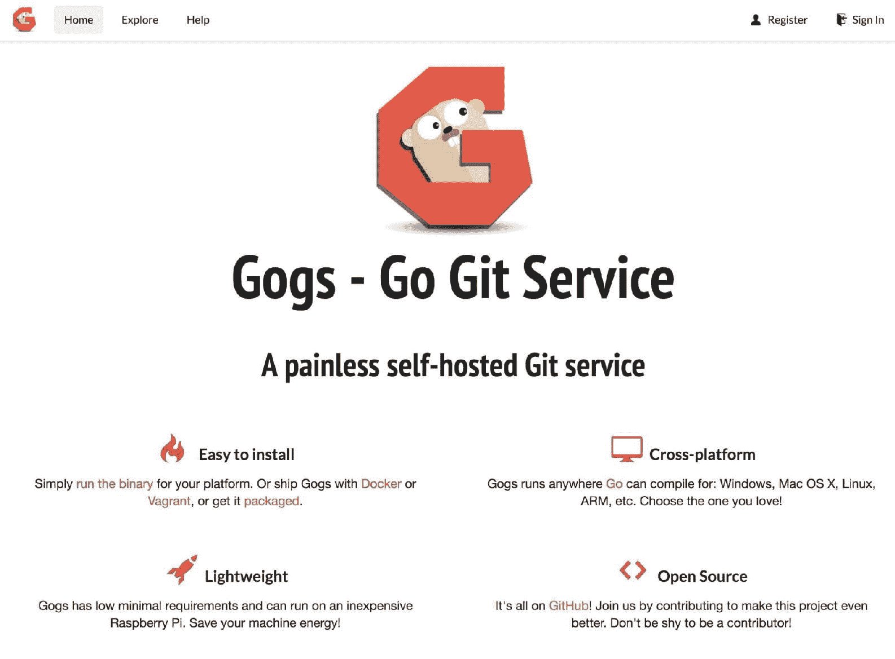

# 使用模板部署多层应用程序

之前，你已经学会了如何在 OpenShift 中运行一个独立的容器。在现实世界中，几乎所有的应用程序都是由多个相互连接的容器组成。例如，WordPress 容器需要访问一个数据库实例。OpenShift 提供了一个功能，可以将与你的应用程序相关的所有内容打包到一个对象中，这个对象叫做*模板*，并通过处理该模板一次性部署所有内容。基本的模板概念已在第九章，*高级 OpenShift 概念*中进行了解释，它与 Docker Compose 非常相似。本章将进行一个实践实验，演示如何使用 OpenShift 模板来部署应用程序。接下来的实验将详细展示如何从零开始创建一个多层应用程序。

本章将涵盖以下主题：

+   OpenShift 模板概述

+   创建自定义模板

+   使用模板部署应用程序

# 技术要求

本章没有严格的环境限制；支持任何 OpenShift 安装和开发环境：MinitShift、`oc cluster up` 或基于 Ansible 的标准生产就绪部署。你可以选择使用哪种版本。然而，本章基于在 Vagrant 中运行的 `oc cluster up`。以下 `Vagrantfile` 可用于部署实验：

```
$ cat Vagrantfile
Vagrant.configure(2) do |config| 
  config.vm.define "openshift" do |conf| 
    conf.vm.box = "centos/7" 
    conf.vm.network "private_network", ip: "172.24.0.11" 
    conf.vm.hostname = 'openshift.example.com' 
    conf.vm.network "forwarded_port", guest: 80, host: 1080
    conf.vm.network "forwarded_port", guest: 443, host: 9443
    conf.vm.network "forwarded_port", guest: 8080, host: 8080
    conf.vm.network "forwarded_port", guest: 8443, host: 8443
    conf.vm.provider "virtualbox" do |v| 
      v.memory = 4096 
      v.cpus = 2 
    end
    conf.vm.provision "shell", inline: $lab_main 
  end 
end
$lab_main = <<SCRIPT
cat <<EOF >> /etc/hosts
172.24.0.11 openshift.example.com openshift
172.24.0.12 storage.example.com storage nfs
EOF
systemctl disable firewalld
systemctl stop firewalld
yum update -y
yum install -y epel-release
yum install -y docker
cat << EOF >/etc/docker/daemon.json
{
   "insecure-registries": [
     "172.30.0.0/16"
   ]
}
EOF
systemctl restart docker
systemctl enable docker
yum -y install centos-release-openshift-origin39
yum -y install origin-clients
oc cluster up
SCRIPT
```

环境可以按如下方式部署：

```
$ vagrant up
```

一旦先前列出的 Vagrant 虚拟机部署完成，你可以按照以下方式连接到它：

```
$ vagrant ssh
$ sudo -i
#
```

最后，以 `developer` 用户身份登录，以便能够运行大多数命令：

```
# oc login -u developer
Server [https://localhost:8443]:
The server uses a certificate signed by an unknown authority.
You can bypass the certificate check, but any data you send to the server could be intercepted by others.
Use insecure connections? (y/n): y

Authentication required for https://localhost:8443 (openshift)
Username: developer
Password: <ANY PASSWORD>
Login successful.

You have one project on this server: "myproject"

Using project "myproject".
Welcome! See 'oc help' to get started.
```

我们可以使用任何密码，因为 OpenShift 默认使用 `AllowAll` 身份提供程序。

一些实验项目将需要自定义 DNS 记录，可以通过在 `/etc/hosts` 中设置记录来模拟。两种方法都可以接受。

还假设你有一个 web 浏览器，如 Mozilla Firefox 或 Google Chrome。

# OpenShift 模板概述

OpenShift 模板是一组可以参数化并处理的 API 资源，用于生成由 OpenShift 创建的对象列表。模板可以处理并创建任何所需的 OpenShift 对象（例如部署配置、构建配置等）。模板还可以定义一组要应用于模板中每个对象的标签。你可以使用 CLI 或 Web 控制台来应用模板。例如，一个模板可能包含两个 pod（一个应用程序和一个数据库）、一个服务和一个路由。模板开发完成后，你可以重复使用它。

# 模板语法

模板与任何其他 OpenShift 资源一样，可以通过原始的 YAML 或 JSON 定义来创建。一个示例如下：

```
# cat mytemplate.yaml
apiVersion: v1
kind: Template 
metadata:
  name: template1
objects: 
- apiVersion: v1
  kind: Pod
  metadata:
    name: app1
  spec:
    containers:
    - env:
      - name: SHOW_DATA
        value: ${SHOW_DATA} 
      image: example/appimage
      name: app1
      ports:
      - containerPort: 8080
        protocol: TCP
parameters: 
- description: Myapp configuration data
  name: SHOW_DATA
  required: true
labels: 
  mylabel: app1
```

上面的示例仅包含一个资源——名为 `app1` 的 pod。它还包含一个参数——`SHOW_DATA`。参数可以用于自定义应用程序部署，以适应各种使用场景。

参数也可以有以下默认值：

```
parameters: 
- description: Myapp configuration data
  name: SHOW_DATA
  required: true
  value: Example value
```

在某些情况下，我们可能希望根据某种模式生成值，如下所示：

```
parameters:
  - description: Password used for Redis authentication
    from: '[A-Z0-9]{8}'
    generate: expression
    name: REDIS_PASSWORD
```

在前面的示例中，实例化模板将生成一个随机密码，长度为八个字符，由所有大写和小写字母以及数字组成。尽管该语法与正则表达式非常相似，但它仅实现了**Perl 兼容正则表达式**（**PCRE**）的一个小子集，因此你仍然可以使用`\w`、`\d`和`\a`修饰符：

+   `[w]{10}`：这会扩展为 10 个字母字符、数字和下划线。遵循 PCRE 标准，与`[a-zA-Z0-9_]{10}`相同。

+   `[\d]{10}`：这会扩展为 10 个数字。与`[0-9]{10}`相同。

+   `[\a]{10}`：这会扩展为 10 个字母字符。与`[a-zA-Z]{10}`相同。

这个功能对于生成随机密码非常有用。

需要理解的是，参数扩展过程发生在从模板创建资源时，而不是模板本身创建时；因此，每个生成的资源都会获得其独特的值。

# 添加模板

一旦模板开发完成，它可以像任何其他 YAML 或 JSON 定义的对象一样，通过`oc create`命令添加到 OpenShift 中。通常做法是使用专门的租户来存放模板，该租户将在多个项目间共享。Red Hat **OpenShift 容器平台**（**OCP**）的默认安装在`openshift`项目中提供了许多模板。OpenShift 集群的所有用户都可以读取该项目，但只有集群管理员能够修改或创建项目中的模板。

以下示例展示了如何将模板添加到当前项目：

```
# oc create -f mytemplate.yaml
template "template1" created

# oc get template
NAME        DESCRIPTION    PARAMETERS    OBJECTS
template1                  1 (1 blank)   1
```

你需要成为`system:admin`用户才能在`openshift`租户中创建模板：

```
# oc login -u system:admin 
# oc create -f mytemplate.json -n openshift
template "template1" created

# oc get template -n openshift|grep temp
template1
```

# 显示模板参数

OpenShift 社区开发了许多有用的 OpenShift 模板，用于部署一些知名的服务。一旦确定了模板，你需要了解它接受哪些参数。

有几种方法可以列出所有参数：

+   使用`oc process --parameters`命令（这是最简单的一种）

+   在模板定义中查找`parameters`部分

在众多其他模板中，OpenShift 默认安装包含了`mariadb-persistent`模板，如下所示：

```
# oc get template mariadb-persistent -n openshift
NAME  DESCRIPTION  PARAMETERS OBJECTS
mariadb-persistent MariaDB database service, with persistent storage. For more information about... 8 (3 generated) 4
```

该模板有多个参数，列出如下：

```
# oc process --parameters -n openshift mariadb-persistent
NAME DESCRIPTION GENERATOR VALUE
...
<output omitted>
...
VOLUME_CAPACITY Volume space available for data, e.g. 512Mi, 2Gi. 1Gi
```

如果你不想将模板导入到 OpenShift 中，同样的方法也可以显示本地存储的 OpenShift 模板的参数：

```
# oc process --parameters -f mytemplate.yaml
NAME        DESCRIPTION  GENERATOR    VALUE
SHOW_DATA   Myapp configuration data
```

另一种方法是使用`oc describe`命令：

```
# oc describe template template1
Name:        template1
Namespace:    myproject
...
<output omitted>
...
Parameters:
    Name:        SHOW_DATA
    Description:    Myapp configuration data
    Required:        true
    Value:        <none>
...
<output omitted>
...
```

# 处理模板

以下是使用`oc new-app`命令从预定义模板部署应用程序的实际示例：

```
# oc new-app jenkins-persistent -p JENKINS_SERVICE_NAME=myjenkins
--> Deploying template "openshift/jenkins-persistent" to project myproject
...
<output omitted>
...
--> Creating resources ...
    route "myjenkins" created
    deploymentconfig "myjenkins" created
    serviceaccount "myjenkins" created
    rolebinding "myjenkins_edit" created
    service "jenkins-jnlp" created
    service "myjenkins" created
--> Success
...
<output omitted>
...
    Access your application via route 'myjenkins-myproject.127.0.0.1.nip.io'
    Run 'oc status' to view your app
```

在前面的示例中，我们将模板的名称作为参数传递给命令；`oc` 工具也可以从你指定的模板中构建应用程序。以下是 `oc new-app` 命令创建的对象列表：

```
# oc get all
NAME                         REVISION  DESIRED  CURRENT  TRIGGERED BY
deploymentconfigs/myjenkins  1         1         1       config,image(jenkins:latest)

NAME             HOST/PORT               PATH      SERVICES PORT   TERMINATION 
WILDCARD
routes/myjenkins myjenkins-templates.example.com myjenkins <all>    edge/Redirect 
None

NAME                      READY     STATUS    RESTARTS  AGE
po/myjenkins-1-h2mxx      1/1       Running   0         1m

NAME                      DESIRED   CURRENT   READY     AGE
rc/myjenkins-1            1         1         1         1m

NAME                      CLUSTER-IP     EXTERNAL-IP  PORT(S)    AGE
svc/jenkins-jnlp          172.30.33.180  <none>       50000/TCP  1m
svc/myjenkins             172.30.107.99  <none>       80/TCP     1m
```

这样，你可以在 OpenShift 中轻松创建一个完全功能的 Jenkins CI/CD 应用程序。

在我们继续之前，清理你的项目：

```
# oc delete all --all
deploymentconfig "myjenkins" deleted
route "myjenkins" deleted
pod "myjenkins-1-zg4km" deleted
service "jenkins-jnlp" deleted
service "myjenkins" deleted
```

# 创建自定义模板

在大多数情况下，开发人员使用 OpenShift 安装时自带的预定义模板；然而，有时这些模板并不适用于特定的情况，因此需要开发定制化的模板。在本节中，我们将向你介绍如何创建你自己的模板。

# 开发 YAML/JSON 模板定义

如果你熟悉模板布局，可能会想从头开始开发一个模板，使用标准的 YAML 或 JSON 文件。这种方法可以让你创建一个干净的模板，没有任何运行时数据。

OpenShift 的一些功能可能会加速模板开发的过程。例如，`oc explain` 允许你探索所有 OpenShift API 对象的语法，作为一种文档形式。

如果没有给定参数，`oc explain` 会列出当前版本 OpenShift 支持的所有资源类型：

```
# oc explain
You must specify the type of resource to explain. Valid resource types include:

    * all
    * buildconfigs (aka 'bc')
    * builds
    * certificatesigningrequests (aka 'csr')
    * clusterrolebindings
    * clusterroles
...
<output omitted>
...
    error: Required resource not specified.
See 'oc explain -h' for help and examples.
```

前面的命令接受资源类型作为参数，以显示其语法：

```
# oc explain svc
...
<output omitted>
...
FIELDS:
   metadata    <Object>
     Standard object's metadata. More info:
     https://git.k8s.io/community/contributors/devel/api-conventions.md#metadata
...
<output omitted>
...
```

一些 OpenShift 资源有多级结构。使用 `.`（点）作为级别分隔符，以了解此类属性的结构：

```
# oc explain svc.metadata
RESOURCE: metadata <Object>
 ...
 <output omitted>
 ...

FIELDS:
 ...
 <output omitted>
 ...

   uid    <string>
     UID is the unique in time and space value for this object. It is typically generated by the server on successful creation of a resource and is not allowed to change on PUT operations. Populated by the system. Read-only. More info: http://kubernetes.io/docs/user-guide/identifiers#uids
```

你可以在这个层次结构中进一步深入：

```
$ oc explain svc.metadata.uid
FIELD: uid <string>

DESCRIPTION:
     UID is the unique in time and space value for this object. It is typically generated by the server on successful creation of a resource and is not allowed to change on PUT operations. Populated by the system. Read-only. More info: http://kubernetes.io/docs/user-guide/identifiers#uids
```

OpenShift 的文档在这方面非常好且有帮助。

# 将现有资源导出为模板

现有的 OpenShift 资源可以通过使用 `oc export` 命令导出为模板。让我们先使用 `oc new-app` 命令创建一个运行中的应用程序。

```
$ oc new-app httpd
--> Found image 9fd201d (10 days old) in image stream "openshift/httpd" under tag "2.4" for "httpd"
...
<output omitted>
...
--> Success
    Application is not exposed. You can expose services to the outside world by executing one or more of the commands below:
     'oc expose svc/httpd'
    Run 'oc status' to view your app.

$ oc get all
NAME             READY     STATUS    RESTARTS   AGE
httpd-1-dcm2d    1/1       Running   0          2s
httpd-1-deploy   1/1       Running   0          3s
[root@openshift ~]# oc get all
NAME                      REVISION   DESIRED   CURRENT   TRIGGERED BY
deploymentconfigs/httpd   1          1         1         config,image(httpd:2.4)

NAME                 DOCKER REPO                       TAGS      UPDATED
imagestreams/httpd   172.30.1.1:5000/myproject/httpd   2.4

NAME               READY     STATUS    RESTARTS   AGE
po/httpd-1-dcm2d   1/1       Running   0          15s

NAME         DESIRED   CURRENT   READY     AGE
rc/httpd-1   1         1         1         17s

NAME        TYPE        CLUSTER-IP      EXTERNAL-IP   PORT(S)             AGE
svc/httpd   ClusterIP   172.30.18.224   <none>        8080/TCP,8443/TCP   17s

$ oc export dc,svc,route --as-template=myhttpd > myhttpd_template.yaml 
```

模板创建后，你可以查看其内容：

```
$ cat myhttpd_template.yaml | head -n 20
apiVersion: v1
kind: Template
metadata:
  creationTimestamp: null
  name: myhttpd
objects:
- apiVersion: v1
  kind: DeploymentConfig
  metadata:
    annotations:
      openshift.io/generated-by: OpenShiftNewApp
    creationTimestamp: null
    generation: 1
    labels:
      app: httpd
    name: httpd
  spec:
    replicas: 1
    revisionHistoryLimit: 10
    selector:
```

这种创建模板的方法很快；然而，你必须从模板中删除所有运行时数据。例如，所有时间戳和状态记录应该被删除。

# 使用 `oc new-app -o` 命令

默认情况下，`oc new-app` 命令会创建项目所需的所有资源。你可以修改此行为，让工具创建资源定义文件，而不是创建资源：

```
$ oc new-app httpd -o yaml | head -n 20
apiVersion: v1
items:
- apiVersion: v1
  kind: DeploymentConfig
  metadata:
    annotations:
      openshift.io/generated-by: OpenShiftNewApp
    creationTimestamp: null
    labels:
      app: httpd
    name: httpd
  spec:
    replicas: 1
    selector:
      app: httpd
      deploymentconfig: httpd
    strategy:
      resources: {}
    template:
      metadata:
```

这不会创建一个 OpenShift 模板，但它可以用来创建模板结构的骨架。

在我们继续之前，清理你的项目环境。

```
# oc delete all --all
deploymentconfig "httpd" deleted
imagestream "httpd" deleted
pod "httpd-1-dcm2d" deleted
service "httpd" deleted
```

# 使用模板部署多层应用程序

在这个实验中，我们将部署**Gogs**（Git 仓库管理软件），并使用 PostgreSQL 后端，运用我们目前为止学到的所有知识。

# Gogs 应用模板

我们将使用来自 OpenShift 演示的模板，该模板可以从[`raw.githubusercontent.com/OpenShiftDemos/gogs-openshift-docker/master/openshift/gogs-template.yaml`](https://raw.githubusercontent.com/OpenShiftDemos/gogs-openshift-docker/master/openshift/gogs-template.yaml)获取：

使用以下命令将此模板下载到本地：

```
# curl -O https://raw.githubusercontent.com/OpenShiftDemos/gogs-openshift-docker/master/openshift/gogs-template.yaml
```

根据上述输出，大多数参数都有默认值（除了`HOSTNAME`参数）。如果需要单独列出参数，可以使用以下命令：

```
# oc process --parameters -f gogs-template.yaml
NAME DESCRIPTION GENERATOR VALUE
APPLICATION_NAME The name for the application. gogs
...
 <output omitted>
... 
```

# 创建 Gogs 应用

现在我们已经创建了模板，是时候使用它了：

1.  首先，我们需要为本实验创建一个单独的项目：

```
# oc new-project gogs
Now using project "gogs" on server "https://localhost:8443".
```

1.  让我们尝试在不指定必需的`HOSTNAME`参数的情况下部署 Gogs：

```
# oc new-app -f gogs-template.yaml
error: error processing template "templats/gogs": Template.template.openshift.io "gogs" is invalid: template.parameters[1]: Required value: template.parameters[1]: parameter HOSTNAME is required and must be specified
```

OpenShift 中止了模板的处理，因为未提供`HOSTNAME`。

1.  让我们重新尝试，并设置`HOSTNAME`：

```
# oc new-app -f gogs-template.yaml -p HOSTNAME=gogs.example.com
--> Deploying template "gogs/gogs" for "gogs-template.yaml" to project gogs
...
<output omitted>
...
--> Success
    Access your application via route 'gogs.example.com'
    Run 'oc status' to view your app.
```

模板已由 OpenShift 处理。经过一段时间后，模板中指定的所有 OpenShift 对象应该被创建：

```
# oc get all
NAME DOCKER REPO TAGS        UPDATED
imagestreams/gogs 172.30.1.1:5000/gogs/gogs 0.9.97 About a minute ago

NAME REVISION DESIRED CURRENT TRIGGERED BY
deploymentconfigs/gogs 1 1 1 config,image(gogs:0.9.97)
deploymentconfigs/gogs-postgresql 1 1 1 config,image(postgresql:9.5)

NAME HOST/PORT PATH SERVICES PORT TERMINATION WILDCARD
routes/gogs gogs.example.com gogs <all> None

NAME READY STATUS RESTARTS AGE
po/gogs-1-vc5g5 1/1 Running 1 1m
po/gogs-postgresql-1-hfxlf 1/1 Running 0 1m

NAME DESIRED CURRENT READY AGE
rc/gogs-1 1 1 1 1m
rc/gogs-postgresql-1 1 1 1 1m

NAME CLUSTER-IP EXTERNAL-IP PORT(S) AGE
svc/gogs 172.30.196.109 <none> 3000/TCP 1m
svc/gogs-postgresql 172.30.196.38 <none> 5432/TCP 1m
```

路由`gogs`使用了`gogs.example.com`主机名，这是我们在实例化模板时指定的。

将 gogs.example.com 记录添加到您的 hosts 文件

```
echo "127.0.0.1 gogs.example.com" >> /etc/hosts
```

Gogs 已成功部署。为了验证它是否正常工作，我们需要通过 Web 浏览器访问 `http://gogs.example.com:1080/`



清理您的环境。

```
$ oc delete all --all
deploymentconfig "mariadb" deleted
imagestream "mariadb" deleted
pod "mariadb-1-9qcsp" deleted
service "mariadb" deleted

$ oc delete project gogs
project "gogs" deleted

$ oc project myproject
Now using project "myproject" on server "https://localhost:8443".
```

如果您打算继续进行下一章的内容，可以保持 OpenShift 集群运行，否则可以关闭或删除 vagrant 虚拟机。

# 总结

在本章中，您学习了 OpenShift 模板，包括如何编写自己的模板并从模板部署应用。

在接下来的章节中，您将学习 OpenShift 如何通过提供 Docker 构建策略简化 Docker 镜像生命周期，如果有 Dockerfile 文件，OpenShift 会自动从源代码部署应用。

# 问题

1.  以下哪个 OpenShift 项目包含默认模板？

+   1.  默认

    1.  openshift

    1.  openshift-infra

    1.  openshift-node

    1.  模板

1.  以下哪个命令可以列出`mytemplate`模板的参数？选择三项：

+   1.  `oc get template mytemplate -n openshift -o yaml`

    1.  `oc process --parameters -f mytemplate.json`

    1.  `oc describe template mytemplate -n openshift`

    1.  `oc get parameters -t mytemplate`

    1.  `oc get template mytemplate -n openshift`

    1.  `oc new-app mytemplate`

1.  以下哪种 OpenShift 实体可以通过模板创建？

+   1.  Pod

    1.  服务

    1.  路由

    1.  部署配置

    1.  以上所有

# 进一步阅读

请参考以下链接以获取进一步的阅读资料：

+   更多关于模板的信息请参见[`docs.openshift.org/latest/dev_guide/templates.html`](https://docs.openshift.org/latest/dev_guide/templates.html)。

+   加载默认的镜像流和模板，请访问[`docs.openshift.org/latest/install_config/imagestreams_templates.html`](https://docs.openshift.org/latest/install_config/imagestreams_templates.html)。
