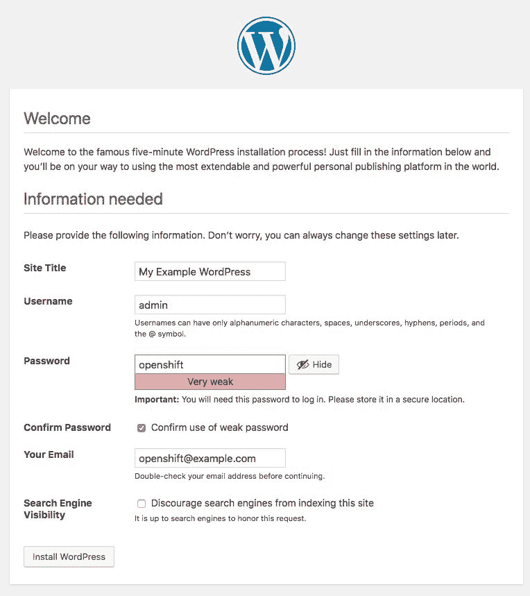
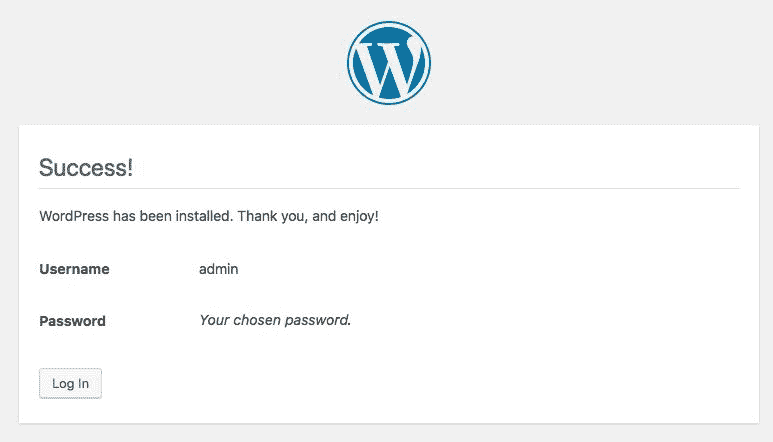
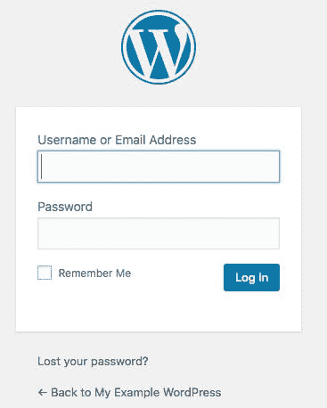
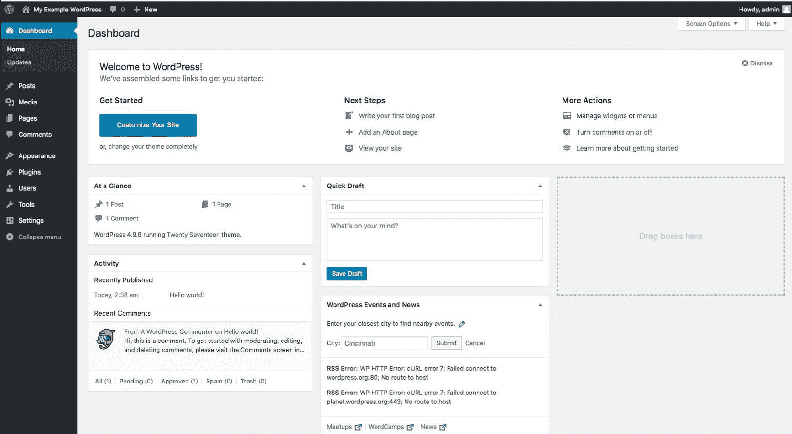

# 第十六章：从源代码构建多层应用程序

在上一章中，我们学习了什么是由 OpenShift 创建的构建实体，以及如何从源代码部署一个简单的 PHP 应用程序。我们向你展示了如何启动一个新的构建以及如何自定义构建过程。

在本章中，你将从自定义模板构建并部署一个 WordPress 应用程序。你还将学习如何使用 OpenShift 模板，了解如何创建和部署 OpenShift 模板，并从 OpenShift 模板部署应用程序。

我们将讨论的主题是构建一个多层应用程序。

# 技术要求

本章依赖于已安装的 OpenShift 环境。我们假设 OpenShift 主节点的地址是`openshift.example.com`，默认子域名是`example.com`。

一些实验项目需要自定义 DNS 记录，可以通过在`/etc/hosts`中设置记录来模拟。两种方法都是可以接受的。

本章要求你运行 minishift，为了避免在使用其他 OpenShift 部署方法时可能遇到的某些错误和重新配置，建议使用 minishift。

```
$ minishift start --openshift-version=v3.9.0 --vm-driver=virtualbox --memory 4GB ...
output truncated for brevity
...
-- Minishift VM will be configured with ...
   Memory: 4 GB
   vCPUs : 2
   Disk size: 20 GB
...
output truncated for brevity
...
OpenShift server started.

The server is accessible via web console at:
    https://192.168.99.110:8443

You are logged in as:
    User: developer
    Password: <any value>

To login as administrator:
    oc login -u system:admin
```

# 构建多层应用程序

我们之前向你解释了如何使用模板来部署简单和多层应用程序。这使得通过创建部署配置并部署多个 Pod、服务和路由来部署复杂的应用程序成为可能。但这种方法存在局限性，因为大多数多层应用程序需要从源代码构建。OpenShift 模板允许从源代码构建应用程序。本章将描述如何结合源代码构建应用程序和使用模板来部署和构建多层应用程序。这是一个实践章节，给你提供了实际示例，展示如何利用 OpenShift 模板在生产环境中部署应用程序。现在，让我们看看如何使用 MariaDB 作为数据库，从源代码构建一个 WordPress 应用程序。

# WordPress 模板

WordPress 是一个免费的开源**内容管理系统**（**CMS**），基于 PHP 和 MySQL。我们将演示使用[`github.com/openshift-evangelists/wordpress-quickstart`](https://github.com/openshift-evangelists/wordpress-quickstart)中准备的模板，通过**源代码到镜像**（**S2I**）构建过程来构建 WordPress。这个仓库包含了用于在 OpenShift 集群上部署 WordPress 的现成模板。该仓库中有两个示例模板。让我们先克隆该仓库：

```
$ git clone https://github.com/openshift-evangelists/wordpress-quickstart.git
Cloning into 'wordpress-quickstart'...
remote: Counting objects: 331, done.
remote: Total 331 (delta 0), reused 0 (delta 0), pack-reused 331
Receiving objects: 100% (331/331), 1.07 MiB | 1.96 MiB/s, done.
Resolving deltas: 100% (119/119), done.
```

我们将应用`wordpress-quickstart/templates/classic-standalone.json` WordPress 模板。为了简化，我们将模板从 JSON 格式转换为 YAML，并去除了与持久存储相关的实体。我们还移除了`APPLICATION_NAME`参数的默认值。

# 构建 WordPress 应用程序

首先，我们需要将应用程序放置到一个单独的命名空间中：

```
$ oc new-project wp
Now using project "wp" on server "https://openshift.example.com:8443".
```

首先，由于这是我们使用的新模板，我们希望收集一些关于可用参数的信息。正如之前所描述的，`oc process --parameters`可以提供帮助：

```
$ oc process --parameters -f  wordpress-quickstart/templates/classic-standalone.json 
NAME DESCRIPTION GENERATOR VALUE
APPLICATION_NAME The name of the WordPress instance.
QUICKSTART_REPOSITORY_URL The URL of the quickstart Git repository. https://github.com/openshift-evangelists/wordpress-quickstart
WORDPRESS_DEPLOYMENT_STRATEGY Type of the deployment strategy for Wordpress. Recreate
WORDPRESS_MEMORY_LIMIT Amount of memory available to WordPress. 512Mi
DATABASE_MEMORY_LIMIT Amount of memory available to the database. 512Mi
DATABASE_USERNAME The name of the database user. expression user[a-f0-9]{8}
DATABASE_PASSWORD The password for the database user. expression [a-zA-Z0-9]{12}
MYSQL_VERSION The version of the MySQL database. 5.7
PHP_VERSION The version of the PHP builder. 7.0
```

请注意，只有`APPLICATION_NAME`没有默认值。

让我们通过实例化模板并设置`APPLICATION_NAME=wordpress`来从源代码构建应用程序：

```
$ oc new-app -f wordpress-quickstart/templates/classic-standalone.json -p APPLICATION_NAME=wordpress
--> Deploying template "wp/wordpress-classic-standalone" for "wordpress.yaml" to project wp
...
<output omitted>
...
--> Success
    Build scheduled, use 'oc logs -f bc/wordpress' to track its progress.
    Access your application via route 'wordpress-wp.apps.kropachev.pro'
    Run 'oc status' to view your app.
```

你可能需要查看 WordPress 应用程序的构建日志：

```
$ oc logs bc/wordpress -f
Cloning "https://github.com/openshift-evangelists/wordpress-quickstart" ...
  Commit: 0f5076fbb3c898b77b820571fa30d1293c3ac33b (Update README with details on how to enable WebDav access.)
...
<output omitted>
...
Pushed 9/10 layers, 96% complete
Pushed 10/10 layers, 100% complete
Push successful
```

过了一段时间，所有 WordPress pod 都将启动并运行，如下所示：

```
$ oc get pod
NAME READY STATUS RESTARTS AGE
wordpress-1-build 0/1 Completed 0 2m
wordpress-1-zjfs2 1/1 Running 0 51s
wordpress-db-1-9mxgb 1/1 Running 0 2m
```

这表示我们的应用程序现在应该可以正常工作。让我们看看它通过什么 URL 被暴露出来，并尝试通过 Web 浏览器访问：

```
$ oc get route
NAME HOST/PORT PATH SERVICES PORT TERMINATION WILDCARD
wordpress wordpress-wp.127.0.0.1.nip.io wordpress 8080 edge/Allow None
```

一旦你打开浏览器并访问`http://wordpress-wp.127.0.0.1.nip.io/`，WordPress 应用程序应该会显示一个配置页面。选择你喜欢的语言并点击`继续`，在下一页面中，按照此处所示填写字段，然后点击`安装 WordPress`。



下一窗口显示安装状态：



一旦你点击*登录*按钮，下面的页面将会显示：



你只需要输入在设置阶段提供的用户名和密码。此时，你应该看到 WordPress 工作空间：



这表示一切配置正确。

使用以下代码清理一切，为下一个实验做准备：

```
$ oc delete all --all deploymentconfig "wordpress" deleted
deploymentconfig "wordpress-db" deleted
buildconfig "wordpress" deleted
imagestream "wordpress-img" deleted
route "wordpress" deleted
pod "wordpress-1-tnvhl" deleted
pod "wordpress-db-1-pdsbb" deleted
service "wordpress" deleted
service "wordpress-db" deleted

$ oc delete project wp
project "wp" deleted

$ oc project myproject
Now using project "myproject" on server "https://127.0.0.1:8443".
```

如果今天的实验已经结束，你也可以通过运行`minishift destroy`命令删除你的 minishift 虚拟机，或者保持 minishift 运行并继续进行下一章。

# 总结

在这一章中，我们学习了如何从自定义模板构建和部署 WordPress 应用程序。你学习了如何使用 OpenShift 模板，如何创建和部署 OpenShift 模板，以及如何从 OpenShift 模板部署应用程序。

下一章将向读者介绍 CI/CD、Jenkins、OpenShift 管道，以及 Jenkins 与 OpenShift 的集成。我们将展示如何在 OpenShift 中创建示例 CI/CD 管道、编辑管道以及管理管道执行。

# 问题

1.  以下哪个 OpenShift 实体控制构建过程（选择一个）：

    1.  buildconfig

    1.  部署配置

    1.  副本控制器

    1.  service

    1.  pod

    1.  route

1.  以下哪个 OpenShift 实体可以使用模板创建（选择一个）：

    1.  pod

    1.  service

    1.  route

    1.  部署配置

    1.  buildconfig

    1.  上述所有内容
