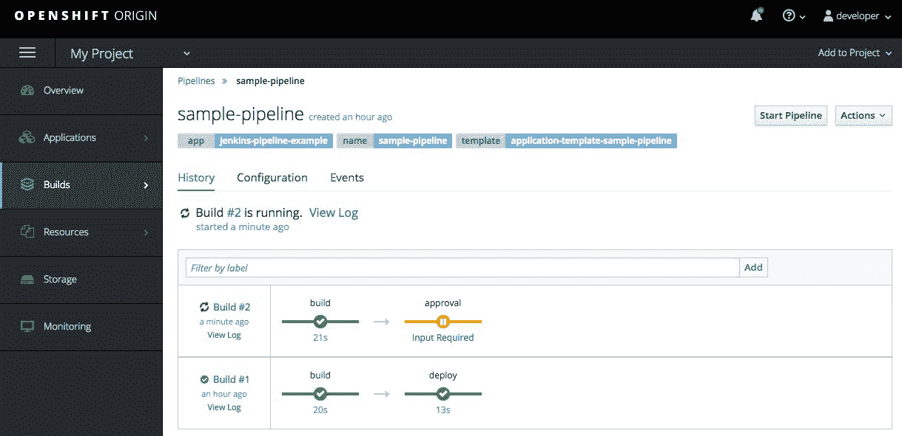

# OpenShift 中的 CI/CD 流水线

在上一章中，你学习了如何从自定义模板构建和部署 WordPress 应用程序。你还学习了如何创建和部署 OpenShift 模板，以及如何从 OpenShift 模板部署应用程序。

本章将向读者介绍**持续集成/持续交付**（**CI/CD**）、Jenkins、OpenShift 流水线以及 Jenkins 与 OpenShift 的集成。我们将讨论 CI/CD、流水线以及作为 CI/CD 的 Jenkins，随后介绍 Jenkins 在 OpenShift 中的工作方式。我们还将向你展示如何在 OpenShift 中创建一个示例 CI/CD 流水线，如何编辑流水线，以及如何管理流水线执行。

阅读完本章后，你将了解以下内容：

+   CI/CD 和 CI/CD 流水线

+   Jenkins 作为 CI/CD

+   OpenShift 中的 Jenkins

# 技术要求

在本章中，我们将使用以下技术和软件：

+   命令行界面

+   Minishift

+   GitHub

+   Web 浏览器

Vagrant 安装以及我们将在本章中使用的所有代码都可以在 GitHub 上找到，地址为[`github.com/PacktPublishing/Learn-OpenShift`](https://github.com/PacktPublishing/Learn-OpenShift)。

你可以使用 Firefox 或其他任何浏览器浏览 Docker Hub。

作为前提，你需要确保你的笔记本电脑有稳定的互联网连接。

在本章中，我们将使用 Minishift 作为实验环境。在开始之前，请删除现有的 Minishift 虚拟机（如果有的话），因为我们需要创建一个新的虚拟机，具有非标准参数：

```
$ minishift start --openshift-version=v3.9.0 --vm-driver=virtualbox --memory 4GB
...
output truncated for brevity
...
-- Minishift VM will be configured with ...
 Memory: 4 GB
   vCPUs : 2
   Disk size: 20 GB
...
output truncated for brevity
...
OpenShift server started.

The server is accessible via web console at:
 https://192.168.99.110:8443

You are logged in as:
    User: developer
    Password: <any value>

To login as administrator:
    oc login -u system:admin
```

确保`Memory`至少显示为 4 GB，否则可能没有足够的内存来进行实验。你也可以通过停止 Minishift 虚拟机并通过 VirtualBox 控制台调整内存大小。但最安全的方法是删除现有的 Minishift 虚拟机并创建一个新的。

# CI/CD 和 CI/CD 流水线

你可能已经听说过**CI/CD**这个术语。它包含了人们在谈论现代应用程序部署时使用的两个主要缩写。CI 代表**持续集成**，而 CD 有两种含义：一种是**持续部署**，另一种是**持续交付**。这三个术语都很容易理解，具体说明如下：

+   **持续集成**：强调为应用程序构建创建和构建自动化测试，并尽可能频繁地将更新合并到单一分支中。它有助于尽早捕捉错误，避免开发人员在开发新代码并将更改合并到不同分支时遇到的集成困难。

+   **持续交付**：帮助扩展持续集成流程，将新代码从开发阶段推送到生产阶段，并以可复制的方式进行。这意味着，如果在持续集成中自动化了构建和测试，那么持续交付会自动化应用程序发布过程，通常会使用审批程序。

+   **持续部署**：进一步扩展持续交付，通过提供一个无缝且不中断的应用程序交付过程，且无需人工干预。这种应用部署方式需要大量努力来确保运行代码时不会破坏任何东西，并且能按预期工作。

CI 和 CD 过程被分成一系列步骤和程序，形成一个**流水线**，通常称为 CI/CD 流水线。下图展示了持续集成与持续交付和持续部署的关系：


CI/CD 流水线示例

流水线的各个阶段并不严格，但遵循最佳实践有助于使您的 CI/CD 流水线更加稳定和可重复。

有许多 CI/CD 工具可以帮助您自动化应用交付过程，但其中一个在业界最受欢迎的工具叫做 Jenkins。恰好 OpenShift 内建了与 Jenkins 的集成，我们将在接下来的章节中讨论这一点。

# Jenkins 作为 CI/CD

Jenkins 是一个开源自动化工具，可用于通过 CI/CD 流水线加速应用程序开发过程。Jenkins 控制和管理应用程序开发生命周期过程，包括构建、测试、发布、阶段部署和冒烟测试等过程。

标准的 Jenkins 架构如下图所示：


Jenkins 架构

Jenkins 架构中有两个主要组件：

+   **Jenkins 主节点**：您的 CI/CD 控制器，负责处理各种任务，例如：

    +   任务调度

    +   在 Jenkins 从属节点之间分配工作负载

    +   Jenkins 从属节点监控

    +   日志记录和展示任务结果

+   **Jenkins 从属节点**：一组基于 Java 的程序，运行在远程主机上。Jenkins 从属节点主要执行来自 Jenkins 主节点的指令。

Jenkins 主节点和 Jenkins 从属节点是功能上的区分，这意味着它们可以共存在同一主机上。在小型或实验室环境中，通常没有问题将 Jenkins 主节点和 Jenkins 从属节点都运行在同一主机上，但如果您的环境中有数百（或数千）个任务运行，那么将 Jenkins 主节点和 Jenkins 从属节点分布在不同节点上，并拥有多个 Jenkins 从属节点来分配负载是更合理的。

# OpenShift 中的 Jenkins

OpenShift 利用 Jenkins CI/CD 模型，并通过以下组件的组合对其进行扩展：

+   **OpenShift 领域特定语言（DSL）**：DSL 由运行在 Jenkins 主节点 Pod 上的 OpenShift Jenkins 客户端插件提供，并与 OpenShift API 服务器交互。OpenShift DSL 提供了一种控制应用程序生命周期的方法。

+   **Jenkins 流水线构建策略**：类似于其他 OpenShift 构建策略，它定义了构建的工作流。Jenkins 流水线构建策略允许开发人员创建一个由 OpenShift 监控和控制的 Jenkins 流水线。

+   **Jenkinsfile**：通过一系列步骤定义 CI/CD 流水线，应用于在 OpenShift 中部署应用程序，使用 Apache Groovy 编程语言。

# 在 OpenShift 中创建 Jenkins 流水线

一旦 Minishift 集群启动，打开你喜欢的网页浏览器，使用 `minishift start` 命令输出的 URL 访问 OpenShift。我们这边可以通过 `https://192.168.99.110:8443` 访问：


OpenShift 登录页面

使用开发者用户，输入任意密码，登录欢迎页面：


OpenShift 欢迎页面

点击“My Project”以访问 OpenShift 项目概览页面。从那里，点击“Builds | Pipelines”子菜单：


从这里，你应该能够点击“创建示例流水线”。然后，向下滚动到底部，点击“创建”按钮。它应该会告诉你`Pipeline Build Example`已创建：


OpenShift 创建了一组包括 Jenkins、mongodb 和 nodejs 的 Pod，并进一步与 OpenShift 集成。所有这些都只需要点击一下。这只是一个演示，但这不是很酷吗？现在返回到概览菜单检查整体进度：


OpenShift 项目菜单

你应该能够看到一些应用程序以及相关的 Pod。第一个是 Jenkins 应用程序，第二个是 MongoDB，作为我们测试应用的一部分。`nodejs-mongodb-example` 应该没有部署，因为它将由 Jenkins 流水线控制。

根据你的网络连接情况，拉取所有镜像并启动所有 Pod 可能需要一些时间，尤其是 Jenkins，因为它大约有 2.5 GB。你可以转到“监控”标签并点击“查看详情”来检查整体进度的当前状态。如果 Jenkins 最后的消息是拉取镜像 openshift/jenkins-2-centos7，那么请耐心等待，或者去泡杯咖啡。

# 启动 Jenkins 流水线

一旦 Jenkins 和 MongoDB Pod 启动完毕，返回到“Builds | Pipelines”子菜单：


点击“启动流水线”按钮。这将触发一个 CI/CD 流水线，开始构建。根据你的网络连接情况，这一步可能需要一些时间才能完成；完成后，你应该能够看到两个阶段成功完成：


点击“查看日志”应该会打开一个新标签，显示 Jenkins 登录页面的 Jenkins 控制台输出：


Jenkins 登录页面

点击“使用 OpenShift 登录”，并使用你在 OpenShift 中认证时使用的相同凭证（使用开发者用户，输入任意密码）：


Jenkins 用户授权

你需要授权开发者用户访问 Jenkins，点击“允许所选权限”。这将带你进入 Jenkins 控制台输出：


Jenkins 控制台输出

向下滚动查看完整日志，关闭实验并返回 OpenShift 标签。

如果您对 Jenkins 的工作原理感兴趣并想深入了解，可以查看本章 *Further reading* 部分中的链接。

我们之前提到过，持续交付（Continuous Delivery）和持续部署（Continuous Deployment）模型之间是有区别的；其中一个模型包含人工干预，另一个则不包含。

接下来，我们将修改我们的测试管道并添加一个审批步骤。请返回管道子菜单：


点击 Edit Pipeline 应该会将我们重定向到编辑我们的第一个管道。

# 编辑 Jenkinsfile

您应该能看到 Jenkins 管道配置文件 Jenkinsfile，如下图所示：


编辑管道

Jenkins 使用 Apache Groovy 编程语言。它非常容易学习，我们不会深入讨论细节；相反，我们会提供一些基本技能。您可以在 *Further reading* 部分找到有关 Groovy 的更多信息。

我们只需添加一个新的阶段，名称可以自定义；我们称其为 `approval` 阶段，位于 `build` 阶段和 `deploy` 阶段之间。这个新的 `approval` 阶段将暂停部署阶段，直到您手动批准：

```
...
node('nodejs') {
 stage('build') {
 openshiftBuild(buildConfig: 'nodejs-mongodb-example', showBuildLogs: 'true')
 }
 stage('approval') {
 input "Approve moving to deploy stage?"
 }
 stage('deploy') {
 openshiftDeploy(deploymentConfig: 'nodejs-mongodb-example')
 }
}
...
```

点击 Save 并启动管道。

# 管理管道执行

添加一个名为 *approval* 的新阶段会触发第二次构建的开始，最终您应该能够看到新的审批阶段，并显示“Input Required”：



点击“Input Required”将打开一个新标签页并将您重定向到 Jenkins 审批阶段，询问：是否批准迁移到部署阶段？如下所示：


结果将根据您的回答而有所不同。在我们的案例中，我们将按下 Proceed 按钮。这将把我们重定向到 Jenkins 控制台输出，但我们可以直接关闭它并返回到 OpenShift 管道标签页。从以下截图中，我们可以看到 CI/CD 管道已经完成了部署阶段，现在我们有了三个阶段，而不是 `Build #1` 中的两个阶段。


结果，您应该能在 Overview 菜单中看到一个 `nodejs-mongodb-example, #2` 的 pod 正在运行。`#2` 表示这是第二次构建：


Jenkins 远比这复杂，但这应该为您提供了 OpenShift 中 CI/CD 的概述，以及在 OpenShift 中启动 Jenkins 的简易性。

您现在可以停止并删除运行 `minishift delete` 命令的 minishift 虚拟机，除非您打算做更多练习。

# 总结

在本章中，我们向您介绍了 CI/CD、Jenkins、OpenShift 管道以及 Jenkins 与 OpenShift 的集成。我们展示了如何在 OpenShift 中创建一个示例 CI/CD 管道，如何编辑管道，以及如何管理管道执行。

在下一章中，我们将简要讨论 HA 的基本知识，然后重点讲解 OpenShift HA。我们将讨论 OpenShift 如何在发生故障时提供冗余，以及如何通过正确设计 OpenShift 集群来防止这种情况发生。章节结束时，我们将讨论如何备份和恢复 OpenShift 集群数据，以防万一出现问题。

# 问题

1.  哪种 CI/CD 方法允许你在没有人工干预的情况下自动化应用交付过程？请选择一个：

    1.  持续交付

    1.  持续部署

    1.  持续集成

    1.  持续自动化

1.  OpenShift 使用的三个 CI/CD 流水线组件是哪三个？请选择三个：

    1.  OpenShift 领域特定语言

    1.  Jenkins 流水线构建策略

    1.  Jenkins Java 连接器

    1.  Jenkinsfile

    1.  Jenkins 构建策略

1.  你必须手动配置 OpenShift 认证，才能使用 Jenkins 中的 OpenShift 流水线：

    1.  正确

    1.  错误

1.  在 Jenkinsfile 中，哪个命令允许你实现手动审批过程？请选择一个：

    1.  输入

    1.  保留

    1.  批准

    1.  接受

1.  OpenShift GUI 中的哪个菜单项可以带你进入 OpenShift 流水线页面？请选择一个：

    1.  构建 | 流水线

    1.  Jenkins | 流水线

    1.  构建 | Jenkins

    1.  概述

1.  Jenkinsfile 中的 CI/CD 流水线阶段是预定义的，无法更改：

    1.  正确

    1.  错误

# 深入阅读

本章简要介绍了有关 CI/CD 的多个不同话题。以下链接可以帮助你深入了解你可能感兴趣的主题：

+   **CI/CD 概述**: [`www.atlassian.com/continuous-delivery/ci-vs-ci-vs-cd`](https://www.atlassian.com/continuous-delivery/ci-vs-ci-vs-cd)

+   **Apache Groovy 文档**: [`groovy-lang.org/syntax.html`](http://groovy-lang.org/syntax.html)

+   **OpenShift 流水线**: [`docs.openshift.com/container-platform/latest/dev_guide/openshift_pipeline.html`](https://docs.openshift.com/container-platform/latest/dev_guide/openshift_pipeline.html)

+   **OpenShift Jenkins DSL 插件文档**: [`github.com/openshift/jenkins-client-plugin`](https://github.com/openshift/jenkins-client-plugin)

+   **Jenkinsfile 文档**: [`jenkins.io/doc/book/pipeline/jenkinsfile/`](https://jenkins.io/doc/book/pipeline/jenkinsfile/)
