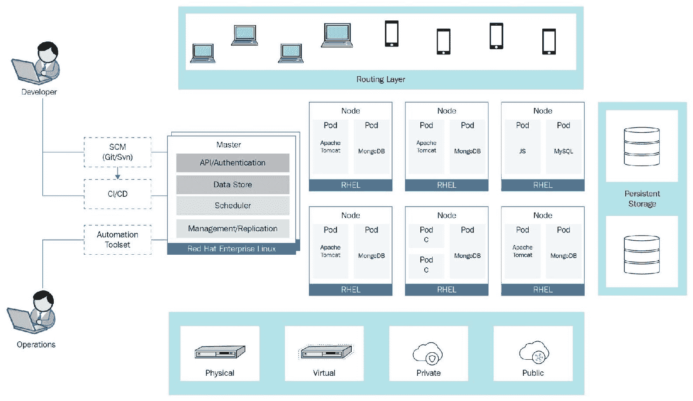
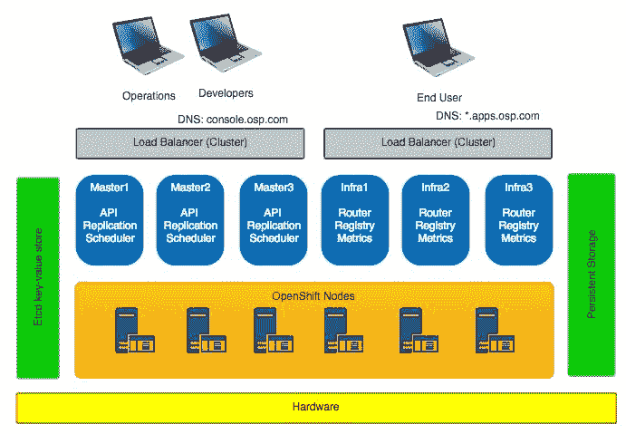
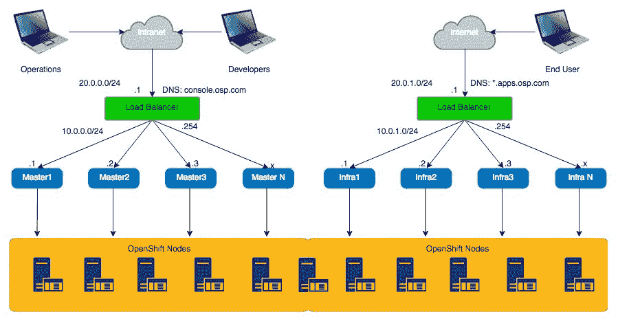
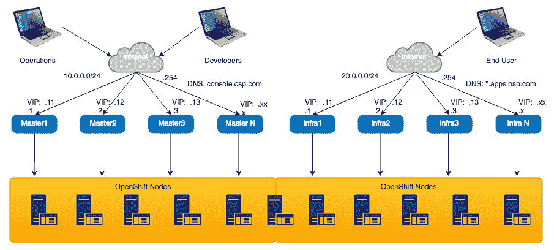
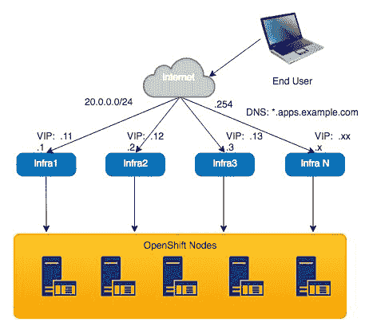

# OpenShift 高可用性架构概述

在上一章中，我们介绍了 CI/CD、Jenkins、OpenShift 管道以及 Jenkins 与 OpenShift 的集成。我们还演示了如何在 OpenShift 中创建一个示例 CI/CD 管道，如何编辑管道以及如何管理管道执行。

在这一章中，我们将简要介绍**高可用性**（**HA**）的一般概念，然后专注于 OpenShift HA。我们将讨论 OpenShift 如何在发生故障时提供冗余，并讨论如何通过正确设计你的 OpenShift 集群来避免故障发生。在本章结束时，我们将讨论如何在出现问题时备份和恢复 OpenShift 集群数据。

在本章中，我们将覆盖以下主题：

+   什么是高可用性？

+   OpenShift 中的高可用性（HA）

+   OpenShift 备份与恢复

# 什么是高可用性？

在涉及真实客户和真实金钱时，高可用性是一个非常重要的话题。我们每个人都为不同的企业工作，而任何企业最不希望发生的事情就是出现停机。这是一个可能导致员工失业和公司破产的问题。这样的事情已经发生过，并且会继续发生。但如果你正确地规划 HA 设计并以正确的方式实施，你将有更好的机会保住工作，并维护公司良好的声誉。

高可用性通常指的是一种策略或概念，旨在使系统保持长时间运行。这就是*高*和*可用性*这两个术语结合的地方。当人们问，*它支持 HA 吗？*时，他们通常是在问系统是否具备冗余能力，并且在出现故障时是否能够持续运行。为了提供 HA，系统的每一个组件都需要具备容错能力，所有下层和上层组件及协议都必须具有高可用性。例如，如果你设计并实施了 OpenShift HA 模式，但你的网络存在单点故障，那么你的应用程序将停止工作。因此，正确规划是至关重要的，确保无论故障发生在哪里，你的应用程序都能持续运行。

# OpenShift 中的高可用性（HA）

在之前的章节中，我们将应用程序运行在单个节点，或者有时是在两个节点上。有些人可能会说，如果集群中有超过一个 OpenShift 节点，那就算是冗余配置，但这远非事实。

如果我们比较标准的 OpenShift 架构和 OpenShift HA，你会看到它们之间的一些差异：

OpenShift 经典架构

在这里，我们有节点、主控、存储和由 infra 节点组成的路由层。OpenShift HA 架构非常相似，但有一个明显的区别——在路由层，我们有负载均衡器，使得整体解决方案始终可访问。所有其他组件天生是冗余的：

OpenShift 高可用性架构

# 虚拟 IP

我们可以看到，在 OpenShift 高可用性中，我们使用了所谓的企业级负载均衡器，并配置了两个**虚拟 IP（VIPs）**。我们需要一个 VIP 用于主节点的流量，另一个 VIP 用于实际的 OpenShift 应用程序流量，这些应用程序运行在 OpenShift 节点内的 Pod 中：

配备外部负载均衡器的 OpenShift

为什么不能只使用 DNS 负载均衡呢？原因是，如果我们使用 DNS 负载均衡，且某个 master 或节点发生故障，仍然会有一部分流量流向故障节点。负载均衡可以实现健康检查，停止将流量路由到故障端点。例如，如果其中一个 infra 节点发生故障，负载均衡器会检测到故障，移除该节点的服务器池，并停止向该节点发送流量。当该节点恢复时，负载均衡器会检测到这一点，并开始将流量分配到该节点。因此，拥有 VIP（虚拟 IP）对 OpenShift 外部高可用性至关重要。

| **节点名称** | **物理 IP 地址** | **虚拟 IP 地址** | **DNS** |
| --- | --- | --- | --- |
| `Infra1` | `10.0.0.1/24` | `10.0.0.11` | `*.apps.osp.com` |
| `Infra2` | `10.0.0.2/24` | `10.0.0.11` | `*.apps.osp.com` |
| `Infra3` | `10.0.0.3/24` | `10.0.0.11` | `*.apps.osp.com` |
| `Master1` | `10.0.1.4/24` | `10.0.0.14` | `console.osp.com` |
| `Master2` | `10.0.1.5/24` | `10.0.0.14` | `console.osp.com` |
| `Master3` | `10.0.1.6/24` | `10.0.0.14` | `console.osp.com` |

使用外部负载均衡器是构建 OpenShift 高可用性的理想选择，因为外部负载均衡器能够自动检测任何 OpenShift infra 或 master 节点的故障，并将负载分配到其他可用的节点上。

假设我们有三个 infra 节点，每个节点的流量处理速度为 50 Mbps。如果 `Infra1` 节点发生故障，外部负载均衡器会自动检测到故障，并停止向 `Infra1` 节点提供流量。因此，无论是最终用户还是应用程序都不会出现停机时间，负载均衡器会自动将负载分配到 `Infra2` 和 `Infra3`，这样两个节点的流量处理速度都会提升至 75 Mbps。

这种方案的缺点是，我们必须使用外部负载均衡器，确保它们的高可用性，实施额外的健康检查，并进行进一步的配置。此外，如果使用 F5 或 A10 等商业负载均衡设备，它们的成本也非常高。然而，这仍然是确保 OpenShift 集群始终能够从外部访问的最具扩展性的解决方案。

# IP 故障转移

确保你的 OpenShift 应用程序始终可以从外部访问的另一种方式是实现 IP 故障转移机制。当没有外部负载均衡器时，但你仍希望 OpenShift 始终能够从外部访问时，这种方法非常有用。OpenShift 的 IP 故障转移设计主要依赖于两种不同的技术：

+   **Keepalived**: 提供 OpenShift infra 节点之间的 VIP 高可用性。

+   **DNS**: 管理外部流量负载均衡。

OpenShift DNS 和 keepalived

在我们的示例中，keepalived 分别管理主节点和基础设施节点上的多个 VIP。使用两个 DNS 映射来负载均衡 OpenShift infra 节点和主节点之间的流量：

| **节点名称** | **物理 IP 地址** | **虚拟 IP 地址** | **DNS** |
| --- | --- | --- | --- |
| `Infra1` | `10.0.0.1/24` | `10.0.0.11` | `*.apps.osp.com` |
| `Infra2` | `10.0.0.2/24` | `10.0.0.12` | `*.apps.osp.com` |
| `Infra3` | `10.0.0.3/24` | `10.0.0.13` | `*.apps.osp.com` |
| `Master1` | `20.0.0.1/24` | `20.0.0.11` | `console.osp.com` |
| `Master2` | `20.0.0.2/24` | `20.0.0.12` | `console.osp.com` |
| `Master3` | `20.0.0.3/24` | `20.0.0.13` | `console.osp.com` |

在前面的示例中，我们不需要外部负载均衡器，如果其中一个 OpenShift 节点出现故障，虚拟 IP 会自动转移到另一个节点。根据我们配置的抢占选项，虚拟 IP 可能会在故障的 infra 节点恢复后重新回到该节点。

这个解决方案有一个缺点，这个缺点对于你的特定情况可能是关键，也可能不是。假设我们有三个 infra 节点，每个节点的流量处理速度为 50 Mbps。如果其中一个节点发生故障，那么来自 `Infra1` 的 VIP 会被转移到 `Infra2`。对最终用户或应用程序来说，不会有中断，但 `Infra2` 将以 100 Mbps 的速度处理流量，而 `Infra3` 仍然以 50 Mbps 的速度处理流量。

当工作负载不太高时，这是可以的，但如果流量过大，可能会通过过载 `Infra2` 引发问题。因此，你必须排查所有可能的场景；通过解决一个特定的故障场景，你可能会创造一个新的问题。

还有其他方法可以让你的 OpenShift 集群在外部可用。讨论像 DNS LB、GSLB、自定义脚本甚至手动切换等方法，可能会让这本书扩展到一千页。我们专注于那些经过验证并且 OpenShift 支持的方法。

# OpenShift 基础设施节点

OpenShift 基础设施节点默认标记为 infra。它们运行两个主要的 OpenShift 组件：

+   OpenShift 内部注册表

+   OpenShift 路由器

OpenShift 基础设施节点最容易安装、操作和排除故障，因为 OpenShift 基础设施节点的结构简单、稳定且可预测。基础设施节点通常以高可用模式安装，是 OpenShift 初始安装的一部分；它们很少被修改。你唯一可能直接处理基础设施节点的情况是当大量流量通过基础设施节点时，而它们无法处理这些流量。

但是，当你遇到这种情况时，你将面临比仅仅扩展 infra 节点数量更严重的问题：

OpenShift infra 节点

最佳实践是安装至少三个基础设施节点，并为注册表和路由器启用 Pod 反亲和性特性。你需要启用反亲和性功能，因为如果你丢失了一个基础设施节点，并且新的路由器 Pod 启动在已经运行 OpenShift 路由器的节点上，你就会遇到问题。如果你只有两个基础设施节点，并且没有启用 Pod 反亲和性功能，在发生故障时，两个路由器和两个注册表可能会运行在同一个基础设施节点上，并监听相同的端口。Pod 反亲和性规则防止一个 Pod 与另一个 Pod 在同一主机上运行，从而避免两个注册表（或两个路由器）在同一个 OpenShift 基础设施节点上运行。

# OpenShift 主节点

OpenShift 主节点是控制平面节点，是 OpenShift 解决方案的核心控制点。在早期版本中，你需要使用 Pacemaker 安装 OpenShift 主节点（以提供故障转移），但在最新版本中，这由 keepalived 和外部存储来处理。如果你的 OpenShift 主节点完全故障，你可以直接删除该节点并重新安装。

为了从 OpenShift 集群中移除一个节点，你可以使用 `oc delete node` 命令，然后从 `openshift-ansible` Git 项目中运行 `scaleup.yml`。

`openshift-ansible` 项目可在 [`github.com/openshift/openshift-ansible`](https://github.com/openshift/openshift-ansible) 上找到。

`scaleup.yml` 文件位于 `openshift-ansible/playbooks/byo/openshift-node/scaleup.yml`，当你下载了 `openshift-ansible` 项目后可以找到该文件。

你需要调整你的 Ansible 库存文件，并在 `[new_masters]` 部分添加一个新节点。

如果在某些时候，你失去了所有 OpenShift 主节点，它不会影响最终用户，客户与应用程序之间的流量将继续流动；但是，你将无法对 OpenShift 集群进行任何新的更改。到那时，除了从最后的备份恢复 OpenShift 主节点外，你几乎无能为力。我们将在本章稍后讨论 OpenShift 的备份和恢复。

# OpenShift etcd

OpenShift etcd 键值存储是 OpenShift 中最关键和最敏感的组件，因为所有 OpenShift 主节点的持久数据都保存在 etcd 集群中。好消息是，etcd 本身支持主动/主动配置，并且在初始安装时就会安装。你需要正确设计你的 etcd 集群，以避免出现需要重新安装 etcd 来应对更大负载的情况。一般建议将 etcd 集群安装并配置在专用节点上，与 OpenShift 主节点分开，并且节点数量为三、五或七个。

OpenShift 将所有配置数据保存在 etcd 键值存储中，因此定期备份你的 etcd 非常重要——在某些时候，你将需要恢复它。

# OpenShift 节点

在高可用性方面，OpenShift 节点最容易处理。由于 OpenShift Pod 本质上是无状态的，因此我们不需要直接处理 OpenShift 节点的高可用性；我们只需确保应用程序 Pod 在不同的 OpenShift 节点上运行，这样如果某个 OpenShift 节点发生故障，最终用户就不会有停机时间，且复制控制器会启动一个新的应用程序 Pod。如果 OpenShift 节点完全故障，您只需删除该节点并重新安装它。

为了从 OpenShift 集群中移除节点，您可以使用 `oc delete node` 命令，然后从 `openshift-ansible` Git 项目中运行 `scaleup.yml`。

`openshift-ansible` 项目可在 [`github.com/openshift/openshift-ansible`](https://github.com/openshift/openshift-ansible) 上找到。

`scaleup.yml` 文件位于 `openshift-ansible/playbooks/byo/openshift-node/scaleup.yml`，一旦您下载了 `openshift-ansible` 项目。

您需要调整 Ansible 库存文件，并在 `[new_nodes]` 部分添加新节点。

无需备份 OpenShift 节点上的任何数据，因为节点上没有状态数据。在大多数情况下，您将希望从 OpenShift 集群中删除 OpenShift 节点，重新安装它，并让它重新投入使用，焕然一新。

# OpenShift 持久数据的外部存储

OpenShift 持久数据的外部存储配置和设计超出了本书的范围，但有一些常规建议是确保外部存储具备冗余和可扩展性，这意味着如果某些组件发生故障，整体存储性能不会受到影响，并且 OpenShift 总是可以访问该存储。

您需要单独处理定期的外部存储备份和恢复程序，并且需要有一个经过测试和验证的程序，以防丢失持久存储数据。

# OpenShift 备份和恢复

无论您做什么，OpenShift 集群总会有出现问题的时刻，可能会丢失部分（或全部）数据。这就是为什么您需要知道何时以及如何进行 OpenShift 备份，以及如何将 OpenShift 恢复到正常运行状态。OpenShift 安装过程包括以下需要备份的组件：

+   Etcd 键值存储数据

+   主节点配置数据

+   Ansible 主机安装剧本

+   Pod 数据

+   注册表数据

+   项目配置数据

+   另外安装的软件

根据故障情况，您可能需要重新安装整个 OpenShift 集群，或者单独重新安装某些组件。在大多数情况下，您需要完全重新安装 OpenShift 集群。

# Etcd 键值存储备份

etcd 备份过程可以在任何 etcd 节点上执行，步骤如下：

1.  停止 etcd 服务：`systemctl stop etcd`

1.  创建 etcd 备份：`etcdctl backup --data-dir /var/lib/etcd --backup-dir ~/etcd.back`

1.  复制 etcd `db` 文件：`cp /var/lib/etcd/member/snap/db ~/etcd/member/snap/db`

1.  启动 etcd 服务：`systemctl start etcd`

etcd 键值存储恢复过程在 etcd 节点上执行，步骤如下：

1.  创建单节点集群

1.  在 etcd 不运行时，从备份中恢复数据到`/var/lib/etcd/`目录

1.  从备份中恢复`/etc/etcd/etcd.conf`文件

1.  重启 etcd

1.  向 etcd 集群添加新节点

# OpenShift 主节点

OpenShift 主节点备份过程可以在所有主节点上执行，步骤如下：

1.  **备份主证书和密钥**：`cd /etc/origin/master; tar cf /tmp/certs-and-keys-$(hostname).tar *.key *.crt`

1.  **备份注册证书**：`cd /etc/docker/certs.d/; tar cf /tmp/docker-registry-certs-$(hostname).tar *`

主节点恢复过程可以在所有主节点上执行，步骤如下：

1.  在每个主节点上将之前保存的数据恢复到 `/etc/sysconfig/`、`/etc/origin/` 和 `/etc/docker/` 目录。

1.  重启 OpenShift 所有服务

# OpenShift 节点

在 OpenShift 节点上没有特定的需求保存任何数据，因为没有有状态的数据；你可以轻松地一个一个地重新安装所有节点，或者在重新安装 OpenShift 集群时一起重新安装。

# 持久化存储

在许多情况下，OpenShift pod 的持久化数据可以通过 `oc rsync` 命令进行保存和恢复，但这不是最可靠和高效的方法。不同存储类型的持久化存储备份程序各不相同，必须单独考虑。

# 总结

本章简要介绍了 OpenShift 高可用性和高可用性的一般概念。我们讨论了 OpenShift 如何在发生故障时提供冗余，并且如何通过正确设计 OpenShift 集群来防止这种情况发生。我们在本章最后讨论了 OpenShift 中的备份和恢复方法。

在下一章中，我们将讨论 OpenShift 在单数据中心和多数据中心中的 DC 配置。OpenShift 多数据中心是 OpenShift 设计和实现中最难的主题之一，尤其是在可扩展和分布式环境中。下一章将说明如何正确设计 OpenShift，以便在一个或多个数据中心的分布式和冗余配置中正常工作。

# 问题

1.  以下哪种高可用性方法通过外部负载均衡器提供对 OpenShift 集群的外部访问？选择一个：

    1.  虚拟 IP

    1.  IP 故障转移

    1.  GSLB

    1.  DNS 负载均衡

1.  哪两种有效的高可用性方法可以提供外部对 OpenShift 的访问？选择两个：

    1.  虚拟 IP

    1.  IP 故障转移

    1.  GSLB

    1.  DNS 负载均衡

1.  Etcd 是一个键值存储，用于存储 OpenShift 中系统的配置和状态：

    1.  正确

    1.  错误

1.  什么命令可以用于备份和恢复 OpenShift 中的应用数据？选择一个：

    1.  `oc rsync`

    1.  `` `oc backup` ``

    1.  `oc save`

    1.  `oc load`

1.  在 OpenShift 主节点灾难恢复过程中，无需恢复任何数据：

    1.  正确

    1.  错误

# 进一步阅读

以下链接将帮助您深入了解本章的一些主题：

+   **OpenShift 高可用性设计**：[`v1.uncontained.io/playbooks/installation/`](http://v1.uncontained.io/playbooks/installation/)

+   **OpenShift 高可用性**：[`docs.openshift.com/enterprise/latest/admin_guide/high_availability.html`](https://docs.openshift.com/enterprise/latest/admin_guide/high_availability.html)

+   **基础设施节点与 Pod 反亲和性**：[`docs.openshift.com/container-platform/3.7/admin_guide/manage_nodes.html#infrastructure-nodes`](https://docs.openshift.com/container-platform/3.7/admin_guide/manage_nodes.html#infrastructure-nodes)

+   **OpenShift 备份与恢复**：[`docs.openshift.com/container-platform/3.4/admin_guide/backup_restore.html`](https://docs.openshift.com/container-platform/3.4/admin_guide/backup_restore.html)

+   **OpenShift 扩展性与性能指南**：[`docs.openshift.com/container-platform/3.7/scaling_performance/index.html`](https://docs.openshift.com/container-platform/3.7/scaling_performance/index.html)

+   **Etcd 最优集群大小**：[`coreos.com/etcd/docs/latest/v2/admin_guide.html#optimal-cluster-size`](https://coreos.com/etcd/docs/latest/v2/admin_guide.html#optimal-cluster-size)

+   **向 OpenShift 集群添加主机**：[`docs.openshift.com/container-platform/latest/install_config/adding_hosts_to_existing_cluster.html`](https://docs.openshift.com/container-platform/latest/install_config/adding_hosts_to_existing_cluster.html)
