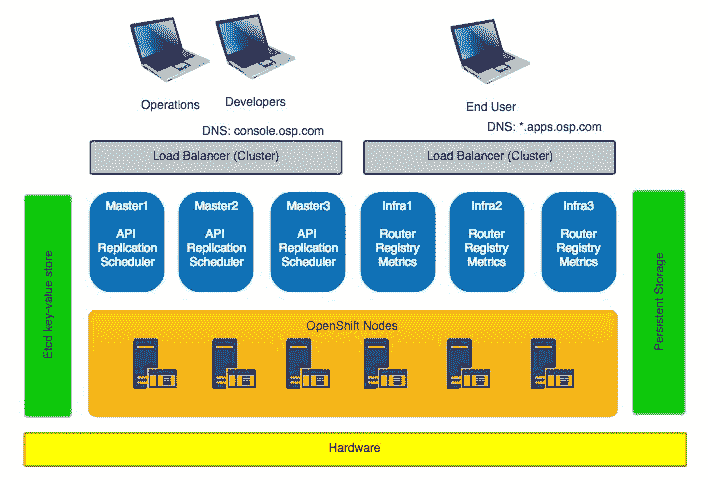
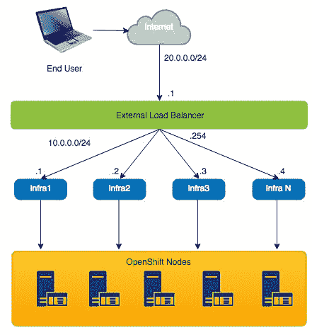
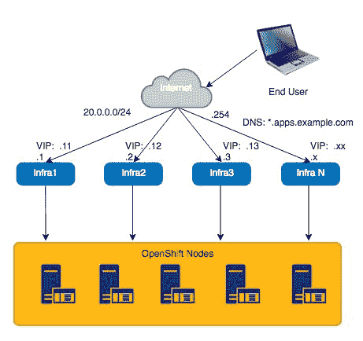
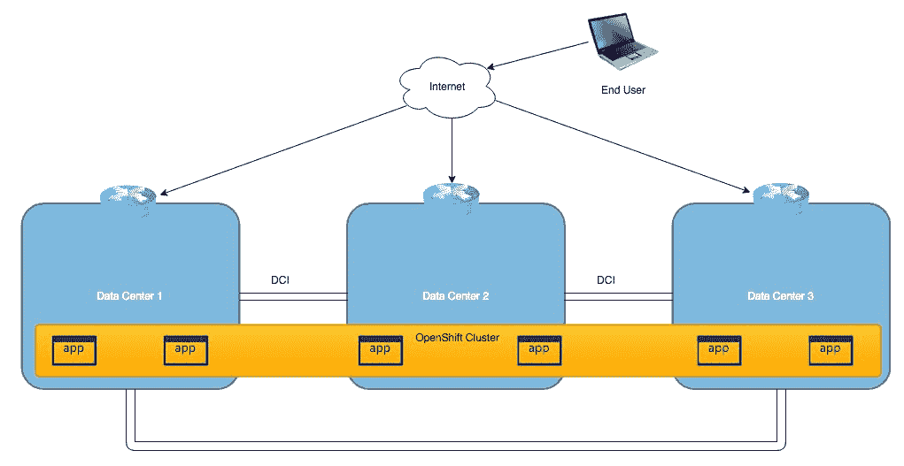
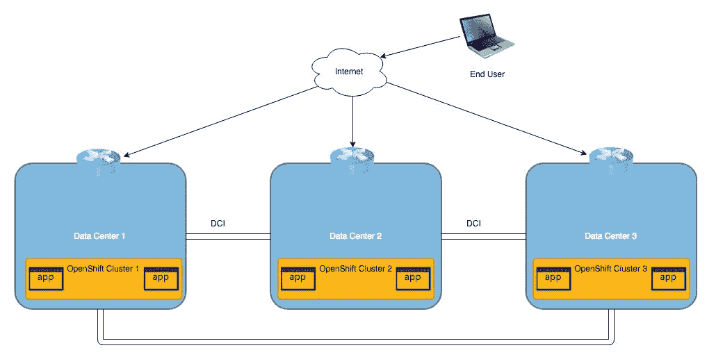
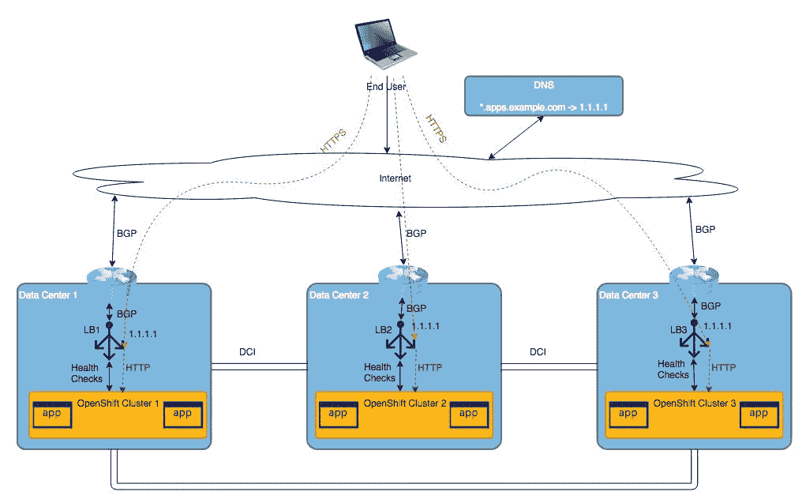
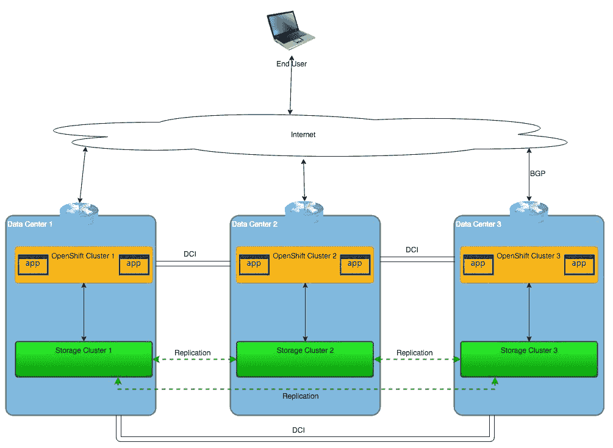
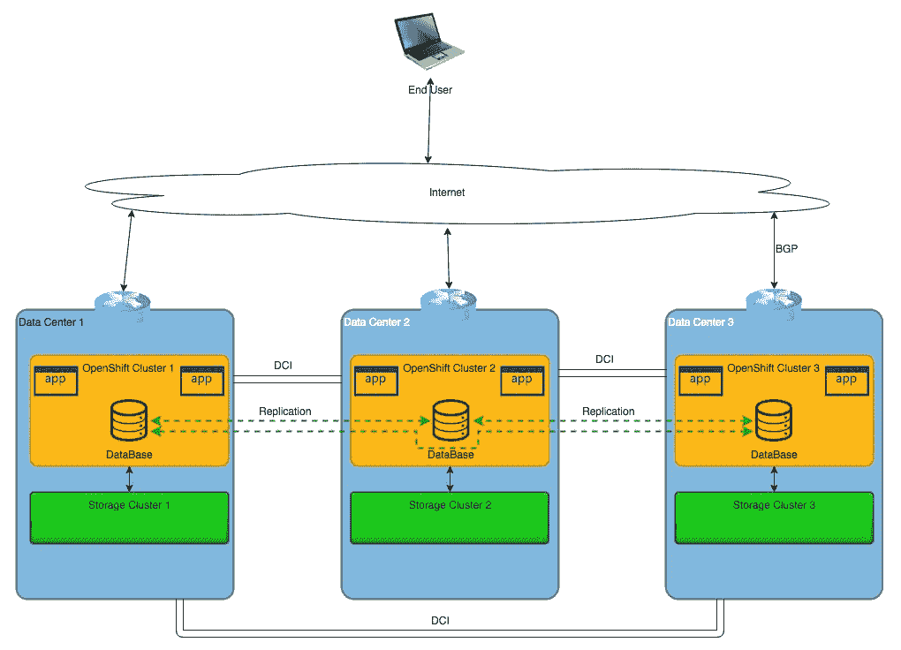
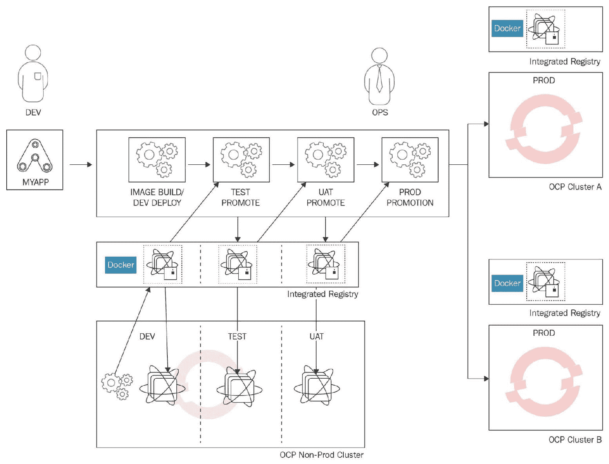

# 第十九章：OpenShift 单数据中心和多数据中心的高可用性设计

在前一章节中，我们简要提到了 OpenShift 高可用性和一般的**高可用性**（**HA**）概念。我们讨论了 OpenShift 如何在发生故障时提供冗余，以及如何通过正确设计 OpenShift 集群来防止这种情况的发生。最后，我们通过备份和恢复方法和流程结束了章节。

在本章中，我们将讨论 OpenShift 在单一和多个数据中心的应用场景。本章还将解释如何在一个或多个数据中心中以分布式和冗余的配置正确设计 OpenShift。

阅读完本章后，你将了解以下主题：

+   OpenShift 单数据中心高可用性设计

+   OpenShift 多数据中心高可用性设计

# OpenShift 单数据中心高可用性设计

在前一章节中，我们简要讨论了高可用性和 OpenShift 高可用性的一般概念，但我们没有深入探讨如何在你的数据中心环境中实际设计 OpenShift。

让我们回顾一下 OpenShift 的主要组件，并了解它们如何提供冗余：

+   OpenShift 基础设施节点

+   OpenShift master 节点

+   OpenShift 节点

+   Etcd 键值存储

+   持久化存储

# OpenShift 基础设施节点

OpenShift 基础设施节点是提供外部访问 OpenShift 集群的关键组件。OpenShift 基础设施节点横向扩展，这意味着我们可以根据需要添加任意数量的节点以增加网络吞吐量。如果你记得前一章节的内容，我们需要考虑使用哪种 VIP 方法。我们有两种主要的 VIP 方法：

+   **使用外部负载均衡器的 VIP**：

+   **使用 keepalived 的 IP 故障转移**：

这两种方法各有优缺点，但提供更好可扩展性并支持平滑迁移到多数据中心设计的是使用外部负载均衡器的 VIP 方法。该方法允许你动态地在所有基础设施节点之间分配负载，并能在不发生中断的情况下动态添加它们。如果你打算在多个数据中心之间分配负载，虚拟 IP 和外部负载均衡器的方法允许你以最小的停机时间实现这些更改。我们将在本章后面讨论多数据中心设计。

# OpenShift master 节点

类似于 OpenShift 基础设施节点，OpenShift master 节点也需要冗余和高可用性。冗余通过横向扩展的 master 节点数量轻松实现，而高可用性则通过我们之前讨论过的 VIP 方法之一来实现。出于同样的原因，使用外部负载均衡器相比 keepalived 和 DNS 方法，是一种更好的、可扩展的解决方案。

# OpenShift 节点

OpenShift 节点没有特定的高可用要求，因为它们以冗余方式运行无状态 pod。唯一需要考虑的高可用性和冗余问题是在数据中心发生故障时，是否有足够的 OpenShift 节点来处理额外的工作负载，无论是服务器、机架还是整个机架行。你需要分发工作负载，并确保无论发生何种故障，你都有冗余的组件和 pod 运行。

# Etcd 键值存储

OpenShift etcd 是一个高度分布式的键值存储，其中保留了所有关键的 OpenShift 集群相关数据。Etcd 默认以活动/活动配置工作，这意味着它提供了默认的冗余和高可用性。一般建议将您的 etcd 集群安装和配置在专用节点上，与 OpenShift 主节点分开，数量为三个、五个或七个成员。

# 持久存储

外部存储配置和设计对于 OpenShift 持久数据超出了本书的范围，但一般建议确保您的外部存储以冗余和可扩展的方式可用，这意味着如果一个或多个组件出现故障，不会影响整体存储性能，并且始终可以被 OpenShift 访问。

# 物理位置考虑

考虑到我们的 OpenShift 集群将在单个数据中心内运行，我们需要额外小心，并确保遵循一些简单的规则：

+   相同的 OpenShift 组件需要连接到不同的交换机和电源电路，并尽可能放置在不同的机架或服务器房中。

+   所有硬件应该在使用接口组网的 OpenShift 组件上运行，使用网络交换机上的 LACP 和 MC-LAG 进行连接。

+   用于持久数据的外部存储集群应遵循相同的规则，并应连接到不同的交换机和电源电路，并尽可能放置在不同的机架或服务器房中。

+   使用不同的负载均衡器集群，彼此独立运行，不形成单点故障。

+   如果您希望为 OpenShift 解决方案提供额外的可靠性，您还可以使用服务器硬件 RAID 用于 OpenShift 操作系统、ECC 启用的 RAM、多个网络卡、双插槽主板和 SSD 磁盘。

# 设计考虑

考虑这样的设计，你需要问自己几个问题：

+   如果任何关键组件（如 OpenStack、网络或存储）宕机，会发生什么？

+   如果 OpenShift 集群需要升级，我该怎么办？

+   如果 OpenShift 持久数据的外部存储不可用，我该怎么办？

+   如果整个 OpenShift 集群崩溃，恢复需要多长时间？

当然，还有其他问题，你需要问问自己，但如果你能毫不犹豫地回答这些问题，那么你就在正确的轨道上。

# OpenShift 多数据中心高可用设计

OpenShift 多数据中心是 OpenShift 设计和在可扩展分布式环境中实施时最困难的话题之一。这主要是因为在这个话题周围没有太多的部署和最佳实践。单一数据中心环境中部署 OpenShift 集群可能相对容易，但当涉及到多数据中心设计时，事情就变得复杂。原因是，现在我们还需要考虑所有 OpenShift 及其相邻组件（如网络和存储）在多个数据中心之间的可扩展性和高可用性。对于涉及多个数据中心的设计，主要有两种高可用性策略：

+   跨所有数据中心使用一个 OpenShift 集群（例如，三个数据中心对应一个集群）

+   每个数据中心一个 OpenShift 集群（例如，三个数据中心对应三个集群）

对于所有这些策略，我们需要使用主动/主动场景，因为主动/被动场景是资源和金钱的浪费。尽管仍有许多公司使用主动/被动场景，但它们通常有计划迁移到主动/主动场景。

# 在所有数据中心之间使用一个 OpenShift 集群

这种设计选项是最自然、最容易操作的，但在所有其他选项中也是最危险的。一个数据中心环境带来一套问题，而如果再增加一个数据中心，问题就会翻倍。如果你有一个不可靠的数据中心互联链接，它将增加故障风险。你们中一些人可能不同意，但如果不正确规划和设计解决方案，通常会发生以下情况：

考虑前述设计，你将面临以下挑战：

+   我如何在这些数据中心之间平衡来自互联网的流量？

+   我如何在这些数据中心之间分布每一个 OpenShift 组件，以便在发生故障时，OpenShift 仍然能够承载所有负载？

+   我的存储解决方案如何在所有三个数据中心之间工作？

+   我需要在所有数据中心之间扩展相同的网络子网吗？

+   我如何解决非对称路由问题？

+   如果发生脑裂现象，OpenShift 集群会怎样？

+   如果其中一个数据中心的任何关键组件（OpenStack、网络或存储）发生故障，会发生什么？

+   如果整个 OpenShift 集群宕机，恢复需要多长时间？

+   如果一个新数据中心上线，我该如何扩展这个解决方案？

+   如果 OpenShift 集群需要升级，我该怎么办？

+   如果 OpenShift 持久化数据的外部存储不可用，我该怎么办？

如你所见，在所有数据中心只使用一个 OpenShift 集群，相较于在单个数据中心使用一个集群，会增加更多的问题和疑问。这个解决方案有一个主要优点——拥有一个单独的 OpenShift 集群更容易操作。但你需要问自己，是否在构建一个易于操作的解决方案，还是一个可靠且稳定的解决方案，能够在最困难甚至灾难性的事件中保持运行。

# 每个数据中心一个 OpenShift 集群

尽管前一种解决方案有许多缺点，但还有另一种不那么流行但非常稳定、可预测且具有良好扩展性的解决方案。该解决方案是每个数据中心都使用一个 OpenShift 集群：

这个解决方案的主要优点是，所有的 OpenShift 集群彼此独立，一个集群出现问题不会影响其他集群。你仍然会遇到挑战，但这些挑战与跨所有数据中心使用单个 OpenShift 集群的挑战有所不同，而且更容易解决。此外，这个解决方案的扩展性比其他方案更好。然而，在实施此解决方案之前，你应该回答以下问题：

+   我如何在所有这些数据中心之间进行负载均衡？

+   如果出现脑裂（split brain）情况，OpenShift 集群会发生什么？

+   我的存储数据如何在三个数据中心之间工作？

+   我是否需要在所有数据中心之间进行数据库复制？如果是，如何实现？

+   如果某个数据中心的关键组件（如 OpenStack、网络或存储）出现故障，怎么办？

+   如果整个 OpenShift 集群出现故障，需要多长时间恢复？

+   如果有新数据中心上线，我该如何扩展这个解决方案？

+   关于 OpenShift 集群升级，我该怎么办？

+   如果 OpenShift 持久数据的外部存储不可用，我该怎么办？

以下是一个对比表，总结了我们刚刚讨论的所有 **OpenShift 容器平台**（**OCP**）高可用性解决方案的主要差异：

| **名称** | **1xOCP-1xDC** | **1xOCP-3xDC** | **3xOCP-3xDC** |
| --- | --- | --- | --- |
| 数据中心冗余 | 否 | 是 | 是 |
| 集群间冗余 | 否 | 否 | 是 |
| 集群间存储隔离 | 否 | 否 | 是 |
| 扩展性 | 有限 | 有限 | 无限 |
| 解决方案实现 | 简单 | 中等 | 困难 |
| 操作 | 简单 | 简单 | 中等 |
| 故障排除 | 简单 | 困难 | 中等 |
| 集群无缝升级与恢复 | 中等 | 困难 | 简单 |
| 应用开发 | 简单 | 简单 | 简单 |
| 应用部署 | 简单 | 简单 | 中等 |
| 是否需要外部自定义工具 | 否 | 否 | 是 |

如你所见，每个高可用性解决方案都有其优缺点：

+   **1xOCP-1xDC**：这是最容易实现、操作和故障排除的方案，但它容易受到数据中心或 OpenShift 集群故障的影响，且扩展性有限。

+   **1xOCP-3xDC**：除了前一个解决方案的所有好处外，它具有更好的冗余性，但如果出现问题，故障排除的工作量会大大增加。此解决方案也难以进行无缝升级和恢复。

+   **3xOCP-3xDC**：这是一个更高层次的解决方案架构，实施、运营和故障排除更加困难，但它是最稳定、可扩展的解决方案。这个解决方案需要丰富的经验和专业知识，但可以确保您的应用程序始终保持运行。

为了成功实现最后一个解决方案，其中每个数据中心都有一个 OpenShift 集群，我们需要仔细关注以下几个主题：

+   网络

+   存储

+   应用部署

# 网络

在构建这样的解决方案时，网络的主要问题是如何正确地负载均衡流量，以及当故障发生时，如何将流量重新路由到其他 OpenShift 集群。我们可以使用的主要技术如下：

+   **Anycast IP 地址**：为了有效地在所有数据中心之间进行流量负载均衡，我们可以使用 Anycast IP 地址。这不仅有助于负载均衡流量，还能在某个数据中心的应用程序不可用时提供 IP 故障转移。

+   **应用程序健康检查**：应用程序健康检查是这个解决方案中的必备内容。它们将帮助您识别故障并将流量重新路由到其他数据中心。

+   **动态路由协议**：确保负载均衡器与网络硬件之间有 IGP/BGP 连接。当发生故障时，IGP/BGP 将撤回其 IP Anycast 地址，使流量转到其他数据中心。

+   **SSL 卸载**：根据实现的不同，您可能需要在负载均衡器上配置 SSL 卸载。这将使流量解密从 OpenShift 集群中分离出来：

# 存储

存储一直是跨多个平台进行地理分布式应用部署时的一个问题。即使是主要的云服务提供商也尚未解决这个问题。这是应用程序实例必须能够相互独立运行并保持无状态的主要原因。然而，我们可以建议一些架构，指引您走向正确的方向并帮助解决这个问题：

**存储地理复制**：

您可以设置多数据中心存储复制，以确保所有数据中心之间的数据一致性。一个例子是 GlusterFS 地理复制，它支持不同的场景，应该适合您的需求。正如本书早些时候讨论的，GlusterFS 作为 OpenShift 的持久存储是一个完美的匹配。

**数据库地理复制**：

在大多数情况下，您在 OpenShift 中的唯一有状态信息将保存在数据库中。现代数据库支持多站点、多数据中心和多区域复制架构，如 Cassandra、MongoDB、Kafka 和 Hazelcast。

如果数据库损坏，你仍然需要处理备份和恢复过程。

# 应用部署

一旦完成网络和存储设计，最后一步应该是关于应用部署流程的。由于我们有多个集群，因此必须有一个流程，确保如何在所有 OpenShift 集群和所有数据中心中一致地交付你的应用：

这是外部工具发挥作用的地方。我们可以使用外部 CI/CD 软件来自动化整个 OpenShift 集群中的应用部署过程，或者我们可以构建一个单独的 OpenShift 集群，配合 CI/CD 来开发、构建、测试并将应用发布到生产 OpenShift 集群。

# 总结

本章讨论了单一和多个数据中心中的 OpenShift 场景。本章还解释了如何在一个或多个数据中心中以分布式和冗余的配置正确设计 OpenShift。

在下一章中，我们将讨论在设计一个或多个数据中心的 OpenShift 集群时的主要网络方面。我们还将讨论常见的错误、解决方案以及从网络角度出发的总体指导。

# 问题

1.  哪个 OpenShift 组件内置高可用性并在主动/主动模式下工作？ 选择一个：

    1.  OpenShift Etcd 键值存储

    1.  OpenShift 主节点

    1.  OpenShift 基础设施节点

    1.  OpenShift 节点

1.  以下哪种 OpenShift 高可用性解决方案支持无限扩展性？ 选择一个：

    1.  1xOSP - 3xDC

    1.  3xOSP - 1xDC

    1.  3xOSP - 3xDC

    1.  1xOSP - 1xDC

1.  Anycast IP 地址确保应用流量在多个数据中心之间负载均衡：

    1.  正确

    1.  错误

1.  在地理复制的 OpenShift 部署中，确保应用数据一致性的两个选项是什么？ 选择两个：

    1.  持久存储复制

    1.  应用数据库复制

    1.  OpenShift 集群复制

    1.  OpenShift etcd 键值存储复制

# 进一步阅读

这里列出了一些与本章节相关的主题链接，你可能想深入了解：

+   **OpenShift 高可用性设计**: [`v1.uncontained.io/playbooks/installation/`](http://v1.uncontained.io/playbooks/installation/)

+   **OpenShift 高可用性**: [`docs.openshift.com/enterprise/latest/admin_guide/high_availability.html`](https://docs.openshift.com/enterprise/latest/admin_guide/high_availability.html)

+   **OpenShift 单数据中心和多个数据中心**: [`blog.openshift.com/deploying-openshift-applications-multiple-datacenters/`](https://blog.openshift.com/deploying-openshift-applications-multiple-datacenters/)

+   **GlusterFS 地理复制**: [`docs.gluster.org/en/latest/Administrator%20Guide/Geo%20Replication/`](https://docs.gluster.org/en/latest/Administrator%20Guide/Geo%20Replication/)
