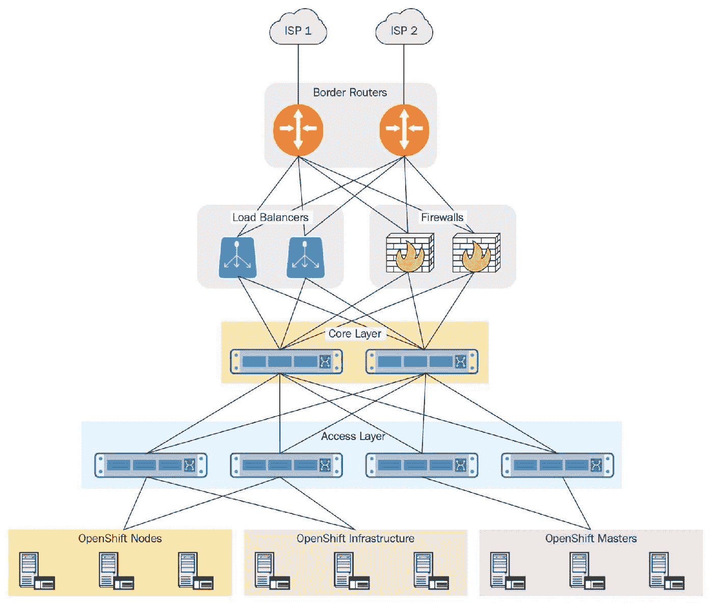
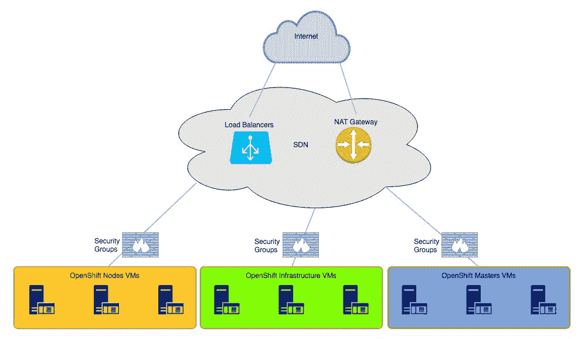

# 第二十章：OpenShift 高可用性网络设计

在上一章中，我们讨论了单数据中心和多个数据中心中的 OpenShift 场景，并解释了如何在一个或多个数据中心中以分布式和冗余的配置正确设计 OpenShift。

在本章中，我们将介绍设计 OpenShift 集群时的主要网络方面，无论是在单一数据中心还是跨多个数据中心的设计。我们还将涵盖常见的错误、解决方案和从网络角度的整体指导。

阅读完本章后，您将了解以下主题：

+   OpenShift 部署的常见网络拓扑

+   设计 OpenShift 网络时常见的错误

+   OpenShift 部署的一般网络需求和设计指南

# OpenShift 部署的常见网络拓扑

尽管每个网络基础设施在某种程度上都是独一无二的，但所有这些网络有很多共同点，可以分为两种类型：

+   物理或数据中心网络

+   虚拟或云网络

# 数据中心网络

大多数物理和数据中心网络具有类似的结构和组件，如下所示：

+   **核心/脊层交换机**：用于互联网络的不同部分，包括聚合/叶子交换机，以及网络边缘和/或数据中心互联链接

+   **接入/叶子交换机**：将物理服务器连接到产生收入的网络

+   **边缘防火墙**：用于过滤外部流量进入网络内部

+   **边界路由器**：用于连接互联网或其他外部网络

+   **负载均衡器**：用于在应用服务器组之间平衡传入流量

如下图所示：

这些组件中的一些可以合并，如防火墙和边界路由器。某些组件是可选的，如负载均衡器。可能还会有额外的组件，但这些是每个数据中心的基本构建块。

# 接入层交换机

网络接入层是一个至关重要的网络组件，通常具有几个已配置的功能，例如：

+   **多机箱链路聚合 (MC-LAG)**：允许服务器链路连接到不同的接入层交换机，并在主动/主动模式下启用绑定

+   **虚拟局域网 (VLAN)**：一种非常古老但稳定的技术，用于将一个广播域与另一个广播域隔离开

+   **L3 网关**：一个 IP 网关，允许 VLAN 流量进出

+   **动态路由协议**：**内部网关协议**（**IGP**）/**边界网关协议**（**BGP**）允许服务器的 IP 地址/子网动态交换，并能在不同传输链路之间进行故障切换，且不会导致任何停机

+   **控制平面流量控制 (CoPP)**：这是一种常见的方式，用于保护设备的管理访问

# 核心层交换机

网络核心层是整个数据中心组件网络的核心，并且配置了非常有限的功能，例如以下内容：

+   **动态路由协议**：IGP/BGP 允许动态交换服务器的 IP 地址/子网，并在不中断的情况下实现从一个传输链路到另一个的故障转移

+   **CoPP**：这是一种常见的方式，用于保护设备的管理访问

# 边缘防火墙

边缘防火墙是抵御来自互联网攻击的第一道防线。边缘防火墙还可以逻辑上将不同的网络段彼此隔离，并通常启用以下功能：

+   **有状态检查**：跟踪进出流量，动态打开和关闭请求的端口，以便数据中心内部的服务器可以访问

+   **应用防火墙**：通过检查应用程序签名动态识别应用程序，并采取适当的措施，如允许或拒绝

+   **分布式拒绝服务（DDoS）保护**：识别并阻止恶意流量，同时允许合法流量得到处理并到达数据中心内部的应用程序

+   **入侵防御系统（IPS）和入侵检测系统（IDS）**：这些系统提供了针对利用数据中心应用程序漏洞的攻击的防护技术

+   **网络地址转换（NAT）**：NAT 允许数据中心网络内部的主机通过将源 IP 地址更改为公共可用的 IP 地址，从而访问互联网

+   **CoPP**：这是一种常见的方式，用于保护设备的管理访问

# 负载均衡器

负载均衡器是可选的网络组件之一，具备附加功能，可以跟踪应用程序的可用性，并动态地将来自互联网的请求在数据中心内部的服务器之间进行负载均衡。负载均衡器配置了一定的功能集，例如以下内容：

+   **目标网络地址转换（DNAT）**：DNAT 允许来自数据中心网络外部的主机，通过将目标 IP 地址从公共可用的 IP 地址更改为池中适当服务器的私有 IP 地址，从而访问数据中心网络内部的服务器

+   **负载均衡**：与 DNAT 一起工作，动态跟踪应用程序的可用性，并动态从服务器组中移除服务器

+   **SSL 卸载**：通过在负载均衡器上终止 SSL 流量，处理进出不安全网络的 Web 流量的加密/解密

+   **CoPP**：这是一种常见的方式，用于保护设备的管理访问

# 边界路由器

边界路由器是数据中心网络与互联网之间的通信节点，并且配置了非常有限的功能，例如以下内容：

+   **动态路由协议**：BGP 保持整个互联网路由表，以计算到最终目的地的最佳路径，并向互联网通告数据中心的公共 IP 地址池。

+   **CoPP**：这是一种常见的保护设备管理访问的方式，确保进出设备的流量安全。

# 云网络

类似于物理和数据中心网络，云网络有其自己的结构和组件，如下所示：

+   **软件定义网络（SDN）**：SDN 通过使用流行的 SDN 传输和封装协议，以按需实现网络，从而取代了传统的网络架构。

+   **安全组**：灵活且可编程的防火墙过滤器，允许在大规模环境下进行流量控制，避免单点故障

+   **NAT 网关**：为了高效地路由进出云网络的流量，并在必要时提供 NAT 服务。

+   **负载均衡器**：在一组应用服务器之间对流入流量进行负载均衡

尽管不同的云服务提供商使用不同的协议和实现方式来处理某些组件，但主要功能保持一致，从一个云服务提供商到另一个云服务提供商的工作原理类似：

# SDN

SDN 通过使用现代流行的通信和传输协议，使应用程序能够抽象化并与底层网络实现完全独立，以下是一些例子：

+   **OpenFlow**：这是一种协议，允许通过网络访问网络交换机或路由器的转发平面。OpenFlow 允许网络控制器计算数据包在网络中的路径。许多产品和公司，包括 OpenStack，正在使用 OpenFlow 来构建其 SDN 网络。OpenFlow 得到了领先网络制造商的支持，包括思科系统、瞻博网络、阿尔卡特朗讯、戴尔、Arista 等。

+   **虚拟可扩展局域网（VXLAN）**：这是一种封装协议，允许在现有路由网络上运行覆盖网络。VXLAN 是当前最受欢迎的协议之一，用于将不同的 SDN 网络段互联成一个单一解决方案。

# 安全组

安全组是控制**虚拟机**（**VMs**）进出流量的主要安全方法，虚拟机内运行着应用程序，它们的主要功能是**有状态检查**。它会跟踪进出流量，动态地为虚拟机内的应用程序打开和关闭所需的端口。

# 负载均衡器

如果数据中心网络通常使用物理负载均衡器，那么云网络则倾向于使用软件负载均衡器，提供相同的功能，包括 DNAT、负载均衡，甚至 SSL 卸载。

所以，云网络的强大功能不容小觑。

# 网络地址转换（NAT）网关

NAT 网关是云提供商内部应用与互联网之间的通信点，并且配置的功能非常有限，如 NAT。它允许数据中心网络内的主机通过更改源 IP 地址为公共 IP 地址来访问互联网。

# 在为 OpenShift 设计网络时常见的错误

虽然网络设计通常很简单，但有很多方法可能会导致整个网络成为单点故障。最常见的错误如下：

+   在接入层和核心网络层，人们经常使用静态的 **链路聚合**（**LAG**）方法，而不是使用动态链路控制，如 **链路聚合控制协议**（**LACP**）802.3ad。MTU 值在整个网络中未正确设置，且 CoPP 过滤器阻止了网络设备之间的协议通信，导致故障时故障切换无法正常工作。

+   在使用负载均衡器时，通常情况下，主动/被动部署无法正确地从一个节点切换到另一个节点。这通常是由于负载均衡器集群节点之间的配置不一致所导致的。

+   防火墙和安全组往往是瓶颈，而一个由两个或更多节点组成的防火墙集群，在使用单一控制平面的情况下，可能成为单点故障。我们曾见过使用无状态过滤器代替有状态过滤器，这会导致双向流量被阻塞。最后，当启用故障转移抢占时，会导致防火墙集群无限制地切换。

+   在边界路由器上，拥有多个完整的互联网路由表需要很长时间才能让 BGP 重新收敛，这常常会导致流量被黑洞化。唯一的默认网关导致 BGP 无法选择最优的路由，**等成本多路径**（**ECMP**）会引发非对称路由和数据包丢失。

# OpenShift 部署的一般网络要求和设计指南

网络是 OpenShift 的一个关键组件，因为 OpenShift 解决方案的每一部分都依赖于网络的可用性、性能、可扩展性和稳定性。控制平面和数据平面流量使用网络的不同部分进行通信。为了使 OpenShift 解决方案大部分时间可用，并避免计划外的网络中断，需要考虑以下几点：

+   所有运行 OpenShift 的物理主机都需要通过 MC-LAG 或类似技术，拥有冗余的物理连接来访问接入层交换机。

+   实现冗余的负载均衡器集，分别处理数据平面和控制平面

+   实现冗余的防火墙集，分别处理数据平面和控制平面

+   在适用情况下，为了安全原因，使用专用的管理网络

+   如果没有使用外部负载均衡器，且基础设施节点上有 **keepalived** 实现的 VIP，且上游网络没有单点故障

+   如果有多个数据中心，应使用 AnyCast IP

+   网络收敛通过其他机制来处理，例如**双向转发检测**（**BFD**）、额外的调整设置（如在**生成树协议**（**STP**）中的 PortFast）以及调整路由协议中的协议定时器

+   MTU 参数在 OpenShift 节点上正确设置，并与网络对齐，以确保不会发生数据包分段

+   如果被防火墙或任何类型的**访问控制列表**（**ACL**）隔离，必须打开适当的端口，以便 OpenShift 组件之间能够进行通信

考虑到以上所有因素将帮助你避免在设计 OpenShift 集群时遇到 99% 的问题。

# 总结

在本章中，我们介绍了在设计 OpenShift 集群时涉及的主要网络方面，包括在一个或多个数据中心的设计。我们还讨论了常见的错误、解决方案和从网络角度出发的总体指导。

在下一章，我们将简要概述我们在本书中已覆盖和未覆盖的 OpenShift 3.9 新特性。我们将简要讨论预计在今年晚些时候（2018 年）发布的 OpenShift 后续版本中的内容。

# 问题

1.  在标准数据中心部署中，哪个网络组件是可选的？选择一个：

+   1.  防火墙

    1.  负载均衡器

    1.  核心交换机

    1.  边界路由器

1.  防火墙中常见的两个错误是什么？选择两个：

+   1.  故障切换抢占

    1.  无状态过滤器

    1.  有状态过滤器

    1.  拥有一个或多个完整的互联网表

1.  物理数据中心和云网络具有完全相同的组件：

+   1.  正确

    1.  错误

1.  可以用哪个命令在 OpenShift 中备份和恢复应用数据？选择一个：

+   1.  **`oc rsync`**

    1.  `oc backup`

    1.  `oc save`

    1.  `oc load`

1.  在云网络中，哪个网络组件负责让应用程序访问互联网？选择一个：

+   1.  负载均衡器

    1.  NAT 网关

    1.  边界路由器

    1.  边缘防火墙

# 进一步阅读

以下是与本章相关的主题及其链接，您可能想深入了解：

+   **网络设计与架构中心：数据中心网络** [`www.juniper.net/documentation/en_US/design-and-architecture/data-center/`](https://www.juniper.net/documentation/en_US/design-and-architecture/data-center/)。

+   **AWS 单一 VPC 设计** [`aws.amazon.com/answers/networking/aws-single-vpc-design/`](https://aws.amazon.com/answers/networking/aws-single-vpc-design/)。
