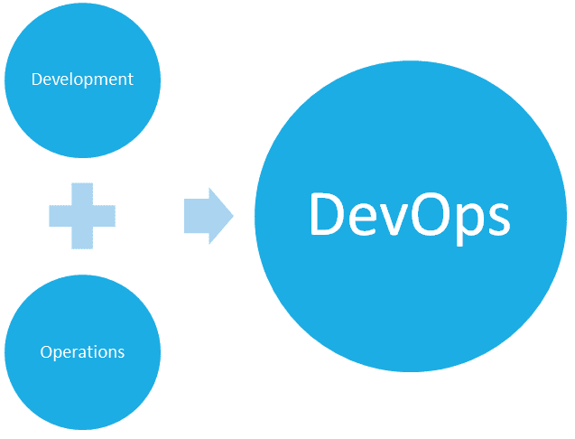
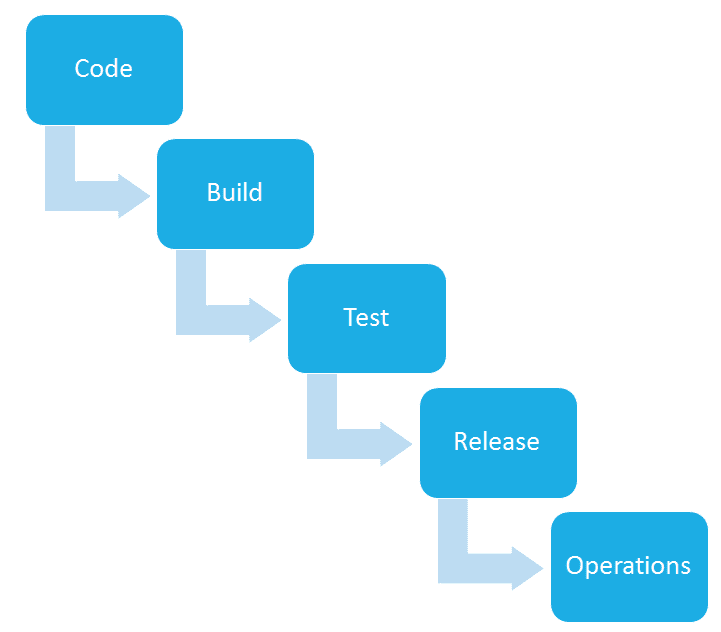
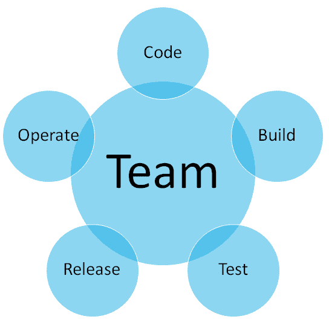
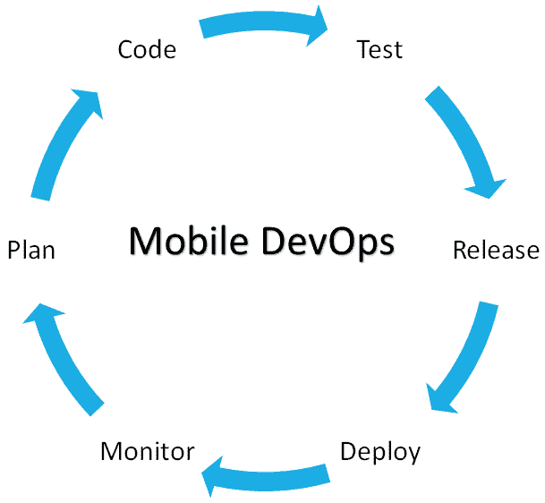
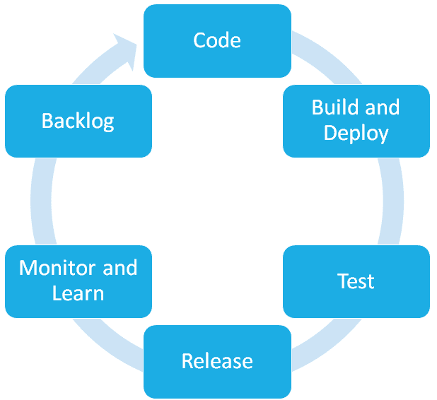

# 介绍

DevOps 作为一个术语，有着广泛的含义，涵盖了软件开发生命周期中的不同阶段。在本章中，我们将讨论 DevOps 是什么，它在软件开发过程中的含义，以及在软件维护过程中扮演的角色。我们将在本章中通过以下主题讨论关于 DevOps 和移动 DevOps 的各种细节：

+   DevOps 介绍

+   移动 DevOps 介绍

+   DevOps 与移动 DevOps 的比较

+   将 DevOps 应用于移动端的挑战

# DevOps 介绍

**DevOps** 来源于两个不同的词：开发（development）和运维（operations）。因此，正如这个词所暗示的，它描述了在开发软件和管理运维任务的过程中所采用的一套实践。

DevOps 这个术语最早由 Andrew Shafer 和 Patrick Debois 于 2008 年提出，他们成为了这一理念的两位主要倡导者，自 2009 年以来，该术语已被广泛使用并推广，旨在统一软件开发和运维的过程。

DevOps 不仅是一套实践，它还是软件开发行业的一种工作方式；它是开发与运维合作方式上的一种文化变革。

以更快的速度向客户交付技术，并与他们的需求对接，是未来增长的关键；这是一种实践，可以通过 DevOps 来实现。采用 DevOps 可以创建一个持续交付的生态系统，提高交付质量和速度，并带来所有相关的好处。

在传统方法中，开发人员按照需求在任何本地环境中编写代码。一旦应用程序准备好，QA 团队会在一个类似生产环境的环境中测试该应用程序。

一旦测试成功并且满足需求，产品就会被交给运维团队进行部署。由于两个团队是独立工作的，因此应用程序版本的部署可能会花费很长时间，且可能无法按预期进行。

然而，在 DevOps 中，过程是完全不同的。在这里，开发人员、QA 和运维合作，使用各种工具进行持续开发、集成、交付和监控，这有助于填补一个巨大的空白并加速过程。

从某种意义上讲，每个工具都独立工作，但又紧密集成。快速和自动的发布到运维能够让相关方迅速响应变化并满足需求。

过去，软件开发与运维是完全分开的过程。发布往往与实际开发过程松散集成，因此有时会在开发环境与发布或生产环境之间产生差异。

开发人员过去常常独立完成开发工作，而运维则负责项目的发布和发布后的任务。

这种工作方式曾在瀑布式软件开发模型流行时表现得非常出色，那时每个步骤都是顺序进行的，发布往往是一个漫长的过程。

在今天，敏捷已成为新的流行软件开发方法，更频繁的发布成为交付目标，只有集成化环境才能提供所需的灵活性和稳定性及服务质量。

# DevOps 的文化方面

DevOps 带来的最大文化差异是将不同角色/人员聚集到一个具有相同交付目标的特定团队中。

人们可以做自己擅长的事情并得到即时反馈。DevOps 能够在技术故障的情况下提供快速解决方案，并有助于团队健康、个人满意度以及时间效率和管理。

例如，过去需要几个月的过程现在可以在几分钟内完成。它将环境配置从一个新问题转变为按下按钮即可解决的愉快体验。

DevOps 为我们提供了发明和专注于实际业务需求的能力和灵活性，而不是管理数小时、数周或数月的运维任务。

像 Amazon、Facebook、LinkedIn 和 Twitter 这样的站点众所周知，每天会进行多次部署（有时每分钟一次）。为了如此频繁地进行部署，他们不能破坏已经运行的系统；必须在现有系统的基础上进行补充。

DevOps 帮助你专注于行业逻辑和实际需求，而不是维护、扩展、集群、部署等繁琐工作。

DevOps 在某种程度上代表并推动了 IT 文化的变化，专注于通过采纳敏捷开发来实现快速和频繁的交付，在软件开发生命周期的背景下简化实践，包括开发和运维。

DevOps 关注人和文化，致力于改善开发团队和运维团队之间的协作与整合。DevOps 的实施利用了能够确保集成和快速反馈的技术，从而确保质量，特别是通过使用可以利用日益可编程且高度动态的基础设施的自动化软件工具，从开发和运维生命周期的角度来看。

# DevOps 之前

为了真正理解使用 DevOps 的好处和差异，我们必须了解 DevOps 出现之前的工作方式。如图所示，运维曾经并未与开发周期的其他部分集成：

# DevOps 之后

在 DevOps 工作方式中，运维从最初阶段就参与到开发过程中。他们更好地理解可能在后期出现的问题，并能在早期采取措施，避免它们在生产阶段发生。开发人员得到快速反馈，能够根据运维提出的问题进行调整，反之亦然。

# 移动 DevOps 介绍

移动 DevOps 与 DevOps 非常相似，只不过它应用于移动端。尽管如此，它仍然带来了新的挑战，这些挑战与移动应用的部署和维护相关。在讨论移动应用开发时，部署和反馈方面有许多新因素需要考虑。

一个 Web 应用只需要在有限的浏览器上进行测试和质量检查，但对于移动应用来说，测试的范围非常广泛，并不限于一组特定的移动设备或操作系统版本。一旦应用上线，市场上众多操作系统版本需要进行测试和追踪。

DevOps 和移动 DevOps 之间的主要区别在于实现过程所需的工具。在移动 DevOps 中，必须将 SDK 集成到应用代码中，以便在生产环境中跟踪错误报告和崩溃报告。

反馈机制变得更加重要，因为移动应用具有更强的个人化特点，用户提供的反馈非常重要，可以用于进一步改进应用。

# 持续反馈和持续发展

持续反馈和持续发展已经成为移动应用开发中最重要的内容。开发者必须不断根据客户的反馈进行调整，并且必须使用工具确保能够及时收到正确的客户反馈并付诸行动。在开发和生产发布的每个阶段，必须监控渠道并使用监控工具，以确保用户的意见能够被理解和照顾。开发者需要了解哪些场景可能导致用户的应用在手机上崩溃，例如用户在哪个页面停留时间最长，用户在哪些功能上没有进行操作。所有这些反馈对于移动应用开发至关重要；为了能够获得这些反馈，必须配备能够实现持续反馈的工具，帮助开发者更好地了解用户体验。

# 移动 DevOps 中的待办事项重要性

当谈到移动应用时，应用崩溃并不是唯一的反馈机制。用户可以直接从移动应用中提交反馈给开发者。一些工具还提供用户指标和自定义事件，帮助开发者了解应用的接受度和使用情况。所有这些信息都应被用来改进待办事项列表，开发者应该始终根据数据对投资方向充满信心。

# DevOps 与移动 DevOps

DevOps 和移动 DevOps 相似，但它们在实现相同目标时使用的工具集有所不同。为了更好地理解 DevOps 和移动 DevOps 之间的区别，让我们逐步了解应用开发和运维生命周期中的每个阶段，并讨论两者方法的差异。

# 开发

开发阶段对于 Web 和移动应用程序开发几乎相同，但在移动应用程序开发中，开发者需要包含 SDK 和工具，帮助他们跟踪应用崩溃和用户反馈，并更好地监控用户活动。移动应用开发者可以在应用程序中构建反馈机制，借此他们可以要求用户提交反馈，甚至是 bug 报告，这些通常由移动操作系统提供。甚至一些 SDK 可以嵌入到移动应用程序代码中，帮助反馈跟踪和改善最终用户的互动。

**HockeyApp**等工具直接将用户交互和反馈整合到开发者手中。

# 测试

在测试方面，Web 应用程序测试和移动应用程序测试使用的工具差异很大。在 Web 应用程序中，测试应用程序所需的资源仅限于一组浏览器和有限的操作系统版本。

手动测试有时足以确保高质量的产品。但在移动应用程序测试中，有数百种不同的硬件依赖设备组合需要进行测试，以确保应用程序上线时能够正常运行。Android 崛起后，出现了各种硬件配置和不同操作系统的设备。为了确保广泛的用户群体，开发者需要确保他们的应用程序与所有不同版本以及低端设备兼容。

为了保证质量，仅在模拟器上测试是不够的，尤其对于高质量的应用程序；它们需要在真实设备上进行测试，但这对于许多组织来说有时既困难又超预算。这时，像 Xamarin Test Cloud 这样的云测试环境便应运而生，能够自动化该过程，并以低成本在真实设备上进行测试。

# 部署

在 Web 应用程序部署中，环境可以根据我们的需求进行控制和定制，但在移动应用程序部署中，应用程序需要通过某种操作系统应用商店发布，之后该商店会验证并发布应用程序供用户在其设备上使用。

# 监控

为了监控 Web 应用程序，开发者使用日志、服务器端的一些工具和客户端的其他工具来帮助他们识别由于网络或代码质量引发的问题。但在移动应用程序中，由于可能出现的问题，范围相当广泛。各种硬件依赖、设备权限和其他因素可能会出现，如果没有合适的工具，难以监控到这些问题，这就是移动 DevOps 与 DevOps 的区别所在。

# 持续交付

持续交付听起来非常简单，如果正确实施，确实是这样。在 DevOps 中，获取反馈并进行处理、修复 bug，然后重新部署，比移动应用程序要简单且节省时间得多。从用户那里获取崩溃报告，然后找出问题，再重新进入测试阶段，如果没有自动化，这个过程可能非常耗时。

自动化开发过程、在真实设备上进行测试、签署应用并发布到商店，再次跟踪用户反馈——如果没有使用正确的工具，整个过程变得非常复杂。

# 将 DevOps 应用于移动设备的挑战

由于快速和持续交付的思维方式，DevOps 面临许多挑战，尤其是在将 DevOps 应用于移动应用程序开发生命周期时。

以下是将 DevOps 应用于移动时出现的一些挑战。

# 快速的技术适应

移动技术每天都在快速发展和改进，随着每天发布的新设备和硬件支持，DevOps 工具很难跟上它们的步伐。

# 跨平台支持

大多数移动应用程序有多个平台目标；操作系统有不同的版本，应用程序需要支持其中的大部分，以确保拥有广泛的用户基础。例如，Android 系统中，许多设备安装的是旧版本，因硬件限制而无法更新到新版本，且制造商不更新其设备。同时，拥有不同设备意味着要定制 Android 以适应个人喜好并更改用户界面，因此应用程序必须与所有不同的设备形式和 UI 更改兼容。

# 跟上移动开发的步伐

移动应用程序现在已成为许多组织前端的不可或缺的一部分，并显然推动了后端开发的变化。组织使用服务层和数据层来进行后端操作，但由于与移动开发的集成，它们需要更好地适应并与移动和 Web 开发协作。

# 发布

由于在移动平台上发布和更新的方式与 Web 完全不同，因此确保更新并关注旧版本变得更加困难。在移动设备上，用户必须下载更新；而不像 Web 一样，用户每次访问 URL 时，应用程序会自动更新。大多数时候，用户选择不下载更新，有时他们的存储空间有限。因此，应用程序开发者必须不断确保旧版和新版都能正常运行。

# 向后兼容性

如前所述，移动应用需要在新旧版本的操作系统上都能正常运行。仅仅因为你开发了新版本，并不意味着旧版本用户就不再是你的责任。事实证明，大多数使用旧版本操作系统的用户并不会下载最新更新。应用开发者必须在新版本操作系统中使用最新功能，同时确保应用在旧版本上也能完美运行。

# 应用商店

这是一种新的应用分发方式，主要出现在移动应用行业。在网页应用中，你只需将应用部署到网页服务器上，用户可以通过 URL 访问你的应用。

修复问题和部署补丁变得非常简单，因为你只需将其部署到服务器上，访问你网页应用程序的人就会立即收到更新。

在移动应用中，应用程序必须通过所有不同操作系统的应用商店。

它们必须在发布前经过验证，即使是更新和小补丁也需要通过相同的流程，因此修复不会立即提供给最终用户。这在将 DevOps 应用到移动端时增加了额外的复杂性。

# 反馈机制

在网站和其他平台中，由于应用程序不是通过应用商店提供给用户的，反馈仅限于应用团队。用户的反馈对其他用户不可见，他们可以根据自己的判断来评估和使用它。

在移动设备中，用户可以在应用商店中给予反馈，如果应用程序未能满足用户的期望，它会收到差评，这对应用程序的影响很大。这种快速且显而易见的反馈可以帮助应用程序迅速起飞，或者如果用户不喜欢它，它将惨败。根据这些反馈采取行动在移动 DevOps 中变得尤为重要。

# 总结

在本章中，我们讨论了 DevOps 和移动 DevOps，实施 DevOps 的含义，以及它如何改变不同团队的协作方式。我们还描述了 DevOps 和移动 DevOps 在不同开发和运营阶段的主要区别。在下一章中，你将学习 DevOps 最重要的一个方面，即源代码管理。
