# 第二章：使用代码库系统

在上一章中，我们了解了 DevOps 在应用开发生命周期中的意义，DevOps 与移动 DevOps 之间的关键区别，同时探讨了将 DevOps 应用于移动应用开发周期所面临的挑战。

在本章中，正如章节标题所示，我们将探讨代码库系统。我们将讨论各种可用的版本控制工具，并主要关注 Git，以便详细了解源代码版本管理步骤，我们将在全书示例中使用 Git 作为代码库。

本章涵盖的一些主题如下：

+   版本控制的种类

+   源代码管理

+   使用 Git 为项目创建一个代码库

+   在 GitHub 上创建一个帐户

+   管理用户和组

+   配置 SSH 密钥

# 源代码管理

在移动 DevOps 生命周期中，应用开发是其中的第一阶段。编码是开发生命周期中最重要的部分，而长期来看，管理这些代码更为重要。

当开发者持续编写应用程序时，如果管理不当，代码的管理会变得麻烦。随着开发的进展，代码合并的频率越来越高，随着时间推移，开发团队迅速扩大，更多的人需要与其他开发者整合代码。

源代码管理变得复杂，成为必须重点关注的一个重要部分，以确保无缝的开发和代码集成。

# 需要进行源代码管理

让我们以一个小公司的应用开发为实际例子。团队最初有两个人。团队开始编写应用程序，并将代码保存在本地机器上。

在一天结束时，两位开发者分享他们的更改并整合代码。

此时一切顺利，因为两位开发者很容易检查文件、合并代码和复制文件。过了一段时间，另外两个人加入了开发团队，现在他们需要管理和合并代码，并每天进行更改。

这是团队当前面临的挑战：

+   **代码合并问题**：每当新开发者对代码文件进行更改时，他们必须将自己的文件与五个不同的开发者共享。这可能会产生大量未管理的代码更改，导致无法正确同步。在这种手动合并代码的过程中，可能会错过一些更改。

+   **手动检查中浪费的时间**：在手动检查代码更改并确保所有更改都已合并、手动复制粘贴，再次验证一切是否正确集成，确保没有遗漏更改，然后再次手动构建以确保更改不会导致构建失败的过程中，会浪费大量时间。

+   **没有代码更改记录**：在手动代码合并过程中，开发人员的更改没有记录。代码更改可能会破坏某些功能，但直到开发过程的后期才会被发现。没有记录谁做了哪些更改，这使得故障排除变得更加耗时且困难。

+   **没有统一的最新代码位置**：因为代码没有定期提交到任何中央代码库，所以它依赖于开发人员，并且使得将代码库迁移到新的系统和团队变得困难。

+   **分布式开发**：当团队扩展并成为一个分布在不同地点的分布式团队时，这在今天的世界中非常普遍，如果没有源代码管理解决方案，代码合并和更改跟踪将变得非常具有挑战性。开发人员从不同地方进行代码更改并需要合并这些更改；这会变得具有挑战性，因为他们现在需要每天与所有团队成员合并代码，而这不能通过简单的文件共享系统完成。在这种过程中需要大量的跟踪和合并工作。

+   **源版本控制**：源版本控制是谈论源代码管理时的另一个问题。如果没有源代码管理工具，开发人员必须手动维护不同版本的代码文件夹，并确保每个人使用相同的结构，且集成必须以相同的方式进行。源代码管理工具通过提供创建分支和标签的选项来解决这个问题，这样可以对不同版本和特性进行管理，从而使源版本控制过程变得简单、易于跟随且无缝。

存在许多此类问题，要求使用代码库系统来确保代码质量，跟踪更改，顺利地合并代码，并促进开发人员之间的集成。这就是源代码管理和代码库系统发挥作用的地方。

# 源代码管理和版本控制中常用的术语

以下是一些在源代码管理和版本控制系统中常用的术语。它们通常是广泛使用的标准术语，几乎所有的控制系统都使用这些术语：

+   **分支**：分支是主代码的一个修订版本，开发人员可以在其上进行更改，然后再将其与主代码合并。分支可用于维护不同的特性，并保持不同的发布和版本。标签也属于同一类别，并具有类似的用途。

+   **更改**：更改代表源代码文件中的修改，并通过源版本控制系统进行跟踪。

+   **检出**：检出源代码意味着在你的机器上创建一个代码库的本地副本。它也可以表示获取最新的代码。

+   **克隆**：克隆类似于检出，区别在于它通常用于将远程代码库克隆到一个空的本地代码库中。

+   **提交**：提交与其他系统中的提交相同；它基本上是将你的本地副本或工作副本的更改推送到远程代码库。

+   **冲突**：冲突发生在不同的开发人员对同一个源文件进行修改，且通常是在文件的同一部分。可以使用一些差异检查工具，如 KDiff，来比较文档并确保冲突不会被覆盖。

+   **合并**：当开发人员对一个文件进行修改，而这个文件也被其他开发人员修改过，并且他需要将自己的代码提交到代码库时，通常会进行合并。在这种情况下，源代码管理工具通常会给出警告，指出该文件已经有其他开发人员的更改，你的更改将与他们的更改合并。另一些时候，类似的情况可以通过手动合并来解决，以避免冲突，或者先从代码库获取最新的更改，然后在本地合并，再提交代码。

# 各种源代码管理工具

由于不同的项目有不同的需求，而且根据你的项目是集中式还是分布式，团队和组织可能需要不同类型的源代码管理。有些组织可能要求将代码集中存放，而其他组织则希望代码库分散，不在单一位置维护。

考虑到所有这些场景，有两种类型的源代码管理工具：

+   集中式版本控制

+   分布式版本控制

# 集中式版本控制

正如名字所示，集中式版本控制意味着我们的项目代码在服务器上有一个单一的中央副本，开发人员将他们的更改提交到这个中央代码库。在这种版本控制系统中，开发人员可以签出所需的源代码文件，但不能拥有整个本地副本。最常见且知名的例子之一是 **SVN**。

# 分布式版本控制

分布式版本控制与集中式版本控制系统正好相反。在分布式版本控制系统中，开发人员不依赖于中央代码库服务器来存储所有与版本相关的信息和项目文件。他们将代码库克隆到本地计算机上，本地计算机包含项目源代码的所有版本和分支信息。最常用的分布式系统之一是 **Git**，我们将在本章深入学习如何使用 Git 作为源代码版本控制工具。

# 在 GitHub 上创建账户并使用 Git 创建一个代码库

正如我们之前所描述的，代码库是用来管理和分享项目代码的地方。Git 允许你创建公共或私人代码库。公共代码库对所有人开放，但你可以包含一个许可证文件，说明你希望如何与他人共享项目。

按照以下步骤在 GitHub 上创建一个代码库：

1.  打开一个网页浏览器，访问 [`github.com/`](https://github.com/)，并通过提供用户名、电子邮件和密码注册一个新账户。如果你已经在 GitHub 上有账户，可以跳过这一步：


1.  注册完成后，前往 [`github.com/login`](https://github.com/login) 并登录你的新创建的 GitHub 账户：

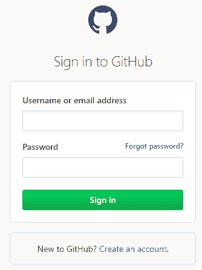

1.  登录后，在页面右上角点击“+”按钮，然后点击“新建仓库”，如下图所示：


1.  在下一个页面，为你的仓库命名并可选择性地添加描述。然后，勾选“初始化仓库并添加 README”，接着点击“创建仓库”按钮：

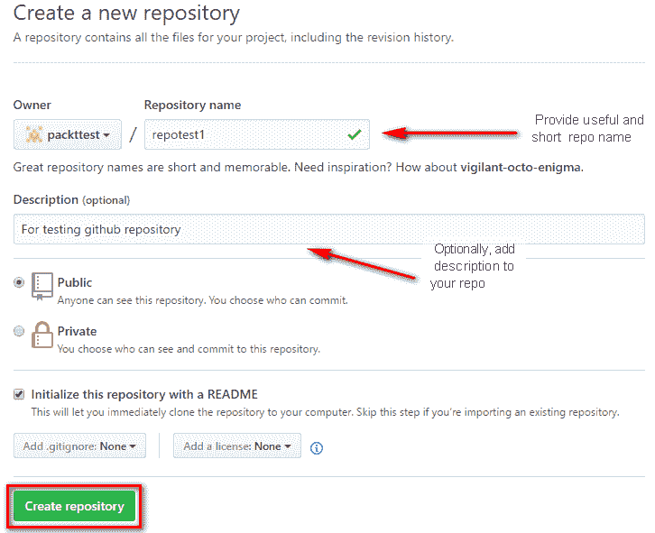

就这么简单，你可以为你的项目创建一个新仓库，现在可以推送代码并与团队中的其他人管理和共享它。

# 管理组织用户和团队

组织是多个共享账户和私有仓库的组合。拥有者或管理员可以管理对组织数据和项目的访问权限。

# 创建一个组织并邀请用户加入

按照以下步骤在 GitHub 上创建你的组织账户，并邀请用户加入你的 GitHub 组织：

1.  登录到你的 GitHub 账户，访问 [`github.com/login`](https://github.com/login)。

1.  登录后，点击你的个人资料照片，然后点击“你的个人资料”，如下图所示：

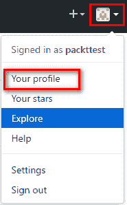

1.  在下一个页面，点击“编辑个人资料”按钮：

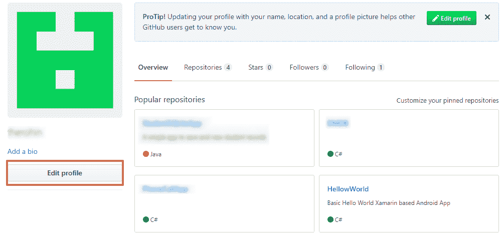

1.  在页面左侧，点击“个人设置”下的“组织”。然后，点击“新建组织”按钮以添加一个新组织：

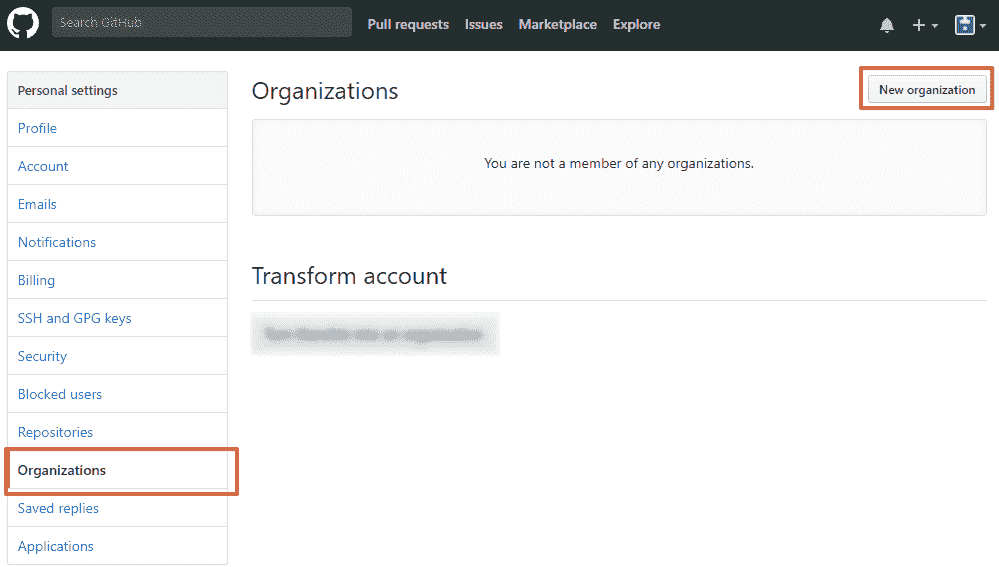

1.  在下一页面，提供组织的名称和电子邮件，并选择一个计划来创建组织账户：

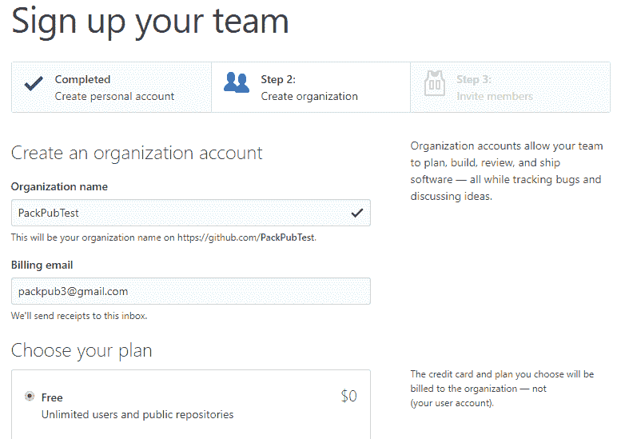

1.  点击“创建组织”按钮：


1.  组织创建完成后，你现在可以通过搜索用户名、全名或电子邮件来邀请 GitHub 用户加入你的组织。你也可以选择稍后邀请他们。点击“完成”来完成组织创建过程：

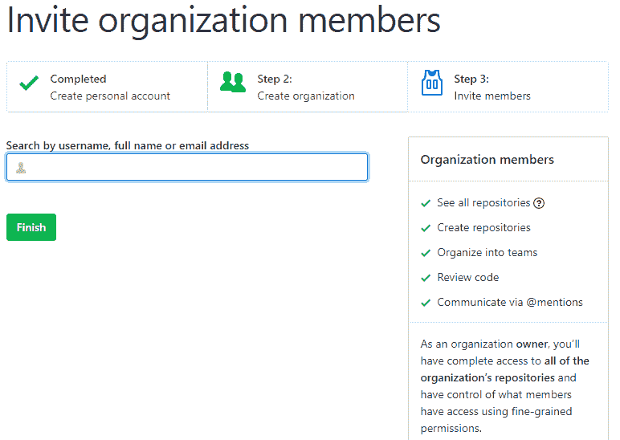

1.  被邀请的人会收到一封电子邮件，邀请他们加入该组织。他们需要接受邀请才能成为组织的成员。

通过遵循之前的步骤，你应该能够在 GitHub 上创建组织账户并邀请成员加入该组织。此外，你还可以像为个人账户一样，为组织创建仓库。

# 创建团队并添加成员到团队

按照以下步骤在 GitHub 上创建团队并添加成员：

1.  进入组织页面，点击“团队”标签页，再点击“新建团队”按钮：

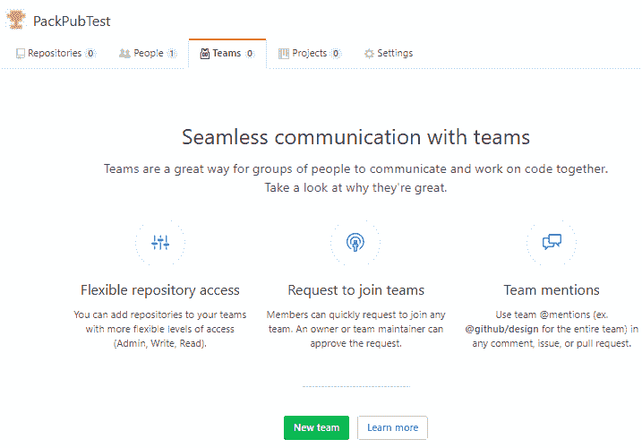

1.  提供要创建的团队的详细信息，然后点击“创建团队”按钮：

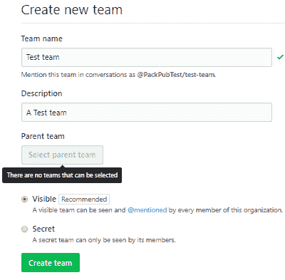

1.  团队创建完成后，进入“成员”标签页，添加成员到团队：

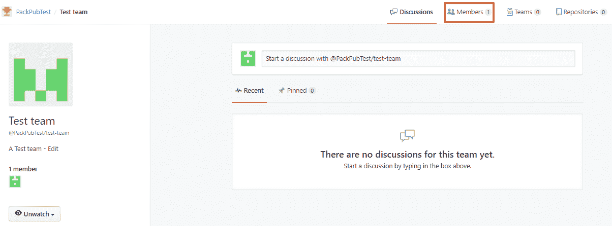

1.  点击“添加成员”按钮，向团队中添加新成员：

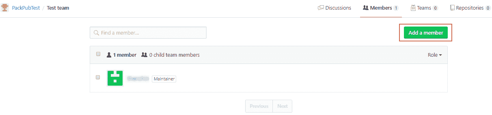

按照上述步骤，你将能够在 GitHub 上创建一个新团队并添加成员。

# 在不同服务器上安装 Git

本主题将讨论如何在不同操作系统（包括 Windows、Linux 和 Ubuntu）上安装 Git。

# 在 Windows 上安装 Git

在 Windows 上安装 Git 就像安装任何基于 GUI 的应用程序一样简单。按照步骤在 Windows 上安装 Git：

1.  要下载最新版本的 Git for Windows 安装程序，请访问 [`git-scm.com/downloads`](https://git-scm.com/downloads)。选择 Windows，下载将自动开始：


1.  下载完成后，启动安装程序文件。

1.  下一屏幕会要求你接受许可协议。点击“下一步”。

1.  提供 Git 安装路径；如果你愿意，可以保持默认路径不变，然后点击“下一步”。

1.  下一屏幕是选择你希望在系统上如何使用 Git。有多个选项可供选择。第一个选项让你通过 Git Bash 使用 Git，这是 Git 的命令行工具。第二个选项允许你在 Git Bash 和 Windows 命令提示符中都使用 Git 命令，这样非常灵活，能提高使用 Git 的便捷性。建议选择第二个选项，然后点击“下一步”：

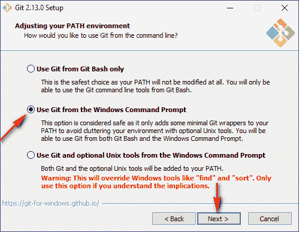

1.  接下来，我们将选择用于远程连接的 OpenSSH 客户端，这是 Git 的默认选项：

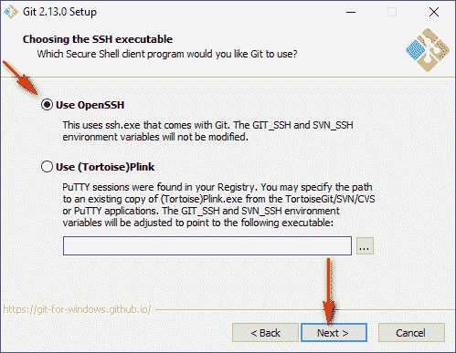

1.  选择用于 HTTPS 连接的 SSL 库。你可以保持默认设置，或根据需要进行更改；点击“下一步”：

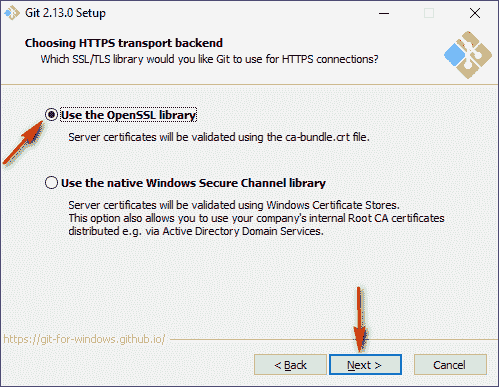

1.  选择 Git 在检出代码和提交时使用的行结束符样式。你需要做出选择，因为不同开发者可能使用不同的系统，如 Windows 和 Linux，行结束符样式在不同系统中有所不同。因此，始终建议保持提交时使用相同的行结束符样式：


1.  选择用于 Git Bash 执行命令的终端仿真器；MinTTY 更加灵活，并且是默认选项：

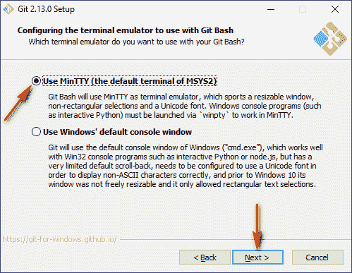

1.  在最后一步，选择你希望启用的所有功能，然后点击“安装”：

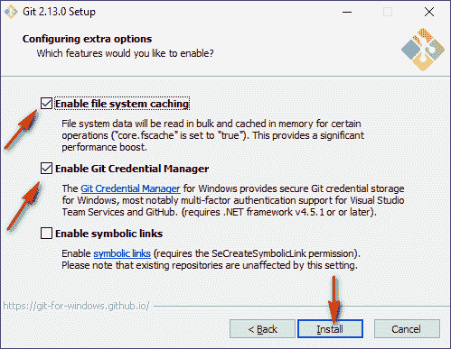

1.  一旦文件提取到`path`文件夹并完成安装，点击“完成”：

1.  现在，打开命令提示符或 Git Bash，运行以下命令来配置你的用户名和电子邮件：

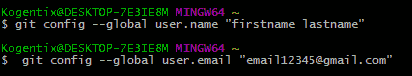

Git 安装已完成，且用户身份已配置为用于提交。

# 在 CentOS/RHEL 服务器上安装 Git

要在 CentOS 或 RHEL 服务器上安装 Git，请按照以下步骤操作：

1.  从你的 shell 中，使用 `yum`（或旧版 Fedora 上的 `dnf`）安装 Git：

```
$ sudo yum install git
```

或者：

```
$ sudo dnf install git  
```

1.  通过输入以下命令验证安装是否成功：

```
$ git --version  
```

1.  配置所有仓库的用户名和电子邮件地址：

```
$ git config --global user.name "firstname lastname"
$ git config --global user.email "email@gmail.com"  
```

1.  使用 `dnf`（或旧版 Fedora 上的 `yum`）安装必要的构建依赖：

```
$ sudo dnf install curl-devel expat-devel gettext-devel openssl-devel perl-devel zlib-devel asciidoc xmlto docbook2X  
```

或使用 `yum`-Epel 仓库：

```
$ sudo yum install epel-release
$ sudo yum install curl-devel expat-devel gettext-devel openssl-devel perl-devel zlib-devel asciidoc xmlto docbook2X  
```

1.  将 `docbook2x` 创建为 Git 构建期望的文件名符号链接：

```
$ sudo ln -s /usr/bin/db2x_docbook2texi /usr/bin/docbook2x-texi  
```

1.  克隆 Git 源代码（如果你还没有安装 Git 版本，请下载并解压）：

```
$ git clone https://github.com/git/git  
```

1.  要构建 Git 源代码并将其安装到 `/usr` 目录下，请运行 `make`：

```
$ make all doc prefix=/usr
$ sudo make install install-doc install-html install-man prefix=/usr  
```

按照之前的步骤将在 CentOS/RHEL 服务器上安装并配置 Git。

# 在 Ubuntu/Debian 系统上安装 Git

在 Ubuntu 系统上安装 Git，请按照以下步骤操作：

1.  从你的 shell 中，使用 `apt-get` 命令安装 Git：

```
$ sudo apt-get update
$ sudo apt-get install git  
```

1.  通过输入 `git --version` 验证安装是否成功：

```
$ git --version
git version 2.9.2  
```

1.  为单个仓库配置 Git 用户名和电子邮件：

```
$ git config --global user.name "firstname lastname"
$ git config --global user.email "email@gmail.com"  
```

1.  使用 `apt-get` 命令安装必要的依赖：

```
$ apt-get install libcurl4-gnutls-dev libexpat1-dev gettext libz-dev libssl-dev asciidoc xmlto docbook2x  
```

1.  克隆 Git 源代码（如果你还没有安装 Git 版本，请下载并解压）：

```
$ git clone https://git.kernel.org/pub/scm/git/git.git  
```

1.  要构建 Git 源代码并将其安装到 `/usr` 目录下，请运行 `make`：

```
$ make all doc info prefix=/usr
$ sudo make install install-doc install-html install-info install-man prefix=/usr  
```

至此，我们已经讨论了在不同平台上安装和配置 Git，包括 Windows、CentOS 和 Linux 系统。

# 配置 SSH 密钥

要为你的 GitHub 账户配置和设置 SSH 密钥，请按照以下步骤操作：

1.  检查是否已经有 `ssh` 密钥对。

1.  打开 Git Bash，输入 `ls -al ~/.ssh` 查看是否已存在 SSH 密钥：

```
$ ls -al ~/.ssh  
```

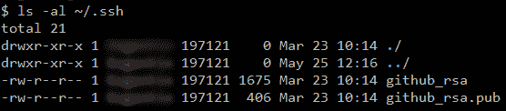

1.  公钥的扩展名是 `.pub`。创建一个新的密钥对（如果你已经有密钥对，可以跳过此步骤）。

1.  打开 Git Bash 并粘贴以下文本，替换为你的 GitHub 电子邮件地址：

```
$ ssh-keygen -t rsa -b 4096 -C your_email@example.com  
```

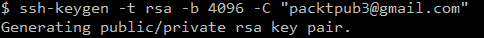

1.  当系统提示你 `Enter a file in which to save the key` 时，按 *Enter* 键接受默认的文件位置：

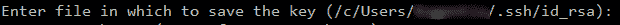

1.  当系统提示时，输入一个安全的密码短语（推荐），或者按 *Enter* 继续而不设置密码短语：

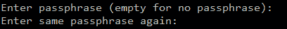

1.  整个设置过程将在以下截图中显示：

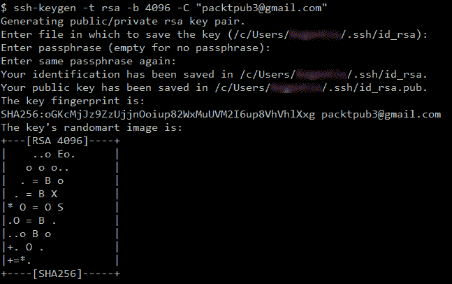

1.  将新创建的 SSH 密钥添加到 `ssh-agent` 中；为此，请确保 `ssh-agent` 正在运行：

```
$ eval $(ssh-agent -s)  
```

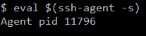

1.  将新创建的私钥添加到 `ssh-agent`。

1.  如果你使用不同的名称创建了密钥，或者你要添加的现有密钥使用不同的名称，请将命令中的 `id_rsa` 替换为你的私钥文件名：

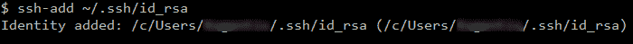

1.  要将 SSH 密钥添加到 GitHub 账户中，请下载/复制`~/.ssh/id_rsa.pub`中的公钥。

你也可以手动复制公钥，或者使用以下工具：

**Windows**:

`**$ clip < ~/.ssh/id_rsa.pub**` **Linux**:

`**$ sudo apt-get install xclip**`

`**$ xclip -sel clip < ~/.ssh/id_rsa.pub**`

**Mac**:

`**$ pbcopy < ~/.ssh/id_rsa.pub**`

1.  在 GitHub 页面的右上角，点击你的个人头像，然后点击设置：


1.  在个人设置侧边栏中，点击 SSH 和 GPG 密钥，然后选择新建 SSH 密钥：

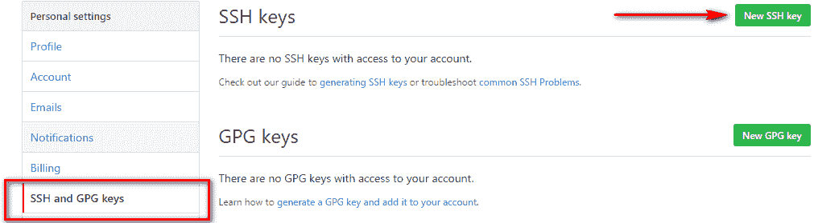

1.  在标题栏输入一个有意义的名称，并将你的密钥粘贴到密钥栏中。点击添加 SSH 密钥：

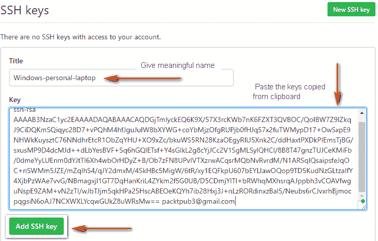

1.  当提示时，输入你的 GitHub 密码。

1.  新添加的 SSH 密钥将如下所示：

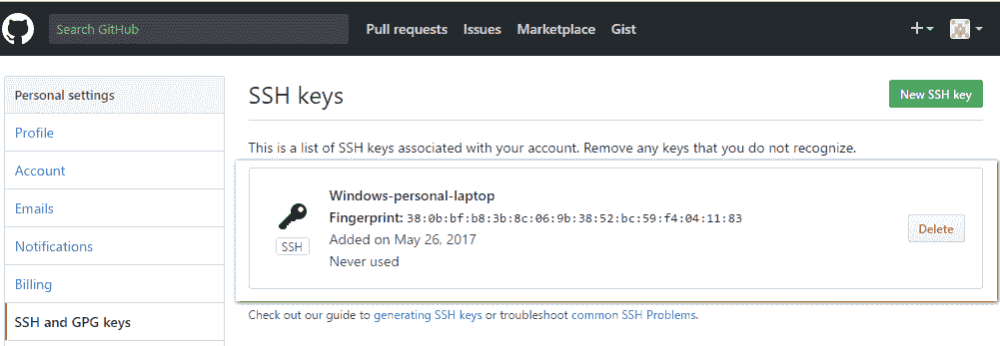

很好，现在你已经成功将 SSH 密钥添加到你的 GitHub 账户了！

# 总结

在本章中，我们详细了解了不同的版本控制系统和源代码管理。我们还深入探讨了如何使用 Git 创建仓库并管理团队和组织。在下一章，你将学习使用 Xamarin 进行跨平台应用开发，并使用 Visual Studio 进行开发。
