# 使用 Xamarin 进行跨平台移动应用开发

Xamarin 是一个平台，允许开发者通过使用相同的源代码和相同的**集成开发环境**（**IDE**），在 Android、iOS、Windows 及其他平台上创建跨平台应用程序。

# Xamarin 的历史

Xamarin 最初是作为一个实验开始的，旨在为 Linux 开发一个版本的.NET，始于 2000 年初，最初被称为一个名为**Mono**的开源项目。

后来，同一个项目由一个名为**Xamarin**的新公司开发和支持，该公司由 Mono 的最初开发者创建，也被称为**MonoTouch**和 Mono for Android。

Mono 的开发持续进行，后来更名为 Xamarin，支持 Android 和 iOS 应用程序开发。

Xamarin 现在已被微软收购，并作为微软提供的产品之一进行开发和支持，与现有的 IDE——Visual Studio 有很好的集成，甚至还有自己独立的 IDE，叫做 Xamarin Studio，适用于 Mac 和 Windows。

# 为什么你应该学习 Xamarin

事实上，Xamarin 可以在许多场景中拯救你的项目，在某些情况下，甚至可以节省数月的时间。

假设你有一个想要开发的移动应用的创意。当然，你希望尽快开发出来并推向市场。但在开始开发过程之前，有一些小挑战和决策你需要克服或决定。

让我们来看看这些挑战：

+   **选择目标移动平台**：这是我们应用程序规划阶段中非常重要的一部分。移动平台市场由主要玩家组成，如 Android、iOS 和 Windows。为了最大限度地发挥我们的应用程序的作用，我们希望它能够被大多数用户访问和使用。

+   **学习一个特定平台的编程语言，或让团队中有平台特定的开发者**：现在，假设你决定将目标定位于所有三个主要的移动平台。我们清楚地知道，我们需要为三个移动平台开发应用程序。在这种情况下，如果你是单独开发，那么你需要学习三种不同平台特定的语言。Android 有自己的官方 IDE，同样，苹果也有自己的 IDE 和编程语言来构建 iOS 应用程序，而 Windows 也有自己的开发工具。

+   **为每个平台花费时间和资源进行开发**：三个不同的平台，三种不同的语言，以及三种不同的 IDE。这将非常耗时，并且学习曲线将成为一个主要问题。或者，你有三个不同的开发团队来负责每个平台；那么，你将在开发上投入更多的资源。

+   **尽量保持每个平台上的应用一致的行为**：现在，假设你已经决定为应用程序开发使用多个资源。现在，所有不同的移动平台都有各种不同的用户交互方式，以及不同的用户界面设计方式。使用不同的团队开发不同平台的应用程序，有时会使同一个应用在这些平台上的用户体验大相径庭。

+   **为同一个应用维护所有平台特定的代码库**：一旦应用的初步开发完成，开发挑战就永远不会结束。每当你向应用添加新功能时，你将不得不将相同的更改和功能应用到所有三个平台特定的代码库，重复相同的业务逻辑，并在不同的 IDE 上以不同的方式开发相同的功能。

从前面的情境中，你可以看到，如今开发一个移动应用并不是那么简单直接的事，如果我们必须通过不同的编程语言和 IDE 来完成。

这大大增加了我们的交付时间，并且在时间、资源以及当然还有金钱上都非常昂贵。

为了解决所有这些挑战，Xamarin 来拯救我们。Xamarin 使开发者无需学习不同的编程语言和不同的 IDE。

不仅如此，我们还可以享受一次编写应用程序代码，构建到不同移动平台的好处。如果你已经是一个在.NET 框架上使用 Visual Studio 的 C#开发者，那么你简直是中了头奖。因为猜猜看，语言和 IDE 方面，这就是你开始使用 Xamarin 开发所需要的一切。

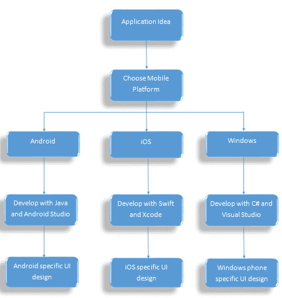

没有 Xamarin 的开发周期

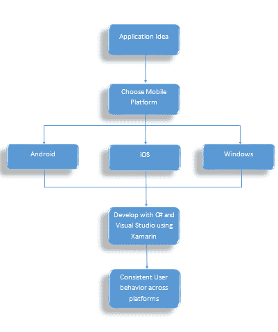

使用 Xamarin 的开发周期

# 使用 Xamarin 进行跨平台开发的好处

使用 Xamarin，开发者在移动应用开发的许多方面都变得更加轻松：

+   **语言**：最耗时的过程是不断学习新语言；Xamarin 让开发者摆脱了这个问题。你只需要有 C#经验，就能同时为 Android、iOS 和 Windows 开发——呼！

+   **IDE**: 学习新语言时会带来另一个额外负担：每次都需要适应一个新的 IDE。每当我们为不同的平台获取一个新的 IDE 时，我们旧的快捷键就不再有效，文件位置也发生变化，调试方式完全不同。所有这些问题都会增加开发时间。使用 Xamarin，你只需使用一个我们已经喜爱的 IDE——Visual Studio。

+   **一致的 UI 设计**：通常，我们希望我们的应用在所有移动设备上都看起来一样。我们不希望用户购买新手机后，发现同样用途的应用程序在用户互动上完全不同。为了实现这一点，Xamarin 提供了 **Xamarin.Forms**，以便在所有移动平台上开发一致的 UI 元素，为用户提供无缝的体验。

+   **代码复用**：Xamarin 允许我们在所有平台上共享业务逻辑代码。对于任何业务逻辑代码，我们只需要编写一次。

# 移动应用程序开发简介

在当今市场中，移动应用程序开发是任何产品开发的重要组成部分。本地移动应用程序将用户与应用程序的互动提升到了一个新的水平：

+   **始终触手可及**：本地移动应用程序与网页和桌面应用程序不同，始终存在于用户的手机中。用户可以随时选择不访问网页应用程序，这可能导致互动减少，但移动应用程序是由用户安装在手机上的，每当用户与手机互动时，开发者可以利用用户的活动，在多方面提升互动体验。可能性是无限的。

+   **了解用户行为**：移动应用程序可以利用用户在手机上的行为。我们可以监控用户的活动，例如走路、跑步、睡觉等，以获取个人用户分析和反馈。

+   **始终在线**：移动数据使用户能够在旅途中保持连接互联网，从而增加用户与应用程序互动的次数。移动数据为用户与互联网连接的应用程序提供了更高的连接性。

+   **利用尖端硬件传感器**：移动应用程序能够利用用户移动设备上可用的传感器，如 GPS、指纹识别、陀螺仪等等。

+   **个人互动**：移动设备对每个用户来说都是非常个人化的，与桌面和笔记本电脑设备不同。如今，个人助手和语音合成技术的世界正在使用户互动变得更加个性化和人性化，例如语音输入和语音操作。

# 移动应用程序开发的过程

和其他平台一样，移动应用程序开发包括几个关键步骤，这些步骤是创建完整且稳定的移动应用程序的过程，用户可以使用并喜爱：

+   **构思**：每个应用程序都是从一个小点子或一个待解决的问题开始的。一个能够解决用户问题的强大且有影响力的想法，最终会导致一个成功的应用程序。现在，比以往任何时候都更容易想到一个伟大的想法。我们使用移动设备并面临许多日常使用中的问题，或者有时会希望某个应用程序能够解决这些问题。正是这些，成为了伟大应用程序创意的源泉。

+   **规划**：规划是过程中的一个非常重要的部分。一个创意只有在执行得当的情况下，才算是好创意：

    +   上市所需的时间应该是多少？

    +   该应用应该是付费的还是免费的？

    +   我们应该针对哪个移动平台进行开发？

    +   应该使用哪些技术和工具？

所有这些问题的答案必须在规划阶段确定。

+   **设计**：这是应用程序开发的阶段，在这一阶段，我们的想法开始成型，能够看到应用完成后的样子。在开始编码之前，设计应用的线框图和布局是非常重要的。

+   **编码**：当我们进入编码阶段时，我们已经对目标方向和应用程序要实现的功能有了清晰的了解。因此，这使得编码阶段可以集中在实际的代码开发上。

+   **测试**：在各种移动设备上测试应用程序对于应用程序的稳定性至关重要。

+   **部署和持续反馈**：在将应用提交到商店后，持续监控用户反馈和报告，并根据反馈采取行动是非常重要的。

# Xamarin 支持的平台

正如本章前面提到的，Xamarin 允许开发者通过共享相同的代码为多个移动操作系统创建应用程序。以下是 Xamarin 支持的平台：

+   **Xamarin.Android**：Xamarin.Android 使我们能够使用 C# 构建原生 Android 应用程序。它使用 **即时编译**（**JIT**）编译器来优化应用程序的性能，并且包括所有可以在 Xamarin C# 代码中使用的 Android API。它适用于从 Android 手机到平板电脑，甚至是可穿戴设备。

+   **Xamarin.iOS**：与 Xamarin.Android 类似，Xamarin.iOS 提供了所有现有的 API，正如你猜到的，它们是 Apple's iOS SDK 中的 C# 版本。此外，Xamarin.iOS 使用 **预编译**（**AOT**）编译器将你的 C# 代码编译为本地 ARM 汇编代码。

+   **Xamarin.Mac**：Xamarin 不仅仅局限于移动平台；你还可以使用相同的代码库开发 Mac 应用程序。

+   **Xamarin for Windows**：由于 C# 是编写 Windows 手机和 Windows 桌面应用程序的默认语言，你甚至可以在移动应用和 **通用 Windows 平台**（**UWP**）应用之间共享代码。

# Xamarin 在 Visual Studio 中

Visual Studio 是编写 C# 代码的默认 IDE，尽管在使用 Xamarin 编写应用程序时，其他选项也可以选择。

还有其他选项，例如适用于 Windows 的 Xamarin Studio 和适用于 Mac 的 Xamarin Studio，如果你使用的是 Mac。不过，Xamarin Studio for Windows 已不再由微软支持，微软鼓励开发者改用 Visual Studio。对于 Mac 开发，你可以使用 Xamarin Studio for Mac。

本书将介绍在 Windows 上使用 Visual Studio 进行 Xamarin 开发，因为它是用于 C# 代码开发的最佳 IDE，并且提供了出色的 IntelliSense 支持。

# 扩展和插件

Visual Studio 支持使用 NuGet 包管理器的第三方库和本地库。它提供了从 Visual Studio 内部添加新插件和附加组件的功能。

Xamarin 是 Visual Studio 的扩展。你可以在安装 Visual Studio 时安装 Xamarin 组件，如下文所示。

# 在 Windows 上安装 Visual Studio 和 Xamarin

在 Windows 机器上安装 Visual Studio 和 Xamarin，请按照以下步骤操作：

1.  访问 [`www.visualstudio.com/downloads/`](https://www.visualstudio.com/downloads/)。

1.  当你在浏览器中打开前述网址时，你会看到如下画面：

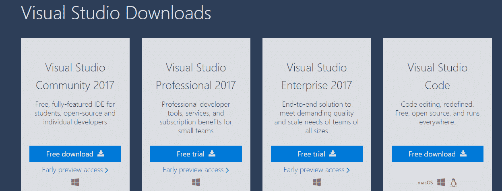

1.  你会看到有多个 Visual Studio 版本供开发者选择。

1.  你可以选择最适合你需求的版本。如果你只是想使用 Visual Studio 学习 Xamarin，或者你是一个寻求免费版本的个人开发者，那么 Visual Studio Community Edition 是最适合你的版本。

1.  点击在 Visual Studio Community 2017 下提供的“免费下载安装”按钮。

1.  你应该会在计算机上下载到一个 Visual Studio 安装程序文件。

1.  打开安装程序文件后，你应该会看到如下画面：

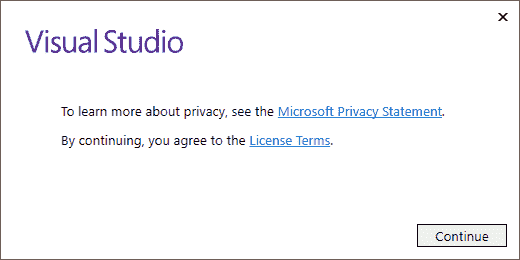

1.  点击“继续”按钮开始安装过程。

1.  加载可用安装程序可能需要一些时间，你可能会看到以下屏幕：

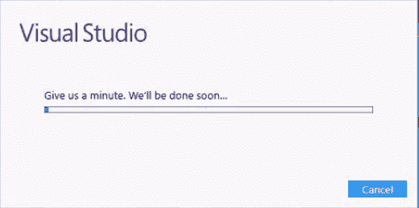

1.  下一个屏幕会让你选择工作负载：

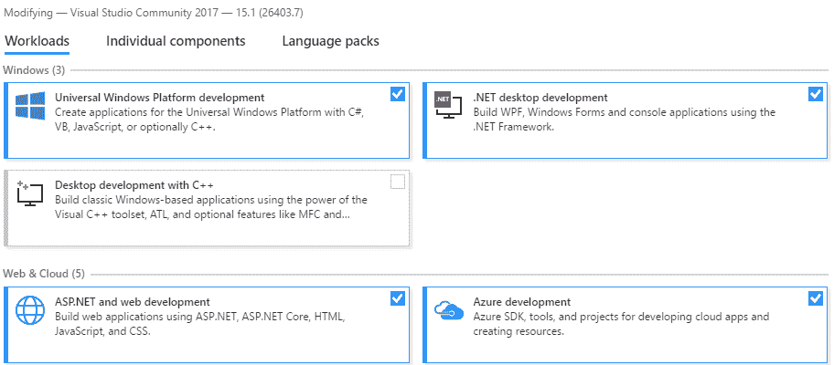

现在，如果你是 Visual Studio 2017 的新手，你可能会发现安装过程与之前的版本有所不同。工作负载是 2017 新增的，它们代表了用于不同开发目的的不同包。例如，如果你计划仅为 .NET 桌面应用程序编写代码，那么你只需选择该工作负载并跳过其他工作负载。

Visual Studio 2017 安装程序中的这种变化是一个很好的方式，可以避免安装我们在开发中可能不会用到的组件，只选择需要的工作负载来安装必要的组件。这为我们的笔记本节省了大量的时间和空间。

1.  在我们的 Xamarin 开发中，我们需要一个工作负载来安装移动开发所需的 Xamarin 工具和语言。如果你在这个菜单中稍微向下滚动，你会找到一个名为“移动与游戏”的部分：

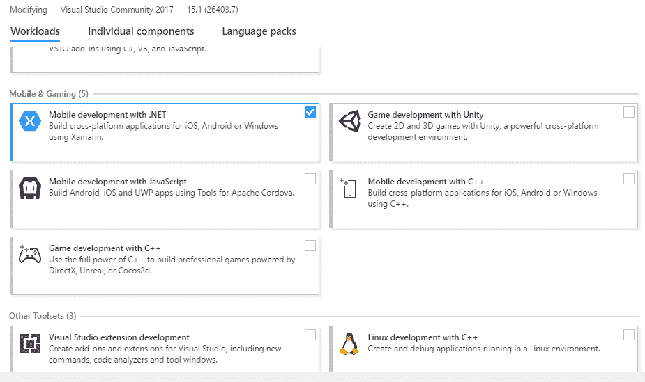

1.  在“移动与游戏”类别下，第一个选项也是我们教程中唯一需要的选项是 Xamarin 移动开发与 .NET。

1.  选择第一个选项，在右侧面板中你会看到此工作负载中包含的所有包。Visual Studio 安装程序还会在右下角显示工作负载的大小。选择后，点击“安装”按钮开始安装过程。

1.  这将开始下载所有列出的包，然后将它们安装到你的计算机上。Xamarin 包的大小超过 30 GB，下载和安装这些包可能需要一些时间，具体取决于你的互联网速度。

1.  一旦安装程序完成所有必需包的下载和安装，你将看到如下界面：

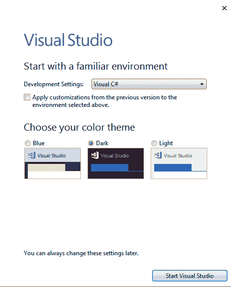

1.  就这样，恭喜你成功安装了 Visual Studio 和 Xamarin。现在，选择开发设置中的 Visual C# 和你喜欢的 Visual Studio IDE 主题颜色，点击 Start Visual Studio 按钮。

1.  安装完成后，让我们验证 Xamarin 是否与 Visual Studio 一起安装。

1.  点击 Tools 菜单并选择 Extensions and Updates。

1.  在 Installed 部分，向下滚动以查找已安装的 Xamarin for Visual Studio、Xamarin.Android SDK 和 Xamarin.Apple SDK：

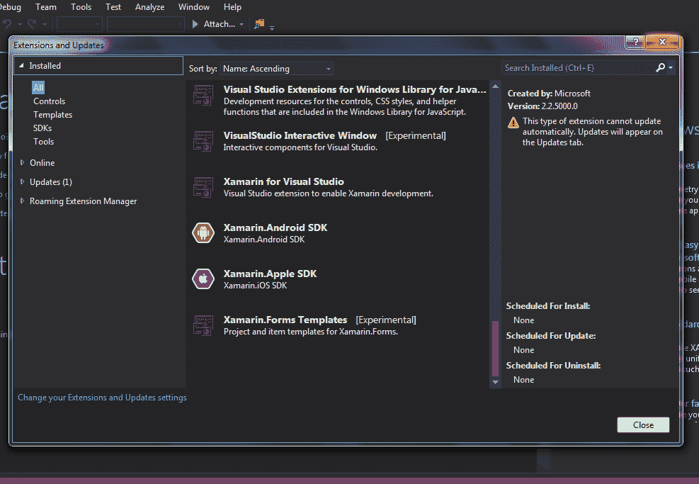

1.  现在我们已经验证了安装，接下来在开始编码之前，我们还有一些最后的步骤。本书将聚焦于 Android 应用开发过程，以帮助你更好地了解 Xamarin 的工作原理。

1.  让我们利用已经与 Xamarin 一起安装的 Android SDK 管理器来更新所有 Android 包。

1.  打开 Tools | Android | Android SDK Manager：

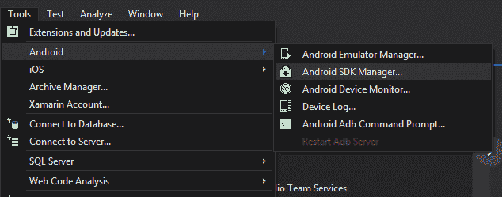

1.  这将打开 Android SDK 管理器的新窗口：

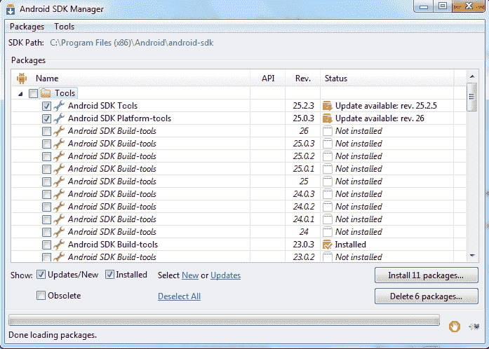

这里我们可以看到已安装基本包的可用更新。

1.  让我们点击安装 11 个包。

1.  这将为你提供一个新窗口，你需要接受要下载的包的许可协议。根据不同的包，某些许可可能需要单独选择。一旦所有包上都有绿色勾选，点击安装。根据你的网速，更新所有包可能需要一些时间：

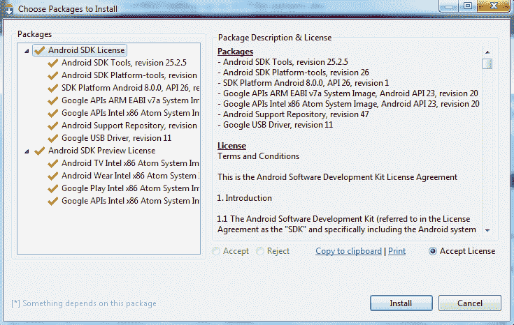

一旦一切都更新完毕，我们将继续设置我们的 **Android Virtual Device**（**AVD**）以便在开发环境中测试我们的应用。

# 设置我们的 Android 虚拟设备进行开发

Android 模拟器将使我们能够在计算机上测试 Android 应用，我们无需实际设备进行测试。

1.  让我们点击 Tools | Android | Android Emulator Manager：

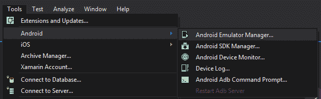

1.  为了简化这个过程，我们将从现有的适用于 Android 模拟器的移动模板开始。

1.  转到以下屏幕中显示的设备定义选项卡。进入设备定义屏幕后，向下滚动直到你看到 Nexus 设备：

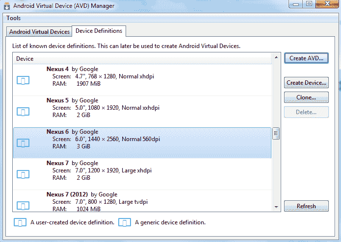

1.  选择你喜欢的 Nexus 设备，并点击右侧的 Create AVD 按钮。

1.  接下来，你应该会看到如下窗口，在这里你可以根据自己的需求自定义 Android 模拟器：

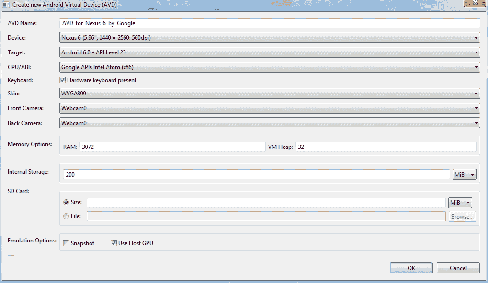

1.  填写所有必需的详细信息。你可以参考前面的截图帮助你。一旦点击 OK，AVD 管理器将为你创建一个新的 Android 模拟器。

1.  为了验证我们的模拟器是否已创建，让我们回到 Android 虚拟设备（AVD）管理器中的 Android 虚拟设备选项卡，我们可以在列表中找到新创建的 AVD：

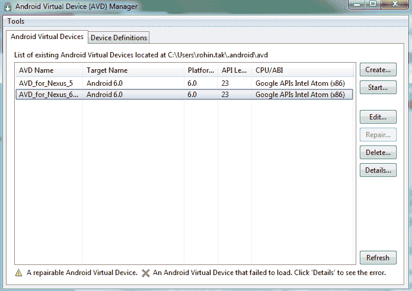

1.  您一定迫不及待想要启动这个 AVD，看看它的外观和表现如何。那么，让我们不再等待，选择 AVD 并点击启动按钮。

1.  在 AVD 管理器启动 AVD 之前，它会给我们一些启动选项，类似于以下截图所示的内容：

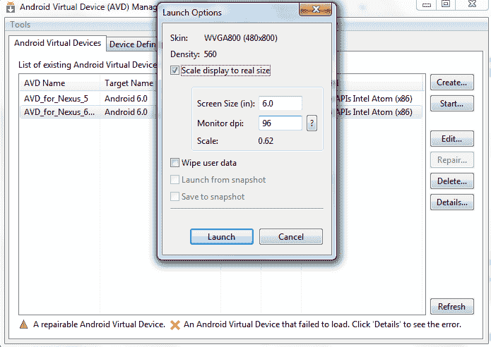

1.  在这里，您可以将显示大小调整为我们之前选择的模板的实际手机大小（本例中为 Nexus 6）；完成后，点击启动。模拟器可能不会启动。看到这个错误非常重要，它有助于我们理解 AVD 需要在 x86 环境中运行的要求。

现在，在 x86 环境中启动 Android 模拟器有一些先决条件；其中一个主要要求是必须启用虚拟化技术（Intel VT-x）。

1.  在运行模拟器之前，我们需要检查机器的 BIOS 是否启用了 VT-x。我们的机器必须启用 Intel VT-x，如果机器上安装了 Hyper-V，也需要将其卸载。

1.  否则，您将看到类似这样的屏幕，说明在启动模拟器时出现了问题：

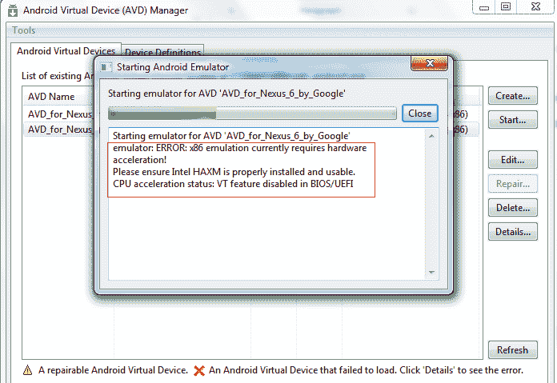

在前面的截图中，我们可以看到 VT 功能在 BIOS/UEFI 中被禁用。

1.  要启用 VT/VT-x，请进入 BIOS，您应该会看到一个选项来启用虚拟化技术（VT-x）。我们不会详细讲解如何操作，因为不同的机器设置方法不同。

1.  除了启用 VT，我们还需要检查 Hyper-V 是否已安装在机器上。为此，请按照以下步骤操作：

    1.  打开控制面板。

    1.  点击“程序”：

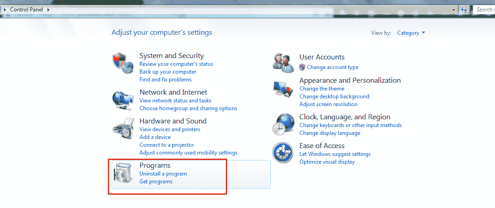

1.  1.  点击“打开或关闭 Windows 功能”：

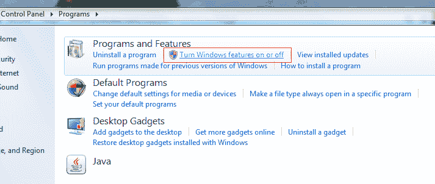

1.  1.  向下滚动查看是否能在程序列表中找到 Hyper-V：

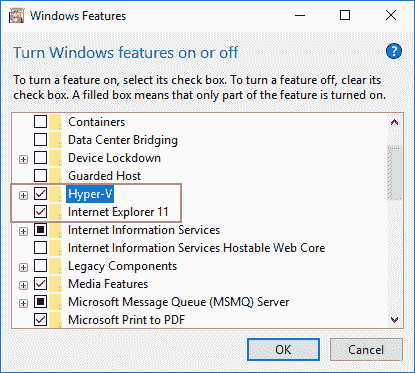

1.  1.  如果 Hyper-V 已选择，请取消选择它。点击确定。

    1.  这可能会重启您的系统。

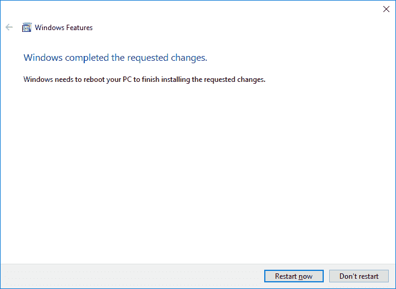

1.  1.  这应该会移除 Hyper-V，最后一切准备就绪。

1.  让我们回到 Visual Studio 启动我们的 AVD。这次，模拟器成功启动，界面如下：

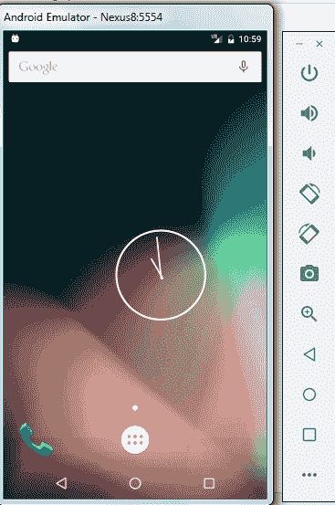

1.  如果您的 AVD 看起来与前面的截图不一样，请返回并编辑 AVD，将皮肤更改为“无皮肤”。

太棒了！现在我们有了正在运行的 Android 虚拟设备，可以开始使用 Xamarin 编写我们的新 Android 应用程序了。

# 总结

在这一章中，我们了解了 Xamarin 的简短历史，并探讨了为什么它是开发人员进行跨平台移动应用开发的绝佳工具。

我们还了解了如何在 Windows 机器上安装 Visual Studio 和 Xamarin，以及如何创建 AVD 来测试我们的应用。

在下一章，我们将学习基本的应用程序基础知识，并使用 Xamarin 创建我们的第一个 Android 应用程序。
