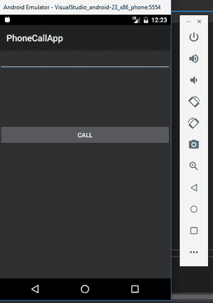
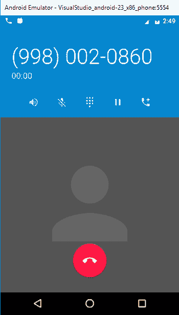
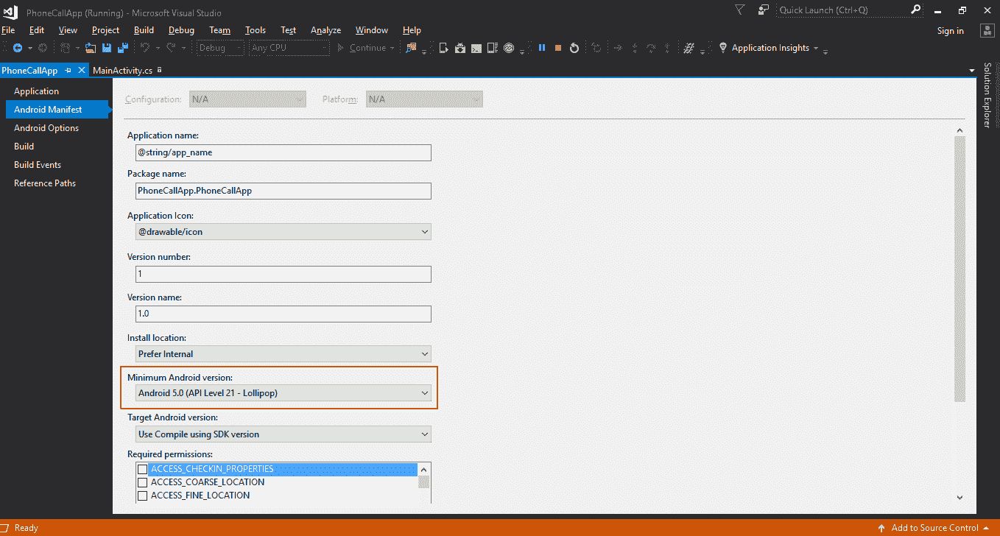

# 第四章：使用 Xamarin 编写您的第一个 Android 应用

现在，Visual Studio 已经安装在你的 Windows 机器上，开发环境已经准备好，**Android 虚拟设备**（**AVD**）也已经就绪，我们可以开始第一个 Android 应用的开发了。

在本章中，我们将使用 Xamarin 在 Visual Studio 中构建我们的第一个 Android 应用，同时学习 Android 应用开发的一些基础知识。

# 创建你的第一个 Android 项目

在 Visual Studio 中创建一个新的 Android 项目，按照以下步骤操作：

1.  点击 文件 | 新建 | 项目：


1.  从左侧面板中点击 Android，然后选择空白应用（Android）：


1.  在名称部分，为项目命名，选择项目的首选位置，然后点击 OK 按钮。你将看到如下截图：


恭喜，你已经在 Visual Studio 中创建了第一个 Android 项目。

# Xamarin 解决方案结构

一旦项目创建完成，你将看到如下截图所示的解决方案结构：


目前我们需要理解的解决方案的主要部分如下：

+   **引用**：此部分列出了项目所需的所有库。正如我们在前面的截图中看到的，它引用了 `Mono.Android`，这是 `Xamarin.Android` 的库。

+   **资源**：它包含所有的资源，例如图片、布局等等。

+   `MainActivity.cs` 文件包含了我们用于处理事件和其他事项的 C# 代码。

# 为应用程序创建 UI

1.  让我们展开在前一截图中看到的 `Resources` 文件夹，然后展开解决方案资源管理器中的 `layout` 文件夹。双击 `Main.axml` 以打开它。这是应用程序屏幕的布局文件。默认情况下，它会在 Android 设计器中打开；你也可以点击底部的 Source 标签查看其 XML 代码。这个布局文件是我们将添加 UI 控件的主要文件，也是我们运行应用程序时看到的界面：


现在，让我们添加一个输入框来输入电话号码。从工具箱（左侧面板）中拖动“Phone”字段到 `Main.axml` 文件的设计视图中：


拥有电话号码文本框的好处是可以限制用户只输入电话号码。同时，当用户点击输入框时，他们只会看到数字键盘，而不是完整的文字键盘。

现在，我们已经为用户添加了一个输入框，用来输入电话号码，以便拨打电话。

为了从 C# 代码中识别这个字段并插入一个值，我们需要为它指定一个唯一的 ID。

1.  在设计表面上选择电话文本字段时，使用右侧的属性面板将电话号码输入字段的 ID 属性更改为 @+id/PhoneNumber，如下图所示：


现在，我们已经添加了输入字段，用户可以在其中输入电话号码，接下来我们需要一个按钮来执行拨打电话的操作。

1.  从工具箱左侧窗格中的表单小部件拖动一个按钮到 `Main.axml` 的设计视图中：


与输入字段类似，我们需要给按钮赋予一个唯一的 ID，这样我们的 C# 代码才能识别按钮何时被点击，并采取适当的行动；即拨打用户输入的号码。

此外，按钮上的文本应该写成 `Do you want to call`，对吧？那么我们在下一步中也要做这个修改。

1.  在设计器中选择按钮，进入右侧的属性窗口，向下滚动并将 ID 更改为 @+id/CallButton，文本更改为 CALL，如下图所示：


现在，我们的应用程序的基本 UI 已经准备就绪，所有字段和按钮都有了适当的 ID。

现在是时候转到我们的 C# 代码，将 UI 与后端代码连接起来，以执行某些操作。

当用户打开应用程序时，`MainActivity` 会被打开，并且与之关联的是 `Main.axml` 文件。

我们稍后将详细了解 Activities；现在，让我们编写代码来处理 `MainActivity` 中的交互。

# 处理用户交互

用户交互是开发移动应用程序最重要的方面。一个移动应用程序应该是互动的且易于使用的。

在这个基本应用程序中，我们将用 C# 编写用户交互代码，并将其作为 `MainActivity.cs` 文件的一部分：

1.  让我们点击左侧解决方案资源管理器中的 `MainActivity.cs` 文件并打开它：


它有一些自动生成的代码，我们将修改这些代码，以便使我们的应用程序正常工作。

1.  我们需要在 `MainActivity.cs` 文件的 `OnCreate()` 方法中编写代码：


在我们开始编写用户交互代码之前，先理解一下自动生成的代码：

```
base.OnCreate(savedInstanceState); 
```

这段代码调用了 `MainActivity.cs` 的父类/基类 `Activity.cs` 的 `OnCreate()` 方法。

```
SetContentView(Resource.Layout.Main); 
```

正如注释所说，它设置了来自我们布局资源文件 `Main.axml` 的视图。

我们需要编写 `SetContentView(Resource.Layout.Mai)` 代码。

1.  首先，通过 Android Designer 获取在 `layout` 文件中创建的控件引用，也就是电话号码输入框和拨打电话的按钮。

在 `OnCreate()` 方法中添加以下代码：

```
EditText phoneNumberInput = FindViewById<EditText>(Resource.Id.PhoneNumber);         Button callButton = FindViewById<Button>(Resource.Id.CallButton); 
```

1.  现在，我们已经获得了控件的引用，可以编写事件来在点击 CALL 按钮时执行操作。让我们为 CALL 按钮的点击编写一个事件：

    1.  输入`callButton.Click +=`（IntelliSense 将为您提供一个建议，按*Tab*键即可）。

    1.  按下*Tab*键以自动完成。

    1.  这将创建一个名为`CallButton_Click`的方法。

    1.  我们将使用这个新创建的方法来编写按钮点击的代码，代码如下：


1.  因为我们将`Click`事件写在了一个单独的方法中，接下来让我们在类的全局作用域中声明按钮和输入框变量，这样类中的所有方法都可以访问它们的引用。请在类级别声明以下变量：

    +   `EditText phoneNumberInput;`

    +   `Button callButton;`

1.  `OnCreate()`方法现在应该如以下截图所示：


1.  1.  在`CallButton_Click`方法中，我们获取用户在输入框中插入的值：

```
var phoneNumber = phoneNumberInput.Text; 
```

1.  1.  接下来，我们创建一个警告对话框，在实际拨打电话之前请求用户确认。要创建该对话框，请编写以下代码：

```
var callDialog = new AlertDialog.Builder(this); 
```

1.  1.  我们需要在此对话框中设置两件事：

        1.  显示给用户的消息：

```
callDialog.SetMessage("Do you want to call " + phoneNumber + "?");
```

1.  1.  1.  对话框的 OK 和 Cancel 按钮的事件：

```
callDialog.SetMessage("Do you want to call " + phoneNumber + "?"); callDialog.SetNeutralButton("Call", delegate {
var callIntent = new Intent(Intent.ActionCall);
callIntent.SetData(Android.Net.Uri.Parse("tel:" + phoneNumber));
StartActivity(callIntent);
});
callDialog.SetNegativeButton("Cancel", delegate { });
```

1.  1.  进行一些修改，使代码看起来像下面的截图：


1.  处理用户交互的代码现在已经完成；让我们从顶部选择模拟器并运行应用程序：


第一次运行项目并在模拟器上部署可能需要一些时间，请耐心等待并让它完成部署。

1.  一旦应用程序部署完成，您应该能够在模拟器上看到应用程序正在运行：



正如我们在前面的截图中看到的，用户界面是我们在`Main.axml`布局文件中创建的。

让我们测试我们编写的处理用户交互的代码。

1.  点击 CALL 按钮时不输入任何号码：


我们将看到一个`toast`，如前面的截图所示，因为我们写了一个条件来检查输入号码字段中的空值或空格。

对于没有输入的情况，我们编写了以下代码来显示一个`toast`：

```
var toast = Toast.MakeText(this, "Please provide number", new ToastLength());
toast.Show();
```

1.  让我们在文本输入框中输入一个电话号码，然后按 CALL：


根据我们的代码，应该会弹出一个对话框，显示“是否要拨打 9980020860?”。

1.  点击 Cancel 按钮应该仅关闭对话框。现在点击 CALL：


如果一切顺利，应该会拨打前面的号码。但一旦我们点击 CALL 按钮，这并不是发生的事情。

1.  会抛出一个`java.Lang.SecurityException`异常：


我们遇到这个异常的原因是因为 Android 应用程序需要权限才能执行某些操作和任务。

这些权限应该在 Android 应用程序代码中列出，以便系统在安装前知道应用程序所需的所有权限。

这些权限会在安装时显示给用户；如果用户允许该应用程序执行这些操作，则应用程序才可以执行这些操作。因此，接下来我们需要做的是为 Android 应用程序添加权限。

# 向 Android Manifest 添加权限

目前我们的应用程序只需要一个权限，那就是拨打电话。要修改或添加应用程序权限，我们需要编辑 Android Manifest。

1.  要编辑 Android Manifest 并授予权限，请按照以下步骤操作：

    1.  打开解决方案资源管理器。

    1.  双击项目下的属性。

    1.  这将打开一个用于编辑项目属性的界面。

    1.  现在，从左侧菜单中点击 Android Manifest 以打开它：


1.  在“所需权限”部分，向下滚动，找到 CALL_PHONE 权限，并选择该选项：


1.  1.  按*Ctrl* + *Shift* + *S*保存项目的所有更改。

    1.  关闭属性窗口。

    1.  我们已经完成了应用程序权限的添加。

    1.  现在我们需要构建解决方案，以便生成的安装文件包含我们所做的所有更改。

1.  重新构建项目；右键单击解决方案 | 重新构建解决方案：


1.  如果一切正常，我们应该能够在输出窗口看到重建成功；如果遇到错误，请返回到前面的步骤，比较代码并重新构建：


# 为 Android 应用添加图标

应用程序权限已设置完毕，准备运行，现在让我们为应用程序添加一个图标：

1.  下载一个你喜欢且最适合你的电话应用程序的图标文件。

1.  转到解决方案资源管理器，将下载的文件添加到 `Resources` 下的 `drawable` 文件夹中。

1.  右键单击 `drawable` | 添加 | 现有项，如下图所示：


1.  将打开文件资源管理器窗口。导航到图标文件的位置，选择图标文件，然后点击添加：


1.  图标现在应该已经添加到项目的 `drawable` 文件夹中了：


1.  右键单击文件并点击重命名，将图标文件重命名为 `icon.png`：


1.  重命名文件后，像之前一样重新构建项目。

1.  一旦重建成功完成，我们来为应用程序的 Manifest 文件添加图标。

1.  从解决方案资源管理器中双击属性并打开 Android Manifest。

1.  从应用程序图标下拉菜单中选择 @drawable/icon：


1.  按 *Ctrl* + *Shift* + *S* 来保存所有内容并重建解决方案，以确保一切正常运行。

1.  现在，让我们在模拟器中运行该应用。

1.  如果我们进入应用抽屉并向下滚动至应用名称，我们可以看到我们刚刚添加的应用图标，现在显示在那里：


1.  恭喜你，已经成功为新的 Android 应用添加了图标。

1.  现在我们已经在清单文件中添加了权限和图标，是时候测试应用的主要功能——*拨打电话*了。

# 测试用户交互

在 Android 模拟器中点击应用并运行它。重复之前测试应用的步骤，最后按下 CALL 按钮拨打电话：


这次，应用已经具有了所需的权限，我们已编写代码来处理 CALL 按钮的交互，并且我们在 `MainActivity.cs` 中创建了一个 `callIntent` 来拨打电话。

因此，应该通过点击 CALL 按钮来拨打电话，我们应该看到如下截图所示的屏幕：



太棒了！你刚刚使用 Xamarin 和 C# 在 Visual Studio 中创建了你的第一个 Android 应用。

既然我们已经完成了困难的部分，接下来让我们了解一下我们刚刚开发的 Android 应用的基础知识，看看它是如何结合在一起的。

# 应用基础知识

在解释 Android 应用基础知识时可以涉及许多主题。但是对于本书的范围，我们将尝试了解我们在开发 **PhoneCallApp** 时使用的最重要的一些主题：

+   **Android API**：Android 为不同版本的 Android 提供了不同的 API 级别。这些 API 级别基本上说明了我们的代码使用了哪个版本的 Android 库，并且我们的应用与哪些版本的 Android 操作系统兼容。

开发 Android 应用时需要指定不同的配置。这些配置包括：

+   +   目标框架

    +   最低 Android 版本

    +   目标 Android 版本

你将更详细地了解这些配置。

+   **资源**：资源封装了许多在 Android 中用于构建更好 Android 应用的特性。一个 Android 应用使用许多资源，例如：

    +   我们使用的图标

    +   用于为用户创建 UI 的布局文件

    +   用于存储应用本地化/国际化字符串的字符串文件，等等

+   **活动**：活动是 Android 应用的主要构建模块。每个 UI 元素及其交互都与一个活动关联。每当我们点击一个按钮并打开新页面时，都会调用一个新的活动，控制权也随之转移。

一个 Android 活动可以有不同的状态，取决于当前正在执行的操作。我们将在未来的主题中更详细地学习活动。

# Android API

Android API 以 API 级别来标识，例如 API 级别 23。

API 等级代表特定的 Android 版本。如果您在 Visual Studio 中打开 Android SDK 管理器，您将看到如下界面：


每个 API 等级特定于一个 Android 发布版本。一个 Android 版本通常有多个名称：

+   API 等级，例如 API 等级 23

+   Android 版本，例如 Android 6.0

+   代号，例如 Marshmallow

因此，我们可以说 API 具有整数值，用于标识版本发布，因为每次发布时此 API 等级都会发生变化，而用户会在发布新版本时更新他们的 Android 版本。

一个 Android 应用程序应该能够在不同的 API 上运行，并与之前的版本兼容，以便旧设备也能运行应用程序，且当用户将操作系统版本更新到新版本时，现有应用不会在他们的手机上崩溃。

为了支持多个 API 等级，Android 项目属性有配置项来定义：

+   **目标框架**：此设置可以在属性中的应用菜单下找到。此设置告诉`Xamarin.Android`使用特定的 API 等级库来编译项目。在编译/构建应用程序时，`Xamarin.Android`使用此设置中指定的 API 等级来加载库并构建应用程序：


+   **最低 Android 版本/API 等级**：这是应用程序能够运行的最低 Android 版本；它告诉 Android 系统该应用程序是否支持特定的操作系统版本。指定较低的最低版本意味着您的应用程序可以安装在介于最低和目标版本之间的所有版本上。但要小心，因为即使应用程序已经编译并安装在较低版本的 Android 上，也不一定意味着它会成功运行。

可能有一些您的应用程序正在使用的高级 API，无法在较旧的版本上运行。此设置可以在属性中的 Android Manifest 下找到：



+   **目标 Android 版本/API 等级**：这是应用程序开发时所需运行的操作系统版本。Android 使用此配置来检查是否需要在运行应用程序时启用任何兼容性行为。此配置也可以在项目的属性中的 Android Manifest 下找到：


# 资源

当我们创建一个新的`Xamarin.Android`应用程序项目时，解决方案资源管理器中会创建一个名为`Resources`的文件夹：


让我们详细分析一下`Resources`文件夹的结构。

对于一个 Android 应用程序的结构，除了实际的代码之外，几乎所有内容都是资源。

**资源可以是以下任何一种，但不限于以下内容：**

+   图片

    +   应用程序中使用的任何图片或图标

    +   它们位于`drawable`文件夹中

+   应用视图

    +   应用程序的视图文件，也就是我们创建的`Main.axml`文件

    +   放在`layout`文件夹中

+   字符串

    +   这些是应用程序中使用的文本字符串

    +   例如，文本按钮上的 CALL 文本

    +   它有助于保持应用程序的一致性

    +   放在`values`文件夹中

**我们在应用程序中使用的资源**

我们在`Resources`文件夹中使用的主要文件如下：

+   `Icon.png`：我们下载并添加的应用程序图标。

+   `Main.axml`：我们应用程序的默认用户界面布局文件。我们只在设计器中编辑了这个文件，但你也可以打开该文件的 XML 视图，尝试理解 UI 元素使用的 XML 标签。

+   `Resource.designer.cs`：这个文件是由`Xamarin.Android`自动生成和维护的，包含分配给每个资源的唯一 ID。它是由`Xamarin.Android`工具自动创建的，并且会不定期重新生成。

这就是为什么我们要访问某些资源时，在 C#代码中使用以下代码的原因：

```
phoneNumberInput = FindViewById<EditText>(Resource.Id.PhoneNumber); 
```

请注意`Resource.Id.PhoneNumber`；这个信息基本上存储在`Resource.designer.cs`文件中，所有分配给资源的唯一 ID 都存储在这里。

# 理解活动（Activities）

活动（Activities）是 Android 应用开发中特有的概念。通常，在其他应用程序中，我们有一个入口点或一个主方法作为应用程序启动的入口。

但是在 Android 中，同样的目的由活动（Activities）来实现。Android 应用程序可以从任何指定为启动活动的活动开始，使用`MainLauncher`：


# 活动类

`Activity`类包含控制用户界面的代码。`Activity`类基本上负责创建 UI 并处理用户交互，例如按钮点击或触摸。

现在，让我们以我们的**PhoneCallApp**应用程序为例。我们在项目中只有一个`Activity`，那就是`MainActivity.cs`类。它是操作系统进入此应用程序的主要入口点，因为我们已经将其设置为`MainLauncher`：


如果我们仔细看，`MainActivity`类继承了`Activity`类，也就是说它是`Activity`类的子类。那意味着现在`MainActivity`也是一个`Activity`。

此外，值得注意的是，在`MainActivity`类上方定义了一个`Activity`属性，它指定了`Label`和`MainLauncher`属性。这个属性告诉 Android，`MainActivity`类是应用程序的一部分，并且由其 Manifest 进行管理。

通过继承`Activity`类，`MainActivity`可以访问`Activity`类中的方法，这些方法为开发者提供了在`MainActivity`不同状态下执行特定操作的能力，例如：

+   当一个活动被创建时

+   当一个活动被暂停时

+   当一个活动恢复时

在开发应用程序并编写`Activity`的代码时，如前所述，`Activity`类提供了一些方法，我们可以根据`Activity`的不同状态使用这些方法来执行操作。

# `Activity`类中的方法

+   `OnCreate()`：当用户点击应用图标启动应用程序时，调用此方法。此方法用于执行一些可能需要的初始设置，例如创建视图、初始化变量等：


让我们看看我们的应用程序代码，在这里我们使用`OnCreate()`方法进行了一些初始化和设置：


我们在`OnCreate()`方法中所做的事情包括：

+   +   设置视图的布局

    +   初始化变量以获取对`TextInput`和`CallButton`的引用

    +   将`Click`事件绑定到`CallButton`

+   `OnStart()`：系统会在`OnCreate()`方法之后立即调用此方法。

+   `OnResume()`：当应用程序重新启动并准备与用户交互时，系统会调用此方法。`OnResume()`很重要，因为在`OnPause()`中执行的任何操作应该在`OnResume()`中撤销，因为它是唯一一个在`OnPause()`之后执行并将`Activity`恢复到前台的生命周期方法。

+   `OnPause()`：当系统即将将`Activity`放入后台时，会调用此方法。它也是一个重要的方法，因为`Activity`应该执行某些任务，例如：

    +   保存未保存的更改

    +   释放资源，例如相机或其他资源


+   `OnStop()`：当`Activity`不再对用户可见时，会调用此方法。发生以下情况之一时，会调用该方法：

    +   按下返回按钮

    +   打开并将现有的`Activity`带到前台

    +   启动一个新的`Activity`，并覆盖当前的`Activity`


+   `OnRestart()`：如果一个`Activity`被停止然后再次启动，系统会调用此方法。

+   `OnDestroy()`：这是在`Activity`被销毁并完全从内存中移除之前调用的最终方法。它用于清理可能导致内存误用的资源。

为了更好地理解不同的`Activity`状态，让我们深入了解`Activity`生命周期。

# `Activity`生命周期

`Activity`生命周期通常通过`Activity`类中的一系列方法来定义，这些方法为我们提供了控制`Activity`状态的方式。这使得开发人员能够在 Android 应用程序中处理`Activity`。

让我们来看看`Activity`的不同状态：


这些状态可以分为以下四个主要组：

+   **运行**：如果某个活动位于前台，即位于活动堆栈的顶部，我们称其为活跃或运行活动。这被认为是 Android 中优先级最高的活动，只有在极端情况下，如活动尝试使用超过设备可用内存的情况下，操作系统才会将其终止，因为这可能导致应用程序界面变得无响应。

+   **暂停**：当一个部分活动位于当前运行活动之上时，它被视为暂停。暂停的活动仍然处于活动状态，即它们保持所有状态和成员信息，并保持在活动堆栈中。这被认为是 Android 中第二高优先级的活动，只有当终止该活动能满足保持活跃/运行活动稳定和响应所需的资源时，操作系统才会将其终止。

+   **停止/后台**：如果一个活动完全停止或被另一个活动接管，则该活动被视为停止或处于后台。停止的活动仍尽可能保留其状态和成员信息，但停止的活动在这三种状态中优先级最低。

+   **重启/恢复**：如果用户从另一个活动中返回到当前活动，或者通过点击应用切换器图标返回，它必须在暂停时恢复，或在停止时恢复到先前保存的状态，然后显示给用户。

这些类别是活动生命周期中不同状态的基本解释。

# 在移动设备上部署应用程序

到目前为止，我们已经在 Android 虚拟设备（Android 模拟器）上测试了我们的应用程序。但最好还是在物理设备上测试应用程序。因此，让我们学习如何设置一个真实的 Android 设备来进行应用程序测试。

本主题中显示的截图是在运行 Lollipop 版本的 Android 设备上拍摄的；您的设备设置可能会根据设备版本的不同而有所不同。

以下是设置设备进行调试的步骤：

+   **启用设备调试**：我们需要在设备上启用调试。默认情况下，无法在 Android 设备上调试应用程序。

+   **安装 USB 驱动程序**：在我们的 Windows 计算机上，我们需要为设备安装 USB 驱动程序。

+   **连接设备到计算机**：最后一步是通过 USB 数据线将设备连接到计算机。

# 启用设备调试

要在设备上启用调试，我们需要执行以下步骤：

1.  点击通知栏中的设置图标：


1.  打开设置。

1.  向下滚动到底部并点击“关于手机”：


1.  向下滚动至“版本号”。

1.  连续点击“版本号”七次，直到看到“您现在是开发者！”：


1.  返回设置菜单，向下滚动到最底部：

1.  你现在应该能够看到“开发者选项”菜单条目，位于“关于手机”之前：

1.  点击开发者选项：


1.  查找启用 USB 调试的选项并启用它：


# 安装 USB 驱动程序

对于不同的设备，可能需要安装不同的驱动程序才能使计算机识别设备。请确保所有设备驱动程序已正确安装，并且计算机可以正确识别你的设备。

如果你正在下载设备驱动程序并希望手动安装到计算机上，请按照以下步骤在 Windows 7 上执行：

1.  使用 USB 数据线将设备连接到计算机。

1.  右键点击桌面或 Windows 资源管理器中的计算机并选择“管理”。

1.  在左侧窗格中选择设备。

1.  在右侧窗格中定位并展开其他设备。

1.  右键点击设备名称并选择更新驱动程序软件。

1.  这将启动硬件更新向导。

1.  选择“浏览我的计算机以查找驱动程序软件”并点击“下一步”。

1.  点击浏览，定位到 USB 驱动程序文件夹。

1.  点击“下一步”以安装驱动程序。

# 将设备连接到计算机

如果你通过 USB 数据线将设备连接到计算机，**Android 调试桥**（**adb**）应该能够与设备通信，并且你应该在设备上看到“USB 调试已连接”的通知，如下图所示：


现在，你可以打开 Visual Studio，选择设备列表中的设备，并运行应用程序。这将把应用程序安装到你的设备并运行。

# 推送代码到 Git 仓库

应用开发完成。让我们将代码保存到 Git 仓库中，这样我们就可以从任何地方访问代码：

1.  在 Visual Studio 中，点击右下角的“添加到源代码控制”并选择 Git：


1.  点击连接 | 设置：


1.  点击全局设置：


1.  输入你的 GitHub 账户用户名和电子邮件，并点击更新：

1.  点击 Team Explorer 底部的上箭头图标（推送图标）。

1.  然后，点击“发布 Git 仓库”以推送到远程仓库。

1.  请注意，它说本地仓库没有配置远程仓库。这是因为我们还没有将远程 GitHub 仓库连接到本地项目：


登录你的 GitHub 账户并为你的项目创建一个空的 Git 仓库，正如我们在第二章《与代码仓库系统的工作》中所学，并将该 URL 复制到以下截图中的文本框：


1.  点击发布后，将打开一个新窗口，要求输入你的 GitHub 凭证：


1.  输入你的 GitHub 凭据进行认证，然后点击登录：

1.  登录成功后，代码将被推送到远程 Git 仓库，你应该会看到如下成功信息：


恭喜，你的代码已经成功推送到远程仓库，可以通过登录 GitHub 并访问仓库 URL 来查看。

# 总结

在本章中，我们学习了如何使用 Xamarin 和 Visual Studio 开发 Android 应用程序。我们还了解了一些 Android 应用的基本概念、Activity 及其生命周期。我们在模拟器上运行了应用程序，并设置了一个实际的物理设备来运行应用；最后，我们将代码推送到了 Git 仓库。

在下一章，我们将学习如何使用 Xamarin Test Cloud 实现持续测试。
