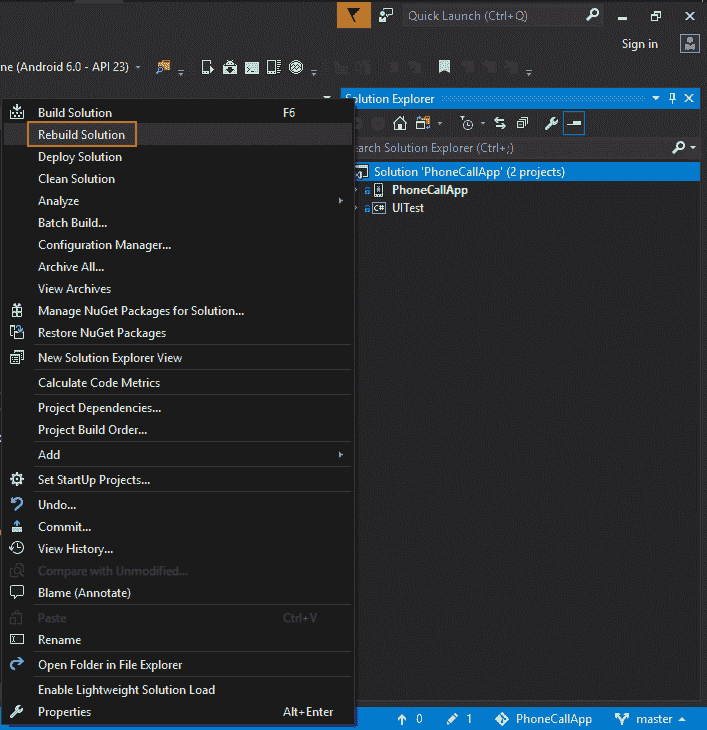
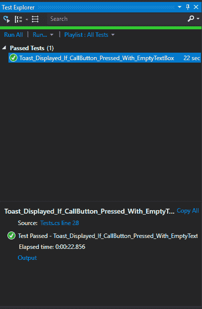
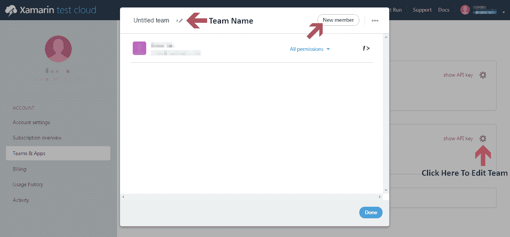
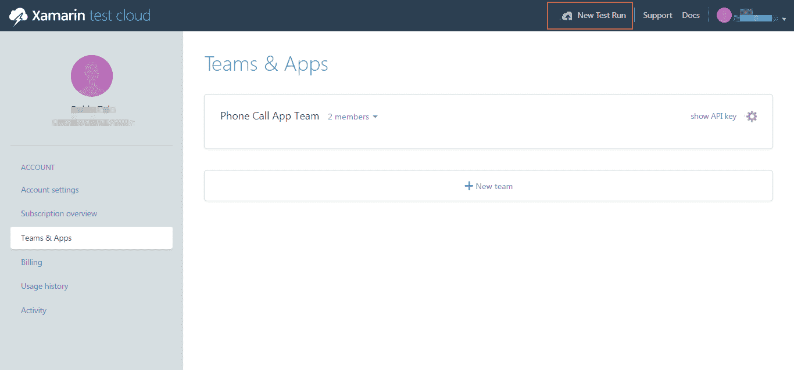

# 使用 Xamarin 实现自动化测试

在今天这个快速发展的世界里，应用程序需要尽可能快地交付，开发生命周期必须缩短以达到这一快速交付的目标。测试是软件开发中最重要的方面之一。

对于移动应用程序来说，它们需要在所有可能支持的设备上进行测试，以确保它们在所有目标设备上平稳运行。

让我们来看看本章中我们将要学习的内容：

+   自动化测试在 DevOps 循环中的重要性

+   使用 **Xamarin.UITest** 编写自动化 UI 测试

+   使用 Xamarin Test Cloud 在多个物理设备上测试应用程序

# 理解自动化测试在 DevOps 循环中的重要性

测试是应用程序开发中的一个重要因素。开发人员尽力开发一个平稳运行的复杂应用程序，但总会有一些开发人员无法预见的场景，因为只有在以最终用户的心态使用应用程序时，才可以进行测试。

尽管开发人员正在努力开发应用程序，但对应用程序进行以用户为中心的测试，并测试开发人员未曾想到的内容，至关重要。

测试人员的职责是确保应用程序按预期运行，并且一个功能不会影响应用程序中的其他功能。

虽然有人工测试员测试应用程序是件好事，而且确实能确保应用程序像真实世界中的最终用户一样被测试和使用，但仅依赖人工测试员测试应用程序并不是最好的选择。

# 测试移动应用程序

对于 Web 应用程序或桌面应用程序，测试的操作系统版本和设备数量非常少。

让人工测试员测试应用程序，找出应用程序中的不足和缺陷，并通知开发人员，通常是更简单的。

但是当涉及到移动应用程序时，情况完全不同。

如果我们只谈论一个 Android 应用程序，例如，来看看在测试中面临的挑战数量。

# 测试移动应用程序的挑战

在测试移动应用程序时面临许多挑战：

+   在真实环境中进行测试

+   经常部署和测试

+   持续反馈

# 在真实环境中进行测试

对于移动开发者来说，最重要的事情是确保最终的应用程序在所有目标设备上都能正常工作。在开发的最早阶段，使用模拟器或仿真器是可以的，但当应用程序变得更加复杂并且即将发布到市场时，唯一可接受的方式是通过真实设备测试移动应用程序：

# 经常部署和测试

移动应用程序几乎每周都会更新，或者至少每月更新两次。因此，它们需要更频繁地进行测试。

移动应用程序应该在每个夜间构建时进行测试，这样可以更早地发现缺陷并更快地修复它们。频繁而高效地测试相同的功能可能不是最佳解决方案，并且可能会拖慢交付过程。如果我们对重复任务有自动化处理，那将为我们节省大量时间，加速市场推广。持续开发和测试使得公司能够更快地向市场交付产品。

# 持续反馈

持续反馈与频繁部署和测试应用程序相辅相成。正如我们所学，手动完成重复任务的过程占用了大量时间，而这些时间本应节省下来以便更快地交付到市场。同样，来自测试和生产环境的持续反馈对于应用程序的质量至关重要：

为了克服移动应用测试中的所有挑战，我们需要采纳 DevOps 思维方式，将测试作为开发周期中自动化和集成的一部分，并使其在每次构建时自动执行（并向开发者反馈，以便他们在开发的早期阶段采取行动）。

# 使用 Xamarin.UITest 编写测试

在开始使用 Xamarin.UITest 编写 UI 测试之前，了解一下单元测试是什么，以及 Xamarin.UITest 将如何帮助我们实现移动应用程序自动化测试的目标，是很有帮助的。

# Xamarin.UITest

Xamarin.UITest 是一个基于 C#中流行测试库**NUnit**的测试框架。如果你以前在 C#项目中使用过 NUnit 进行单元测试，那么理解 Xamarin.UITest 会更加得心应手。但如果你没有 NUnit 的经验，也完全没问题。

它基本上是 C#的一组库（类似于 Java 的 JUnit），用于帮助编写单元测试。

使用 UITest 时，我们将为移动应用编写 UI 测试。

# UITest 基础知识

UITest，或者一般来说，任何基于 NUnit 的测试，都有一个明确的结构需要遵循：

+   **测试夹具**：测试夹具是一个包含测试的类，同时也进行任何测试执行前的初始化设置，或者任何在测试执行完毕后需要完成的任务。

+   **测试**：UITest 作为一种方法写在测试夹具类中

# 理解 AAA 模式

**Arrange-Act-Assert**（**AAA**）模式应该在编写 UITest 时遵循，以达到最佳效果并从测试中获得快速反馈。顾名思义，它包括三个步骤：

+   **安排**：顾名思义，这一步包含所有有助于安排测试的操作，例如初始化测试过程中后续所需的事物、设置环境等等。

+   **执行**：这是测试与应用程序进行期望交互的时刻，例如输入文本、点击按钮等。

+   **Assert**：Assert 是在我们的 UITest 中检查交互是否产生了预期结果，例如验证是否显示了错误消息。

# 向解决方案中添加 UITest 项目

让我们回到 Visual Studio，设置一个新的测试项目来编写 Xamarin.UITest：

1.  右键点击解决方案 | 添加 | 新建项目：

1.  在“添加新项目”窗口中，点击左侧的 Test，然后选择 UI Test App（Xamarin.UITest | Android），因为我们将为我们的 Android 应用程序编写测试。在名称部分给这个项目命名，然后点击 OK：

1.  Visual Studio 现在会创建一个新的测试项目。完成后，你应该能看到在解决方案下创建了一个新项目：

1.  我们通过 Android Test Project 模板创建的这个新测试项目应该也包括运行 Xamarin.UITest 所需的 NuGet 包。这些包包括：

    +   NUnit

    +   NUnit 测试适配器，用于本地运行 UITests

    +   Xamarin.UITest，我们将用来编写测试的框架

这些可以作为 NuGet 包的形式提供，但通常会随我们用来创建 UITest 项目的模板一起提供。

1.  为确保这些必需的包可用并已安装，右键点击 UITest 项目，然后点击管理 NuGet 包：

1.  在下一个屏幕上，你应该能看到列出的包：

1.  Visual Studio 建议将 NUnit 包更新到 3.X.X 版本，但不要更新 NUnit，因为 Xamarin.UITest 与 NUnit 3.x 不兼容。撰写时，它与 2.6.x 版本兼容。此外，由于 Test Adapter 的版本与 NUnit 框架的版本相关联，因此最好也不要更新 Test Adapter。

1.  接下来，我们需要添加对应用程序项目的引用，以便 UITest 项目可以构建并运行该应用程序。

1.  右键点击 UITest 项目下的 References，然后点击添加引用：

1.  在下一个屏幕上，选择左侧的 Projects，然后选择 PhoneCallApp（我们要测试的应用程序项目），然后点击 OK：

1.  一旦你添加了应用程序项目，你应该能够在解决方案资源管理器中看到添加的引用：

1.  由于应用程序项目和 UITest 项目位于同一解决方案下，因此只需像前一步那样添加对应用程序项目的引用即可。但如果你想将两个项目放在不同的解决方案中，或者如果你希望在 Android 6.0 上测试应用程序，那么 Visual Studio 会要求你提供系统中 APK 的路径。

1.  要提供此路径，请打开 UITest 项目下的`Tests.cs`文件：

1.  在 `Tests.cs` 中，取消注释 `.ApkFile()` 代码，如下图所示：

1.  更改为 `.apk` 文件的路径，您可以在应用程序项目的 `bin` 文件夹中找到此路径。如果您无法看到文件，请尝试先部署应用程序，之后它应该会在 `bin` | `debug` 或 `bin` | `release` 中创建，具体取决于您的构建配置。

# Tests.cs

这个文件是在我们通过 Xamarin.UI Android Test Project 模板在解决方案中添加 UITest 项目时自动创建的默认文件，我们将在这个文件中编写 UI 测试。这个文件中有一些需要注意的事项：

+   `[TextFixture]`：这是添加到 `Tests` 类中的注解，告诉 UITest 框架此类包含要运行的测试。

+   `[Setup]`：每个包含测试的类都需要进行初始配置，就像前面部分中的 APK 文件路径一样。这会添加到 `BeforeEachTest()` 方法中，并告诉框架在运行测试之前运行此方法并执行初始设置。

+   `[Test]`：这个注解标识包含测试的方法。

# 回顾应用程序代码

让我们回顾一下在应用开发过程中写过的一些内容。

# PhoneCallApp 中的元素

+   输入电话号码的文本框

+   点击 CALL 按钮拨打电话

+   如果用户在未输入号码的情况下点击 CALL 按钮，显示的文本

+   用户在输入号码后点击 CALL 按钮时会出现的确认对话框

# PhoneCallApp 中的用户交互

1.  在文本框中输入一个号码

1.  点击 CALL 按钮

1.  在确认对话框中点击确定或取消

打开 PhoneCallApp 项目中的 `MainActivity.cs` 文件，您会注意到如果输入的号码字符串为空，我们会显示一个 Toast：

# 测试中要包含的步骤

为了编写高效的测试，应该遵循一些步骤，基于前面讨论的 AAA 模式：

+   **配置并启动应用程序（Arrange）**：我们不需要编写这一步，因为这部分已经在 `BeforeEachTest()` 方法中处理了：

+   **与屏幕上的某个元素进行交互（操作）**：我们需要编写代码来输入文本或点击 CALL 按钮

+   **验证预期输出（Assert）**：我们需要编写代码来验证交互是否给出预期的输出

如我们所见，测试的第一步已经完成，现在我们需要编写下一步，包括与 CALL 按钮进行交互，然后验证预期的输出。

# 编写您的第一个 UITest

现在是时候在 `Tests.cs` 文件中编写我们的新 UITest，位于 UITest 项目下，用于测试前面描述的测试用例：

1.  在 `Tests.cs` 类下编写一个新方法，并加上注释 `[Test]`，如前所述：

1.  编写代码，在应用加载后截取屏幕截图：

1.  然后，按照 *第 2 步* 提到的，进行交互，即编写代码点击 CALL 按钮：

在前面的代码中，我们使用了 `AndroidApp.Tap()` 方法来执行点击操作，并使用 `AppQuery.Id()` 方法来识别 CALL 按钮，然后将该 app 查询传递给 `Tap` 按钮，以便它知道点击的位置。

1.  再次，我们来截取按下按钮的屏幕截图：

1.  下一步是验证行为是否符合预期。在 PhoneCallApp 中，验证是否出现了显示 `Please provide number` 的 toast：

在前面的代码中，我们使用了 `AndroidApp.Query()` 方法查询 UI 屏幕上的元素，并传递了 `AppQuery.Marked()` 方法，带有我们要识别的 toast 内容。

`Marked()` 方法类似于 `Id()` 方法，但它会搜索一个元素，其 ID 或内容包含给定的字符串，在我们的案例中，它是 toast 的内容。

1.  现在，我们需要验证是否找到了包含提供字符串 `Please provide number` 的 toast；`Assert.IsTrue()` 方法将通过检查结果数组来验证该元素已被找到：

# 在本地机器上运行测试

现在我们已经完成了在 `Tests.cs` 类文件中编写 UITest，是时候在本地机器上运行测试了：

1.  使用设备或模拟器的构建配置重新构建解决方案：

1.  在我们运行测试之前，让我们先部署解决方案以生成 `.apk` 文件：

1.  一旦部署成功，请点击 Test | Windows | Test Explorer，如下图所示：

1.  在 Test Explorer 中，NUnit 应该能够识别我们在 `Tests.cs` 文件中编写的测试，因为我们使用了 `[Test]` 特性：

1.  如前述截图所示，在 Test Explorer 中点击 "Run All" 按钮运行所有测试。如果一切顺利，您应该在 Test Explorer 中看到 "Passed Tests" 的信息：

1.  很棒，您已经成功编写并在本地机器上运行了测试。接下来，我们将学习 Xamarin Test Cloud 以及如何使用它在多个物理设备上运行我们的 UI 测试。

# 使用 Xamarin Test Cloud 在多个设备上进行测试

移动应用的用户对应用的质量和性能要求非常高。像应用商店这样的平台，用户可以随时给予反馈，这使得认真对待移动应用质量变得更加重要：

+   **问题**：我们如何有效地测试移动应用程序？

+   **答案**：通过在真实设备上运行应用程序，并像用户一样使用它

# 移动应用测试中的挑战

移动应用测试涉及许多 Web 应用程序不具备的挑战。

# 不同的移动操作系统版本

以 Android 为例。自从 Android 开始以来，它的发展速度非常快，每年都有一个新的重大版本发布。这使得市场上大约有 15 个主要版本，其中至少有 6 个版本在全球不同地区广泛使用，具体取决于区域和智能手机的可用性。

这些只是我们提到的主要版本，次要版本多得数不胜数。

考虑到这种情况，质量保证团队几乎不可能测试所有目标设备上的应用程序，并保证其正常运行。

# 不同屏幕尺寸的设备

我们都知道，设备数量每天都在增加，但旧设备仍在继续使用，屏幕尺寸从 4.0 英寸到 6.5 英寸不等（有些甚至更大）。

移动应用程序在不同的屏幕尺寸和分辨率下可能表现不同。如果开发不当，可能会导致应用程序在开发设备和真实用户使用的设备上的外观发生剧烈变化。

因此，在多个设备上进行测试，尤其是考虑到不同的屏幕尺寸，成为了移动应用测试中一个非常重要的方面。某种程度上，可以通过获取所有可能的设备尺寸来进行测试，但这会极大地增加成本，并且非常耗时。

以成本效益和质量为前提解决此类挑战，唯一的方式就是使用云测试平台，这些平台使我们能够同时在多个设备上运行测试。所有这些云平台上的设备都是物理设备，而非模拟器，它们还提供即时反馈，并支持包括 NUnit 在内的多种测试框架。

# Xamarin 测试云简介

Xamarin 测试云是一个基于云的平台，提供支持在各种不同设备上进行自动化测试的工具，也被称为**UI 接受测试**。这使我们能够确保应用程序在多个设备上正确高效地运行，且投入的精力最小。

它还有助于将测试人员的焦点从在多个设备上重复相同的测试，转移到专注于验证应用程序在测试云上按预期工作。

Xamarin 测试云家族包括以下几个部分：

# Xamarin.UITest

这是一个基于非常流行的 NUnit 测试库的测试框架。如果你之前在 C# 项目中使用过 NUnit 进行单元测试，那么了解 Xamarin.UITest 将会更加轻松。但如果你没有使用过 NUnit 也完全没有问题。

Xamarin.UITest 本质上是一组用于 C# 的库（类似于 Java 的 JUnit），帮助编写单元测试。

Xamarin 还支持 **Calabash** 框架来编写测试，如果您想使用 Ruby 和 Cucumber 编写测试。

我们将专注于 Xamarin.UITest，用 C# 编写测试以进行持续测试。

# Test Cloud

这是一个基于云的平台，由成千上万的物理设备组成。用户可以将使用 Xamarin.UITest 编写的应用程序和测试上传到 Test Cloud；然后，它会在可用的或选择的设备上安装应用程序，并在其上运行给定的测试。测试完成后，结果将提供给用户，以便分析和验证应用程序的行为。

# Xamarin Test Recorder

这是 Test Cloud 生态系统中的另一个应用程序，帮助编写 Xamarin.UITest。

它基本上允许您将设备连接上，手动在设备上运行测试，然后通过记录您在应用程序中的操作来为您编写所有测试代码。

我们不会涉及 Test Recorder，而是将学习如何使用 Xamarin 编写 UI 测试。

# 将 Xamarin Test Cloud 作为持续集成的一部分使用

Xamarin Test Cloud 帮助我们实现持续集成，在每个构建上执行自动化测试，在像 TeamCity 这样的构建服务器上进行测试，执行测试后，直接向开发人员提供反馈：

# 在 Test Cloud 上创建用户和组织

让我们从在 Xamarin Test Cloud 上创建帐户开始：

1.  访问 [`testcloud.xamarin.com/register`](https://testcloud.xamarin.com/register) 注册新帐户：

输入您的详细信息，然后点击继续按钮以开始流程。该过程需要使用公司邮箱进行注册；Gmail 或 Yahoo 邮箱无法使用。

1.  在下一个屏幕上，输入您组织的详细信息，然后点击开始使用：

1.  在下一步中，接受条款和条件以完成注册：

1.  完成注册后，请确保在开始测试之前验证您的电子邮件地址。

# 用户和组织

Xamarin Test Cloud 作为一个持续测试的云平台，支持组织结构，通过使用访问密钥提供访问权限、创建 API 和运行测试。

这样可以更轻松地将组织中的团队应用程序进行隔离。

# Test Cloud 层次结构

Test Cloud 的层次结构非常简单且易于理解：

+   **组织**：组织基本上是管理 Test Cloud 订阅的最高层级，当一个组织中的人员首次在 Xamarin Test Cloud 上创建帐户时，就会创建该组织。

+   **管理员**：每个组织将至少有一名管理员，管理员可以创建团队并管理用户。

+   **团队**：一个团队通常至少有一个应用和一些在该应用上工作的用户。每个团队会获得自己的 API 密钥，以访问并运行应用上的测试：

# 创建一个团队

在 Xamarin 测试云中创建团队，按照以下步骤操作：

1.  点击你的个人资料，然后点击“帐户设置”：

1.  点击“团队与应用”：

1.  然后，点击“新建团队”按钮来添加新团队：

1.  要编辑团队详情，比如团队名称，或添加新成员，点击如下截图中的设置（齿轮）图标：

1.  在向团队添加新成员后，你可以管理用户的权限：

1.  一旦团队详情、成员和权限都设置完成，点击“完成”。

# 为你的应用创建测试运行

现在我们已经向团队添加了成员，是时候为团队添加我们的应用测试运行了。要为 PhoneCallApp 创建测试运行，请按照以下步骤操作：

1.  在 Xamarin 测试云中，点击“新建测试运行”：

1.  这将打开一个自我引导的对话框，我们可以在其中选择平台并选择设备。

1.  在对话框的第一步中，选择“我正在测试一个 Android 应用”，然后点击“下一步”：

1.  选择适当的设备来运行应用，并进入下一步：

1.  选择一个合适的测试系列，或者你可以创建一个新的，选择语言后点击“下一步”：

1.  在下一屏幕选择 UITest 并点击“在 Windows 上运行”：

1.  该页面根据我们在前面步骤中选择的设备，提供了带设备 ID 的命令。如页面所述，请更新目录路径至 `.apk` 测试程序集的 `bin` 文件夹，然后在应用的 `root` 文件夹中运行该命令。

1.  在将应用上传到 Xamarin 测试云之前，确保你已经在 Release 配置中构建了应用。

1.  一旦你用 Release 构建了项目，就可以将应用上传到 Xamarin 并在那运行 UI 测试。使用命令并修改 Xamarin.UITest.xxx 版本和 APK 文件名，带上 `apk` 的完整路径和 `UITest` 文件夹的相对路径，如下截图所示。然后从项目的 `root` 目录运行它：

1.  恭喜，你已经成功将你的第一个应用上传到 Xamarin 测试云并进行了测试！上传应用后，Xamarin 测试云应当会运行提供的测试。

1.  访问 Xamarin Test Cloud 的网页界面，你会注意到应用现在出现在仪表板上：

1.  点击应用查看在步骤 4 中选择的设备上运行的测试：

你可以进一步点击测试链接，查看有关测试的更多详细信息和状态。

1.  这标志着你在 Xamarin Test Cloud 上运行第一个测试的完成，你可以在云中对多个物理设备上的应用进行测试。

# 总结

在本章中，我们学习了持续测试在应用开发周期中的重要性。我们还了解了 Xamarin.UITest，如何编写自动化 UI 测试以进行应用的验收测试，同时熟悉了 Xamarin Test Cloud，它对于在多个物理设备上进行持续测试非常有用。

在接下来的章节中，你将学习如何使用各种工具进行持续集成和持续交付。
