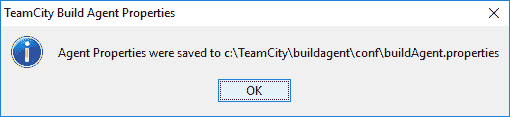

# 第六章：配置 TeamCity 进行 CI/CD 与 Xamarin

在过去，应用程序开发通常是在分离的、不太集成的团队中进行的。开发人员不习惯将自己的代码与其他开发人员的代码合并，并且这种情况往往会导致合并问题。开发人员本地副本上正常工作的内容在与其他人代码合并时常常会停止工作。这种*不太集成的开发*环境增加了开发时间，并延迟了问题的发现。解决这一问题的一种方法是将持续集成纳入开发周期，开发人员每天多次合并代码，并在更早阶段解决问题。

在本章中，我们将深入了解持续集成、持续交付，以及我们可以用来改善开发集成和交付流程的各种工具。

在本章中，我们将讨论以下主题：

+   持续集成简介

+   持续集成的各种工具

+   使用 TeamCity 与 Xamarin

+   为 TeamCity 准备构建服务器并安装 TeamCity

+   创建构建脚本

+   创建 TeamCity 项目

# 持续集成简介

**持续集成**（**CI**）是一种开发和集成实践，开发人员频繁地将代码提交到共享代码库中，最好是一天提交几次。每次代码合并后，可以通过自动构建和自动化测试（如果适用）进行验证。

遵循持续集成有许多好处，其中一个优势是帮助快速发现缺陷并尽早解决。提交的代码通常非常小，包含的是小规模的开发，因此能够迅速定位具体问题。

**持续交付**（**CD**）是集成后的一个过程，顾名思义，它确保已提交的代码库在任何时候都可以进行部署。从测试环境到生产环境的每个环境可能有不同的配置。持续交付确保所有配置始终准备好进行部署，并且代码通过发布所需的所有测试。

简而言之，持续集成通过频繁的代码合并改善了开发和测试体验，帮助快速发现错误，并在流程中包含自动化测试时运行自动化测试。持续交付确保代码库始终处于可随时部署的状态，适用于任何环境。

# Web 应用程序的 CI/CD


对于 Web 应用程序，一旦从 CI 服务器准备好构建，测试应用程序在不同浏览器上的表现并不是一项艰巨的任务，因为浏览器数量有限。但对于移动应用程序，需要更多的一步来改善体验，因为市面上有成千上万的设备，且操作系统版本各异。

# 移动应用程序的 CI/CD


如前所示，移动应用程序需要在数百台具有不同操作系统的设备上进行测试，而购买这些不断推出的移动设备可能非常昂贵。为了确保应用程序的质量保持高水平，采用基于云的测试解决方案成为了流程中的一个重要组成部分。

# 选择持续集成工具

市场上有许多 CI 工具可供实施持续集成，就像市场上有许多编程语言可以用于开发应用程序一样，但选择合适的 CI 工具对于确保长期利益至关重要。

为你的项目选择 CI 工具可能取决于许多因素：

+   **编程语言支持**：这是选择 CI 工具时最重要的因素之一。一些 CI 工具有更好的语言特定构建和包的支持，而其他工具可能不提供语言特定的打包选项。

+   **操作系统**：操作系统的支持很重要，因为一些团队可能会觉得开源操作系统（如 Linux）对于所有服务器（包括 CI 服务器）来说是更好的选择，而且他们可能会觉得配置一个熟悉的操作系统更为舒适，而其他从事 .NET 应用程序开发的团队可能会觉得 Windows 在配置上更为舒适且功能丰富。这一切归根结底是不同团队的偏好和他们所开发的应用程序类型决定的。

+   **与代码库的集成**：不同的团队由于各种原因偏好不同的代码库。有些团队可能觉得 Git 更为功能丰富，并且在各种 IDE 中有插件支持，而另一些对微软环境更为熟悉的团队则觉得 Team Services 更易于使用且集成性更好。不同的 CI 工具对这些代码库的支持程度也不同。

+   **应用平台部署支持**：有些 CI 服务器更适合 Web 应用程序的部署，而其他一些则提供更多的功能并更好地支持将移动应用程序部署到应用商店。根据你的应用程序类型，选择可能会有所不同。

+   **成本**：成本始终是选择任何类型工具时的重要因素。中型到大型公司可以负担得起昂贵且功能丰富的 CI 工具，而较小的公司和团队可能会选择低预算，有时是开源并且免费的 CI 工具，并根据需要对其进行定制。

# 各种持续集成工具

让我们来看看一些市场上广泛使用的 CI 工具。

# TeamCity

TeamCity 是由 JetBrains 开发的著名 CI 服务器。JetBrains 在为软件开发生命周期的不同阶段开发各种工具方面颇有名气，例如 WebStorm 和 ReSharper。TeamCity 提供有许可证的版本和一个免费版本，免费版具有有限的配置和构建代理数量。免费版本适用于计划随着时间增长的小型团队。

尽管 TeamCity 是一个基于 Java 的解决方案，但它在此列表中的工具中提供了最佳的 .NET 支持。它还有不同的企业套餐，根据所需的代理数量进行扩展。

您将在本章稍后学习更多关于 TeamCity 的内容。

其主要特点如下：

+   广泛支持基于 .NET 的应用程序和 Visual Studio

+   远程运行，可以用来测试变更是否会导致失败，而无需进行实际的提交

+   支持自动和手动触发构建，您可以为每次提交配置自动构建触发器

# Jenkins

Jenkins 是最受欢迎的开源持续集成项目之一。通过数千个插件可供选择，Jenkins 可以帮助团队自动化本来会对软件团队造成时间压力的任务。常见用途包括构建项目、运行测试、错误检测、代码分析和项目部署。

其主要特点如下：

+   Jenkins 通过运行命令 `java -jar jenkins.war` 并部署，安装过程非常简单—没有其他复杂步骤

+   Jenkins 配备了用户友好的 web 界面，您可以完全通过它来配置 Jenkins

+   Jenkins 拥有庞大的插件库，并与大多数构建工具集成

+   通过创建插件和扩展功能，Jenkins 可以非常简单地根据项目需求进行定制

+   Jenkins 支持在不同的服务器上进行分布式构建，甚至支持不同操作系统

# Visual Studio Team Services

Microsoft 提供的 Visual Studio Team Services 帮助团队更好地规划、共同编写代码并加速发布。您可以在任何 IDE 或语言中进行编码，针对任何目标平台。各种工具和插件可以下载并根据项目需求进行定制。

其主要特点如下：

+   支持多种工具，包括 Visual Studio、Eclipse 或任何其他可用的工具

+   提供无限制的免费私有仓库（包括 Git 仓库）

+   提供适用于敏捷和看板项目的计划板和工具

+   自动在云中编译和测试应用程序，以避免构建失败

# Bamboo

Bamboo 是全球软件团队使用的 CI 服务器，用于自动化应用程序和一般软件的发布管理过程。它允许团队建立一个简化的构建交付管道。移动开发者可以自动将他们的应用程序部署到 Apple Store 或 Google Play。作为一个 Atlassian 工具，它原生支持 Jira 和 BitBucket，您甚至可以轻松地将 Jenkins 配置导入到 Bamboo 中。

其主要特点如下：

+   与 Jenkins 不同，Bamboo 内置了 Git 分支工作流。

+   由于它是由 Atlassian 构建的，因此它内置了对 Jira 和 BitBucket 的集成。

+   Bamboo 还支持自动合并，以避免工作分支和主分支之间的冲突和差异。

+   Bamboo 中的测试自动化产生了从构建、测试，甚至到将应用程序发布给客户的持续流程。

+   内置对 Jira 的支持使得在特定发布版本中，甚至是在构建过程中，bug 跟踪实现了自动化且易于追踪。

# 使用 TeamCity 与 Xamarin 进行 CI/CD

如上一节所述，TeamCity 对基于 .NET 的应用程序提供了很好的支持。

虽然它可以自动从配置文件和项目文件中检测构建步骤，但它也能从 GitHub 中检测自动构建触发器。

# 使用 TeamCity 的要求

要使用 TeamCity，需要具备一定的硬件和技术知识，并且能够访问这些硬件和技术，以便使设置过程更加顺利：

+   **为 TeamCity 安装和设置专用的构建服务器**：理想情况下，构建服务器应该是独立的服务器，不应承担其他职责，如作为数据库服务器或托管服务器。

+   **MSBuild 知识**：掌握 MSBuild 知识可以使这个设置更加顺利，并帮助在需要时解决任何与编译相关的问题。

+   **Xamarin Test Cloud 连续测试的知识**：本章将使用 Xamarin Test Cloud 进行构建和应用程序包准备完毕后的连续测试。你应该已经很熟悉它，因为在上一章中已经详细描述过了。

# TeamCity 设置的步骤

设置 TeamCity 时涉及以下步骤：

+   **准备构建服务器**：为了在构建服务器上构建我们的移动应用程序，需要在构建服务器上安装一些软件，这些软件将在构建应用程序时使用。

+   **创建构建脚本**：构建脚本基本上是一个包含一组命令的脚本，用于在构建过程中执行各种操作，如编译应用程序、构建 APK，然后将其提交到云端进行测试，以及更多其他操作。

+   **安装 TeamCity**：一旦我们在 CI 服务器上安装了所需的工具，就需要安装和配置 TeamCity，以便项目和用户能够运行构建脚本。

+   **创建 TeamCity 项目**：一旦我们拥有了构建项目所需的所有软件和执行构建的脚本，就应该创建一个 TeamCity 项目。

# 准备构建服务器

为了在服务器上编译和构建移动应用，需要安装一些软件，因为它们是构建过程的必要条件。为了在构建服务器上构建 Android 应用，必须安装 Visual Studio SDK 和 Visual Studio 构建工具等工具。同时，获取 Android Keystore 是为了签名即将发布的应用包。为了避免任何配置问题，建议将这些软件安装在与 TeamCity 相同的用户账户下。

# 防火墙配置

对于持续测试，我们使用 Xamarin Test Cloud，这在前一章节中已详细描述。为了让测试自动提交到 Xamarin Test Cloud 作为 CI 的一部分，CI 服务器必须配置允许网络流量进出 [testcloud.xamarin.com](http://testcloud.xamarin.com) 的端口 `80` 和 `443`。

完成这些配置并将防火墙配置为允许服务器与 Xamarin Test Cloud 之间的通信后，我们就能够在构建步骤中使用命令行工具将我们的 UITests 提交到 Xamarin Test Cloud。

# 安装带有 Xamarin 的 Visual Studio

要安装带有 Xamarin 的 Visual Studio，您可以按照 第三章中描述的相同步骤进行操作，*使用 Xamarin 进行跨平台移动应用开发*。

按照这些步骤将安装 Visual Studio 和 Xamarin，并附带所需的工具和 SDK。

# Android Keystore

Android Keystore 用于在分发应用时对应用进行签名。在打包应用之前需要进行此操作，以确保我们的最终包是用它签名的。

# 创建自己的 Keystore

第一步是创建您自己的个人 Keystore，它将包含用于数字签名 Android 包文件的信息。您可以使用以下命令来完成此操作：

```
"C:Program Files (x86)Javajre1.8.0_45binkeytool.exe" -genkey -v -keystore youFileName.keystore" -alias your_alias_for_keystore -keyalg RSA -keysize 2048 -validity 30000
```

命令末尾的 `30000` 表示证书的有效期；Google 要求此值大于 `2033`。

在运行此命令之前，请先记下几个参数。运行命令时，它会要求您输入以下参数。这些参数稍后将在项目文件中再次使用：

```
Password -  <yourpassword>
Name - <yourname>
OU - <organisationunit> eg: JamSoft
Orgname - <organisationame> 
Local - <locality> 
State - <state> 
Country - <2lettercountrycode>  
```

运行命令后应生成一个 `.keystore` 文件，文件名由命令提供。现在我们的构建服务器已准备就绪，接下来让我们准备在构建过程中使用的构建脚本。

# 创建构建脚本

构建脚本应包含以下步骤：

+   **编译应用**：配置应用项目文件以使用正确的 Keystore，并使用 Visual Studio SDK 工具编译应用

+   **将应用提交到 Xamarin Test Cloud**：一旦服务器的防火墙配置为允许与 Test Cloud 服务器通信，如前面的步骤所述，构建脚本中的这一步将运行命令，上传已签名的应用包到 Test Cloud 服务器。

# 编译应用

现在我们的 Android Keystore 准备好了，可以开始使用，我们可以查看 Visual Studio 项目。为了在构建系统中自动化这一过程，我们需要配置项目以使用我们的 Keystore 凭据：

1.  在 Visual Studio 中，编辑 Android 应用的 `.csproj` 文件，并添加另一个 `PropertyGroup` 元素，如以下代码所示：

```
<PropertyGroup Condition="'$(Configuration)' == 'Release'">
<AndroidKeyStore>True</AndroidKeyStore>        <AndroidSigningKeyStore>myandroid.keystore</AndroidSigningKeyStore>
<AndroidSigningStorePass>yourpassword</AndroidSigningStorePass>        <AndroidSigningKeyAlias>myaliasdroidpub</AndroidSigningKeyAlias>
<AndroidSigningKeyPass>yourpassword</AndroidSigningKeyPass>
</PropertyGroup>  
```

1.  现在，我们的 `.csproj` 文件知道如何在无人干预的情况下使用我们的 Keystore。我们可以在自动化构建中将其与 Xamarin 构建过程集成，并生成基础的 Android 包。你可以使用以下命令来测试它是否正常工作：

```
msbuild.exe PhoneCallApp.csproj /p:Configuration=Release /t:Rebuild  
```

此命令使用 MSBuild 按照给定的配置构建应用程序；在我们的案例中，它应该是发布版本。

1.  现在我们有了应用程序包，可以应用签名过程。要签名在前一步中创建的包，我们需要执行以下命令：

```
"C:\Program Files (x86)\Java\jdk1.7.0_71\binjarsigner.exe" -verbose -sigalg SHA1withRSA -digestalg SHA1 -keystore youFileName.keystore -storepass yourpassword -keypass yourpassword -signedjar \bin\Release\packagename-signed.apk \bin\Release\packagename.apk your_alias_for_keystore
```

该包现在已使用我们之前制作的 Keystore 中的证书进行数字签名。

1.  现在我们有了签名的包，我们可以使用 zipalign 对该包进行对齐，然后将其作为 TeamCity 构建过程的构件发布。此命令使用了 Android SDK 的 `zipalign.exe` 程序。你需要找到该程序在你机器上的位置，因为它可能在多个位置。你需要的命令看起来可能是这样的：

```
"C:\Users\<name>\AppData\Local\Android\android-sdk\build-tools <version>\zipalign.exe" -f -v 4 packagename-signed.apk packagename-zipaligned.apk
```

1.  现在是时候将我们的测试和 Android 包上传到 Xamarin Test Cloud 进行 UI 测试了。我们在前一章中创建了 Xamarin.UITest，并假设你已经了解了创建和上传测试到 Xamarin Test Cloud 的过程。

1.  因此，将以下命令添加到你的构建过程中，以将测试上传到 Test Cloud：

```
test-cloud.exe <path-to-apk-or-ipa-file> <test-cloud-team-api-key> --devices <device-selection-id> --assembly-dir <path-to-tests-containing-test-assemblies> --nunit-xml report.xml --user <email>    
```

当测试运行时，测试结果将以 NUnit 样式的 XML 文件 `report.xml` 形式返回。TeamCity 会在构建日志中显示这些信息。

# 安装和配置 TeamCity

在 Windows 机器上安装和配置 TeamCity，请按照以下步骤进行：

1.  访问 [`www.jetbrains.com/teamcity/download/#section=windows`](https://www.jetbrains.com/teamcity/download/#section=windows)，点击下载按钮从 TeamCity 网站下载 TeamCity 安装包：


1.  下载完成后，打开安装包并点击下一步：


1.  在下一个屏幕上，同意许可证并进入下一步：


1.  选择要安装 TeamCity 的路径并点击下一步：


1.  选择要安装的包；例如，如果你在不同的服务器上安装构建代理和服务器，请根据需要选择。为了学习目的，你可以选择将两者安装在同一台机器上：


1.  安装完成后，选择你希望 TeamCity 服务器运行的端口。确保该端口未被机器上的其他服务占用，尽量选择一个唯一的端口号，而不是默认端口：


1.  在下一个屏幕上，你将能看到为服务器配置的设置和端口，如果需要，你也可以在这里进行更改：


1.  点击“确定”以保存配置。



1.  选择用于运行 TeamCity 的账户：


1.  启动构建服务器和构建代理：


1.  勾选“设置完成后打开 TeamCity Web UI”并点击“完成”：


1.  这将打开 TeamCity Web UI，在这里我们可以创建一个 TeamCity 项目。

# 创建 TeamCity 项目

安装完成后，TeamCity Web 用户界面将在浏览器中打开，我们可以在这里创建新的 TeamCity 项目。请按照以下步骤操作：

1.  登录 TeamCity UI 后，点击“创建项目”：


1.  要从 GitHub 连接到我们的项目，请在下一个屏幕上点击“从 GitHub”：


1.  这将打开一个弹窗，提供将 TeamCity 应用添加到 GitHub 账户的指示：


1.  点击 **注册 TeamCity** 链接，它会将你带到 GitHub 页面，在那里你可以注册一个新的 OAuth 应用。

1.  填写应用程序的详细信息、主页 URL 和回调 URL，如下截图所示，并注册 OAuth 应用：


1.  注册后，在下一个屏幕上你将看到客户端 ID 和客户端密钥；请复制这些信息，因为它们将在 TeamCity 项目中需要用到：


1.  返回 TeamCity，将客户端 ID 和客户端密钥填写到相应字段，并点击“保存”：


1.  接下来，你需要进行一次性登录，以允许 TeamCity 使用 GitHub 仓库。点击“登录到 GitHub”：


1.  通过点击“授权应用”来授权 TeamCity 应用使用 GitHub：


1.  授权后，从 TeamCity 显示的仓库列表中选择 PhoneCallApp 仓库：


1.  在下一个屏幕上，TeamCity 会提供从选定的 URL 创建新项目的选项。给它命名并点击“继续”：


1.  这应该会创建两件事。第一，每次你提交代码时，TeamCity 都会触发一个构建。第二，它会自动创建一个来自仓库的构建步骤：


1.  我们需要手动配置构建步骤，并使用*创建构建脚本*部分描述的构建脚本。使用这些脚本，按照前面的步骤逐步创建 TeamCity 中的构建步骤。

1.  最终，你的构建步骤应该如下图所示，包括在*创建构建脚本*部分提到的所有步骤：


1.  现在，你的 TeamCity 持续构建已经准备好，触发器已配置好，在每次代码提交时，或者在仓库中发现任何代码变化时自动执行此构建。最终，你将获得一个准备分发的 Android 包。

# 总结

在本章中，我们学习了持续集成和持续交付。我们了解了各种持续集成工具。我们使用 TeamCity 在前面章节中开发的 Xamarin 项目中实现了 CI/CD，并学习了如何在 TeamCity 中创建项目来自动化构建过程，最终得到一个可以分发的 Android 包。

在下一章，你将了解如何使用 Visual Studio Team Services 进行持续分发和交付。
