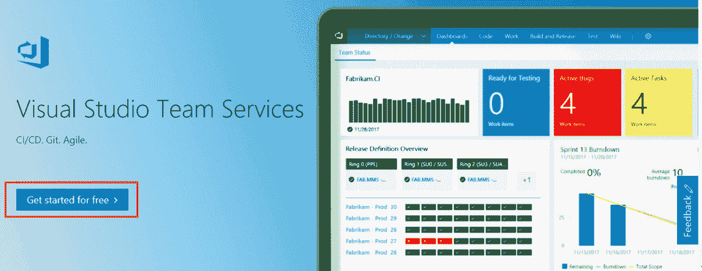
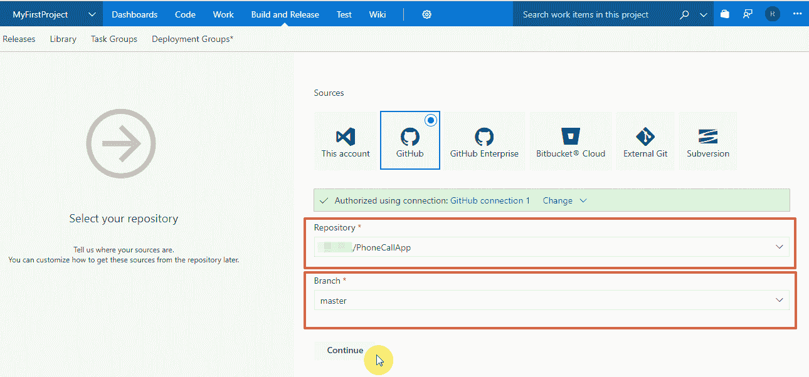
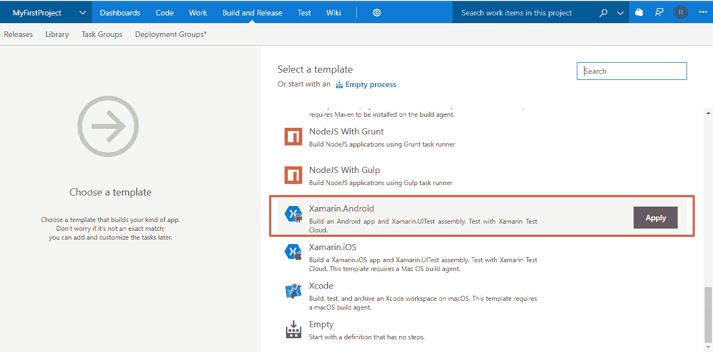

# 第七章：使用 Visual Studio Team Services 实现 Android 的 CI/CD

在上一章中，我们学习了关于持续集成的内容以及如何在开发生命周期中实现它的各种工具。我们还详细了解了使用 TeamCity 作为 CI 工具的持续集成过程。

在本章中，我们将详细介绍如何使用 **Visual Studio Team Services**（**VSTS**）作为工具来进行持续集成和持续交付。我们将讨论设置和使用 VSTS 所需的所有步骤。

VSTS 是 Microsoft 提供的另一种 DevOps 工具，几乎可以与市场上的任何第三方 DevOps 工具链配合使用。它与 GitHub、Jenkins、Azure 以及许多其他类似工具有着很好的集成，能够满足你的持续集成需求。

本章涵盖的部分内容如下：

+   在 Visual Studio 中创建账户

+   从 GitHub 获取代码

+   创建构建定义

+   配置一个代码库

+   队列构建

+   每次提交时构建

# 在 Visual Studio 中创建账户

要开始使用 VSTS，请打开你的网页浏览器并按照以下步骤操作：

1.  打开 Microsoft 网站，访问以下 URL：[`www.visualstudio.com/team-services/`](https://www.visualstudio.com/team-services/)。

1.  在网站上，你将看到一个“免费开始”按钮，如下图所示。点击该按钮：

1.  点击按钮将带你到注册页面，你可以使用现有的 Microsoft 账户登录：

1.  如果你还没有 Microsoft 账户，可以点击同一页面上的“创建账户”链接。

1.  点击“创建账户”链接将带你到下一页，在那里你可以选择用户名和密码并点击“下一步”：

1.  它可能会要求你验证你是一个真实的人在创建账户，完成该步骤后，你的账户应该就可以使用了。

1.  完成注册表单后，下一步是设置用于托管你的 Team Services 项目的 URL：[`www.visualstudio.com/`](https://www.visualstudio.com/)。

1.  在这里，你需要提供项目托管的 URL，并选择你将如何管理代码源版本（即，选择 TFS 或 Git）：

1.  我们将使用 Git 作为我们的源代码库来管理项目。

1.  选择 Git 作为代码管理平台，然后点击继续按钮，注册过程就完成了。

# 从 GitHub 获取代码

现在你的账户已创建，接下来是将代码导入 VSTS：

1.  在下一页中，你将看到不同的选项，用于从你的计算机上集成项目，包括使用命令行，甚至通过初始化新的 Git 仓库。

1.  我们已经将项目同步到 Git 上，因此我们将选择从 Git 导入项目的选项，如下图所示：

1.  点击导入按钮将打开一个小弹窗，你可以在其中选择 Git 或 TFS 作为你的源类型，并提供你的代码库 URL。

1.  请注意，它需要你授予此应用程序使用你的 Git 凭据访问权限：

1.  提供代码库 URL 和登录信息后，点击导入按钮。

1.  这将把你的项目从 Git 导入到 VSTS 服务器，在这里你可以管理与 DevOps 生命周期相关的所有过程。

1.  一旦代码被导入，你就能在 VSTS 的代码部分看到所有目录和代码：

1.  现在你的代码也已经导入到 VSTS，是时候为项目创建构建了。

# 创建构建定义

在 VSTS 中创建构建定义是一个简单直接的过程。它为你提供了多种工具模板，帮助你创建构建定义。

按照以下步骤开始为你的项目创建构建定义：

1.  在代码页面，点击设置构建按钮，如下图所示：

1.  这将带你到下一页，在那里你可以选择一个预定义的 VSTS 模板来使用。

1.  在下一页，选择 GitHub 或其他你选择的源版本作为构建的连接来源。

1.  在输入框中提供一个连接名称，然后点击使用 OAuth 授权按钮：

1.  一个弹窗将会打开，你可能需要从 VSTS 网站解除弹窗阻止才能看到它。

1.  授权并给予 VSTS OAuth 权限访问你的 GitHub 仓库：

1.  点击授权 vsonline 按钮以授权并授予访问账户的权限。

1.  完成后，在下一步将要求你选择项目的代码库和分支来获取代码：

1.  从提供的代码库下拉菜单中选择项目代码库，然后选择相应的分支，点击继续按钮，如前面的截图所示。

1.  在这个例子中，我们跟进的是之前项目中开发和使用的同一个项目，也就是我们用 Xamarin.Android 开发的 Android 应用。

1.  现在，由于 VSTS 和 Xamarin 都是微软工具，它们具有很好的兼容性和内置模板。

1.  所以，在下一页，向下滚动模板列表，直到看到 Xamarin.Android 模板并应用该模板：

1.  现在模板已应用，接下来是配置构建定义的步骤。

# 配置构建定义

VSTS 对 Xamarin 应用程序构建过程提供了很好的支持，并自动执行所有你可能需要的构建配置步骤。但是，你可能需要为某些构建步骤提供额外的信息：

1.  你将在下一页的 VSTS 中看到已经设置好的构建步骤：

1.  让我们暂停一下，看看 VSTS 提供的构建步骤，所有这些都已经为你自动设置好，你只需开始构建。

1.  看一下涉及的步骤是个好主意，从 Nuget 包恢复，到构建包，最后到发布它们：

1.  这里我们需要提供一些与 Xamarin Test Cloud 帐户相关的信息，以便 VSTS 可以在 Test Cloud 上运行测试。

1.  点击屏幕左侧的测试步骤。它将在屏幕右侧突出显示所需的信息字段：

1.  你将需要使用 Xamarin Test Cloud 帐户中的团队 API 密钥和你希望构建运行的用户电子邮件，还需要指定要运行测试的设备。

1.  现在回到 Xamarin Test Cloud 并登录，然后转到帐户设置：

1.  点击“帐户设置”，然后你需要进入“Teams & Apps”部分，获取 API 密钥和其他所需的详细信息。

1.  在帐户设置中，点击左侧窗格中的“Teams & Apps”链接，这将打开“Teams & Apps”部分：

1.  如前面的截图所示，我们创建的用于运行测试的团队是可见的。

1.  在“Teams & Apps”部分，将有一个链接来显示 API 密钥，如前面的截图所示。

1.  点击相同的链接查看团队定义的 API 密钥，并记下它：

1.  然后，点击齿轮图标获取团队成员的详细信息及其电子邮件：

1.  确保记录下具有运行测试所需的所有权限的用户凭证。

1.  复制用户的电子邮件并记下它。

1.  最后一个必需的值是设备字符串；这个字符串存储了有关要运行 Xamarin 测试的设备列表的信息。

1.  设备字符串可以在之前章节中描述的 Test Cloud 测试运行的`-devices`命令行参数中找到：

1.  现在我们已经有了所有必需的值，让我们回到构建配置步骤并输入这些值。

# 排队构建

所有配置完成，现在我们可以保存配置并排队构建：

1.  一旦完成上述步骤，点击构建配置页面顶部的“保存并排队”按钮：

1.  给构建和提交注释命名，并点击“保存并排队”：

1.  一旦构建被保存并排队，你将收到一个小的通知，如下图所示：

1.  恭喜你，现在已经成功完成了构建配置并排队执行构建。

# 触发器 - 每次提交时构建

现在我们已经介绍了如何配置构建步骤并手动排队它们。在持续集成中，自动化构建非常重要，尤其是在开发人员提交代码时。这有助于确保最新的构建与所有更改保持同步，并让开发人员在开发的早期阶段就能发现构建中的任何问题。

现在按照这些步骤设置触发器并自动化构建：

1.  点击前面步骤中配置部分的“触发器”选项卡：

1.  在触发器选项卡的左侧面板中，你将看到一个“持续集成”部分，在该部分下你会找到与你的仓库相关联的信息。

1.  点击该链接以打开右侧的持续集成部分：

1.  勾选“启用持续集成”框。

1.  你会注意到，还有一个复选框是“在构建过程中批量处理更改”。当你有许多开发者频繁地向仓库提交更改时，这个选项非常有用。勾选此选项将在构建已在进行时，将新更改批量处理，直到构建完成后，再将其他更改批量排队，并为这些更改排队一个新的构建。

1.  以下是集成复选框；你将看到选择特定分支来包含在构建中的选项。你还可以根据需求排除某些分支：

1.  一旦更改完成，你可以保存构建定义，现在该构建将成为我们持续集成过程的一部分，具体流程为：

    +   按照你的配置设置，开始在每次检查提交时或批量构建时构建你的项目

    +   在 Xamarin 测试云上运行测试

    +   对项目的 APK 文件进行签名和 zipalign

    +   发布你的应用

所有这些步骤将作为构建配置的一部分执行，所有内容都实现了自动化。

现在，所有开发者只需要关注编写高质量代码，他们可以使用微软的 CI 工具，在真实设备上实时测试代码，并在每次构建时发布它们。

这有助于提高应用开发的质量，通过更快的反馈和在开发各个阶段之间实现持续的工作流程。

# 总结

在本章中，我们讨论了使用 VSTS 进行持续集成。如果在开发生命周期中使用了大量微软工具，特别是 Xamarin，那么 VSTS 是一个非常适合的 CI 工具。我们学习了如何在 VSTS 中配置构建步骤，并集成 Xamarin Test Cloud Teams API 进行持续测试，最后，我们设置了持续构建的触发器。

在下一章，我们将讨论如何将应用程序部署到云端并进行迁移。
