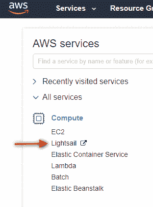
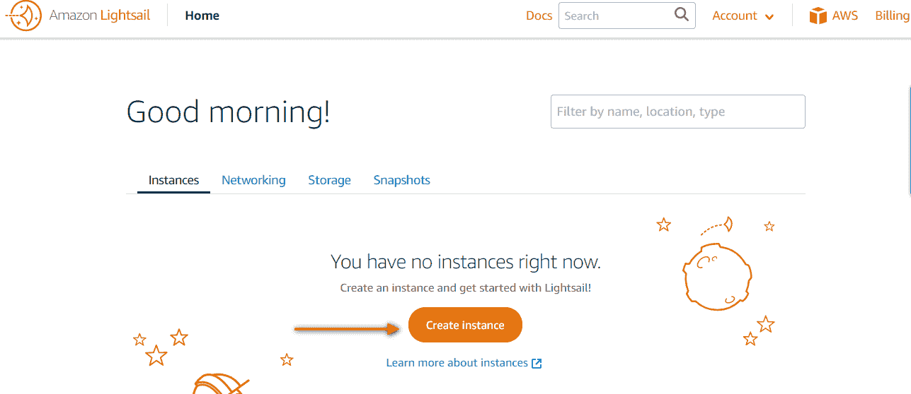
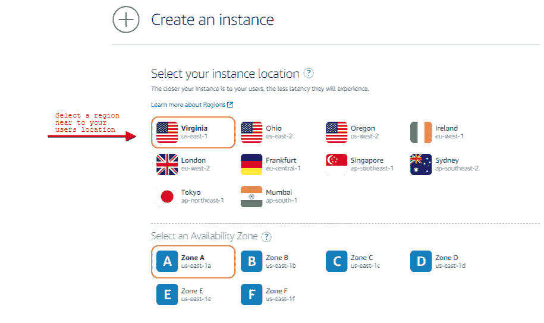
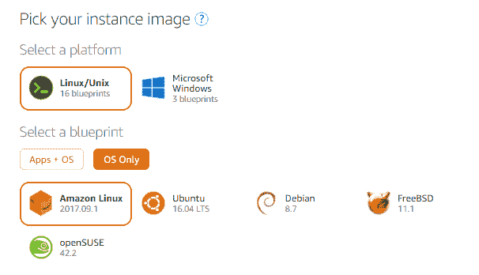
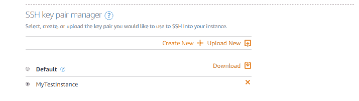
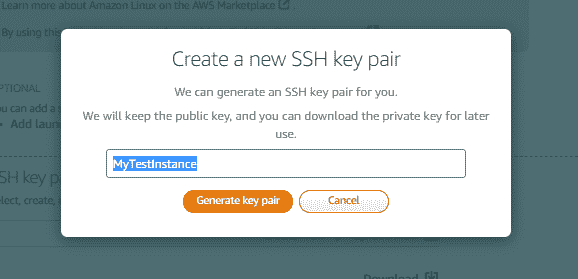
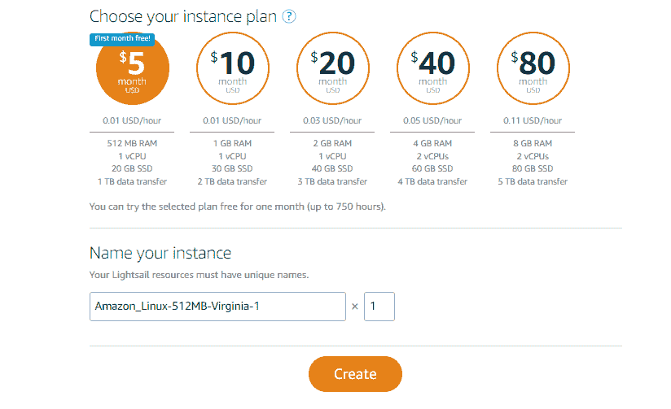
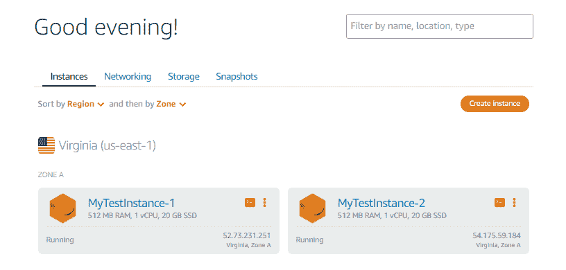
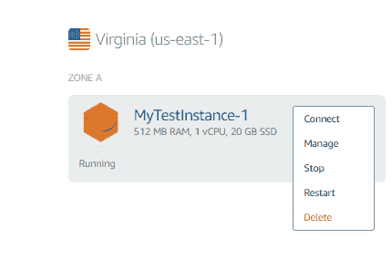
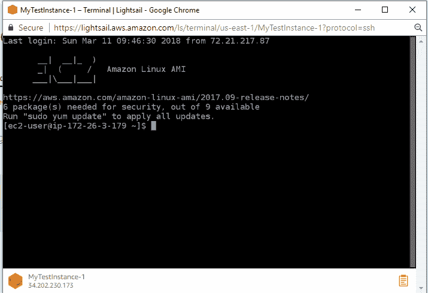

# 第八章：在 AWS 上部署应用程序

在本章中，我们将介绍如何将应用程序部署到云端，并探讨部署的先决条件。在继续之前，我们需要了解为什么要将应用程序部署到云端。我们在第一章中已经讲解了云计算与本地系统的区别，*介绍*。

到目前为止，我们已经讨论了各种 DevOps 机制，在这些机制中，你将开始编写代码并将其推送到代码仓库（GitHub），因为这些命令非常简单（例如 `git add`、`git commit` 和 `git push`）。

一旦 GitHub 中的新版本代码可用，它将作为新变更被拉取到 **持续集成** 和 **持续部署**（**CI**/**CD**）管道中。我们在书中展示了两个示例，说明如何部署 CI/CD 管道（Teamcity 和 VSTS）。CI 将开始构建软件的不同部分，包括代码/软件、数据库以及管道中的其他依赖组件。然后，软件脚本将被部署到环境中。

在部署代码之前，我们需要设置环境，这里所说的环境包括一组在 AWS 上运行的机器。AWS 中的虚拟机称为 **弹性计算云**（**EC2**）。由于软件运行在多台机器上，我们必须确保请求能够发送到所有机器。为此，我们将创建一个 **弹性负载均衡器**（**ELB**）。ELB 将用户请求分配到多个 EC2 节点，并为终端用户请求提供一个单一的 DNS 主机入口。在本章中，我们还将使用 **自动伸缩组**（**ASGs**），用于根据工作负载、CPU、内存消耗等各种指标来动态调整 EC2 实例的数量。你可以配置 ASG 来满足你的应用需求。

在本章中，我们将介绍如何在 AWS 上部署应用程序：

+   创建实例：

    +   Lightsail

    +   EC2 CLI

+   Terraform

+   创建弹性负载均衡器、启动配置和自动伸缩组

# 创建实例

现在，让我们继续创建 EC2 实例。在 AWS 中有多种方法可以创建 EC2 实例。我们将介绍以下几种方法：

+   Lightsail

+   EC2 CLI

+   Terraform

# Lightsail

Lightsail 是一种一键创建实例的简便服务，非常适合用于测试应用程序和开发环境，在这些环境中你不想花时间旋转和维护节点。Lightsail 还支持使用预定义模板创建实例，这些模板包括 MEAN、LAMP、Node.js 和 LEMP（Nginx）。让我们看看如何使用 Lightsail 创建实例。

以下是在 Lightsail 中创建实例所需的步骤：

1.  登录到 AWS 控制台。

1.  在计算部分点击 Lightsail：



1.  Lightsail 的第一个界面非常简单，只需点击创建实例：



1.  现在，你将被要求回答一系列基本问题：

    1.  选择你的实例位置：



1.  1.  选择你的实例镜像并选择一个蓝图：



1.  1.  点击“创建新实例”并为你的实例创建密钥对：



1.  1.  为密钥提供一个名称，并点击生成密钥对：



1.  1.  选择你的实例计划：



1.  为实例命名。根据需要可以创建多个实例。实例将如下所示：



1.  你可以通过点击实例图标右上角的三个点并点击“连接”来连接到实例：



1.  将显示以下连接界面：



现在，实例已经创建。接下来，我们将使用 Terraform 创建实例。

# Terraform

Terraform 为多个云提供商和现有内部系统提供简单的基础设施即服务。通过 Terraform，我们可以管理非常低级的任务，如创建实例、为实例添加 EBS 卷以及将实例注册到 Route 53。我们将把 Terraform 用作自助服务代码；例如，当我们开发了代码并希望将其部署到某个地方，进行集成测试，然后销毁机器/集群时。此设置对于软件展示/试用、多云设置以及可替换的基础设施非常有用。

# 安装

Terraform 安装可以通过下载单个二进制包来完成。根据你的操作系统，从[`www.terraform.io/downloads.html`](https://www.terraform.io/downloads.html)下载相应的二进制包。

安装完成后，通过运行以下命令进行验证：

```
$ terraform --version
```

# 配置文件

现在我们将看看如何使用 Terraform 创建 EC2 实例。

为你的配置文件创建一个目录。Terraform 会加载目录中所有的文件（`*.tf`），该目录称为`workspace`，所以请确保将必要的文件放在该目录中：

```
$ mkdir terraform
$ cd terraform
$ terraform workspace new MyTestMachine
$ terraform workspace select MyTestMachine
```

Terraform 使用`*.tf`格式，称为 Terraform 配置。

# 创建实例

1.  要传递 AWS 实例类型的变量，请使用以下代码：

```
variable "instance_type" {
  description = "the AWS instance type to use"
}
```

你也可以在名为`terraform.tfvars`或`*.auto.tfvars`的文件中定义`secret`变量。

1.  在创建实例之前定义 AMI；`ami-id`在不同区域会有所不同。请根据你的区域使用正确的镜像 ID。你可以使用 Packer 等工具创建自己的黄金 AMI。我也附上了 Ansible 代码，你可以使用它来创建自定义 AMI：

```
resource "aws_instance" "testapp" {
  ami = "ami-12345t67"
  instance_type = "${var.instance_type}"
}
```

1.  使用诸如`"aws"`等提供者来在 AWS 中创建实例。你还可以在配置文件中设置多个提供者，以便一次性在多个提供者中创建实例：

```
Provider "aws" {
  access_key = "ENTER_ACCESS_KEY"
  secret_key = "ENTER_SECRET_KEY"
  region     = "us-west-2" // you can select any region
}
```

如果你想使用 IAM 角色，请不要传递`access_key`和`secret_key`变量。我们将在后面的章节中创建 IAM 角色。

此外，可以使用`profile`选项将`access_key`和`secret_key`保存到`~/.aws/credentials`中：

`**# aws configure --profile user1**`

`**AWS Access Key ID [None]: ABCDEFGHIJKLMNOPQ**`

`**AWS Secret Access Key [None]: wjVDFVdfdfklfF/G6vFGFGr/fsjfERDFFDGgFGDFGDF**`

`**Default region name [None]: us-west-2**`

`**Default output format [None]: json**`

区域详情如下所示：

| **区域** | **区域名称** |
| --- | --- |
| 美国东部（俄亥俄州） | `us-east-2` |
| 美国东部（弗吉尼亚北部） | `us-east-1` |
| 美国西部（北加利福尼亚） | `us-west-1` |
| 美国西部（俄勒冈州） | `us-west-2` |
| 亚太地区（东京） | `ap-northeast-1` |
| 亚太地区（首尔） | `ap-northeast-2` |
| 亚太地区（大阪-本地） | `ap-northeast-3` |
| 亚太地区（孟买） | `ap-south-1` |
| 亚太地区（新加坡） | `ap-southeast-1` |
| 亚太地区（悉尼） | `ap-southeast-2` |
| 加拿大（中部） | `ca-central-1` |
| 中国（北京） | `cn-north-1` |
| 中国（宁夏） | `cn-northwest-1` |
| 欧洲（法兰克福） | `eu-central-1` |
| 欧洲（爱尔兰） | `eu-west-1` |
| 欧洲（伦敦） | `eu-west-2` |
| 欧洲（巴黎） | `eu-west-3` |
| 南美洲（圣保罗） | `sa-east-1` |

1.  通过运行以下命令初始化配置文件：

```
$ terraform init
$ terraform plan -var 'instance_type=t2.micro'
```

配置完成后，AWS 插件将被设置在一个单独的目录中以供后续使用。

1.  在与`main.tf`文件相同的目录中运行配置。你还可以通过命令行传递多个变量：

```
$ terraform apply -var 'instance_type=t2.micro'
```

1.  输出非常易于阅读，类似于 Git 输出。输出包含了详细的实现步骤。如果实现以`+`（加号）开始，表示 Terraform 正在创建资源。

1.  在开始创建实例之前，Terraform 会要求确认。你可以查看计划并点击`yes`。如果你将 Terraform 作为自动化的一部分运行，可以添加`auto-approve`来自动批准所有配置：

```
terraform apply -auto-approve -var 'instance_type=t2.micro'
```

实例创建可能需要一些时间，一旦实例可用，你可以在控制台中查看它们。

1.  要获取 Terraform 的当前状态，请输入以下命令：

```
terraform show
```

# 修改实例

1.  要修改实例，你需要在`main.tf`中进行更改。例如，我正在更新实例的弹性 IP。`aws_eip`模块用于分配弹性 IP：

```
resource "aws_eip" "ip" {
  instance = "${aws_instance.testapp.id}"
}
```

1.  保存文件后，再次运行以下命令以使实例更改生效：

```
$ terraform apply

+ aws_eip.ip
 allocation_id: "<computed>"
 association_id: "<computed>"
 domain: "<computed>"
 instance: "${aws_instance.example.id}"
 network_interface: "<computed>"
 private_ip: "<computed>"
 public_ip: "<computed>"
```

输入`yes`以接受更改，并通过 AWS 控制台查看更改，或运行`terraform show`命令。

1.  通过在相同目录中创建另一个`output.tf`文件来获取输出。将以下配置详情添加到文件中：

```
output "ip" {
  value = "${aws_eip.ip.public_ip}"
}
```

1.  你可以单独查询 IP 输出：

```
$ terraform output ip
```

# 终止实例

实例可以通过单个命令终止。确保从与`main.tf`文件相同的目录中运行命令：

```
terraform destroy
# ...

- aws_instance.testap
```

如果想强制销毁实例，可以使用 `"-force"` 标志与命令一起使用。

# 使用 Terraform 创建实例的示例

1.  我们有一个示例配置文件，用于创建实例并使用该实例设置 Route 53 DNS。将文件保存为 `main.tf`：

```
$ vi main.tf

variable "stack_name" { default = "MyTestMachine"}
variable "aws_region" { default = "us-east-1" }
variable "instance_type" { default = "t2.micro" }
variable "instance_count" { default = "1" }
variable "route53_zone_id"
variable "security_group_id"
provider "aws" {
  region = "${var.aws_region}"
}
module "MyTestMachine" {
  source = "./ec2_nodes"
  instance_type = "${var.instance_type}"
  stack_name = "${var.stack_name}"
  role = "MyTestMachine"
  count = "1"
  security_group_id = "${var.security_group_id}"
}
resource "aws_route53_record" "MyTestMachine" {
  zone_id = "${var.route53_zone_id}"
  name = "${var.stack_name}-domainname.com"
  type = "A"
  ttl = "300"
  records = ["${module.MyTestMachine.firstip}"]
}
```

1.  我已经将源文件的详细信息放在另一个文件中，这样可以使用单个配置文件创建多个机器。创建一个 `ec2_nodes` 文件夹，并在该目录中创建 `main.tf`：

```
$ mkdir ec2_nodes
$ cd ec2_nodes
$ vi main.tf

variable "stack_name" {}
variable "count" {}
variable "role" {}
variable "instance_type" {}
variable "security_group_id" {}
variable "route53_zone_id" {}
resource "aws_instance" "MyTestMachine" {
  ami = "ami-97785bed" # you can select any AMI instance
  instance_type = "${var.instance_type}"
  count = "${var.count}"
  vpc_security_group_ids = [
    "${var.security_group_id}" 
  ]
  associate_public_ip_address = false
  iam_instance_profile = "MyTestRole"
  subnet_id = "subnet-12345678"
  key_name = "aws-key-1234"
    user_data = <<EOF
# yum update
sudo yum update -y
EOF
  tags {
    Name = "${var.stack_name}"
    Role = "${var.role}"
  }
}
resource "aws_route53_record" "nodecname" {
  zone_id = "${var.route53_zone_id}"
  count = "${var.count}"
  name = "${var.stack_name}-${var.role}-${count.index}.domainname.com"
  type = "A"
  ttl = "300"
  records = ["${element(aws_instance.MyTestMachine.*.private_ip, count.index)}"]
}
```

1.  现在，我们将在同一目录中创建另一个输出文件，`ec2_nodes`：

```
output "first_ip" {
  value = "${aws_instance.MyTestMachine.0.private_ip}"
}
```

1.  使用以下命令运行 Terraform 安装：

```
$ terraform workspace new MyTestMachine
$ terraform workspace select MyTestMachine

$ terraform plan \
 -var "stack_name=MyTestMachine" \
 -var "instance_type=t2.micro" \
 -var "route53_zone_id=123456789" \ 
 -var "security_group_id=sg-12345678"

$ terraform apply -auto-approve \
 -var "stack_name=MyTestMachine" \
 -var "instance_type=t2.micro" \
 -var "route53_zone_id=123456789" \ 
 -var "security_group_id=sg-12345678"
```

# EC2 CLI

AWS CLI 包含多个模块来管理 AWS 资源。EC2 CLI 是创建和管理实例的一种非常直接的方式。

安装 AWS CLI（命令）：

`**$ curl -O https://bootstrap.pypa.io/get-pip.py // 下载 pip**`

`**$ python get-pip.py --user // 为用户安装 pip**`

`**$ pip install awscli --upgrade --user // 安装 AWS CLI（如果要为所有用户安装，请删除 --user）**`

格式：

```
$ aws ec2 run-instances <Pass parameters>
```

示例：

```
$ aws ec2 run-instances --count 1 --security-groups launch-wizard-1 --subnet-id subnet-1234rt78 --instance-type t2.micro --key-name myTestKey --image-id ami-abc123dec --associate-public-ip-address --iam-instance-profile Name=MyTestIAM-Role
```

输出将包含实例的所有详细信息，包括如下的实例 ID：

```
{
 "Instances": [
 {
 "Monitoring": {
 "State": "disabled"
 },
 "PublicDnsName": "",
 "StateReason": {
 "Message": "pending",
 "Code": "pending"
 },
 "State": {
 "Code": 0,
 "Name": "pending"
 },
 "EbsOptimized": false,
 "LaunchTime": "2018-03-10T07:55:32.000Z",
 "PrivateIpAddress": "10.10.81.24",
 "ProductCodes": [],
 "VpcId": "vpc-123456b",
 "StateTransitionReason": "",
 "InstanceId": "i-1234d5r6t7y8g9aws",
 "ImageId": "ami-12345678",
 "PrivateDnsName": "ip-10-10-81-24.ap-southeast-1.compute.internal",
 "KeyName": "MyTestKey",
 "SecurityGroups": [
 {
 "GroupName": "launch-wizard-1",
 "GroupId": "sg-12345678"
 }
 ],
 "ClientToken": "",
 "SubnetId": "subnet-1234rt78",
 "InstanceType": "t2.micro",
 "NetworkInterfaces": [
 {
 "Status": "in-use",
 "MacAddress": "02:d4:43:07:9c:a4",
 "SourceDestCheck": true,
 "VpcId": "vpc-12345678",
 "Description": "",
 "NetworkInterfaceId": "eni-12345678",
 "PrivateIpAddresses": [
 {
 "Primary": true,
 "PrivateIpAddress": "10.10.81.24"
 }
 ],
 "SubnetId": "subnet-1234rt78",
 "Attachment": {
 "Status": "attaching",
 "DeviceIndex": 0,
 "DeleteOnTermination": true,
 "AttachmentId": "eni-attach-c5d3e72e",
 "AttachTime": "2018-03-12T07:55:32.000Z"
 },
 "Groups": [
 {
 "GroupName": "launch-wizard-1",
 "GroupId": "sg-12345678"
 }
 ],
 "Ipv6Addresses": [],
 "OwnerId": "1234567891011",
 "PrivateIpAddress": "10.10.81.24"
 }
 ],
 "SourceDestCheck": true,
 "Placement": {
 "Tenancy": "default",
 "GroupName": "",
 "AvailabilityZone": "us-east-1a"
 },
 "Hypervisor": "xen",
 "BlockDeviceMappings": [],
 "Architecture": "x86_64",
 "RootDeviceType": "ebs",
 "IamInstanceProfile": {
 "Id": "A1B2C3D4E5S6F7G8I9J1K0",
 "Arn": "arn:aws:iam::1234567891011:instance-profile/MyTestIAM-Role"
 },
 "RootDeviceName": "/dev/xvda",
 "VirtualizationType": "hvm",
 "AmiLaunchIndex": 0
 }
 ],
 "ReservationId": "r-123456789101112",
 "Groups": [],
 "OwnerId": "1234567891011"
}
```

您可以获取实例 ID 的详细信息：

```
$ aws ec2 describe-instances --instance-id <id-awsinstanceid>
```

要终止实例，请使用以下命令：

```
$ aws ec2 terminate-instances --instance-ids "i-1234d5r6t7y8g9aws"
{
 "TerminatingInstances": [
 {
 "InstanceId": "i-1234d5r6t7y8g9aws",
 "CurrentState": {
 "Code": 32,
 "Name": "shutting-down"
 },
 "PreviousState": {
 "Code": 16,
 "Name": "running"
 }
 }
 ]
}
```

# 创建 Elastic Load Balancer、启动配置和自动扩展组

在本节中，我们将看到如何使用 AWS CLI 创建 ELB 和 ASG。

# Elastic Load Balancer

ELB 会自动将负载/流量分配到多个实例中，这些实例可以位于不同的 **可用区**（**AZs**）。成员实例可以属于单一的 AZ 或多个 AZ。ELB 成为 DNS 和最终用户的唯一接入点。ELB 还通过健康检查监控实例；如果实例健康，才会将请求路由到该实例。

由于我们已经创建了实例，接下来将使用 CLI 创建一个 ELB。执行此操作的命令如下：

```
$ aws elb create-load-balancer --load-balancer-name my-test-elb --listeners "Protocol=HTTP,LoadBalancerPort=80,InstanceProtocol=HTTP,InstancePort=80" --availability-zones us-west-2a us-west-2b
```

将新创建的实例添加到 ELB：

```
$ aws elb register-instances-with-load-balancer --load-balancer-name my-test-elb --instances i-awsinstance12fd
```

可以通过 CloudWatch、访问日志和 AWS CloudTrail 监控 ELB。ELB 可以是内部的或面向互联网的。面向互联网的 ELB 可以与域名关联。

# 自动扩展组

让我们了解基础设施扩展的基本概念：

+   **扩展**：通过增加 EC2 实例的数量来实现可扩展性

+   **向上扩展**：通过调整现有 EC2 实例的容量（计算、内存和 EBS）来实现可扩展性

+   **向下扩展**：减少现有 EC2 配置的 EC2 实例数量

自动扩展处理扩展和缩减。自动扩展组件被管理成组，以便它们可以作为单独的逻辑单元进行管理和扩展。自动扩展组使用 **启动配置** 作为模板来创建 EC2 实例

```
$ aws autoscaling create-launch-configuration --launch-configuration-name my-test-launch --key-name my-key-pair --image-id ami-c1wjdlakf6 --instance-type m1.small --security-groups sg-lkjl3kmm --instance-type m1.small 
```

扩展计划将定义触发 ASG 的阈值和条件：

```
$ aws autoscaling create-auto-scaling-group --auto-scaling-group-name my-test-asg-group --launch-configuration-name test-launch --load-balancer-names my-test-elb --health-check-type ELB --health-check-grace-period 120 --min-size 1 --max-size 3 --desired-capacity 2 --default-cooldown 600--termination-policies "OldestInstance" 
```

# IAM 角色

AWS IAM 角色通过管理和旋转密钥本身提供了额外的安全层。密钥是加密的凭证，分别称为访问密钥和密钥。

访问密钥示例如下：

```
aws iam create-role --role-name myTestKey --assume-role-policy-document file://myTestKeyPolicy.json --description "Role for testing access from EC2 to S3 and Route 53"
```

策略是一个 JSON 文档，包含从一个 AWS 服务到另一个 AWS 服务的权限委托。IAM 角色的默认权限是全拒绝（默认情况下会阻止所有对任何服务的请求，直到明确指定）。示例策略用于创建和管理 EC2 实例、S3 存储桶和 Route 53。

示例策略（将以下文本保存为 `myTestKeyPolicy.json`）：

```
{
  "Version": "2012-10-17",
  "Statement": [
    {
      "Action": "ec2:*",
      "Effect": "Allow",
      "Resource": "*"
    },
    {
      "Effect": "Allow",
      "Action": "elasticloadbalancing:*",
      "Resource": "*"
    },
    {
      "Effect": "Allow",
      "Action": "cloudwatch:*",
      "Resource": "*"
    },
    {
      "Effect": "Allow",
      "Action": "autoscaling:*",
      "Resource": "*"
    },
    {
      "Effect": "Allow",
      "Action": "iam:CreateServiceLinkedRole",
      "Resource": "*",
      "Condition": {
        "StringEquals": {
          "iam:AWSServiceName": [
            "autoscaling.amazonaws.com",
            "ec2scheduled.amazonaws.com",
            "elasticloadbalancing.amazonaws.com",
            "spot.amazonaws.com",
            "spotfleet.amazonaws.com"
          ]
        }
      }
```

# 总结

在本章中，我们介绍了为软件部署创建 EC2 实例的各种方法。一旦实例创建完成，将软件 JAR 文件推送到实例中。使用私有实例的 IP 地址、用户名（`ec2-user`）和私钥（`test.pem`）连接到机器。一旦测试完成，确保终止测试实例，以免产生额外费用。

**T2.micro** EC2 实例类型对于新的 AWS 账户可以免费使用一年。

在本章的后面部分，我们通过 AWS CLI 演示了如何创建 ELB 和 ASG。

您可以将您的 ELB DNS 名称注册到您的域名服务提供商（例如，Route 53、GoDaddy 和 BigRock），以解析您的应用程序。

您还可以尝试将一些工作负载投入到您的应用程序中，查看 Auto Scaling 是否增加了实例数量，然后移除工作负载以测试终止策略。

您还可以使用分布式文件系统，如 EFS、NFS 和 GlusterFS，在所有节点之间共享工作空间。

在下一章中，我们将介绍使用 Test Cloud 和 Android 监控工具对应用程序进行优化和监控。Test Cloud 是由 Xamarin 提供支持的移动测试工具，它可以测试超过 2000 台设备的应用程序。Android Monitor 提供图形界面，用于调试和优化应用程序。
