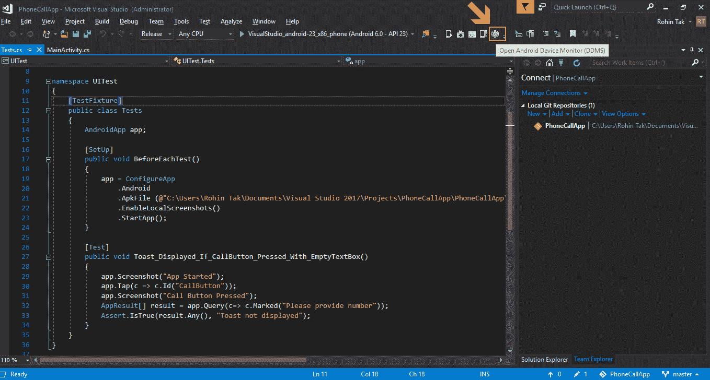

# 监控和优化应用程序

应用程序监控是简单地跟踪应用程序各个方面及其表现的过程。它对于持续的质量检查和改进非常重要，并且对于在应用程序到达用户之前发现问题至关重要。

应用程序监控不仅可以让我们了解应用程序的表现及其内部问题，还可以记录相关数据库和 API 的状态。

本章中，我们将讨论各种应用程序监控方法。以下是本章将涵盖的高级主题：

+   API 级别监控及各种 API 监控工具

+   使用测试云监控应用程序

+   使用 Android 监控工具监控应用程序

# API 级别监控

**应用程序编程接口** (**APIs**) 是当今集成开发环境中不可或缺的一部分。它们也可以通过客户端-服务器关系来理解，其中移动应用是请求资源的客户端，而 API 位于服务器端，并为任何想要发出请求的应用程序提供 URL。

大多数应用程序在 Web 和移动端之间共享公共 API。API 是一种提供跨不同平台一致操作行为的有效方式。它还帮助在不同的移动应用平台之间共享相同的业务和数据层操作，因此，你可以在 iOS、Android 和 Web 应用中使用相同的 API。

API 在移动应用开发中非常重要，因此监控 API 以确保高可用性变得同样关键。如果 API 发生故障，整个应用程序可能会停止工作，用户可能无法执行任何需要 API 可用的操作，这通常是任何服务器操作，尽管不包括离线操作。

# 为什么 API 监控至关重要

API 是任何应用程序中非常重要的一部分，无论是移动应用还是 Web 应用。如今，API 在项目中被广泛使用，为客户端（移动应用或 Web 应用）与服务器端的业务逻辑和数据访问层交互提供更多灵活性。由于应用程序在执行用户操作时非常依赖 API，因此必须实施 API 监控，以避免任何停机或糟糕的用户体验。当没有适当的 API 监控时，可能会影响应用程序的质量和响应时间，有时甚至会导致应用程序停机。

同样，监控你所开发的 API，以及你可能在应用程序中使用的第三方 API 也非常重要。

# API 监控中的重要因素

在监控 API 时，有一些关键点或领域需要涵盖，以确保可用性：

+   **API 可用性**：我们需要确保 API 可用；有时，服务器可能由于某些原因宕机，或者根据位置和服务器，连接可能会中断。

+   **响应质量**：当我们调用 API 时，API 返回的响应质量如何？是否符合协议？

+   **响应时间**：调用 API 时获取结果的响应时间是多少？

# 开发者在处理 API 不可用情况中的角色

对于应用程序开发者来说，记住 API 可能并非始终可用，并以优雅的方式处理这些情况，是一个不错的建议。即使应用程序无法执行某些 API 操作，如果它能够友好地告知用户，往往比面对运行时异常能够带来更好的用户体验。编写代码来处理 API 异常和 API 无响应的场景。

# 各种用于 API 监控的工具

市场上有许多用于 API 监控和测试的工具。选择哪种工具完全取决于你希望通过这些工具实现什么目标。有些工具对性能监控提供了很好的支持，而另一些工具则更适合质量测试和识别错误数据。

一些流行的工具如下：

+   Postman

+   Karate DSL

+   SoapUI

+   HttpMaster

+   REST Assured

+   RestSharp

+   Mockbin

你可以在各自的网站上阅读更多关于这些工具的好处和支持内容，并选择最适合项目需求的工具。

# 使用 Test Cloud 进行监控

你在前几章中了解了 Xamarin Test Cloud 以及如何在持续集成生命周期中使用它进行持续测试。在这里，我们将更详细地讨论如何使用 Xamarin Test Cloud 以及在不同设备组上运行应用程序后，它提供的分析数据。

我们将在这里使用两个不同的应用程序，查看监控分析并进行比较，以更好地理解如何帮助我们识别应用程序中的各种性能和功能相关问题。

这些是我们将在演示过程中使用的应用程序：

+   **PhoneCallApp**（我们在前几章中开发的应用程序）

+   **Xamarin Store**（Test Cloud 提供的一个示例 Android 应用程序）

Xamarin Test Cloud 可以帮助我们识别应用程序在真实设备上的功能相关问题。

它是一个非常好的应用程序监控工具，尤其是在不同移动设备和操作系统版本上进行测试时。

获取各种应用程序功能的详细分析对于确保我们的应用程序在目标设备上按预期运行非常重要。

话虽如此，应用程序能够在不同操作系统版本上运行，以及分析其性能和内存使用情况，也是至关重要的。

# 使用 Test Cloud 进行监控的好处

Test Cloud 不仅提供监控功能，还可以免去我们手动测试相同应用程序在不同设备上的功能，从而实现真正的持续集成过程。

+   它为我们的 CI 过程提供了持续的测试功能，支持自动化测试运行和详细的报告通知。

+   在不同操作系统版本上测试应用程序对于移动应用的成功至关重要，而 Test Cloud 很好地实现了这一目的。

+   在云端，您可以从大量设备列表中选择不同设备进行应用程序测试。

+   Test Cloud 分析应用程序的性能。

+   Test Cloud 分析不同硬件配置下不同设备的内存使用情况。

# PhoneCallApp

让我们通过一些步骤，了解如何监控我们的 PhoneCallApp：

1.  访问 [`testcloud.xamarin.com/`](https://testcloud.xamarin.com/)。

1.  点击 PhoneCallApp 图标，查看测试运行的详细信息：

1.  在下一页中，您将看到应用程序运行的测试列表：

1.  现在，由于我们目前只运行了一个测试，因此 Test Cloud 没有提供前面截图中显示的图形化度量。在接下来的其他示例中，您将能够看到不同测试运行的更详细对比。

1.  点击列表中的测试运行，查看其结果：

1.  列出的测试运行是我们之前在章节中运行的，并通过命令行将其上传到 Xamarin Test Cloud。

1.  为了了解这个界面，我们来看看 Xamarin Test Cloud 界面中的不同部分。

1.  这是一个概览屏幕，显示该应用程序所有测试运行的总结：

1.  这个屏幕显示了摘要信息，如从总运行测试中有多少测试失败、应用程序在设备上运行了多少次、这些测试在哪些设备上运行等。

1.  当你想获取应用程序在不同设备和操作系统版本上的表现报告时，这个屏幕非常有用，可以帮助你简要了解情况。

1.  下一步，左侧窗格中会显示在测试运行中包含的 UITests 列表：

1.  此屏幕基本上列出了您在项目中包含的所有 Xamarin.UITests。您可以点击这些不同的测试，查看它们在屏幕右侧的相应结果。

1.  让我们点击前一屏幕列表中的测试。

1.  这将带我们到下一个屏幕，其中包含测试运行的详细报告：

1.  仔细看看此屏幕左侧窗格。

1.  它提供了一些关于在设备上运行测试的步骤。

1.  这些步骤仅是我们之前在代码中编写的，以便在每次测试操作时截取屏幕截图。

1.  这些步骤如上所述（我们在这里使用的是之前章节中编写的测试代码屏幕）：

    +   **应用程序启动**：应用程序启动时截取屏幕截图；这是在`Tests.cs`文件中的`BeforeEachTest()`方法中编写的：

+   +   **按下拨号按钮**：这是 Xamarin.UITest 按下拨号按钮以发起通话的步骤：

+   +   **失败的步骤（断言）**：这是最后一步，显示的是失败步骤的证据，您可以看到我们收到的结果，并将其与预期结果进行比较。这是决定测试是否通过的最终断言，基于 `Assert.IsTrue()` 条件中的结果。

1.  您可以点击左侧窗格中的每个步骤并分析所拍摄的屏幕截图，以准确查看测试过程中发生了什么。这是一种很好的方式，可以在测试失败时准确找出问题所在。

1.  有时，仅凭截图不足以确定问题。为了进行更详细的分析，Test Cloud 还为我们提供了设备日志，正如下图所示：

1.  设备日志是查看应用程序行为和设备在运行应用程序时的表现的绝佳方式，它可以提供更详细的信息。

1.  这可以帮助我们在设备上测试失败时准确定位问题；在这种情况下，日志总是拯救我们的利器。

1.  点击设备日志，您可以看到每个截图的逐步日志，所有日志都在同一屏幕上展示：

1.  当测试失败时，Test Cloud 还为我们提供了一个额外的选项，即查看测试失败：

1.  对于自动化测试开发人员来说，在测试失败时查看异常信息非常有用。

1.  最后但同样重要的是，还有一个“测试日志”选项，可以用来获取整个测试运行的汇总日志：

# Xamarin Store 应用

现在我们已经看到了 Test Cloud 提供的不同选项，用于通过测试运行来监控我们的应用程序及其功能，接下来让我们看看仪表板和测试在多个物理设备上运行、不同操作系统版本下的情况。

这将帮助我们更好地了解如何在 Test Cloud 上进行对比监控，以分析应用程序在不同设备上的行为，并将其进行比较。

Xamarin Store 应用程序是 Test Cloud 在其平台上提供的示例应用，旨在帮助了解平台并了解仪表板的使用。让我们通过以下步骤，了解如何监控应用程序在多个设备上的运行情况，并比较不同的测试运行：

1.  像之前的例子一样，前往 Test Cloud 的主页并点击 Xamarin Store 图标：

1.  在下一个屏幕上，您将看到不同测试运行的图形表示，并简要了解在所有测试中失败的测试数量、应用程序大小以及不同测试运行期间的峰值内存使用情况：

1.  这为我们提供了一个很好的对比视角，展示了应用程序在不同测试运行中的表现。可能应用程序在第一次运行时表现良好，而之后的一些代码更改导致某些功能失败。因此，这个图表非常有用，可以监控影响应用程序功能的变更时间线。

1.  你还可以点击图表或测试运行，查看其概述。

1.  现在，这个界面为我们提供了一个很好的视图，展示了如何监控在不同设备上运行的应用程序。这是一个非常好的方式，可以跟踪不同设备和操作系统版本上的应用程序：

1.  让我们点击其中一个步骤，查看在多个设备上该步骤的结果：

1.  红色图标表示测试失败。此页面显示了你选择运行测试的所有设备；它显示了测试通过的所有设备，并在失败的设备上标记红旗。

1.  你可以进一步点击每个设备，获取特定设备的屏幕和日志。

# 使用 Android 监视工具

一个 Android 应用程序的性能对于良好的用户体验和快速响应的应用程序同样重要。**Android 设备监视器**（**ADM**）是一个出色的工具，能够识别性能问题，并基于这些问题生成报告，用于分析和确保 Android 应用程序的良好性能：

1.  打开 Visual Studio，并从工具栏中运行 Android 设备监视器：

1.  一个新的应用程序，Android 设备管理器，应该会打开：

1.  返回 Visual Studio 并运行 PhoneCallApp，以便在 Android 设备监视器中列出设备。

1.  你可以在模拟器或连接到计算机的物理设备上运行应用程序。

1.  应用程序启动后，返回到 Android 设备监视器，你应该能够在左侧窗格中看到正在运行的设备。

1.  在设备名称下，你应该能够看到设备上所有正在运行的进程。

1.  在列表中选择你的应用程序，你应该能够看到相关信息：

1.  要监控应用程序中运行的不同线程，请点击左侧窗格工具栏上的“更新线程”按钮，接着你应该能够看到在右侧显示的由应用程序运行的不同线程：

1.  能够监控由应用程序运行的线程，对于找出可能导致额外电池消耗或拖慢应用程序的后台线程非常有帮助。

1.  有时，线程可能会发生死锁，在这种情况下很难识别问题。ADM 的这一功能在这方面提供了很大帮助。

1.  同样，监控应用程序的内存使用情况是优化应用程序和支持低内存设备的一个重要工具，有时还可以通过减少内存消耗来提高性能。

1.  点击左侧面板中的**垃圾回收**(**GC**)，然后在右侧选择堆（Heap）以查看堆内存分配的详细信息：

1.  你可以在“分配跟踪器”标签页中获得更详细的分配监控。点击“开始跟踪”，然后点击“获取分配”按钮以获取分配详情：

1.  还有用于监控网络相关使用的选项。

1.  Android 设备监控器的一个非常重要的功能是性能分析，它帮助分析在应用程序代码中各个方法所花费的时间及其他细节。它是识别方法级性能和延迟的一个重要工具。

要使用此功能，点击左侧面板中的“开始方法性能分析”按钮：

1.  下一步，选择是否进行基于样本的性能分析或基于跟踪的性能分析，然后点击确定：

1.  在应用程序中执行你的任务，返回到 ADM 并点击“停止方法性能分析”按钮。

1.  会生成一个跟踪文件，包含你想要分析的跟踪信息：

    +   **时间轴面板**：它描述了每个线程和方法的开始和结束时间。我们可以进入特定的时间段，查看每个线程在那个时刻做了什么。

    +   **分析面板**：提供了方法内部发生事件的摘要。我们可以看到哪个方法占用了最多的 CPU 时间，或者它调用了多少次。

1.  方法位于 Android 层级，可能需要比较哪些方法可能调用了这些 Android 方法。

# 总结

在本章中，我们学习了不同类型的监控技术，如 API 监控、性能监控和功能监控。我们还讨论了用于 API 级监控的不同工具。我们详细了解了使用 Xamarin Test Cloud 在多个设备上进行功能监控，以及使用 Android Device Monitor 进行性能监控。在下一章中，我们将讨论在不同开发阶段的调试和故障排除。
