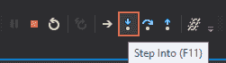
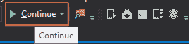
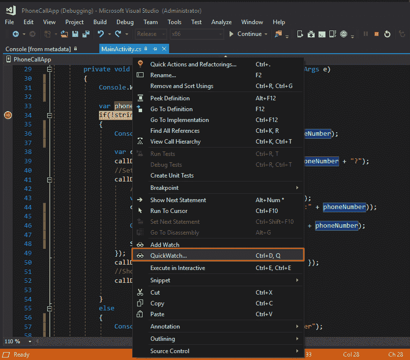

# 第十章：调试应用程序

在应用程序开发中，调试是识别问题或故障的过程，使用提供调试方法的调试工具或 IDE。它涉及逐步执行代码，分析变量和方法及其值，以精确找出问题所在。

如果您已经做了应用程序开发一段时间，应该对调试在应用程序开发过程中的重要性有所了解，即使您是一个新开发者或刚开始学习，本章也将帮助您了解调试术语、如何在 Visual Studio 中调试 Xamarin 应用程序，以及如何排除开发过程中可能出现的其他问题。

本章中，您将深入学习以下主题：

+   在 Visual Studio 中调试 Xamarin 应用程序

+   在 Android 模拟器中调试和排除故障

+   调试 Mono 类库并使用调试日志

+   调试 Git 连接

# 术语

最好先了解调试过程中使用的不同术语。这些术语是常用的，并且在所有调试平台中都很常见：

+   **Bug**：Bug 是指阻止程序或应用程序执行预期功能的缺陷或问题。

+   **Debug**：您现在可能已经猜到，*debug*，顾名思义，涉及从系统或程序中删除 Bug。它通常表示通过深入程序找到问题，并在识别问题后通过修正错误代码来解决问题。

+   **Breakpoint**：顾名思义，断点是您希望暂停正在运行的应用程序的地方，*pause* 就是指“暂停”。所以，断点是您希望暂停正在运行的应用程序并查看发生了什么或正在发生什么的程序代码中的一个位置。它在调试应用程序时非常有用，并且是一个至关重要的工具。

# 在 Visual Studio 中使用 Xamarin 调试

Visual Studio 是一个非常适合调试任何应用程序的 IDE，无论是 Web 应用、移动应用还是桌面应用。它使用的是 IDE 内置的调试器，适用于这三种应用，且非常易于跟随。

为了保持章节内容易于跟随，我们将使用在 Xamarin 上开发和测试的相同 Android 应用程序，并在 Visual Studio 中进行调试。

# 使用输出窗口

Visual Studio 中的输出窗口是一个可以看到发生的输出的窗口。要查看 Visual Studio 中的输出窗口，请按照以下步骤操作：

1.  进入视图（View），点击输出（Output）：


1.  这将打开一个位于底部的小窗口，您可以看到 Visual Studio 写入的当前和有用的输出。例如，这是我们在重新构建应用程序时，输出窗口中显示的内容：


# 使用 Console 类显示有用的输出

`Console`类可以用来打印一些有用的信息，比如日志，输出到输出窗口，以便了解正在执行哪些步骤。如果某个方法在特定步骤后失败，这些信息将显示在输出窗口中。

为了实现这一点，C#有一个`Console`类，这是一个静态类。这个类有像`Write()`和`WriteLine()`这样的方法，可以将任何内容写入输出窗口。`Write()`方法将内容写入输出窗口，`WriteLine()`方法也是如此，不过它会在末尾添加一个换行：

1.  查看以下截图，并分析如何使用`Console.WriteLine()`将方法分解为几个步骤（这是在开发**PhoneCallApp**时编写的相同`Click`事件方法）：


1.  向代码中添加`Console.WriteLine()`，如前面的截图所示。

1.  现在，运行应用程序，执行操作，并查看根据你的代码写入的输出：


1.  通过这种方式，`Console.WriteLine()`可以用来将有用的步骤输出/日志写入输出窗口，便于调试时分析问题。

# 使用断点

如前所述，断点是深入了解代码的好方法，不会太麻烦。它们可以帮助检查变量及其值，检查程序在代码的某个位置或某行的执行流。

使用断点非常简单：

1.  在一行上添加断点的最简单方法是点击该行前方的左侧边距，或者点击该行并按下*F9*键：


1.  当设置断点时，你会看到在你点击的边距区域出现一个红点，如前面的截图所示。

1.  现在，运行应用程序并点击按钮；当断点处暂停时，程序的执行流会停止，且该行会变成黄色：


1.  在此时，你可以通过悬停在变量上来检查断点行之前的变量值：


# 设置条件断点

你还可以在代码中设置条件断点，这基本上是告诉 Visual Studio，当满足特定条件时才暂停执行：

1.  右键点击前面步骤中设置的断点，点击“条件”：


1.  这将打开一个小窗口，允许你为断点设置一个条件。例如，在以下截图中，设置的条件是当`phoneNumber == "9900000700"`时触发。

因此，只有当满足此条件时，断点才会被触发；否则，它将不会触发。


# 步进调试代码

当到达断点时，调试工具会让你控制程序的执行流程。你将看到工具栏中的一些按钮，允许你运行和逐步调试代码：


你可以悬停在这些按钮上查看它们各自的名称：

+   **单步跳过 (F10)**：这将执行下一行代码。如果下一行是函数调用，单步跳过将执行该函数并在函数执行完后停止。


+   **单步进入 (F11)**：单步进入将在函数调用的下一行停止，让你可以逐行调试该函数。如果下一行不是函数调用，它的行为将与单步跳过相同：



+   **跳出 (Shift + F11)**：这将返回到当前函数被调用的那一行：


+   **继续**：这将继续执行，直到下一个断点被触发：



+   **停止调试**：这将停止调试过程：


# 使用监视

监视是调试中非常有用的功能，它允许我们查看变量的值、类型以及其他相关信息，并以比悬停变量更好的方式进行评估。

在 Visual Studio 中有两种类型的监视工具：

# QuickWatch

QuickWatch 类似于监视，但顾名思义，它允许我们评估当时的值。按以下步骤在 Visual Studio 中使用 QuickWatch：

1.  右键点击你想分析的变量并点击“QuickWatch”：



1.  这将打开一个新窗口，你可以在其中查看与变量相关的类型、值和其他详细信息：


1.  当一个变量的值或字符串过长，无法通过仅仅悬停在变量上正确读取和评估时，这个功能也非常有用。

# 添加监视

添加监视类似于 QuickWatch，但当你有多个变量需要分析，并且查看每个变量的值可能需要大量时间时，它更有用。

按以下步骤为变量添加监视：

1.  右键点击变量并点击“添加监视”：


1.  这将把变量添加到监视列表中，并始终显示其值，同时反映其在运行时的任何变化。

1.  你还可以按不同的数据类型以特定格式查看这些变量值，比如将 XML 值以 XML 格式显示，或将 JSON 对象的值以 `.json` 格式显示：


1.  当你想在每步代码中评估变量的值，并查看它随着每一行代码的变化时，这个功能非常有用。

# 调试 Mono 类库

Xamarin 附带了 Mono 类库的源代码，您可以使用这些代码调试 Xamarin（以前称为 Mono）源代码：

1.  要使用此选项，请转到“调试 | 选项”：


1.  然后，进入常规设置，取消选中“启用仅我的代码”选项，并点击“确定”：


1.  一旦禁用此选项，我们就可以进入 Mono 类库并调试它们。

# Android 调试日志

如本章前面部分所述，我们已经看到如何使用 `Console.WriteLine()` 方法在 Visual Studio 中调试时写入一些输出步骤。

然而，在像 Android 这样的移动平台上，没有控制台，它只在 Visual Studio 调试期间可用。Android 设备提供了一种日志，您可以在编写 Android 应用程序时使用。这也被称为 **logcat**，因为使用该命令来获取此日志。

要通过 Visual Studio 访问此功能，请按以下步骤操作：

1.  您可以直接从工具栏中的 Android 工具点击设备日志（logcat）图标，或者可以通过“工具 | Android | 设备日志”访问：


1.  这将打开一个新窗口，您可以在其中选择应用程序运行的设备。需要明确的是，应用程序必须在物理设备上运行，因为只有在设备上运行应用程序时，调试和日志才会由 Android 设备提供：


1.  从列出正在运行应用程序的下拉列表中选择设备。

1.  当选择设备时，它会自动开始将运行中的应用程序的日志条目添加到表格中。切换设备会停止并重新启动设备日志：


# 从命令行访问 logcat

查看调试日志的另一种方法是通过命令行：

1.  打开一个控制台窗口，导航到 Android SDK 的 `platform-tools` 文件夹（例如 `C:\Program Files (x86)\Android\android-sdk\platform-tools`）。

1.  如果只连接了一个设备，可以使用以下命令查看日志：

```
$ adb logcat   
```


1.  如果连接了多个设备，则必须识别设备。例如，`adb -d logcat` 显示唯一连接的物理设备的日志，而 `adb -e logcat` 显示唯一运行的模拟器的日志。

# 写入调试日志

您可以使用 `Android.Util.Log` 类将消息记录到调试日志。它具有不同的日志级别：

+   信息

+   调试

+   警告

+   错误

所有这些级别都是不言自明的。

1.  让我们将前一部分中写的 `Console.WriteLine()` 替换为 `Log.Debug()`，将日志写入 logcat：


1.  转到 logcat（设备日志）窗口，并通过代码中给定的标签过滤标签，以仅查看我们在代码中写入的日志。在这种情况下，标签将是 PhoneCall：


1.  这是一种非常简单直接的调试方式，可以监控在物理设备上运行的应用程序。

# 调试 Git 连接

Git 对于将代码保存到仓库中是必不可少的，但有时候它可能无法按预期工作，就像我们应用程序遇到的问题一样。如果你无法从仓库中获取或克隆代码，尝试以下步骤来调试 Git：

+   **检查你的连接**：这是你在遇到 Git 问题时首先需要检查的事项。可能你的连接并不像你认为的那样。可以 ping 任意公共域名站点，例如[`www.google.com`](https://www.google.com)，来检查你的连接情况：


如果你收到类似前面截图中显示的响应，并且能够成功 ping 通，这意味着你的连接完全正常。

+   **GIT_TRACE**：这个配置选项会为 Git 网络连接及其所有内部命令提供更详细的跟踪信息。键入你的`git`命令并设置`GIT_TRACE = 1`，它应该会给出详细的跟踪信息：

    1.  添加一个名为`GIT_TRACE`的新环境变量，并将其值设置为`1`。


1.  1.  运行`git`命令并获取详细信息以识别问题：


# 总结

在本章中，我们以不同的方式进行了调试，并学习了如何使用 Visual Studio 和 Xamarin（Android）中的调试工具。本章还解释了 Android 设备日志，也称为 logcat，用于在物理设备上调试应用程序时读取和写入日志。在下一章中，我们将通过一些案例研究，深入了解整个开发、测试和调试过程。
