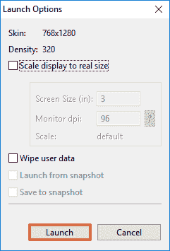
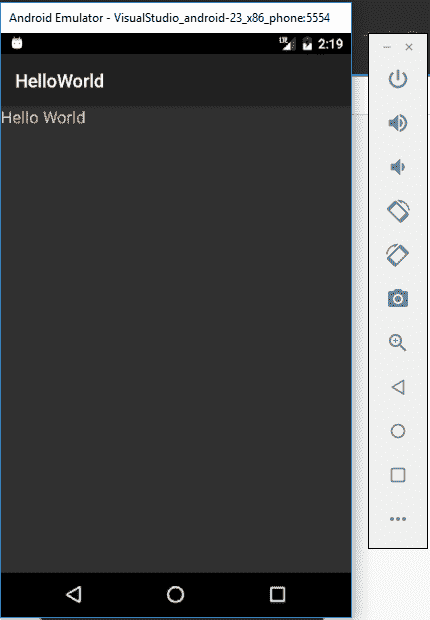
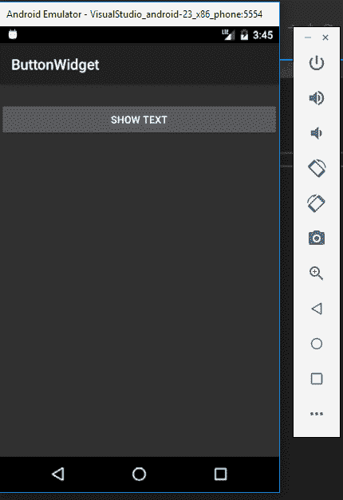
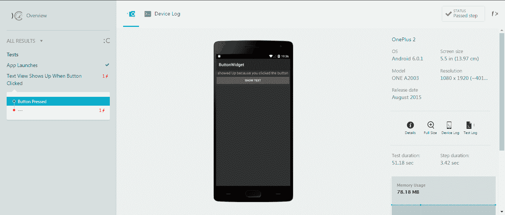

# 案例研究

在本章中，我们将通过整个移动 DevOps 过程，从移动应用开发和集成，到持续测试和部署。

我们将使用两个应用程序作为案例研究，展示整个过程：

+   一个基本的 Hello World 图形界面

+   一个 ButtonWidget

# 案例研究 1 - Hello World 图形界面

在这个案例研究中，我们将讨论移动 DevOps 生命周期，并通过一个简单的 Android 应用程序来演示，该应用程序的 MainActivity 中包含一个`Hello World`文本标签。

本研究将简要介绍整个过程，并向您展示一个逐步的工作流。

# 前提条件

由于这些案例研究将涵盖生命周期中的所有步骤，因此无法详细介绍这些主题，也无法解释 IDE 和 Android 开发基础的不同部分。

以下是顺利完成本章所需的最小前提条件。如果您需要更深入理解以下任何主题，请参阅前面的章节：

+   假设您的计算机上已经安装并配置好了 Visual Studio 和 Xamarin，并准备好进行 Android 应用开发。如果您的系统中没有安装 Visual Studio 和 Xamarin，请参考第三章，*使用 Xamarin 进行跨平台移动应用开发*，并首先安装它们。

+   对 Visual Studio 的基本理解。

+   对 Android 开发基础的基本理解。

+   您应该拥有一个可以访问的有效 Git 账户。

让我们按照以下步骤开始，为移动应用开发构建一个完整的实用工作流：

1.  打开 Visual Studio，选择 文件 | 新建 | 项目：

1.  在下一个窗口中，从左侧窗格中选择 Android，然后选择 Blank App (Android)。为您的项目命名，并勾选“创建一个新的 Git 仓库”复选框（这将为您的项目创建一个新的 Git 仓库），然后点击确定：

1.  Visual Studio 将为您创建一个名为`HelloWorld`的新项目：

1.  完成后，打开解决方案资源管理器查看项目结构。选择 视图 | 解决方案资源管理器：

1.  在解决方案资源管理器中，展开`Resources`文件夹和`layout`文件夹，找到一个名为`Main.axml`的文件。这是布局文件，或者可以说是我们的 MainActivity 的视图：

1.  双击`Main.axml`打开它。这应该会为您打开布局设计器：

1.  如果您无法在左侧看到工具箱，请前往 视图 | 工具箱 使其显示：

1.  现在，我们将仅在活动中添加一个文本视图，显示`HelloWorld`。

1.  在左侧的工具箱中，从表单小部件部分选择 Text (Medium)，并将其拖放到 Activity View 中：

1.  双击文本视图并将其文本更改为`Hello World`：

1.  太棒了，`HelloWorld` 应用程序完成了，现在我们只需构建解决方案，以确保一切正常并准备好在 Android 设备或模拟器上部署。

1.  右键点击解决方案，点击 Build Solution：

1.  这将为你构建解决方案，完成时，左下角的蓝色条将显示“Build Succeeded”。

1.  若要在模拟器上部署和测试应用程序，请点击顶部工具栏中的 Android Emulator Manager (AVD) 图标：

1.  这将打开 Android Emulator Manager，在此你可以从 Visual Studio 提供的列表中选择任何现有的虚拟设备并点击启动按钮：

1.  然后，在下一个窗口中点击 Launch，而不更改任何配置：

1.  这应该会在你的机器上启动一个新的 AVD：

1.  现在，在 AVD 启动后返回到 Visual Studio，选择设备并点击播放按钮，将应用程序部署并启动到 AVD 上：

1.  一旦应用程序部署完成，它将打开在 AVD 上，你应该能在 MainActivity 屏幕上看到你的 Hello World 文本：

1.  恭喜，你的 HelloWorld 应用程序已经在模拟器上成功运行！

1.  现在是时候将我们新创建的项目推送到 Git 远程仓库了。记住，在创建项目时我们已经创建了本地仓库，所以现在需要将本地仓库连接到远程 Git 仓库，然后推送代码。

1.  在 Visual Studio 中点击右下角的推送图标。这将打开 Team Explorer，如下截图所示：

1.  现在，在发布之前，我们需要在 GitHub 上创建一个仓库，以连接到这个本地仓库。

1.  访问 GitHub 并登录到你的帐户。

1.  创建一个名为`HelloWorld`的新仓库，并复制该仓库的 URL。

1.  完成后，返回到 Visual Studio 并点击 Publish Git Repo，如前面的截图所示，然后复制仓库链接并点击 Publish：

1.  Visual Studio 可能会要求你提供凭证来连接 Git，这是第一次时需要的，但完成后，它应该会将远程仓库与本地仓库配置连接。

1.  之后，点击显示“Changes (2)”的编辑图标，将更改提交到本地。

1.  添加一些提交备注，然后点击 Commit All：

1.  接下来，点击同步链接，将您的提交更改与远程存储库共享：

1.  在下一页上，点击 Push 以将您的更改推送到 GitHub 远程存储库。

由于该应用程序没有太多需要测试的内容，我们将在下一个案例研究中介绍。

# 案例研究 2 - ButtonWidget

在本案例研究中，我们将创建一个新的 Android 应用程序，该应用程序将在点击时显示一个新的文本视图。我们还将为此应用程序编写 UITest：

1.  在 Visual Studio 中创建一个新的空白 Android 应用程序项目，命名为`ButtonWidget`，然后点击确定：

1.  创建项目后，从解决方案资源管理器中的 Resources | Layout 打开`Main.axml`文件。

1.  然后，从左侧的工具箱中添加一个文本视图和一个按钮到视图中。

1.  为每个 ID 分配标识以便在代码中识别它们。您可以选择它们，然后显示属性窗口，在那里为它们指定 ID：

1.  同样，将文本视图的可见性设置为隐藏，因为我们将仅在按钮点击时显示此文本：

1.  现在，从解决方案资源管理器中打开`MainActivity.cs`文件：

1.  在`MainActivtiy.cs`中，添加代码以在按钮点击时显示文本视图。更改您的代码以匹配以下屏幕截图显示的内容：

1.  就这样。应用程序的编码部分已完成。现在，将添加文本视图，但在点击按钮之前不会显示在应用程序中。

1.  构建您的应用程序并运行。您会看到应用程序加载时文本视图不可见：

1.  现在，点击按钮，查看文本视图是否出现：

1.  现在应用程序正常运行，让我们为其编写 Xamarin.UITest 并将其上传到 Xamarin Test Cloud。

1.  将一个新的测试项目添加到解决方案中：

1.  在新增项目窗口中，从左侧窗格点击测试，然后选择 UI 测试应用程序（Xamarin.UITest | Android）。为项目命名，然后点击确定：

1.  接下来，我们需要添加对应用程序项目的引用，以便`UITest`项目可以构建和运行应用程序。

1.  在`UITest`项目下右键单击引用，然后点击添加引用：

1.  在接下来的屏幕上，从左侧选择项目，然后选择 ButtonWidget（我们要测试的应用程序项目），然后点击确定：

1.  我们已准备好开始为 ButtonWidget 应用程序编写测试了。从解决方案资源管理器中的 TestProjectName | Tests.cs 打开`Tests.cs`文件：

1.  现在，修改代码，在`Tests.cs`文件中添加一个新测试，测试按钮按下时是否显示文本视图：

1.  现在，重新构建并部署解决方案，然后点击“测试 | Windows | 测试资源管理器”：

1.  你应该能够在测试资源管理器中看到编写的测试：

1.  点击“运行所有”以运行测试。

1.  现在，要将这些测试上传到 Xamarin Test Cloud，请登录到你的 Xamarin Test Cloud 帐户。

1.  进入帐户设置 | 团队与应用。

1.  点击“新建团队”按钮以创建新团队。

1.  添加成员到团队，然后点击“新建测试运行”。

1.  这将打开一个自引导对话框，我们可以在其中选择平台、选择设备等。

1.  设置操作系统为 Android，并选择你希望的设备，然后进入最后一步。

1.  你将看到如下屏幕，点击命令将测试上传到 Xamarin Test Cloud：

1.  在将应用程序上传到 Xamarin Test Cloud 之前，确保在发布构建配置中构建应用程序。

1.  在项目的清单文件中添加互联网权限。

1.  一旦你使用发布版本构建了项目，你就可以准备好将应用程序上传到 Xamarin，并在那里的 UITests 中进行调试。使用前一步的命令，将`Xamarin.UITest.[版本]`修改为你的 UITest 版本，然后输入 APK 文件的完整路径和`UITest`文件夹的相对路径，然后在项目的根目录中运行。

1.  在对命令进行这些更改后，进入根目录，打开命令提示符窗口，并运行命令将 UITests 上传到 Xamarin：

1.  通过此操作，应用程序正在部署并在 Xamarin Test Cloud 上进行真实物理设备测试。

1.  你可以使用此命令与 CI 工具一起自动化此过程，作为持续集成和持续测试的一部分。

1.  在返回 Xamarin Test Cloud 的 Web 应用程序后，我们可以看到在选定的设备上测试已通过：

# 总结

在本章中，我们已通过整个应用程序开发、部署、编写测试用例，并通过在 Xamarin Test Cloud 上进行持续测试来测试应用程序的过程。本章使用了两个案例研究，逐步解释了整个过程，从创建一个简单的 Android 项目，到编写 UITests 并使用 Test Cloud 进行持续测试。
