# 第九章：Portainer – Docker 的图形用户界面

在本章中，我们将介绍 Portainer。Portainer 是一款通过 web 界面管理 Docker 资源的工具。

由于 Portainer 本身是以容器形式分发的，因此它易于安装，你可以在任何可以启动容器的地方运行它，这使得它成为那些不希望像我们在前几章中那样通过命令行管理容器的用户的完美界面。

在本章中，我们将覆盖以下主题：

+   通向 Portainer 的道路

+   启动 Portainer 并使其运行

+   使用 Portainer

+   Portainer 和 Docker Swarm

# 技术要求

如同之前的章节一样，我们将继续使用本地安装的 Docker。此外，本章中的截图将来自我偏好的操作系统 macOS。接近本章结束时，我们将使用 Multipass 启动一个本地 Docker Swarm 集群。

与之前一样，我们将执行的 Docker 命令将在我们安装 Docker 的所有三种操作系统上有效，然而，一些支持命令，虽然很少见，可能仅适用于 macOS 和 Linux 系统。

查看以下视频，了解代码的实际应用：[`bit.ly/3jR2HBa`](https://bit.ly/3jR2HBa)

# 通向 Portainer 的道路

在我们开始动手安装和使用 Portainer 之前，应该先讨论一下项目的背景。本书的第一版介绍了*Docker UI*。*Docker UI* 由 *Michael Crosby* 编写，经过大约一年的开发后，将项目交给了 *Kevan Ahlquist*。正是在这个阶段，由于商标问题，项目更名为 UI for Docker。

UI for Docker 的开发一直持续到 Docker 开始加速引入 Swarm 模式等功能到 Docker 核心引擎中。大约在这个时候，UI for Docker 项目被分支出来，成为了后来 Portainer 项目的雏形，并于 2016 年 6 月发布了第一次重大版本。从首次公开发布以来，Portainer 团队估计大部分代码已经更新或重写，到 2017 年中期，新增了角色权限控制和 Docker Compose 支持等新特性。

2016 年 12 月，一条通知被提交到 UI for Docker 的 GitHub 仓库，声明该项目已不再维护，并建议使用 Portainer。自发布以来，Portainer 已被下载超过 13 亿次。

现在我们已经了解了 Portainer 的一些背景信息，接下来让我们看看启动和配置它所需的步骤。

# 启动 Portainer 并使其运行

我们将首先查看如何使用 Portainer 来管理一个本地运行的单个 Docker 实例。我正在运行 Docker for Mac，因此将使用它，但这些指令同样适用于其他 Docker 安装。

首先，为了从 Docker Hub 获取容器镜像，我们只需运行以下命令：

```
$ docker image pull portainer/portainer
$ docker image ls
```

如果你正在跟着做，运行 `docker image ls` 命令时，你可以看到 Portainer 镜像只有 78.6 MB。要启动 Portainer，只需在 macOS 或 Linux 上运行以下命令：

```
$ docker volume create portainer_data
$ docker container run -d \
      -p 9000:9000 \
      -v /var/run/docker.sock:/var/run/docker.sock \
      portainer/portainer
```

Windows 用户需要运行以下命令：

```
$ docker container run -d -p 9000:9000 -v \\.\pipe\docker_engine:\\.\pipe\docker_engine portainer/portainer
```

正如我们刚才运行的命令所示，我们正在将 Docker 主机上的 Docker 引擎套接字文件挂载到 Portainer。这样做将允许 Portainer 完全、无任何限制地访问 Docker 引擎。Portainer 需要这样做，以便管理主机上的 Docker；但是，这也意味着你的 Portainer 容器对主机具有完全访问权限，因此在给它访问权限时要小心，尤其是在将 Portainer 公共暴露到远程主机时。

以下截图展示了在 macOS 上执行的情况：

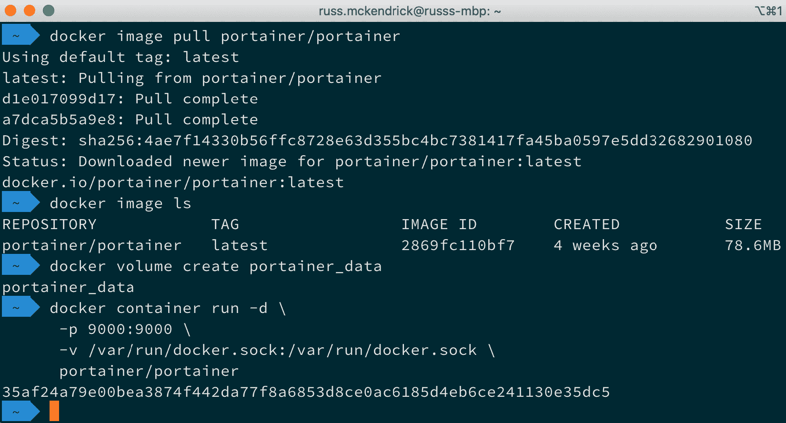

图 9.1 – 下载并启动 Portainer 容器

对于最基本的安装类型，以上就是我们需要运行的命令。完成安装还需要几个步骤，这些步骤都在浏览器中完成。要完成这些步骤，请访问 [`localhost:9000/`](http://localhost:9000/)。你将首先看到一个屏幕，要求你为管理员用户设置密码。

设置完密码后，你将进入登录页面：输入用户名 admin 和你刚刚配置的密码。登录后，系统会询问你希望管理的 Docker 实例。

有四个选项：

+   管理 Portainer 运行所在的 Docker 实例

+   管理远程 Docker 实例

+   连接到 Portainer 代理

+   连接到 Microsoft **Azure 容器实例**（**ACI**）

目前，我们想要管理 Portainer 运行的实例，即 **Local** 选项，而不是默认的 **Remote** 选项：

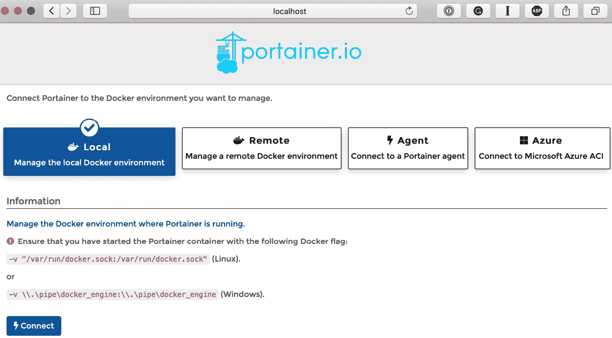

图 9.2 – 选择你希望用 Portainer 管理的环境

由于我们在启动 Portainer 容器时已经考虑了挂载 Docker 套接字文件，因此我们可以点击 **Connect** 来完成安装。这样我们将直接进入 Portainer，看到仪表盘。Portainer 启动并配置完毕后，我们现在可以看看一些功能。

# 使用 Portainer

现在，Portainer 已经启动并配置为与我们的 Docker 安装进行通信，我们可以开始浏览左侧菜单中列出的功能，从顶部的仪表盘开始，仪表盘也是 Portainer 安装的默认登录页面，如下图所示：

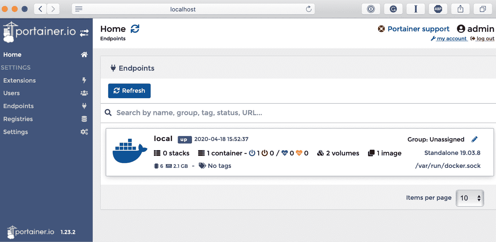

图 9.3 – 查看默认页面

首先，你会进入端点列表。由于我们只有本地安装，点击它，然后就可以开始探索了。

## 仪表盘

从以下截图可以看到，仪表板给出了 Portainer 配置与之通信的 Docker 实例的当前状态概览：

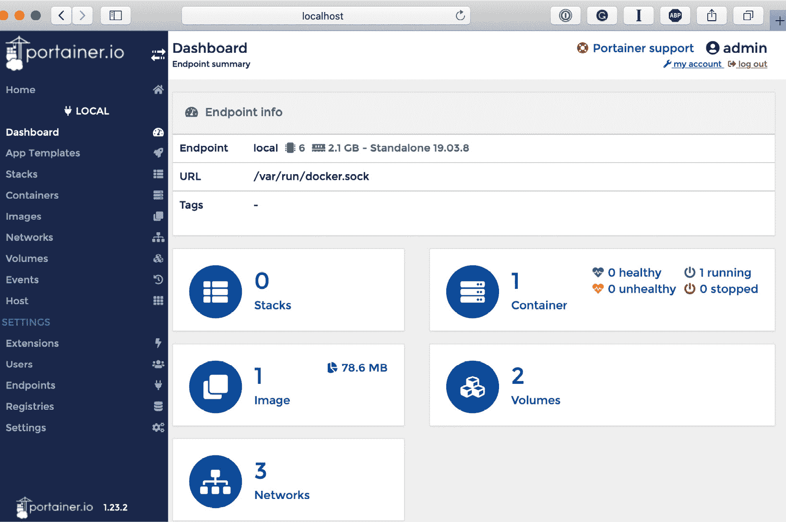

图 9.4 – 获取概览

就我而言，这显示了我运行的容器数量，目前只有已经运行的 Portainer 容器，以及我下载的镜像数量。我们还可以看到 Docker 实例中可用的**卷**和**网络**数量。它还会显示正在运行的**堆栈**数量：

它还显示了 Docker 实例本身的基本信息；正如你所看到的，Docker 实例正在运行 Moby Linux，拥有 6 个 CPU 和 2.1GB 的 RAM。这是 Docker for Mac 的默认配置。

仪表板将根据你运行 Portainer 的环境进行自适应调整，因此我们将在将 Portainer 附加到 Docker Swarm 集群时重新审视它。

## 应用模板

接下来，在左侧菜单中，我们有**应用模板**。这一部分可能是唯一一个不直接包含在核心 Docker 引擎中的功能；它实际上是通过使用从 Docker Hub 下载的容器启动常见应用程序的方式：

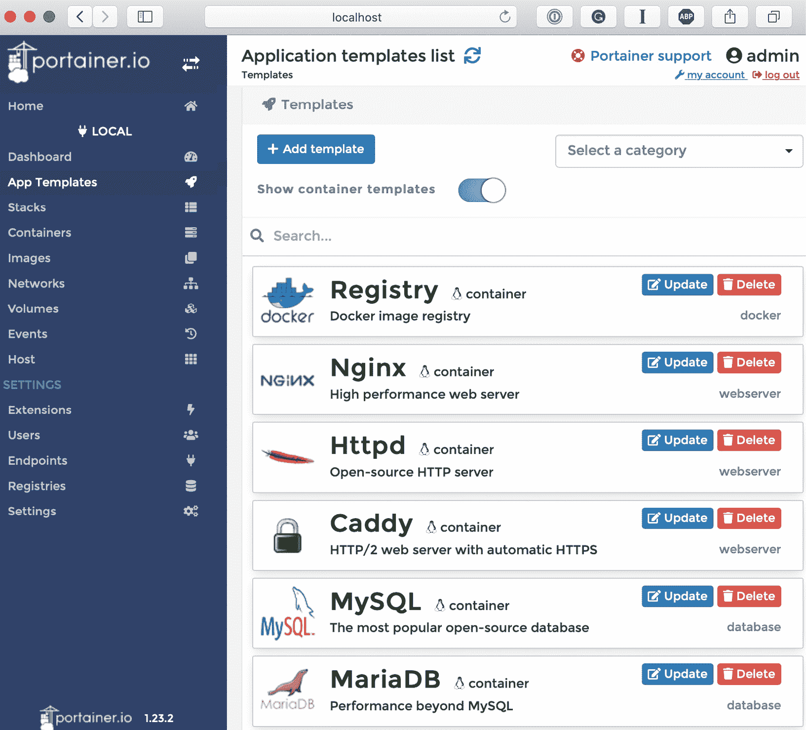

图 9.5 – 探索模板

默认情况下，Portainer 附带大约 25 个模板。模板是以 JSON 格式定义的。例如，NGINX 模板看起来如下所示：

```
{
  'type': 'container',
  'title': 'Nginx',
  'description': 'High performance web server',
  'categories': ['webserver'],
  'platform': 'linux',
  'logo': 'https://portainer.io/images/logos/nginx.png',
  'image': 'nginx:latest',
  'ports': [
    '80/tcp',
    '443/tcp'
  ],
  'volumes': ['/etc/nginx', '/usr/share/nginx/html']
}
```

你可以添加更多的选项，例如 MariaDB 模板：

```
{
  'type': 'container',
  'title': 'MariaDB',
  'description': 'Performance beyond MySQL',
  'categories': ['database'],
  'platform': 'linux',
  'logo': 'https://portainer.io/images/logos/mariadb.png',
  'image': 'mariadb:latest',
  'env': [
    {
      'name': 'MYSQL_ROOT_PASSWORD',
      'label': 'Root password'
    } ],
  'ports': ['3306/tcp' ],
  'volumes': ['/var/lib/mysql']
}
```

正如你所看到的，模板看起来类似于 Docker Compose 文件；然而，这种格式仅由 Portainer 使用。大多数选项都非常直观，但我们应该讲一下**名称**和**标签**选项。

对于通常需要通过环境变量传递自定义值来定义选项的容器，**名称**和**标签**选项允许你为用户提供自定义表单字段，在容器启动之前需要填写这些字段，如以下截图所示：

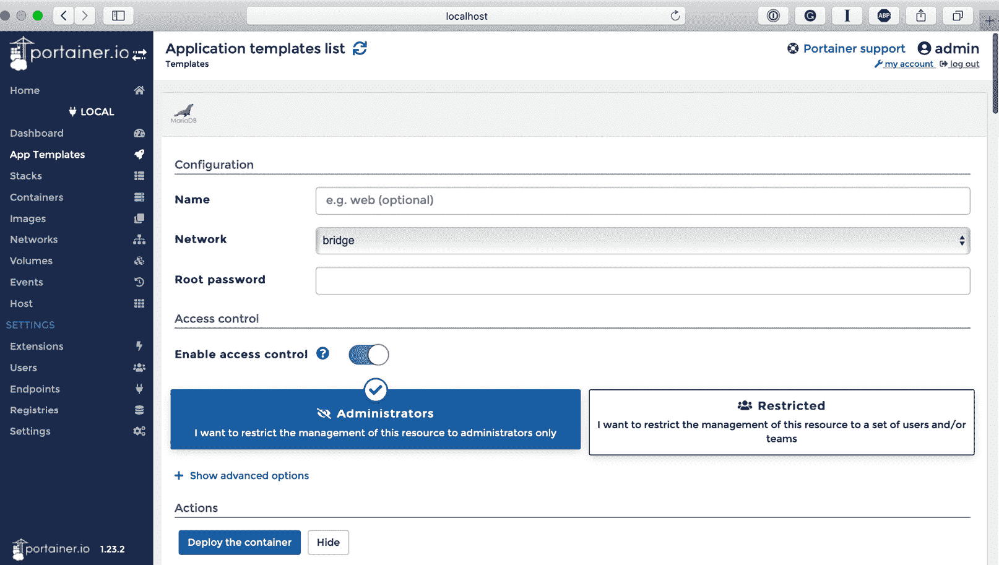

图 9.6 – 使用模板启动 MariaDB

正如你所看到的，我们有一个字段，可以在其中输入希望用于 MariaDB 容器的 root 密码。填写此字段后，系统会将该值作为环境变量传递，构建以下命令以启动容器：

```
$ docker container run --name [Name of Container] -p 3306 -e MYSQL_ROOT_PASSWORD=[Root password] -d mariadb:latest
```

如果想了解更多关于应用模板的信息，我建议查看文档——链接可以在本章的*进一步阅读*部分找到。

## 容器

我们接下来要查看的左侧菜单中的内容是**容器**。这是启动和与 Docker 实例上运行的容器交互的地方。点击**容器**菜单项，将会显示 Docker 实例上所有容器的列表，包括正在运行和已停止的容器：

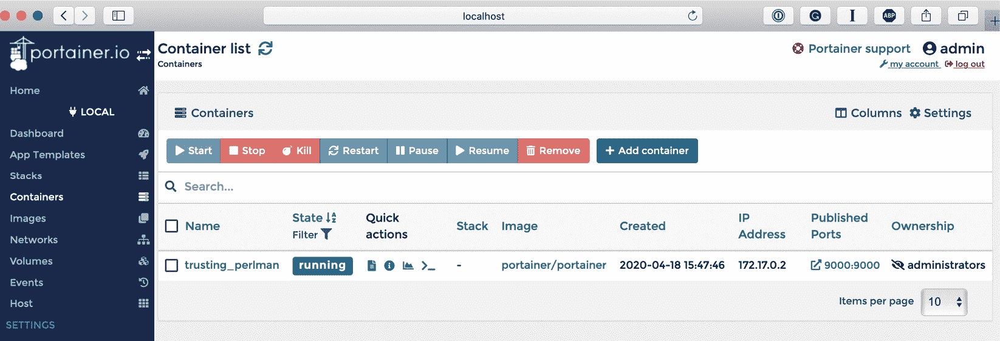

图 9.7 – 列出容器

如你所见，我目前只运行了一个容器，而这个容器恰好是 Portainer 容器。我们不打算与它互动，而是点击**+ 添加容器**按钮，启动一个运行我们在前几章中使用的集群应用的容器。

**创建容器**页面有多个选项，这些选项应按照以下方式填写：

+   `cluster`

+   `russmckendrick/cluster`

+   **始终拉取镜像**：开

+   **将所有暴露的网络端口发布到随机的主机端口**：开

最后，通过点击**+ 发布新的网络端口**，将主机的 8080 端口映射到容器的 80 端口。你填写的表单应该类似于以下截图：

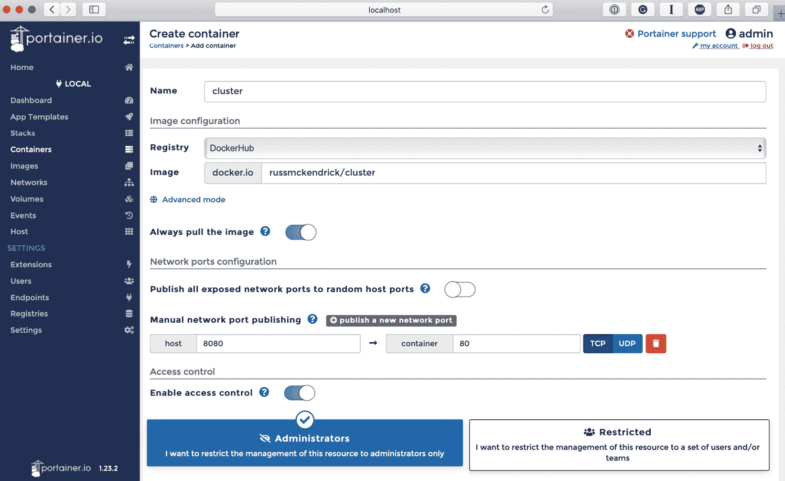

图 9.8 – 启动一个容器

完成后，点击**部署容器**，几秒钟后，正在运行的容器列表将返回，你应该能看到你新启动的容器：

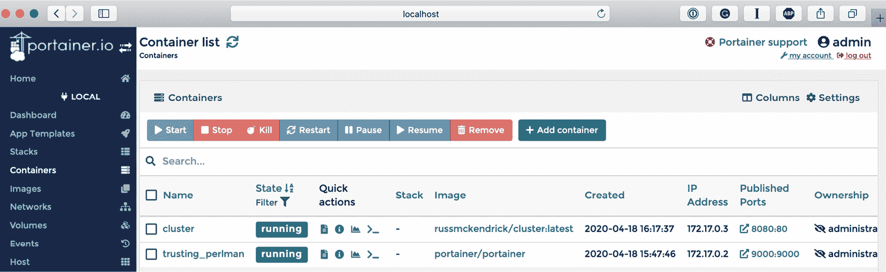

图 9.9 – 列出容器

在列表中每个容器左侧的勾选框可以启用顶部的按钮，你可以通过这些按钮控制容器的状态。请确保不要**Kill**或**Remove** Portainer 容器。点击我们所使用的集群容器名称，将显示更多关于容器本身的信息：

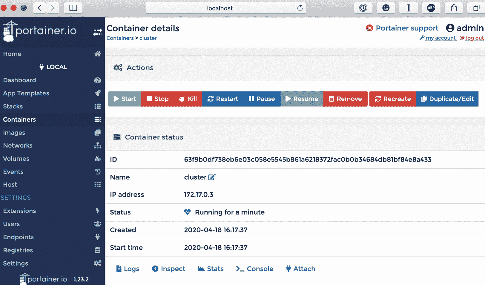

图 9.10 – 深入查看我们的容器

如你所见，容器的信息与你运行以下命令所得到的信息相同：

```
$ docker container inspect cluster
```

你可以通过点击**Inspect**来查看该命令的完整输出。你还会注意到，有**Stats**、**Logs**、**Console**和**Attach**按钮，我们接下来将讨论这些按钮。

### Stats

**Stats** 页面显示了 CPU、内存和网络利用率，以及正在检查的容器的进程列表：

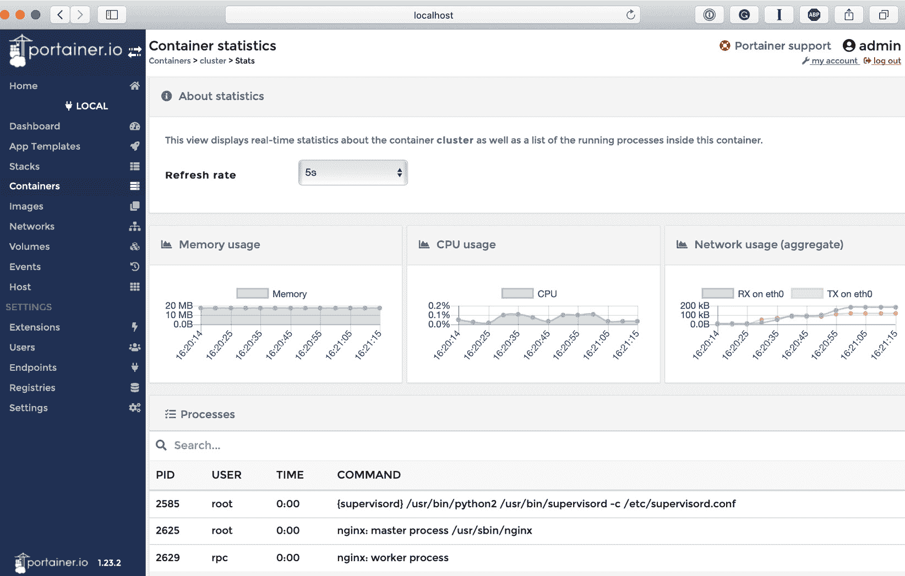

图 9.11 – 查看容器的统计信息

如果你保持页面打开，图表会自动刷新，而刷新页面会将图表清零并重新开始。这是因为 Portainer 使用以下命令从 Docker API 获取这些信息：

```
$ docker container stats cluster
```

每次刷新页面时，命令都会从头开始执行，因为 Portainer 当前不会在后台轮询 Docker 来记录每个正在运行的容器的统计信息。

### 日志

接下来是**Logs**页面。这里显示了运行以下命令的结果：

```
$ docker container logs cluster
```

它显示了 STDOUT 和 STDERR 日志：

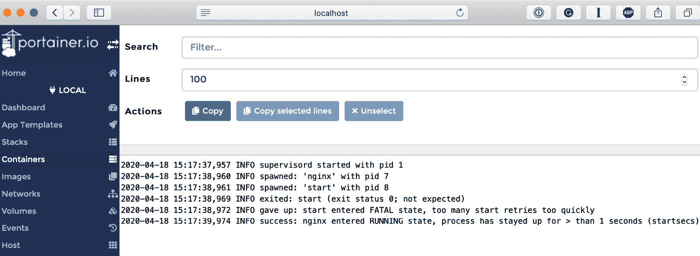

图 9.12 – 查看容器日志

您还可以选择向输出中添加时间戳；这相当于运行以下命令：

```
$ docker container logs --timestamps cluster
```

如我们之前所讨论的，请记住，根据主机的时区设置，时间戳可能会有所不同。

### 控制台和附加

接下来，我们有`/bin/bash`、`/bin/sh`或`/bin/ash`，以及选择以哪个用户进行连接——root 是默认值。虽然集群镜像中已安装了这两种 shell，我选择使用`/bin/bash`：


](img/Figure_9.13_B15659.jpg)

图 9.13 – 打开与容器的会话

这相当于运行以下命令来访问您的容器：

```
$ docker container exec -it cluster /bin/sh
```

如您从截图中可以看到，bash 进程的 PID 是 15。该进程是由`docker container exec`命令创建的，当您断开与 shell 会话的连接时，它将是唯一一个被终止的进程。

如果我们在启动容器时使用了`TTY`标志，我们也可以使用容器的`TTY`，而不是像使用**控制台**时那样生成一个 shell 进行连接，类似于在命令行上附加时，当断开连接时您的进程会停止。

镜像

左侧菜单中的下一个选项是**镜像**。在这里，您可以管理、下载和上传镜像：

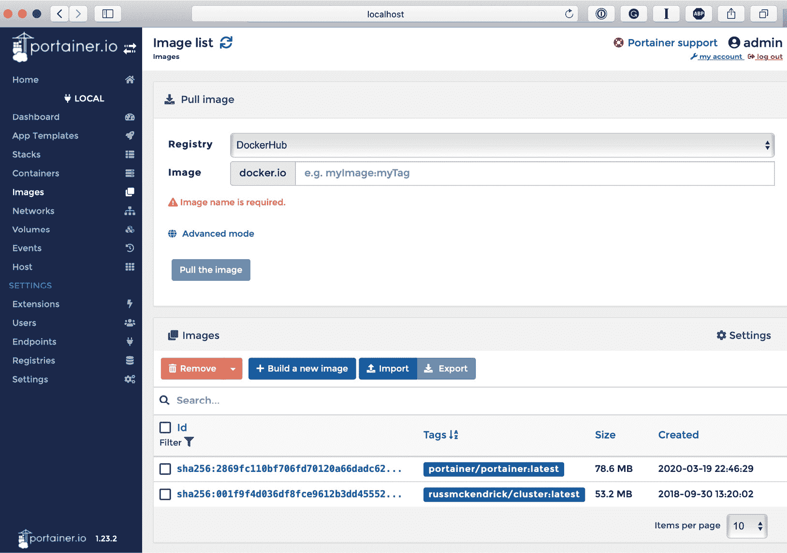

](img/Figure_9.14_B15659.jpg)

图 9.14 – 管理您的镜像

在页面顶部，您可以选择拉取一个镜像。例如，只需在框中输入`amazonlinux`，然后点击**拉取镜像**，就会从 Docker Hub 下载一份 Amazon Linux 容器镜像。Portainer 执行的命令将是：

```
$ docker image pull amazonlinux:latest
```

您可以通过点击镜像 ID 来获取关于每个镜像的更多信息；这将带您进入一个页面，页面上会清晰地显示运行此命令的输出：

```
$ docker image inspect russmckendrick/cluster
```

请看以下截图：

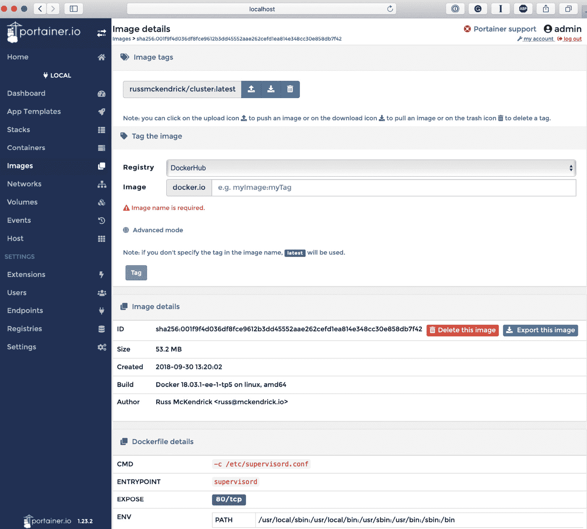

](img/Figure_9.15_B15659.jpg)

图 9.15 – 获取有关您的镜像的更多信息

您不仅可以获取关于镜像的所有信息，还可以选择将镜像的副本推送到您选择的注册表，或者默认情况下推送到 Docker Hub。您还可以查看镜像中包含的每个层的详细信息，显示在构建过程中执行的命令和每个层的大小。

菜单中的下两个项目允许您管理网络和卷；由于它们并没有太多内容，我这里不打算详细介绍。

### 网络

在这里，您可以使用默认的 bridge 驱动程序快速添加一个网络。点击**高级设置**将带您到一个页面，其中有更多选项。这些选项包括使用其他驱动程序、定义子网、添加标签和限制对网络的外部访问。与其他部分一样，您还可以删除网络并检查现有的网络。

### 卷

这里没有太多选项，除了添加或删除卷。当添加卷时，你可以选择驱动程序，并可以填写选项传递给驱动程序，这样就可以使用第三方驱动程序插件。除此之外，几乎没有什么可看的，甚至没有检查选项。

### 事件

事件页面显示了过去 24 小时内的所有事件；你还可以选择过滤结果，这意味着你可以快速找到你需要的信息：

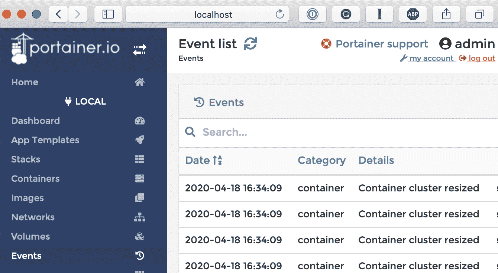

图 9.16 – 查看 Docker 事件

这相当于运行以下命令：

```
$ docker events --since '2020-04-17T16:30:00' --until '2020-04-
17T16:30:00'
```

这为我们提供了一个额外的选择需要覆盖。

### 主机

最后的条目仅显示以下命令的输出：

```
$ docker info
```

以下显示了命令的输出：

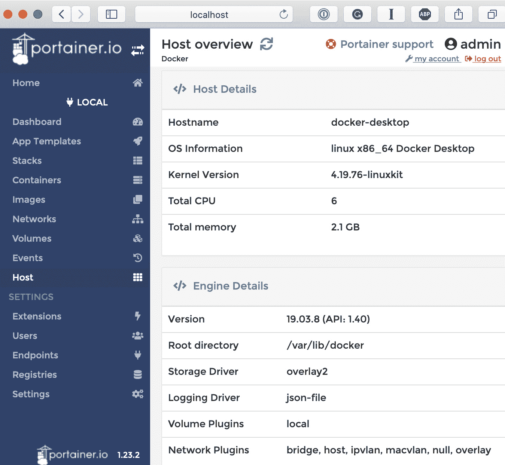

图 9.17 – 查看 Docker 主机的信息

如果你正在针对多个 Docker 实例端点，并且需要了解端点运行的环境，这将非常有用。

到这时，我们将开始查看在 Docker Swarm 上运行的 Portainer，所以现在是时候删除正在运行的容器以及我们最初启动 Portainer 时创建的卷了。你可以使用以下命令删除该卷：

```
$ docker volume prune
```

现在我们已经清理完毕，接下来让我们来看一下如何启动一个 Docker Swarm 集群。

# Portainer 与 Docker Swarm

在上一节中，我们介绍了如何在独立的 Docker 实例上使用 Portainer。Portainer 也支持 Docker Swarm 集群，界面中的选项会根据集群环境进行调整。我们应该先启动一个 Swarm，然后将 Portainer 作为服务启动，看看有什么变化。

所以让我们从启动一个新的 Docker Swarm 集群开始。

## 创建 Swarm

如同在 Docker Swarm 章节中，我们将使用 Multipass 在本地创建 Swarm；为此，运行以下命令启动三个节点：

```
$ multipass launch -n node1
$ multipass launch -n node2
$ multipass launch -n node3
```

现在安装 Docker：

```
$ multipass exec node1 -- \
	/bin/bash -c 'curl -s https://get.docker.com | sh - && sudo 
usermod -aG docker ubuntu'
$ multipass exec node2 -- \
	/bin/bash -c 'curl -s https://get.docker.com | sh - && sudo 
usermod -aG docker ubuntu'
$ multipass exec node3 -- \
	/bin/bash -c 'curl -s https://get.docker.com | sh - && sudo
usermod -aG docker ubuntu'
```

安装完 Docker 后，初始化并创建集群：`P=$(multipass info node1 | grep IPv4 | a`

```
$ multipass exec node1 -- \
	/bin/bash -c 'docker swarm init --advertise-addr $IP:2377 
--listen-addr $IP:2377'
$ SWARM_TOKEN=$(multipass exec node1 -- /bin/bash -c 'docker 
swarm join-token --quiet worker')
$ multipass exec node2 -- \
	/bin/bash -c 'docker swarm join --token $SWARM_TOKEN 
$IP:2377'
$ multipass exec node3 -- \
	/bin/bash -c 'docker swarm join --token $SWARM_TOKEN 
$IP:2377'
```

通过运行以下命令，记下`node1`的 IP 地址：

```
$ multipass list 
```

最后，登录到 Swarm 管理节点：

```
$ multipass shell node1
```

你现在应该已登录到主 Swarm 节点，并准备继续。

## Portainer 服务

现在我们有了 Docker Swarm 集群，我们可以通过简单地运行以下命令启动 Portainer 堆栈：

```
$ curl -L https://downloads.portainer.io/portainer-agent-stack.yml -o portainer-agent-stack.yml
$ docker stack deploy --compose-file=portainer-agent-stack.yml portainer
```

这应该会给你如下所示的输出：

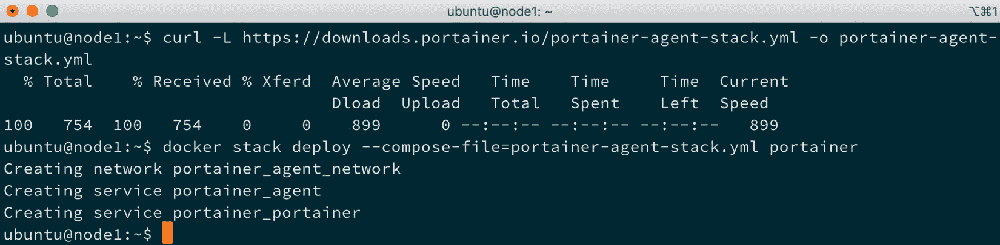

图 9.18 – 在我们的 Docker Swarm 集群上启动 Portainer Stack

一旦堆栈创建完成，你应该能够在浏览器中访问`node1`的 IP 地址，并在末尾加上`:9000`；例如，我打开了[`192.168.64.9:9000`](http://192.168.64.9:9000)。

## Swarm 的区别

如前所述，当 Portainer 连接到 Docker Swarm 集群时，界面会有一些变化。在本节中，我们将介绍这些变化。如果界面的一部分没有提到，那么在单主机模式和 Docker Swarm 模式下运行 Portainer 是没有区别的。我们要看的第一个变化是，当您首次登录新启动的 Portainer 时会发生什么变化。

### 端点

登录后，您首先需要选择一个端点。正如您在下面的屏幕中看到的，只有一个名为**primary**的端点：

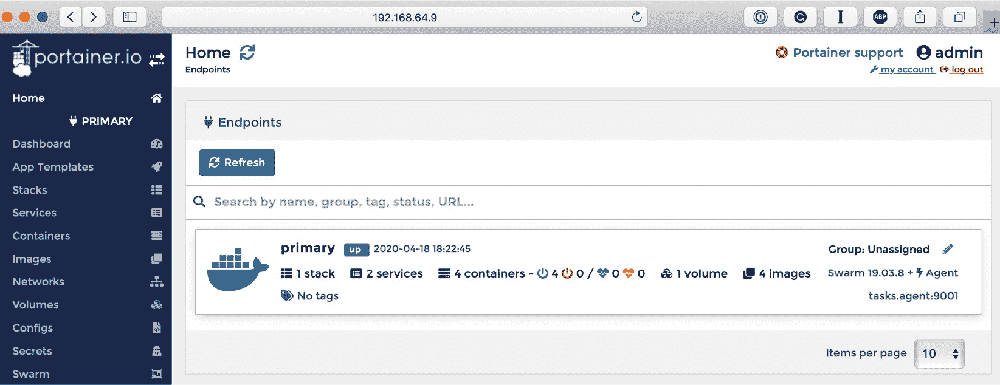

图 9.19 – 查看端点

点击端点将带您进入仪表板。我们将在本节末尾再次查看端点。

### 仪表板和 Swarm

您会注意到的第一个变化是，仪表板现在显示了一些关于 Swarm 集群的信息。正如您在下面的屏幕中看到的，顶部有一个**集群信息**部分：

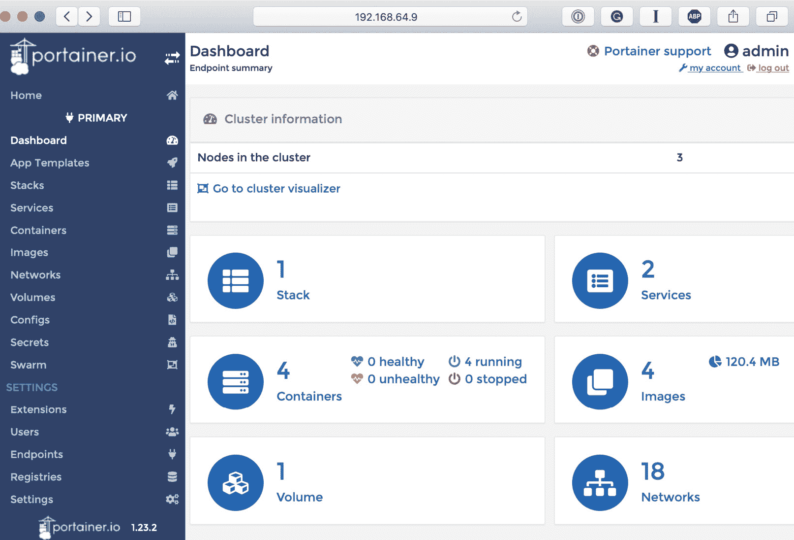

图 9.20 – 获取集群概览

点击**前往集群可视化工具**将带您进入 Swarm 页面。这为您提供了集群的可视化概览，目前唯一正在运行的容器是提供和支持 Portainer 服务所需的容器：

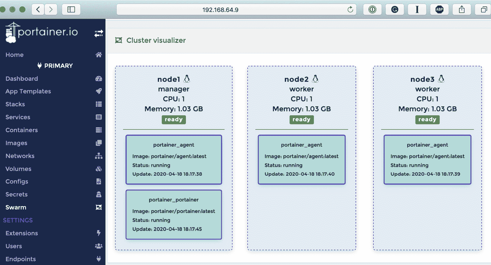

图 9.21 – 可视化集群

### 堆栈

我们还没有覆盖的左侧菜单项是**堆栈**。从这里，您可以启动堆栈，就像我们在查看 Docker Swarm 时所做的那样。事实上，让我们使用之前的 Docker Compose 文件，它看起来像这样：

```
version: '3'
services:
  redis:
    image: redis:alpine
    volumes:
      - redis_data:/data
    restart: always
  mobycounter:
    depends_on:
      - redis
    image: russmckendrick/moby-counter
    ports:
      - '8080:80'
    restart: always
volumes:
  redis_data:
```

点击`MobyCounter`。不要在名称中添加任何空格或特殊字符，因为这是 Docker 使用的。然后点击**部署堆栈**。

部署完成后，您可以点击**MobyCounter**并管理堆栈：

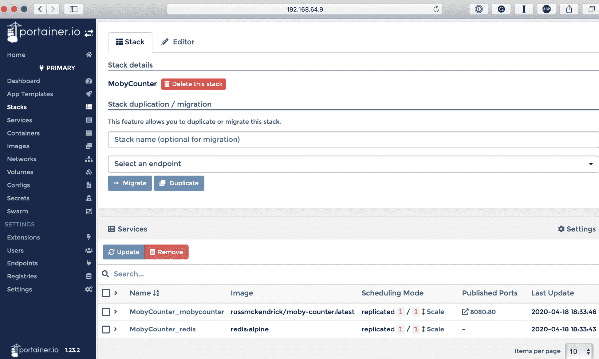

图 9.22 – 启动堆栈

堆栈是服务的集合。接下来，我们将一起查看它们。

### 服务

此页面是您可以创建和管理服务的地方；它应该已经显示了多个服务，包括 Portainer。为了避免与正在运行的 Portainer 容器发生冲突，我们将创建一个新服务。为此，请点击**+ 添加服务**按钮。在加载的页面上，输入以下内容：

+   `cluster`

+   `russmckendrick/cluster`

+   `Replicated`

+   `1`

这一次，我们需要为主机上的端口`7000`添加端口映射，以映射到容器的端口`80`，这是因为由于我们之前已经启动的服务和堆栈，一些常用的端口已经在主机上被占用：

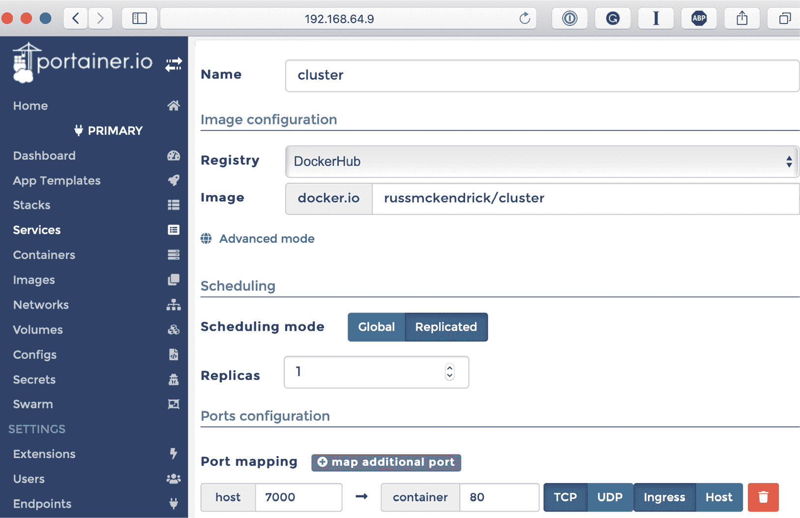

图 9.23 – 启动服务

输入完信息后，点击**创建服务**按钮。你将被带回服务列表页面，列表中应该会显示我们刚刚添加的集群服务。你可能已经注意到，在**调度模式**部分，有一个可以进行扩展的选项。点击它，并将我们的**集群**服务的副本数增加到**6**。

点击**名称**部分中的**集群**，我们将看到服务的概述。正如你所见，关于服务有大量信息：

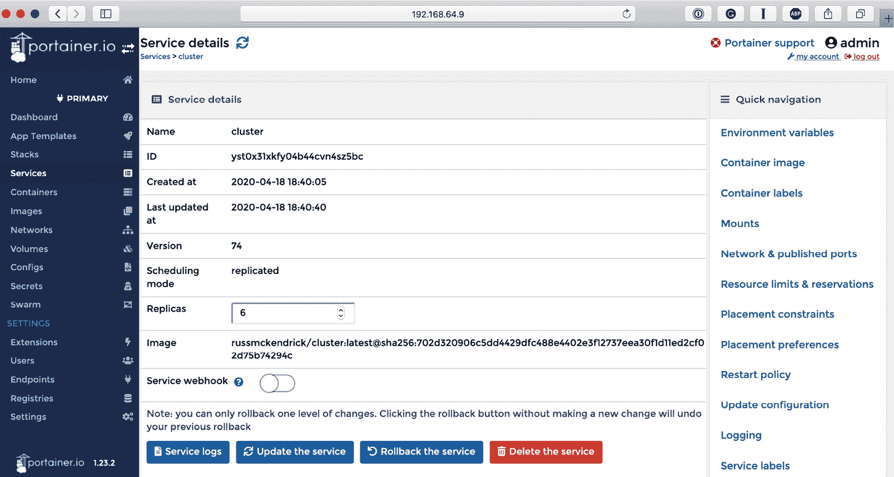

图 9.24 – 查看服务详情

你可以在运行时对服务进行很多更改，包括放置约束、重启策略、添加服务标签等等。在页面底部，有一个与服务相关的任务列表：

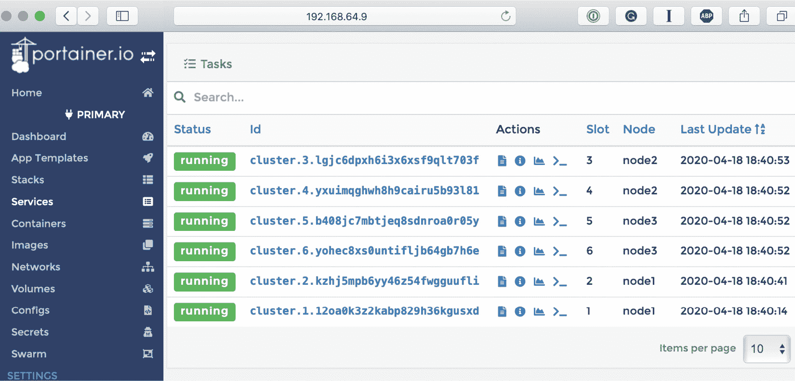

图 9.25 – 查看任务

如你所见，我们有六个正在运行的任务，每个节点上有两个任务。点击左侧菜单中的**容器**可能会显示与预期不同的内容：

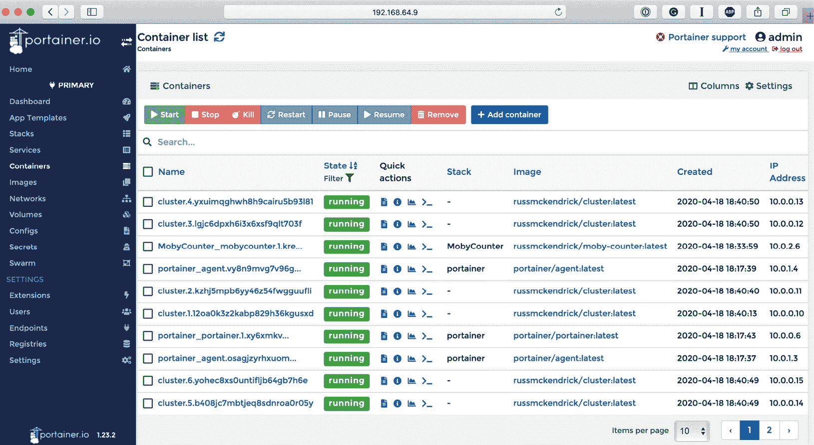

图 9.26 – 列出所有容器

你可以看到集群中所有正在运行的容器，而不仅仅是我们部署 Portainer 的节点上的容器。你可能记得，当我们查看集群可视化工具时，集群内每个节点上都有 Portainer Agent 容器，这些容器是作为堆栈的一部分启动的。它们会将信息反馈回来，为我们提供集群的整体视图。

返回集群可视化工具后，显示我们现在运行了更多的容器：

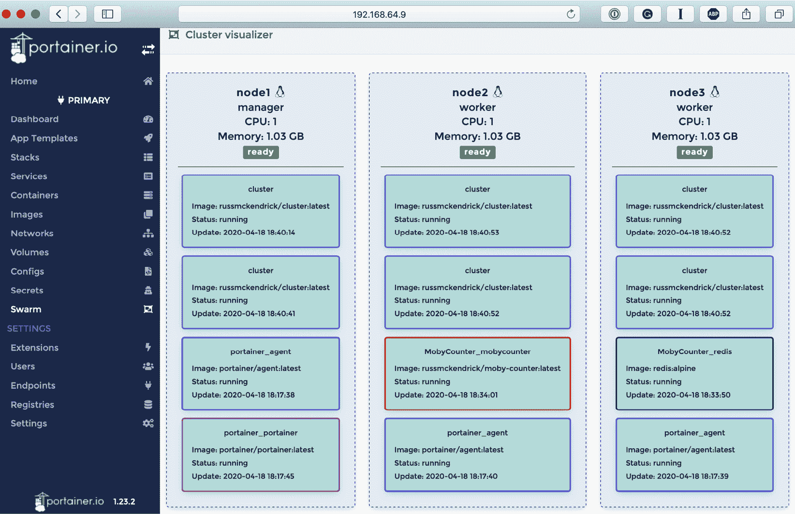

图 9.27– 查看可视化工具

让我们看看迁移到运行 Docker Swarm 后，还有什么变化。

### 应用模板

现在进入**应用模板**页面会显示堆栈，而不是容器：

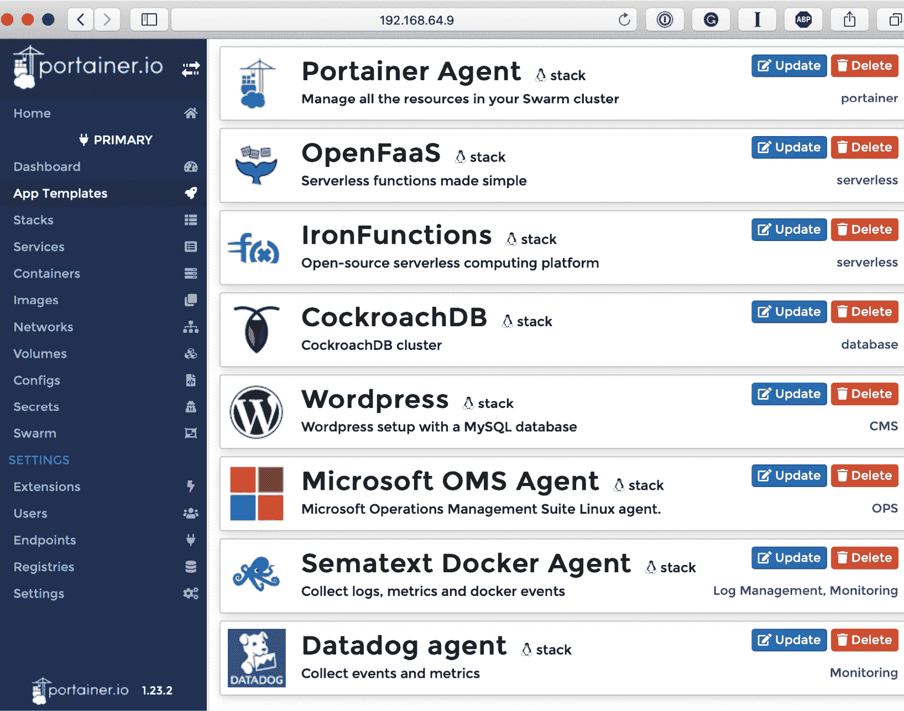

图 9.28 – 查看堆栈模板

如你所见，有许多默认选项，点击其中一个，比如**Wordpress**，将带你进入一个页面，你只需输入一些信息，然后点击**部署堆栈**按钮。部署后，你可以进入**堆栈**页面，查看已分配给服务的端口：

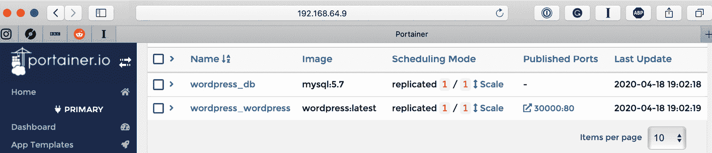

图 9.29 – 启动 Wordpress

一旦知道端口，输入任何节点的 IP 地址和端口，你将进入应用程序，按照安装说明操作后，页面应显示如下：

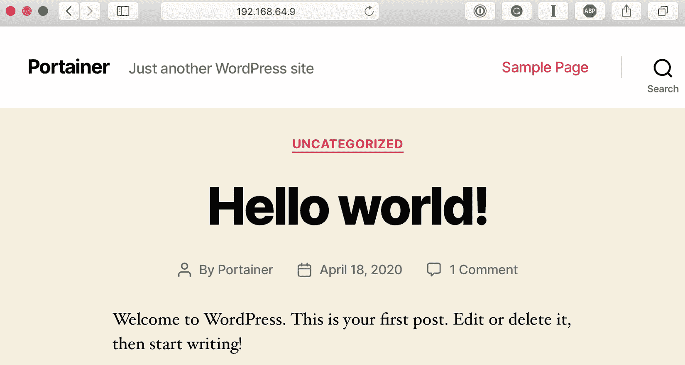

图 9.30 – WordPress 启动并运行

这些模板托管在 GitHub 上，你可以在*进一步阅读*部分找到链接。

### 移除集群

一旦你完成了对 Docker Swarm 上 Portainer 的探索，你可以通过在本地机器上运行以下命令来移除集群：

```
$ multipass delete --purge node1
$ multipass delete --purge node2
$ multipass delete --purge node3
```

在本地机器上移除正在运行的节点非常重要，因为如果不移除，它们将继续运行并消耗资源。

# 总结

这就是我们对 Portainer 的深入探讨。如你所见，Portainer 非常强大，且易于使用，随着新特性发布，它将继续发展并整合更多 Docker 生态系统的功能。使用 Portainer，你不仅可以操作主机，还能管理单机或集群主机上运行的容器和服务。

在下一章，我们将介绍 Docker 支持的另一种容器集群解决方案——Kubernetes。

# 问题

1.  在 macOS 或 Linux 机器上，Docker 套接字文件的挂载路径是什么？

1.  Portainer 默认运行在哪个端口？

1.  对还是错：你可以将 Docker Compose 文件用作应用程序模板。

1.  对还是错：Portainer 显示的统计数据仅为实时数据，无法查看历史数据。

# 进一步阅读

你可以在这里找到更多关于 Portainer 的信息：

1.  官方网站: [`www.portainer.io`](https://www.portainer.io)

1.  GitHub 上的 Portainer: [`github.com/portainer/`](https://github.com/portainer/)

1.  最新文档: [`portainer.readthedocs.io/en/latest/index.html`](https://portainer.readthedocs.io/en/latest/index.html)

1.  模板文档: [`portainer.readthedocs.io/en/latest/templates.html`](https://portainer.readthedocs.io/en/latest/templates.html)

1.  模板: [`github.com/portainer/templates`](https://github.com/portainer/templates)
