# 第十章：在公共云中运行 Docker

到目前为止，我们一直使用 Digital Ocean 在基于云的基础设施上启动容器。在本章中，我们将探讨**Amazon Web Services**（**AWS**）、Microsoft Azure 和 Google Cloud 提供的容器解决方案。

在讨论这些容器服务之前，我们还将介绍每个云服务提供商的历史背景，并介绍启动容器服务所需的任何命令行工具的安装。

本章将覆盖以下主题：

+   AWS

+   Microsoft Azure

+   Google Cloud Run

# 技术要求

在本章中，我们将使用 AWS、Microsoft Azure 和 Google Cloud，因此如果你跟随操作，你需要拥有一个或多个云服务提供商的活跃账户。

请记住，如果你跟随操作，可能会对你在公共云提供商处启动的服务产生费用——请确保在使用完资源后终止它们，以避免任何意外费用。

# Amazon Web Services

本章我们将首先介绍的公共云提供商是 AWS。它最早于 2002 年 7 月作为内部服务推出，用于在亚马逊内部提供一些分散的服务，支持亚马逊零售网站。大约一年后，亚马逊的一次内部演示为 AWS 的发展奠定了基础：一个标准化且完全自动化的计算基础设施，用来支持亚马逊构建基于网络的零售平台的愿景。

在演示的最后，提到亚马逊可能会出售一些 AWS 提供的服务访问权限，以帮助资助为启动平台所需的基础设施投资。2004 年底，这些公共服务中的第一个服务——**Amazon Simple Queue Service**（**Amazon SQS**）——作为分布式消息队列服务发布。大约在这个时候，亚马逊开始开发既能为零售网站提供服务，又能向公众销售的服务。

2006 年，AWS 重新启动，**Amazon SQS**后加入了**Amazon Simple Storage Service**（**Amazon S3**）和**Amazon Elastic Compute Cloud**（**Amazon EC2**），从那时起，AWS 的受欢迎程度不断增长。撰写本文时，AWS 的年收入超过 250 亿美元，平台提供的服务数量也从最初的 3 个增长到了 210 多个。

这些服务包括我们在*第三章*中讨论过的**Amazon Elastic Container Registry**（**Amazon ECR**），*存储和分发镜像*，**Amazon Elastic Container Service**（**Amazon ECS**）和**AWS Fargate**。虽然后两个服务实际上是为了协同工作而设计的，但让我们快速回顾一下在 AWS 引入 AWS Fargate 之前，使用 Amazon ECS 时有哪些可用的选项。

## Amazon ECS – 基于 EC2

亚马逊对 Amazon ECS 的描述如下：

"一个高度可扩展、快速的容器管理服务，方便在集群上运行、停止和管理 Docker 容器。"

本质上，它允许你在启动第一个 ECS 集群之前，管理 Docker 容器在计算资源集群上的位置和可用性。让我们快速了解一下相关术语，并大致了解它是如何组合的。当我们启动托管在 Amazon ECS 上的应用时，我们需要定义以下内容：

+   容器

+   任务

+   服务

+   集群

以下图示将给你一个如何在集群中使用前述元素的概念；你可以清晰地看到容器、任务和服务，在这个图示中，服务是跨越三个实例的框：

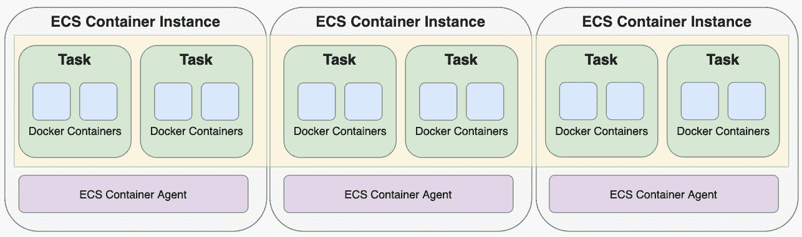

图 10.1 – Amazon ECS 容器实例

前述图示与如果我们使用 AWS Fargate 之间的一个重要区别在于我们正在运行容器实例。要启动 EC2 实例集群，请按照以下步骤操作：

1.  打开 AWS 控制台：[`console.aws.amazon.com/`](https://console.aws.amazon.com/)。

1.  登录。

1.  在页面左上角的 **服务** 菜单中选择 **ECS**。

1.  打开 Amazon ECS 页面后，在右上角的区域切换器中选择你喜欢的区域——由于我在英国，所以选择了**伦敦**。

1.  点击左侧菜单中的 **集群**，这是第一个选项：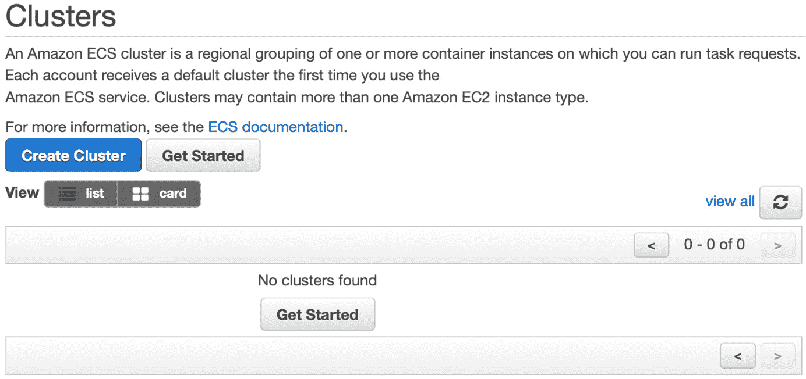

    图 10.2 – 创建 Amazon ECS 集群

1.  点击 **创建集群** 按钮后，你将看到三个选项：

    **仅限网络**

    **EC2 Linux + 网络**

    **EC2 Windows + 网络**

1.  由于我们接下来将启动一个 AWS Fargate 集群，并且我们的测试应用程序是基于 Linux 的，请选择 **EC2 Linux + 网络**，然后点击底部的 **下一步** 按钮，你应该会看到 **配置集群** 页面。

1.  我们需要为集群命名。集群名称是唯一的，我将我的命名为 `RussTestECSCluster`。

1.  保持 `1` 至 `3`；使用竞价实例时，确保至少有一个以上的实例，以保持基本的可用性。

    **EC2 Ami Id**：此选项无法更改。

    **EBS 存储（GiB）**：我将其保留为默认值，**22GB**。

    **密钥对**：我将其保留为**无 - 无法 SSH**。

1.  对于 **网络**、**容器实例 IAM 角色**、**Spot Fleet IAM 角色** 和 **标签**，我将所有选项保持为默认值，直到最后一个选项 **CloudWatch 容器洞察**，我勾选了 **启用容器洞察**。所有内容填写完毕后，点击 **创建** 按钮。点击后，集群将被启动，你可以跟踪资源配置和启动的进度：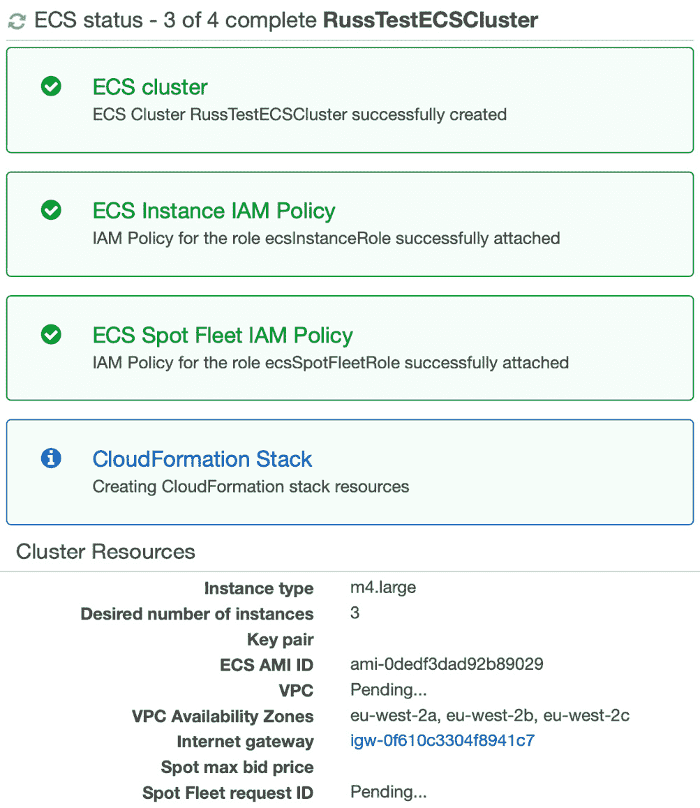

    图 10.3 – 启动 ECS 集群

1.  启动后，你可以点击**查看集群**按钮，这将带你到以下界面：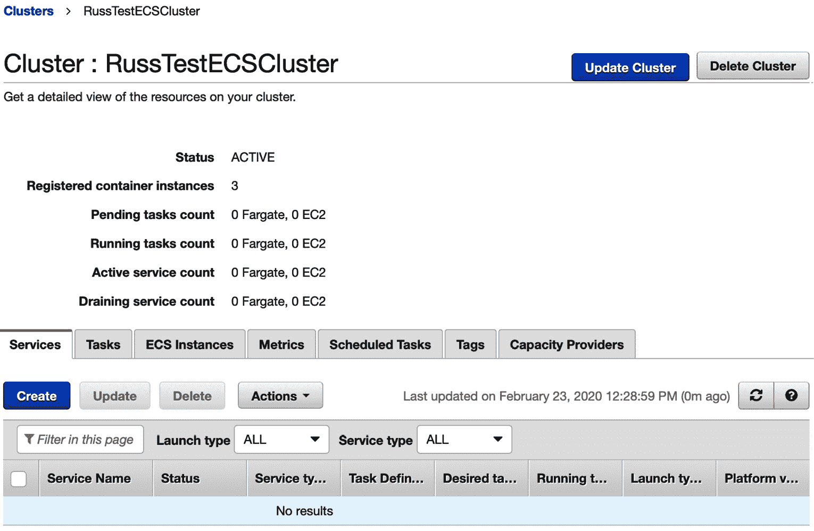

    图 10.4 – 查看 ECS 集群

1.  现在我们已经有了集群，我们需要创建一个任务定义。为此，点击左侧菜单中的**任务定义**，然后点击**创建新任务定义**按钮。首先给出的选项是选择我们要使用的启动类型。我们刚刚创建了一个基于 EC2 的集群，因此选择**EC2**：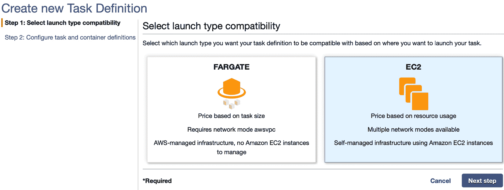

    图 10.5 – 选择我们需要的任务类型

1.  选择后，点击`cluster-task`。

    `1gb`。

    `1 vcpu`。

1.  这将带我们进入容器定义部分。由于任务定义是容器的集合，你可以在这里输入多个容器。在这个示例中，我们将添加一个单独的容器。首先，点击`cluster-container`。

    `russmckendrick/cluster:latest`。

    `128`。

    `80`用于`tcp`。

1.  保持表单的其余部分为默认设置，然后点击**添加**。

1.  我们需要定义的任务定义的最后一部分是`cluster-task`，保持**卷类型**为**绑定月**，并将**源路径**留空，然后点击**添加**按钮。现在，点击**创建**，然后通过左侧的**集群**菜单返回到集群。

1.  现在我们已经有了集群和任务定义，我们可以创建一个服务。为此，在`cluster-service`中进行创建。

    **服务类型**：保持为**REPLICA**。

    **任务数量**：输入 2。

    **最小健康百分比**：保持为**100**。

    **最大百分比**：保持为**200**。

1.  保持**部署**和**任务放置**选项为默认值，并点击页面底部的**下一步**按钮，这将带你到**配置网络**页面：

    **负载均衡器类型**：选择**无**。

    **启用服务发现集成**：取消勾选此选项。

1.  点击**下一步**，将**服务自动扩展**设置为默认的**不调整服务的期望数量**选项，然后点击**下一步**。在审核选项后，点击**创建服务**按钮。

1.  在打开正在运行的容器之前，我们需要打开防火墙规则。为此，选择`30000-60000`。

    `0.0.0.0/0`。

    `容器端口`。

1.  然后，点击**保存规则**按钮。这样你应该看到如下所示的内容：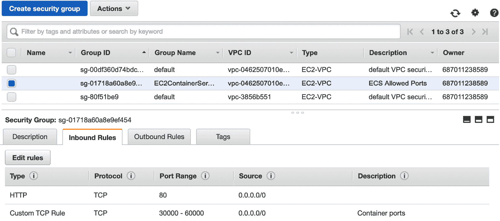

    图 10.6 – 更新安全组规则

1.  设置完规则后，返回到你的 ECS 集群，点击**任务**标签，然后选择两个正在运行的任务之一。任务概览页面加载后，向下滚动到容器并展开表格中列出的容器，然后点击外部链接。这将直接带你到正在运行的容器：

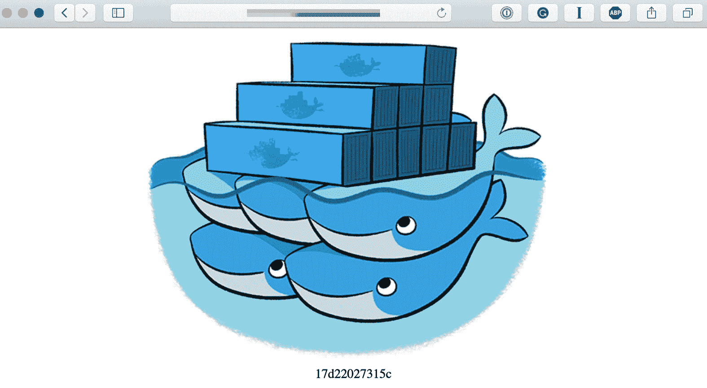

图 10.7 – 我们的工作应用程序

现在您已经看到正在运行的容器，接下来让我们删除集群。为此，请前往集群概览页面，并点击右上角的**删除集群**按钮 – 然后按照屏幕上的指示操作。

这是以前在 AWS 中启动容器的传统方式；我说是“传统方式”，因为我们仍然需要启动 EC2 实例来为我们的集群提供支持，即便我们使用的是抢占实例，我们依然会有许多未被使用的资源，这些本应收费 —— 那么如果我们只需要启动容器，而不必担心管理一堆 EC2 资源怎么办呢？

## 亚马逊 ECS – AWS Fargate 支持

2017 年 11 月，亚马逊宣布他们一直在开发 AWS Fargate —— 这是一项与 Amazon ECS 兼容的服务，消除了启动和管理 EC2 实例的需求。相反，您的容器将在亚马逊的后台启动，且按秒计费，这意味着您只需为容器化应用在生命周期中所请求的 vCPU 和内存付费。

我们将稍微“作弊”一下，先通过亚马逊 ECS 的首次运行流程来操作。您可以通过访问以下网址进入：https://console.aws.amazon.com/ecs/home?#/firstRun。

这将引导我们完成启动容器到 Fargate 集群中的四个步骤。启动我们的 AWS Fargate 托管容器的第一步是配置容器和任务定义：

1.  对于我们的示例，有三个预定义选项和一个自定义选项。点击 `cluster-container`。

    `russmckendrick/cluster:latest`。

    `80`，并保持选择 `tcp`。

1.  然后，点击`cluster-task`。

    `awsvpc`；您不能更改此选项。

    `ecsTaskExecutionRole`。

    `FARGATE`，并且您不应该能够编辑它。

    **任务内存和任务 CPU**：将两者保持在默认选项。

1.  一旦一切都已更新，点击**保存**按钮。现在，您可以点击页面底部的**下一步**按钮。这将带我们进入第二步，也就是定义服务的地方。

1.  如我们在上一节讨论的，服务运行任务，这些任务又与容器相关联。默认的服务设置是没问题的，因此点击**下一步**按钮继续进行启动过程的第三步。第一步是创建集群。再次强调，默认值是没问题的，因此点击**下一步**按钮进入审核页面。

1.  这是您在启动任何服务之前最后一次检查任务、服务和集群定义的机会。如果您对一切都满意，请点击**创建**按钮。从这里，您将进入一个页面，在该页面上您可以查看构建我们 AWS Fargate 集群的各种 AWS 服务的状态：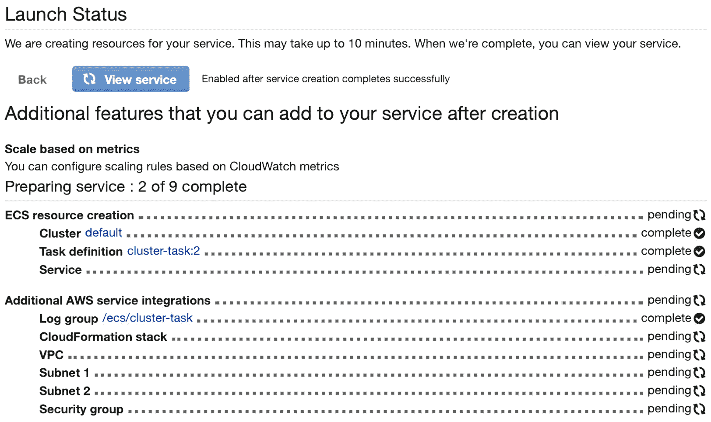

    图 10.8 – 启动我们的 Fargate 集群

1.  一旦所有内容从 **待处理** 状态变为 **完成**，你将能够点击 **查看服务** 按钮，进入 **服务** 概览页面：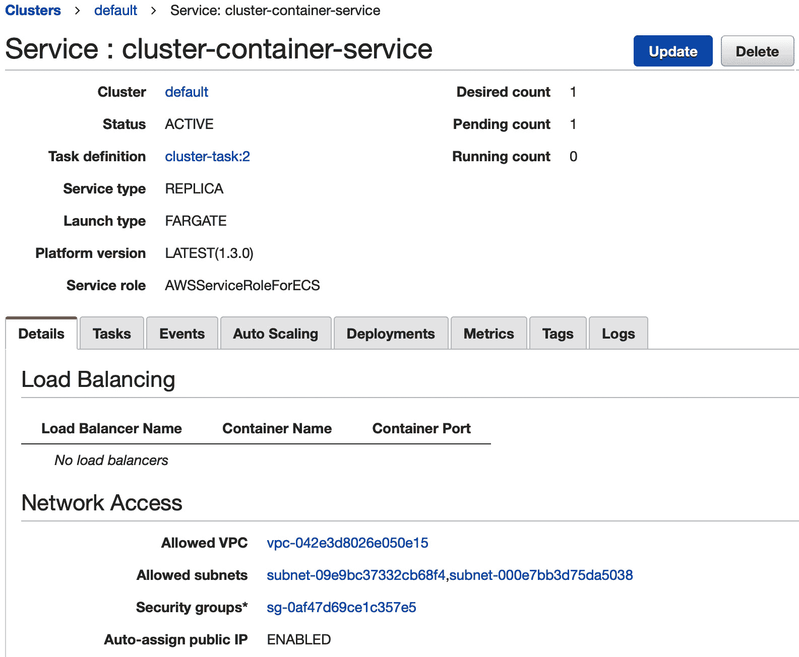

    图 10.9 – 查看我们的 Fargate 集群

1.  现在，我们需要知道容器的公网 IP 地址。要找到这个地址，点击 **任务** 标签，然后选择正在运行任务的唯一 ID。在页面的 **网络** 部分，你应该能够找到任务的私有和公网 IP 地址。将公网 IP 输入浏览器后应该能够打开我们熟悉的集群应用：

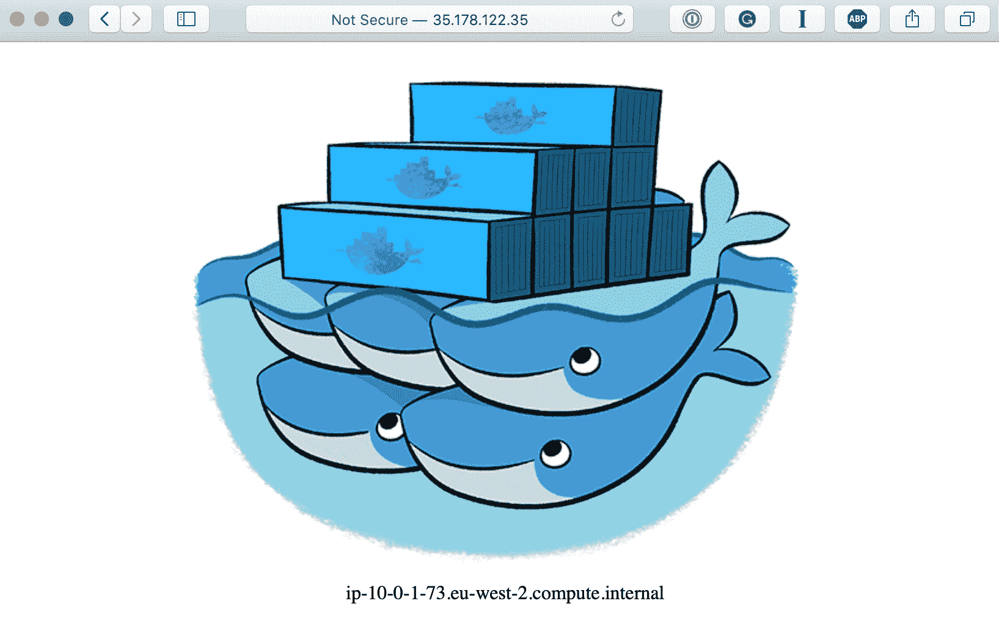

图 10.10 – 我们的工作应用程序

你会注意到显示的容器名称是容器的主机名，并包含了内部 IP 地址。你还可以通过点击 **日志** 标签查看容器的日志：

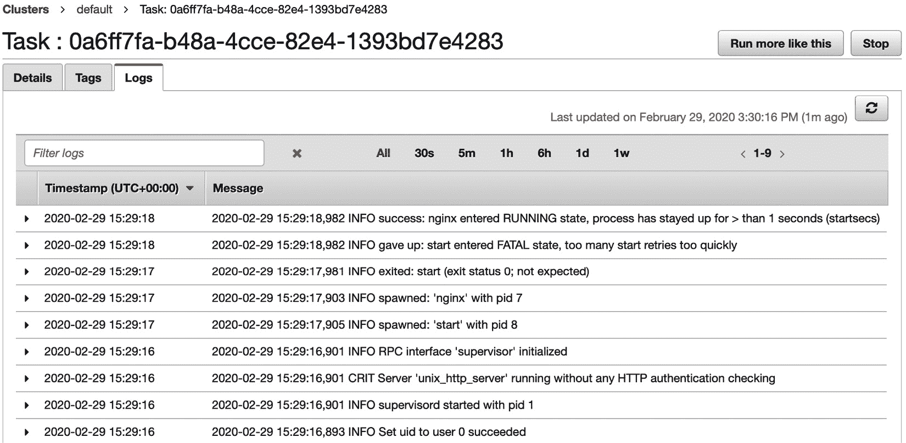

图 10.11 – 查看容器日志

那么，这个费用是多少呢？要运行一个容器整整一个月的费用大约是 14 美元，按每小时约 0.019 美元计算。

这个费用意味着，如果你计划 24/7 全天候运行多个任务，那么 Fargate 可能不是最具成本效益的容器运行方式。相反，你可能希望选择 Amazon ECS EC2 选项，在那里你可以将更多容器打包到你的资源中，或者选择 Amazon EKS 服务，我们将在本章稍后讨论。然而，对于快速启动一个容器然后终止它，Fargate 是非常出色的——启动容器的门槛低，支持的资源数量也很少。

一旦你完成了 Fargate 容器的操作，应该删除集群。这将移除与集群关联的所有服务。删除集群后，进入 **任务定义** 页面，必要时注销它们。

## 总结 AWS

在本章的这一部分，我们仅介绍了 Amazon ECS 的基本工作原理；我们没有涵盖的是 Amazon ECS 管理的容器与其他 AWS 服务（如 **弹性负载均衡**、**Amazon Cloud Map** 和 **AWS App Mesh**）的紧密集成。此外，通过使用 Amazon ECS 命令行工具，你可以将 Docker Compose 文件部署到 Amazon ECS 管理的集群中。

现在我们已经掌握了 AWS 的基础知识，接下来让我们来看一下它的主要竞争对手之一，Microsoft Azure。

# Microsoft Azure

**Microsoft Azure**，或最初称为 Windows Azure，是微软进入公共云市场的产品。它提供了**软件即服务**（**SaaS**）、**平台即服务**（**PaaS**）和**基础设施即服务**（**IaaS**）的组合服务。它最初是一个内部微软项目，代号为*Project Red Dog*，大约在 2005 年启动。Project Red Dog 是*Red Dog 操作系统*的延续，后者是一个基于 Windows 操作系统的分支，专注于使用核心 Windows 组件提供数据中心服务。

该服务在 2008 年的微软开发者大会上公开宣布，由五个核心服务组成：

+   Windows Azure：允许用户启动并管理计算实例、存储和各种网络服务。

+   **Microsoft SQL 数据服务**：微软 SQL 数据库的云版本。

+   **Microsoft .NET 服务**：允许您将 .NET 实例部署到云端，而无需担心实例问题的服务。

+   **Microsoft SharePoint 和** **Microsoft Dynamics 服务**：这些将是微软的企业内部网和客户关系管理（CRM）软件的 SaaS 提供。

它于 2010 年初推出，评价不一，因为有些人认为它相对于 AWS 来说功能有限，而 AWS 此时已经发布 4 年，且更加成熟。然而，微软坚持不懈，在过去的 10 年里增加了许多服务，远远超越了其 Windows 根基。这促使了 Windows Azure 在 2014 年更名为 Microsoft Azure。

从那时起，微软的云在功能上迅速赶上了 AWS，根据你阅读的新闻来源，企业选择微软的云来运行其云工作负载，得益于与其他微软服务（如**Microsoft Office** 和 **Microsoft 365**）的紧密集成。

## Azure 容器 Web 应用

Microsoft Azure 应用服务是一个完全托管的平台，允许您部署应用程序，并让 Azure 负责管理它们运行的平台。在启动应用服务时，有几种选项可供选择。您可以运行用**.NET**、**.NET Core**、**Ruby**、**Node.js**、**PHP** 和 **Python** 编写的应用程序，或者直接从容器镜像注册表中启动一个镜像。

在这次简短的演练中，我们将从 Docker Hub 启动集群镜像：

1.  登录 Azure 门户：[`portal.azure.com/`](https://portal.azure.com/)。

1.  从左侧菜单中选择**应用服务**，可以通过屏幕左上角的汉堡菜单图标访问：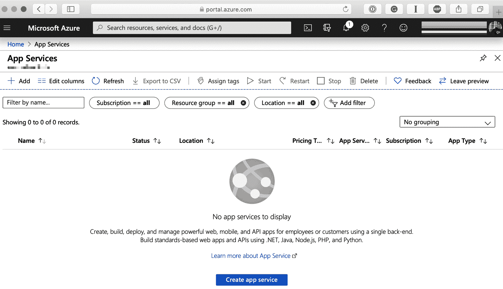

    图 10.12 – 准备启动应用服务

1.  在加载的页面上，点击`Docker 容器`。

    **操作系统**：保留为**Linux**。

    **区域**：选择你偏好的区域。

    **应用服务计划**：默认情况下，选择了一个更昂贵的生产就绪计划，所以在 **Sku and size** 部分点击 **Change size** 将为您提供更改定价层次的选项。对于我们的需求，**Dev/Test** 计划将是合适的选择。

1.  一旦您选择并填写了上述选项，请点击`Single container`。

    从下拉列表中选择`Docker Hub`。这将在表单下方打开 Docker Hub 的选项。

    `public`.

    `russmckendrick/cluster:latest`.

    **启动命令**：留空。

1.  完成所有步骤后，浏览 **Monitoring** 和 **Tag** 标签，然后在查看信息后点击 **Create** 按钮。一两分钟后，您将看到如下屏幕：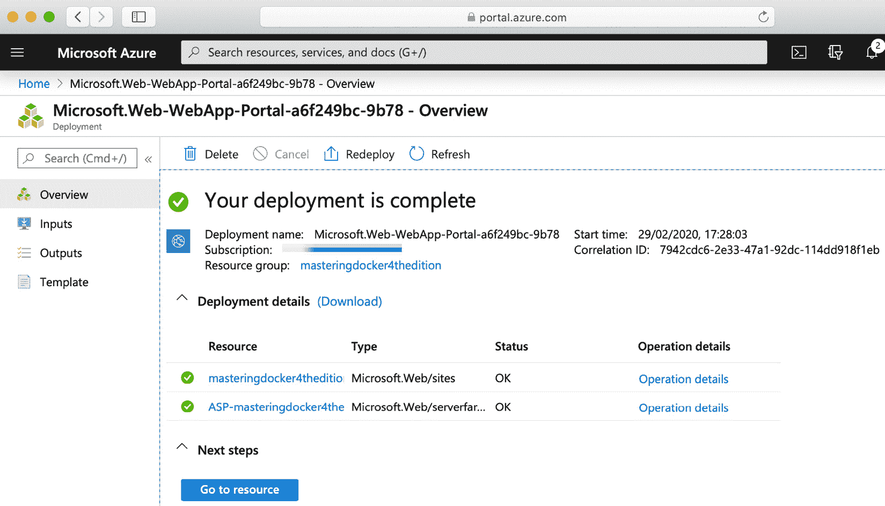

    图 10.13 – 部署应用服务

1.  点击 **Go to resource** 按钮将带您到新启动的应用程序：

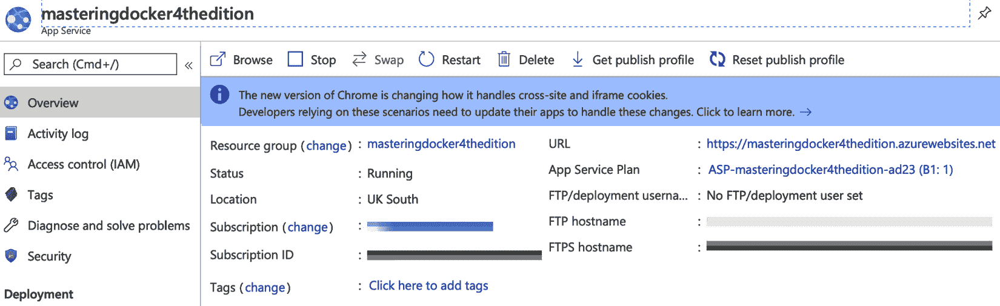

图 10.14 – 查看我们运行的应用服务

我们的应用程序已经启动，您应该能够通过 Azure 提供的 URL 访问服务，例如，我的是 [`masteringdocker4thedition.azurewebsites.net`](https://masteringdocker4thedition.azurewebsites.net)。打开这个链接，您的浏览器将显示集群应用程序：

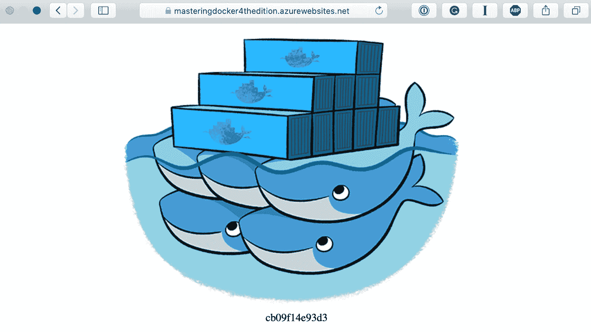

图 10.15 – 显示集群应用程序

正如您所见，这一次我们有容器 ID，而不是在启动 AWS Fargate 上时得到的完整主机名。这种规格的容器每月大约花费我们 $10。

将容器作为应用程序启动，而不仅仅是一个普通的容器还有一些其他非常有用的优势，例如，您可能已经注意到我们的容器 URL 启用了**SSL 证书**。虽然当前使用的是覆盖 [azurewebsites.net](http://azurewebsites.net) 的证书，您可以添加自定义域并提供自己的 SSL 证书。

另一个方便的功能是，您可以通过来自 Webhook 的触发器自动更新单个容器。例如，当您的新容器镜像成功构建后，您可以在应用程序的**Container settings**页面找到此选项：

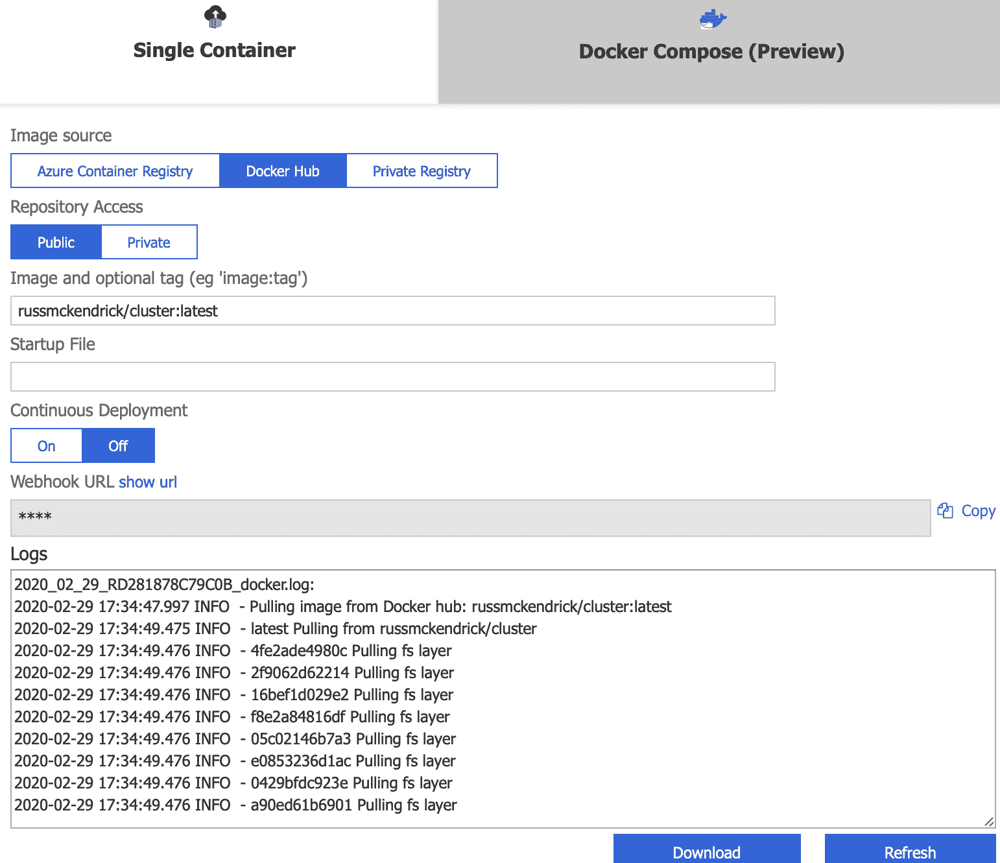

图 10.16 – 启动多个容器

此外，正如我们首次配置应用程序时提到的，您可以使用 Docker Compose 文件在 Microsoft Azure Web 应用程序中启动多个容器。

完成 Web 应用程序后，删除它和资源组，假设它不包含其他您需要的资源。

## Azure 容器实例

现在我们已经学习了如何使用 Azure Web 应用启动 Docker 容器，接下来让我们看看 Azure 容器实例服务。可以将其视为类似于 AWS Fargate 服务的概念，它允许你直接在微软的共享底层架构上启动容器。

让我们配置一个容器实例：

1.  在屏幕顶部的搜索栏中输入`Container instances`，然后点击**容器实例**服务的链接。

1.  页面加载完成后，点击`Public`。

    `russmckendrick/cluster:latest`。

    `Linux`。

    `1GB`。

1.  填写完信息后，点击`是`。

    配置了`80`端口和**TCP**协议。

    **DNS 名称标签**：为你的容器输入 DNS 名称。

1.  跳过**高级**和**标签**部分，直接进入**审核 + 创建**。验证通过后，点击**创建**按钮：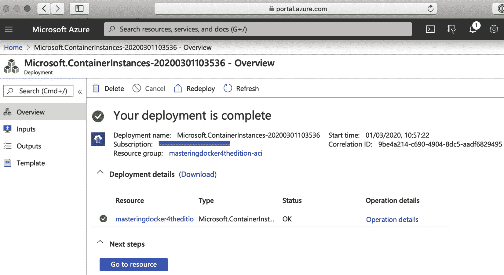

    图 10.17 – 启动我们的 Azure 容器实例

1.  如之前所示，点击**转到资源**按钮，你将被带到新创建的 Azure 容器实例，正如下面的截图所示：

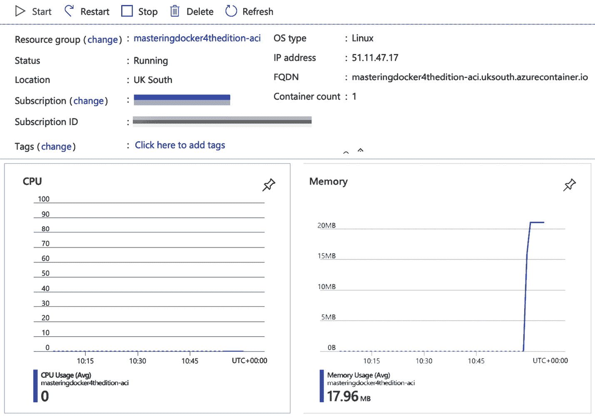

图 10.18 – 我们的 Azure 容器实例概览

选项比我们在 Web 应用中看到的要少，这是因为 Azure 容器实例的设计目的是执行一项任务：运行容器。

如果你点击了`/bin/sh`选项：

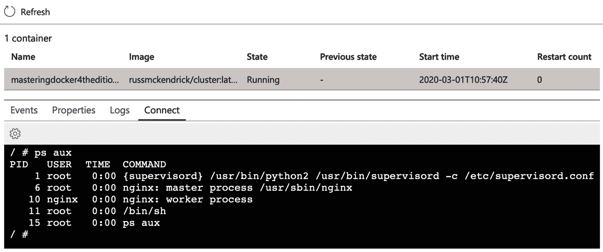

图 10.19 – 打开会话连接到我们的 Azure 容器实例

将概览页面中提供的 URL 输入浏览器，在我的例子中是 [`masteringdocker4thedition-aci.uksouth.azurecontainer.io/`](http://masteringdocker4thedition-aci.uksouth.azurecontainer.io/)，你将看到你的容器应用：

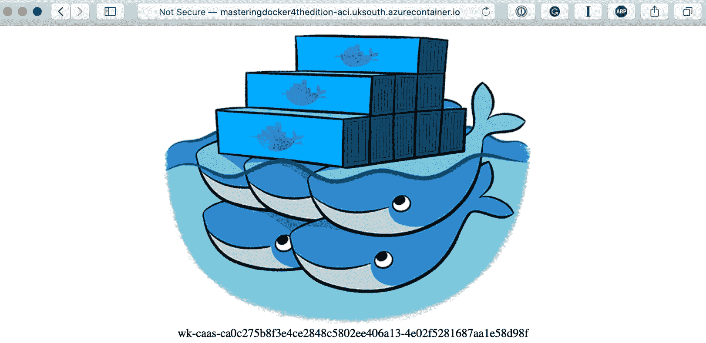

图 10.20 – 我们正在运行的应用程序

如你所见，这次我们有了容器 ID，在我的案例中是 wk-caas-ca0c275b8f3e4ce2848c5802ee406a13-4e02f5281687aa1e58d98f。你可能会注意到这次没有 HTTPS，只有普通的 HTTP，使用 80 端口\。

一旦你完成 Azure 容器实例的操作，点击**删除**，如果需要的话，还要删除资源组。

## 总结 Microsoft Azure

表面上看，我们在本节中讨论的这两项服务似乎很相似，实际上它们非常不同。微软 Web 应用是微软提供的托管服务，基于容器技术。通常，启动的容器是为最终用户启动的代码。然而，在运行容器时，它们最终会在 Docker 中运行 Docker。Azure 容器实例仅仅是运行中的容器——没有额外的包装或帮助程序，只有原生容器。

我们现在已经在 Microsoft Azure 上打下了基础。随着 Amazon 和 Microsoft 已经在云计算领域站稳脚跟，Google 推出了自己的竞争产品也就不足为奇了。接下来我们来看看它。

# Google Cloud

在三大公共云平台中，**Google Cloud** 是最年轻的。它最初于 2008 年作为 Google App Engine 启动。App Engine 是 Google 的 PaaS 产品，支持 Java、PHP、Node.js、Python、C#、.Net、Ruby 和 Go 应用程序。与 AWS 和 Microsoft Azure 不同，Google 作为 PaaS 服务存在了超过 4 年，直到推出 Google Compute Engine。

在下一章中，我们将学习更多关于 Google 进入云计算的历程，尤其是当我们开始讨论 Kubernetes 时，所以我在这里不会详细展开。接下来，我们直接进入正题。

## Google Cloud Run

Google Cloud Run 与我们在本章中查看的其他容器服务略有不同。我们需要做的第一件事是将镜像托管在 Google Container Registry 中，以便使用该服务：

1.  让我们从 Docker Hub 获取一个集群镜像的副本：

    ```
    $ docker image pull russmckendrick/cluster
    ```

1.  现在，我们需要使用 Google Cloud 命令行工具登录到我们的 Google Cloud 账户。为此，运行以下命令：

    ```
    $ gcloud init
    ```

1.  登录后，我们可以通过运行以下命令来配置 Docker 使用 Google Container Registry：

    ```
    $ gcloud auth configure-docker
    ```

1.  现在，Docker 已配置为与 Google Container Registry 交互，我们可以运行以下命令来创建标签并推送我们的镜像：

    ```
    masterdocker4; you will need to replace that with your own Google Cloud project name. You can verify that the image has been pushed by logging in to the Google Cloud console and navigating to Google Container Registry by entering Cloud Registry into the search bar at the top of the page. You should see something like the following: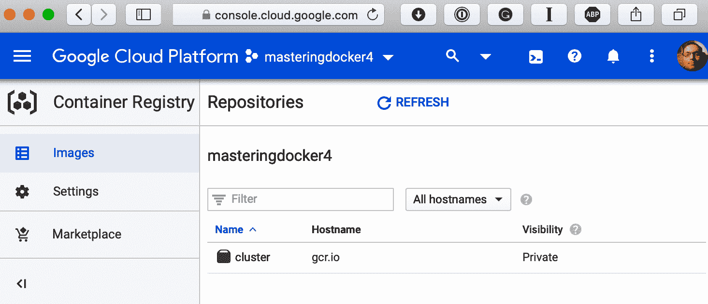Figure 10.21 – Viewing our cluster image in Google Container Registry
    ```

1.  现在，在页面顶部的搜索栏中，输入`Cloud Run`并点击链接。

1.  一旦 Cloud Run 页面加载完成，点击页面顶部的**创建服务**按钮。

1.  首先，你需要做的是选择要使用的镜像。点击**选择**，然后突出显示集群镜像，并选择你想要使用的镜像版本：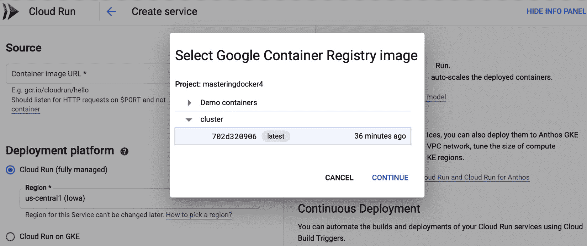

    图 10.22 – 选择 Google Container Registry 镜像

1.  选择完成后，点击**继续**。

1.  对于部署平台，我们将使用**Cloud Run（完全托管）**。从下拉框中选择离你最近的区域。

1.  接下来，我们需要为服务器命名——我把它命名为`masteringdocker4cluster`——然后勾选**允许未认证调用**复选框。

1.  由于我们的容器监听的是端口`80`，我们需要更新修订设置，因为默认端口是`8080`。点击`8080`改为`80`。

1.  一切填写完毕后，滚动到页面底部并点击**创建**按钮。稍等片刻，你应该能看到类似以下屏幕的内容：

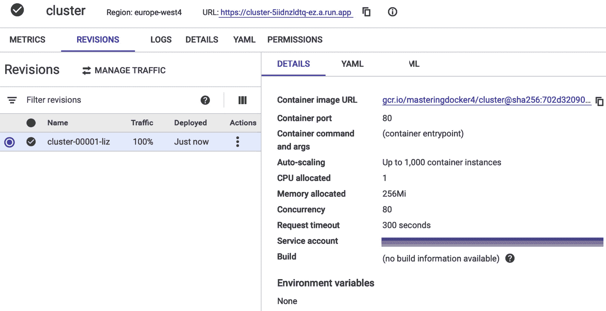

图 10.23 – 查看我们的 Cloud Run 应用

如你所见，我们有关于正在运行的容器的信息，包括一个 URL，在本例中是[`cluster-5iidnzldtq-ez.a.run.app`](https://cluster-5iidnzldtq-ez.a.run.app)——在浏览器中打开该 URL 会显示如下内容：

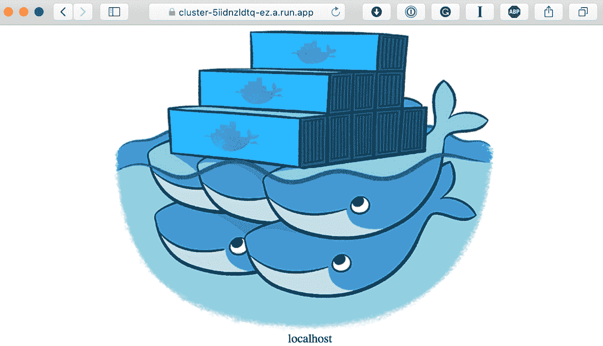

图 10.24 – 我们正在运行的应用程序

这是我们预期会看到的内容；然而，Google Cloud Run 与我们在本章 AWS 和 Azure 部分所涵盖的其他服务之间存在差异。在其他服务中，我们的容器一直在运行，但在 Google Cloud Run 中，它只在需要时才会运行。Google Cloud Run 构建在 **Knative** 之上，Knative 是一个开源的无服务器平台，旨在运行在 Kubernetes 之上，我们一直在 Google 自家的 Kubernetes 集群上运行我们的容器。

## 总结 Google Cloud

正如你可能猜到的，Google 更倾向于运行基于 Kubernetes 的服务，正如我们在 Google Cloud Run 中已经看到的那样。所以，在我们深入了解 Kubernetes 后，我们将在后面的章节重新审视 Google Cloud。

# 摘要

在本章中，我们探讨了如何将 Docker 容器部署到三大公共云提供商的容器服务中。我们查看的这些服务在容器的部署和管理方式上有很大的不同，从 Azure 应用服务中完全托管的基于 Docker 的 Web 应用，到 AWS 自有的集群服务 Amazon ECS。

这些服务之间的差异非常重要，因为这意味着如果你想使用它们，你就只能依赖于一个云提供商。虽然在大多数情况下，这不会造成太大问题，但从长远来看，它可能会限制你。

在下一章（以及后续章节）中，我们将探索自 Docker 以来最激动人心的服务之一：Kubernetes。

# 问题

1.  在 Azure 中，我们需要启动什么类型的应用程序？

1.  如果你直接使用 Amazon Fargate，Amazon 服务中哪些不需要你管理？

1.  对还是错：Azure 容器实例开箱即用支持 HTTPS。

1.  命名 Google Cloud Run 所依赖的开源服务。

1.  我们所查看的服务中，哪些支持 Docker Compose？

# 进一步阅读

有关我们在本章中使用的每项服务的详细信息，请参考以下内容：

+   AWS: [`aws.amazon.com/`](http://aws.amazon.com/)

+   Amazon ECS: [`aws.amazon.com/ecs/`](https://aws.amazon.com/ecs/)

+   AWS Fargate: [`aws.amazon.com/fargate/`](https://aws.amazon.com/fargate/)

+   Microsoft Azure: [`azure.microsoft.com/`](https://azure.microsoft.com/)

+   Azure App Service: [`azure.microsoft.com/en-gb/services/app-service/`](https://azure.microsoft.com/en-gb/services/app-service/)

+   Azure Container Instances: [`azure.microsoft.com/en-gb/services/container-instances/`](https://azure.microsoft.com/en-gb/services/container-instances/)

+   Google Cloud: [`cloud.google.com`](https://cloud.google.com)

+   Google Cloud Run: [`cloud.google.com/run`](https://cloud.google.com/run)

+   Knative: [`knative.dev`](http://knative.dev)
