# 第十三章：在公共云中运行 Kubernetes

在前两章中，我们已经了解了在本地机器上创建、配置和与 Kubernetes 集群交互的各种方式。

现在是时候将我们的 Kubernetes 之旅带入云端，了解如何在以下公共云提供商中使用 Web 门户和命令行工具启动、配置和使用 Kubernetes：

+   **Microsoft Azure Kubernetes 服务**（**AKS**）

+   **Google Kubernetes 引擎**（**GKE**）

+   **Amazon 弹性 Kubernetes 服务**（**EKS**）

+   **DigitalOcean Kubernetes**

# 技术要求

本章假设你可以访问我们将涵盖的一个或多个云服务提供商。因此，请注意，根据你的帐户，启动这些服务将会产生费用。你还应该记得在完成使用后删除任何资源，或者了解如果你选择让它们运行一段时间的费用。

与前几章一样，我将使用我偏好的操作系统——macOS。因此，某些支持命令可能仅适用于 macOS，并且出现频率较少。

查看以下视频，了解代码在实践中的应用：[`bit.ly/336J7dE`](https://bit.ly/336J7dE)

# Microsoft Azure Kubernetes 服务（AKS）

微软一直是容器工作负载在 Microsoft Azure 上运行的支持者。最初，微软通过提供 Azure 容器服务来支持三种不同的容器编排工具：Kubernetes、Mesosphere DC/OS 和 Docker Swarm。

然而，在 2017 年 10 月，微软宣布将用新开发的 Azure Kubernetes 服务替代 Azure 容器服务——如你所料，这也意味着取消了对 Mesosphere DC/OS 和 Docker Swarm 的支持。

自那时以来，这项服务作为一个 CNCF 认证的 Kubernetes 托管平台，已经取得了巨大的进展，最近的一个发展是 Windows 容器支持的普及。

与其深入探讨这个话题，不如直接启动一个 AKS 集群。我们将介绍两种方法：使用 Azure Web 门户和使用 Azure 命令行工具从本地机器进行设置。我们先从 Azure Web 门户开始。

## 使用 Web 门户启动集群

首先，你需要登录到 Azure 网络门户，地址是 [`portal.azure.com/`](https://portal.azure.com/)。登录后，在顶部搜索框中输入 `AKS`，然后点击搜索结果中 **服务** 部分的 **Kubernetes 服务** 项。

页面加载后，你将看到一个如下所示的界面：

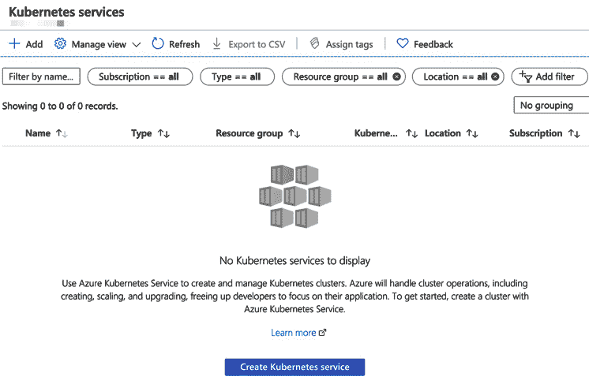

图 13.1：准备创建集群

大多数人可能已经猜到我们启动 AKS 集群的下一步是什么了。没错：点击**+ 添加**按钮，然后选择**添加 Kubernetes 集群**。我们将通过七个部分来启动集群，具体如下：

+   **基础**

+   **节点池**

+   **身份验证**

+   **网络**

+   **集成**

+   **标签**

+   **审查并创建**

我们从**基础**开始。在这里，您将被要求提供几项信息，从**项目详情**开始。在这里，我们需要定义应该使用的**订阅**和**资源组**。

选择所需的订阅，然后点击**创建新**链接，在**资源组**下选择。输入您希望将集群放置的资源组名称——我将其命名为**mastering-docker-aks-rg**。

一旦输入了这两项信息，我们就可以继续进行`1.15.10`版本（截至写作时）。

最后一项基础信息是**主节点池**。在这里，我们可以定义**节点大小**和**节点数量**。默认情况下，它们设置为**标准 DS2 v2**和**3**——为了测试，我们将保持这些默认设置。要进入下一步，点击**下一步：节点池 >**按钮。

在**节点池**界面上，我们可以添加更多的池——例如，如果您希望在我们启动的 Linux 主机池旁边运行一个 Windows 主机池，您可以点击**+ 添加节点池**按钮。

在这里，您将被要求输入以下信息：

+   **节点池名称**：为新的节点池命名。

+   **操作系统类型**：您希望新节点池使用的底层操作系统。您可以选择 Linux 或 Windows。

+   **节点大小**：新节点池中节点的虚拟机大小。

+   **节点数量**：您希望在池中拥有的节点数量。

由于我们正在启动一个测试集群，因此不需要任何额外的节点池，因此我们可以继续选择下一个选项。

**虚拟节点**允许您使用**Azure 容器实例**，我们在*第十章*中介绍了它，*在公共云中运行 Docker*。保持此设置为**禁用**。

将**VM 扩展集**设置为**启用**将允许我们按需扩展集群，因此我们点击**下一步：身份验证 >**按钮。

**身份验证**设置允许您配置 Kubernetes 集群如何与其他 Azure 服务进行交互，甚至启动这些服务。对于我们的集群，保持默认设置，然后点击**下一步：网络 >**按钮。

**网络**页面有两组不同的选项，第一组是**网络配置**。在这里，我们可以选择一个现有的**虚拟网络**，或者创建一个新的——为了方便起见，我们还是使用默认设置，这些设置已经为我们预填了，然后继续选择**网络设置**。

在这里，我们可以继续使用默认设置，这意味着我们唯一需要提供的信息是**DNS 名称前缀**—我使用的是**mastering-docker-aks**。

点击**下一步：集成 >**将带你进入选项页面，在那里你可以将 AKS 集群连接到**Azure 容器注册表**，我们在*第三章*《存储与分发镜像》中讨论过。但由于我们没有使用系统分配的托管身份，因此此选项不可用。我们可以配置的另一个集成是**Azure Monitor**。保持这些设置为默认值，因为我们希望为我们设置一个**日志分析工作区**。

由于我们的集群只是临时的，你可以点击**查看 + 创建**按钮，而不是添加**标签**。

首先发生的事情是你的配置会被验证。如果有任何问题，你将无法继续，直到问题解决。如果一切按计划进行，你应该会看到类似下面的屏幕：

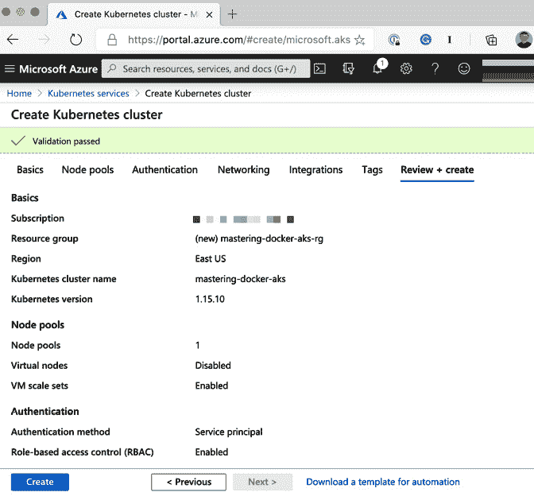

图 13.2：已验证的配置

一旦验证通过，点击**创建**按钮。现在是时候去拿个饮料了，因为集群的部署可能需要 10 到 20 分钟。一旦部署完成，你将看到以下屏幕：

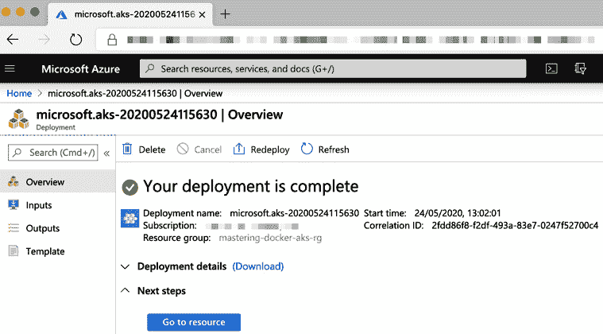

图 13.3：部署已完成

点击`kubectl`实例。

由于 Microsoft 在 Azure 门户中提供了一个内置的 shell，预安装了 Azure 命令行工具和 kubectl；因为我们是通过门户启动集群的，所以我们将使用它。

点击 Cloud Shell 图标，它是屏幕右上角搜索栏后的第一个图标（上面有**>_**）。如果你之前使用过 Cloud Shell，那么你会直接登录。如果没有，请按照屏幕上的提示操作。

Cloud Shell 有两种不同的版本：**Bash** 和 **PowerShell**。对于我们的目的，你需要确保使用的是**Bash**。

一旦进入命令提示符，输入以下命令，确保更新资源组和集群名称，如果你使用了与我不同的值：

```
$ az aks get-credentials --resource-group mastering-docker-
aks-rg --name mastering-docker-aks
```

一旦你运行了命令，你可以通过运行以下命令来测试与集群的连接：

```
$ kubectl get nodes
$ kubectl get namespaces
```

这应该返回三个节点，每个节点都运行着我们在首次配置集群时选择的 Kubernetes 版本：

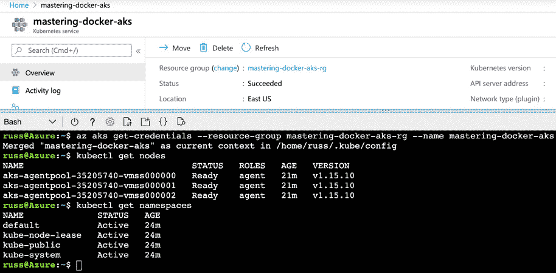

图 13.4：使用 Cloud Shell 连接 kubectl 到我们的 AKS 集群

现在我们的集群已经启动并运行，你可以跳过本节的下一部分，我们将使用 Azure 命令行工具启动集群，并直接进入启动应用程序。

## 使用命令行工具启动集群

通过 Azure Web 门户启动集群的替代方法是使用 Azure 命令行工具。如果您还没有安装它，可以按照以下说明进行安装，从 macOS 开始：

```
$ brew install azure-cli
```

Windows 用户可以以管理员身份打开 PowerShell 提示符并运行以下命令：

```
$ Invoke-WebRequest -Uri https://aka.ms/installazurecliwindows
 -OutFile .\AzureCLI.msi; Start-Process msiexec.exe -Wait 
-ArgumentList '/I AzureCLI.msi /quiet'; rm .\AzureCLI.msi
```

使用 Debian 系统的 Linux 用户可以运行以下命令：

```
$ curl -sL https://aka.ms/InstallAzureCLIDeb | sudo bash
```

运行 Red-Hat 系统的 Linux 用户可以执行以下命令：

```
$ sudo rpm --import https://packages.microsoft.com/keys/microsoft.asc
$ sudo sh -c 'echo -e '[azure-cli]
name=Azure CLI
baseurl=https://packages.microsoft.com/yumrepos/azure-cli
enabled=1
gpgcheck=1
gpgkey=https://packages.microsoft.com/keys/microsoft.asc' > /
etc/yum.repos.d/azure-cli.repo'
$ sudo yum install azure-cli
```

安装完 Azure CLI 包后，您应该运行的第一个命令如下：

```
$ az login
```

这将提示您登录到您的 Azure 账户。

重要提示

请确保您登录的账户已将您想要启动资源的订阅设置为默认订阅——如果没有，请访问[`docs.microsoft.com/en-us/cli/azure/manage-azure-subscriptions-azure-cli`](https://docs.microsoft.com/en-us/cli/azure/manage-azure-subscriptions-azure-cli)了解如何更改活动订阅。

现在我们已经安装并配置了 Azure 命令行工具，可以启动集群了。对于 macOS 和 Linux 用户，我们可以设置一些环境变量，这些值将在整个集群创建过程中使用。

重要提示

Windows 用户应该将启动集群时使用的命令中的变量替换为以下四个变量中的相应值。

这些值与我们在上一部分使用的相同，当时我们是通过 Azure Web 门户启动集群的：

```
$ AKSLOCATION=eastus
$ AKSRG=mastering-docker-aks-rg
$ AKSCLUSTER=mastering-docker-aks
$ AKSNUMNODES=3
```

启动集群的第一步是创建资源组。为此，请运行以下命令：

```
$ az group create --name $AKSRG --location $AKSLOCATION
```

这应该返回一个 JSON 文件，其中的预配状态应为 `Succeeded`。资源组创建完成后，我们可以通过运行以下命令来启动集群：

```
$ az aks create \
    --resource-group $AKSRG \
    --name $AKSCLUSTER \
    --node-count $AKSNUMNODES \
    --enable-addons monitoring \
    --generate-ssh-keys
```

在集群启动时，您将看到如下界面：


图 13.5：使用 Azure CLI 启动集群

就像通过 Azure Web 门户启动集群时一样，完成过程需要大约 10 到 20 分钟，所以如果您看到前面的输出一段时间，请不用担心——这只是需要一些时间。

完成后，最后一步与我们通过 Azure Web 门户启动集群时相同。我们需要配置 kubectl 以指向新启动的集群。为此，请运行以下命令：

```
$ az aks get-credentials --resource-group $AKSRG --name 
$AKSCLUSTER
```

配置合并完成后，您可以运行以下命令检查与集群的连接性：

```
$ kubectl get nodes
$ kubectl get namespaces
```

这应该返回类似以下的输出：

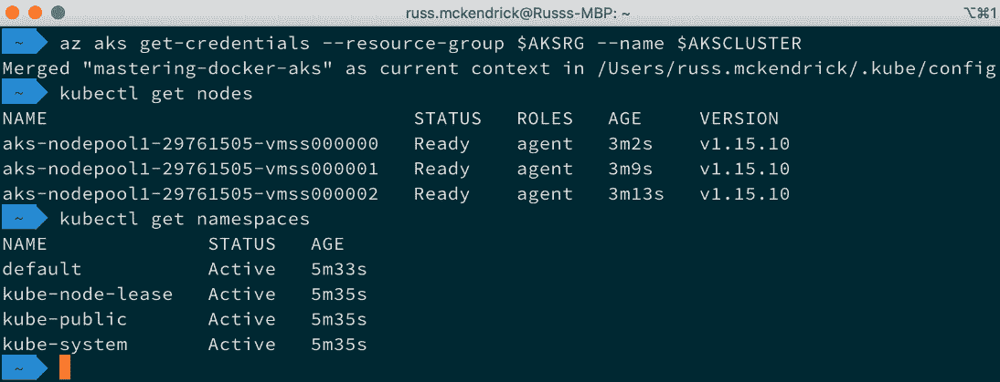

图 13.6：使用 kubectl 检查集群连接性

我们现在应该拥有一个与通过 Azure Web 门户启动的集群处于相同状态的 AKS 集群，这意味着我们现在可以启动应用程序了。

## 启动应用程序

由于我们不再使用本地计算机来运行 Kubernetes，因此我们可以启动一个资源需求更高的应用程序。为此，我们将使用由 Weave 创建和维护的微服务示例。

要启动应用程序，你只需运行以下命令：

```
$ kubectl create namespace sock-shop
$ kubectl -n sock-shop apply -f 'https://github.com/
microservices-demo/microservices-demo/blob/master/deploy/
kubernetes/complete-demo.yaml?raw=true'
```

这将创建一个名为**sock-shop**的命名空间，并创建组成应用程序的资源，这是一个销售袜子的电子商务网站。

一两分钟后，你可以运行以下命令查看 pod 的状态：

```
$ kubectl -n sock-shop get pods
```

这应该会显示类似以下的输出：

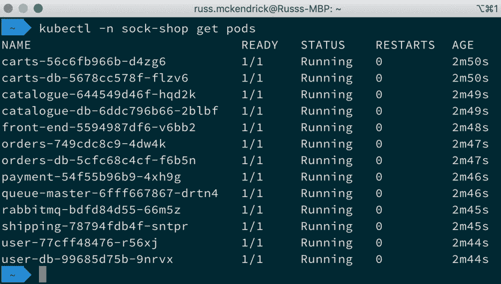

图 13.7：检查 pod 的状态

一旦所有 pod 都在运行，你可以通过运行以下命令来检查服务的状态：

```
$ kubectl -n sock-shop get services
```

再次，你应该看到类似以下的内容：

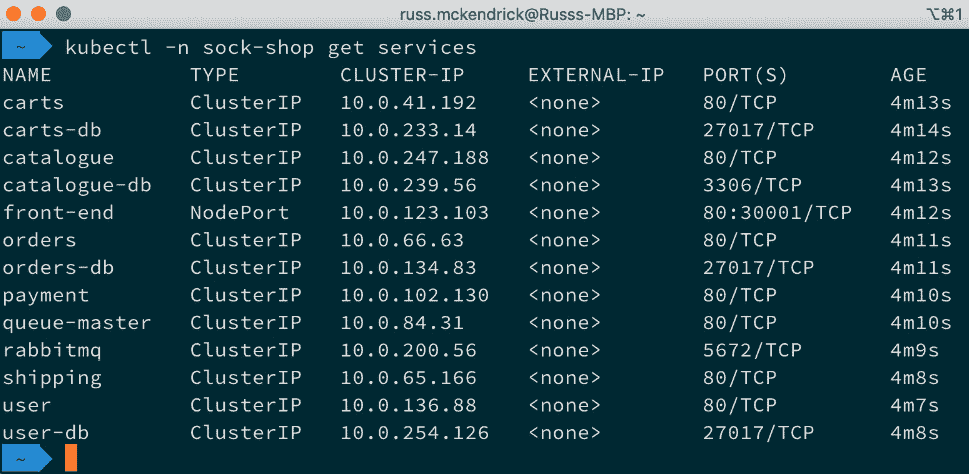

图 13.8：检查服务的状态

现在应用程序已经部署完毕，我们需要将其暴露出来以便可以访问。为此，请运行以下命令：

```
$ kubectl -n sock-shop expose deployment front-end 
--type=LoadBalancer --name=front-end-lb
```

一旦暴露，你可以运行以下命令获取端点信息：

```
$ kubectl -n sock-shop describe services front-end-lb
```

在输出中，你需要查找`LoadBalancer Ingress`和`Port`。请参考以下屏幕截图查看示例输出：

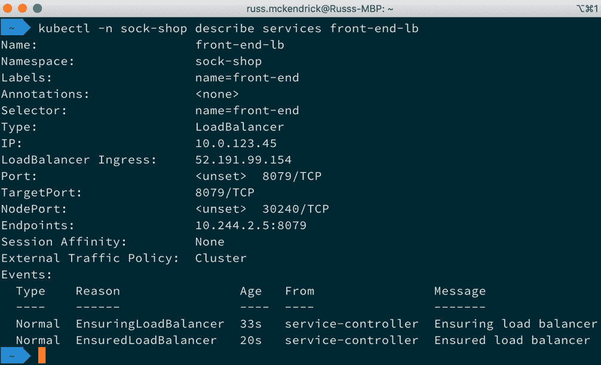

图 13.9：获取已暴露服务的信息

在浏览器中输入`LoadBalancer Ingress`的 IP 和`Port`—对于我来说是[`52.191.99.154:8079/`](http://52.191.99.154:8079/)，应该能打开商店：

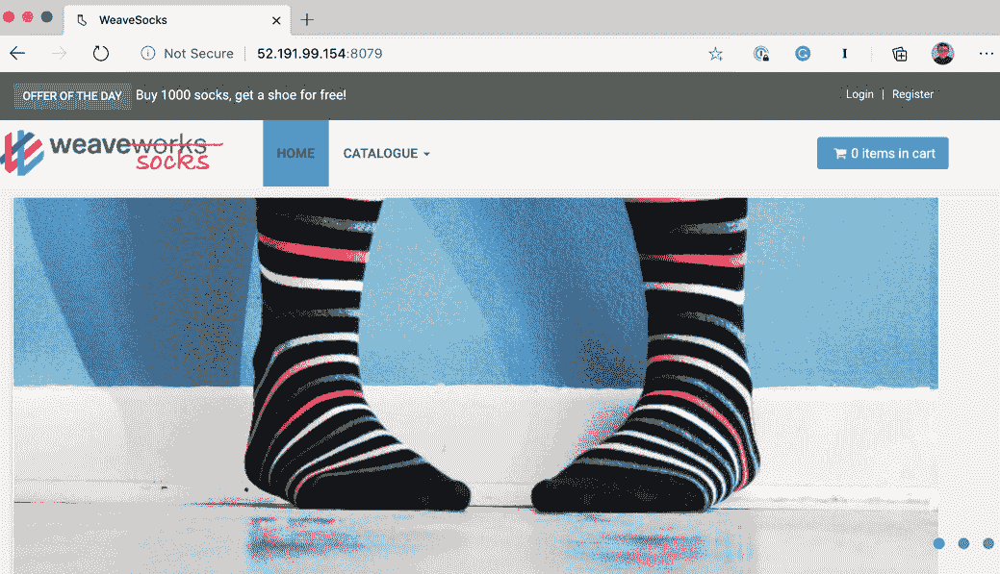

图 13.10：Sock Shop 应用程序

在应用程序中点击—将一些袜子放入购物车，刷新页面，等等。接下来，我们将查看 Azure Web 门户中的集群。

## 集群信息

如果你登录到 Azure Web 门户（[`portal.azure.com/`](https://portal.azure.com/)），然后在页面顶部的搜索框中搜索你的集群名称，你应该会看到一个类似以下的页面：


图 13.11：在 Azure Web 门户中查看集群

如果你点击**Monitor container**按钮，你将进入**Cluster**概览页面。进入后，点击**Containers**。添加**sock-shop**命名空间的过滤器将仅选择在我们的应用程序的 pod 中运行的容器。选择一个容器后，点击**View live data (preview)**按钮，将把该容器的日志实时流式传输到页面上：

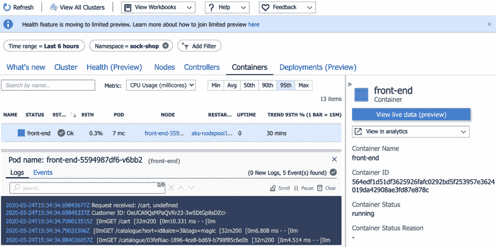

图 13.12：在 Azure Web 门户中查看前端容器的日志

我建议点击其他选项卡和设置，了解你可以使用 AKS 做些什么。

一旦你完成了 AKS 集群的设置，我建议你通过 Azure Web 门户或 Azure CLI 删除创建的所有资源，方法是删除资源组。为此，在顶部搜索框中输入`Resource Groups`，然后选择与你的集群相关的资源组。例如，作为我启动集群的一部分，我有三个资源组，下面的截图中已将它们突出显示：

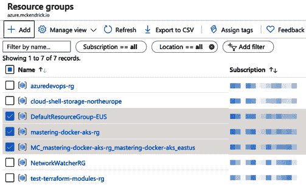

图 13.13 – 查找要删除的资源组

要删除它们，点击资源组名称，仔细检查其中的资源，然后如果你确定其中仅包含测试集群的资源，点击 **删除资源组** 按钮并按照屏幕上的指示操作。

## Microsoft Azure Kubernetes 服务概述

我相信你也会同意，使用 Azure Web 门户和 Azure CLI 启动集群是一个相当简单的过程。一旦集群启动并且 kubectl 配置完成，可以与集群进行交互，启动应用程序所使用的命令与我们在*第十二章*中使用的命令几乎相同，*发现其他 Kubernetes 选项*。

我们启动的集群的运行成本约为每月 215 美元，唯一的费用是虚拟机资源的费用。Microsoft 不收取集群管理所需资源的费用；如果我们想为集群添加一个正常运行时间的 SLA，我们需要再支付每月 73 美元。

能够运行多个节点池，混合使用 Linux 和 Windows 容器，这是该服务的一大亮点，此外它还与 Azure Monitor 和 Azure 容器注册表服务进行了集成。再加上如 Azure DevOps 和 **Azure Sentinel 安全信息与事件管理**（**SIEM**）等服务，你将拥有一个相当强大的平台。

接下来，我们将从 Microsoft Azure 转移到 Google Cloud。

# Google Kubernetes 引擎（GKE）

如你可能已经猜到的，GKE 与 Google 的云平台紧密集成。与其详细介绍 Kubernetes 在 Google 的起步历程，不如直接深入并启动一个集群。

接下来，我假设你已经拥有一个 Google Cloud 账户，并且启用了计费功能的项目。

## 使用 Web 门户启动集群

一旦你登录到 [`console.cloud.google.com/`](https://console.cloud.google.com/)，在页面顶部的搜索框中输入 Kubernetes，并选择 **Kubernetes Engine**。如果你的项目尚未启用该服务，它将自动启用，几秒钟后，你将看到如下所示的页面：

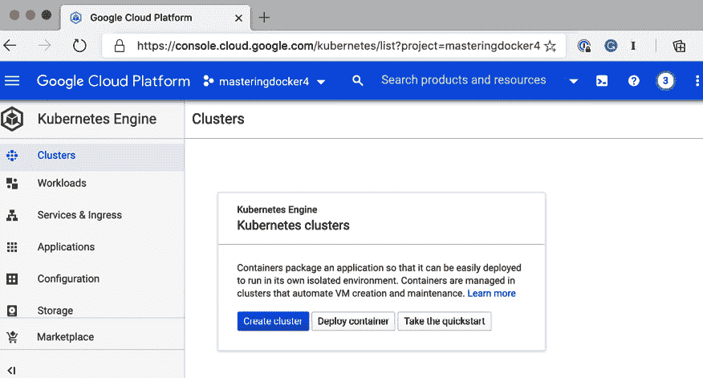

图 13.14 – Google Cloud Web 门户中的 Kubernetes 页面

如你可能已经猜到的，启动集群的第一步是点击**创建集群**按钮。接下来，你会看到许多选项；不过，我们将使用默认选项，除了**名称**，我会将其更改为**mastering-docker-gke**。更改名称后，点击**创建**按钮：


图 13.15 – 输入集群详情

启动集群大约需要 10 分钟。创建完成后，你应该会看到如下内容：


图 13.16 – 集群已就绪

与 Microsoft Azure 类似，Google Cloud 在其 Web 界面中内置了一个 Shell，且该 Shell 已安装并配置了 `kubectl` 和 `gcloud` 命令行工具。通过点击`kubectl` 进入 Shell 后，你就可以访问你的集群：

```
$ gcloud container clusters get-credentials mastering-docker-gke --zone us-central1-c
```

如果你使用了与我们设置的不同名称和区域，请更新名称和区域。配置完成后，你应该能够运行以下两个命令：

```
$ kubectl get nodes
$ kubectl get namespaces
```

为了测试连接，如果一切按计划进行，你应该会看到如下信息：

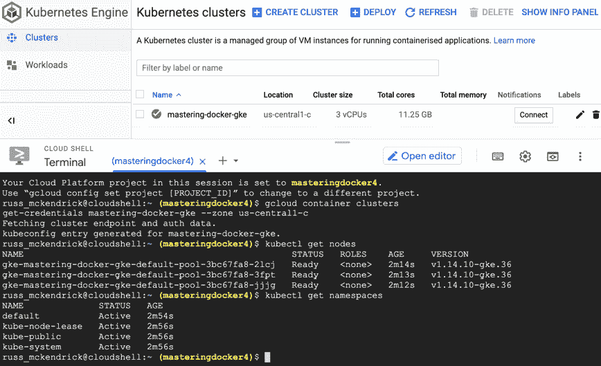

图 13.17 – 将 kubectl 连接到我们的集群

使用 Google Cloud 网络门户启动基本集群是一个非常简单的过程；然而，使用 `gcloud` CLI 同样简单。

## 使用命令行工具启动集群

`gcloud` 命令由 Google Cloud SDK 包提供。要在 macOS 上使用 Homebrew 和 Cask 安装，运行以下命令：

```
$ brew cask install google-cloud-sdk
```

如果你使用的是 Windows 系统，可以从[`dl.google.com/dl/cloudsdk/channels/rapid/GoogleCloudSDKInstaller.exe`](https://dl.google.com/dl/cloudsdk/channels/rapid/GoogleCloudSDKInstaller.exe)下载安装程序。

使用基于 Debian 的操作系统的 Linux 用户需要运行以下命令：

```
$ echo 'deb [signed-by=/usr/share/keyrings/cloud.google.gpg] 
http://packages.cloud.google.com/apt cloud-sdk main' | sudo tee
 -a /etc/apt/sources.list.d/google-cloud-sdk.list
$ curl https://packages.cloud.google.com/apt/doc/apt-key.gpg | 
sudo apt-key --keyring /usr/share/keyrings/cloud.google.gpg add
 -
$ sudo apt-get update && sudo apt-get install google-cloud-sdk
```

最后，运行基于 Red-Hat 系统的 Linux 用户需要运行以下命令：

```
$ sudo tee -a /etc/yum.repos.d/google-cloud-sdk.repo << EOM
[google-cloud-sdk]
name=Google Cloud SDK
baseurl=https://packages.cloud.google.com/yum/repos/cloud-sdk-el7-x86_64
enabled=1
gpgcheck=1
repo_gpgcheck=1
gpgkey=https://packages.cloud.google.com/yum/doc/yum-key.gpg
       https://packages.cloud.google.com/yum/doc/rpm-package-
key.gpg
EOM
```

一旦存储库文件就位，你可以使用以下命令安装包：

```
$ sudo yum install google-cloud-sdk
```

如果你在执行上述命令时遇到任何问题，包含常见故障排除提示的快速入门链接可以在本章的进一步阅读部分找到。

安装完成后，你需要登录并告诉命令行工具使用哪个项目。你可以通过运行以下命令来完成：

```
$ gcloud auth login
$ gcloud config set project masteringdocker4
```

如你可能已经猜到的，我使用的项目名为**masteringdocker4**；你应该更新为你自己的项目名称。

现在我们已经配置好了 `gcloud`，可以启动集群了。为此，请运行以下命令：

```
$ gcloud container clusters create mastering-docker-gke --num-nodes=3 --zone=us-central1-c
```

这将会在美国中部 1c 区域创建一个三节点集群。启动后，你的 kubectl 会自动配置为与集群通信，这意味着你只需通过运行以下命令来测试连接：

```
$ kubectl get nodes
$ kubectl get namespaces
```

这应该会显示类似以下输出的内容：


图 13.18 – 测试与 Google Kubernetes Engine 集群的连接

现在我们已经成功创建并启动了 Google Kubernetes Engine 集群，接下来可以启动我们的应用程序。

## 启动应用程序

由于我们在本章的*Microsoft Azure Kubernetes Service*部分已经详细介绍了应用程序的启动过程，因此这里不再详细讲解，只需说一下，您需要运行以下命令来启动应用程序：

```
$ kubectl create namespace sock-shop
$ kubectl -n sock-shop apply  -f 'https://github.com/
microservices-demo/microservices-demo/blob/master/deploy/
kubernetes/complete-demo.yaml?raw=true'
```

您可以通过运行以下命令检查 Pod 和服务的状态：

```
$ kubectl -n sock-shop get pods,services
```

一旦一切看起来都已经启动并运行，您可以使用以下命令：

```
$ kubectl -n sock-shop expose deployment front-end 
--type=LoadBalancer --name=front-end-lb 
```

这将暴露应用程序。输入此后，您可以输入以下命令：

```
$ kubectl -n sock-shop describe services front-end-lb
```

正如我们之前提到的，要获取暴露的服务信息，您需要 `LoadBalancer Ingress` 和 `Port`。将这两个值粘贴到浏览器中（例如，我使用了 `http://104.154.45.136:8079/`），您应该能看到 Sock Shop 已经成功启动。

## 集群信息

返回 Google Cloud 网络门户并点击您集群中的**工作负载**，将显示非系统工作负载的列表。点击前端部署将显示如下内容：


图 13.19 – 查看部署详情

点击位于前一屏幕底部的**容器日志**，将带您进入一个页面，您可以在其中查看工作负载生成的日志：

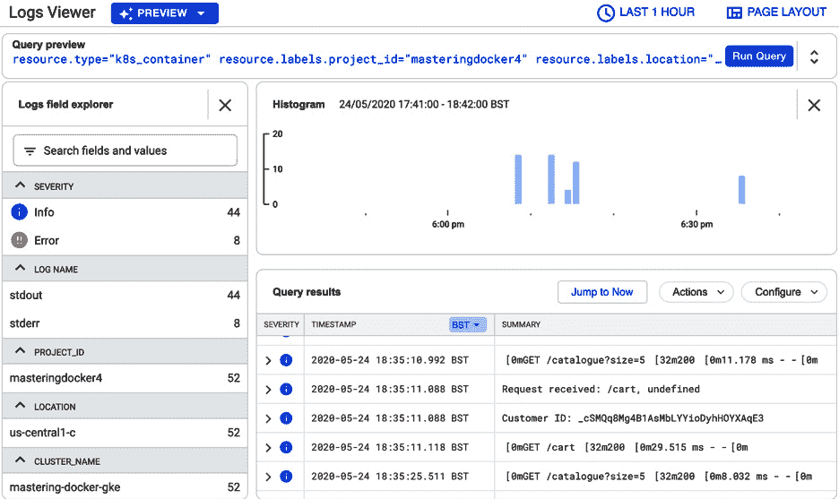

图 13.20 – 查看前端部署的日志

再次花些时间浏览其他标签和选项，了解您可以用 GKE 做些什么。一旦您花时间了解 GKE 后，应该删除所有已启动的资源。为此，只需在门户的**Kubernetes 引擎**部分的**集群**页面选择您的集群，然后点击**删除**。在删除集群前，您会收到一个警告：

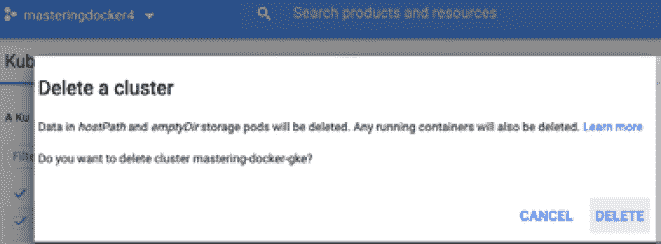

图 13.21 – 您确定要删除集群吗？

如果您决定继续，请点击**删除**，并大约等待 10 分钟。

## Google Kubernetes Engine 总结

我相信您也同意，Google Kubernetes 服务是另一个简单的配置服务，而且正如您现在可能已经注意到的，一旦集群启动并运行，与之交互的体验是始终如一的。再说一次，Google 提供了与其他 Google Cloud 服务的深度集成，如监控、数据库和负载均衡服务。

以我们设定的规格运行集群大约每月花费 $150；然而，其中 $73 的费用是 GKE 集群管理费，若要以与 Microsoft Azure Kubernetes 服务相同的规格运行集群，每月将花费约 $220，GKE 集群管理费保持不变。

Google 和 Microsoft 的 Kubernetes 服务已经推出有一段时间了，接下来我们来看看三大云服务商中的最后一个 Kubernetes 服务，并继续了解亚马逊 Web 服务。

# 亚马逊弹性 Kubernetes 服务（EKS）

接下来我们将介绍的 Kubernetes 服务是亚马逊弹性容器服务 Kubernetes（简称 Amazon EKS）。这是我们迄今为止介绍的三项服务中最新推出的服务。事实上，您可以说亚马逊在 Kubernetes 的推广上来得很晚。

不幸的是，亚马逊的命令行工具并不像我们用于 Microsoft Azure 和 Google Cloud 的工具那样用户友好。因此，我们将使用一个名为 `eksctl` 的工具，它由 Weave 开发，Weave 同样也是我们一直使用的示范商店的创建者。该工具已被亚马逊作为 EKS 的官方命令行客户端，而不是他们自己客户端中内建的命令。

因此，我们将绕过基于 Web 的门户，专注于 `eksctl`，它本身利用了 AWS 的命令行工具。

## 使用命令行工具启动集群

在安装 `eksctl` 之前，我们需要先安装 AWS 命令行工具。若要在 macOS 上通过 Homebrew 安装，请运行以下命令：

```
$ brew install awscli
```

如果您是 Windows 用户，您可以从 [`awscli.amazonaws.com/AWSCLIV2.msi`](https://awscli.amazonaws.com/AWSCLIV2.msi) 下载安装程序。

最后，Linux 用户可以运行以下命令来下载并安装命令行工具：

```
$ curl 'https://awscli.amazonaws.com/awscli-exe-linux-x86_64.
zip' -o 'awscliv2.zip'
$ unzip awscliv2.zip
$ sudo ./aws/install
```

安装完成后，您需要配置凭据。与 `az` 和 `gcloud` 命令不同，您需要登录到 AWS 网站门户进行配置。有关所需步骤的详细信息，请参阅 [`docs.aws.amazon.com/cli/latest/userguide/cli-configure-files.html`](https://docs.aws.amazon.com/cli/latest/userguide/cli-configure-files.html)。

安装并配置好 AWS 命令行工具后，您可以继续安装 `eksctl`，再次从 macOS 和 Homebrew 开始：

```
$ brew tap weaveworks/tap
$ brew install weaveworks/tap/eksctl
```

建议 Windows 用户使用 Chocolatey：

```
$ chocolatey install eksctl
```

最后，Linux 用户可以使用以下命令直接从 GitHub 下载预编译的二进制文件：

```
$ curl --silent --location 'https://github.com/weaveworks/
eksctl/releases/latest/download/eksctl_$(uname -s)_amd64.tar.
gz' | tar xz -C /tmp
$ sudo mv /tmp/eksctl /usr/local/bin
```

安装完成后，您将能够运行以下命令来创建并配置您的集群：

```
$ eksctl create cluster
```

启动后，您应该会看到类似以下的内容，正如您所看到的，它非常具有描述性：

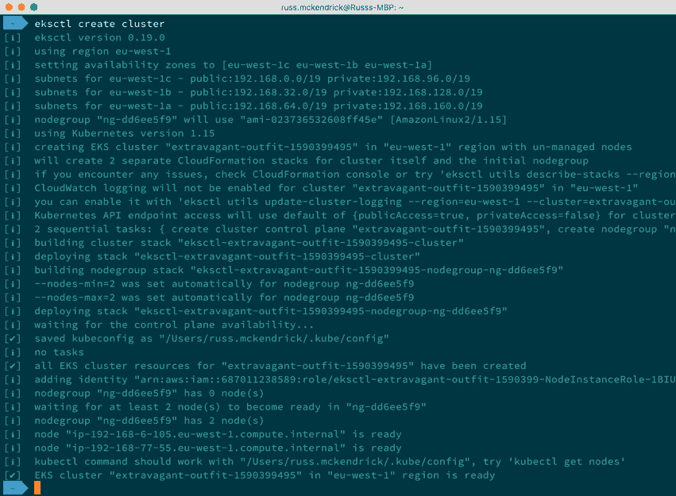

图 13.22 – 使用 eksctl 启动 EKS 集群

在启动过程中，`eksctl` 已经配置了你的本地 `kubectl` 环境，这意味着你可以运行以下命令：

```
$ kubectl get nodes
$ kubectl get services
```

现在集群已经启动并运行，我们可以像之前一样启动演示商店。

## 启动应用程序

现在你应该已经相当熟练地部署 Sock Shop 应用程序了，下面是你需要的所有命令回顾：

```
$ kubectl create namespace sock-shop
$ kubectl -n sock-shop apply -f 'https://github.com/
microservices-demo/microservices-demo/blob/master/deploy/
kubernetes/complete-demo.yaml?raw=true'
$ kubectl -n sock-shop get pods,services
$ kubectl -n sock-shop expose deployment front-end 
--type=LoadBalancer --name=front-end-lb 
$ kubectl -n sock-shop describe services front-end-lb
```

你可能会注意到，**LoadBalancer Ingres** 实际上是一个完全合格的域名，而不是 IP 地址：


](img/image_023.jpg)

图 13.23 – 查看暴露服务的详情

你可能需要等几分钟，等待负载均衡器的 DNS 更新，但你应该能够使用该 URL 和端口。对于我的集群，我访问了 http://a5fecbaee10a04cfaa19846e116081f8-624222238.eu-west-1.elb.amazonaws.com:8079 来访问 Sock Shop。

## 集群信息

如果我说实话，这一部分其实有些多余，因为在 AWS 网页门户中，默认情况下，集群暴露的内容信息并不多，除了组成节点集群的虚拟机的基本信息。当然，你可以在 CloudWatch 中启用一些功能来开始监控集群，但目前并不是默认启用的。

以下命令将立即删除集群：

```
$ eksctl get cluster
$ eksctl delete cluster --name=extravagant-outfit-1590399495
```

但是，我建议你再次检查 AWS 网页门户中是否有剩余的资源，以确保不会收到意外账单。

## 亚马逊弹性 Kubernetes 服务总结

如前所述，亚马逊弹性 Kubernetes 服务是三大公共云提供商中的最后一个 Kubernetes 即服务产品上线的，依我个人的看法，它是三者中最弱的一个。

尽管它是 CNCF 认证的托管平台，但它的集成感和直观性不如微软和谷歌的服务——一切似乎都只是附加到通常不错的 AWS 服务上；亚马逊容器服务也有类似的问题。

在成本方面，实例按标准 EC2 费率收费，每个 Kubernetes 集群每小时收费 0.10 美元。

在我们结束本章之前，让我们再看一个 Kubernetes 服务，这次是来自 DigitalOcean 的。

# DigitalOcean Kubernetes

随着本章接近尾声，我们将很快浏览一下 DigitalOcean 的 Kubernetes 服务，因为它物有所值且配置简单。首先，登录到你的 DigitalOcean 网页门户，在右侧菜单的 **Manage** 部分，点击 **Kubernetes**：


](img/image_024.jpg)

图 13.24 – DigitalOcean Kubernetes 服务详情

点击**创建 Kubernetes** **集群**按钮，将带你进入**创建集群**页面，在那里选择一个数据中心区域并滚动到页面底部；DigitalOcean 提供了一些很好的默认设置，所以我们可以跳过它们。到底部后，点击**创建集群**按钮并等待。大约五分钟后，你的集群就可以使用了：


](img/image_025.jpg)

图 13.25 – 查看新创建的 DigitalOcean Kubernetes 集群

现在集群已经启动并运行，你可以点击你的集群的`kubectl`配置，或者，如果你已经安装了（参见后续阅读部分的链接），你也可以使用`doctl`命令下载并配置本地的`kubectl`，使其与新创建的集群进行通信。

执行此操作的命令如下；请确保你在最后更新集群的名称以匹配自己的集群：

```
$ doctl kubernetes cluster kubeconfig save k8s-1-17-5-do-0-
nyc3-1590403077241
```

配置完成后，你知道接下来该做什么：使用本章中一直使用的命令启动 Sock Shop 应用程序——嗯，算是吧；如果你想继续并尝试启动应用程序，你会收到几个错误。试试看吧。

这些错误，像下面的截图一样，出现是因为 Kubernetes 在后续版本中对 API 进行了更改，而 DigitalOcean 默认启动的版本就是基于这个更改：

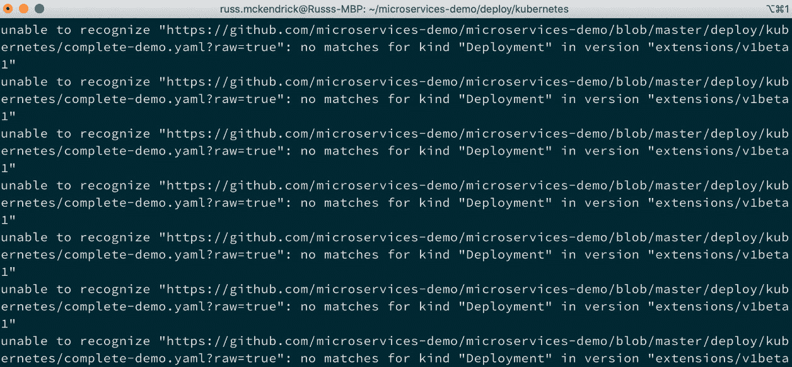

](img/image_026.jpg)

图 13.26 – Sock Shop 错误

不过不用担心——这个问题很容易解决。首先，让我们删除其中部分部署的应用程序所在的命名空间：

```
$ kubectl delete namespace sock-shop
```

删除这些后，我们需要克隆 Sock Shop 仓库并重新创建命名空间。为此，请运行以下命令：

```
$ git clone https://github.com/microservices-demo/
microservices-demo.git
$ kubectl create namespace sock-shop
```

接下来，我们需要切换到 Kubernetes 部署文件夹，更新定义文件，然后启动应用程序。为此，我们需要运行以下命令：

```
$ cd microservices-demo/deploy/kubernetes
$ kubectl convert -f . | kubectl create -f -
```

在这里，你可以检查 pods 和服务，暴露前端，并使用以下命令获取暴露的服务信息：

```
$ kubectl -n sock-shop get pods,services
$ kubectl -n sock-shop expose deployment front-end 
--type=LoadBalancer --name=front-end-lb 
$ kubectl -n sock-shop describe services front-end-lb
```

可能需要一两分钟才能将服务暴露，因为 DigitalOcean 会启动一个负载均衡器。

在我们返回 DigitalOcean 网络门户之前，让我们启用高级集群指标。为此，我们需要部署另一个应用程序。你可以通过运行以下两个命令来完成：

```
$ git clone https://github.com/kubernetes/kube-state-metrics.
git
$ kubectl create -f kube-state-metrics/examples/standard/
```

安装完成后，可能需要一两分钟时间，指标才会在门户中显示。你可以通过选择集群然后点击**Insights**标签来找到它们：


](img/image_027.jpg)

图 13.27 – 在 DigitalOcean 网络门户查看集群详情

我建议在删除集群之前，先在 DigitalOcean 网络门户上浏览一下，因为我相信你会同意这个服务整合得非常好，且价格非常实惠。我们启动的三节点集群每月只需 30 美元！

你可以通过 Web 门户终止集群。同时，确保删除负载均衡器，因为在集群终止后它仍然存在，以避免月底产生意外费用。

# 总结

在本章中，我们研究了如何在不同云中启动 Kubernetes 集群，并在其中运行相同的示范应用程序。我敢肯定，到本章结束时，你可能已经厌倦了一次又一次地启动相同的应用程序；然而，这正是本章的重点。

我们已经研究了四个非常不同且传统上不兼容的云服务提供商，并在它们上使用相同的工具和命令部署了相同的应用程序。诚然，由于使用了不同版本的 Kubernetes，我们做了一些调整，但大部分情况下，一旦我们开始使用`kubectl`，就不需要做任何特定于提供商的调整。

这正是 Kubernetes 成为如此流行的关键原因之一：它确实允许你以平台无关的方式定义和分发应用程序——即使是几年前，能够在本地部署一个应用程序，然后在四个公共云提供商之间使用相同的命令和配置部署，似乎是不可能的，没有大量复杂性的。而我相信，你也会同意，在过去几章中并没有复杂性。

在下一章，我们将回到 Docker，并学习如何最好地保护你的容器。

# 问题

1.  一旦我们的集群启动，我们需要运行什么命令来为 Sock Shop 商店创建命名空间？

1.  如何查找负载均衡器的完整详细信息？

1.  请列出官方的亚马逊弹性 Kubernetes 服务 CLI。

# 深入阅读

每个 Kubernetes 服务的产品页面可以在以下链接找到：

+   **Azure Kubernetes 服务:** [`azure.microsoft.com/en-gb/services/kubernetes-service/`](https://azure.microsoft.com/en-gb/services/kubernetes-service/)

+   **谷歌 Kubernetes 引擎:** [`cloud.google.com/kubernetes-engine/`](https://cloud.google.com/kubernetes-engine/)

+   **亚马逊弹性容器服务 Kubernetes 版:** [`aws.amazon.com/eks/`](https://aws.amazon.com/eks/)

+   **DigitalOcean Kubernetes:** [`www.digitalocean.com/products/kubernetes/`](https://www.digitalocean.com/products/kubernetes/)

本章中使用的各种命令行工具的快速入门可以在以下链接找到：

+   **Azure CLI:** [`docs.microsoft.com/en-us/cli/azure/?view=azure-cli-latest`](https://docs.microsoft.com/en-us/cli/azure/?view=azure-cli-latest)

+   **谷歌云 SDK:** [`cloud.google.com/sdk/`](https://cloud.google.com/sdk/)

+   **AWS 命令行接口:** [`aws.amazon.com/cli/`](https://aws.amazon.com/cli/)

+   **eksctl，Amazon EKS 官方 CLI:** [`eksctl.io/`](https://eksctl.io/)

+   **doctl:** [`github.com/digitalocean/doctl/`](https://github.com/digitalocean/doctl/)

最后，关于示范商店的更多详情，请访问以下链接：

+   **Sock Shop:** [`microservices-demo.github.io/`](https://microservices-demo.github.io/)

# **第三部分**：最佳实践

在本节中，我们将结合前面章节所学的技能，探讨它们如何在现实世界中应用。

本节包含以下章节：

*第十四章*，*保护你的 Docker 环境*

*第十五章*，*Docker 工作流*

*第十六章*，*Docker 的下一步*
