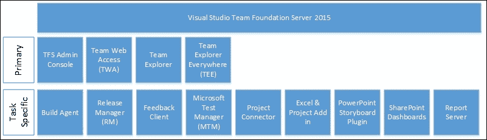

# 前言

Visual Studio 是微软开发者工具和服务的套件，其中一些关键工具包括 Visual Studio IDE、Visual Studio Code、Visual Studio Team Services 和 Visual Studio Team Foundation Server（TFS）。早在 2004 年 11 月，微软就发布了集成的应用生命周期管理（ALM）工具的第一个版本，名为“Microsoft Visual Studio Team Systems”。在过去的 15 年里，该产品经历了几次演变，每次都丰富了开发者体验和工具的范围：


Visual Studio – 任何应用，任何开发者

Visual Studio 工具和服务家族现在支持跨多个平台的异构软件开发。产品中使用开源工具的体验已经得到了极大的提升。开源解决方案被赋予了**首等公民**的地位，更多的这些解决方案被预先打包进产品中。这清楚地表明微软希望成为每位开发者的首选平台，无论技术或平台如何。Visual Studio 工具家族中的工具和服务之间存在着巨大的重叠。本书完全聚焦于 Visual Studio Team Foundation Server 2015。

Microsoft Visual Studio Team Foundation Server 2015 是微软 ALM 解决方案的核心，提供了版本控制、工作项跟踪、报告和自动化构建等核心服务。TFS 帮助组织在设计、构建、测试和部署软件的整个过程中更有效地沟通与协作，最终提高生产力和团队产出、改善质量，并为应用程序生命周期提供更大的可视性。

在过去十年里，软件交付本身经历了一场革命。敏捷实践和精益框架的引入，如 Scrum、Kanban、XP 和 RUP 等，证明了迭代反馈驱动的开发有助于应对市场、业务和用户需求的变化。精益流程还帮助最大限度地减少浪费，并最大化向最终用户交付的价值。更好的 DevOps 实践，鼓励持续集成、持续部署、持续交付和持续反馈，并配合更好的工具，正在帮助组织打破团队之间的孤岛。关键任务应用程序仍可能选择使用瀑布模型交付，而某些业务线应用程序则可能选择精益方法论获得更大的成功。这并没有绝对的对与错；选择最适合您交付场景的过程和工具。Visual Studio TFS 默认支持大多数流程，并且为您提供了定制和定义最适合您组织的流程的灵活性。

Visual Studio Team Foundation Server 2015，本书中以下简称为 TFS，是微软提供的本地部署的 ALM 工具。微软还提供了一个名为 Visual Studio Team Services (VSTS) 的云托管服务。不要将 VSTS 与 Visual Studio IDE 在云端混淆；它实际上是一个开发者服务集合，类似于 TFS，运行在微软 Azure 上，扩展了云端的开发体验。微软对其托管服务非常重视，并已将其迁移到 3 周一次的发布节奏。所有功能首先在 VSTS 中发布，然后通过季度更新将大部分功能引入 TFS。已发布功能及未来计划发布的功能时间表可以在[`www.visualstudio.com/en-us/news/release-archive-vso.aspx`](https://www.visualstudio.com/en-us/news/release-archive-vso.aspx)查看。产品团队通过用户反馈征集新功能请求。如果你有一个迫切的功能想法，务必在[`visualstudio.uservoice.com/forums/121579-visual-studio-2015`](https://visualstudio.uservoice.com/forums/121579-visual-studio-2015)提交你的请求。VSTS 目前提供许多企业级功能，如保证的正常运行时间、使用 ADFS 和 AAD 的单一登录，以及通过在这些地区托管租户来遵守美国、欧洲和澳大利亚的数据主权法律。尽管 VSTS 自豪地拥有超过 300 万活跃用户，但需要对环境和数据拥有更多控制权的组织仍然更喜欢 TFS 而非 VSTS。

### 注意

本书中的所有示例都适用于 TFS；然而，由于 VSTS 与 TFS 之间有很多重叠，书中大部分内容也适用于 VSTS。

可以用来连接 TFS 的各种客户端大致可分为两类——主要客户端和特定任务客户端，如下图所示。有关这些客户端可以执行的功能的完整列表，请参见[`msdn.microsoft.com/en-us/library/ms181304.aspx`](https://msdn.microsoft.com/en-us/library/ms181304.aspx)。



如果你正在为个人使用或评估核心功能（如版本控制、构建和工作项跟踪）设置 TFS，建议使用 TFS Express。它是免费的，设置简单，且可以安装在客户端和服务器操作系统上。Express 不支持与 SharePoint 或 Reporting Services 的集成。如果你为组织设置 TFS，请使用 TFS 的标准版本。你可以在单台计算机、双服务器配置或多服务器配置中设置 TFS。使用以下便捷参考检查 TFS 2015 的兼容性矩阵：

[`msdn.microsoft.com/Library/vs/alm/TFS/administer/requirements`](https://msdn.microsoft.com/Library/vs/alm/TFS/administer/requirements)

TFS 架构设置及网络和端口要求可以在[`msdn.microsoft.com/en-us/library/ms252473(v=vs.120).aspx`](https://msdn.microsoft.com/en-us/library/ms252473(v=vs.120).aspx)找到。产品设置文档可以在[`msdn.microsoft.com/en-us/Library/vs/alm/TFS/setup/overview`](https://msdn.microsoft.com/en-us/Library/vs/alm/TFS/setup/overview)找到。ALM Rangers 提供的规划和灾难恢复指南([`vsarplanningguide.codeplex.com/`](http://vsarplanningguide.codeplex.com/))对于规划企业级 TFS 设置非常有帮助。TFS 2015 特定的许可证更新将在第一章，*团队项目设置*中的*分配许可证、添加用户并审计用户访问*配方中讲解。要了解更多关于 TFS 许可证要求的信息，请阅读[`www.microsoft.com/en-gb/download/details.aspx?id=13350`](http://www.microsoft.com/en-gb/download/details.aspx?id=13350)上的 Visual Studio 和 MSDN 授权白皮书。

本书中的配方要求使用标准的单机 TFS 设置。你可以使用前述安装说明设置一个独立的单服务器，或者选择使用预配置的 TFS 2015 虚拟机。下载并设置该虚拟机的说明可以在[`vsalmvm.azurewebsites.net/`](http://vsalmvm.azurewebsites.net/)找到。

# 本书内容

第一章，*团队项目设置*，介绍了团队项目，这是一个逻辑容器，将与软件应用程序相关的所有工具和工件隔离并组合在一个命名空间中。欢迎页面、仪表板、团队房间等功能，能够更好地促进团队内的协作，而重命名团队项目和脚本化团队项目创建的功能，则使你能够更好地管理团队项目。在本章中，我们将学习团队项目的不同功能，并了解如何设置这些功能，以充分利用它们的潜力。

第二章，*设置和管理代码库*，介绍了 TFS，它是唯一提供集中式和分布式版本控制系统的产品。在本章中，我们将学习如何在一个项目中设置 TFVC 和 Git 代码库，以及如何通过在开发工作流中执行代码审查和代码分析来解决技术债务。

第三章，*规划和跟踪工作*，解释了那些已实现但从未使用的需求，或者那些使用过短暂时间后发现无法满足用户需求的需求，这会导致浪费、返工和不满。在这一章中，我们将学习如何设置和定制多个待办事项、看板和冲刺任务板。我们还将学习如何使用服务钩子与外部规划工具集成，并通过利用 TFS 中的反馈功能改进反馈循环。

第四章，*构建你的应用程序*，介绍了新的构建系统（TFBuild），它是一个跨平台、开放且可扩展的基于任务的执行系统，具有丰富的 Web 界面，允许构建的创建、排队和监控。在这一章中，我们将学习如何设置和使用 TFBuild 进行持续集成。我们还将学习如何将 TFBuild 与 SonarQube 和 GitHub 集成。我们还将回顾帮助为软件的持续交付奠定基础的功能。

第五章，*测试你的应用程序*，指出低质量的软件是不可接受的。但你可能会问：“什么是合适的质量水平？”在这一章中，我们将学习如何使用 TFS 中可用的测试工具进行规划、跟踪和自动化。我们还将学习如何利用新的构建系统将非微软测试框架（如 Selenium 和 NUnit）集成到自动化测试工作流中。

第六章，*发布你的应用程序*，解释了 TFS 中基于 Web 的新发布管理器，该管理器使用与 TFBuild 提供的相同代理和任务基础设施。在这一章中，我们将学习如何使用发布管道设置、安全性设置并部署到多个环境。我们还将学习如何跟踪和报告通过发布管道交付的发布版本。本章中的技巧使您能够为持续交付设置软件。

第七章，*管理 Team Foundation Server*，教你如何更新、维护和优化 TFS，从而实现地理分布团队的高可用性，并减少管理开销。

第八章，*扩展和自定义 Team Foundation Server*，解释了组织通常会有不同的工具来管理生命周期的不同部分，例如，使用 Jira 进行敏捷项目管理，使用 TeamCity 进行构建，使用 Jenkins 进行发布管理，使用 ServiceNow 进行服务管理。本章将介绍 TFS 对象模型和 TFS REST API，帮助你通过编程访问和集成系统。本章还将讲解如何通过利用过程模板定制来定制团队项目。

# 本书所需内容

本书中的食谱基于 Team Foundation Server 2015。所有食谱都已经在 TFS 2015 Update 1 环境中进行过测试。为了实践这些食谱，你需要一个安装了 Visual Studio 2015 的 Team Foundation Server 2015 工作环境。

# 本书的目标读者

本书适合所有软件专业人士，包括开发人员、测试人员、架构师、经理以及正在使用或计划使用 TFS 的配置分析师。

本书涵盖了 Team Foundation Server 2015 的功能，包括团队项目、源代码控制、工作项、构建、测试、发布、管理、扩展性和自定义，重点讨论 DevOps 和 ALM 相关的主题。

本书提供了针对 Scrum 团队的实用食谱，帮助他们利用 TFS 的新功能和现有功能，实现更快、更高质量的软件持续交付。本书不仅涵盖理论概念，每个食谱采用食谱格式，呈现问题、解决方案和解释，将你直接带入现实世界的实践场景。

本书假设你已具备 Team Foundation Server 2015 的工作环境，并对 TFS、软件开发生命周期和 Scrum 框架有基本了解。

# 章节

本书中，你将发现多个经常出现的标题（准备工作、操作方法、工作原理、更多内容、另见）。

为了清楚地指导你如何完成一个食谱，我们使用以下几种结构：

## 准备工作

本节将告诉你如何理解本食谱的内容，并描述为该食谱设置所需的软件或其他初步设置。

## 如何操作…

本节包含完成食谱所需的步骤。

## 它是如何工作的…

本节通常包括对上一节发生内容的详细解释。

## 还有更多…

本节提供关于食谱的额外信息，旨在让读者更深入了解该食谱。

## 另见

本节提供了有用的链接，指向与本食谱相关的其他有用信息。

# 约定

在本书中，你将看到多种文本样式，用于区分不同类型的信息。以下是这些样式的一些示例及其含义的解释。

文本中的代码词、数据库表名、文件夹名称、文件名、文件扩展名、路径名、虚拟网址、用户输入和 Twitter 用户名如下所示：“`tfsdeleteproject`命令分两阶段执行删除。”

代码块如下所示：

```
# User-specific files
*.suo
*.user
*.sln.docstates
# Specific files 
*.txt
# Build results
[Dd]ebug/
[Rr]elease/
```

所有命令行输入或输出将如下所示：

```
refs/heads/master, TF402455: Pushes to this branch are not permitted; you must use pull requests to commit changes.

```

**新术语**和**重要词汇**以粗体显示。您在屏幕上看到的词汇，例如在菜单或对话框中，出现在文本中如下所示：“从**项目和我的团队**子菜单中，点击**新建团队项目...**”。

### 注意

警告或重要提示会以类似这样的框显示。

### 提示

小贴士和技巧会像这样显示。

# 读者反馈

我们始终欢迎读者反馈。请告诉我们您对这本书的看法——您喜欢或不喜欢的地方。读者反馈对我们来说非常重要，因为它帮助我们开发出能真正满足您需求的书籍。

如需向我们发送一般反馈，请通过电子邮件发送至`<feedback@packtpub.com>`，并在邮件主题中注明书名。

如果您在某个领域拥有专业知识，并且有兴趣撰写或参与编写书籍，请查看我们的作者指南：[www.packtpub.com/authors](http://www.packtpub.com/authors)。

# 客户支持

现在，作为一本 Packt 书籍的自豪拥有者，我们提供一些帮助，帮助您充分利用您的购买。

## 下载示例代码

您可以从您的帐户中下载所有 Packt 出版的书籍的示例代码文件，网址是[`www.packtpub.com`](http://www.packtpub.com)。如果您是从其他地方购买的本书，您可以访问[`www.packtpub.com/support`](http://www.packtpub.com/support)，并注册以直接通过电子邮件获得文件。

## 勘误

尽管我们已尽力确保内容的准确性，但错误仍然会发生。如果您在我们的书籍中发现错误——可能是文本或代码中的错误——我们将非常感激您能报告给我们。这样，您可以帮助其他读者避免困扰，并帮助我们改进后续版本。如果您发现勘误，请访问[`www.packtpub.com/submit-errata`](http://www.packtpub.com/submit-errata)提交，选择您的书籍，点击**勘误提交表单**链接，并输入勘误的详细信息。一旦您的勘误得到验证，我们将接受您的提交，并将勘误上传至我们的网站，或添加到该书名的勘误列表中。

要查看之前提交的勘误，请访问[`www.packtpub.com/books/content/support`](https://www.packtpub.com/books/content/support)，并在搜索框中输入书名。所需的信息将显示在**勘误**部分。

## 盗版

互联网版权侵犯问题是所有媒体面临的持续性问题。在 Packt，我们非常重视版权和许可证的保护。如果您在互联网上发现我们作品的任何非法复制品，请立即提供其位置地址或网站名称，以便我们采取补救措施。

请通过`<copyright@packtpub.com>`联系我们，并提供涉嫌侵权内容的链接。

我们感谢您的帮助，保护我们的作者和我们为您带来有价值内容的能力。

## 问题

如果您在本书的任何方面遇到问题，可以通过`<questions@packtpub.com>`与我们联系，我们将尽力解决问题。
