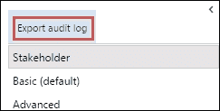
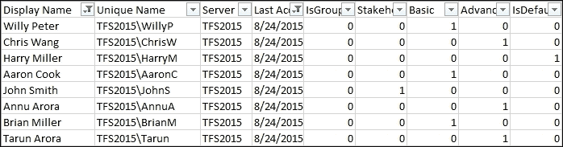
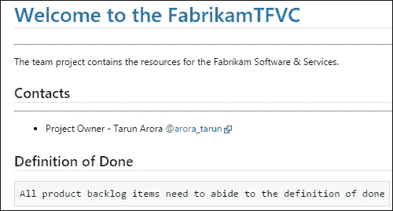
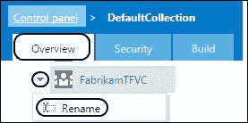
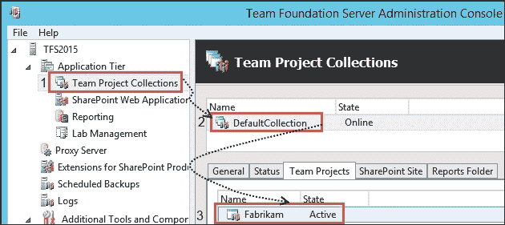

# 第一章：Team Project 设置

|   | *"你应该关注的不是建筑的美丽，而是能够经得起时间考验的基础建设。"* |   |
| --- | --- | --- |
|   | --*David Allan Coe* |

本章将涵盖：

+   使用 Team Explorer 连接到 TFS

+   在 TFS 中设置用户配置文件

+   使用 Scrum 模板创建 Team Project

+   分配许可证、添加用户并审计用户访问

+   配置 Team Project 中的仪表板

+   为 Team Project 设置欢迎页面

+   创建并设置 Team Room

+   重命名 Team Project

+   通过命令行创建新的 Team Project

+   删除 Team Project

# 介绍

Microsoft Visual Studio Team Foundation Server 提供了一套集成工具，帮助团队有效管理其软件项目的生命周期。Team Foundation Server 中的 Team 被封装在 Team Project 的容器内。简而言之，**Team Project** 是一个逻辑容器，将与软件应用程序相关的所有工具和工件隔离在一个单一的命名空间中。

通过 Team Project 引入的概念边界消除了访问与应用程序开发无关的工件（如代码、工作项或发布信息）的问题。相关的 Team Projects 可以被分组到一个 Team Project Collection 中。它可以通过将这些相关的 Team Projects 托管在不同的数据库中，来实现物理上的分离。

Team Foundation Server 支持多个 Team Project Collections，每个集合可以内部托管多个 Team Projects。资源如构建池在 Team Project Collection 级别进行作用域设置。一个 Team Project 可以托管多个 Team；某些资源在 Team Project 级别设置，其他则在 Team 级别设置。如以下截图所示，源代码管理库（TFVC 或 Git）的选择是在 Team Project 级别进行的；然而，团队在选择待办事项清单和看板上的工作流程时具有自主权。所选的交付框架通过 Process Template 应用；它进一步应用特定交付框架的术语、工件和工作流程到 Team Project 以及其中的所有 Teams：


TFS 报告仓库是一个传统的数据仓库，由一个按近似星型架构组织的关系型数据库和构建在关系型数据库上的 SQL Server Analysis Services 数据立方体组成。所有的 Team Projects，不论它们属于哪个 Team Project Collection，都被汇总到一个单一的数据仓库中。

Team Foundation Server 提供了一个层次化的安全模型。权限可以通过 TFS 组或 AD 组成员身份在每个层级上进行设置，从服务器到对象层级。组可以嵌套，并设置为通过层次结构继承权限。权限继承可以设置为**拒绝**，以控制对选定资源的访问。有关预创建组的详细信息，包括访问权限和权限细节，可以在[`bit.ly/1PPaU6l`](http://bit.ly/1PPaU6l)找到。


权限可以用于限制对 Team 项目内部或项目之间资源的访问，Team 项目集合则提供了完全的隔离。Team 项目集合还提供了其他功能和技术上的优势，例如：

+   在多个部门之间使用单一的 TFS 实例，同时仍能提供一定程度的隔离。集合也可以用来反映组织结构。

+   备份和恢复的灵活性。这可以减少停机时间，因为恢复一个集合不会影响其他集合的用户。

+   通过将集合移动到单独的 SQL Server 实例上实现可扩展性和负载均衡。

在本章中，我们将讨论管理和过程模板的内容；这些主题将在后续章节中详细讨论。本章的重点是创建和设置 Team 项目的各个元素。

# 使用 Team Explorer 连接到 TFS

要构建、测试、跟踪或发布你的软件，你需要将你选择的客户端连接到 Team Foundation Server。作为软件开发人员，你将花费大量时间在 Visual Studio IDE 中。无论是将代码存储在 TFS Git 仓库中还是使用 TFVC 源代码管理，你都需要将 IDE 连接到 TFS 来与代码交互。在本节中，你将学习如何使用 Team Explorer 连接到 TFS。

## 准备工作

如果你已经安装了任何 Visual Studio 2015 版本，你已经拥有 Team Explorer。对于 TFS 2015，不再提供单独安装 Team Explorer 的选项；你至少需要安装 Visual Studio Community 来获得 Team Explorer。

### 注意

要通过任何 Office 产品连接到 TFS，你可以安装 TFS Office 集成安装程序：[`bit.ly/1k3wh7p`](http://bit.ly/1k3wh7p)。你可以在[`bit.ly/1Grh3DS`](http://bit.ly/1Grh3DS)了解更多关于 TFS Office 集成安装程序的好处。

当你第一次启动 Visual Studio 时，你将被要求使用 Microsoft 账户登录，如 Live、Hotmail 或 Outlook，并提供一些基本的注册信息。选择一个最能代表你的 Microsoft 账户。如果你已有 MSDN 账户，建议使用其关联的 Microsoft 账户登录。如果你没有 Microsoft 账户，可以免费创建一个。登录有多种好处，如在多台机器之间同步 Visual Studio 设置。虽然建议登录，但并非强制要求。

## 如何操作...

1.  打开 Visual Studio 2015。

1.  点击**团队**工具栏，选择**管理连接...**：

1.  在 Team Explorer 中，点击**管理连接**超链接，选择**连接到团队项目**：

1.  在**连接到 Team Foundation Server**窗口中，下拉菜单显示你以前连接过的所有 TFS 服务器。如果在下拉菜单中看不到你想连接的服务器，点击**服务器...**输入 Team Foundation Server 的详细信息。点击**添加...**并输入你的 TFS 服务器的详细信息。你可能需要输入登录凭据以便与服务器进行身份验证。

1.  经身份验证的用户详情和服务器详情将在**连接到 Team Foundation Server**窗口中更新。点击**连接**按钮完成操作。

1.  现在，你应该已成功通过 Team Explorer 连接到 TFS：

## 工作原理...

现在 Visual Studio 附带 GitHub 连接器。现在，Team Explorer 中的**管理连接**对话框不仅允许你连接到 TFS 和 VSO，还可以连接到 GitHub。这是 Microsoft 通过为非 Microsoft 产品提供无缝集成，展示其拥抱开源的一个很好的例子。


### 注意

如果你是 GitHub 免费账户用户，你将只能在 Visual Studio 中绑定一个账户，这是 GitHub 限制的。GitHub 企业用户可以从 Team Explorer 2015 中映射多个账户。

如果你在是否使用 Microsoft 账户登录 Visual Studio 上有些犹豫，权衡以下好处：

+   **同步你的 Visual Studio 设置**：当你在任何其他设备上登录 Visual Studio 时，Visual Studio 的设置（如快捷键绑定和颜色主题）会立即应用。

+   **延长试用期**：如果你没有 Visual Studio 许可证，通过登录，你可以将 Visual Studio Professional 或 Enterprise 的试用期从 30 天延长至 120 天。

+   **解锁 Visual Studio**：如果你的 Microsoft 账户与 MSDN 账户相关联，你的 Visual Studio 副本将自动解锁。

如果你不想同步设置，可以禁用此功能。在**工具**菜单中，选择**选项**。在**环境**下查找**同步设置**，然后取消选中以下截图所示的选项：


# 在 TFS 中设置你的用户资料

Team Foundation Server 允许你通过选择自己的设置来自定义体验。每个 TFS 用户都通过登录拥有一个个人资料。在本教程中，你将学习如何在 TFS 中自定义你的个人资料。

## 如何操作...

1.  打开 Team Portal，导航至 `http://tfs2015:8080/tfs/`。

1.  右上角包含登录用户的名称。点击该名称可以打开用户个人资料控制，如下图所示：

1.  点击**我的个人资料**以查看和自定义您的个人资料。我们先浏览一下常规设置。

1.  要更改个人资料图片，点击**更改图片**超链接，选择一个小于 4MB 的图片，然后点击**保存更改**。

1.  要更改显示名称，点击**编辑**超链接，将名称从**Tarun**更改为`Tarun Arora`，然后按*回车*。

1.  要更改首选电子邮件，点击**编辑**超链接，将电子邮件地址更改为`tarun.arora@outlook.com`，然后按*回车*。

1.  **UI 设置**字段可以通过从下拉菜单中选择**高对比度**主题来从默认设置更改为高对比度：

1.  点击**地区设置**标签，切换到地区设置页面。从这里可以更改语言和时区设置。

## 它是如何工作的…

用户个人资料设置仅适用于个人；这些设置不会影响其他用户。您的个人资料现在应包含图片、显示名称、首选电子邮件地址以及您选择的主题。您为工作项、构建和代码审查配置的任何提醒将发送到您的首选电子邮件地址。

TFS 中的时区设置将覆盖机器的时区设置。例如，如果您的机器在 UTC + 1 时区，但您的个人资料配置为 UTC + 5:30，创建一个新的工作项时，工作项中的创建时间将是 UTC + 5:30，而不是 UTC + 1。

### 注意

在团队基础服务器中，有些功能受托管团队基础服务器时区设置的影响。例如，如果您的团队基础服务器托管在美国华盛顿，而您的分布式团队部分位于印度德里，则当前冲刺将根据华盛顿时间的当天结束来结束。

当个人资料在团队项目范围内打开时，您将在**个人资料**菜单中看到**我的提醒**选项。提醒功能允许您在团队项目内发生某些事件时配置电子邮件通知。例如，构建完成、工作项分配等。


点击**我的提醒**将启动管理您的 TFS 提醒的窗口。在此窗口中，您可以管理基本提醒和自定义提醒。提醒可以通过条件进行自定义。该窗口还包含一个链接，指向高级提醒管理页面，可以用来管理团队提醒。

# 使用 Scrum 模板创建团队项目

在 TFS 中，团队项目是一个逻辑容器，用于存储工作项、代码、构建和发布等工件。不同的团队遵循不同的流程来组织、管理和跟踪工作。TFS 通过过程模板允许指定流程。系统默认提供了 Scrum、Agile 和 CMMI 模板。过程模板定义了可以用于规划和跟踪项目的工作项类型、查询和报告集合。在本教程中，您将学习如何使用 Scrum 模板创建新的团队项目。

## 准备工作

无法通过团队门户创建团队项目；在本教程中，我们将使用 Team Explorer 来创建一个新的团队项目。如果您还没有连接 Team Explorer 到 TFS，请参考 *使用 Team Explorer 连接到 TFS* 教程，了解如何进行连接。

要创建新的团队项目，您需要以下权限：

+   **创建新项目权限**：通过成为 **项目集合管理员** 组的成员，您继承此权限。**Team Foundation 管理员全局组** 也包括此权限。

+   **创建新团队站点权限**：此权限通过将用户添加到具有 SharePoint 站点集合完全控制权限的 SharePoint 组中来授予。如果您决定不在团队项目创建过程中创建 SharePoint 站点，则不需要此权限。

    为了使用 SQL Server 报告服务，您必须是报告服务中 Team Foundation 内容管理角色的成员。

    ### 注意

    要验证是否拥有正确的权限，您可以从 CodePlex 下载 Team Foundation Server 管理工具，网址为 [`tfsadmin.codeplex.com/`](https://tfsadmin.codeplex.com/)。TFS Admin 是一个开源工具，采用 Microsoft 公共许可证（Ms-PL）发布。

## 如何操作...

1.  打开 Visual Studio 2015，并将 Team Explorer 连接到 TFS：

1.  在 **项目和我的团队** 子菜单中，点击 **新建团队项目...**。这将弹出新团队项目创建向导：

1.  输入团队项目名称和描述，然后点击 **下一步** 按钮：

1.  选择 **Scrum** 过程模板并点击 **下一步**。这是您在团队项目创建过程中可能做出的最重要的决定之一。了解有关不同过程模板的更多信息，访问 [`msdn.microsoft.com/library/vs/alm/work/guidance/choose-process`](https://msdn.microsoft.com/library/vs/alm/work/guidance/choose-process)。

1.  选择 **创建一个新的 SharePoint 站点** 选项。点击 **配置...** 来指定新站点的位置。如果没有 SharePoint 集成，选择不配置 SharePoint 站点的选项。

1.  这个源代码管理选择界面呈现了在团队项目创建过程中，你将被要求做出的第二个最重要的决策。TFS 支持集中式（TFVC）和分布式（Git）源代码控制系统。在第二章，*设置与管理代码仓库*中，我们将深入讨论这两种源代码控制类型。选择 **Team Foundation Version Control** 并点击 **下一步**：

1.  在你查看设置后，点击 **完成** 以开始团队项目创建过程：

1.  一旦团队项目创建完成，你将在表单上看到完成状态。点击 **查看团队项目创建日志** 超链接（我们将在 *它是如何工作的…* 部分讨论日志内容）。

1.  Team Explorer 现在已更新为新创建的团队项目的详细信息：

## 它是如何工作的...

过程模板定义了一组将用于规划和跟踪项目的工作项类型和报告。过程模板还应用了工作项工作流和状态转换。让我们来看看现成模板之间的主要区别：

+   Scrum 模板旨在支持 Scrum 组织定义的 Scrum 框架。此过程模板在与产品待办事项项目相同的级别上跟踪缺陷，并使用努力字段来跟踪估算。

+   Agile 模板旨在支持不希望被 Scrum 限制的团队的敏捷开发。它通过使用故事点来估算用户故事。任务包含用于跟踪原始估算、剩余工作和已完成工作的字段。虽然最初 Agile 模板不允许在任何待办事项页面上进行缺陷跟踪，但现在可以通过团队门户中的团队设置进行配置。

+   CMMI 模板旨在支持正式的变更管理过程。此模板通过 **Size** 字段支持估算的需求。任务包含用于跟踪原始估算、剩余工作和已完成工作的字段。

现成的模板旨在满足大多数团队的需求。它们都支持使用敏捷规划工具创建产品待办事项，并在任务板上以冲刺的方式进行工作。如果你的团队有不同的需求，你可以自定义一个模板并创建团队项目，或者你可以从模板创建一个团队项目，然后对项目进行自定义。

你可以通过进入 **设置** 视图中的团队资源管理器的过程模板管理器来下载过程模板。有关如何下载过程模板的更多说明，请参阅[`msdn.microsoft.com/Library/vs/alm/Work/guidance/manage-process-templates`](https://msdn.microsoft.com/Library/vs/alm/Work/guidance/manage-process-templates)。


打开 `ProcessTemplate.xml` 文件（位于之前下载的路径）；您会注意到它遵循一种 XML 结构，构建了一系列插件和设置插件的指令。主模板与由其他 XML 结构定义的子模块相关联。在以下表示中，您将看到这些 XML 模板与项目创建工作流生成的仪表之间的关联。有关流程模板自定义的详细信息，请参阅第八章，*扩展和自定义 Team Foundation Server*。


在团队项目创建过程中，以下项目会为您创建：

+   **代码仓库**：根据您的选择，已配置一个代码仓库。

+   **团队**：为团队项目创建一个与项目同名的默认团队。

+   **区域路径**：为团队创建一个与团队同名的默认区域路径。团队的待办事项列表配置为显示分配给此区域路径的工作项。

+   **迭代路径**：为团队预先创建了一组迭代。

+   **团队门户**：团队门户允许团队成员连接到 TFS 以管理源代码、工作项、构建和测试工作。

+   **团队房间**：为团队创建一个与团队同名的房间。团队房间用于协作。

如果您的 Team Foundation Server 配置为支持 SharePoint 项目门户和报告，您将在 Team Explorer 中看到 **文档和报告** 中心。**文档**视图提供与 SharePoint 项目门户的深度集成。这允许您创建文档库并与团队成员组织和共享文档。**报告**视图为您提供了一组预先创建的 SSRS 报告，您可以使用它们来跟踪和管理团队工作进展：


# 分配许可证、添加用户以及审计用户访问

Scrum 团队由产品负责人、开发团队和 Scrum Master 组成。虽然您的利益相关者不是 Scrum 团队的一部分，但他们需要看到产品待办事项列表。Scrum 团队是跨职能的，具备覆盖设计、开发、测试和增量部署的技能。从工具的角度来看，团队中的每个成员可能不需要相同的 TFS 访问权限。

TFS 提供三种访问级别：利益相关者、基本和高级。所需的 TFS 许可证在此列出：

| 访问级别 | 所需许可证 |
| --- | --- |
| 利益相关者 | 不需要许可证。 |
| 基本 | TFS 客户端访问许可证（CAL）或带有 MSDN 订阅的 Visual Studio Professional。 |
| 高级 | 以下 MSDN 订阅之一：带 MSDN 的 Visual Studio Enterprise、MSDN Platforms，或带 MSDN 的 Visual Studio Test Professional。 |

在过去的一年里，产品授权已经显著简化。TFS 2015 和现在的 TFS 2015 更新 1 引入了一些关键的授权变更：

+   TFS CAL 许可证已被更改，以包含更多 TFS 功能的访问权限：

    +   **敏捷规划**：TFS 2015 Web 访问中的所有待办事项管理和冲刺规划功能现在对任何拥有 TFS CAL 的用户开放。

    +   **图表创作**：图表创作功能及将图表固定/分享至项目主页的功能现在可以通过 CAL 使用。

    +   **团队房间**：团队房间现在在 TFS 2015 中通过 CAL 可用。

    +   **测试中心**：在 TFS 2015 中，基于 Web 的测试体验（用于用户验收测试，如场景测试）现在在 TFS CAL 中可用。

+   购买 Visual Studio Team Services、Professional 或 Advanced 许可证时，您将获得一个免费的 TFS CAL 许可证，适用于该命名用户。这带来了几个优势：

    +   现在，您可以“租赁” TFS CAL。您无需一次性支付 499 美元（列价）的许可证费用，而是可以按月支付较低的费用，按需使用。

    +   使用供应商/承包商的公司现在有了一种简单的方式来管理需要临时访问其 TFS 的人员。

    +   CAL 是“始终保持最新”。因为它是订阅制，而非一次性购买，所以当新的 TFS 版本发布时，您无需处理购买/续订 CAL 的问题。与 VS Online 许可证捆绑的 CAL 可与任何 TFS 版本兼容，而传统购买的 CAL 仅支持特定 TFS 版本及其早期版本。

    访问级别和角色是 TFS 中两个独立的概念。访问级别决定了您有权使用哪些功能，而角色决定了权限。例如，基本许可证的访问级别包括源代码管理权限；但是，如果您是只读角色，您将无法编辑源代码。

    团队基础服务器的访问级别与软件项目中的典型角色及其所执行的活动密切相关。以下表格总结了特性与访问级别的映射关系。因此，项目支持人员只需一个利益相关者许可证，项目经理或开发人员需要一个基本许可证，测试人员或项目组合经理则需要一个高级许可证。

    | 特性 | 利益相关者 | 基本 | 高级 |
    | --- | --- | --- | --- |
    | 查看和编辑所有工作项 | 是 | 是 | 是 |
    | 标准功能 | 是 | 是 | 是 |
    | 敏捷看板 | 是 | 是 | 是 |
    | 基本的待办事项和冲刺规划工具 | 是 | 是 | 是 |
    | 图表查看 | 是 | 是 | 是 |
    | 图表创作 |   | 是 | 是 |
    | 代码 |   | 是 | 是 |
    | 构建 |   | 是 | 是 |
    | 请求和管理反馈 |   |   | 是 |
    | 基于 Web 的测试执行 |   | 是 | 是 |
    | 基于 Web 的测试用例管理 |   |   | 是 |
    | 团队房间 |   | 是 | 是 |
    | 管理账户 |   | 是 | 是 |
    | 高级主页 |   | 是 | 是 |
    | 高级待办事项和冲刺规划工具 |   | 是 | 是 |
    | 高级投资组合管理 |   | 是 | 是 |
    | 分析测试结果并管理机器组 |   | 是 | 是 |

    拥有利益相关者访问权限的用户可以创建和修改所有工作项，并在`我的查询`文件夹下创建并保存所有工作项的查询。（与有限访问权限不同，有限访问权限下用户只能创建和修改自己创建的工作项，并查询和查看自己创建的工作项。）此外，利益相关者还可以使用团队基础客户端（如 Microsoft Excel、Microsoft Project 和 Microsoft Feedback Client）创建和修改工作项。

+   标准功能包括访问首页和工作中心。

+   可以查看待办事项页面和看板，并通过**快速添加**面板（显示在列表底部）添加工作项，但不能在页面上移动项或使用其他功能。

+   可以查看冲刺页面和任务板，并添加工作项，但不能使用其他冲刺计划工具功能。

要在 TFS 中设置新用户，用户首先需要分配一个许可证，然后添加到一个团队中。在本篇教程中，你将学习如何分配许可证并添加成员到团队，同时还将学习如何审核 TFS 中的用户访问权限。

## 准备工作

在本篇教程中，我们将分配许可证和权限给 FabrikamTFVC 团队项目中的以下用户。

| 姓名（用户名） | 访问级别 | 评论 |
| --- | --- | --- |
| John Smith`TFS2015\JohnS` | 利益相关者 | John 通常通过反馈客户端提供反馈，并在产品待办事项中创建工作项。 |
| Brian Miller`TFS2015\BrianM` | 基础 | Brian 是一名开发人员，他大部分时间都在进行编程和单元测试。 |
| Aaron Cook`TFS2015\AaronC` | 基础 | Aaron 是一名开发人员，他大部分时间都在进行编程和单元测试。 |
| Willy Peter`TFS2015\WillyP` | 基础 | Willy 是团队中的敏捷教练和开发人员，主要负责集成和 SQL Server 报告开发。 |
| Annu Arora`TFS2015\AnnuA` | 高级 | Annu 是一名测试人员，她大部分时间都在进行功能测试和性能测试。 |
| Tom Hacker`TFS2015\TomH` | 高级 | Tom 是一名业务分析师，他大部分时间都在进行编程和集成测试。 |
| Chris Wang`TFS2015\ChrisW` | 高级 | Chris 是产品负责人，负责管理产品愿景和投资组合。 |

若要将新用户添加到访问级别，你需要是集合管理员。要将新用户添加到团队项目中，你需要是项目管理员；如果你还不是管理员，请安排加入这些组。

## 如何操作...

### 分配用户许可证：

1.  登录到团队门户并通过访问 `http://tfs2015:8080/tfs/_admin/_licenses` 浏览到访问级别管理界面：

1.  从左侧面板中，点击**Stakeholder**访问。在右侧面板中，点击**添加**按钮，并选择**添加 Windows 用户或组**。在**添加新用户或组**窗口中，输入用户详细信息为**TFS2015\JohnS**，然后点击**确定**按钮：

    重复此步骤，将所有用户添加到**获取准备**部分中指定的访问级别的用户表中。此时，你应该已经有一个 Stakeholder、三个 Basic 和三个 Advanced 用户。

### 向项目中添加用户：

1.  有两种方法可以将用户添加到团队项目。第一种方法是通过浏览`http://tfs2015:8080/tfs/DefaultCollection/FabrikamTFVC/_admin/_security`，导航到 FabrikamTFVC 项目的安全屏幕。在左侧面板中，点击**贡献者**组，在右侧面板中，点击**成员**标签，并点击**添加...**按钮以添加 Windows 用户或组。输入用户详细信息并点击**确定**：

1.  另一种方式是通过浏览`http://tfs2015:8080/tfs/DefaultCollection/FabrikamTFVC`，导航到 FabrikamTFVC 项目主页。在**成员**小部件中，点击**管理...**，在**管理 FABRIKAMTFVC 团队成员**窗口中，输入用户详细信息并点击**确定**。重复这些步骤，以添加“入门”部分用户表中列出的其他用户。

    ### 注意

    在 TFS 中管理用户要简单得多，如果你为他们创建 Windows 或 Active Directory 组。如果你决定在 TFS 中使用 Active Directory 组，建议创建专门用于 TFS 用户管理的组。

### 审核用户访问

在接下来的几步中，您将学习如何提取审核日志，跟踪用户和组的最后登录时间及其访问类型：

1.  通过浏览`http://tfs2015:8080/tfs/_admin/_licenses`，进入团队 Web 访问中的访问级别屏幕。

1.  从左侧导航中，点击**导出审核日志**。打开下载的 CSV 文件；我们将在*如何工作...*部分中深入探讨。

## 如何工作...

默认的访问级别分配给通过团队项目安全或成员屏幕直接添加的用户。建议将默认访问级别设置为**基础**。如果用户被分配到多个访问级别，最高级别始终优先。

接下来，让我们查看审核日志，将`data.csv`导入到 Excel 中。你应该能看到类似于以下截图的视图。**最后访问时间（UTC）**列告诉你用户是否访问过 TFS；对于没有访问过 TFS 的用户，你无需为其支付许可费用。



# 在团队项目中配置仪表板

团队门户主页传统上用于固定图表、工作项计数和构建状态小部件，以便团队成员和利益相关者可以一目了然地查看项目。由于主页具有硬编码的小部件，您被强制在页面上使用它们，因此这种方式效果不佳。此外，页面不支持小部件的分组或添加注释来补充小部件中的可视内容。在 TFS 2015 Update 1 中，主页被一个新功能**仪表板**取代。这个新功能提供了一个小部件库，可以用来为你的团队创建多个仪表板。在本教程中，您将学习如何使用小部件目录创建仪表板。

## 准备开始

要获得权限，你需要成为团队管理员才能创建仪表板。只有团队管理员才能创建、定制和移动仪表板上的小部件。查看仪表板不需要任何特殊权限。所有有权限访问团队门户的团队成员都可以查看和与仪表板进行交互。

团队门户主页已经被**概览**仪表板所取代。主页上的所有现有小部件都已迁移到**概览**仪表板中。要查看**概览**仪表板，请通过浏览`http://tfs2015:8080/tfs/DefaultCollection/FabrikamTFVC/_dashboards`进入 FabrikamTFVC 团队门户。

## 如何操作…

1.  在 FabrikamTFVC 团队门户中，点击**+**图标以创建新的仪表板。为仪表板命名为`团队更新`：

1.  从页面的右下角，点击大绿色圆圈以启动仪表板小部件库。从小部件库中，添加代码小部件：

1.  小部件添加到仪表板后，点击该小部件进行配置。将名称设置为`所有代码更改`，并将代码路径设置为`$/FabrikamTFVC`。该小部件将显示过去 7 天内源路径`$/FabrikamTFVC`下的代码更改计数。点击**保存**以提交配置更改：

1.  接下来，从小部件库中添加**查询**小部件。选择**已阻止的任务**查询，将查询结果映射到小部件中进行显示。如果计数大于或等于 1，请将背景颜色配置为红色：

    根据工作项查询返回的工作项计数，格式化小部件的背景颜色

1.  添加**Markdown**小部件。该小部件能够渲染 Markdown；小部件的大小可以调整为不同的尺寸。选择**3 x 2**大小，并添加如以下截图所示的注释：

1.  画廊中有其他小组件，如工作项查询结果、新建工作项、团队聊天室、Sprint 容量、燃尽图等链接；这些也可以添加到仪表板中。目前没有用于图表的小组件。可以通过工作中心的图表视图添加图表，关于这一点将在 第三章的 *使用工作项查询创建图表* 章节中详细讲解。

## 它是如何工作的…

仪表板提供了一种很好的方式来创建信息辐射器，向团队成员和外部利益相关者共享信息。小组件在仪表板中呈现为瓦片，这些瓦片使用 TFS REST API 从 TFS 中检索信息。信息通过小组件提供的模板加载到瓦片中。瓦片可以在仪表板上移动，并调整大小。瓦片支持交互性，例如点击 **查询** 瓦片将直接进入 **工作项查询** 窗口。目前，瓦片之间尚不支持跨瓦片交互。虽然可以创建多个仪表板，但目前无法为单个仪表板应用访问权限。预计在长期内，更多的小组件将被添加到小组件库中，API 将开放，以扩展和创建新的小组件。

# 设置团队项目的欢迎页面

仅通过团队项目的名称或描述很难总结出其目标。软件团队通常会创建介绍文档或 README 文件来总结项目的目的，并提供其他有用的参考材料。传统上，团队会将这些文件存储在 SharePoint 中。当这些信息与团队项目的上下文结合起来时，它会更加有用。一种名为 **项目欢迎** 页面的新特性为此提供了完美的解决方案。在这个示例中，你将学习如何使用 markdown 文件设置欢迎页面。

## 准备工作

项目欢迎页面是通过一种非常简单的基于约定的方法创建的。欢迎页面仅渲染已检查入项目源代码管理的 markdown 文件。

### 注意

对于基于 TFVC 的源代码管理，`readme.md` 文件需要位于团队项目文件夹的根目录下。对于基于 Git 的源代码管理，`readme.md` 文件需要位于默认分支的仓库根目录下。

团队项目欢迎页面要求底层文件以 markdown 格式编写。Markdown 旨在便于阅读和编写，主要强调可读性。TFS 在团队门户中提供了一个 markdown 编辑器，帮助你编写欢迎页面。你也可以选择使用桌面编辑器编写 markdown 文件。

## 如何操作…

1.  打开团队网页访问并导航到 FabrikamTFVC 团队项目 `http://tfs2015:8080/tfs/DefaultCollection/Recipes`。

1.  在首页中心，选择欢迎视图并点击**编辑**以开始编辑`readme.md`文件。

1.  将 Markdown 片段复制到编辑器中：

    ```
    # Welcome to the FabrikamTFVC
    ----------
    The team project contains the resources for the Fabrikam Software & Services. 

    ## Contacts
    ---
    * Project Owner - Tarun Arora [@arora_tarun](https://twitter.com/arora_tarun)

    ## Definition of Done
     All product backlog items need to abide to the definition of done before they can be marked done 
     1\. All source code is checked in
     2\. All code passes CI & no failing unit tests 
     3\. Business services code coverage of > 60%
     4\. All changes have been tested
     5\. Deployment script added & updated
     6\. Demo to Product Owner
     7\. All associated tasks must be completed 
    ## Definition of Bug
    *Work in progress*

    ```

1.  在最右侧的工具栏中，你会看到**显示内容预览**图标。点击预览图标，欢迎页面将会以 Markdown 形式呈现：

1.  点击**保存**图标，将`readme.md`文件提交到版本控制系统。

## 工作原理…

TFS 支持常见的 Markdown 规范和 GitHub 风格的扩展。

### 提示

你可以在[`bit.ly/1jJjRlI`](http://bit.ly/1jJjRlI)了解更多关于 Markdown 语法的内容。

你可以在[`bit.ly/1jJl38D`](http://bit.ly/1jJl38D)了解更多关于**GitHub-Flavored-Markdown**的信息。

为简化 Markdown 内容的创建和编辑，Team Foundation Server 允许你通过绝对路径和相对路径链接到其他 Markdown 文件。当 Markdown 渲染为 HTML 时，所有标题都会自动生成 ID，因此你可以使用以下约定通过标题 ID 链接到标题：显示文本。

TFS 还允许你引用一个尚不存在的 Markdown 页面；引擎足够智能，当你点击引用的链接时，会给你一个创建该页面的选项。你可以使用以下 Markdown 格式来实现：`new page`。

# 创建和设置 Team Room

协作是任何项目交付成功的关键。虽然有很多方式可以与团队成员协作，但要将这些对话追溯到工作内容的上下文中是非常困难的。TFS 提供了一个名为 Team Room 的协作中心，使得追踪工作、项目更新和团队协作变得容易。在本教程中，你将学习如何创建、设置和使用 Team Room。

## 准备就绪

所需权限：项目管理员组可以创建并管理他们所创建的 Team Rooms。团队管理员只能管理他们所管理的 Team 的 Team Rooms。

访问 Team Rooms 需要许可证：只有 Basic 和 Advanced 许可证的用户可以访问 Team Rooms。Stakeholders 无法访问 Team Rooms，需要升级为 Basic 许可证才能参与 Team Rooms。

### 注意

Team 和 Team Room 是在创建 Team 项目的过程中一起创建的。Team Room 的名称与 Team 的名称相同。

## 如何操作…

1.  通过浏览`http://tfs2015:8080/tfs/_home`访问 Team Web Access 主页。

1.  在顶部面板中，点击**Rooms**标签，这将带你进入 Team Room 的中心。在此页面中，你将看到所有可用的 Team Rooms 列表。Team Room 是随着 Team 项目的创建而创建的：

1.  点击**新建**按钮以创建一个新的 Team Room。输入名称为`FabrikamShipRoom`，点击**确定**以进入`FabrikamShipRoom`：

1.  单击**管理事件...**链接以选择在`FabrikamShipRoom`中可见的哪些 TFS 事件：

1.  从**代码更改**选项卡中，添加一个团队项目。团队房间不是团队项目特定的，因此您可以选择多个团队项目。您还可以选择是否要所有更改或仅要特定于团队房间成员的更改。在这种情况下，请选择**FabrikamTFVC**，选择**按房间成员**，然后单击**保存**并关闭。

1.  重复执行这些步骤以启用工作项、构建、代码审查和拉取请求的事件。

    ### 注意

    通过取消选中**FabrikamTFVC**旁边的复选框，您可以停止在团队房间中接收此团队项目的警报。

1.  单击**管理用户...**链接并选择**添加 TFS 组**以选择**FabrikamTFVC**。这将向`FabrikamShipRoom`添加所有 FabrikamTFVC 团队成员。要提交您的更改，请单击**保存**：

1.  在发帖消息文本框中，复制以下文本：`Welcome @Aaron Cook @Annu Arora @Brian Miller @Chris Wang @John Smith @Tom Hacker @Willy Peter to the #FabrikamShipRoom :)`：

## 它是如何工作的...

通过讨论进行中的工作、提出问题、共享状态和澄清出现的问题来提高团队生产力。您的团队房间为团队成员在近距离和远距离之间进行沟通和记录提供了一个空间。团队房间不限于团队项目集，因此您可以在团队房间中跟踪多个项目。团队房间允许您按日期查看对话，要查看历史对话，请单击团队房间顶部栏中的左箭头。您还可以从日历中选择日期。

管理事件使您可以访问以下各种事件：

+   **构建事件**：当任何以下构建定义完成时，在房间中将出现一个事件，指示构建的状态。

+   **代码更改**：当代码被推送或检入以下任一团队项目时，在房间中将出现一个事件。您可以选择将此范围仅限于团队房间成员或任何人。

+   **工作项更新**：当在以下任一区域路径中创建工作项或更改现有工作项的状态或分配时，将出现一个事件在房间中。

+   **代码审查**：当在以下任一区域路径中创建代码审查时，在房间中将出现一个事件。

+   **拉取请求**：当在以下任一存储库中创建、批准、拒绝或完成拉取请求时，将在房间中显示一个事件。

正如您在前面的截图中看到的那样，由于`FabrikamShipRoom`订阅了工作项，当创建产品积压 ID 1 时，团队房间会发布警报。团队协作以找出根本原因并解决问题。

### 注意

通过在工作项 ID 前加上`#`，TFS 会将其完全限定。在团队房间中点击**#3**，你将直接进入工作项 ID 3 的工作项表单。

通过点击右侧面板上的音频图标，你可以选择静音或取消静音团队房间中新消息的声音。团队房间的数据保存在 Team Foundation Server 中。可以通过 TFS REST API 获取团队房间数据，我们将在第八章，*扩展和自定义 Team Foundation Server*中详细介绍。

## 更多内容...

默认情况下，每当你创建一个团队或团队项目时，都会自动创建一个团队房间。团队房间可以被重命名，也可以删除。然而，一旦团队房间被删除，就无法恢复该房间或其中的任何对话。你可以在团队房间中心面板的左侧，点击团队房间名称旁的右键菜单，看到**重命名**和**删除**选项。

### 注意

想知道哪些团队房间最为活跃吗？最近访问的团队房间会显示在团队网页访问的登录页面上。


### 提示

可以对团队房间权限进行精细化管理。选择**安全性...**从**FabrikamShipRoom**的右键菜单中。可以在此设置**聊天**和**管理**权限为**允许**或**拒绝**。将聊天设置为**拒绝**会将用户限制为团队房间的只读参与者。

# 重命名团队项目

随着软件的演变，你可能会发现最初选择的团队项目名称已经不再适合你的项目目的。直到 TFS 2015，团队项目一旦创建，几乎无法重命名。团队项目重命名是 Visual Studio User Voice 网站上投票最多的功能，获得了超过 6000 票。TFS 2015 现在允许你重命名团队项目。虽然产品已经使得重命名团队项目变得非常简单，但这仍然是一个非常具破坏性的过程。在本指南中，你将学习如何重命名团队项目，并了解如何进行重命名以及在重命名过程中需要注意的细节。

## 准备开始

团队项目重命名会更新所有版本控制路径、工作项、查询以及其他团队项目的工件，以反映新名称。团队项目可以多次重命名，旧名称也可以重新使用。建议在非工作时间进行此操作，以尽量减少影响。需要考虑的事项如下：

+   为了重命名团队项目，你需要是项目管理员组的成员。

+   在重命名过程中运行的构建可能会失败。

+   所有用户都需要重新启动 Visual Studio。

+   Git 远程仓库需要更新为新的项目名称。

+   版本控制工作区需要通过运行最新的获取版本命令进行修正。

    ### 注意

    如果团队中的个人使用本地工作区，建议升级到 Visual Studio 2013 更新 5 或 Visual Studio 2015（发布候选版或更新版本），以便在下次获取时自动修正工作区。如果他们继续使用早期版本的 Visual Studio，则需要将任何待处理的更改保存、创建新工作区，并恢复已保存的更改。

## 如何操作...

通过团队 Web 访问有两个入口点可以使用项目重命名功能。

### 选项 1

1.  通过浏览 `http://tfs2015:8080/tfs/DefaultCollection/FabrikamTFVC/_admin/` 进入团队项目的管理页面。

1.  在左侧列出项目名称和描述的地方，你可以点击项目名称文本框来修改名称：

### 选项 2

1.  通过浏览 `http://tfs2015:8080/tfs/DefaultCollection/_admin` 进入集合管理页面。

1.  从上下文菜单重命名团队项目：

1.  将项目名称从 `FabrikamTFVC` 更改为 `Fabrikam` 并继续。你将收到一个项目重命名的警告信息。请仔细阅读警告信息，并确保团队项目的用户已知悉此重命名。

    ### 注意

    当团队项目被重命名时，任何打开该团队项目的浏览器可能会遇到一些错误。这些错误是由于浏览器中缓存的旧团队项目名称所导致的。

    

1.  勾选复选框以确认警告，并点击 **重命名项目**。对话框将显示状态。重命名完成后，点击 **关闭**。

    ### 注意

    任何在团队项目中创建的默认工件，如果它们与团队项目名称相同，将与项目一起重命名。这包括默认的团队、团队聊天室和 Git 仓库等工件。

## 它是如何工作的...

在本节中，我们将重点讨论在团队项目重命名完成后，团队需要执行的操作。

+   **重启编辑器**：你用来连接团队项目的编辑器需要重启。无论是 Team Explorer、Eclipse、Office、Microsoft Test Manager，还是任何其他使用 TFS 对象模型的客户端。

+   **更新基于查询的测试套件**：与工作项查询不同，基于查询的测试套件存储方式不同，并且在重命名后无法更新团队项目名称。如果你有任何基于查询的测试套件，请在浏览器中打开这些套件并更新查询以使用新的团队项目名称。

+   **更新 SharePoint 团队站点和报告集成**：SharePoint 和报告服务集成将继续工作，但一些报告在新的团队项目名称填充之前可能无法正常工作。在缓存更新为新名称之前，旧的项目名称仍然存在。报告和 SharePoint 服务器管理员可以手动运行这些作业，以立即填充新名称。

    ### 注意

    如果仍然存在指向其的工作区映射，Team 项目名称将无法重复使用。这样做是为了避免工作区映射到两个项目时产生的歧义情况。您需要联系拥有这些映射的用户，删除它们或更新为使用新名称。

# 通过命令行创建新的 Team 项目

作为 Team Foundation Server 管理员，您会发现自己一遍又一遍地创建 Team 项目。多亏了 Team Foundation Server Power Tools，Team 项目创建过程可以进行脚本化。Team 项目是一个容器，可以托管多个团队，并简化各种工件（如流程、主任务列表、构建定义和代码工件）的共享。通常情况下，新的 Team 项目请求可能是由于请求者不完全理解多个团队如何在 Team 项目中容纳。始终有必要进行对话，以充分理解为何请求新的 Team 项目。在本教程中，您将学习如何使用命令行脚本创建新的 Team 项目。

## 准备就绪

Microsoft Visual Studio Team Foundation Server Power Tools 可通过 Visual Studio Gallery 获取。Power Tools 是一组工具、增强功能和命令行实用程序，可以提高 TFS 管理员的工作效率。通过浏览到[`bit.ly/1jJkEmt`](http://bit.ly/1jJkEmt)下载并安装 Power Tools：


从 Visual Studio 扩展库下载 Microsoft Visual Studio Team Foundation Server 2015 Power Tools

安装 TFS Power Tools 会安装命令行实用程序**Tfpt.exe**。Tfpt.exe 是**tf.exe**的配套工具，提供额外的版本控制命令、工作项跟踪和 Team 项目操作。打开新的命令行并输入`tfpt.exe /?`。如果没有看到以下截图中显示的可用命令列表，请验证安装是否正确。


## 如何操作...

1.  在`C:\ drive`中创建一个新文件夹`TFSCookbook\Chapter01`。在 Notepad 中复制以下文本并将其保存到`C:\TFSCookbook\Chapter01`，命名为`settings.xml`：

    ```
    <?xml version="1.0" encoding="utf-8"?> 
    <Project >
       <TFSName>http://tfs2015:8080/tfs</TFSName>
    <LogFolder>C:\TFSCookbook\Chapter01</LogFolder>
        <ProjectName>ScriptedTeamProject01</ProjectName> 
        <ProjectReportsEnabled>true</ProjectReportsEnabled>
        <ProjectSiteEnabled>true</ProjectSiteEnabled>
        <ProjectSiteTitle>ScriptedTeamProject01</ProjectSiteTitle>
        <SccCreateType>New</SccCreateType> 
        <ProcessTemplateName>Scrum</ProcessTemplateName> 
    </Project>
    ```

1.  在命令提示符中运行以下命令：

    ```
    tfpt createteamproject /settingsfile:"C:\TFSCookbook\Chapter01\settings.xml" /validate /verbose

    ```

1.  您应该收到一条消息，确认验证是否成功。如果没有，请根据设置文件中的信息检查错误消息：

1.  要创建 Team 项目，请删除`/validate`开关并运行之前的命令。

    ```
    tfpt createteamproject /settingsfile:"C:\TfsCookbook\Chapter01\settings.xml" /verbose

    ```

1.  等待 Team 项目创建过程完成。

    ### 注意

    请注意，`tfpt createteamproject`不支持使用 Git 作为源代码控制存储库脚本化新的 Team 项目。

## 工作原理...

Team 项目创建命令以`settings.xml`文件作为输入；让我们回顾一下在`settings.xml`中提供的信息：

+   `TFSName`：此标签用于指定你希望创建新团队项目的 TFS 服务器的连接详细信息。

+   `LogFolder`：此标签用于指定日志文件的文件夹目录。该路径应该存在于 TFS 应用程序层。

+   `ProjectName`：团队项目的名称。如果你指定一个已存在的团队项目名称，团队项目创建过程将在验证过程中失败。

+   `ProjectReportsEnabled`：某些默认的项目报告会在创建团队项目时生成。此标签接受布尔值；传入`false`可以跳过添加默认报告。

+   `ProjectSiteEnabled`：如果你的 Team Foundation Server 安装启用了 SharePoint 服务，你可以在此标签中传入`true`值，以便为新团队项目创建一个 SharePoint 团队站点。

+   `ProjectSiteTitle`：如果 `ProjectSiteEnabled` 的值为`false`，则此标签被忽略。此标签用于指定你选择在团队项目创建过程中作为 SharePoint 团队站点创建的名称。

+   `SccCreateType`：如果在此标签中传入`true`值，则会创建一个新的 TFVC 源代码管理；或者可以传入现有的 TFS 源代码路径，以便从指定的 TFS 路径的内容创建 TFVC 源代码管理。

+   `ProcessTemplateName`：此标签用于传递团队项目应基于的过程模板的名称。

    ### 注意

    可以从过程模板管理器查看你团队基金会服务器上所有可用的过程模板。要访问过程模板管理器，打开 Visual Studio 并连接到 Team Foundation Server。在 Team Explorer 中选择 **设置**。在 **设置** 视图中，点击 **过程模板管理器**。

现在，让我们回顾一下 `createteamproject` 命令：

```
tfpt createteamproject /settingsfile:"C:\TFSCookbook\Chapter01\settings.xml" /validate /verbose

```

`/settingsfile` 路径用于指定设置文件的位置。TFPT 解析设置文件并通过连接到 Team Foundation Server 来触发团队项目的创建过程，连接时使用设置文件中指定的详细信息。当使用 `/validate` 开关时，团队项目不会被创建；整个过程将作为验证运行，用于识别任何潜在问题。`/verbose` 标志用于记录此过程中执行的操作的详细信息。详细选项在排查问题时非常有用。

## 还有更多...

`tfpt.exe` 命令行工具还提供了许多其他有用的命令。值得一提的两个命令是 `addprojectportal` 和 `addprojectreports`。

+   `addprojectportal`：随着时间的推移，可能会意识到需要创建或移动项目门户。此命令支持在现有团队项目中执行这两种操作。

    ```
    tfpt addprojectreports /collection:http://tfs2015:8080/tfs /teamproject:"Fabrikam" /processtemplate:"Scrum" /webapplication:"" /relativepath:"pathfromwebapp" /validate /verbose

    ```

+   `addprojectreports`：添加报告操作会在选择的团队项目中创建报告。如果报告已存在，则此命令会覆盖它们。

    ```
    tfpt addprojectreports /collection:"http://tfs2015:8080/tfs" /
    teamproject:"Fabrikam" /processtemplate:"Scrum" /validate /verbose

    ```

# 删除团队项目

删除团队项目会永久从数据库中删除与该项目相关的数据。这些数据无法恢复。因此，你应该保存可能需要以后访问的团队项目数据。在本教程中，你将学习如何使用 TFS 管理控制台和命令行删除团队项目。我们还将回顾这两种方法的区别。

## 准备工作

为了删除团队项目，你应该是以下组的成员：

+   团队基金会管理员组

+   SQL Server 管理员组

+   SharePoint 产品的农场管理员组（如果 TFS 已配置为与 SharePoint 集成，则需要此权限）

在本教程中，我们将回顾删除团队项目的两种可选方法。第一种方法是通过 TFS 管理控制台删除，另一种方法是通过命令行删除。当项目通过管理控制台删除时，任何关联的报告和 SharePoint 门户项目需要手动删除。`TFSDeleteProject` 命令行工具会删除所有工件。

## 如何操作...

### 选项 1

首先，让我们看看如何通过团队项目管理控制台删除团队项目：

1.  登录到托管团队基金会应用程序层的服务器。

1.  打开**团队基金会管理控制台**窗口，在左侧面板中点击**团队项目集**。点击**团队项目**标签页以查看默认集合中的项目：

1.  选择**Fabrikam**团队项目并点击**删除**：

1.  在**删除团队项目**窗口中，选择**删除外部工件**和**删除工作区数据**。点击**删除**按钮继续操作。

1.  删除工作流被触发，切换到**状态**标签页以跟踪进度：

1.  尽管所有指向项目门户的链接将从团队网页访问中删除，但作为门户的 SharePoint 网站需要从 SharePoint 中央管理手动删除。

### 选项 2

现在，让我们看看如何使用 `tfsdeleteteamproject` 命令行工具删除团队项目：

1.  打开 Visual Studio 2015 命令提示符。或者，你可以打开命令提示符并将目录更改为`%programfiles(x86)%\Microsoft Visual Studio 14.0\Common7\IDE`。

1.  运行以下命令：

    ```
    tfsdeleteproject /q /force /collection:http://tfs2015:8080/tfs/ Fabrikam

    ```

    

命令行工具提供了一些额外的参数：

+   `/q`：这是一个可选参数；它启用静默模式，在删除过程中不会显示确认提示。

+   `/force`：这是一个可选参数；即使某些组件无法删除，也会强制继续删除过程。

+   `/excludewss`：这是一个可选参数。如果你不希望删除与团队项目关联的 SharePoint 网站，可以使用此参数。

## 它是如何工作的...

`tfsdeleteproject` 命令执行删除操作分为两个阶段。第一阶段删除项目数据，包括版本控制中的数据、构建和测试管理器、Team Explorer 中的团队项目组件、工作项以及仅属于该团队项目的工作项字段。第二阶段删除项目网站。这包括与该团队项目相关的任何报告以及 SharePoint 上的项目门户。

### 注意

如果你尝试访问一个已经被删除的团队项目，你可能会收到以下错误信息：**TF200016: 以下项目不存在**。请验证项目名称是否正确，并确保该项目在指定的 Team Foundation Server 上存在。

使用 `tfsdeleteproject` 时，以下数据可能会未被删除：

+   **数据立方体中的团队项目信息**：数据立方体中的团队项目信息只有在下一次重建时才会被移除。仓库的默认重建间隔为 2 小时。

+   **构建产物文件和文件夹**：构建二进制文件、构建日志文件以及包含测试结果的日志文件会在构建过程中发布。这些文件的位置不会被删除。这些文件需要从文件夹中手动删除。

+   **共享工作项跟踪元数据**：`tfsdeleteproject` 不会删除在多个团队项目之间共享的工作项跟踪的任何元数据。

+   **包含共享代码的版本控制暂存集**：如果暂存集中的代码来自多个团队项目，则该版本控制暂存集不会被删除。
