# 第二章：设置和管理代码仓库

|   | *“质量从来不是偶然的，它永远是智能努力的结果。”* |   |
| --- | --- | --- |
|   | --*约翰·罗斯金* |

在本章中，我们将介绍：

+   在现有的 TFVC 团队项目中创建一个 Git 仓库

+   启用代码分析检查策略

+   在 TFVC 中执行兄弟分支之间的无基础合并

+   在 TFVC 中重新调整分支的父分支

+   解锁其他人签出的文件

+   将在一个分支中创建的 shelve 集合还原到另一个分支

+   使用 .tfignore 和 .gitignore 忽略文件类型的提交

+   在 TFS 中进行代码审查

+   设置 Git 分支策略

+   在 TFS 中执行 Pull 请求

+   使用 TFS 分析服务立方体分析代码变化

# 介绍

代码仓库使开发人员能够更有信心地编写代码。现在，使用源代码控制的开发人员比以往任何时候都多。当多个开发人员共同协作开发时，代码仓库的最显著好处就能显现出来。更多的人参与意味着对版本的管理和理解有更大的需求。如果你需要为源代码控制辩护，那么需要提出以下问题：

+   你是否曾修改过代码，后来意识到这是一个错误并希望恢复？

+   你是否曾丢失代码或有一个过时的备份？

+   你是否曾需要维护多个版本的产品？

+   你是否曾想过查看你代码的两个（或更多）版本之间的区别？

+   你是否曾想过证明某个特定的修改是导致或修复了某段代码的问题？

+   你是否曾想过回顾某段代码的历史？

+   你是否曾想过向其他人的代码提交修改？

+   你是否曾想过分享你的代码或让其他人参与你的代码工作？

+   你是否曾想过查看到底是谁、何时、何地进行了哪些工作？

+   你是否曾想过在不干扰现有代码的情况下尝试一个新功能？

管理代码是**应用生命周期管理**的一个重要部分，这一过程广泛适用于各种编程语言和框架。源代码控制系统大致可以分为集中式和分布式两类：

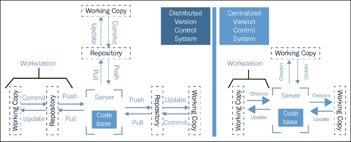

**集中版本控制系统**（**CVCS**）在服务器仓库上保持一份源代码的单一“中央”副本。在使用集中版本控制系统时，开发人员将代码从仓库下载到本地工作空间。一旦在本地对代码进行了修改，就会提交到中央副本。对仓库的其他操作（如分支、合并、暂存等）也发生在服务器上，并且需要连接到服务器。

TFVC 是一个集中版本控制系统。在使用 Visual Studio 或 Eclipse 与 TFVC 一起工作时，IDE 与服务器保持频繁的通信。没有与服务器的活动连接，大多数常见操作是无法执行的。

**分布式版本控制系统**（**DVCS**）不一定依赖中央服务器来存储项目文件的所有版本。相反，开发者“克隆”一个代码库副本，并在自己的硬盘上拥有项目的完整历史记录。这个副本（克隆）包含了代码库中的所有数据——包括所有分支和提交历史。

Git 是一个分布式版本控制系统。除了推送和拉取操作外，大多数操作都可以在没有与服务器的活动连接时执行。

TFS 是唯一同时支持集中式（TFVC）和分布式（Git）源代码管理系统的平台。以下表格可以帮助你决定在何种情况下集中式版本控制比分布式更合适。关于两者差异的更多详细信息，可以参考 [`msdn.microsoft.com/en-us/Library/vs/alm/code/overview`](https://msdn.microsoft.com/en-us/Library/vs/alm/code/overview)。

|   | 集中式版本控制 | 分布式版本控制 |
| --- | --- | --- |
| 检入/检出 | 编辑/提交 |
| --- | --- |
| 优势 |

+   支持非常大的代码库

+   精细级别的权限控制

+   允许使用监控

|

+   离线编辑支持

+   轻松编辑 Visual Studio 或 Eclipse 外的文件

|

+   完全离线体验

+   完整的代码库与可移植的历史记录

+   简化的分支模型

|

| 最适合 |
| --- |

+   大型集成代码库

+   对源代码的控制和审计可达文件级别

|

+   中型集成代码库

+   在减少摩擦的同时实现精细控制的平衡

|

+   模块化代码库

+   与开源集成

+   高度分布式的团队

|

在 TFS 2015 之前，源代码控制类型的选择需要在团队项目创建时做出。在 Update 1 中，引入了一个新功能，允许团队在 TFVC 团队项目中创建 Git 仓库。这对那些在 TFVC 项目中已有大量投资，但又希望尝试 Git 的团队来说非常有用。这个功能及其优势在 *在现有 TFVC 团队项目中创建 Git 仓库* 章节中有详细讨论。对于任何来自 TFVC 背景并希望学习 Git 的用户，Git for TFVC 是一本非常有用的指南 ([`bit.ly/1RgboRk`](http://bit.ly/1RgboRk))。

如今，市场和业务需求比以往任何时候都在发生变化。开发团队面临着更大的压力，需要更快地交付更高质量的软件。除非基础代码库的质量良好且有单元测试支持，否则这是不可持续的。一个好的源代码控制库可以显著提高软件质量，但仅仅拥有一个好的源代码库控制库是不够的，推动质量的因素远不止如此。

说到质量，缺乏代码审查、糟糕的 DevOps 实践、缺少单元测试、过多的战术实现，以及没有解决根本问题，都是技术债务的主要原因。技术债务不会在一夜之间爆发，它是一个缓慢而渐进的过程。与财务债务不同，技术债务非常难以察觉。技术债务会减慢你交付价值的能力。你是否注意到这些迹象？


本章的目标是向你介绍 Web Portal 和 Team Explorer 中的各种源代码管理操作，了解帮助将质量构建到代码中的功能，最后但同样重要的是，理解 TFS 仓库中可用的代码度量标准。在本章中，我们将使用 CodePlex 上提供的 Fabrikam Fiber 代码库([`fabrikam.codeplex.com`](https://fabrikam.codeplex.com))。按照以下步骤将代码设置到 FabrikamTFVC 和 FabrikamGit 团队项目中。

## 在 FabrikamTFVC 团队项目中设置 Fabrikam 解决方案

1.  打开 Visual Studio，在 Team Explorer 中连接到 FabrikamTFVC 项目。点击超链接以配置你的工作区。接受默认的名称和位置，然后点击**映射并获取**。操作完成时会显示成功通知：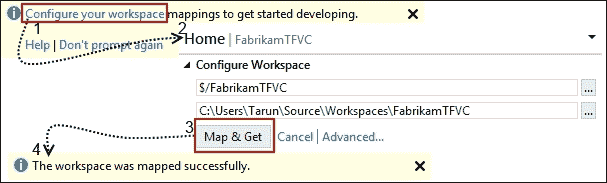

1.  打开工作区位置，在本例中是`C:\Users\Tarun\Source\Workspaces\FabrikamTFVC`。创建一个新的文件夹`Main`；在`Main`文件夹中，创建一个`Source`文件夹并复制从 CodePlex 下载的 Fabrikam 代码库内容：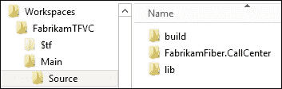

1.  打开 Visual Studio 中的源代码管理资源管理器，在菜单栏中选择**将项目添加到文件夹**图标。在**添加到源代码管理**窗口中，单击`Main`文件夹，然后点击**下一步**。接着，点击**排除的项目**，选择所有项目，然后点击**包括项目**图标。现在应该没有排除的项目了。点击**完成**，然后点击**FabrikamTFVC**项目并从上下文菜单中选择**提交待处理更改**：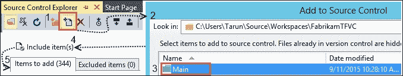

1.  在源代码管理资源管理器中，右键单击`Main`文件夹，并在上下文菜单中的分支和合并子菜单下选择**转换为分支...**：

1.  打开`FabrikamFiber.CallCenter.sln`文件，路径为`$/FabrikamTFVC/Main/Source/FabrikamFiber.CallCenter`。在解决方案资源管理器中右键单击**解决方案**，并从上下文菜单中选择**添加解决方案到源代码管理...**：

1.  接受警告并在 Team Explorer 的待处理页面上提交更改。Fabrikam 解决方案现在已成功设置到 FabrikamTFVC 团队项目的主分支中。

## 在 FabrikamGit 团队项目中设置 Fabrikam 解决方案

1.  打开 Visual Studio，在团队资源管理器中连接到 FabrikamTFVC 项目。点击超链接以克隆此仓库。接受默认名称和位置并开始克隆。操作完成后会显示成功通知：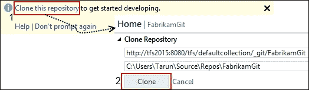

1.  打开本地工作目录，在此案例中为 `C:\Users\Tarun\Source\Repos\FabrikamGit`。创建一个新的文件夹 `src`，并将从 CodePlex 下载的 Fabrikam 代码库内容复制进去：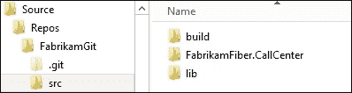

1.  在团队资源管理器中，导航到更改页面。从未跟踪的文件部分，点击**添加所有**超链接，将所有最近复制到工作文件夹中的文件添加进来。点击**提交**按钮，将这些更改提交到仓库：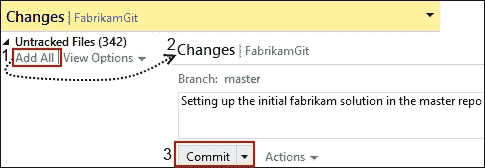

1.  当提交操作成功完成后，会提示同步更改。点击**同步**，然后在**外发提交（1）**部分点击**推送**，将更改推送到远程服务器：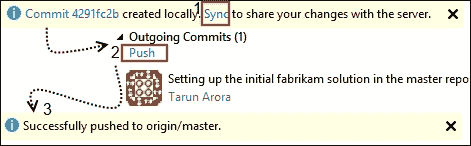

1.  在团队资源管理器中，导航到分支页面。**master** 分支以及 **remotes/origin** 分支都会显示出来：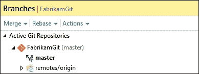

现在，Fabrikam 解决方案已成功设置在 FabrikamGit 团队项目的**主**分支中。

# 在现有的 TFVC 团队项目中创建 Git 仓库

传统上，只能使用 TFVC 作为源代码控制库。从 TFS 2013 开始，TFS 支持将 Git 作为源代码控制。Git 为分布式团队提供了许多好处，尤其是那些跨同一代码库协作的团队；你可以在这里阅读有关 Git 好处的更多信息：[`git-scm.com/about`](https://git-scm.com/about)。那些渴望尝试 Git，但由于迁移现有投资所需的重做工作而无法尝试的 TFVC 团队，现在有了解决方案。TFS 现在支持混合团队项目。在这个教程中，你将学习如何在现有的基于 TFVC 的团队项目中设置 Git 仓库。

## 准备就绪

在 Team Foundation Server 2015 更新 1 中，你需要是项目管理员组的成员才能将现有的 TFVC 或 Git 项目转换为混合项目，这种项目同时托管 TFVC 仓库和多个 Git 仓库。用户需要使用 Visual Studio 2015 更新 1 来处理混合项目。使用旧版本的 Visual Studio，包括 2015 RTM，用户将看到项目仍然是最初创建时的类型。

如果您的 TFVC 项目是在 TFS 2015 Update 1 之前创建的，项目管理员需要在创建第一个存储库后应用一些项目级别的权限。进入版本控制管理页面并选择树形结构中的 **Git 存储库** 节点。要设置与任何默认过程模板（敏捷、Scrum 和 CMMI）相同的组权限，请添加以下 TFS 组并授予以下权限：

+   [项目名称]\读者

    +   **- 允许**：读取

    +   **- 未设置**：其他所有人

+   [项目名称]\贡献者

    +   **- 允许**：分支创建、贡献、注释管理、读取和标签创建

    +   **- 未设置**：其他所有人

+   [项目名称]\构建管理员

    +   **- 允许**：分支创建、贡献、注释管理、读取和标签创建

    +   **- 未设置**：其他所有人

同样地，当在 TFS 2015 Update 1 之前创建的 Git 团队项目中创建 TFVC 存储库时，需要修改以下文件夹级别的权限。

进入版本控制管理页面并选择树形结构中的 `$/_ 项目名称 _` 节点。要设置与任何默认过程模板（敏捷、Scrum 和 CMMI）相同的组权限，请添加以下 TFS 组并授予以下权限：

+   [项目名称]\读者

    +   **- 允许**：读取

    +   **- 未设置**：其他所有人

+   [项目名称]\贡献者

    +   **- 允许**：签入、签出、标签、锁定、合并和读取

    +   **- 未设置**：其他所有人

+   [项目名称]\构建管理员

    +   **- 允许**：签入、签出、标签、锁定、合并和读取

    +   **- 未设置**：其他所有人

如果您的团队项目是在 TFS 2015 Update 1 后创建的，那么这些权限已经为您应用，无需其他操作，只需创建存储库。

## 如何操作...

1.  通过浏览 `http://TFS2015:8080/DefaultCollection/FabrikamTFVC/_versionControl`，进入 FabrikamTFVC Web 门户的代码中心。

1.  如下图所示，点击 **FabrikamTFVC** 以展开 **选项** 菜单。要创建新的 Git 存储库，请从 **选项** 菜单中点击 **新建存储库...**。命名存储库为 `FabrikamFeature1` 并点击 **创建**：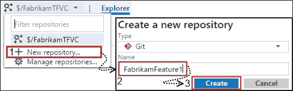

    ### 注意

    请注意，同一个团队项目内不支持创建多个 TFVC 存储库，但支持创建多个 Git 存储库。

1.  创建操作将把您重定向到 Git 入门页面。该页面允许您生成存储库的克隆和命令行凭据，创建一个 README 文件以描述您的存储库，并提供设置 Git 存储库以便与 Xcode、Eclipse 和 Visual Studio 配合使用的命令。点击 **在 Visual Studio 中克隆** 以开始在 Visual Studio 中工作：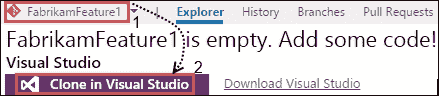

1.  由于此操作，存储库已在 Visual Studio 中克隆：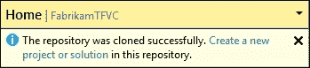

## 它是如何工作的...

许多客户积极使用 TFVC 仓库，并且在他们的团队项目中有丰富的工作项历史记录和自定义。为了方便这些团队开始使用 Git，TFS 中的团队项目模型已被修改以支持多个源代码控制仓库。混合项目允许在 TFVC 项目中创建任意数量的 Git 仓库。该模型现在还支持在 Git 项目中创建 TFVC 仓库。

Team Explorer 在 TFS 更新 1 中进行了增强，以支持操作混合团队项目。正如以下图所示，Team Explorer 中的连接管理页面列出了团队项目中的所有源代码控制仓库。Team Explorer 中的工作流会根据你连接的仓库类型进行调整。

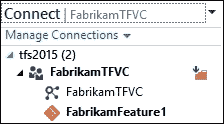

Web 门户还允许在代码中心之间切换 TFVC 和 Git 源代码控制。与源代码控制相关的工作流会根据选择进行显示。例如，选择 Git 后，你可以看到拉取请求（Pull requests）选项，而在 TFVC 的上下文中，你会看到 shelvesets 选项。

## 还有更多...

最近的关于 Team Foundation Server 和 Visual Studio Online 中 Git 体验的投资路线图提到了对 Team Explorer 中拉取请求（Pull requests）的支持，以及对 Git 大文件存储（Git Large File Storage）和 GitFlow 的支持；你可以在 [`bit.ly/1RXQRS1`](http://bit.ly/1RXQRS1) 了解更多信息。

# 启用代码分析检入策略

许多组织建议在将代码提交到源代码控制之前进行某些检查。修复坏代码的成本会随着时间的推移增加。在代码问题早期发现并修复的过程中有激励措施。我们在上一章讨论了完成的定义；可以将其视为检入的定义。在 TFS 中，检入策略是在检入操作期间执行的规则，用以确保所选的变更集可以提交。检入策略存储在服务器上，并在检入时在客户端机器上执行。检入策略仅在 TFVC 项目中受支持。虽然 TFS 有一些预配置的检入策略，但 TFS Power Tools 添加了几个其他的检入策略。在本章节中，你将学习如何配置代码分析检入策略。代码分析检入策略要求在检入之前运行代码分析。

## 准备工作

要完成本章节，你需要：

+   一个名为 FabrikamTFVC 的 TFVC 团队项目。有关如何创建 TFVC 团队项目的说明，请参考 第一章中的 *使用 Scrum 模板创建团队项目* 章节，*团队项目设置*。

+   为了配置检入策略，你需要将编辑项目级别信息的权限设置为**允许**。添加自己。如果你是项目管理员或项目集管理员组的成员，你将已经拥有此权限。

    ### 注意

    使用 Team Explorer everywhere 定义的提交策略仅在使用 Eclipse 的 Team Foundation Server 插件或 Team Foundation Server 的跨平台命令行客户端提交时适用。如果使用其他客户端，如 Team Portal 或 Visual Studio 中的 Team Explorer，这些策略将不适用。同样，使用 Team Portal 或 Visual Studio 中的 Team Explorer 定义的策略在使用 Eclipse 的 Team Foundation Server 插件或 Team Foundation Server 的跨平台命令行客户端提交时不会应用。

## 如何操作...

1.  在 Visual Studio 中，打开 Team Explorer 并点击**设置**。导航到**设置**视图后，点击**源代码管理**超链接。在**源代码管理设置**窗口中，选择**提交策略**标签页。点击**添加**按钮，选择**代码分析**，然后点击**确定**。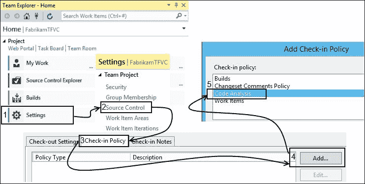

1.  在**代码分析策略编辑器**窗口中，从规则集下拉框中选择**Microsoft 推荐的托管规则**，然后点击**确定**：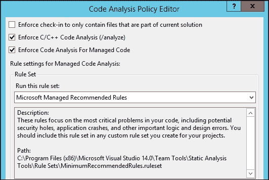

1.  选中**强制提交仅包含当前解决方案中的文件**。此选项允许你阻止提交任何不属于当前解决方案的文件。启用此选项是一个不错的选择，因为开发人员可能会不小心将文件提交到源代码管理中，而没有将该文件与解决方案关联。这可能会导致构建问题。

    ### 注意

    代码分析规则集的定义存储在`C:\Program Files (x86)\Microsoft Visual Studio 14.0\Team Tools\Static Analysis Tools\Rule Sets`文件夹中。

1.  从 FarbikamTFVC 项目中，打开`FabrikamFiber.CallCenter.sln`：

1.  在**FabrikamFiber.Web**的`Controllers`中，打开`HomeController.cs`：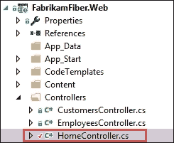

1.  将以下代码复制到`HomeController.cs`中的`Index()`函数：

    ```
    try
    {}
    catch(Exception ex)
    {}

    ```

1.  从 Team Explorer 中，导航到待处理更改窗口，并将代码更改提交到 TFS。由于没有运行静态代码分析，系统发出了策略警告：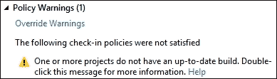

1.  双击警告信息查看详细信息：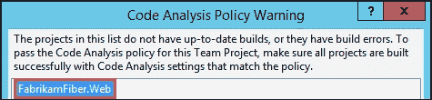

1.  在 Visual Studio 的**分析**菜单中选择**在解决方案上运行代码分析**来触发代码分析：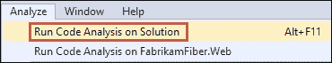

1.  代码分析发现了新添加代码中的问题。如果没有运行代码分析，开发人员可能会错过这个问题。代码分析策略确保在代码提交之前运行代码分析：

1.  由于现在已经运行了代码分析，提交代码时将不会发出提交策略违规的警告信息。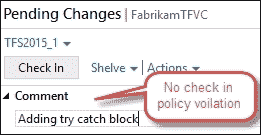

## 如何操作...

提交策略用于强制执行强制的软件开发实践。策略在提交过程中执行。由于 TFVC 提交在服务器上处理，提交请求会被拦截，以强制在客户端执行提交策略。如果用户试图进行违反策略的提交，提交将被阻止。

可以指定四种 Team Project 提交策略（要使用提交策略，必须连接到 Team Foundation Server）：

+   **构建**：这要求在新提交之前，必须修复在构建过程中出现的任何破坏性构建问题。

+   **代码分析**：这要求在提交代码之前，必须运行代码分析。

+   **测试策略**：这要求在提交代码之前，必须完成测试。

+   **工作项**：这要求在提交代码时，必须关联一个或多个工作项。

提交策略可以通过点击**覆盖警告**超链接来覆盖；在提供覆盖理由后，你可以继续提交代码：

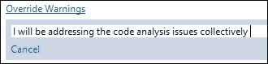

### 注

你可以通过在 Team Explorer 中使用不覆盖策略的服务器端插件来关闭策略覆盖选项。更多细节请阅读以下博客文章 [`bit.ly/1jUhZ9y`](http://bit.ly/1jUhZ9y)。

## 还有更多...

到目前为止，我们讨论了 TFVC 项目的提交策略。通过 TFS API，可以为 Git 项目创建自定义提交策略。服务器端插件会监听 Git 推送事件时触发的`PushNotification`。关于如何为 Git 仓库创建服务器端提交策略，以验证提交信息是否与推送关联，请参考 [`bit.ly/1OabagX`](http://bit.ly/1OabagX)。

# 在 TFVC 中执行无基础的兄弟分支合并

当多个团队共同向同一个仓库贡献代码时，管理源代码可能会变得具有挑战性。你是否已经熟悉 TFS 中可用的分支和合并工具？如果没有，我建议你阅读 ALM Rangers 版本控制指南 [`bit.ly/1He8pmL`](http://bit.ly/1He8pmL)。该指南详细讲解了各种分支策略及其优缺点。

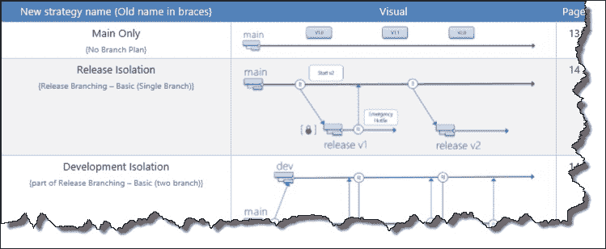

来自 ALM Rangers 版本控制指南的摘录，展示了不同的分支策略

随着时间推移，TFVC 中的分支管理可能会变得复杂；而 Git 中的分支则轻量且路径独立。在 Git 中，许多开发人员为他们正在编码的每个新特性创建一个分支，有时是按日创建。Git 允许你快速切换不同的分支，在代码库的不同变体之间进行切换。在使用 Git 时，你可以创建仅存在于你的开发机器上的分支，并在你准备好时与他人共享。考虑根据工作流评估你的源代码控制需求，访问 [`bit.ly/1P7UMvO`](http://bit.ly/1P7UMvO)；你可能会发现 Git 更适合你的需求。

在本示例中，你将学习如何在两个无关的 TFVC 分支之间执行合并操作，这些分支通常被称为兄弟分支。

## 准备工作

在你的 TFVC 基础团队项目中，创建如下图所示的分支结构。你可以使用 TFS Community Branch Tool 扩展来自动化创建分支，如下图所示 ([`bit.ly/1LZR2bx`](http://bit.ly/1LZR2bx))：

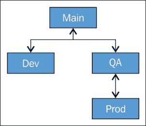

在这个示例中，我们将处理以下场景。正在开发 **Dev** 分支的开发人员发现了一个关键问题，并通过代码提交解决了该问题。QA 分支已经被另一位开发人员用于进行一些无关的工作。为了将 **Dev** 分支的修复发布到生产环境，开发人员决定在 **Dev** 和 **Prod** 分支之间执行无基础的合并。

要执行合并操作，你的用户帐户需要具备合并权限。项目管理员组已授予此权限；但是，该权限也可以直接在单个用户和组上设置为允许：

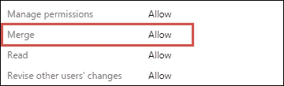

## 如何操作…

1.  在 Visual Studio 中，打开团队资源管理器并导航到源代码控制资源管理器。对 FabrikamTFVC 团队项目执行 **获取最新版本** 操作：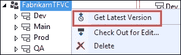

1.  为了模拟在 **Dev** 分支上进行修复，打开 `$\Dev\FabrikamFiber.CallCenter\FabrikamFiber.Web\Controllers\HomeController.cs` 文件，并将以下注释放入 `Index` 方法中：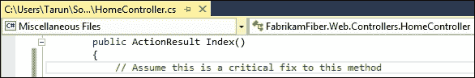

    在团队资源管理器的待提交更改视图中提交对该文件的代码更改：

    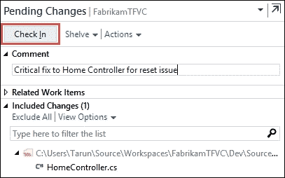

1.  现在关键更改已经在 Dev 分支中，我们来看看将此更改从 Dev 分支无基础合并到 Prod 分支所需的步骤。在源代码控制资源管理器中，右键单击 **Dev** 分支，然后在 **分支和合并** 子菜单下选择 **合并...**：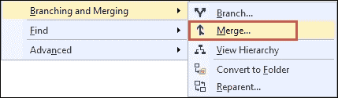

1.  **合并** 向导中不会显示 **Prod** 分支在 **目标分支** 下拉菜单中。无关的分支只能通过 **浏览...** 按钮选择。点击 **浏览...** 并选择 **Prod** 分支，然后点击 **确定**：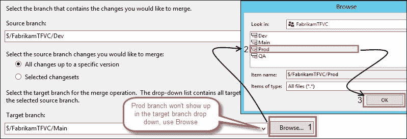

1.  在**目标分支**旁边会出现一个警告标志，表示所选分支无关且会导致无基合并：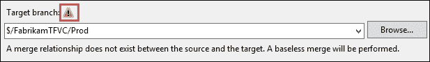

1.  点击**下一步**进入下一屏幕：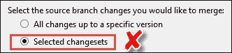

    ### 注意

    如果选择从**所有更改**更改为**选择的更改集**，则两个分支之间并未建立合并关系。尽管您仍然可以合并更改，但无法可视化该合并。

1.  保持下拉框中的**最新版本**选项，并点击**下一步**：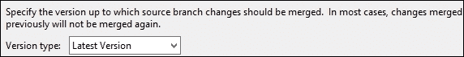

1.  合并操作完成后，您将被导航到**解决冲突**窗口。点击**在合并工具中合并更改**，然后检查并点击**接受合并**：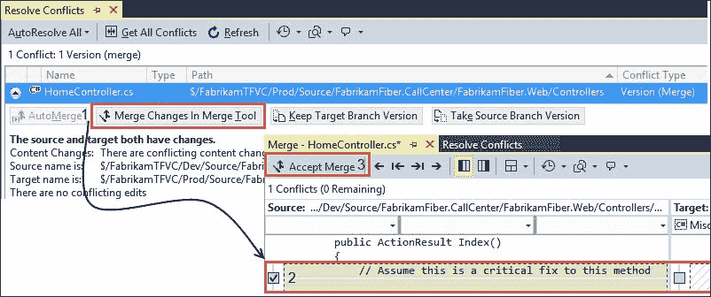

1.  在合并完成后，**解决冲突**窗口将清除所有冲突。在 Team Explorer 中查看待处理更改，检查待处理更改并提交：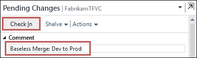

1.  在源代码管理资源管理器中，右键点击**Prod**分支，选择**查看历史记录**。检查所有分支并点击**可视化**。从 Dev 到 Prod 的虚线表示无基合并。

## 它是如何工作的……

当进行无基合并时，将在两个兄弟分支之间建立关系。无基合并用虚线表示：

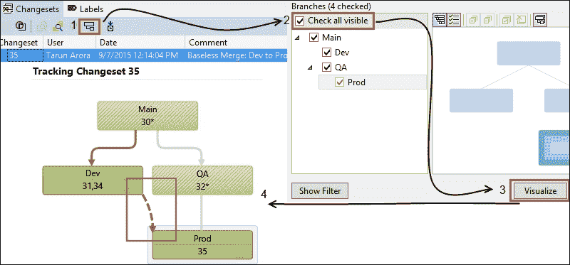

要查看更改的时间线，点击屏幕顶部的**时间线跟踪**视图：

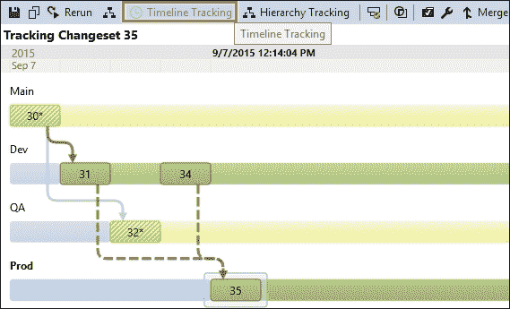

# 在 TFVC 中重新设置分支的父节点

Team Foundation 版本控制提供了一个选项，可以将分支从给定层级中的某个位置修剪出来，并在同一层级的其他位置重新附加。如果您在设置分支结构时出现了问题，或者在扩展过程中原有结构停止工作，可以考虑使用这种方法。在本教程中，您将学习如何在 TFVC 中重新设置分支的父节点。

### 注意

重新设置父分支的移动是逻辑上的而非物理上的，可以在不停止开发人员工作的情况下完成。然而，建议让开发人员将更改暂存。您还应尽力使新父分支的内容与旧父分支尽可能接近，以避免合并冲突。

## 准备工作

要重新设置分支的父节点，您的用户帐户需要具有**管理分支**权限。项目管理员组和项目集合管理员组已授予此权限；不过，您也可以直接在单个用户和组上设置此权限：

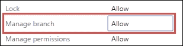

**管理分支**权限允许您执行以下操作：

+   将文件夹转换为分支

+   执行以下操作

    +   编辑分支属性

    +   重新设置分支父节点

    +   将分支转换为文件夹

在您的 TFVC 项目中，创建一个分支结构，如左图所示：

| 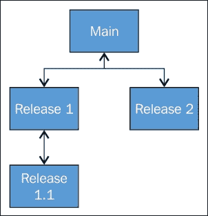

当前的分支结构

| 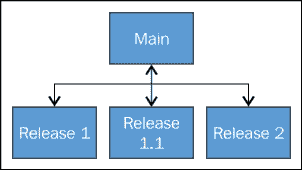

所需的分支结构

|

本教程中我们将处理的场景，如左侧图示所示，是开发团队从**Main**分支发布；**Release 1.1**是从**Release 1**分支出来的。如右侧图示所示，团队希望将**Release 1.1**直接移到**Main**分支下，这样更改就不需要通过**Release 1**进行合并到**Release 1.1**。

要将**Release 1.1**分支从**Release 1**重新设置为**Main**，需要在这两个分支之间建立关系。这只能通过对两个分支执行无基础合并来完成。请参阅*在 TFVC 中对兄弟分支执行无基础合并*教程，了解如何执行无基础合并。

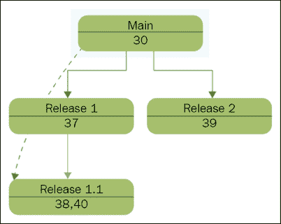

本教程假设**Main**分支与**Release 1.1**分支之间已建立合并关系。在前面的图中，虚线表示这两个分支之间的关系。

## 如何操作…

1.  导航到源代码控制资源管理器，右键点击**Release 1.1**分支，然后从**分支和合并**子菜单中选择**重新设置父分支...**：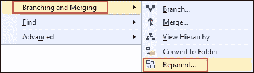

1.  在**重新设置父分支**窗口中，你将看到与**Release 1.1**有直接或间接关系的所有分支的列表。选择**Main**，然后点击**重新设置父分支**。选择**无父分支**将使**Release 1.1**成为一个独立的分支：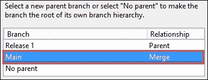

1.  重新设置父分支操作发生在服务器上。你不会看到重新设置父分支操作带来的任何待处理更改。重新设置父分支操作后的分支层次结构如下：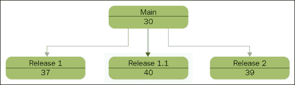

## 它是如何工作的…

一旦重新设置父分支操作完成，你可以通过右键点击**Release1.1**分支，并选择**属性**，从**高级**子菜单中查看更新后的分支层次结构：

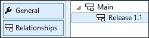

从左侧菜单点击**关系**选项卡，以查看分支关系。

# 解锁其他人签出的文件

在分布式团队中，开发人员经常有待处理的更改，这些更改会与共享的代码文件发生冲突。你是不是讨厌当某个开发人员请假时，文件仅被他们自己签出，或者某个开发人员离开组织时，文件仍然被签出？当文件被独占锁定时，必须移除锁定才能对文件进行提交。在本教程中，你将学习如何解锁其他用户签出的文件。

## 准备就绪

要撤销其他用户工作区中的待处理更改，你必须具有**管理工作区**权限，并将其设置为**允许**：

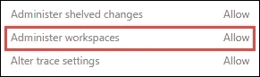

## 如何操作...

1.  开发者 *A* 在 FabrikamTFVC 项目中以提交锁定类型检出了 `$/FabrikamTFVC/Main/Source/FabrikamFiber.CallCenter/FabrikamFiber.Web/Web.config` 文件。因此，尽管其他用户可以检出 `Web.config` 文件，但在开发者 *A* 解除此锁之前，任何人都无法提交该文件：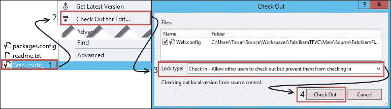

    在下图中，`Web.config` 被选中并且具有提交锁。此状态在 **待处理更改** 列中显示为 **锁定**：

    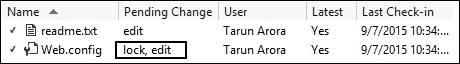

1.  现在，开发者 *B* 检出 `Web.config` 并向配置文件中添加一个新部分。为了提交更改到版本控制，开发者 *B* 尝试提交该文件。提交失败，显示以下消息。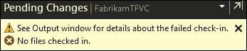

    ### 注意

    在提交过程中遇到了以下问题：

    `无法对 $/Fabrikam/Main/…/Web.config 执行操作。项目 $/Fabrikam/Main/ …/Web.config 在工作区 TFS2015;DeveloperA 中被锁定。`

1.  开发者 *B* 打开 "Visual Studio 2015 开发者命令提示符" 并运行以下命令以撤销开发者 *A* 的更改：

    ```
    tf undo /workspace:TFS2015;"Developer A" /recursive $/FabrikamTFVC/Main/Source/FabrikamFiber.CallCenter/FabrikamFiber.Web/Web.config" /collection:"http://tfs2015:8080/tfs"

    ```

    当提示是否确认撤销时，输入 *Y*。你也可以在上述命令中使用 `/silent` 开关来跳过提示：

    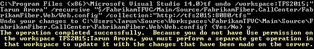

    开发者 *B* 现在可以通过 Visual Studio 的待处理更改窗口成功提交文件。

    ### 注意

    虽然开发者 *A* 对 `app.config` 的锁已被移除，但开发者 *A* 在其机器上的配置文件中可能仍有待处理的更改。因此，开发者 *A* 可以执行 `get` 操作以获取开发者 *B* 的更改，并根据需要合并并继续操作，而不会丢失任何信息。

## 还有更多内容...

TFS Power Tools 提供了一个选项，可以在 Visual Studio 内直接撤销其他用户的待处理更改。如果你没有安装 TFS Power Tools，请参考第一章中的*通过命令行创建新的团队项目*一节，了解更多内容，*团队项目设置*。

右键单击你想要撤销的文件或文件夹。在上下文菜单中，选择 **查找状态...**，位于 **源代码管理** 子菜单下的 **查找** 中。你可以通过指定通配符和用户名来缩小搜索范围。搜索结果会显示在 **源代码管理** 窗口中的 **查找** 视图：

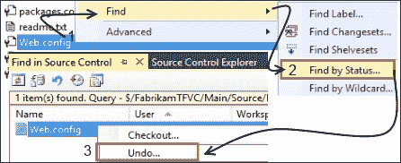

只需选择文件，并在上下文菜单中选择 **撤销...** 来撤销待处理的更改。

# 将一个分支中的 shelveset 还原到另一个分支

在使用 TFVC 时，你会发现 shelvesets 非常有用。Shelvesets 允许你将本地的更改备份到服务器上。开发者几乎总是在进行多任务操作；你可能会在一个分支上开始编码某个更改，然后意识到该更改实际上需要应用到另一个分支。在本配方中，你将学习如何在一个代码分支中暂存更改，然后将这些更改迁移到另一个分支，而无需将更改提交到源代码管理。

## 准备工作

FabrikamTFVC 项目有三个分支，**Dev**、**Main** 和 **Prod**，如下面的图所示。在本配方中，我们将从 **Dev** 分支中的待处理更改创建一个名为 `shelvesetDev1` 的 shelveset，并将待处理更改迁移到 **Prod** 分支，而无需将待处理更改提交：


本配方需要使用 `tfpt` 命令行工具。此工具随 TFS Power Tools 一同安装。如果你没有安装 TFS Power Tools，请参考第一章中关于*通过命令行创建新的团队项目*的配方，*团队项目设置*。

在 **Dev** 和 **Prod** 分支上执行 `get latest` 操作，确保它们是最新的。确保 **Prod** 分支中没有待处理的更改。如果分支不是最新的，在执行 unshelve 操作时可能会出现以下错误消息：`无法确定工作区`。

## 如何操作...

1.  在 Team Explorer 中，打开源代码管理资源管理器并签出 `$\Dev\FabrikamFiber.CallCenter\FabrikamFiber.Web\Controllers\HomeController.cs` 文件，然后复制 `Index` 方法中的以下注释：

    // 假设这是对该方法的关键修复：

    

1.  在 Team Explorer 中，导航到 **Pending Changes** 视图并点击 **Shelve** 超链接。输入 shelveset 名称 `shelvesetDev1`，然后点击 **Shelve** 按钮：

1.  打开 Visual Studio 开发者命令提示符，并将工作目录更改为目标分支的工作区目录。在此示例中，目标分支为 `Prod`：

1.  运行以下命令将 shelveset 从 **Dev** 分支迁移到 **Prod** 分支：

    ```
    tfpt unshelve /migrate /source:"$/FabrikamTFVC/Dev" /target:"$/FabrikamTFVC/Prod" "shelvesetDev1"

    ```

1.  在 **Shelveset Details** 窗口中，点击 **Unshelve** 按钮以继续：

1.  如果 TFS 认为它能够解决合并冲突，合并按钮将启用。如果 TFS 需要手动解决冲突，则 **Resolve** 按钮将启用。点击 **Auto-merge All** 按钮以继续：

1.  一旦自动合并操作完成，命令提示符中将发布确认消息：

1.  在源代码管理资源管理器中，导航到 **Prod** 分支。从 `$\Prod\FabrikamFiber.CallCenter\FabrikamFiber.Web\Controllers` 打开 `HomeController.cs`。在 **Dev** 版本中的 `HomeController.cs` 文件所做的更改将反映到 **Prod** 分支中的 `HomeController.cs` 文件：

# 使用 `.tfignore` 和 `.gitignore` 忽略提交文件类型

传统上，TFS 仅支持服务器工作区。局部工作区在 TFS 2012 中推出。局部工作区允许你在不连接服务器的情况下进行工作。所有核心版本控制操作都可以在没有服务器连接的情况下执行。局部工作区监听文件系统上的变化，从而推断正在执行的操作。例如，在文件系统中直接创建的新文件会显示为待提交更改。使用过 Subversion 源代码控制的用户会对局部工作区有所了解。你可以在 [`msdn.microsoft.com/en-us/library/bb892960.aspx`](https://msdn.microsoft.com/en-us/library/bb892960.aspx) 阅读有关局部工作区工作原理的更多信息。

许多与 Visual Studio 协同工作的工具和扩展会在本地工作区目录中生成临时文件。例如，ReSharper，一个用于 Visual Studio 的开发者生产力扩展，生成 `_Resharper.[SolutionName]` 文件，这些文件（默认情况下）会包含在待提交更改中。这些临时文件对版本控制没有任何帮助，应当被忽略；`.tfignore` 和 `.gitignore` 允许你做到这一点。可以在 `.tfignore` 和 `.gitignore` 中指定要忽略的文件类型；这些规则用于自动排除指定的文件类型不包含在待提交更改中。在本教程中，你将学习如何创建 `.tfignore` 和 `.gitignore` 文件，以自动排除某些文件类型。

## 准备就绪

为了按照本教程操作，你需要创建一个本地工作区。按照以下指示在 FabrikamTFVC 项目中创建本地工作区：

1.  在本地磁盘中创建一个文件夹 `Wks`。本教程假设该文件夹为 `C:\Wks`。

1.  打开 Visual Studio 中的 Team Explorer 并连接到 FabrikamTFVC 团队项目。

1.  从 Visual Studio 菜单中，导航至 **文件** | **源代码控制** | **高级** | **工作区**：

1.  在 **管理工作区** 窗口中，点击 **添加**。在 **添加工作区** 中，创建一个名为 `TFS2015_99` 的工作区，从 `$/FabrikamTFVC/Main` 映射到 `C:\Wks`。点击 **高级>>** 按钮，确认工作区位置是否设置为 **本地**。然后，点击 **确定**：

1.  点击 **确定** 后，接受提示执行最新获取操作，将源代码下载到新的本地工作区。

## 如何操作...

执行以下步骤来设置基于 TFVC 的源代码控制的 `.tfignore` 文件：

1.  打开 `C:\Wks` 并创建一个新文件 `ThisIsAFakeClass.txt`。

1.  在 Team Explorer 中，导航至 FabrikamTFVC 项目的 **待处理更改** 视图。在 **排除的更改** 部分，检测到的数量显示为 1。

1.  点击 **检测到的项目** 超链接。在 **提升候选更改** 窗口中，右键点击 `ThisIsAFakeFile.txt` 并选择 **按扩展名忽略 (*.txt)**：

    `.tfignore` 文件会自动为你创建，并出现在 **待处理更改** 视图中。打开 `.tfignore` 文件；扩展名 `*.txt` 已被添加为需要忽略的项目。将以下内容复制到 `.tfignore` 文件中，以忽略所有 ReSharper 生成的文件：

    ```
    ######################################
    *.txt
    # Ignore Reshaprer files
    *_ReSharper.*
    *.DotSettings
    ```

1.  将 `.tfignore` 文件提交到版本控制中；此规则集将在所有开发者工作站上评估，以忽略该 `.tfignore` 文件中指定的所有文件。

    ### 注意

    +   TFVC 支持多个 `.tfignore` 文件，其中项目范围内的 `.tfignore` 文件可以覆盖解决方案级别的 `.tfignore` 文件中的忽略规范。

    +   TFVC 接受排除规则，例如，要忽略所有 TXT 文件，除了 `help.txt`，可以使用 `!help.txt`。

执行以下步骤为基于 Git 的源代码管理设置 `.gitignore` 文件：

1.  在 Team Explorer 中，打开 FabrikamGit 项目并导航至 **设置** 视图。点击 **仓库设置** 超链接。然后，点击 **添加** 来创建一个 `.gitIgnore` 文件：

1.  点击 **编辑** 超链接以编辑 `.gitignore` 文件。将以下内容复制到 `.gitIgnore` 文件中：

    ```
    # User-specific files
    *.suo
    *.user
    *.sln.docstates
    # Specific files 
    *.txt
    # Build results
    [Dd]ebug/
    [Rr]elease/
    ```

1.  在 Team Explorer 中，导航至 **更改** 视图并提交 `.gitIgnore` 文件。点击 **同步** 超链接，将更新后的 `.gitIgnore` 推送到仓库。现在，所有开发者工作区将忽略该 `.gitignore` 文件中指定的文件扩展名。

### 注意

Git 支持多个 `.gitIgnore` 文件，其中项目范围内的 `.gitIgnore` 文件可以覆盖解决方案级别的忽略规范文件。

## 还有更多……

`tfpt` 命令行工具是与 TFS Power Tools 一起安装的，其中提供了两个非常有用的开关：`scortch` 和 `treeclean`。`scortch` 和 `treeclean` 允许你将工作区镜像到服务器状态，并移除工作区中的任何不需要的杂乱文件。了解更多关于 `scortch` 和 `treeclean` 的信息，请访问 [`adamprescott.net/2011/09/12/clean-tfs-workspaces-with-scorch-treeclean`](http://adamprescott.net/2011/09/12/clean-tfs-workspaces-with-scorch-treeclean)。

# 在 TFS 中进行代码审查

在本章的介绍中，我们简要讨论了技术债务以及它如何影响团队的生产力。使用良好的工程实践有助于解决可能导致技术债务的问题。业界普遍认同，代码审查是一种有效且实用的方法，可以在软件开发生命周期的早期发现代码不一致和潜在缺陷。

Forrester Consulting 进行的一项关于代码审查的价值和重要性的研究突出了以下被认为是代码审查好处的内容：


来源 - [`www.klocwork.com/getattachment/08c47c41-053c-4fe8-bbf7-91b95734747c/The-Value-and-Importance-of-Code-Review-Forrester?sitename=Klocwork`](http://www.klocwork.com/getattachment/08c47c41-053c-4fe8-bbf7-91b95734747c/The-Value-and-Importance-of-Code-Review-Forrester?sitename=Klocwork)

TFS 提供两种代码审查解决方案，一种通过 Team Explorer，另一种通过 Team Web Access。Team Explorer 中的代码审查解决方案首次在 TFS 2012 中引入，但因不支持迭代审查而受到批评。另一方面，Team Web Access 中的轻量级代码评论解决方案支持迭代审查，但不支持集成的 Visual Studio IDE 体验。你可以在[`www.visualstudio.com/en-us/get-started/code/get-code-reviewed-vs`](https://www.visualstudio.com/en-us/get-started/code/get-code-reviewed-vs)了解有关 Team Explorer 中可用代码审查解决方案的更多信息。在本教程中，你将学习如何在 Team Web Access 中使用轻量级代码评论进行代码审查。

## 准备就绪

在本教程中，我们将处理以下场景——Aaron 是 FabrikamTFVC 团队的开发人员。他正在`FabrikamFiber.CallCenter.sln`开发代码库中为服务票务仪表板显示 `CreatedBy` 列的一个新功能。Aaron 已经提交了他的更改（这创建了**变更集 27**），现在他希望 Tarun 对这些更改进行代码审查。Aaron 通过点击 Team Web Access 中的共享变更集图标将变更集发送给 Tarun：


通过点击变更集视图中的电子邮件图标发起代码审查

### 提示

**下载示例代码**

你可以从你的账户中下载示例代码文件，访问[`www.packtpub.com`](http://www.packtpub.com)，下载你所购买的所有 Packt 出版书籍的代码文件。如果你在其他地方购买了本书，可以访问[`www.packtpub.com/support`](http://www.packtpub.com/support)并注册，文件将直接通过电子邮件发送给你。

## 如何操作…

1.  Tarun 收到一个反馈请求的电子邮件。点击超链接**变更集 27**会在审查模式下打开变更集，突出显示比较模式中的代码更改。也可以通过点击文件名超链接，在并排比较模式中查看更改：

    通过点击变更集超链接，启动代码比较窗口，在此情况下为变更集 27

1.  浏览`Index.cshtml`时，Tarun 发现了几个问题。他选择了有问题的代码并添加了内联评论：

1.  Tarun 使用变更集顶部的**添加评论**按钮对变更集进行总体评论：

1.  Tarun 通过点击**Sharechangeset**按钮提交反馈。电子邮件中包含所有评论的列表。

1.  Aaron 逐一修复了 Tarun 指出的问题。Aaron 认为 Tarun 关于分页和过滤器的评论应该作为一个通用功能来构建。Aaron 从代码评论中创建了一个产品待办事项，并将其添加到团队的待办事项列表中：

## 如何运作…

轻量级代码评论是 Team Web Access 中的基于浏览器的代码评论解决方案。它为对整个文件或单个更改进行评论提供了良好的内联体验。代码评论使关于代码的互动或延时对话成为可能。代码评论是在浏览器中完成的，因此，除了其他功能外，它可以在任何地方工作——包括在您的手机上。

评论存储在 Team Foundation Server 中，与代码相关。如果代码或相关的代码文件被删除，关联的代码评论将自动删除。从评论中创建的工作项包括回到评论的引用；这有助于保持可追溯性：


## 还有更多…

尽管大家一致认为代码审查很重要，但业内对代码审查应该在提交前还是提交后进行意见分歧。请参考以下博客文章，讨论这两种方法的优缺点：

[`geekswithblogs.net/TarunArora/archive/2012/09/18/vs-2012-code-review-ndash-before-check-in-or-after.aspx`](http://geekswithblogs.net/TarunArora/archive/2012/09/18/vs-2012-code-review-ndash-before-check-in-or-after.aspx)

# 在 Git 中设置分支策略

在代码质量主题的基础上，如何帮助防止技术债务，分支策略是 TFS 中的一项新功能，它有助于提高进入 Git 仓库的代码质量。在本食谱中，您将学习如何在主分支上配置代码审查和门禁提交策略。

## 准备就绪

要在分支上配置分支策略，用户需要对该分支具有管理员权限。要为整个仓库应用分支策略，用户需要对仓库具有管理员权限。


为 FabrikamGit 团队创建一个持续集成构建；请参阅第四章中的《创建持续集成构建定义》食谱，*构建您的应用程序*。

场景：FabrikamGit 团队希望通过只允许通过 Fabrikam CI 构建并且已被团队中至少两个人进行代码审查的提交来保护主分支。如果正在更改的代码属于`/src/FabrikamFiber.CallCenter/FabrikamFiber.Web`区域，则必须由 Brian Miller 进行审查。

## 如何做…

1.  打开 FabrikamGit 团队管理页面 `http://tfs2015:8080/tfs/DefaultCollection/FabrikamGit/FabrikamGit%20Team/_admin/`。进入**版本控制**标签并选择**主**分支。要访问分支策略，点击**分支策略**标签：

1.  分支策略页面允许你配置限制性提交和代码审查的策略。

1.  在**自动构建拉取请求**部分，勾选两个选项并从下拉菜单中选择**FabrikamGit CI**构建定义：

1.  在**代码审查要求**部分，勾选要求代码审查，并将最小审阅者人数设置为`2`：

1.  点击**添加新路径**超链接。添加路径 `/src/FabrikamFiber.CallCenter/FabrikamFiber.Web/*` 和审阅者 `Brian Miller`：

1.  点击**保存更改**按钮以保存并应用限制性提交和代码审查策略。

## 工作原理...

分支策略会在提交时在服务器上进行评估。启用主分支的分支策略后，不能直接将代码提交到主分支。直接将代码提交到主分支时，会出现以下错误消息。

推送时报告了以下错误：

```
refs/heads/master, TF402455: Pushes to this branch are not permitted; you must use pull requests to commit changes.

```

## 还有更多...

有时可能会有绕过策略的正当理由。TFS 提供了这一功能。通过将**免除策略执行**权限设置为**允许**，用户或组可以绕过策略：


此权限可以作用于整个项目、一个仓库或一个单独的分支。如果你被授予免除策略执行的权限，你将不会收到警告，也不会被阻止直接推送或合并到分支。因此，正如人们常说的那样……拥有巨大权力的同时，也需要承担相应的责任。

# 在 TFS 中进行拉取请求

在本章前面，你已经学习了如何限制未经审查的代码进入主分支。拉取请求是将代码从主题分支（也称为功能分支）推送到主分支的方式。拉取请求使得在主题分支工作的开发人员能够在提交代码到主分支之前，获取其他开发人员对其更改的反馈。在本篇中，你将学习如何进行拉取请求，以接受来自主题分支的更改到主分支。

## 准备就绪

我们将在这个示例中演示的场景是：Brian 是 FabrikamGit 团队的开发人员。他正在开发一个功能，在服务仪表板上添加一个名为 `problem type` 的下拉菜单。Brian 创建了一个包含问题类型列表的枚举，并希望获得对此列表的反馈，并将他的更改合并到主分支。

1.  打开 Visual Studio 并将其连接到 FabrikamGit 团队项目。从 Team Explorer 中心，点击**分支**。在**分支**视图中，右键点击**master**并在上下文菜单中选择**从…新建本地分支**。输入新分支的名称为`Brian/Feature1`，然后点击**创建分支**按钮：

1.  从主题分支中，打开`FabrikamFiber.CallCenter.sln`。在**FabrikamFiber.Web**项目中，添加一个新文件夹并命名为`Common`。添加一个新类并命名为`ProblemTypeEnum.cs`。编辑该类并创建一个枚举，如截图所示：

1.  从 Team Explorer 中，导航到**更改**视图。通过输入提交信息并点击**提交**按钮来提交待处理的更改。同步并发布分支：

1.  通过访问`http://tfs2015:8080/tfs/DefaultCollection/_git/FabrikamGit/branches`，导航到 Team Web Access 中的分支视图页面。主题分支会在这里显示，突出显示它比 master 分支多了一次更改：

1.  验证 master 分支是否已设置强制检查和代码审查策略。如果没有，请按照*在 Git 中设置分支策略*的步骤进行操作。

## 如何操作...

1.  通过访问`http://tfs2015:8080/tfs/DefaultCollection/_git/FabrikamGit/pullrequests`，导航到 Web 门户中的拉取请求页面。您将看到一个提示，要求您从先前发布的分支创建拉取请求。或者，点击左侧面板中的**新建拉取请求**按钮：

1.  **创建拉取请求**页面显示了更改的列表，并提供了文件级别的对比。目标分支被选择为 master，因为它已设置为默认分支。可选地，点击**更多选项**超链接以添加描述和额外的审核组：

1.  评估 master 分支策略，FabrikamGit CI 构建会自动启动，并发出代码审查请求。引擎评估更改并确定合并操作不会发生冲突。由于代码更改位于`/src/FabrikamFiber.CallCenter/FabrikamFiber.Web/`，因此也会向 Tom Hacker 发出代码审查请求：

1.  现在，Tom Hacker 登录 Web 门户，查找分配给他的拉取请求。他对该拉取请求进行了代码审查。Tom 建议对枚举进行一些更改，并将拉取请求标记为已批准并附有建议：

1.  Brian 根据建议进行了更改，并将更改提交到主题分支。点击**刷新**以更新拉取请求中的更改：

1.  分支策略会重新评估——触发的检查构建会运行，合并会被评估。一旦所需的审阅者批准了 Pull 请求，请求就准备好合并。点击 **完成 Pull 请求** 按钮将更改合并到主分支，并创建一个新的变更集：

1.  现在，点击 **删除源分支** 按钮以删除 `feature1` 分支。这样做是一个良好的做法，因为保留不需要的分支会导致混乱。

    Pull 请求已完成；更新的状态反映在 Team Portal 中。

    

## 工作原理...

从 Team Explorer 中心，点击 **同步** 页面，获取并拉取传入的更改。在 **分支** 视图中，点击 **master** 分支，并从上下文菜单中选择 **查看历史记录**。合并到主分支已作为 Pull 请求的一部分完成；这现在在分支历史中有所反映：


# 使用 TFS 分析服务立方体分析代码变动

TFS 分析服务立方体计算大型数据集，帮助用户回答关于软件项目的问题。TFS 数据仓库使用户能够连接各种数据集，并理解代码变动、代码覆盖率、构建、错误等趋势。在本教程中，您将学习如何将 Excel 连接到 TFS 分析服务立方体，并分析 FabrikamTFVC 项目中的代码变动。

## 准备就绪

为了通过 Excel 连接 TFS 分析服务作为数据源，您需要在 TFS 数据仓库中授予 Windows 帐户权限。或者，使用已经具有访问权限的 Windows 用户名和密码。

## 如何操作...

1.  打开 Excel，在 **数据** 标签中点击 **来自其他来源**，然后选择 **来自分析服务**。在数据连接向导中，输入 TFS 分析服务器的连接详情，然后点击 **下一步** 按钮：

    ### 注意

    如果您不确定仓库的连接详情，可以通过 TFS 管理控制台中的 **报告** 标签进行检查和验证。

1.  在数据库下拉列表中选择 **Tfs_Analysis**，选择 **代码变动**，然后点击 **下一步** 按钮。**修改** 列表示每个立方体和视角的最后处理数据时间。在下一个屏幕中，点击 **完成**：

1.  根据以下截图设置数据透视报告：

## 工作原理...

选择这些字段后，会生成如下输出。数据按年、月和周分组，显示代码库中的总行数，以及修改行数、删除行数、添加行数和总变动：


### 注意

如果你对构建质量指标报告感兴趣，TFS 已经提供了这个报告。该报告显示了指定构建定义的测试覆盖率、代码变化量和缺陷数量。你可以参考[`msdn.microsoft.com/en-us/library/dd380683(v=vs.120).aspx`](https://msdn.microsoft.com/en-us/library/dd380683(v=vs.120).aspx)教程，了解更多关于这个报告的信息。

## 还有更多…

将数据透视表中的字段更改为下图所示。现在，让我们将版本控制层次结构和构建细节加入到方程式中，并像这里的截图一样更新数据透视表中的字段：


在值部分，添加“总行数”、“修改行数”、“新增行数”和“总变化量”。

这将导致按年份、周和日期以及版本控制层次结构进行透视。正如你在这里的截图中看到的，输出显示了分支的变化。你可以进一步钻取到特定的项目和类：


现在，将文件层次结构更改为过滤器，并将文件扩展名添加为行。在`.asax`、`.config`和`.cshtml`的文件扩展名过滤器中，输出将显示这些文件类型随时间的代码变化量。


可能性是无限的。一旦你掌握了分析报告的基础，你就可以开始探索数据仓库中其他维度，以将数据关联起来，发现更多关于你的软件项目的有趣趋势。
