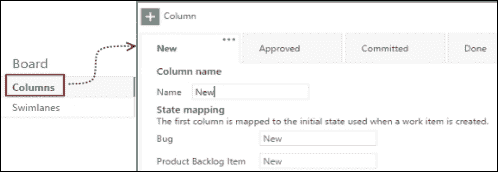
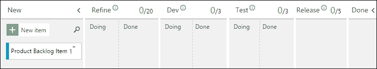
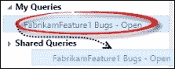
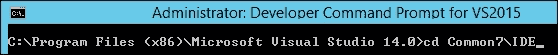
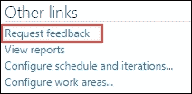

# 第三章：规划和跟踪工作

|   | *“没有计划的目标只是一个愿望。”* |   |
| --- | --- | --- |
|   | --*安托万·德·圣埃克苏佩里* |

本章将涵盖以下内容：

+   选择在团队门户上显示的待办事项级别

+   映射、分配和跟踪多个团队共享的工作项

+   向看板添加额外的列

+   自定义看板上显示的卡片

+   为冲刺设置团队的能力和活动

+   按标签查询工作项

+   使用工作项查询创建图表

+   使用服务钩子与 Trello 看板集成

+   在 TFS 中永久删除工作项

+   使用 Microsoft Feedback 客户端提供反馈

# 介绍

传统上，企业将技术视为业务成本；如今，企业将技术视为做更多生意的机会。用于关键决策的软件系统的使用正在比以往任何时候都增加。领先的公司已经意识到进入数字生态系统的好处，并正在利用技术作为竞争优势。为了跟上市场变化的步伐，软件系统也需要改变。

实施了但从未使用的需求，或者那些仅用于识别的需求，无法满足用户的需求，导致浪费、返工和不满。无论你是采用 Scrum、瀑布式还是其他交付方法，良好的需求管理是软件项目成功的基石。

在 TFS 中，工作项用于记录和跟踪工作。流程（正式称为流程模板）用于协调交付框架术语和工作流。虽然 TFS 预装了 Scrum、敏捷和 CMMI 流程模板，但 TFS 支持自定义现有流程并创建新流程，以最佳方式满足团队的需求。TFS 中的计划和跟踪工具是基于 Web 的，这意味着你可以在任何平台和设备上访问它们。

我们先介绍一些关键概念，以更好地理解 TFS 中的计划和跟踪工具。本章中的所有实例都基于 Scrum 流程模板。

+   **工作项**：用于记录工作。TFS 为不同类型的工作提供不同类型的工作项。任务、产品待办事项、功能、缺陷、测试用例和反馈响应是 TFS 中可用的不同工作项类型之一。请参考 [`bit.ly/1WWDPuB`](http://bit.ly/1WWDPuB) 了解更多关于工作项的信息。

+   **待办事项（Backlog）**：这是按优先级排列的工作项列表。TFS 为不同的规划级别提供不同的待办事项。在本章中，您将学习到关于史诗（Epics）、功能（Features）和待办事项（Backlog Items）的内容。TFS 中的待办事项允许您添加新项、优先排序、可视化不同待办事项之间的关系，并查看现有待办事项的状态。现在，您可以配置是否让 BUG 显示在待办事项中。TFS 中的待办事项视图还包括团队速度和累计流量的图表。有关待办事项的更多信息，请参阅[`bit.ly/1RZT9Qw`](http://bit.ly/1RZT9Qw)。

+   **区域路径（Area Path）**：这允许您为工作项添加分组维度。区域路径可以按团队、产品或功能区域对工作项进行分组。在团队项目中使用多个团队配置时，区域路径用于将工作项映射到一个团队。区域路径还支持按权限限制对工作项的访问。有关区域路径配置的更多信息，请参阅[`bit.ly/1j4baRr`](http://bit.ly/1j4baRr)。

+   **迭代路径（Iteration Path）**：这允许您为工作项添加时间维度。迭代路径可以用于将工作项按冲刺、发布或其他事件特定的里程碑进行分组。有关迭代路径配置的更多信息，请参阅[`bit.ly/1NAbyQh`](http://bit.ly/1NAbyQh)。

+   **看板（Kanban board）**：这是一种通过交付工作流程可视化待办事项的方式。TFS 中的每个待办事项都带有一个看板。看板在规划和跟踪待办事项中的工作项时非常有用。

+   **冲刺看板（Sprint board）**：这是一种可视化分配给某个迭代的工作项的方式。冲刺看板可以按待办事项或人员进行可视化。现在可以配置冲刺看板来显示或隐藏 BUG。

+   **过程（Process）**：这定义了在团队项目中遵循的交付框架。工作项类型、状态、工作流、查询和报告都反映了该过程及其术语。有关 TFS 中可用的不同过程的更多信息，请参阅[`bit.ly/1Sy1v1D`](http://bit.ly/1Sy1v1D)。

在本配方中，我们将使用 FabrikamTFVC 团队项目。如果您还没有 FabrikamTFVC 团队项目，请通过参考第一章中的*使用 Scrum 模板创建团队项目*配方来创建一个团队项目。

# 选择在团队门户上显示的待办事项级别

团队项目中的默认配置仅为每个团队提供两个待办事项级别。在 Scrum 模板中，这两个级别被称为功能（Features）和待办事项（Backlog Items）。


### 提示

史诗（Epics）是非常高层次的需求，代表着大量的工作。它们被拆解为功能（Features），并在多个冲刺中进行处理。根据[`bit.ly/1H5j1Kt`](http://bit.ly/1H5j1Kt)，它们也是安全实现所需的。

在本示例中，您将学习如何从团队管理控制台激活史诗积压。

## 准备工作

要创建新的团队，您需要是项目管理员组的成员。要更改团队设置，您需要是团队管理员。如果您尚未拥有这些权限，请按照[`bit.ly/1MS1Xn9`](http://bit.ly/1MS1Xn9)上的说明操作。

场景：`FabrikamTFVC`团队项目有两个团队，即 FabrikamFeature1 团队和默认的 FabrikamTFVC 团队。

+   **FabrikamTFVC 团队**：产品负责人、利益相关者和最终用户在史诗和特性积压上进行了大量协作。

+   **FabrikamFeature1 团队**：开发团队正在按照 FabrikamTFVC 团队优先级制定特性。

FabrikamTFVC 团队负责管理 Fabrikam 的史诗和特性工作项。FabrikamFeature1 团队负责处理由 FabrikamTFVC 团队分配给他们的特性工作项。FabrikamTFVC 团队只希望在其门户中看到两个层级的积压，即史诗和特性。FabrikamFeature1 团队希望在其门户中只看到一个层级的积压，即待办事项。

要创建 FabrikamFeature1 团队，请通过浏览到`http://tfs2015:8080/tfs/DefaultCollection/FabrikamTFVC/_admin`导航到 FabarikamTFVC 项目控制面板。点击**新建团队**按钮，输入团队名称为`FabrikamFeature1 团队`，然后点击**创建团队**按钮：


作为团队创建过程的一部分，创建了一个新的区域（**FabrikamFeature1 团队**），并映射到该团队。所有分配到区域路径 FabrikamFeature1 团队的工作项将显示在 FabrikamFeature1 团队的积压中。

## 操作步骤...

1.  通过浏览`http://tfs2015:8080/tfs/DefaultCollection/FabrikamTFVC/FabrikamTFVC%20Team/_admin`导航到 FabrikamTFVC 团队控制面板。点击**设置**导航到团队设置页面：

1.  在团队设置页面的**积压**部分，选中**史诗**并取消选择**待办事项**：

1.  导航到 FabrikamFeature1 团队控制面板。在团队设置页面的**积压**部分，取消选择**特性**：

1.  根据以下截图中显示的设置更新团队的积压视图。左侧的**FabrikamTFVC**团队只有**史诗**和**特性**的积压；**FabrikamFeature1 团队**只有**待办事项**的积压：

## 工作原理...

每个团队可以配置在团队门户中显示哪些积压。这使得团队可以专注于他们管理的积压，而不会被他们不使用的积压层级分散注意力。

## 还有更多内容...

团队设置页面还允许配置工作日。如果一个团队每周只工作 4 天，或者每周的星期一休息，而不是星期天休息，则可以通过更改工作日设置来进行配置。工作日用于计算团队的总容量，并在燃尽图中显示。这样做的目的是避免在燃尽图中显示团队的休息日，以免产生没有工作完成的错误印象。

Bug 工作项类型在积压项和看板上的行为也可以通过团队设置页面进行自定义：


Bug 在积压项和看板上的行为是可配置的，可以在积压项和看板上同时显示需求、在积压项和看板上同时显示任务，或者完全不出现在积压项和看板上。

这些设置都有强有力的论据；你可以在 [`bit.ly/1PL7SzD`](http://bit.ly/1PL7SzD) 找到一些优缺点。

# 映射、分配和跟踪多个团队共享的工作项

在一个团队项目中托管多个团队可以帮助你共享工作项、积压项以及其他工件，如代码、构建、测试和发布。在*选择在团队门户上显示的积压级别*这一食谱中，你学习了如何激活在团队门户上显示的积压级别。在这个食谱中，你将学习如何映射、分配和跟踪分配到多个团队的工作项。

## 准备工作

场景：FabrikamTFVC 团队项目有三个团队。FabrikamTFVC 团队专注于管理史诗和功能；另外两个团队负责管理他们所拥有的功能的产品积压项：


**史诗 1** 工作项被拆分为多个功能和产品积压项。FabrikamTFVC 团队希望在将这些工作项分配给不同的团队之前，先进行映射。FabrikamTFVC 团队希望跟踪各团队在**史诗 1**上的进展。

要设置这个场景，在 FabrikamTFVC 团队项目中创建一个新的团队 `FabrikamFeature2 团队`：


接下来，进入 FabrikamTFVC 团队门户并创建以下工作项：

| 工作项类型 | 标题 | 区域路径 |
| --- | --- | --- |
| 史诗 | 史诗 1 | FabrikamTFVC 团队 |
| 功能 | 功能 1 | FabrikamTFVC 团队 |
| 功能 | 功能 2 | FabrikamTFVC 团队 |
| 功能 | 功能 3 | FabrikamTFVC 团队 |
| 产品积压项 | 产品积压项 1 | FabrikamTFVC 团队 |
| 产品积压项 | 产品积压项 2 | FabrikamTFVC 团队 |
| 产品积压项 | 产品积压项 3 | FabrikamTFVC 团队 |

## 操作方法...

1.  打开 FabrikamTFVC 团队的团队网页门户并导航到功能积压项。点击**列选项**图标，并将**区域路径**添加为选中的列：

1.  切换**父项**开关为**显示**。所有孤立的功能（未关联到史诗类工作项的功能）将显示在名为**未关联功能**的标题下：

1.  切换**映射**开关为**开启**：

    将**功能 1**拖到**史诗 1**。这将把**史诗 1**映射为**功能 1**的父项。功能待办板会更新，以反映这一变化：

    

    重新父化也可以通过拖放来完成。将**功能 3**拖到**史诗 1**下，以将其重新父化为**史诗 1**：

    

    将功能 3 从未关联功能部分拖到史诗 1 史诗工作项下。

    拖放也可以用于层次列表中，以重新排序项的优先级。在以下截图中，**功能 1**被拖动到最上方，表示它的优先级高于**功能 2**：

    

    通过简单地拖放，**功能 1**可以被优先于功能 3。

    现在，按*准备工作*部分所示，映射其他功能和产品待办事项。多选拖放也得到支持：

    

    如*准备工作*部分所示，映射其他功能和产品待办事项。

1.  将产品待办事项分配给**FabrikamFeature1**和**FabrikamFeature2 Team**，如*准备工作*部分所示。通过将区域路径更改为相应团队的区域路径，可以更改团队分配。

1.  一旦待办事项的分配发生变化，未分配给 FabrikamTFVC 团队的工作项会在其前面显示一个空心矩形。这简化了跟踪团队拥有的和未拥有的项目：

## 它是如何工作的...

显示父项允许团队独立于工作项分配给哪个团队来跟踪工作项的完整层次结构。待办事项中的工作项，如果该团队没有拥有，前面会显示一个空心矩形。

总结来说，你学会了如何使用故事映射功能来映射工作项；这还有助于识别未关联的工作项。你还学会了如何在待办事项中拖放工作项，以重新排序待办事项中的工作项优先级。你学会了如何通过启用**显示**父项开关来查看工作项层级结构。最后但同样重要的是，你还学会了如何识别分配给不同团队的工作。

## 还有更多...

让我们来看看在待办事项视图中工具栏窗口中的一些有用选项：


+   **新建**：启动**添加新工作项**小部件。当你想将一个想法记录到待办事项中时，这非常有用。

+   **展开全部**：这将展开所有折叠的嵌套待办事项。

+   **折叠全部**：这将折叠所有展开的嵌套待办事项。

+   **创建查询**：通过复制用于生成此操作触发的待办事项视图的查询来创建新的工作项查询。

+   **列选项**：用于在待办事项视图中添加或移除列。此设置是针对每个用户的，您所做的更改不会影响其他用户的视图。

+   **电子邮件**：此选项会将您在待办事项中看到的视图通过电子邮件发送给您。如果您过滤了项，然后点击**电子邮件**，它只会显示过滤后的视图中的电子邮件。

+   **筛选器**：此文本框可在待办事项视图中进行文本搜索。这对于通过搜索关键字来缩小待办事项项的范围非常有用。

### 注意

TFS 2015 Update 1 提供了对多选拖放分配、重新排序、重新归类、多重编辑、移动到迭代和移动到位置的支持。

# 向看板添加额外的列

TFS 中的看板提供了待办事项的可视化表示。该看板可以根据贵组织中使用的交付工作流进行建模。在本教程中，您将学习如何向看板中添加额外的列并配置工作流。

### 提示

"Kanban"（看板）这个名称源自日语，粗略翻译为“告示牌”或“广告牌”。在软件开发的背景下，看板可以指一种可视化的过程管理系统，告诉你该生产什么、何时生产以及生产多少量（[`bit.ly/1j4bT57`](http://bit.ly/1j4bT57)）。

## 准备工作

您需要是团队管理员或团队项目管理员组的成员，才能自定义看板。

场景：FabrikamFeature1 团队为每个待办事项使用**开发**、**测试**和**发布**工作流，然后标记为**完成**。团队为周期中的每个阶段设有退出标准。FabrikamFeature1 团队的测试能力有限。为了限制**测试**中的项，已为**开发**中的项设置了限制：


## 如何操作...

1.  通过浏览到**FabrikamFeature1 Team**门户并点击**待办事项项**待办事项中的看板，导航到 FabrikamFeature1 团队的看板：

1.  点击页面右上角的齿轮图标。此图标用于启动**设置**窗口。齿轮图标左侧的图标是搜索图标，可以用于在待办事项中执行文本搜索。齿轮图标右侧的图标用于将看板视图最大化为全屏模式：

1.  在**设置**窗口中，从**看板**部分选择列。这将显示现有列的配置。可以为**Bug**和**产品待办事项项**（这些是需求类别中的默认工作项类型）配置设置：

    通过使用设置窗口添加新列来配置看板

1.  点击绿色加号图标添加新列。将列命名为`精化`，设置 WIP 限制为`20`并将列拆分为进行中和完成。将此列映射到工作项状态**已批准**。添加完成定义，如下图所示（**完成**文本框中写入的文本可以使用 Markdown 格式化）：

1.  将**已批准**列重命名为`开发`，将状态映射更改为**已承诺**，将 WIP 限制设置为`3`，勾选**将列拆分为进行中和完成**复选框，并添加完成定义，如下图所示：

1.  将**已批准**列重命名为`测试`，设置 WIP 限制为`2`，保持工作项状态为**已承诺**，勾选拆分列为进行中/已完成，并添加完成定义。

1.  点击绿色加号图标添加新列。将列命名为`发布`，设置 WIP 限制为`5`，不将列拆分为进行中和完成。将此列映射到工作项状态**已承诺**。添加完成定义。点击**保存并关闭**返回到待办事项看板。

1.  看板板现在已经配置为 FabrikamFeature1 团队用于交付其产品待办事项的交付工作流：

## 它是如何工作的...

看板板可以在团队级别进行配置，这使团队能够定义并遵循最适合他们的流程。每个待办事项列表可以配置一个看板板。因此，如果团队有史诗、功能和待办事项，则团队将有三个看板板，可以自定义并用于管理工作。

传统上，流程需要自定义以在工作项中添加额外的状态。2013 年，产品中引入了一种新的扩展性模型——**WIT 扩展**。WIT 扩展允许创建新的工作项字段，并将其关联到工作项状态，而无需对工作项进行任何自定义。有关 WIT 扩展如何在运行时动态更新工作项定义的更多信息，请访问[`bit.ly/1N7FAAt`](http://bit.ly/1N7FAAt)。

在我们在此配方中所涉及的场景中，**Dev**、**Test**和**Release**字段都与已承诺状态相关联。当工作项从**Approved**转换为**Committed**时，它会出现在**Dev** / **Doing**列中。负责该工作项的人员可以在更改完成且符合完成定义后，将工作项提升到**Dev** / **Done**列。工作项的状态将继续显示为**Committed**。当负责测试的人员准备好测试更改时，工作项可以拉入**Test** / **Doing**列。工作项的状态将继续显示为**Committed**。当更改经过测试并符合完成定义时，可以将工作项提升到**Test** / **Done**列。工作项的状态将继续显示为**Committed**。一旦团队准备好安排发布，工作项可以拉入**Release**列。工作项的状态将继续显示为**Committed**。

一旦更改成功发布，工作项可以移至**Done**列。这将更新工作项的状态，从**Committed**变为**Done**：


工作项状态转换历史


工作项字段转换历史，显示从 Dev\Done 列到 Test\Doing 列的转换

将列拆分为**Doing**和**Done**可以更好地展示工作的进展。看板上的工作项字段用于生成累积流图。该图提供了每列花费时间的可视化表示。这对于识别价值流动和交付过程中的潜在瓶颈非常有用：


累积流图

### 注意

累积流图上的日全食可以用来定制图表的开始日期。

看板还让你监控在制品（WIP）的数量。例如，如果**Test**列中的在制品数量超过 3 个限制，WIP 会变成红色，表示违反限制。

点击列名旁的信息图标可以显示完成定义，如下图所示：


点击信息图标显示完成定义

看板还支持折叠**New**和**Done**列。看板也可以最大化为全屏视图。

## 还有更多...

任务可以直接从看板中添加到产品待办事项中。看板还会显示工作项卡上的已完成任务数与总任务数的对比：


可以直接从产品待办事项卡片中添加任务到看板。

看板还支持横向泳道。最常见的用法是创建“加急泳道”，用于紧急工作，可以跳过队列并抢先处理其他工作。泳道可以从**设置**窗口配置；可以通过点击看板上的齿轮图标来启动**设置**窗口：


配置窗口允许配置泳道的顺序。在此情况下，加急泳道会显示在默认泳道上方。泳道可以折叠。工作项可以在泳道之间移动，泳道的移动也会在工作项历史记录中进行跟踪。

在 TFS 2015 Update 1 中，新增了三个字段：**Board Column**、**Board Column Done** 和 **Board Lane**，用于在看板上查询工作项。以下截图演示了如何查询 FabrikamFeature 1 团队看板上默认泳道中的所有工作项，且这些工作项被分配到**测试** / **进行中**列：


看板列现在可以进行查询、图表分析和提醒。有关使用案例和设置操作指南，请参考[`bit.ly/1MS3QA8`](http://bit.ly/1MS3QA8)。

# 自定义显示在看板上的卡片

看板有助于可视化、跟踪和共享待办项的进展。另一方面，冲刺看板帮助可视化、跟踪和共享团队在冲刺中的进展。Web 门户中的这两个看板都是有用的信息发布器，有助于工作计划和跟踪。工作项以卡片形式显示在看板上。在 TFS 2015 及 Update 1 版本中，看板新增了多个功能，使得卡片更加可操作。在本指南中，您将学习如何自定义卡片，显示附加的工作项字段，并根据规则对卡片进行样式化。

## 准备工作

您需要是团队管理员或团队项目管理员组的成员，才能自定义团队设置。

本指南中的场景：FabrikamFeature1 团队希望在所有待办项卡片上显示**工作项 ID**、**标签**、**创建者**、**工作量**、**优先级**和**价值领域**字段。该团队仅希望在 Bug 卡片上显示**创建者**、**分配给**和**标识于**字段。该团队希望所有优先级为 1 的项目卡片使用粗体标题和灰色背景。

## 如何操作...

1.  在 FabrikamFeature1 团队门户中，通过浏览`https://tfs2015:8080/tfs/FabrikamTFVC/FabrikamFeature1%20Team/_backlogs/board/Backlog%20items`进入待办事项视图。

1.  导航到看板视图并点击齿轮图标以启动**设置**窗口。在**设置**窗口中，从卡片部分选择字段。

1.  在**产品待办项**标签页中，勾选所有核心字段：

1.  从附加字段中添加**价值领域**、**创建者**和**优先级**字段：

1.  默认情况下，如果工作项卡片中的字段没有值，则该字段会被隐藏。你可以选择通过勾选**显示空字段**复选框来更改此行为：

1.  切换到**Bug**标签页，并选择所有核心字段。在附加字段中，添加**识别于**字段。

1.  在**设置**窗口中，从卡片部分下选择**样式**。添加一个新的样式规则，并将规则命名为`Priority 1`。将卡片颜色更改为灰色，并将卡片标题设置为粗体。在规则标准中，设置规则标准为*priority = 1*。一个规则标准中可以添加多个字段：

    ### 注意

    请注意，每个看板和冲刺板的样式规则可以单独配置。

1.  点击**保存**并关闭。看板中的工作项将刷新，并根据规则显示额外的工作项字段和样式。样式规则使得包含重要信息的卡片更为突出。当一个工作项符合多个规则时，将使用第一个规则。

卡片上的所有工作项字段可以直接在卡片内更新，这使得卡片更加具有操作性。

# 设置团队的容量和活动以进行一个冲刺

在本章前面的配方中，你了解了产品待办事项。如果产品待办事项是工作的需求，那么冲刺待办事项则是完成这些工作的计划。为了规划冲刺的工作，团队需要了解总的可用容量。直到 TFS 2015，团队容量功能仅限于每个成员每个冲刺一个活动。在本配方中，你将学习如何为每个团队成员在冲刺中输入多个活动和容量。

## 准备工作

场景：FabrikamFeature1 团队将在明天开始为期两周的下一次冲刺。团队由八名成员组成，其中几位成员在此期间有计划的假期。团队希望了解本次冲刺的总可用容量。

要添加一个新的冲刺并配置冲刺的开始和结束日期，请通过浏览`http://tfs2015:8080/DefaultCollection/FabrikamTFVC/FabrikamFeature1%20Team/_admin`导航到 FabrikamFeature1 团队的控制面板，并切换到**迭代**标签页。点击**新建子项**按钮，在 FabrikamTFVC 下添加一个新的迭代；双击该迭代以设置日期：


## 如何操作...

1.  通过浏览`http://tfs2015:8080/DefaultCollection/FabrikamTFVC/FabrikamFeature1%20Team/_backlogs`，导航到 FabrikamFeature1 团队工作中心。新添加的冲刺将在此页面的左侧显示。点击**Sprint 1**并转到**容量**标签页：

1.  点击**添加缺失的团队成员**图标（如图中所示），以添加所有缺失的团队成员：

1.  设置活动和每天的小时数，如以下截图所示。使用行末的省略号为个人添加多个活动：

1.  John 在本次冲刺中无法参与团队工作。通过点击行末的省略号并在上下文菜单中选择**删除该用户**，将 John 从列表中删除：

1.  点击**团队休假日**旁边的日期超链接，以更新团队的休假日，如以下截图所示：

    个人的休假天数可以通过点击休假日列中的日期超链接来更新，这有助于使团队容量更加准确。

1.  点击**保存**图标保存团队的容量。团队的总容量、按活动划分的团队容量和每个团队成员的容量会在工作详情面板中更新。

## 如何操作...

在*选择在团队门户上显示的待办事项层级*的教程中，你了解到团队的工作日是通过团队设置窗口进行配置的。团队的工作日用于推算冲刺的总工作小时数。任何团队或个人的休假天数都会从总工作小时数中扣除；这有助于我们得出团队在冲刺中的可用容量。在工作详情部分，活动和个人会影响团队容量。

团队容量在规划冲刺活动时非常有用；在跟踪进度和在团队成员之间平衡工作时同样有用。要查看工作详情面板的操作，拖动**产品待办事项 1**到**冲刺 1**。使用产品待办事项旁边的**+**符号创建一些任务，如以下截图所示：


现在，切换到冲刺板，并通过更改卡片上的**分配给**字段将这些任务分配给团队成员。你可以选择性地将冲刺板上的**按人分组**字段从待办事项改为人员，这有助于你按个人查看任务分配。现在，切换回待办事项视图；工作详情部分会更新，反映出按活动和个人的工作分配情况：


任务可以直接分配给工作分配面板中的个人。如以下截图所示，**PBI 1 – 任务 2**被通过拖动任务到 Chris 的工作分配面板中，分配给了 Chris：


当团队、活动或个人分配的工作超过可用容量时，工作分配面板中的容量条会变红。

## 还有更多...

Sprint 燃尽图帮助你识别冲刺中的工作完成趋势，并展示冲刺中剩余的工作量。Web Portal 中的 Sprint 燃尽图还显示了可用的工作容量和理想燃尽量。关于 Sprint 燃尽图的更多信息可以参考[`bit.ly/1MiMTlm`](http://bit.ly/1MiMTlm)。

速度代表团队在一次冲刺中完成的总工作量。一旦团队完成了几个冲刺，你就可以开始看到已完成工作的趋势。这些数据对于预测未来冲刺的工作量非常有用。关于速度计算的更多信息可以参考[`bit.ly/1H5nkoU`](http://bit.ly/1H5nkoU)。

# 通过标签查询工作项

工作项标签是将关键词与工作项关联的好方法。这些关键词作为元数据帮助你对工作项进行分组、搜索和过滤。在本教程中，你将学习如何通过标签查询工作项。

## Getting ready

所有项目有效用户组成员都有权限创建标签。利益相关者的访问级别不允许创建标签。利益相关者只能使用已有标签标记工作项。

场景：FabrikamTFVC 团队有一个功能待办事项列表，他们希望通过发布预计将要发布的功能来进行标记。尚未审核的功能需要标记为**Pending Review**。产品负责人希望创建一个工作项查询，查询标签为发布版本 1（排除任何标记为阻塞的工作项）的工作项，并将查询结果与利益相关者共享。

可以通过打开工作项表单并点击**添加**图标来为工作项添加标签。从列表中选择现有标签或添加新标签：


在 FabrikamTFVC 功能待办事项中，将需要在版本 1 中发布的功能标记为**R1**，版本 2 中发布的功能标记为**R2**，尚未审核的功能标记为**Pending Review**：


将需要在版本 1 中发布的功能标记为 R1，版本 2 中发布的功能标记为 R2，尚未审核的功能标记为 Pending Review。

## How to do it...

1.  若要查看预计将在**R1**中发布的工作项，请导航到 FabrikamTFVC 团队门户中的功能待办事项。点击漏斗按钮加载标签工具栏；标签工具栏按计数显示标签列表：

1.  点击**R1**，筛选出标记为 R1 的功能待办事项。其中一个标记为**R1**的项目也被标记为**Blocked**。点击**All**以移除标签筛选条件：

1.  从工作中心导航到查询页面。点击**New**图标，从下拉菜单中选择新查询。在查询编辑窗口中，添加一个标签的过滤条件，如下图所示：

1.  如果你希望在不保存查询的情况下复制此查询的 URL，可以点击**复制查询 URL**按钮：

1.  从弹出窗口按*Ctrl* + *C*复制。将此 URL 通过电子邮件发送给利益相关者。该 URL 将直接显示工作项结果。该临时 URL 将在 90 天后自动过期：

## 还有更多...

看板板块支持通过标签进行样式设置。此自定义可以在待办视图中的团队设置窗口中进行。若为一个标签指定了多个样式规则，则第一个匹配规则优先。在下面的截图中，标签**R1**已设置为黄色：


# 使用工作项查询创建图表

**工作项查询**（**WIQ**）提供了根据具体需求筛选工作项的方法。WIQ 使用一种名为**工作项查询语言**（**WIQL**）的自定义语言；该语言的复杂性被隐藏在工作项查询编辑器之后。WIQ 返回工作项列表，有时你可能需要可视化工具来分析结果。数据可视化工具有助于发现那些可能被忽略的趋势。团队门户中的轻量级图表功能允许你使用 WIQ 创建图表。在这个教程中，你将学习如何使用 WIQ 创建并共享图表。

## 准备开始

利益相关者访问级别不允许创建图表。需要**基础**或**高级**访问级别才能创建图表。

场景：FabrikamFeature1 团队希望追踪过去 12 周应用程序中未解决的 BUG 趋势。

以下截图展示了如何使用筛选条件创建新的 WIQ。点击**列选项**图标，将**状态**列包含在查询结果中：


将查询保存为`FabrikamFeature1 Bugs - Open`并存入`我的查询`文件夹：


## 如何操作...

1.  在查询页面，打开**FabrikamFeature1 Bugs - Open**查询并点击**图表**标签：

1.  点击**+**图标以启动新图表窗口，从**趋势**部分选择**区域**，并将图表命名为`Feature1 Bugs 12 Weeks - Trend`。将范围更改为 12 周：

1.  你可以通过点击图表并从颜色选择器中选择颜色来编辑图表的颜色。点击图表并选择红色。点击**确定**关闭：

1.  新图表已加载到**图表**标签中：

1.  如果你点击图表右上角的日蚀图标，你将看到编辑或删除图表的选项。为了与团队分享图表，首先需要共享基础的工作项查询。将工作项查询从`我的查询`拖动到`共享查询`文件夹中：

    将工作项查询从“我的查询”拖动到“共享查询”

1.  现在图表中的“日食”图标让你可以将图表分享至某个仪表板。选择**技术债务**仪表板（仪表板可以自定义；请参考第一章中的*配置团队项目仪表板*配方，*团队项目设置*）：

1.  图表被添加到**技术债务**仪表板：

## 它是如何工作的……

在 Web 门户中可以创建两种类型的图表：快照图表和趋势图表。快照图表只是将工作项查询的结果表示在图表上。趋势图表使用 TFS 中的数据，计算所选时间段内的查询结果。趋势图表可以显示最多过去一年的趋势。

图表是使用事务数据库中的工作项数据计算得出的。当工作项更新时，图表会立即反映更新。只有平面工作项查询可以用于创建图表。如果你尝试使用其他查询类型创建图表，将显示以下警告消息：


# 使用服务钩子集成 Trello 看板

传统上，依赖于 TFS 数据的应用程序会不断轮询 TFS 以检查更新。服务钩子是 TFS 2015 中引入的新功能，提供了将 TFS 中的事件级联到另一个应用程序的方式。当一个应用程序在 TFS 中注册事件通知时，会在 TFS 与该应用程序之间创建一个安全队列。当该应用程序注册的事件在 TFS 中发生时，它会立即发布到应用程序。这消除了应用程序需要轮询 TFS 以检查更新的需求。

如果你不熟悉 Trello，它是一个非常棒的基于 Web 的工具，帮助你设置几乎所有任务的看板。许多组织使用 Trello 看板进行产品规划。你可以在 [`trello.com`](https://trello.com) 了解更多关于 Trello 的信息。

在本配方中，你将学习如何创建一个服务钩子，将来自 TFS 团队门户的新功能工作项安全发布到 Trello 的看板上。

## 准备工作

权限：要配置服务钩子，你需要是团队项目管理员组的成员。

在接下来的几步中，我们将配置一个 Trello 看板，用于后续发布数据：

1.  通过浏览 [`trello.com/signup`](https://trello.com/signup) 进入 Trello 注册页面。输入你的详细信息并点击**创建新账户**按钮。

1.  使用你的帐户登录 Trello，并创建一个新团队。将团队命名为 `Fabrikam`：

1.  创建一个新的看板并命名为 `Feature Tracker`：

    点击“看板”以创建 Fabrikam 团队的新看板，并将看板命名为 Feature Tracker

1.  导航至**Feature Tracker**看板，添加**待办事项**、**进行中**和**已完成**列表：

## 如何操作…

1.  通过浏览`http://tfs2015:8080/tfs/DefaultCollection/FabrikamTFVC/_admin/_servicehooks`导航到 FabrikamTFVC 服务钩子，进入团队管理控制台：

    为项目创建第一个订阅

1.  点击**为该项目创建第一个订阅**超链接，并从新订阅窗口中选择**Trello**。点击**下一步**以进入**触发器**窗口。

1.  在**触发器**窗口中，将选择更改为**工作项创建**事件，设置区域路径为**FabrikamTFVC**，工作项类型为**功能**。点击**下一步**：

1.  在**设置**窗口中，选择**立即获取**超链接以获取授权令牌。该令牌由 Trello 发放，允许 TFS 访问你的 Trello 看板：

1.  点击**登录**并使用 Trello 登录信息进行身份验证：

1.  复制 Trello 发放的授权令牌：

1.  在**服务钩子触发器配置**窗口中，输入如下截图所示的详细信息：

1.  点击**测试**以使用配置触发测试：

1.  点击**完成**以完成配置。

1.  要尝试 TFS 和 Trello 之间的集成，浏览`http://tfs2015:8080/tfs/DefaultCollection/FabrikamTFVC/_backlogs#level=Features`导航到 TFVC 功能待办事项。向待办事项中添加一个新功能，如下截图所示：

1.  现在，导航到 Trello 看板。此功能也已在 Trello 中的**Feature Tracker**看板中创建：

## 如何运作…

当 TFS 中发生事件时，项目中所有启用的订阅都会被评估。对于所有匹配的订阅，都会执行消费者动作。在这种情况下，Trello 的订阅被执行，结果是在 Feature Tracker 看板的待办事项列表中生成一张新卡片。

团队管理控制台中的服务钩子配置屏幕显示了 14 天内每个订阅的流量情况：


服务钩子配置窗口允许你配置卡片标题和描述的格式。向导支持占位符表达式。在以下截图中，卡片标题被配置为`工作项类型 #工作项编号: 工作项标题`格式：


使用服务钩子将数据从 TFS 发布到其他系统时，有一点非常重要，那就是 TFS 权限不会级联到其他系统。例如，FabrikamTFVC 团队有四个成员；但是，如果 Trello 看板是公开的，那么工作项卡片将对任何人可见。

## 还有更多…

TFS 还提供了其他的服务钩子。可以在[`bit.ly/1l0OZgi`](http://bit.ly/1l0OZgi)找到支持的服务钩子完整列表。

# 永久删除 TFS 中的工作项

工作项用于在 TFS 中捕获、规划和跟踪工作。工作项中的 **历史** 标签提供了对该工作项所做更改的完整审计跟踪。创建一个后续决定不再需要的工作项是常见的做法。可以通过将工作项状态更改为 **已移除**，从待办事项中排除该工作项；但是，工作项并未被删除。目前，用户界面中没有永久删除工作项的功能。在本食谱中，您将学习如何使用 `witadmin` 命令行工具永久删除工作项及其所有历史记录。

### 提示

使用`witadmin`命令删除工作项会将工作项永久从 TFS 数据库中移除，无法恢复或重新激活。

## 准备工作

要使用 `witadmin` 命令删除工作项，您需要是该集合中项目管理员组或团队基础管理员组的成员。

## 如何操作…

1.  以提升权限打开 Visual Studio 开发人员命令提示符并运行以下命令。导航至 `Common7\IDE` 文件夹：

1.  运行以下命令以永久删除工作项 ID：`15`、`16` 和 `17`：

    ```
    witadmin destroywi /collection:http://tfs2015:8080/tfs/DefaultCollection /id:15,16,17

    ```

1.  当提示时，按 *Y* 以确认此操作不可恢复：

## 工作原理…

`witadmin`命令行工具集包含一系列命令和开关，允许您在团队项目中导入、导出和管理工作项。在本食谱中，我们使用了`detroywi`命令，它会永久删除命令中指定的工作项。

由于工作项 ID 在整个集合中是唯一的，因此无需提供团队项目名称；`/collection`开关用于指定工作项所属的团队基础集合。`/id`开关用于指定一个或多个工作项 ID。`/noprompt`开关可以选择性地用于禁用确认提示。

# 使用 Microsoft Feedback Client 提供反馈

与利益相关者保持持续的反馈循环有助于软件开发团队生产更好的软件。有时，来自利益相关者的反馈会丢失，因为它是口头的，或者根本没有被跟踪。开发团队与利益相关者之间的反馈循环可以通过使用简化反馈捕捉和跟踪的工具来改进。在本食谱中，您将学习如何使用 Microsoft Feedback Client 提供反馈。

## 准备工作

本食谱要求您安装 Microsoft Feedback Client。可以从[`bit.ly/1H5osc8`](http://bit.ly/1H5osc8)下载独立安装程序。

### 提示

提交反馈不需要许可证。由于 TFS 中没有匿名用户的概念，反馈只能从 TFS 中已设置的用户请求。所有拥有相关权限的利益相关者可以通过响应反馈请求或选择性地通过 Microsoft Feedback Client 提交反馈。不过，请求反馈和查看已提交的反馈需要高级许可证。

在接下来的几个步骤中，您将学习如何从团队 Web 门户中提出反馈请求：

1.  转到 FabrikamFeature1 团队的 Web 门户。在“其他链接”部分，点击**请求反馈**：

    ### 注意

    如果您看不到**请求反馈**超链接，说明您的访问类型设置不正确。请将自己添加到**高级**访问类型中。

1.  这将启动**反馈请求**窗口。反馈请求表单包括一个部分，用于提供有关如何启动应用程序的信息，一个部分，用于指定反馈应关注的内容，最后但同样重要的，是一个部分，用于指定您希望征求反馈的用户列表。按照以下截图所示填写反馈请求表单。

1.  输入您希望请求反馈的人员的姓名：

    ### 注意

    您不能请求没有 TFS 访问权限的用户提供反馈。

1.  指定用户如何访问应用程序。可用的选择有**Web 应用程序**、**远程机器**和**客户端应用程序**。这将生成一个可操作的链接，用户可以点击该链接直接从反馈请求启动应用程序：

1.  通过指定您希望收到反馈的区域来提供方向。可以通过点击**添加反馈项**超链接添加多个反馈项：

1.  点击预览图标以预览反馈请求：

1.  点击**发送**后，反馈请求将发送给 John 和 Tom。

## 如何做...

1.  利益相关者收到反馈请求电子邮件。可以通过点击电子邮件中的**开始反馈会话**超链接来启动反馈会话。当会话开始时，您会注意到反馈请求表单中填写的说明会加载到反馈会话中：

1.  Microsoft 反馈客户端允许屏幕和语音录制，并且在反馈捕获过程中可以包含截图和附件，以及评论：

1.  也可以在反馈响应中添加总体评分：

1.  一旦反馈响应完成，团队门户中的反馈响应瓷砖将反映这一变化：

    反馈响应

## 它是如何工作的...

反馈响应记录在工作项中。如下面的截图所示，工作项包含了通过 Microsoft Feedback Client 捕获的所有详细信息。作为工作项的反馈响应，能为你提供工作项的所有优势。我们已经在本章中介绍了其中的一些功能，例如跟踪、标记、固定、仪表板和报告：


反馈响应记录在工作项中。工作项的状态部分显示了反馈项的创建者、分配对象、状态和总体评分。
